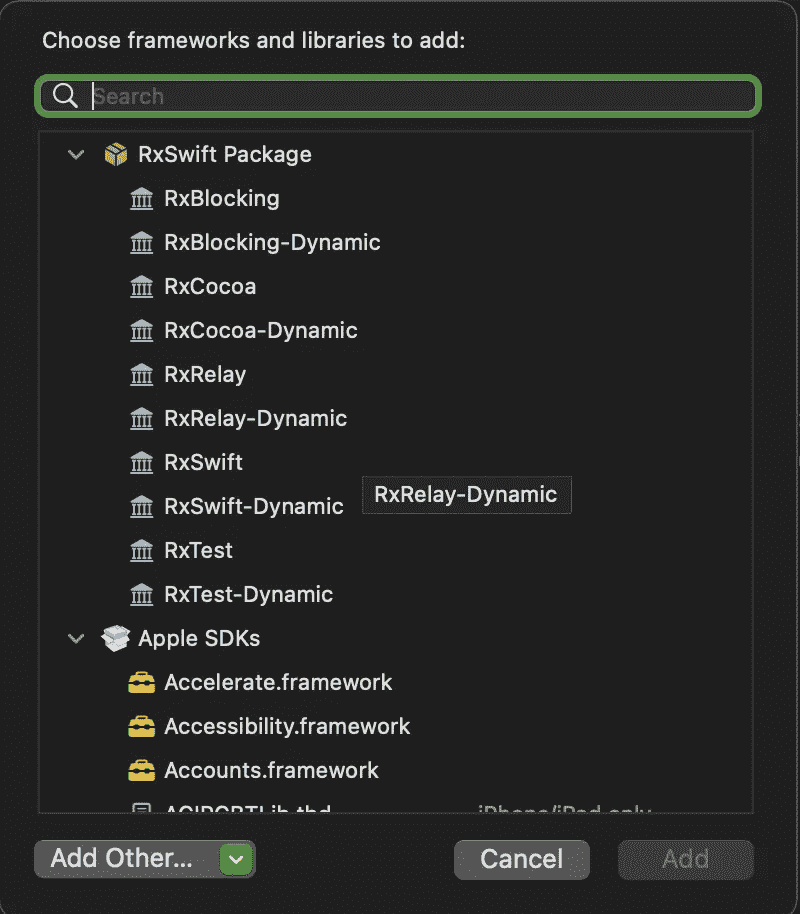
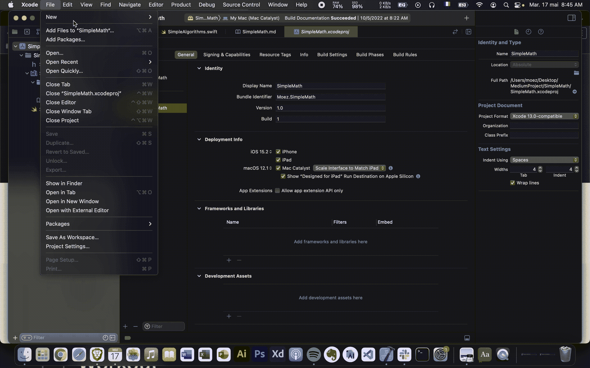
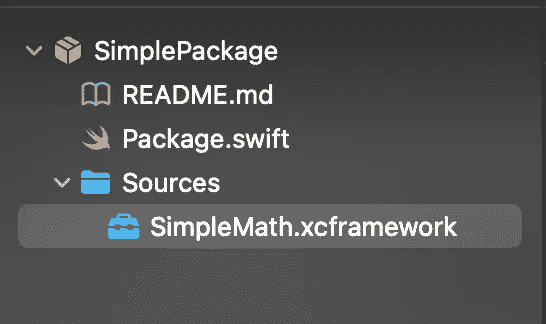
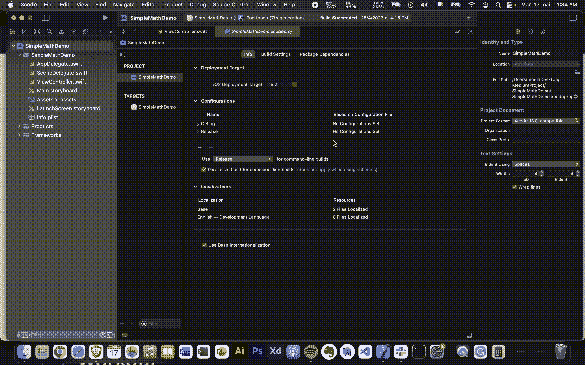
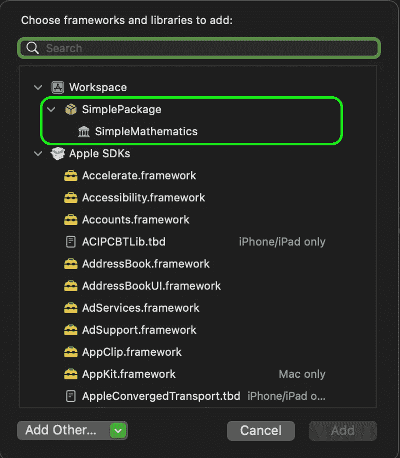
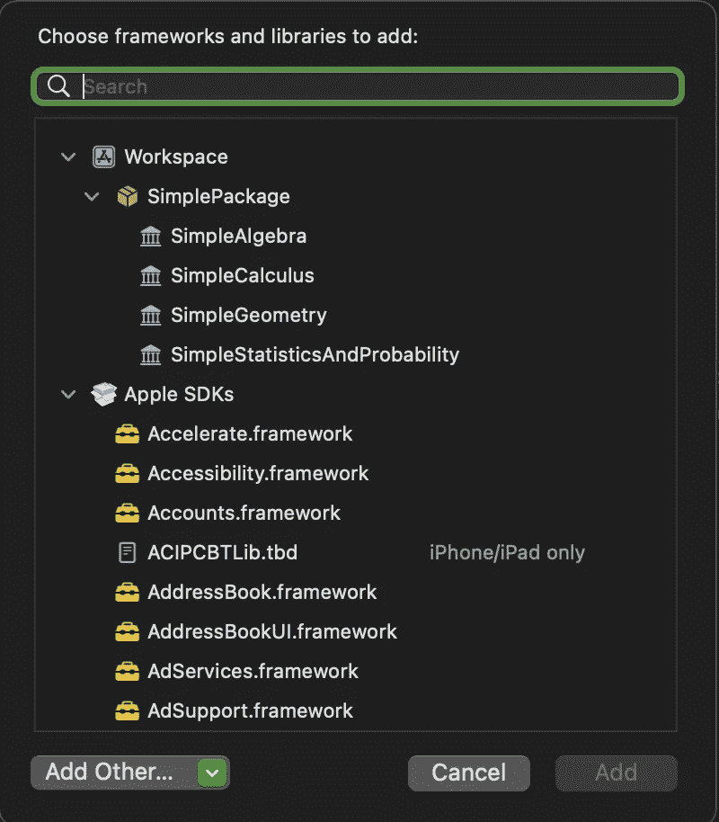

# 通过打包实现模块化——如何创建 iOS 框架 Pt3

> 原文：<https://itnext.io/modularity-through-packaging-how-to-create-an-ios-framework-pt3-f736f38c5bae?source=collection_archive---------1----------------------->

到目前为止，在本系列的[中，我们创建了一个简单的整体框架，但是一旦你的框架开始扩展到一个更大的项目中，你将会意识到一些特性是足够不同的，以至于可以单独被认为是模块。](https://medium.com/@elmoezamira/list/how-to-create-an-ios-framework-739461924d14)

在今天的帖子中，我们的目标是创建单独的模块来隔离框架的主要功能，因为 Swift 不支持子模块，我们将使用 Swift Package Manager 来模块化我们的项目。

由[拍摄的照片由](https://unsplash.com/@mildlee?utm_source=medium&utm_medium=referral)在 [Unsplash](https://unsplash.com?utm_source=medium&utm_medium=referral)

## Swift 本身不支持子模块

如果您曾经使用过像苹果 CoreImage 这样的旧 iOS 框架，那么您可能会注意到，可以像下面这样将子模块导入到您的 swift 项目中。

我的意思是你不能**【创建】**一个 swift 子模块，解释为什么前面一行代码工作很简单，像 CoreImage 这样的框架是用 objective-c 语言写的，而不是 swift。

## SPM 是什么？

Swift Package manager 最初是作为服务器端 Swift 的工具推出的，它是 Xcode 自带的依赖项管理器，该工具使我们能够自动完成下载、编译和链接依赖项的过程。

## Swift 包裹

Swift 包是可重用组件的集合，它们包含**源文件**和一个叫做 **package.swift** 的**清单文件**。

清单文件使用**包描述**模块来定义包的名称及其内容。大多数包只包含一个目标，但是对于像 [RxSwift](https://github.com/ReactiveX/RxSwift) 这样的大规模框架来说，拥有多个模块是必要的。

> 尽管名称如此，swift 包也可以包含非 Swift 代码(基于 C 的语言，如 obj-c、C 和 c++)

为了理解这篇文章的最终输出是什么样子，下面是一个类似于 [RxSwift](https://github.com/ReactiveX/RxSwift) 的包的样子:

它是一个包含许多库的包，下载包后，开发者(框架用户)可以自由使用任何组件(库)。

## 为什么要模块化你的框架？

模块化对双方都有好处，作为一个框架作者，你将能够分离你的代码，这使得可测试性更容易实现。你也将有一个更短的编译时间。

作为一个框架用户，模块化允许只将框架的某些部分导入到您的项目中，说得够多了，让我们转到实现部分吧！

# 创建 swift 套餐:

让我们从创建一个新包开始:文件>新建>项目>包

文件>新建>项目>包

下一步是不必要的，对于一个更干净的项目，删除源文件夹中的**测试文件夹**和**简单包**文件夹，我们在这个项目中不需要它们。

现在一切就绪，让我们来看看清单文件中有什么:

清单文件包含包的定义，包对象需要 4 个字段:名称、产品数组、依赖项数组和目标数组。

在对我们的清单文件做任何修改之前，让我们把我们在第一部分中创建的框架[添加到源文件中:简单数学。](https://medium.com/@elmoezamira/build-your-first-xcframework-how-to-create-an-ios-framework-pt-1-d1a889fdb40d)

删除 targets 数组中的 target 和 testTarget，改用 binaryTarget，将其命名为 SimpleMath，并为其提供我们刚刚添加的 XCFramework 的正确路径。

我们的包已经准备好了，让我们将它添加到我们的演示应用程序中:

包依赖关系> "+"按钮>添加本地>你的包的路径>添加包

最后，转到您的目标>框架和库>“+”按钮，您应该在工作区部分看到您的包，添加它

我们介绍了创建本地 Swift 包的基础知识，让我们利用这些新获得的技能来模块化框架。

## 扩展您的包/模块化您的项目:

让我们假设你的框架扩展成一个大项目，你决定为不同的数学分支创建单独的模块:代数、几何、微积分、统计和概率。因为我们已经在以前的文章中介绍了如何创建一个框架，以及如何在今天的文章中将二进制目标添加到您的包中，所以解决方案对您来说应该是清楚的:创建 4 个不同的小框架，每个包含与数学的四个分支相关的函数，将它们添加到 sources 文件夹中，然后对您的清单文件进行必要的更改。

我不会仅仅为了演示而从头开始创建 4 个真正的框架，因为今天的帖子关注的是如何模块化(而不是框架的内容),但是在这种情况下你应该怎么做

您的包应该是这样的:

你的框架用户应该能够只添加他需要的模块。

> 更新:从 Xcode 13.3 开始，如果 binaryTarget 的名称与 XCFramework 的名称不匹配，Xcode 将抛出以下错误“找不到目标[目标名称]的工件”

## 结论:

Swift Package Manager 使我们能够成功创建包含独立框架模块的软件包。虽然我们达到了系列中的另一个里程碑，但是我们还没有充分利用 SPM，到目前为止，我们的包仅可用于本地使用，我们将在下一篇文章中讨论[远程包以及如何分发您的框架](https://medium.com/@elmoezamira/distribute-your-framework-how-to-create-an-ios-framework-pt4-b9ba478e194d)！

这标志着这篇文章的结束，所以请务必点击鼓掌按钮👏👏如果你喜欢的话。

如何创建一个 iOS 框架是一个**周刊**系列，所以**在**媒体**或 [**推特**](https://twitter.com/elmoezamira) 上关注我**来了解最新的帖子，像往常一样，你的反馈总是令人感激的。

编码快乐！

[El Moez Amira](https://medium.com/@elmoezamira?source=post_page-----f736f38c5bae--------------------------------)

## 如何创建 iOS 框架

[View list](https://medium.com/@elmoezamira/list/how-to-create-an-ios-framework-739461924d14?source=post_page-----f736f38c5bae--------------------------------)6 stories