# 使用本地 Swift 包模块化 Xcode 项目

> 原文：<https://itnext.io/modularize-xcode-projects-using-local-swift-packages-8fd844c19081?source=collection_archive---------0----------------------->

*Swift 包管理器*……*SPM……*它无处不在，许多人都在使用它，它很可能是与 Swift 依赖项合作的未来。一个文件来获取所有可爱的开源包。随着社区接受度的提高，甚至会有更多的包在不安装任何工具的情况下可用，比如 Cocoapods 或 Carthage。

但是我们如何进一步利用这种依赖结构呢？外部代码是使用包管理器的唯一原因吗？

我们的代码库随着每一个新文件而增长。首先我们创建一个文件夹结构来组织我们的*。swift* 文件，但然后即使是最轻微的代码也需要 Xcode 重新编译一切。我们的构建过程变得越来越慢。…**在等待 Xcode 完成编译时，去喝咖啡** …。…慢一点。

当使用功能丰富的大型应用程序时，情况会更糟。它们变得笨拙，当你只想迭代你自己的新的、新鲜的特性时，你要花费大量时间等待重新构建未改变的部分。

*示例:
一个功能丰富的收据跟踪应用程序，它连接到您的银行帐户进行匹配交易，使用云进行实时同步，与朋友共享帐户等。
您想要添加扫描功能，该功能会拍摄照片并将其转换为您的应用程序使用的收据数据。*

# SPM 来救援了！

Swift Package Manager 允许我们创建小型、可重复使用的代码包。一方面，这允许在构建过程中隔离未更改的代码，另一方面，它让我们有机会简单地创建一个应用程序的衍生演示版本，仅使用必要的部分来改进单个功能。

*继续上面的例子:
使用本地 SPM 包，您可以创建一个仅显示扫描特性的小型原型应用程序。功能完成后，就可以在主 app 中使用了。*

让我简单介绍一下我们将如何构建自己的多平台*计算器*作为 iOS 应用和命令行工具(创建 iOS 应用的指南也适用于 macOS):

1.  创建 starter SPM 命令行工具
2.  将逻辑代码移动到自己的 SPM 库中
3.  使用库创建 iOS 项目
4.  创建更多的本地库来构建依赖图

如果你对最终的解决方案更感兴趣，请查看 GitHub 库中的最终代码。

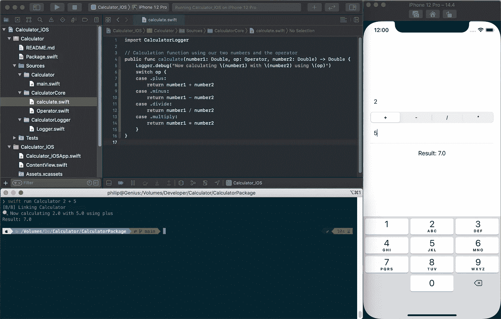

提供相同功能的 iOS 应用程序和命令行可执行文件

# 创建 SPM 命令行工具

开始启动你选择的终端(对我来说是 iTerm2)。然后创建一个名为 *Calculator* 的新文件夹，然后将工作目录更改到该文件夹中:

```
$ mkdir Calculator
$ cd Calculator
```

下一步是初始化我们的 Swift 包。Swift 命令行界面(CLI)允许我们创建多种类型的包。要找出是哪些，运行`swift package init --help`获得一个列表:

```
$ swift package init --help
OVERVIEW: Initialize a new packageOPTIONS:
  --name   Provide custom package name
  --type   empty|library|executable|system-module|manifest
```

我们主要关注的是`library`和`executable`。如果您只是创建一个库包，运行`swift package init --type library`，但是在我们的例子中，我们希望从一个可执行文件开始(前导`$`意味着它是一个命令):

```
$ swift package init --type executable
Creating executable package: Calculator
Creating Package.swift
Creating README.md
Creating .gitignore
Creating Sources/
Creating Sources/Calculator/main.swift
Creating Tests/
Creating Tests/LinuxMain.swift
Creating Tests/CalculatorTests/
Creating Tests/CalculatorTests/CalculatorTests.swift
Creating Tests/CalculatorTests/XCTestManifests.swift
```

厉害！您创建了第一个 Swift 包裹🔥

我们的文件夹结构现在看起来如下:

```
Calculator
├── Package.swift
├── README.md
├── Sources
│   └── Calculator
│       └── main.swift
└── Tests
    ├── CalculatorTests
    │   ├── CalculatorTests.swift
    │   └── XCTestManifests.swift
    └── LinuxMain.swift
```

要开始工作，只需打开/双击`Package.swift`文件，Xcode 会将其识别为一个包(-project)。

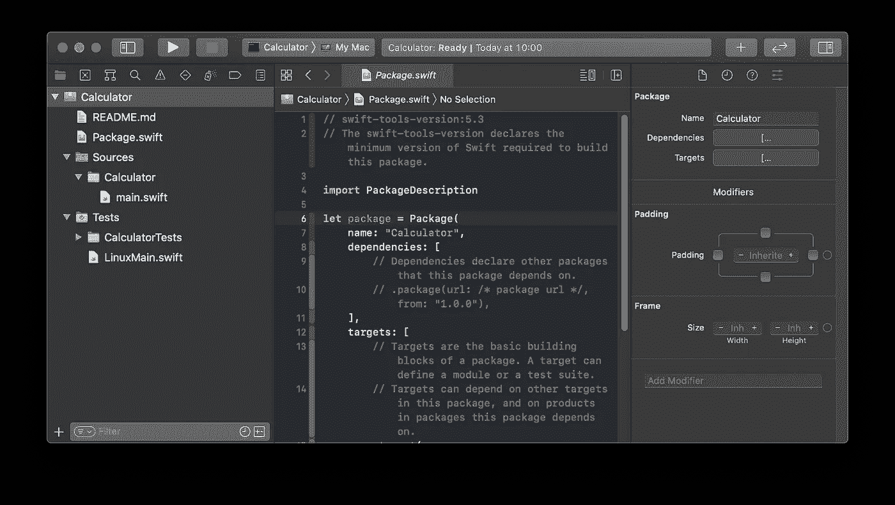

双击 Package.Swift 文件可以直接在 Xcode 中打开 swift 包

由于这篇博文不太像是关于在 Swift 中构建计算器的教程，我在评论中只提供了简单的实施步骤(如果你想要更详细的教程，请在 [Twitter](http://twitter.com/philprimes) 上告诉我)。
将以下代码放入您的`main.swift`文件中:

```
import Foundation

// CommandLine gives us access to the given CLI arguments
let arguments = CommandLine.arguments

// We expect three parameters: first number, operator, second number
func printUsage(message: String) {
    let name = URL(string: CommandLine.arguments[0])!.lastPathComponent
    print("usage: " + name + " number1 [+ | - | / | *] number2")
    print("    " + message)
}

// The first one is the binary name, so in total 4 arguments
guard arguments.count == 4 else {
    printUsage(message: "You need to provide two numbers and an operator")
    exit(1);
}
// We expect the first parameter to be a number
guard let number1 = Double(arguments[1]) else {
    printUsage(message: arguments[1] + " is not a valid number")
    exit(1);
}
// We expect the second parameter, to be one of our operators
enum Operator: String {
    case plus = "+"
    case minus = "-"
    case divide = "/"
    case multiply = "*"
}
guard let op = Operator(rawValue: arguments[2]) else {
    printUsage(message: arguments[2] + " is not a known operator")
    exit(1);
}
// We expect the third parameter to also be a number
guard let number2 = Double(arguments[3]) else {
    printUsage(message: arguments[3] + " is not a valid number")
    exit(1);
}
// Calculation function using our two numbers and the operator
func calculate(number1: Double, op: Operator, number2: Double) -> Double {
    switch op {
    case .plus:
        return number1 + number2
    case .minus:
        return number1 - number2
    case .divide:
        return number1 / number2
    case .multiply:
        return number1 * number2
    }
}
// Calculate the result
let result = calculate(number1: number1, op: op, number2: number2)
// Print result to output
print("Result: \(result)")
```

要使用新的计算器，回到终端，在包文件夹中，使用`swift run`命令测试实现:

```
$ swift run Calculator 13 + 14
Result: 27.0
```

# 将逻辑代码移动到自己的 SPM 库中

我们启动并运行了两个应用程序中的第一个。在我们继续创建 iOS 应用程序之前，让我们回顾一下代码，弄清楚哪些部分应该由所有应用程序共享。

代码的两个部分是相关的:

*   `enum Operator`是我们的数学运算符集合
*   `calculate`函数接受两个数字和一个运算符来执行实际的数学运算。

因此，让我们从创建一个新库开始。首先，我们通过删除所有注释和未使用的参数来清理默认的`Package.swift`清单文件:

```
// swift-tools-version:5.3

import PackageDescription

let package = Package(
    name: "Calculator",
    targets: [
        .target(name: "Calculator"),
        .testTarget(name: "CalculatorTests", 
                    dependencies: ["Calculator"]),
    ]
)
```

现在，在名为`CalculatorCore`的`Sources`文件夹中创建一个新文件夹，这是我们的共享应用程序核心逻辑。


创建新库从创建同名文件夹开始

在这个新创建的文件夹中，我们正在创建两个新的 Swift 文件:

首先创建文件`Operator.swift`并将`enum Operator {...}`声明移入其中:

```
enum Operator: String {
    case plus = "+"
    case minus = "-"
    case divide = "/"
    case multiply = "*"
}
```

其次创建另一个文件`calculate.swift`并将`calculate(...)`函数移入其中:

```
// Calculation function using our two numbers and the operator
func calculate(number1: Double, op: Operator, number2: Double) -> Double {
    switch op {
    case .plus:
        return number1 + number2
    case .minus:
        return number1 - number2
    case .divide:
        return number1 / number2
    case .multiply:
        return number1 * number2
    }
}
```

移出代码后，您的 main.swift 文件现在应该如下所示:

```
import Darwin
import Foundation

// CommandLine gives us access to the given arguments
let arguments = CommandLine.arguments

// We expect three parameters: first number, operator, second number
func printUsage(message: String) {
    let name = URL(string: CommandLine.arguments[0])!.lastPathComponent
    print("usage: " + name + " number1 [+ | - | / | *] number2")
    print("    " + message)
}

// The first one is the binary name, so in total 4 arguments
guard arguments.count == 4 else {
    printUsage(message: "You need to provide two numbers and an operator")
    exit(1);
}
// We expect the first parameter to be a number
guard let number1 = Double(arguments[1]) else {
    printUsage(message: arguments[1] + " is not a valid number")
    exit(1);
}
// We expect the second parameter, to be one of our operators
guard let op = Operator(rawValue: arguments[2]) else {
    printUsage(message: arguments[2] + " is not a known operator")
    exit(1);
}
// We expect the third parameter to also be a number
guard let number2 = Double(arguments[3]) else {
    printUsage(message: arguments[3] + " is not a valid number")
    exit(1);
}
// Calculate the result
let result = calculate(number1: number1, op: op, number2: number2)
// Print result to output
print("Result: \(result)")
```

如果您尝试再次运行您的应用程序，它会提示您一个错误，说它再也找不到`Operator`或`calculate`。

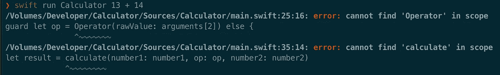

当将类移出该范围时，将会出现错误。

这是意料之中的，所以现在我们必须完成创建`CalculatorCore`库，并将其作为依赖项添加到我们的`Calculator`中。为此，我们只需要在我们的`Package.swift`中声明库:

```
// swift-tools-version:5.3

import PackageDescription

let package = Package(
    name: "Calculator",
    targets: [
        .target(name: "CalculatorCore"),
        .target(name: "Calculator",
                dependencies: ["CalculatorCore"]),
        .testTarget(name: "CalculatorTests",
                    dependencies: ["Calculator"]),
    ]
)
```

如果您尝试再次运行该应用程序，您仍然会看到相同的错误。这种行为背后的原因是`main.swift`中缺少`import CalculatorCore`:

```
import Foundation
import CalculatorCore

// CommandLine gives us access to the given arguments
...
```

此外，Swift 包的隔离功能(在我看来很棒)要求我们将`Operator`和`calculate`都声明为`public`，否则它们在包外不可用:

```
// in Operator.swift:
public enum Operator { ... }
// in calculate.swift:
public func calculate(...) -> Double { ... }
```

使用`swift run`运行您的应用程序，它应该会再次工作。

# 使用库创建 iOS 项目

到目前为止干得不错！您已经创建了命令行可执行文件和 SPM 库。现在我们进一步扩展它，使用我们的 SPM 库计算逻辑创建一个 iOS 应用程序。

对于本教程，我们将使用 SwiftUI 应用程序，因为它是 iOS/macOS 应用程序开发的未来，并允许我们以比使用传统 UIKit 更快的方式创建一个简单的计算器。

打开 Xcode，点击**文件/新建/项目**

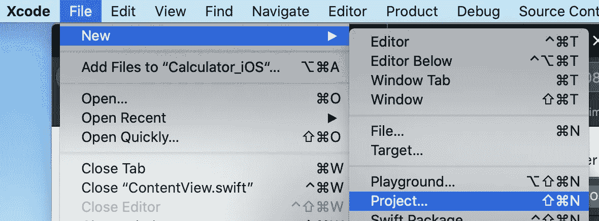

现在在 **iOS** 选项卡中选择 **App** ，命名为 *Calculator_iOS* ，选择 **SwiftUI** 进行所有设置。

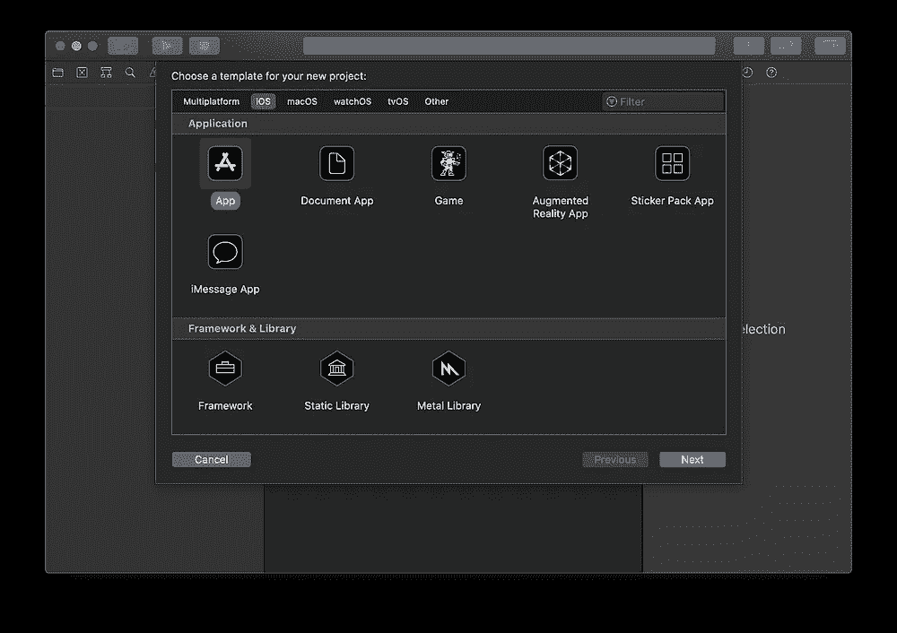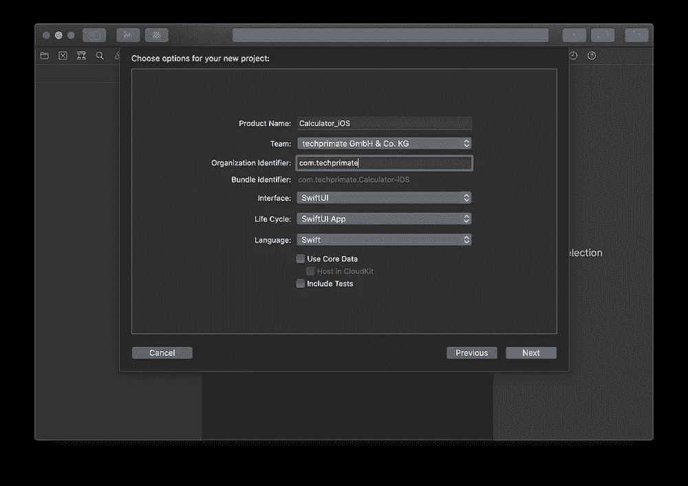

创建一个 iOS 应用程序项目只需要几个简单的步骤

确保将项目放在您的主`Calculator`文件夹中，您应该得到以下文件结构:

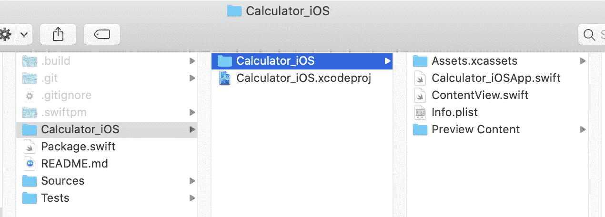

因为我们不需要嵌套的 iOS 文件夹，所以关闭 Xcode 项目并将内容上移一层。此外，我们将包移动到它自己的子文件夹`Calculator`中，所以之后你的文件夹结构应该是这样的:


所有的 iOS 应用代码都在 Calculator_iOS 里面

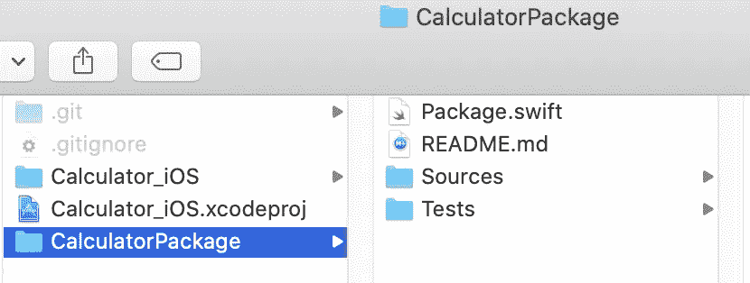

所有的包代码都在 CalculatorPackage 里面

现在打开`Calculator_iOS.xcodeproj`，选择你选择的模拟器，运行初始应用程序，确保一切正常。

下一步，我们继续使用两个文本字段和一个操作符选择来创建计算器 UI。用以下代码替换`ContentView.swift`中的`struct ContentView {...}`,并再次运行应用程序:

```
struct ContentView: View {

    @State var number1 = ""
    @State var op = "+"
    @State var number2 = ""

    var body: some View {
        VStack {
            TextField("Number 1", text: $number1)
                .keyboardType(.numberPad)
                .padding(10)
                .cornerRadius(5)
            Picker("Operator", selection: $op) {
                ForEach(["+", "-", "*", "/"], id: \.self) { op in
                    Text(op)
                }
            }
            .pickerStyle(SegmentedPickerStyle())
            TextField("Number 2", text: $number2)
                .keyboardType(.numberPad)
                .padding(10)
                .cornerRadius(5)
            Divider()
            Text("Result: " + result)
                .padding(10)
        }
        .padding(20)
    }

    var result: String {
        return "?"
    }
}
```

当您可以输入数字并选择一个运算符时，您的基本计算器就完成了:

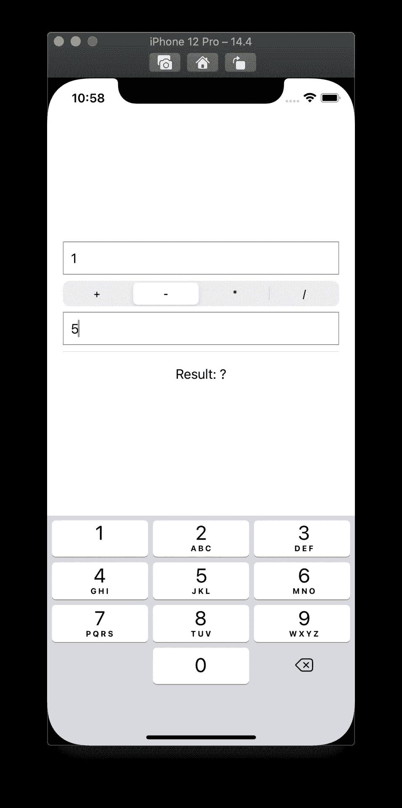

我们的首款计算器 iOS 应用 UI

下一步是添加我们的本地 Swift 包作为 iOS 应用程序依赖项。这一步没有被很好地记录或了解，但是非常简单。你所要做的就是将文件夹`CalculatorPackage`拖到最顶端的`Calculator_iOS`文件浏览器中:

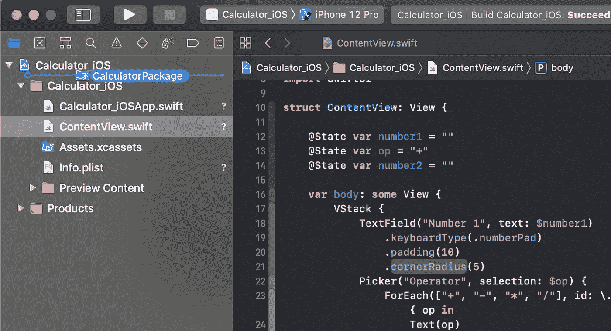

Xcode 会自动将文件夹检测为 Swift 包

然后 Xcode 会将该文件夹检测为本地包:

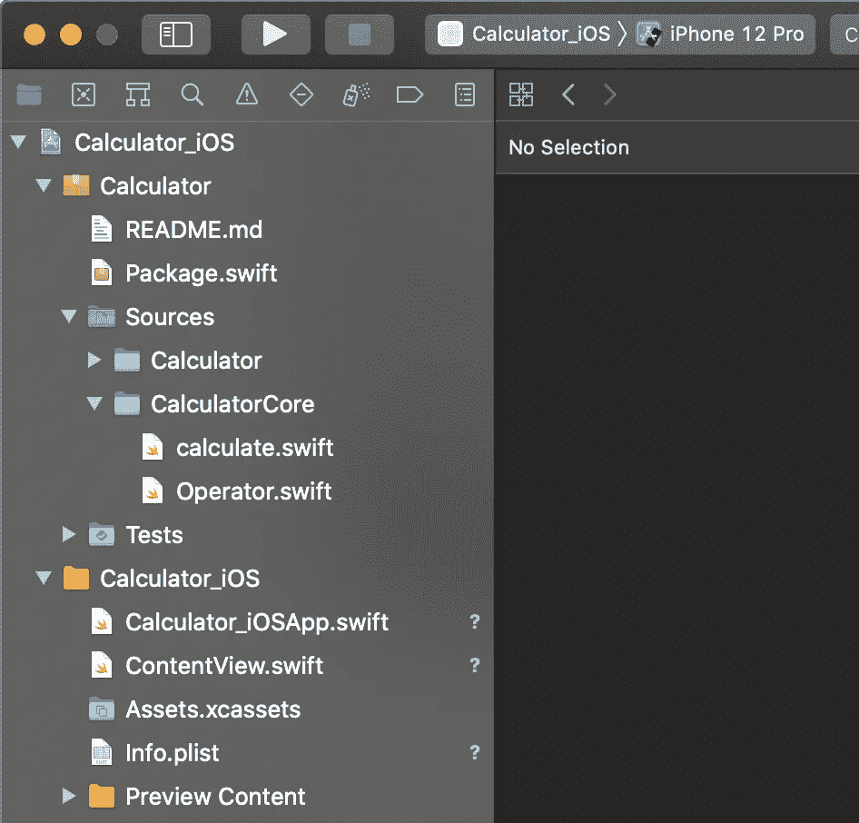

Swift 包裹参考显示为文件夹参考

在我们真正将我们的库添加到 iOS 项目之前，我们需要将它声明为`Package.swift`中的一个产品。由于库产品可以将多个目标捆绑在一起，我们需要添加`CalculatorCore`作为`targets`参数。

```
let package = Package(
    name: "Calculator",
    products: [
        .library(name: "CalculatorCore", 
                 targets: ["CalculatorCore"])
    ],
    targets: [
        .target(name: "CalculatorCore"),
        .target(name: "Calculator",
                dependencies: ["CalculatorCore"]),
        .testTarget(name: "CalculatorTests",
                    dependencies: ["Calculator"]),
    ]
)
```

最后一步，您必须将`CalculatorCore`库作为一个依赖项添加到 iOS 应用目标，方法是在**框架、库和嵌入内容**部分的目标设置中点击**加号+** ，并在列表中选择它:

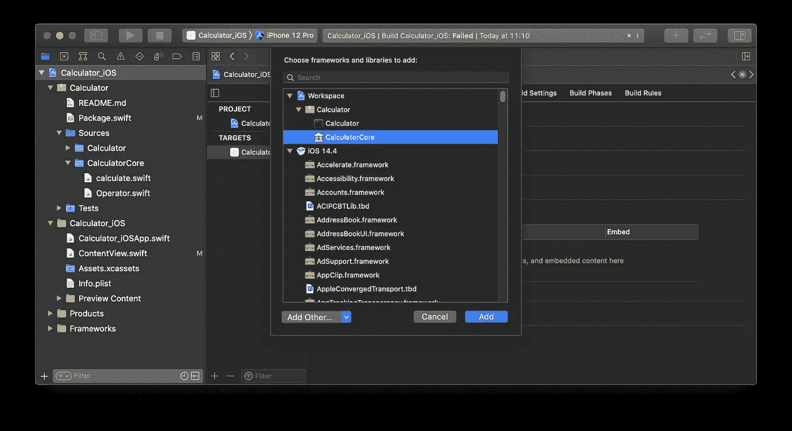

在依赖关系管理列表中添加包

这就是了。您的本地 Swift 包现已在您的 iOS 应用程序中提供🎉

在`ContentView.swift`中，我们可以将`import CalculatorCore`添加到文件的顶部，我们可以再次在计算属性`result`中使用`Operator`和`calculate`函数:

```
var result: String {
    guard let num1 = Double(number1) else {
        return number1 + " is not a valid number"
    }
    guard let num2 = Double(number2) else {
       return number2 + " is not a valid number"
    }
    // Force unwrap the operator for now,
    // as we can be sure that we only added known ones
    let op = Operator(rawValue: self.op)!
    let result = calculate(number1: num1, op: op, number2: num2)
    return result.description
}
```

再次运行该应用程序，您就可以在 iOS 中使用计算器了:

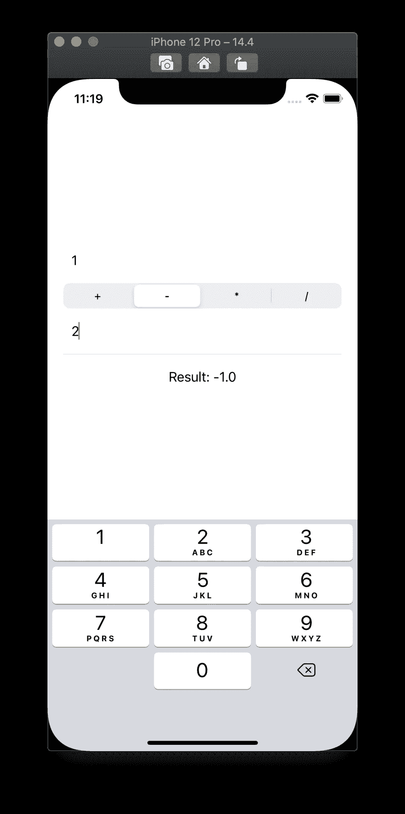

我们的 iOS 计算器正在工作并计算正确的值

## 是时候清理一下了

我们的共享代码库现在已经准备好增长，但是我们希望保持对我们个人应用程序的维护在控制之下。

此时，您的程序中有两行非常难看的代码:

```
// main.swift, Line 10:
print("usage: " + name + " number1 [+ | - | / | *] number2")// ContentView.swift, Line 24:
ForEach(["+", "-", "*", "/"], id: \.self) { op in ... 
```

这两行都手工列出了我们已经实现的操作符，如果我们向`enum Operator`添加另一个操作符，它们将不会被更新。更糟糕的是，我们可能会忘记将它添加到我们的应用程序中。

让我们通过将`CaseIterable`协议添加到`Operator`枚举来解决这个问题，这给了我们`Operator.allCases`，一个包含所有可用操作符的合成数组。

```
public enum Operator: String, CaseIterable {
    case plus = "+"
    case minus = "-"
    case divide = "/"
    case multiply = "*"
}
```

在`ContentView.swift`内将`ForEach`改为使用`.allCases`:

```
ForEach(Operator.allCases, id: \.self) { op in
    Text(op.rawValue)
}
```

当`Picker`中的`ForEach`将操作符作为标签添加到`Text`对象时，我们现在也必须更改选择属性:

```
...
@State var op: Operator = .plus
...
```

这样也可以摆脱里面的强行解开`var result: String {..}`

在我们的 CLI 应用程序的`main.swift`中，您现在可以在`printUsage`函数中动态创建操作符列表:

```
func printUsage(message: String) {
    let name = URL(string: CommandLine.arguments[0])!
        .lastPathComponent
    let operators = Operator.allCases
        .map(\.rawValue)
        .joined(separator: " | ")
    print("usage: \(name) number1 [\(operators)] number2")
    print("    " + message)
}
```

太好了，你想再加一个操作员吗？不用担心，只需通过另一个案例扩展`enum Operator`并在`calculate()`函数中实现它🎉

# 创建更多的本地库来构建依赖图

在这一步中，我们想给我们的`CalculatorCore`添加一个调试记录器。我们可以只使用`print()`方法，但那样就没那么有趣了，对吧？😄

创建更多的本地包非常简单。像以前一样，在**源**中创建一个文件夹，并以包名命名。在这种情况下，它将是`CalculatorLogger`，并且包含一个单独的`Logger.swift`文件:

```
public class Logger {

    public static func warn(_ message: String) {
        print("⚠️ " + message)
    }

    public static func debug(_ message: String) {
        print("🔍 " + message)
    }
}
```

然后在包清单中创建一个新的目标，并将其作为依赖项添加到`CalculatorCore`包中

```
targets: [
    .target(name: "CalculatorCore", dependencies: [
       "CalculatorLogger"
    ]),
    .target(name: "CalculatorLogger"),
    ...
]
```

并将其导入我们的`calculate.swift`文件:

```
import CalculatorLogger

// Calculation function using our two numbers and the operator
public func calculate(number1: Double, op: Operator, number2: Double) -> Double {
    Logger.debug("Now calculating \(number1) with \(number2) using \(op)")
    ...
}
```

当在`CalculatorPackage`目录中运行`swift run`时，它给出以下输出:

```
$ swift run Calculator 13 + 14
[3/3] Linking Calculator
🔍 Now calculating 13.0 with 14.0 using plus
Result: 27.0
```

# 更多即将推出！

基本上就是这样。如果您一直这样做，那么您现在已经使用相同的核心逻辑创建了一个多平台应用程序🚀
总结一下为什么这很有用:

*   如果我们改变我们的应用程序，包将不会被重新构建，这给了我们更快的构建时间。
*   我们可以处理包本身，尤其是在向它们添加单元测试时，而无需运行完整的应用程序。
*   包的隔离使用可见性来保持我们代码的干净(例如`public`对`internal`)
*   本文中我们还没有探索的是并行编译。
    想象你正在使用更多的包作为我们`CalculatorCore`包的依赖，类似于`CalculatorLogger`包。由于它们互不依赖，它们可以并行构建，这给了我们更快的构建时间！

在撰写本文时，我意识到不可能涵盖更高级的功能，例如每个平台的 UI 模块使用接口以 [VIPER 模式](https://www.objc.io/issues/13-architecture/viper/)进行通信(这是我目前在一个大规模 iOS/macOS 跨平台应用程序中使用的)。
因此，我将在以后的文章中讨论高级主题，例如 SPM 如何使用自己包中的 XIB 文件帮助您从 UIKit/AppKit 过渡到 SwiftUI(请确保关注我以获得通知！).

**更新 19.04.2021:** 我刚发表了[后续文章](https://philprime.medium.com/advanced-cross-platform-apps-using-local-swift-packages-and-uikit-appkit-2a478e8b05cd)！

如果你想了解更多，请查看我的其他文章，在 [Twitter](https://twitter.com/philprimes) 上关注我，并随时给我发短信。你有具体的话题想让我介绍吗？让我知道！😃

**编辑 13.04.2021:** *新增大型项目分拆 app 示例*