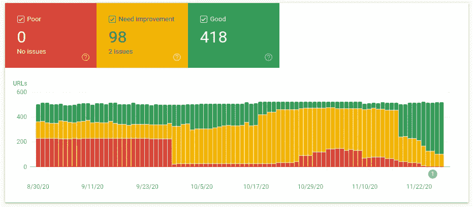

# 模块化捆绑包:向现代网络迭代传统应用

> 原文：<https://itnext.io/modularizing-the-bundle-iterating-legacy-apps-towards-modern-web-8c2dadc5abbc?source=collection_archive---------4----------------------->



支持 web 的技术和标准正在快速发展，使我们能够用更少的资源做更多的事情，并以最少的时间和资源投入获得令人惊叹的用户体验和性能。如果您现在开始一个新项目，您可以利用 Gatsby 和 Next 这样的优秀工具，在 headless CMS 的支持下，构建速度极快的静态或服务器端呈现的 web 属性，并针对当代互联网进行优化。唉，抛弃当前用 PHP、Python 或 Ruby 编写的经过实战检验的代码，转而使用完全不同的基于节点的堆栈是一种奢侈，不是每个产品都能负担得起的。此外，虽然抛弃和转换的想法看起来很诱人，但在内心深处，你知道每个新工具都必然会带来新的痛苦和头痛。

那么，我们实际上可以做些什么来改善我们传统应用的网络活力呢？我们如何计划和迭代，而不以牺牲其他业务关键特性为代价，用全面的重写来淹没我们的团队？我们如何在利用我们已经掌握的服务器端技术的同时，跟上现代网络的步伐？

让我分享一些我自己旅程中的感悟，并向您介绍一些步骤，您可以采取这些步骤来提高您的 Lighthouse 分数，并改善面向客户端的应用程序的可管理性和性能。

# **起床加速**

你认为你对网络了解的一切可能都已经过时了。一年前成为热门话题的最新技术现在已经过时了。你从未听说过的 W3C 提案现在得到了所有主流浏览器的支持。网络标准化的步伐和渲染引擎对这些新标准的采用令人兴奋。

在你开始优化之前，你应该了解这个方向，这个方向是网络发展的方向，你需要做些什么来跟上。 [web.dev](https://web.dev/) 是一个很好的资源，它会让你开始你应该努力实现的目标。

## 模块化网络

ES6 现在几乎被所有的浏览器本机支持(除了一些害群之马，我们应该集体忽略它们以避免另一个 IE9 的情况)。结合[动态进口](https://caniuse.com/es6-module-dynamic-import)，这使得传统意义上的捆绑销售适得其反。捆扎机不再需要将您的资产聚集成大文件，只需一次请求即可加载；bundle 现在是一个加载器，可以智能地解析您的依赖图，并在需要时加载各个模块。捆绑器正在发展:Webpack 5 已经发布，承诺提供更好的捆绑优化、缓存策略和模块联合；Rollup 及其原生 ES6 支持使捆绑更加简单和直观；Parcel 的无配置构建方法提供了一种更简单的替代方法，而没有令人难以置信的装载链。

## **更快的网页**

网络变得越来越快。HTTP/2 协议受到所有浏览器的支持，除了一些浏览器和将近 50%的网站。HTTP/3 最终会到来，目前正在由 Cloudflare 和 Chrome 进行测试。这些协议的多路复用特性使得拆分成为一个可行的选择——您可以向客户机提供大量资产，而不会遭受 HTTP/1.1 固有的极度滞后。内容交付网络，如 Cloudflare，建立在这些协议之上，通过[自定义优先级](https://blog.cloudflare.com/better-http-2-prioritization-for-a-faster-web/)算法和其他网络增强功能使其速度更快。

诸如 [Brotli](https://en.wikipedia.org/wiki/Brotli) 和 [webp](https://en.wikipedia.org/wiki/WebP) 等改进的压缩算法极大地减少了通过网络提供的资产的大小。

模块的长期缓存要高效得多，它允许您更新应用程序的某些部分，而不必在每次小的更新时都向用户提供一整套通用的和供应商的模块。

## 进步网络

[渐进式改进](https://en.wikipedia.org/wiki/Progressive_enhancement)原则正在深入人心，这使得分拆变得更加重要。以高粒度水平异步增强页面的能力对于确保您满足高要求的 Web 生命指标的要求至关重要，这些指标在不久的将来必将成为 Google 排名算法的一部分。通过将您的 web 应用程序分割成更小的模块，结合浏览器预加载和预取内容的改进能力，您将能够微调各个网页，以便尽早出现第一个和最大的内容丰富的画面，同时最大限度地减少布局变化，减少输入延迟和交互时间。

越来越多的[浏览器 API 为我们提供了更多的机会来逐步提高性能和增强我们的应用。有了 Web Workers，我们可以将繁重的计算从主线程中卸载出来；借助服务人员，我们可以抢先加载、缓存和同步所需的资产；有了交叉点观察器，我们可以推迟加载资产，直到页面需要它们。](https://developer.mozilla.org/en-US/docs/Web/API)

## 联合网络

整体应用正慢慢让位于较小的单一责任应用和服务。微服务改变了我们构建后端系统的方式。像 kubernetes 这样的工具帮助我们轻松、安心地编排和管理复杂的系统。前端开发也有类似的趋势。一方面，企业设计系统和原子设计方法的传播使得前端系统的架构更加模块化(基于组件)。Vue 中的 SFC、逐位共享组件云、web 组件是前端如何接受单一责任原则的很好例子。另一方面，我们看到了[微前端](https://micro-frontends.org/)的出现，它允许我们构建更小的自主应用和组件，有时使用不同的框架和工具，由多个团队执行，并使用容器在浏览器中将它们连接在一起。Webpack 5 为模块联合提供了本地支持，这可能为 web 资产的去中心化铺平道路。

## 面向隐私的 Web

用户隐私[正变得越来越重要](https://broadbandnow.com/report/26-data-privacy-statistics-2019/)，世界各地正在通过新的立法，以确保用户被允许对他们的个人数据和跟踪他们的在线习惯做出精细的决定。这对我们如何与第三方脚本和提供商打交道有着直接的影响:从分析、营销、重新定位到数据收集。在这种情况下，模块化我们的应用程序成为确保我们遵守法规和用户明确同意的重要一步。此外，跟踪和营销脚本的模块化使我们能够在页面的生命周期中对它们的加载进行判断，从而抵消可能对页面指标产生的负面影响。

# 了解你的资产

任何应用程序的前进方向，不管它是用什么工具构建的，都是将它分解成更小的部分。我稍后会谈到在网页上加载资源的不同技术，但在你利用它们之前，你需要将你的 CSS、JS 和 HTML 划分为你可以理解、重用和控制的构建块。即使您没有使用 React 或 Vue，也没有什么可以阻止您使用组件和练习模块化思维。前端组件由一些标记、一些样式和一些交互组成:无论您使用什么框架，它都会将您的模板分解为更小的可重用部分，确定它们所依赖的 CSS 样式，以及需要什么 JavaScript(如果有的话)来使这些模板中的元素具有交互性。

## 解开你的 CSS

你可能正在使用一个流行的 CSS 框架，a-la Bootstrap，或者布尔玛，或者 Foundation。对于任何网站来说，它们都是一个很好的起点，但它们也让我们自满:随着各种风格和变化随处可见，我们牺牲了在其他地方严格遵循的坚实原则。所以，你需要改变你的想法:CSS 是一种依赖，只有在需要的时候，模板才需要它。想想代码中未使用的变量:未使用的 CSS 更糟糕，很难去除(尽管有 PurgeCSS 这样的工具)，尤其是在后端环境中，html 是在运行时生成的，V8 不是现成的。如果你不能很好地掌握你的 CSS，它会很快变得陈旧，成为你的应用程序负担的死代码。

你可能想知道从哪里开始。我的建议是熟悉一下 Brad Frost 的[原子设计。即使您还没有准备好创建自己的设计系统，它也可以帮助您一次一个原子地重构您的标记和 CSS。审核你的页面，开始将原子、分子和有机体隔离到它们自己的模板中。它将使您熟悉应用程序的构建模块，并使您更容易迁移到不同的地方——一旦您的资产被模块化，您就可以轻松地将 Twig 替换为 React 或 Vue 或 Svelte。](https://atomicdesign.bradfrost.com/table-of-contents/)

我敢打赌，你不会在每个页面上使用 5 种不同的按钮，一个模态，一个条纹表，一个手风琴和一个大屏幕，所以没有必要为每个请求加载一个完整的 CSS 框架，使浏览器不必要地处理它。幸运的是，大多数 CSS 框架都是用模块化 Sass 或更少的 Sass 构建的，通过从框架或库中导入相关资源，您可以轻松地为每个功能元素创建自己的样式表。

接下来，您还可以深入研究模块的内部，手动对 CSS 进行树抖动。我发现每个框架中高达 60-70%是试图解决每个可能用例的一般化，这对于一个普通的应用程序来说通常是多余的。通过这种方式，你可以慢慢地将你的应用从 CSS 框架的好处和坏处中分离出来，并基于你的组织的需求和编码原则建立你自己的设计语言。

谈到 CSS 时，一个重要的注意事项是提前考虑，并确保它的范围很好。虽然我不是 [BEM](http://getbem.com/) 的最大粉丝，但这是一种确保你的风格在全球范围内不会冲突的安全且经过验证的方法。还有其他技术可以考虑，比如 CSS 模块，但是它们需要更多的工作，并且可能使得在多个遗留和现代项目之间重用您的样式变得困难。这是我有点反对样式化组件和 CSS-in-JS 的部分原因——在如此快节奏的前端工具环境中，互操作性应该仍然是一个选项。

## 重构您的 JavaScript

JavaScript 对你网站的性能很糟糕。浏览器是单线程的，JavaScript 的每一部分都可能阻塞主线程，阻止应用程序的关键部分变得有响应性或交互性。浏览器必须解析和编译页面上加载的每一点 JavaScript，所以重构 JavaScript 的关键是只在需要的时候加载需要的内容。

如果您的应用程序是伴随着一个 index.js 成长起来的，那么很可能您已经用很少在每次页面加载中使用的逻辑使它过载了。

考虑这个例子:

正如您所看到的，我们最初的 JavaScript 没有被限定范围，它在运行时扫描 DOM 寻找 slider 和 accordion 元素，如果找到了就挂载它们。这是在导入依赖项(因此增加了我们构建的规模)，如果页面上没有滑块或折叠，这将永远不会被使用。相当浪费浏览器资源。

重构的代码是模块化的。您可以根据需要导入并运行该函数，而不会污染全局范围，也不会阻止浏览器在此期间做其他有用的事情。我们可以引用要在数据属性中使用的 JS 模块，并依靠动态导入来解析要使用的正确 JS 模块，而不是为每种可能的 UI 元素类型绑定逻辑。

在我们所有的重构之后，我们假设的滑块组件可能看起来像这样。

这里的想法是使您的组件尽可能粒度化。一旦所有这些模块都存在，我们就可以开始调整我们的绑定和加载逻辑，以实现浏览器的最佳性能。

# 优先考虑你的资产

渐进式增强是异步的，您应该尽可能在前端开发中实现异步。在呈现页面时，您希望从上到下逐步增强它们。文件夹上方的内容应该尽快变得可见和可交互。文件夹下的所有内容都可以在以后加载和渲染。

一般来说，您希望确保资产按以下顺序可用:

CSS 应该尽快可用，以保证早期的第一个令人满意和有意义的绘画。此外，这确保了布局的稳定性，避免了可见区域中的布局偏移(闪烁)。

**字体**一旦被加载，就会导致布局移动。您需要确保尽早加载字体，以避免视觉不适。

**文件夹上方的图片**应该相对早些渲染，因为它们通常构成了最大的内容。

**UX 关键 JavaScript** ，它对于用户交互来说是必不可少的，即导航元素应该尽早加载。对于用户来说，看到对任何点击都没有响应的完全呈现的页面是令人沮丧的。

**业务关键型** **JavaScript** ，这对于业务指标(如分析、营销等)至关重要。最终应该加载，但不会太晚。错过有用的指标会扭曲您的统计数据，并影响您的设计和业务决策。

从分析你的布局和组成元素开始。如果你的页面布局是一致的，它应该给你一个好主意，如何逐步增强它。如果页面之间的布局不同，也许你应该为每个页面考虑不同的加载策略。

# 装载策略

在我们讨论不同类型的加载策略以及何时使用它们之前，让我提一下，为了执行这种基于组件的架构，您的模板引擎应该能够推迟呈现模板的某些部分。如果你正在使用 Twig，看看 [twig-deferred-extension](https://github.com/rybakit/twig-deferred-extension) 。它将允许您从组件模板内声明加载行为(例如，通过调用 custom assets.require 或 assets.inline)，然后用声明的资产填充最终布局模板(例如，通过调用 custom assets.getRequired 或 assets.getInline)。您可以创建一个新的扩展，并将其用作存储来跟踪和检索您的 partials 所请求的资源列表。您的扩展应该能够读取您的构建清单，解析您所请求的资产的 URL，并且读取其中一些资产的内容(如果它们是内联的)。

## **内联**

在页面内的`<style>`和`<script>`标记之间内联 CSS/JS 资产是确保它们在运行时被浏览器解析、编译和呈现的最简单的方法。当然，不利的一面是，这些必须随每个页面请求一起传输，并且不能被浏览器缓存。

我在这方面得出的结论是，如果你的 CSS 足够细粒度，在页面上内联所有内容是可行的。像 Gatsby 这样的静态站点生成器使用类似的方法(尽管它们可以选择使用 PurgeCSS 删除一些未使用的样式)，所以这里的关键是要确保您的样式足够原子化，并且不要让您的页面过载太多未使用的规则。将所有的 CSS 都放在页面上，而不必单独加载，这样可以确保良好的视觉稳定性，并防止元素在更多样式可用时跳跃。对于折叠以上的内容来说尤其如此。布局的一致性可以帮助您决定是只内联关键的 CSS 并异步加载其余的，还是聚合并内联页面上所有组件的所有 CSS。

与 CSS 不同，您应该非常稀疏地使用内联 JavaScript，因为它很可能会阻塞主线程。为折叠上方发生的关键交互保留内联 JS，即下拉式或画布外的主要导航元素。内联 JS 也是对业务关键脚本进行排队的好地方。

也就是说，如果你正在使用 bundler，你可能只需要导入你的关键 JS，而不是内联它。捆绑器将添加到您的入口点的运行时逻辑可能会降低您的应用程序的速度，并复制一些捆绑器可能会剥离或分块的 JS。

## `<link>`和`<script>`标签

我的一般方法是在页面上完全禁止它们。您无法控制浏览器何时加载这些内容。您希望异步化并推迟所有不重要的资产。

有人可能会说`<script async defer>`没问题，但是我发现它没有对加载行为提供足够的控制。

以上所有内容在浏览器中的表现都不同。直到最近，我一直在使用`async`和`defer`，认为这是最好的，但后来我用灯塔的分数做了一点实验，结果令人惊讶。

做一些研究，找出最适合你的方法。查看这些文章，它们将帮助您了解何时使用哪种策略:
- [使用延迟和异步有效地加载 JavaScript](https://flaviocopes.com/javascript-async-defer/)-[有效地加载第三方 JavaScript](https://web.dev/efficiently-load-third-party-javascript/)
- [浏览器中的 ECMAScript 模块](https://jakearchibald.com/2017/es-modules-in-browsers/)

对于非关键资产，我认为更好的方法是在需要时将脚本/链接标签注入 DOM。这也使您能够在加载它们之前验证是否满足某些条件，而不是在不满足条件时加载它们并不使用它们。

对于我的用例，我已经决定内联关键的 JavaScript，它包括 lazysizes，将侦听器附加到主导航，并且如果/当 cookie 同意时，在 HTML 文档的页脚中启动第三方脚本的加载。对于其余的 JS 包，在运行了一些 Lighthouse 和性能实验之后，我决定:

```
<script type="module" async>
   import('./some-entrypoint.js');
</script>
```

# 装载时间

为您的资产计时对于确保流畅的用户体验至关重要。优化浏览器资源和主线程可能需要一些尝试和错误，但是如果你在你的加载策略中建立计时，你将能够通过动态调整进一步提高你的分数。

## 运行时

如上所述，内联您的样式和脚本将在运行时执行它们。它有可能导致问题，尤其是在脚本方面，因为它们可能会阻塞主线程。尽量避免运行时脚本，尽可能地异步。

如果你正在做一些不依赖于 DOM 的计算，考虑使用 Web Workers，因为它们将帮助你从主线程中卸载昂贵的操作。

## 在 DOMContentLoaded 事件上

[当`document.readyState`从`loading`变为`interactive`时，触发 DOMContentLoaded 事件](https://developer.mozilla.org/en-US/docs/Web/API/Window/DOMContentLoaded_event)，这意味着此时浏览器已经解析了 DOM，但是还没有加载所有的样式表和图片。您可以开始操作 DOM 并附加事件侦听器。

这是一个很好的地方来引导您的导航，并开始安装 UI 组件，这些组件将在文件夹上方很快需要。

## 加载事件时

当所有资源，包括脚本、样式表和图像都被加载时，窗口加载事件被触发。在加载完所有内容之前，您可能会偏移一些业务逻辑，但是很难说这对页面的性能有什么影响。我不能辨别这个事件之后发生的事情是否被计入总阻塞时间和交互时间。有可能通过延迟加载资源直到加载事件，您正在人为地增加空闲 CPU 的时间，因为您没有通过让它优化何时开始加载资源来以最有效的方式使用可用的浏览器资源。

在行使控制和让浏览器完成它的工作之间有一条很细的线，所以运行一些实验，看看你在你的设置中得到什么结果。

对于 DOMContentLoaded 和 load 事件，请注意区别:

您可能应该尝试这两种方法，看看哪种方法最适合您的情况。有可能通过在 DOM 准备好之前偏移动态导入，您将释放主线程用于其他任务，但是这也可能导致浏览器加载和解析资源能力的低效使用。

## 按需

按需加载资源可能是优化页面性能的最有效方式。您可以等待，直到用户与特定元素交互(例如，只有当用户单击触发它打开的按钮时，才加载脚本和样式来呈现模式屏幕)，或者直到元素在视口中可见。

IntersectionObserver 是一个强大的工具，它允许你使用浏览器的本地 API 来做漂亮的事情，而不需要不久前所必需的所有几何计算。您可以确定特定元素何时将出现在视口中，并加载必要的脚本/样式来引导它。

然而，如果您已经在项目中使用了`lazysizes`，那么您可以利用它的功能。关于这一点，如果你还没有在你的项目中使用 lazysizes，[你应该这样做](https://web.dev/use-lazysizes-to-lazyload-images/)。

## 工作线程

服务工作器和其他 web 工作器可用于抢先加载和缓存资源，以及抵消主线程的一些资源密集型计算。我不会在这篇文章中详细介绍，因为网上有足够的关于这个主题的资源，但是你应该检查你的脚本，看看 web workers 是否能提高你的性能。

# 预加载、预取和预连接

有很多关于这个主题的好文章，例如阿迪·奥斯马尼写的这篇[中型文章。](https://medium.com/reloading/preload-prefetch-and-priorities-in-chrome-776165961bbf)

这里需要注意的是，通过利用浏览器的预加载、预取和 DNS 预取/预连接功能，您可以极大地提高页面的性能。我认为关键是要理解如何使用它们，以及如何将它们集成到你的模板引擎中。棘手的部分是确定在您可能使用的异步请求和动态导入的上下文中可以预加载什么，这与您的加载策略紧密相关。在某些情况下，服务工作器可能比内联预加载和预取声明更合适。

## 预加载字体

总是预装你的字体。它们的声明通常在一些 CSS 文件中被引用，所以如果浏览器知道它需要在解析 CSS 之前预加载它，它会对浏览器有所帮助。

在这个问题上，我强烈建议你研究一下[可变字体](https://web.dev/variable-fonts/)，这可以大大减少浏览器为了导入你可爱字体的所有粗细变化而需要对你的服务器执行的往返次数。

## **延迟图像**

虽然许多文章建议您预加载图像，但我发现在运行时包含 lazysizes 并让它使用 data-src 和 data-srcset 属性会更有效。不管出于什么原因，它比直接在标记中引用上面的折叠图像做得更好。

在这一点上，SVG 应该尽可能地内联和 sprited。如果每个 SVG 都是通过 URL 加载的，那么我们倾向于使用太多的 SVG，预加载它们对原因没有帮助。

当涉及到图像时，你要确保它们不会导致过多的布局偏移。我的建议是审核你的应用程序如何使用图像，确定几个纵横比并坚持使用它们:例如，你可以限制你的英雄图像的高度，你可以为你的卡片图像设定 16x9 或 4x3。这将允许你用 CSS 为你的图片分配足够的空间，这样当它们被加载的时候就不会引起内容的跳跃。

## 内联关键 CSS /预加载动态 CSS

如前所述，我认为内联 CSS 比预加载和链接更有效。布局变化对用户来说太不愉快了，粒度 CSS 带来的性能提升可以忽略不计。

也就是说，当处理来自依赖项的 CSS 时，尤其是如果你计划异步加载它们，仔细检查你的 bundler 对它们做了什么。我注意到 Webpack 在对动态导入模块中导入的 CSS 进行分块时效率不高。你可能想要优化你的缓存组来分块所有的 CSS，然后找出在页面上包含单个文件的最佳方式。

## 动态 ESM 导入

你可以[预装动态 ESM](https://developers.google.com/web/updates/2017/12/modulepreload) 模块导入，但到目前为止 Lighthouse 还没有在我的设置中抱怨过它们。我怀疑它们足够小，不需要预加载，或者可能有其他因素在起作用。如果你知道，请告诉我。

## 预加载 JSON

如果您从脚本加载 JSON 文件，例如翻译文件或清单，您应该尝试预加载它们。如果你在你的脚本中使用`fetch`，事情会变得棘手。请确保您包括正确的标题，因为它会导致我的设置出现问题。

# 集束

虽然我们正在向更加模块化的应用程序发展，但是捆绑软件还没有发展到任何地方。我们仍然需要填充一些浏览器的怪癖，我们需要对我们的资产进行树抖动和代码分割，尽管取得了所有的进步，通过 HTTP 导入数千个模块并不是一个真正的选择。我们继续依赖捆绑器来优化我们的生产代码。

虽然我喜欢 roll up and package 的想法，但我不想创建新的构建管道，所以我试图找到一种方法来使用我们现有的 Webpack 4 设置执行我上面分享的想法。

为了使设置工作，我需要用 webpack 完成一些事情:

*   将组件样式表从 SCSS 编译成单独的 CSS 文件，这样它们就可以在 Twig 模板中被内联或链接
*   捆绑 JS 入口点，使它们可以在 Twig 模板中内联或链接
*   在 Twig 模板中轻松内联、链接、导入和预加载资产

## 挑战

Webpack 是一个很棒的工具，我对它了解得越多，我就越欣赏它试图做出的关于创建最佳构建的复杂决策。但是，如果您开始搞乱缓存组和块，它的不可预测性会让我抓狂。受大卫·吉尔伯森的这篇文章的启发，我用不同类型的块和缓存组做了很多实验。最终，我得出的结论是，Webpack 4 就像一个搅拌器——如果它在工作，不要用手指去碰它。我不确定 Webpack 5 将如何让我们的生活变得更容易，但迄今为止，我能从 Webpack 4 中获得的最佳性能是移除所有自定义逻辑并默认为零配置优化。

您可能知道 HtmlWebpackPlugin 并不真正适合动态构建 HTML 页面的后端。例如，Symfony 和 Laravel 都必须想出变通办法，允许在他们的定制渲染引擎中使用 Webpack 功能。通常的解决方法是生成一个引用每个入口点所依赖的所有文件的入口点清单，如下所示:

现在，当 webpack 完成构建时，它将向`public/assets/entrypoints-manifest.json`写入一个 json 文件，其中所有的入口点都作为对象键，并且需要一组单独的模块来将其呈现为值，您可以在后端读取这些值并将这些文件添加到您的模板中。

我所说的混合方法，即您希望内联一些资产并异步加载其他资产，结合可定制的预加载策略，是很难实现的。

我注意到 Webpack 和动态导入的行为不像 entrypoint，许多资产最终被重新绑定，即使它们已经通过 entry point 或另一个动态导入导入(例如，想象一下安装 2 个动态导入的 React 小部件，它们共享相似的依赖关系)。如果没有 HtmlWebpackPlugin，预加载异步动态导入也是一个挑战。我已经尝试过将动态导入的小部件作为入口点，但是这会导致许多其他问题。

我在尝试模块化我的构建时遇到的一些困难:

*   很难在重复和可用性之间找到一个好的平衡。一旦您开始创建许多自定义块，就越来越难以确定哪些块应该包含在页面上，哪些块将由模块本身加载。
*   更多的块会导致在确定需要预加载什么时出现更多的问题。
*   更多的块导致 HTML 中节点数量的增加，每个块都需要包含在页面中。
*   一旦您开始混合内联和异步资产，就很难确定运行时逻辑应该在哪里——您想要单个或多个运行时块，还是一个都不要。
*   处理样式表变得越来越困难。您不再确定 style-loader 将加载什么，以及您需要在页面上包含什么。

在用不同的策略做了许多实验之后，我似乎找到了一个可接受的构建策略，它以一种相当符合逻辑的方式分割我的块，并且不会在各种类型的导入中重复它们。我可以利用相当激进的缓存策略，因为所有的本地和 npm 包都被很好地分割，其中任何一个包的更改都只会更新特定的块并生成新的内容散列。那时，每个入口点有大约 400-500 个模块。它在 Lighthouse 中运行良好，并且很容易将构建与模板引擎集成在一起。

我很高兴也为自己能按照自己的喜好黑进 webpack 而自豪。然后我做了一个控制测试，去掉了所有的优化，令我惊讶的是，没有所有的自定义缓存组，Lighthouse 的得分甚至更高。似乎所有的重构都得到了回报，构建策略对初始负载的影响可以忽略不计。我想这可以追溯到你重新部署变更的频率，你的流量中有多少是首次访问者，以及你想为再次访问者缓存你的资产的积极性。无论哪种方式，从现在开始我让捆绑器做它的工作，而是专注于我的代码。

## 组件样式

前面我们谈到了将 CSS 拆分成组件。如果你像我们一样使用 SCSS，你将面临把它们编译成单独的 CSS 文件的挑战。虽然您可以只使用 node-sass CLI，但这可能会使在开发模式热模块替换和生产构建文件之间切换变得更加困难，因此我建议将这些 SCSS 文件中的每一个作为入口点。这并不理想，因为 webpack 会生成一个额外的。js 文件，但是无论如何，在给定的一天，你能带给这个世界的美好事物是有限的(你总是可以运行一个脚本来清除这些美好事物)。

这里的关键是保持一个合乎逻辑的项目结构:不要将从 JS 模块导入的 SCSS/CSS 与组件样式表混在一起，这样你可以很容易地找到它们。您可以考虑将组件模板所需的 SCSS/JS 文件保存在与模板相同的目录中。

```
src
  _variables.scss
  apps
    ReactAccount
  widgets
    NewsletterSignup.js
    NewsletterSignup.scss
  components
    Slider
      Slider.twig
      Slider.js
      Slider.scss
build 
```

## 模板

当在后端扩展你的模板引擎时，我建议你首先定义一个接口来处理你的资产，然后基于你的应用运行的环境创建具体的实现。

您的扩展需要允许您引用特定的 CSS 或 JS 入口点，并告诉后端如何加载它:内联或异步。定义为异步的任何东西也应该预加载。

你的模板应该不知道你的应用程序在哪里运行，不要做这样的事情:

```

   <script src={{WEBPACK_DEV_URL}}/bundle.js />

```

相反，对您的生产和开发 webpack 构建使用相同的入口点，然后在您的模板中引用它们，并让后端扩展决定要做什么:

```
{{ assets.inlineJs('critical') }}
{{ assets.renderInlineJs() }}
```

在这种情况下，在开发模式下，您可以简单地呈现`<script src="//localhost:8080/critical.bundle.js">`，而在生产模式下，它会读取文件的内容，并将它们放到呈现的页面中。

# 最后的想法

优化传统应用并不总是容易的，但它教会你很多关于底层技术的东西。使用像 Gatsby 这样的工具很容易，但是你错过了理解它们的内部机制，以及是什么让它们如此之快。我的旅程非常有趣，有时令人沮丧，但最终非常有价值。看到快乐的绿色灯塔分数，知道我们的用户可以享受快速加载时间和流畅的用户体验是非常有益的。