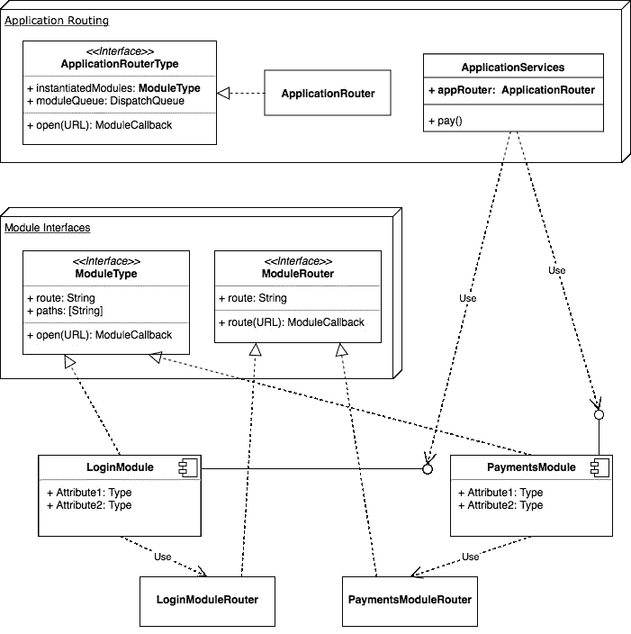

# 面向模块的体系结构第 3 部分:模块和路由

> 原文：<https://itnext.io/module-oriented-architecture-part-3-modules-and-routing-241b06439a9f?source=collection_archive---------8----------------------->

刷新你的记忆:

 [## 面向模块的体系结构第 2 部分:路由和模块

### 刷新你的记忆:

medium.com](https://medium.com/@poksi/module-oriented-architecture-part-2-routing-and-modules-2437e6a292e7) 

# 模块布线

它在`ModuleRouting`协议中定义得非常简单。它的作用主要是从 ModuleType 类中获取路由任务，只让它们负责充当模块功能的网关。另一方面，模块路由器将把对模块的`open`调用路由到用`path`参数定义的适当功能。

# 登录模块路由器

让我们先来看看第一个`LoginModuleRouter`:

让我们先来关注一下`ApplicationServices` `pay`调用中使用的`case “/payment-token”`。我们这里有一个对`LoginInteractor`的简单调用(将在后面介绍)并在其回调中返回`token`参数。然后，令牌从交互器返回到`LoginModule`回调，交互器将令牌返回到代表动作 `/payment-token`结果的`ApplicationServices`回调。

您还可以看到，我们已经在`enum LoginModuleParameters: String`中正式确定了潜在参数。

现在让我们看看`LoginInteractor`:

如你所见，这几乎是我们对交互类的期望。我们不会深入讨论`MockInteractorService`类的细节，因为它与我们的案例无关，但是，在本系列下一章的末尾，您会在整个存储库中看到完整的代码。

# 支付模块路由器

你可以想象，那一个和`LoginModuleRouter`非常相似，所以我把两个类放在同一个要点里:

同样，我们不会为`MockPaymentsNetworkService`而烦恼。我们可以看到这个故事非常简单，我们只需通过`token`和`amount`就可以成功执行交易。

# 类图

我想现在我们可以用一个合适的类图来结束第一次旅程，以便更好地表示体系结构:

下一章将处理不同种类的模块。不符合`ModuleType`的。

 [## 面向模块的体系结构第 4 部分:非一致性模块

### 刷新你的记忆:

medium.com](https://medium.com/@poksi/module-oriented-architecture-part-4-non-conforming-modules-9c18ec2d2180)