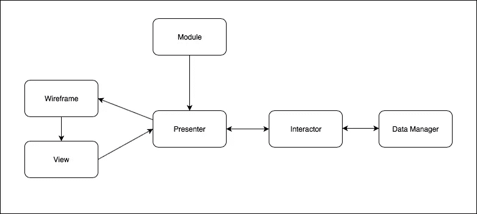

# 面向模块的体系结构—第 6 部分:超越 MVC

> 原文：<https://itnext.io/module-oriented-architecture-part-6-outsmarting-the-mvc-26ef66111057?source=collection_archive---------3----------------------->

@…上接[第五部](https://medium.com/@poksi/module-oriented-architecture-part-5-implicit-routing-655b468ca1b4)

# 故事板和 MVC

尽管这一部分比前一部分更加 iOS 化(也是最长的一部分)，但它确实解决了所有客户端架构或多或少都有的*一般问题:* ***如何防止导航元素成为架构，如何将架构基于业务层而不是表示层。***

我们的架构方法的关键时刻来了，iOS 上有**故事板！**
故事板。害怕，诅咒，崇拜，…

当然，这个系列无意加入任何一种关于故事板主题的火焰战争。它实际上是以两种不同的基本类型为模块定义了一个简单的命题:

*   没有故事板的模块
*   带有一个故事板的模块

一个。没有更多的。答案很简单:任何模块都不应该大到创建一个大的故事板或者需要不止一个。模块应该提供单一功能。

模块中的故事板作为属于某个模块的各种`UIViewControllers`的容器。当然，如果需要的话，这样的故事板可以在模块中包含自己的导航，但是首先，模块需要获得创建视图控制器并将其添加到任何类型的现有导航中的机制。

视图控制器和导航控制器可以有很多不同的方式进行初始化、设置、风格化和定制。相同的视图控制器甚至不必在应用程序的任何地方都以相同的方式呈现。想象一下在我们的演示项目中有一个`LoginViewController`,它可以在应用程序开始时被设置为根视图控制器，或者如果从应用程序的其他地方调用(例如会话令牌已经过期，需要重新认证),则可以模式化地调用。
**一个模块应该优雅地处理这两种情况，当被访问时，简单地响应定义表示类型的传递参数。**

## 但是所有这些“智胜 MVC”是怎么回事呢？

**MVC** 在 **UIKit** 内部根深蒂固。`UIViewControllers`，作为 UI 事件的委托，加上 UIKit 的导航类/元素，使得 UIKit 非常强烈的 MVC 固执己见。每当我们试图实现任何其他架构概念时，像 **MVVM** 、 **MVP** 、**毒蛇**、…我们主要处理的是从`UIViewController`拿走控制权。然而，即使我们在这方面取得了一些成功，我们也不会比导航元素更聪明。从本质上来说，移动应用受到 UX 的强烈驱动，它强烈依赖于平台导航元素来提供预期的用户体验。问题是在这种情况下

> ***导航很容易变成架构本身，这违背了基于业务分析中定义的用例而不是表现来构建架构的原则。***

并不是说在其他任何平台上就好很多。例如，一些前端 WEB 框架基本上是 MVC 容器。然而，由于处理 **Javascript** 文件而不是名称空间的性质，它比在本地客户端技术上感觉更少干扰。

我们这里的例子将展示，如何**解决这两个问题:**

*   **`UIViewController`**结束统治，或者一般的 MVC****
*   **从导航元素/表现上掌控架构**

# 任务

## I .将故事板绑定到模块

**1。故事板可以是模块本身的一部分**

没错。也明确引用。对于那些即使在不同的应用程序中使用也很少改变的模块来说，这可能是有意义的。它可能会提供一些不同的固定样式选项，这些选项可以作为一个参数暴露在模块契约中，就字体和颜色模式而言，但对于某些用例来说，这可能会变得太有限太快。

**2。故事板是主应用程序**的一部分

故事板仍然使用模块中代码的固定 ID 引用，但故事板是由主应用程序提供的，开发人员可以自由使用不同的样式，甚至在某些地方查看控制器类(如果需要)。

**3。故事板 ID 作为参数传递给模块。**

这个选项是最灵活的。我们不仅可以创建自己的故事板，还可以创建更多的故事板，并在调用时通过传递故事板 ID 将它们注入到模块中。我们有完全的自由来处理样式，注入我们自己的样式类，使用我们自己的子类`UINavigationController`和`UIViewController`。这意味着我们的模块实际上可以有默认的故事板，但是如果我们愿意，我们可以注入我们自己的故事板。不仅如此:我们可以从不同的用户工作流程中注入不同的故事板！
这也将是我们在代码示例中的选择，它将继续我们现有的项目。

## 二。注入初始视图控制器

这个选项也非常灵活。

**1。初始视图控制器 ID 没有作为参数传递。**

Storyboard 只使用默认的初始视图控制器。笔尖锉

**2。我们将初始视图控制器 ID 作为参数**传递

故事板初始化了由传递的参数标识的视图控件。如果没有找到，它可以简单地默认为。笔尖文件。

故事板中的视图控制器当然已经有了很多定制，比如样式，它也可以通过. nib 文件注入对象，特别是样式对象。

## 三。呈现方式

我们现在明白了，我们应该如何以及从哪里实例化初始视图控制器，但这并不是故事的结尾。我们有很多很多方法来展示一个视图控制器。让我们来看几个:

*   纯全屏模式
*   莫代尔裹在`UINavigationController`
*   定制尺寸的模型
*   推到当前导航堆栈上
*   在标签栏控制器中实例化
*   …

当然，我们可以更深入地讨论上述内容的许多衍生物，但让我们先解决我们已经发现的问题。

我首先想到的问题是，如何保持解耦的架构，并且仍然创建和呈现模块自己的视图控制器，而这些视图控制器是模块显然不应该知道的，或者通过特定类型引用它们(保持我们的模块解耦和高度可重用的基本条件)。我们还需要理解，来自一个特定模块的初始视图控制器是模块自己的故事板的一部分，并明确地不知道谁应该呈现它。此外，这可能与打开该模块的模块/服务有关。同一个模块可以从应用程序的不同部分打开，因此它的视图控制器每次都可以由另一个不同的视图控制器呈现/推送…

尽管这听起来很复杂甚至不可能，但实现起来还是相对容易的。以下是可能的解决方案列表:

*   模态视图控制器可以简单地从`rootViewController`、`topViewController`开始呈现，从`rootViewController`开始从堆栈中最顶端的`UINavigationController`开始呈现，或者基本上从任何其他地方呈现
*   视图控制器可以简单地从`rootViewController`推到堆栈中最顶端的`UINavigationController`，或者我们可以简单地将新的视图控制器推到特定于应用的`UINavigationController`，这不成问题，因为`StoryboardModuleType`将在它的扩展中有这个实现，因此独立于模块。
    -它也可以在选项卡视图控制器中实例化，这与上面的特定于应用程序相同，因此`StoryboardModuleType`扩展可以引用特定于应用程序的类型来实现它，使模块再次与其解耦

我们的示例将使用模态表示来实现`LoginModule`，并将在当前导航堆栈上推送`PaymentsModule`。

## 四。如果可能的话，使模块无状态，视图唯一

我们的例子将展示，我们如何用相同的参数调用我们的`PaymentsModule`两次，我们将不创建任何新的状态，我们将不创建新的视图，并且在我们的例子`PaymentsPresenter`中不创建新的订阅的可路由类。

## 动词 （verb 的缩写）使内存管理变得安全和简单

当把更多的类放在一起提供一个功能时，挑战之一当然是内存管理。很快就会变得非常糟糕…我们将会看到，我们是如何确保不在模块类中保留任何对象的，以及消除一个`UIViewController`是如何释放所有其他对象的，因为它通过单个 object: Presenter 保存了对对象图的唯一强引用！

## 不及物动词编排并使代码干净！

我们将使用或多或少经典的 VIPER 类来实现编排。

# 呜哇？！？代码示例是**毒蛇**！

所以，我们在这里看到了大部分的蝰蛇职业。

> 那么这种所谓的面向模块的架构和 VIPER 之间的区别是什么呢？

这基本上是两个不同的东西:互补的和在两个不同的层面上。

> MOA 处理模块之间的关注点分离、解耦和应用程序级的干净代码，而 VIPER 在模块内部也做了同样的事情。

像 VIPER 对象一样，这里定义的模块很容易作为一个单元进行测试和模仿。
面向模块的架构将模块作为应用的基石，并借助少量基础设施对象来路由模块和编制应用服务的高级逻辑，除了模块本身之外，它不需要任何其他东西，可以解耦和重复使用。
最终，甚至编排部分也可以包含在一个编排模块中，该模块将隐式包含应用服务。那么，为什么是恐鸟呢？因为它把模块放在第一位。

另一方面，如前所述，VIPER 处理类似的问题，但方式不同，层次较低。

同样，从最严格的意义上来说，模块在 **MOA** 和 **VIPER** 中的含义可能有一个显著的区别。
后者将模块定义为“每一项功能”以及所有的类。因为在 iOS 的情况下，视图实际上是`UIViewController` 和所有伴随的视图，这意味着每个`UIViewController`将得到一个完整的 **IPER** 类，在嵌套视图控制器的情况下，并严格遵循定义，我们可以很快发现自己在非常过度设计的对象网格中，这将会给 VIPER 及其崇高的事业带来不好的名声。事实上，这正是经常发生的事情，也是为什么有些人不喜欢 VIPER 的原因。

**作为一个概念，MOA 中的模块技术含量较低，功能性更强。**这里一个模块可以包含不止一个视图控制器，但是按照惯例，我们决定它只能包含一个故事板。MOA 中的模块旨在提供一种功能，提供完整的端到端功能体验，而不仅仅是其中最小的可用部分。这样看来，它有点像敏捷中的史诗。

# 那么，我们在代码中添加/更改了什么？

我们不会在这里介绍所有的内容，这可能会有点太长，最好从底部的链接下载代码。然而，我们应该提到几个最重要的事情:

## 1.将应用服务变成一个简单的案例

我们重新引入了服务`pay`，在我们的例子中，它执行以下操作:

*   用方法`/pay`调用`PaymentsModule`，但没有调用`paymentToken`，返回 401 错误
*   错误被处理，并且用模态视图控制器调用方法`/payment-token`的`LoginModule`来输入用户名和密码
*   如果凭证是正确的，那么返回`paymentToken`并递归调用服务`pay`，这一次使用令牌和所有相同的其他参数，但是没有创建新的视图控制器或呈现器并将其推送到导航堆栈上！

## 2.介绍“线框类型”

它或多或少是典型的线框对象，由演示者用来演示视图。它执行以下操作:

*   拥有故事板
*   保存一个弱引用的已经呈现的视图控制器的集合，为了检查的目的，所以相同的不会被呈现两次(这是一种协议，所以我们可以更随意地调用模块)
*   根据接收到的参数，以不同的呈现模式呈现视图控制器

还有对`WireframeType`协议的扩展，其中实现了所有的样板代码，但是我不认为有必要在这里展示，如前所述，有一个完整的 repo 要下载。

我们还可以看到`ModulePresentationMode`，它定义了视图应该如何呈现，我们在这里也有非常简单的 bot 模块实现。所有的复杂性都在协议扩展中实现。

## 3.介绍演示者

老好人**毒蛇**伙计们:

*   他们拥有线框
*   作为模块类的`ModuleRoutable`订阅，是内部模块逻辑的入口点，但是它们不归模块所有，而是传递给视图控制器，从而确保当视图控制器被解散时，所有以 Presenter 开始和结束的内容都被安全地释放
*   通过线框呈现视图控制器，因此永远不要接触 UIKit
*   由视图控制器强烈引用，并由它们单方面访问，以便为它们提供直接为视图准备的视图模型或数据
*   拥有任何其他潜在的对象，比如视图模型和交互器

## 4.模块获得了“instantiatedRoutables”属性

当我们实例化`ModuleRoutable`时，我们在模块级的集合`instantiatedRoutables`中弱引用它。这意味着我们只想实例化一个特定的已订阅的可路由路径一次。虽然这引入了一个状态，将线程安全性推低了一个级别，对于其他类，由`ModuleRoutable,`引用，这使得只调用相同的对象一次而不创建新的视图变得更容易，新的视图已经驻留在导航堆栈上并被它保留。这在编排`ApplicationServices`中的依赖关系时很有用，我们用相同的参数反复调用`PaymentsModule`，只是为了实现绑定，编排模块外的逻辑。
然而，当`UIViewControllers`释放拥有提交者的线程时，同样的情况也会发生在提交者身上，使得他们只在一个 UX 会话中是线程不安全的。那一点也不差。但是对于没有视图控制器的模块来说，这可能是一个问题。在这种情况下，实例化可替换的唯一实例将是一个更好的选择，我们可以在以后打开它。

# 摘要

> 我们成功地打破了 UIKit 导航元素的链条和框架，并控制了架构，现在架构归业务层所有，而不是由呈现层所有。

从[这里](https://github.com/poksi592/module-architecture-demo/releases/tag/1.2.1)下载本章的代码。

接下来将是系列的最后一章[，将是对 MOA 和一些 iOS 特性的综合。](https://medium.com/@poksi/module-oriented-architecture-part-7-wrap-up-742aaf696de6)