# MongoDB Compass:数据可视化的个人体验

> 原文：<https://itnext.io/mongodb-compass-personal-experience-of-data-visualization-807ed90ba213?source=collection_archive---------0----------------------->


由于 [MongoDB](https://www.mongodb.com/) 有一个灵活且不受严格约束的模式，每个开发人员或数据库管理员都需要一个强大的工具来高效地处理数据并轻松地分析数据。

有助于理解存储在集合中的底层数据的工具之一是[**MongoDB Compass**](https://www.mongodb.com/products/compass)—**GUI 应用程序**，它消除了连接到 Mongo shell 或学习 MongoDB 查询语法的需要。它提供了丰富的功能集合:您可以浏览/编辑/添加/删除您的数据，交互式地构建聚合管道，实现数据验证，以及评估特定集合或数据库的性能。

该工具有三个版本——社区版、企业版和企业只读版。挑一个最适合自己的。所有版本都能在 Windows 和 Mac OS X 上流畅运行。

您可以按照本指南[中的步骤](https://docs.mongodb.com/compass/master/install/)下载并安装该应用程序。

# 测试工具

让我们看看 Compass 如何处理可视化数据。我们将熟悉主要功能，并执行一些基本的探索性分析任务。

## 接口组件概述

一旦你运行指南针，你会发现自己在登陆页面。

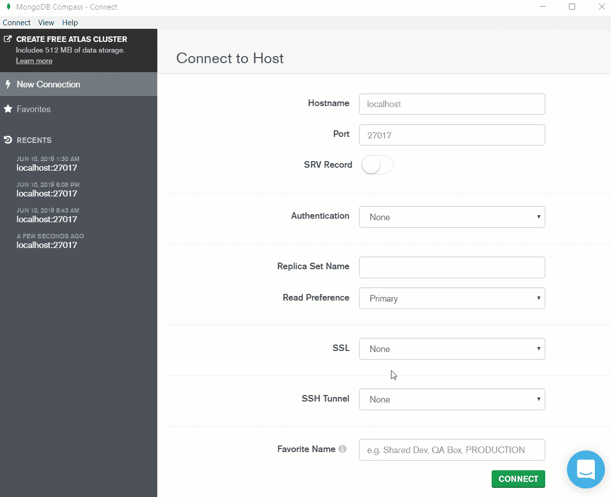

这里您需要指定所有的*连接配置*:主机名、端口、认证类型、SSL、SSH 隧道等。

左侧面板将提醒您最近的连接，您可以选择其中一个来自动填充字段并快速开始。

在页面中央，您会看到数据库列表。在这里你可以选择其中的一个，检查它们的存储大小，集合数量和索引。

如果你点击**性能**标签，你会看到**实时**服务器**分析**。它说明了集群中正在发生的事情:执行了哪些操作、网络流量分析、连接和内存消耗。快速浏览一下，然后继续创建集合——您可以稍后回来评估性能。

## 加载数据

为了让这个概述更令人兴奋，我决定检查一下致力于 120 年奥运历史的 Kaggle 数据集。我们会试着从中提取一些见解。

考虑到 MongoDB 中的文档存储为 JSON，我们需要将 CSV 文件转换为 JSON 文件。

在数据库中创建集合之前，考虑 MongoDB 需要一种特殊格式的 JSON 数据:

```
{
    "Name": "Gunn Margit Aas Andreassen",
    "Sex": "F",
    "Age": 24,
    "Height": 177
} {
    "Name": "Monica Aksamit",
    "Sex": "F",
    "Age": 26,
    "Height": 183
}
```

但是我们的数据集具有以下结构:

```
[{
    "Name": "Gunn Margit Aas Andreassen",
    "Sex": "F",
    "Age": 24,
    "Height": 177
}, {
    "Name": "Monica Aksamit",
    "Sex": "F",
    "Age": 26,
    "Height": 183
}]
```

因此，通过在 CLI 中运行以下命令，将传统的 JSON 数组导入 MongoDB:

```
mongoimport --db <db-name> --collection athletes --type json --file athletes.json
--jsonArray
```

瞧啊。现在您已经有了一个名为**运动员**的新集合，并且其中填充了数据，您可以预览所有文档，以表格/列表视图显示。

查看所有关于集合中文档总数、文档、索引和字段的总大小和平均大小的**基本统计数据**。

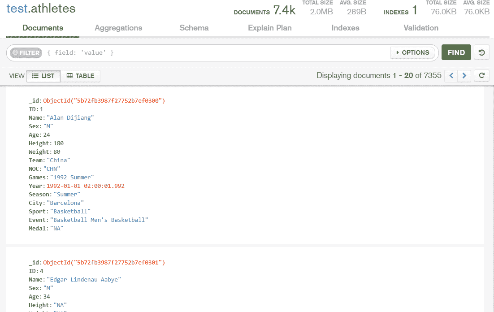

在这里，您可以尝试交互式地编辑数据，执行简单和复杂的查询。

要应用聚合和过滤，您不需要非常了解 MongoDB 查询语言。这就是这个 GUI 工具如此方便的原因。

# 了解结构

接下来我想利用的是**模式可视化工具**——它有助于理解数据的结构。

这个可视化工具是如何工作的？

它从集合中随机选择一个数据子集，并基于这个样本构建一个报告。**采样**是统计分析的*重要技术，因为它极大地节省了计算资源，消除了扫描整个集合的需要*。因此，对数据库性能的影响很小。除此之外，您可以指定一个定制查询来检索满足特定条件的文档子集。

在我们的示例中，报告是基于 13.6%的文档创建的。

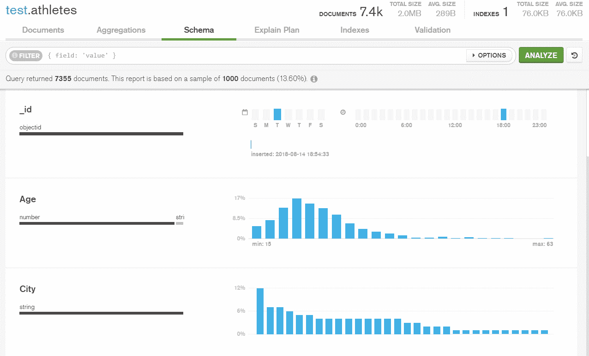

# 深入洞察

查询文档样本后，您会看到一个快速摘要，它涵盖以下几个方面:

您可以分析插入文档时*最受欢迎的日子*。这是通过用直方图表示日期的分布来实现的。此外，还有一个*条形码*，显示文档组插入收藏的时间。

我们如何获得这些信息？

MongoDB 中的每个文档都有一个带有惟一默认值的 *_id* 字段。它是在插入文档时自动创建的。它的类型是 ObjectID，其中的实例包含带有时间戳的信息。因此，您可以访问任何文档的创建时间

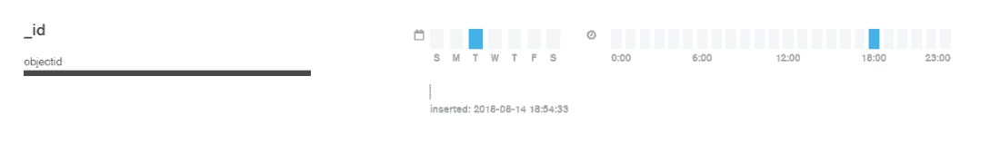

让我们继续看一看其他领域的**描述性统计**。

在这里，您可以注意到为包含多个唯一字符串的字段显示了一个值示例。每次需要时，您可以更新它来查看随机子集。只需单击箭头符号即可刷新列表:

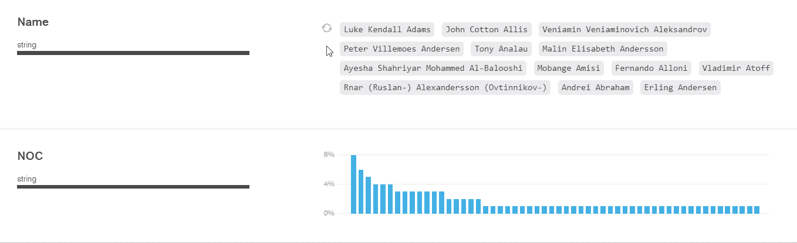

要在文档中找到重复的*字符串*，您可以使用显示在字段附近的*直方图*。它显示了字段值的分布。在这个例子中，你可以得出一个结论:数据集中最受欢迎的运动是*田径*，第二受欢迎的是*游泳*，第三受欢迎的是*摔跤*。

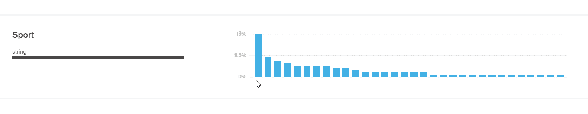

如果字段有少量可能的字符串值，例如两个，则值的分布由单个*条*表示:

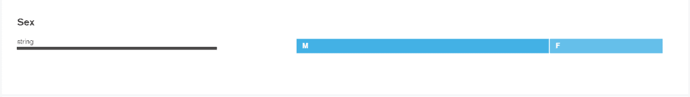

你可以使用**直方图**的另一个很酷的例子是当试图找到字段的最小值和最大值时(这只适用于数值)。

让我们检查一下我们的数据范围。运动员的最小和最大年龄分别为 4 岁和 54 岁。大多数运动员的年龄在 22-24 岁之间:

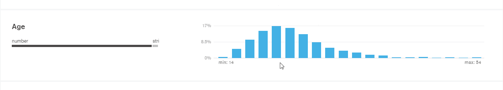

你可以通过类似的方式了解身高范围:


您可能已经注意到，*‘Height’*字段值的一部分是数字类型，另一部分是字符串类型。由于这种可视化，您知道字段的数据类型是异构的。

按时间间隔分组的年直方图:

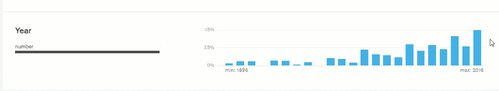

Compass 的另一个强大功能是**解释计划**。这对查询性能的分析非常有帮助。在这里，您可以评估查询执行时间并捕获任何未编制索引的查询。

此外，您可以选择结果的表示——作为一个*可视化树*或者一个*原始 JSON* 。

选择一个最适合你的。

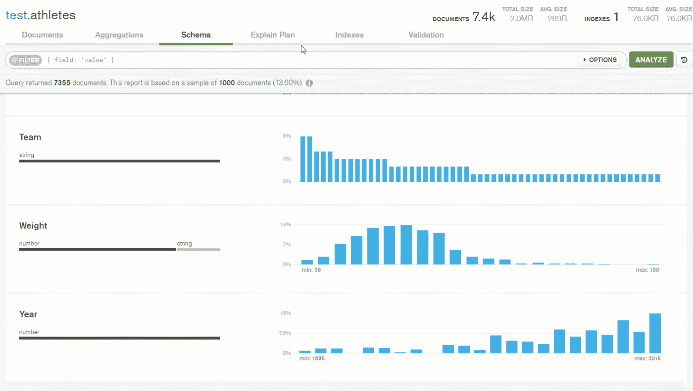

在**索引**选项卡上，您可以检查此集合的索引，了解它们的类型、大小和属性。

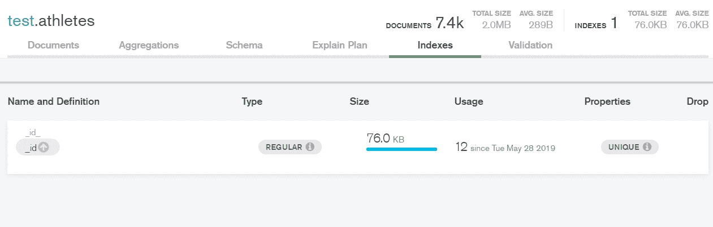

使用**数据验证**，您可以使用**规则生成器**添加验证规则，以在更新或插入文档时强制文档的数据结构。此功能有助于保持数据整洁。

# 最后的话

在我看来， **MongoDB** 和 **Mongo Compass** 一起工作非常有魅力。在我看来，Compass 是处理 MongoDB 数据的最原始的方式，因为它极大地提高了生产率。它同样可以很好地处理*数据库管理任务*和数据的初始*探索性可视化和分析*，消除了使用 MongoDB shell 的需要。当然，您不能称 Compass 为全功能 BI 解决方案，因为它处理完全不同的任务，即:

*   交互式地可视化和探索**模式**。你可以很容易地看到集合的结构并检查文档中每个字段的数据类型。
*   使用可视化查询构建器构建**聚合管道**。
*   使用可视化编辑器修改/删除/插入文档。
*   解释性能问题。
*   管理索引。
*   分析**实时**中的服务器统计数据，包括操作、查询、网络流量等信息。有了它，您可以跟踪集群中正在发生的事情。
*   正在验证**文件**。您可以添加规则，以确保在插入之前根据这些规则检查所有传入的文档。

另外，我想提一下，你可以通过创建或安装一个自定义插件来扩展它的功能。

我建议每个人利用不同的工具和方法尝试数据。在下一篇文章中，我将介绍如何使用 [MongoDB 图表](https://www.mongodb.com/products/charts)作为**商业智能**的解决方案。

感谢您的阅读！

你最喜欢的 MongoDB 的 GUI 应用有哪些？请在下面的评论中分享:)