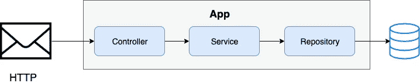

# 来自 Mongoose 模式的 NodeJs MongoDb fixture—faking goose with node-MongoDb-fixture

> 原文：<https://itnext.io/mongodb-fixture-from-mongoose-schema-fakingoose-with-node-mongodb-fixtures-83013238727f?source=collection_archive---------7----------------------->


本文将向您介绍在运行测试之前用样本数据加载 MongoDB 数据库的步骤，然后在测试完成后删除数据。将使用两个包来创建夹具:

*   [**faking goose**](https://www.npmjs.com/package/fakingoose)将用于根据用**mongose**定义的实体模式生成假的或模拟的数据。
*   [**node-mong db-fixture**](https://github.com/cdimascio/node-mongodb-fixtures#readme)用于运行测试前保存数据，测试完成后删除数据。

# 这篇文章中的一个附件

术语 fixture 根据上下文、编程语言或框架而变化。

*   **测试正在运行的已知状态**

> 编写测试最耗时的部分之一是编写代码将世界设置在一个已知的状态，然后在测试完成时将它返回到原始状态。这种已知状态被称为测试的*夹具*。
> [**PHP-单元文档**](https://phpunit.readthedocs.io/en/8.3/fixtures.html)
> 
> 一个[测试夹具](https://en.wikipedia.org/wiki/Test_fixture)(也称为测试环境)是运行测试所需的一组[前提条件](https://en.wikipedia.org/wiki/Precondition)或状态。开发人员应该在测试之前设置一个已知的良好状态，并在测试之后返回到原始状态。
> [**维基百科**](https://en.wikipedia.org/wiki/XUnit#Test_fixtures) **(xUnit)**

*   **包含样本数据的文件**

> **Fixtures** 是样本数据的别称。Fixtures 允许您在测试运行之前用预定义的数据填充测试数据库。夹具是独立于数据库的，并且是在 YAML 编写的。每个型号有一个文件。
> 
> [RubyOnRails.org](https://guides.rubyonrails.org/testing.html#the-low-down-on-fixtures)

*   **设置所需状态的过程。**

> 软件测试夹具通过提供所有必要的代码来初始化系统，从而满足可能存在的任何先决条件，从而为测试过程设置系统。例如，在运行测试之前，从客户站点加载一个具有已知参数的数据库。[**百科**](https://en.wikipedia.org/wiki/Test_fixture#Software)

**在本文中，fixture 是最后一个定义，它是设置运行测试所需的已知状态的代码。**

# 一个样本系统

让我们定义一个提供 ***HTTP*** 资源 ***/articles*** 的假想服务。这个资源的数据存储在 MongoDB 数据库中。该服务使用 [**快递**](https://expressjs.com/) **实现。我们的 Express 应用程序将具有以下结构。**



# 测试工具

我们将使用的工具包括

*   [**摩卡**](https://mochajs.org/):JavaScript 的测试者。
*   [**柴**](http://chaijs.com/) :一个断言库。我们使用 Chai 和一个额外的插件， [**ChaiHttp**](https://www.chaijs.com/plugins/chai-http/) 。ChaiHttp 插件为 Chai 添加了 Http 请求行为，并允许我们向 Express 应用程序发出 HTTP 请求。
*   [**Fakingoose**](https://www.npmjs.com/package/fakingoose):NodeJS 的模拟数据生成器，使用 Mongoose 模式生成假对象。
*   [**node-MongoDB-fixtures**](https://github.com/cdimascio/node-mongodb-fixtures#readme):NodeJS 的夹具管理模块。这个模块负责将夹具数据保存到 MongoDB。
*   [**TestTontainers**](https://github.com/testcontainers/testcontainers-node):提供管理 Docker 容器的 API 的模块。在运行测试之前，它将在一个 [Docker 容器](https://www.docker.com/resources/what-container)中加载一个 MongoDb 服务器。一旦测试完成，Docker 容器将被停止。

**安装摩卡**

全球安装摩卡:

```
$ npm i -g mocha
```

或者作为我们项目的开发依赖:

```
$ npm i -D mocha
```

**安装测试依赖项:**

```
$ npm i -D chai chai-http fakingoose node-mongodb-fixtures testcontainers
```

# 管理测试数据—设置和清理

两个 javascript 文件将包含我们的夹具代码:

1.  第一个文件将保存模拟数据。
2.  第二个文件将使用前一个文件中的模拟数据来填充 MongoDB 数据库。

## 1.生成模拟数据

node-mongodb-fixtures 需要一个包含所有 fixture 数据文件的目录，每个集合一个文件。每个文件必须与其目标集合共享相同的名称。让我们创建一个名为 *articles.js.* 的 javascript 文件，该文件返回的数据将用于创建 *articles* 集合中的文章。

```
*// fixtures/entities/articles.js**const* **fakingoose** = require('fakingoose');
*const* **ArticleSchema** = require('../../../lib/schemas/article.schema');
*const* **articleFactory** = fakingoose(**ArticleSchema**, { _id: { tostring: **false** }, authorId: { tostring: **false** } });**module**.exports = [
  articleFactory.*generate*(),
  articleFactory.*generate*()
];
```

在上面的代码中:

*   Fakingoose 工厂是基于为 *Article* 实体定义的 Mongoose 模式创建的。然后，这个工厂用于生成模拟对象。
*   生成的模拟数据作为模拟对象的数组导出。

## 2.数据库加载和清理

下一步是使用模拟数据目录中的文件提供的数据来填充数据库。

```
// tests/fixtures/article.fixtures.js***const*** **Fixtures** = require('*node-mongodb-fixtures*');
***const*** **path** = require('*path*');module.exports = ***async*** (dbUrl) => {
  *const* **fixtures** = new Fixtures({ dir: path.resolve(__dirname, './entities') });

  **await** fixtures.*connect*(dbUrl).*then*(() => **fixtures**.*load*());  

  **const** **articles** = ***await***   Promise.***resolve***(fixtures._db.*collection*('articles'))
  .*then*((collection) => {
    ***return*** **collection**.*find*().*toArray*();
 }); ***const*** **cleanup** = () => **fixtures**.*unload*()
   .*then*(() => **fixtures**.disconnect()); ***return*** { **cleanup**, entities: **articles** };
}
```

在上面的代码中，模块返回了一个函数。该函数使用 node-mongodb-fixtures 模块将生成的模拟数据保存在 mongodb 数据库中，该数据库的 URI 作为参数传递。该函数返回一个具有两个属性的对象:

*   **实体:**MongoDB 数据库中保存的文章。
*   **清理:**调用者可以用来清理数据库的函数。调用这个返回函数的最佳时机是在测试完成之后。

# 测试业务逻辑

我们希望编写简单的测试来检查我们的 API 是否返回了正确的数据。

下面的测试套件是用 mocha 的默认接口( **BDD** )编写的。测试套件、钩子和测试可以使用 Mocha 提供的不同接口来定义，即: **BDD** 、 **TDD** 、 **Exports** 、 **QUnit** 和**requires**。对于想了解更多的好奇者来说，Mocha 文档提供了更多关于接口的细节。

```
// tests/article-api.test.jsconst chai = require('chai');
const chaiHttp = require('chai-http');
const createArticles = require('../fixtures/article.fixtures');
const appSetup = require('../setup');
const { expect } = chai;
chai.use(chaiHttp);**describe**('Articles', () => {
  let deleteArticles, articles, stopDb, dbUrl, app;
  **before**(async () => {
    ({ app, dbUrl, stopDb } = await appSetup.init());
    ({ cleanup: deleteArticles, entities: articles } =
       await **createArticles**(`${dbUrl}/test-db`));
  }); **after**(() => deleteArticles().then(stopDb)); **describe**('GET /', () => {
    **it**('must fetch all articles', async () => {
      const response = await chai.request(app).get('/articles');
      expect(response).to.have.status(200);
      expect(response.body.articles).to.have.lengthOf(2);
    }); **it**('must fetch a single article by ID', async () => {
      const [, secondArticle] = articles;
      const response = await chai.request(app)
        .get(`/articles/${secondArticle._id}`);
      expect(response).to.have.status(200); 
      expect(response.body.article.id).to.eql(secondArticle.id);
    }); **it**('must respond with a NOT FOUND error', async () => {
      const response = await chai.request(app)
       .get(`/articles/${articles[1].authorId}`);
      expect(response).to.have.status(404);
    });
  });
});
```

在上面的测试中

*   Express 应用程序和 MongoDb 数据库的初始设置在 **before()** 钩子中完成。一旦数据库启动， **createArticles()** 函数(之前定义的 *article.fixtures.js* )用于在 MongoDB 数据库中创建示例文章。该函数返回一个清理方法(重命名为 **deleteArticles()** )和已保存文章的列表。这种清理方法被存储起来以备后用。
*   mocha 的 **it()** 函数用于定义通过向 Express App 发送 HTTP 请求来检查 API 行为的测试。
*   ()后的**钩子用于从数据库中删除数据。在 before()钩子中定义的 **deleteArticles()** 函数在这里用于在测试完成后从数据库中删除创建的文章。**

**使用 Fakingoose 和 node-mongodb-fixtures，我们为测试创建了 fixture 代码。Fakingoose 用于生成数据，而 node-mongodb-fixtures 提供假数据的保存和删除。摩卡和柴用于测试，但你可以使用任何其他替代品。**

**完整的源代码可以在 [GitHub](https://github.com/faboulaws/blog-source-code/tree/master/fixtures-tutorial--fakingoose-with-node-mongodb-fixtures) 上获得。**

**感谢阅读。**