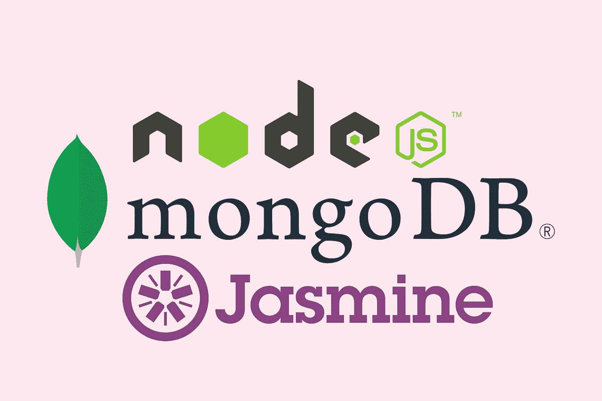

# Node.js 中的 MongoDB 单元测试

> 原文：<https://itnext.io/mongodb-unit-testing-in-node-js-5686390a6689?source=collection_archive---------1----------------------->

## 用 Jasmine，TypeScript 和 Docker-Compose

根据 MongoDB 实例的位置，有多种方法可以测试您的 MongoDB 存储库:

*   在记忆中
*   在码头集装箱✔️
*   在云端的✔️

本教程针对的是后两者。此外，我们将在这里使用 Jasmine 和 TypeScript，但是也可以使用 do same Jest 和/或 plain JS。



# TL；速度三角形定位法(dead reckoning)

如下使用`[mongo-ci](https://www.npmjs.com/package/mongo-ci)`:

```
npm install -D mongo-ci
```

在你的测试中:

# 连接到 MongoDB 实例

TL；DR 部分显示了一个样本存储库测试的 JS 代码清单。没有更多的事情要做，剩下的棘手部分是创建一个 MongoDB 实例。现在，有不同的方法来实现它:

*   在 MongoDB Atlas 上创建一个 MongoDB 实例
*   在本地创建一个 MongoDB 实例，在配置项中创建另一个实例
*   使用 Docker 容器

这些方法的可行性和便利性还取决于是否需要一个副本集。

如果您的代码使用新引入的事务，对副本集进行测试是必不可少的。如果您仍然不使用事务，您很可能会在将来使用它们，所以在本教程的剩余部分，我们将假设您想要部署一个副本集，尽管我们将简单地提到部署独立实例。

请参考 [MongoDB 的复制手册](https://docs.mongodb.com/manual/replication/)以了解更多这方面的信息。

## MongoDB 地图集

使用 MongoDB Atlas 可能是创建 MongoDB 实例的最方便的方式，但是有一些挑战:

*   只有独立实例是免费的，副本集是付费功能
*   如果多个用户和 CI 试图同时运行测试，将会出现争用情况

## 本地和 CI 服务

这个解决方案只允许创建 MongoDB 的独立实例。可以在本地安装 MongoDB，它只是一个实例，无需进一步的虚拟化或容器化。此外，在 CI 中，可以创建一个类似的 MongoDB 服务。以 GitLab-CI 为例:

## 使用 Docker-Compose

使用 Docker-Compose 配置，可以在本地创建一个副本集并连接到它。这将是独立于平台的，但是需要在 CI 上执行 Docker-in-Docker。

# 使用 Docker-Compose 创建一个副本集

我们将创建一个 Docker-Compose 配置文件，该文件创建了 MongoDB 容器的 3 个实例，以拥有一个完整的副本集:一个主副本集、一个辅助副本集和一个仲裁副本集。

要启动 MongoDB 副本集，只需执行以下操作:

```
docker-compose up -d
```

## 集装箱测试

为了方便和进一步的平台独立性，可以将测试放在 Docker-Compose 配置中:

要使用 MongoCI 在 Node.js 测试中使用凭证连接到副本集，请执行以下操作:

并在存储库测试中调用`initMongoConnectionWithDBName`:

```
beforeAll(async () => initMongoConnectionWithDBName('test'));
```

然后以下命令将运行测试:

```
docker-compose -p test up --exit-code-from nodejs-test nodejs-test
```

## 创建 NPM 命令

为了更方便，可以创建 NPM 脚本，并将这些命令放入其中:

这将允许我们只通过以下命令运行容器化测试:

```
npm test
```

测试结束后会进行清理。

# 笔记

*   将测试放入容器不仅仅是为了方便:我们使用主机名`mongodb-primary`,默认情况下在 Docker 网络上下文中解析，而不是在主机上。此外，MongoDB 端口不向主机公开。
*   使用函数`initMongoConnectionWithDBName`可以使用基于云的或远程的 MongoDB 部署，并随机化 DB 名称以避免竞争情况。
*   Docker-Compose 命令中的`-p`选项代表“项目”。这意味着人们可以基于相同的 Docker-Compose 配置创建不同的项目，并且它们不会冲突。因此，您可以在测试的同时使用另一个项目名来运行您的服务器。

# 结论

使用内存中的 MongoDB 实例进行存储库测试是一种方便的解决方案，但是如果想要针对副本集进行测试，这种解决方案就行不通了。用 Docker-Compose 和 MongoCI 提出的解决方案是免费的，并且与 CI 兼容。