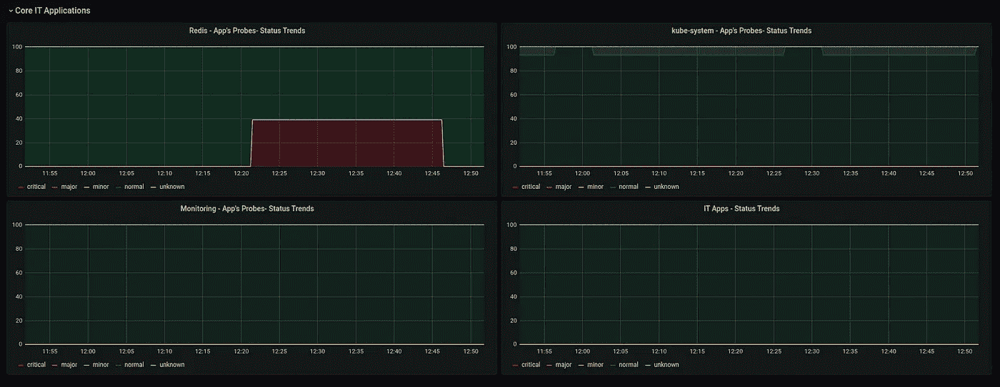
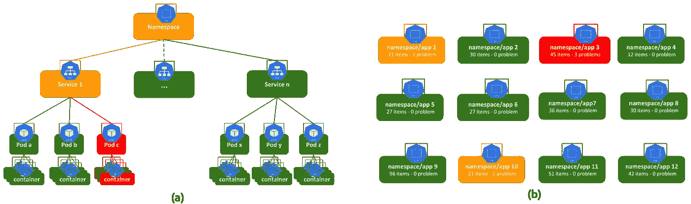
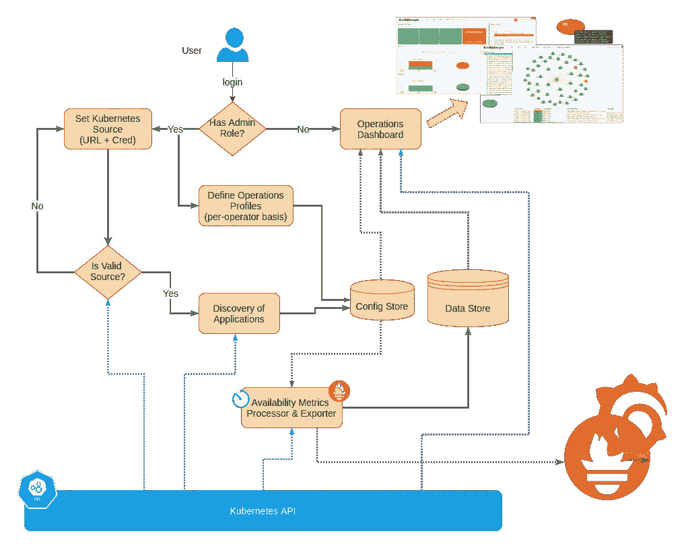
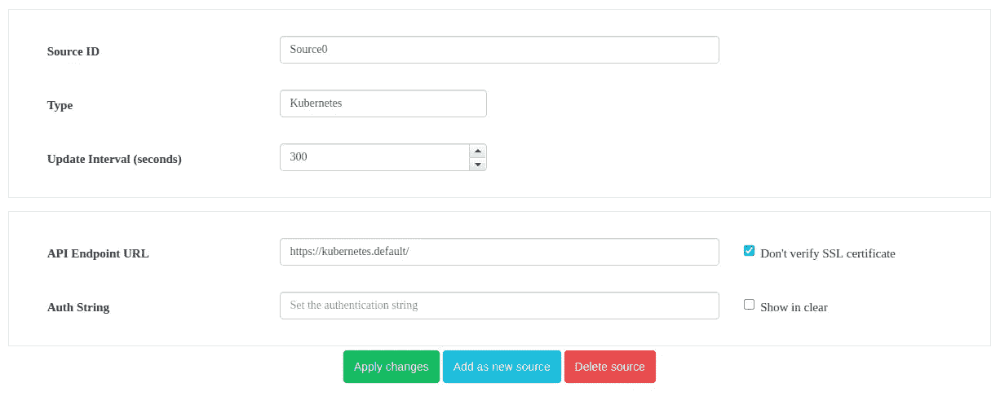
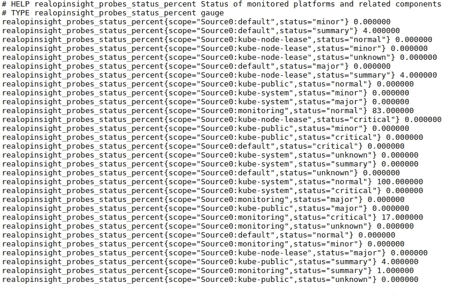
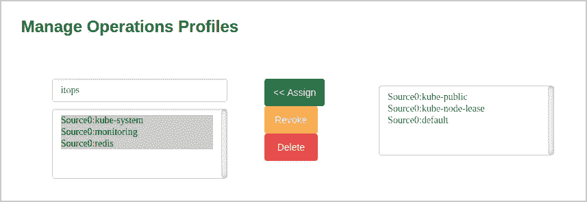
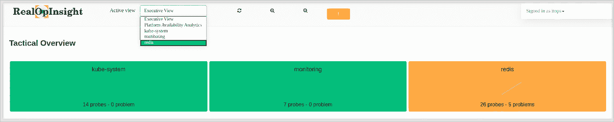
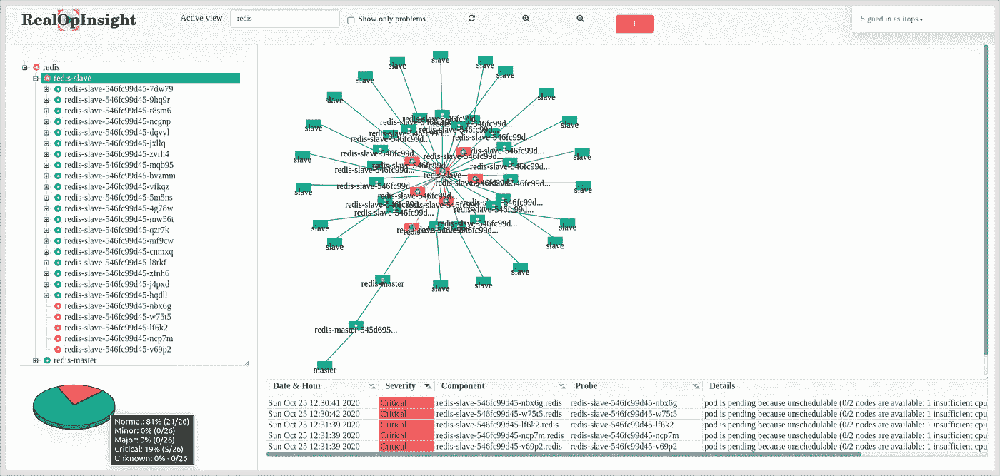
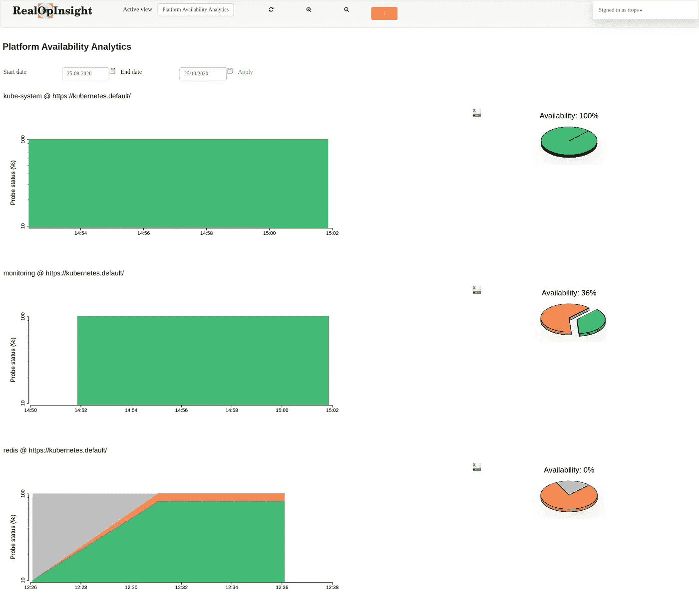

# 监控和测量 Kubernetes 上运行的应用程序的可用性

> 原文：<https://itnext.io/monitor-and-measure-the-availability-of-applications-running-on-kubernetes-b286bf309b8c?source=collection_archive---------0----------------------->

## 观察应用程序可用性的概念和实施—跟踪 SLA/SLO 目标的基础。



一段时间内观察探测器事件的仪表板示例

当应用程序投入生产时，我们主要关注的问题之一是确保它们得到适当的监控，特别是通过适当的检查和合适的指标来报告它们随时间的可用性。本文旨在解决这一问题。它特别关注在 Kubernetes 上运行的应用程序，建立了一个监控、测量和观察应用程序可用性的标准。*目标是帮助组织定义服务水平目标(SLO)和/或服务水平协议(SLA ),同时能够通过实际 KPI 随时跟踪它们。*

本文由两个主要部分组成。第一个是概念性的，介绍我们定义、监控和测量 Kubernetes 上应用程序可用性的基础和假设。第二个是实用的，展示了一个由 [RealOpInsight](https://realopinsight.com/) 支持的实现——一个[开源](https://github.com/rchakode/realopinsight)应用操作监控框架，设计用于在 Kubernetes 之上工作，同时利用后者的基本探测功能。

# 工作说明书

给定一个或多个 Kubernetes 实例，目标是能够监控、测量和跟踪应用程序的可用性，如以下原则所建立的:

*   **定义 Kubernetes 应用程序:**正如前面讨论过的[这里的](https://rodrigue-chakode.medium.com/kubernetes-on-tv-watch-how-your-services-are-operating-in-production-100cd00a0d45)，我们以这两种方式之一定义应用程序。一方面，一个简单的应用程序可以被建模为一组 [Kubernetes 服务](https://kubernetes.io/fr/docs/concepts/services-networking/service/)以及它们在单个名称空间内的 [pods](https://kubernetes.io/docs/concepts/workloads/pods/pod/) 。正如在前面的故事中已经讨论过的[，这种情况下的应用程序可以被看作是*图 1.a* (如下)上的依赖树。具体地说，依赖关系树是服务以及位于它们下面的容器和容器的分层组合。每个容器都与其 pod 相关联，pod 又与其服务相关联，服务最终与顶层的应用程序相关联。另一方面，复杂的应用程序可以被建模为两个或更多命名空间范围的应用程序的组合。](https://rodrigue-chakode.medium.com/kubernetes-on-tv-watch-how-your-services-are-operating-in-production-100cd00a0d45)
*   **计算应用程序状态:**在后台，应用程序的状态是通过收集底层 pod(以及它们的容器)的状态来计算的，然后通过依赖关系树聚集和传播这些低级状态。本质上，Kubernetes 实现了 pod 和容器级别的探测。沿着树的状态聚集考虑了管理不同后备 pod 的资源控制器的类型。通常，ReplicatSet 中的 pod 假定具有相同的功能(即相同的重要性)，而 StatefulSet 中的 pod 并不总是这样。例如，在图 1.a 中，我们突出显示了 ReplicatSet 中的一个 pod 出错的情况，但是该服务只是标记了一个警告状态。这种高级状态聚合的目的是帮助运营团队触发具有适当优先级的事件解决方案。
*   **定义应用程序可用性:**每次，应用程序的整体当前状态由应用程序依赖关系树顶层的状态决定。此状态可让您快速了解应用程序的运行情况(例如，绿色表示正常，红色表示严重问题，橙色表示非严重问题)。如果应用程序的整体状态不是关键的，则意味着它是可用的。
*   **观察应用程序可用性。**在这种方法的顶层(*图 1.b* )，我们在每个时间都有每个应用程序的健康状态。*我们的标准设计假设每五分钟(任意周期)计算一次每个应用程序的状态，并记录下来用于未来的可用性分析。*不仅要记录应用的状态，还要记录探针状态的总结(即故障和正常状态下容器的比率)。
*   **定义 SLA/SLO 目标:**基于上述考虑，可以基于应用在由开始和结束日期设置的给定时间段内的可用性来定义应用的 SLO/SLO 目标。例如，考虑为期 7 天的 5 分钟应用程序可用性检查(即总共 1440 次检查)，如果应用程序在 2 次检查期间不可用，则该期间的可用性可以计算如下:`(1440 — 2)/1444 = 99.9986%`。有了这个基础，我们就可以轻松地跟踪 Kubernetes 应用程序的运行情况。



图 Kubernetes 应用程序可用性监控的概念视图— **(a)** 命名空间范围的应用程序依赖关系树示例— **(b)** 显示一组应用程序的当前整合状态的高级仪表板示例。

记住上述原则，目标仍然是能够为 Kubernetes 应用程序定义和跟踪 SLA/SLOs 目标，下一节将重点演示所介绍概念的实现(即 [RealOpInsight](http://realopinsight.com/) )。我们将展示架构构建块，演示在 Kubernetes 集群上的快速部署。部署之后，将快速演示不同的内置控制面板和可用性分析功能。

# RealOpInsight 设计

*图 2* 展示了与 Kubernetes 集成时 RealOpInsight 的简化流程。在图中，直箭头表示处理路径或内部数据流，而虚线箭头突出显示处理步骤期间的外部数据检索。以下段落描述了该流程的主要组成部分。



图 2:RealOpInsight——处理和数据流概述

**人物角色—**RealOpInsight 的设计引入了两个人物角色(见图中*用户*)。一方面，**管理员**是负责配置和各种管理任务的用户。具体来说，他们的职责包括建立与 Kubernetes 源的集成，创建和管理操作员用户以及允许他们每个人观看的信息(参见下文介绍的*操作简介*)。另一方面，**操作员**是用户，其主要职责是查看与其操作简档相关的信息。对于每个组织，管理员可以根据组织的监控和操作需求，自由定义如何定义每个操作员的操作配置文件。

**操作配置文件—** 这是指允许操作员查看的一组信息。操作配置文件由管理员创建和管理。具体地说，一个操作配置文件将一个操作员绑定到一组允许他观看的应用程序。成功登录后，操作员可以访问控制台，在该控制台上，他只能查看和浏览与绑定到其操作配置文件的应用程序相关的信息。

**一个或多个 Kubernetes 源—**RealOpInsight 的一个实例可以处理多个 Kubernetes 实例。每个源都是根据 API 端点 URL 定义的，可能还有一个令牌来验证它。对于代理访问，或者如果实例作为具有适当服务帐户和 Kubernetes 上的 RBAC 权限的 pod 运行，令牌是可选的。

**应用程序的发现和组合—** 添加 Kubernetes 源时，RealOpInsight 会自动触发一个发现操作，包括查询 Kubernetes API 以检索所有现有应用程序。应用程序列表存储在内部，在定义操作配置文件时使用。如前所述，应用程序基本上绑定到一个名称空间。然而，由于内置的编辑器，管理员还可以基于其他应用程序设置复合/丰富的应用程序。

**可用性监控&Prometheus metrics—**RealOpInsight 具有一个由可配置定时器(默认为 5 分钟)调度的内部组件，用于计算应用可用性并存储它们以供将来分析。该组件还使 Prometheus exporter 能够向外部第三方系统(如 Prometheus/Grafana 堆栈)公开当前可用性指标。RealOpInsight 与内置仪表板一起发布，可处理每个操作配置文件的可用性分析。演示部分(这一部分的下一部分)提供了这个特性的快速浏览。

# 演示旅游

本节将介绍在 Kubernetes 上安装 RealOpInsight，并使用它来观察应用程序的可用性，如上所述。我们将看到建立一个 Kubernetes 源、创建一个操作配置文件以及监视和测量生产中应用程序的可用性是多么容易。除了通过内置仪表板的可视化，我们还将展示一个由 Promeheus exporter 支持的 Grafana 仪表板。

## 在 Kubernetes 上安装 RealOpInsight

有一个[掌舵图](https://github.com/rchakode/realopinsight/tree/master/helm)来简化 RealOpInsight 在 Kubernetes 上的部署。以下命令套件将在名称空间`monitoring`中安装 RealOpInsight 的最新版本(该名称空间必须存在，或者可以更改为任何其他现有名称空间)。

```
git clone [https://github.com/rchakode/realopinsight.git](https://github.com/rchakode/realopinsight.git) && \
  cd realopinsight && \
  helm upgrade \
  --namespace monitoring \
  --install realopinsight \
  helm/realopinsight/
```

部署(参见 [Helm manifests](https://github.com/rchakode/realopinsight/tree/master/helm/realopinsight) )还启用了名为`realopinsiht`的 ClusterIP 服务，公开了端口`80`(集群内 URL:[http://realopinsight.monitoring/ui](http://realopinsight/ui))上的 UI 和端口`4584`(集群内 URL:[http://realopinsight.monitoring:4583/metrics](http://realopinsight.monitoring:4583/metrics))上的普罗米修斯度量。

## 配置 Kubernetes 探测源

这需要以管理员身份登录 RealOpInsight(默认用户名和密码为`admin`和`password`)。

*   选择菜单`Monitoring Sources`打开源配置页面(*截图 1* )。
*   将`API Endpoint URL`设置为`[https://kubernetes.default/](https://kubernetes.defaulth)`(集群内 API URL)，如果集群使用自签名证书，则可选地检查`Don't verify SSL certificate`。
*   将字段`Auth String Token`留空，这意味着 RealOpInsight 使用其 RBAC 服务帐户对 Kubernetes API 进行身份验证。该服务帐户(名为`realopinsight`)及其 RBAC 权限是在 Helm 部署期间创建的。
*   出现提示时，点击`Add as source`并选择信号源的 ID。
*   点击`Apply`完成操作。



屏幕截图 1: RealOpInsight —源代码配置页面。

## 可用性指标

一旦创建了源，负责处理可用性指标的组件开始在后台工作，计算应用程序的状态，并将它们作为普罗米修斯指标公开(*截图 2* )。

根据这些指标，不同的应用由`scope`标签设定。前缀`Source0`是 Kubernetes 源的 ID，允许突出显示发现的应用程序(即绑定到名称空间和通过内置编辑器创建的复合应用程序)。

对于每个应用程序，我们有以下指标:

*   总体聚合状态(参见标签`status="summary"`)，其值可以是以下值之一:0→正常/健康状态；1 →影响较小的问题状态；2 →有重大影响的问题状态；3→具有关键影响的问题状态；4→未知状态。
*   给定状态下底层容器的比率(%)(见标签`status="minor"`、`status="major"`、`status="critical"`、`status="unknown"`)。



截图 2:RealOpInsight——暴露的普罗米修斯指标样本

## 配置操作配置文件

下面的步骤演示了如何创建一个名为`itops`的操作者概要文件，以监控在`Source0`上设置的 Kubernetes 集群中的名称空间`kube-system`、`monitoring`和`redis`中的应用程序的可用性。

*   以管理员身份登录(默认凭证:`admin/password`，选择菜单`New User`。
*   填写所需的用户信息。对于本例，将用户名和密码分别设置为`itops`和`123itsops`。点击`Submit`确认创建。
*   用户创建后，选择菜单`Operations Profiles`配置其操作配置文件。
*   在用户列表中选择用户`itops`(*截图 3* )，然后在右侧选择要关联到其个人资料的项目。
*   点击`Assign`我们就完成了。



屏幕截图 3: RealOpInsight —为用户定义操作配置文件

## 观察应用程序可用性

要查看应用程序的可用性，需要作为操作员用户登录。在我们的例子中，它是在上一步中创建的`itops`。

操作控制台的欢迎页面显示了应用程序运行状况的战术概述。每个应用程序都由一个带有标题和探针当前状态摘要的小块表示。



截图 4:RealOpInsight——战术概述

点击一个磁贴(或者点击`Active View`字段中的相关条目)打开相关的应用仪表板(*屏幕截图 5* )。这个仪表板提供了一些小部件，以获得关于应用程序当前状态的更多详细信息。在上部，一个树形视图(左)和一个地图(右)显示了应用程序组件之间的依赖关系。这两个小部件还强调了每个事件如何影响应用程序的整体状态。仪表板的底部由一个统计面板(左)和一个事件控制台(右)组成，前者显示探测器状态的综合视图，后者显示探测器状态的详细信息。默认情况下，事件控制台只显示问题，但操作员也可以选择查看正常消息。



屏幕截图 5: RealOpInsight —应用程序的详细操作视图，显示了依赖关系树和深入的根本原因探索功能。

## 可用性分析仪表板

从`Active View`字段中选择`Platform Availability Analytics`，切换到应用可用性分析仪表板(*截图 7* )。

在左侧，该控制面板显示了每个应用程序在选定时间段(默认为 30 天，请参见页面顶部的日期筛选器)内的探测器状态历史图表。

还有一个链接可以下载与此图相关的 CSV 格式的数据，以便通过三方分析工具进行进一步分析，例如 Microsoft Excel、 [AWS Athena](https://aws.amazon.com/athena) 、 [Google Bigtable](https://cloud.google.com/bigtable) 、 [Tableau](https://www.tableau.com/) 等。

在右侧，饼图提供了所选时间段内应用程序可用性的分析摘要。显示的可用性比率是应用程序处于正常状态的时间部分(在所选时间段之外)的计算结果。

用户可以通过利用内置的 Prometheus exporter 来扩展这种本机分析仪表板。例如，可以使用像 Grafana.shboard 这样的三方工具来构建等效的甚至更好的仪表板，以观察 p



屏幕截图 6: RealOpInsight —应用可用性分析仪表板。

## 自定义 Grafana 仪表板

下面这个由 dashboard 和 RealOpInsight 的 Prometheus exporter 构建的仪表板展示了监控应用程序可用性的另一个例子。对于每个应用程序或一组应用程序，我们可以观察一段时间内探测事件的比例。这种指标通常有助于设定事故及其解决方案的目标。


RealOpInsight—Grafana 仪表板示例，用于观察探测器上的事件随时间的变化

# 结论

在本文中，我们讨论了一些概念，并提出了一种方法来监控和测量运行 Kubernetes 的应用程序的可用性。目标是能够随着时间的推移定义和跟踪 SLA/SLO 目标。除了概念之外，本文的第二部分演示了如何使用实际的实现，即 [RealOpInsight](http://realopinsight.com/) 。在此之前，我们展示了架构构建块，演示了在 Kubernetes 集群上的快速部署。

在结束这项工作之前，可能值得一提的是，除了 Kubernetes，RealOpInsight 还与 Zabbix 和 Nagios 一起工作。这样，它通过打破传统监控工具的孤岛，支持应用程序操作监控的全球战略。最后，我们记得 RealOpInsight 是开源的，可以在 [Github](https://github.com/rchakode/realopinsight) 上获得。不要犹豫，试一试。

尽情享受，不要犹豫，分享您的反馈！