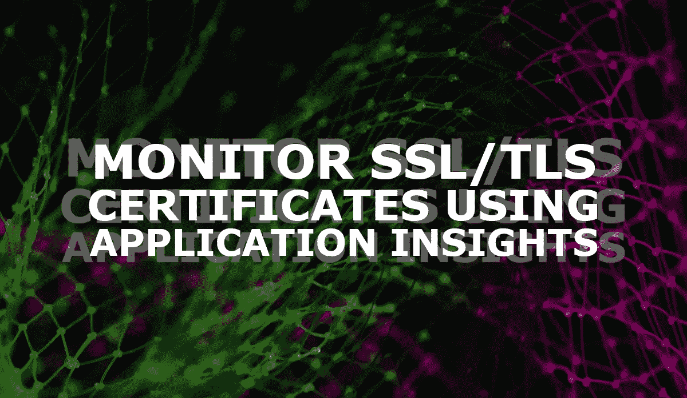
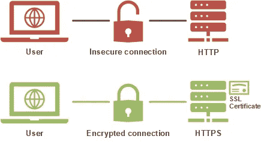
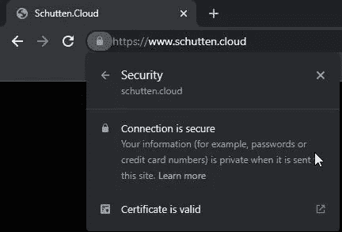
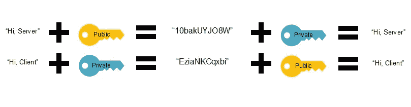
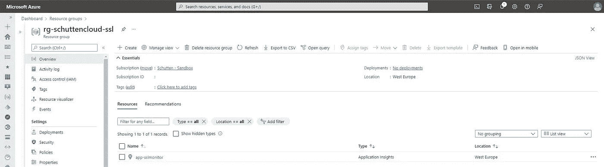
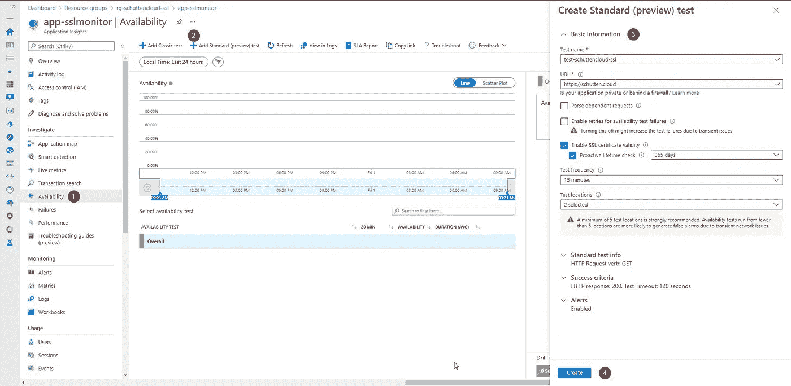
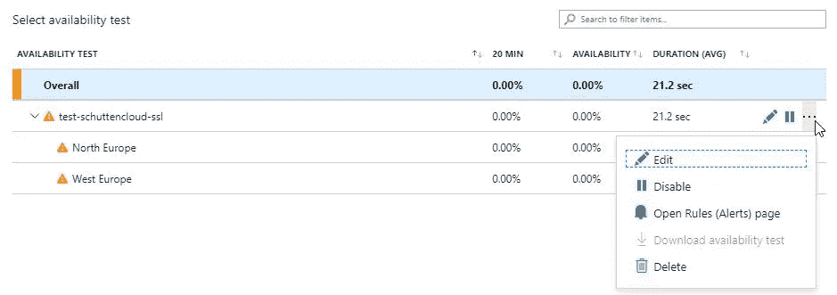

# 利用 Azure 应用洞察监控 SSL/TLS 证书

> 原文：<https://itnext.io/monitor-ssl-tls-certificates-with-azure-application-insights-4f55c792786b?source=collection_archive---------1----------------------->



在本文中，我将解释什么是 SSL/TLS 加密，如何使用 SSL 证书建立 SSL/TLS 加密，以及如何使用 Azure Application Insights 监控即将到期的 SSL 证书。

# 什么是 SSL/TLS？

安全套接字层(SSL)是传输层安全性(TLS)的前身，是一种基于加密的互联网安全协议，它确保互联网通信中的隐私、身份验证以及信息的完整性。加密是一种通过改变信息来隐藏信息的方法，因此它以随机数据的形式出现。加密对于互联网的安全至关重要。

TLS 创建于 1999 年，是目前使用的最新加密协议。SSL 自 1996 年以来就没有更新过，它有一些已知的漏洞，被认为是不安全的，已被弃用。如今，术语“SSL 加密”和“TLS 加密”可以互换使用，但在大多数情况下指的是 TLS。

任何有 HTTPS 网址的网站都使用 SSL/TLS。



*罗尔夫·舒滕的照片*

## 什么是 SSL 证书？

SSL 证书是托管在网站服务器中的文件，显示用于验证网站所有者的重要信息，并使用 SSL/TLS 加密 web 流量。它包括公钥、关于证书颁发者的信息以及相关联的(子)域。试图与网站服务器通信的客户端将引用该文件来获取公钥并验证服务器的身份。私钥只在服务器端保存和使用。

用于 SSL 的公钥和私钥本质上是用于加密和解密数据的长字符串。用公钥加密的数据只能用私钥解密，反之亦然。

需要 SSL 证书来保证用户数据的安全，验证网站的所有权(防止攻击者创建网站的假版本)，并获得用户的信任。许多用户不会注意到一个`http://`和一个`https://`网址之间的区别，但是现代浏览器已经有了更明显的方法来证明网站是安全的。下面是一个例子，锁显示网站是安全的。



*罗尔夫·舒滕的照片*

## SSL/TLS 加密是如何工作的？

启用安全通信从“握手”开始，让客户机(如 web 浏览器)和服务器打开安全连接。在握手过程中，客户端和服务器使用公钥和私钥来交换随机生成的数据，这些数据用于创建新的(会话)密钥进行加密。



Rolf Schutten 拍摄的图片

握手之后，双方使用相同的会话密钥进行加密。一旦使用了会话密钥，就不再使用公钥和私钥。这些会话密钥是临时的，一旦会话终止就不再使用。每当需要建立新的会话时，都会为该会话生成新的会话密钥。

# 如何使用 Azure Application Insights 监控即将过期的 SSL 证书？

## 先决条件

要使用 Azure Application Insights 开始监控即将过期的 SSL 证书，请确保您满足以下先决条件。

**SSL 证书监控**

首先，您需要一个带有 SSL 证书的应用程序来监控。如果您没有自己的应用程序，您可以使用任何带有 HTTPS 网址的公共网站。

**Azure 订阅**

对于本指南，您需要一个 Azure 订阅，一个本地用户帐户[有权](https://docs.microsoft.com/en-us/azure/role-based-access-control/built-in-roles)创建和编辑 Azure Application Insights 的新实例，并在 Application Insights 中配置测试。

**Azure CLI**

在本指南中，您将为 Azure CLI 使用 Azure 云外壳。然而，如果你喜欢在本地工作站上工作，你可以[在本地安装 Azure CLI](https://docs.microsoft.com/en-us/cli/azure/install-azure-cli)。

## 创建应用洞察实例

登录到 [Azure 门户](https://portal.azure.com/)后，使用链接或点击图标打开 [Azure 云外壳](https://shell.azure.com/)。


*Rolf Schutten 拍摄的图片*

如果你在本地使用 Azure CLI，你首先需要使用`az login`命令登录以使用任何 CLI 命令。

## 创建资源组

现在，使用以下命令创建资源组:

```
az group create \
    --name <Name> \
    --location <Region>
```

您可以根据需要更改参数。在我的例子中，我选择了西欧地区，并将我的资源组命名为“rg-schuttencloud-ssl”。

```
az group create \
    --name rg-schuttencloud-ssl \
    --location westeurope
```

## 安装 Azure 应用洞察扩展

Azure CLI 提供加载扩展的能力。Azure CLI 的扩展被描述为 Python 轮子，它们不是作为 CLI 的一部分提供的，而是作为 CLI 命令运行。默认情况下，Azure Application Insights 扩展是**而不是**加载的，因此我们需要安装它。您可以通过运行以下命令来安装扩展:

```
az extension add \
    --name application-insights
```

> *注意 Azure CLI 是如何返回该扩展仍处于预览状态的消息的。你可以在这里* *了解更多关于微软 Azure 预览版及其使用条款* [*。*](https://azure.microsoft.com/en-us/support/legal/preview-supplemental-terms/)

## 创建 Azure 应用洞察实例

现在，您可以部署 Azure Application Insights 资源，并拥有一个资源组来部署它们。使用以下命令创建 Azure Applications Insights 实例:

```
az monitor app-insights component create \
    --app <AppName> \
    --location <Region> \
    --resource-group <ResourceGroupName> \
    --application-type <ApplicationType> \
    --kind <KindOfApplication>
```

您可以根据需要更改参数。在我的例子中，我选择了西欧地区，并将我的应用程序命名为“app-sslmonitor”。我将这个资源放在之前创建的资源组“rg-schuttencloud-ssl”中。被监控的应用程序的类型是“web ”,这个组件所指的应用程序的类型也是如此。

```
az monitor app-insights component create \
    --app app-sslmonitor \
    --location westeurope \
    --resource-group rg-schuttencloud-ssl \
    --application-type web \
    --kind web
```



*Rolf Schutten 拍摄的图片*

现在您的 Application Insights 实例已经部署，我们可以继续配置我们的测试了。

# 配置应用洞察测试

虽然我们将使用的功能处于预览状态，但它是对 Application Insights 最初提供的 ping 和负载测试的一个很好的补充。要创建测试，我们需要完成以下步骤(参考下图):

1 —在我们刚刚部署的 Application Insights 实例中，转到**调查>可用性**。

2-点击顶部的**添加标准(预览)测试**创建新的标准测试。

3-新默认测试的配置窗口打开。出于测试目的，我填写了以下参数，但请根据您的需要进行调整:

*   测试名称:`test-schuttencloud-ssl`。
*   URL: `https://schutten.cloud`，这是我将监控的应用程序/网站，以查找即将过期的 SSL 证书。
*   解析依赖请求:`Unchecked`，因为我不想解析 SSL 证书有效性之外的任何东西。
*   启用可用性测试失败重试:`Unchecked`。如果选中，如果测试失败，测试将在 20 秒内重试，并且只有连续失败三次才会记录失败。
*   启用 SSL 证书有效性:`Checked`，因为这是配置该测试的主要目的。显然，这个选项只对以`[https://](https://.)` [开头的 URL 有效。](https://.)
*   主动寿命检查:`365 days`，用于测试目的。在生产环境中，您会希望根据自己的需要进行调整，例如调整为 30 天。您可以选择 1 天、7 天、30 天、90 天或 365 天。
*   测试频率:`15 minutes`，因为它是可供选择的最长间隔。
*   测试地点:`West- and North-Europe`。然而，微软推荐至少 5 个测试地点。

4 —点击**创建**。测试现在已经创建好了。



*Rolf Schutten 拍摄的图片*

# 应用洞察测试的结果

测试结果显示在“alerts”页面上。显示这些信息的最快方式是点击三个点，然后转到**打开规则(警报)页面**。在我的例子中，已经发出了一个错误(意料之中的),因为我的 SSL 证书在 365 天或更长时间内无效。在这里，您可以向警报规则添加通知和操作组。



*罗尔夫·舒滕的照片*

# 结论

在本文中，您已经了解了什么是 SSL/TLS，什么是 SSL 证书，SSL/TLS 加密如何工作，以及如何使用 Azure Application Insights 监控即将过期的 SSL 证书。显然，监控 SSL 证书过期的解决方案不止一个。例如，可以基于自制的脚本(例如使用 PowerShell)监控 SSL 证书的到期时间，也可以集成到您现有的监控解决方案中。此外，有些第三方供应商提供了能够监控 SSL 证书过期的工具，例如:

*   [语义合成](https://sematext.com/synthetic-monitoring/)
*   [跟踪 SSL](https://trackssl.com/)
*   [Pingdom](https://www.pingdom.com/)
*   [智能熊](https://smartbear.com/)

最终，监控解决方案的选择将不得不从您的特定组织的愿望和需求中产生。尽管如此，防止 SSL 证书过期仍然是必须要做的事情，尤其是在阅读本文之后，您已经熟悉了它的功能和重要性。