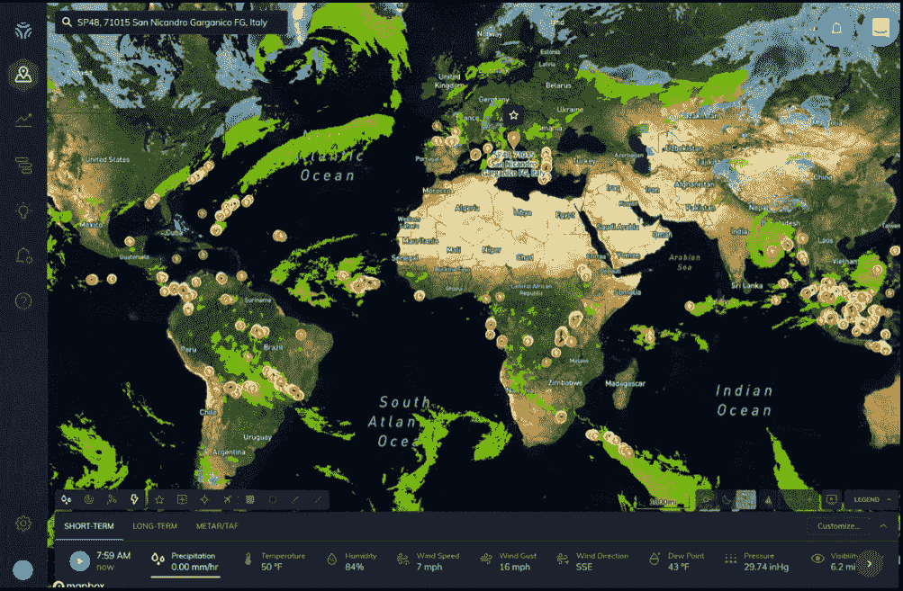
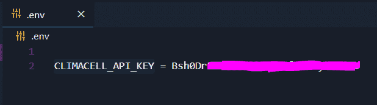
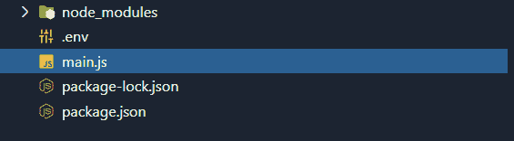
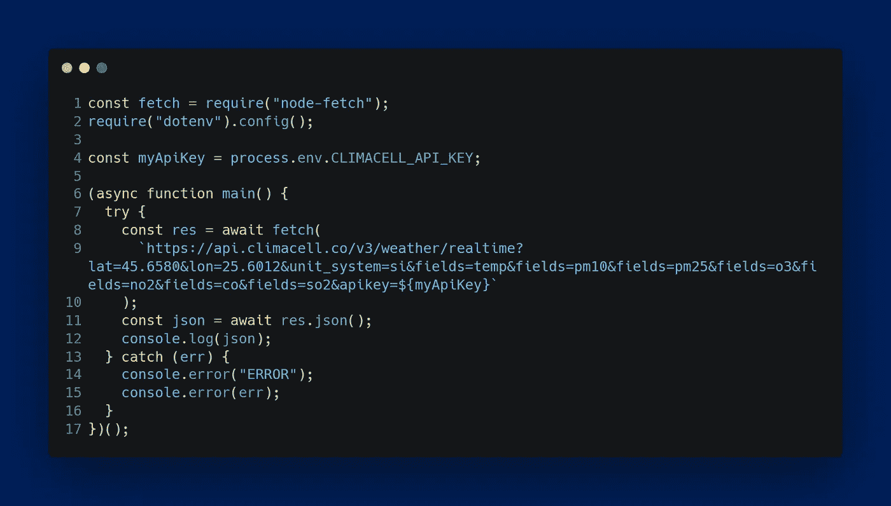
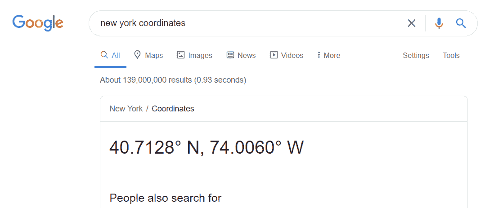
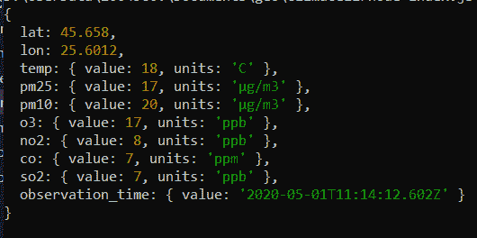
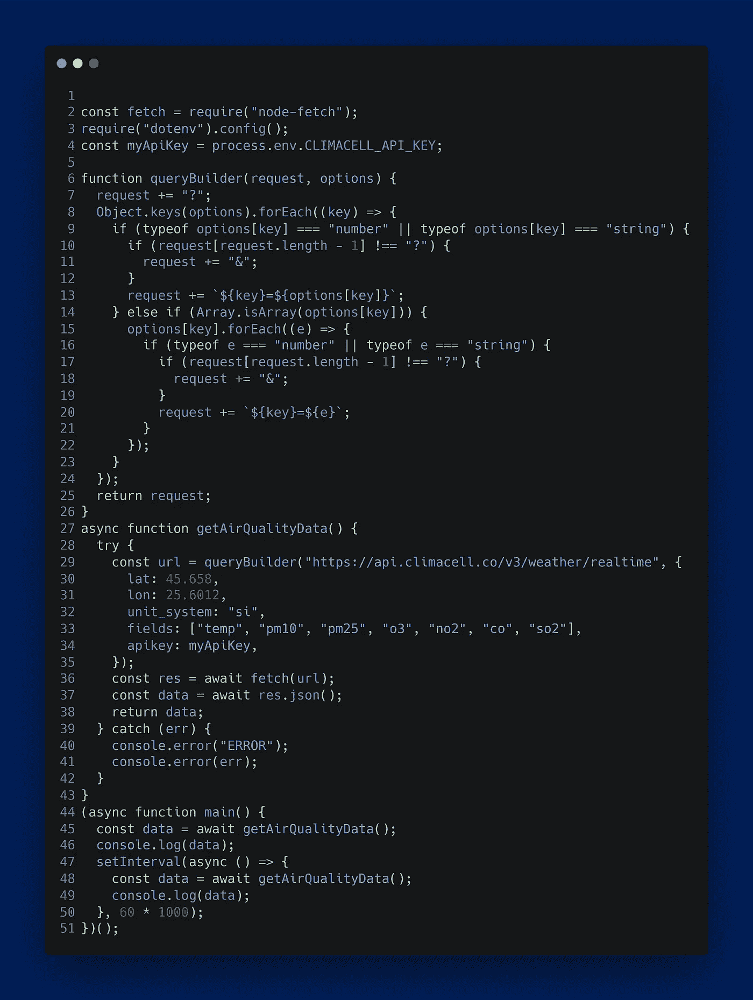

# 使用 NodeJS 监测您所在城市的空气污染

> 原文：<https://itnext.io/monitoring-air-pollution-in-your-city-using-nodejs-d0f21895e0e4?source=collection_archive---------3----------------------->

Unsplash 上的 Ishan @ seefromthesky

作为开发商，我们无法阻止空气质量的下降或改善目前的空气质量。但是，我们可以通过创建软件解决方案来通知我们空气质量水平的当前状态，从而帮助监控这个问题。

下面是如何使用 NodeJS 和一个天气 API 来实现的。

# 为什么你应该监测空气质量

空气污染是颗粒和气体的混合物，在室内和室外都能达到有害浓度。它的影响可以从更高的疾病风险到气温上升。

[*根据世界卫生组织(世卫组织)*](https://www.who.int/airpollution/ambient/pollutants/en/) *，*这些是常见的会危害我们健康和环境的空气污染物:

*   二氧化硫(SO₂)
*   二氧化氮(NO₂)
*   一氧化碳(CO)
*   臭氧(O₃)
*   颗粒物(PM)

根据世卫组织的数据，这种污染的一些负面影响与 2016 年估计的 420 万过早死亡有关。

通过使用 NodeJS 和天气 API，您可以轻松地跟踪它们如何影响您所在城市及周边地区的空气质量。

# 如何使用代码👨‍💻监测空气污染💨

我们将在 [NodeJS](https://nodejs.org/en/) 中编写代码，并将使用 [ClimaCell API](https://developer.climacell.co/) 来收集上述所有常见空气污染物的数据。

以下是您需要遵循的步骤:

1.  在 ClimaCell 上创建一个新帐户并获取您的私钥
2.  设置节点 JS 项目
3.  请求空气质量检查数据
4.  改进代码并使其重复

**步骤 1 —在 ClimaCell 上创建一个新帐户，并获得您的私钥**

一旦您创建了您的帐户，您应该能够在您的仪表板中看到计划状态。

因为我们有每小时 100 个 API 调用的限制，所以我们将每分钟运行一个请求。

**步骤 2 —设置 NodeJS 项目**

我们将使用一个单独的文件来保存我们的环境变量，在我们的例子中是 API 键。

使用下面的命令，我们初始化我们的项目并安装 **dotenv** 依赖项。

这用于加载我们的环境变量，以及用于发送请求的**节点获取**。

`npm init -y && npm i dotenv node-fetch`

接下来创建一个名为**的新文件。env** 并在其中编写 API 键，如下所示:

**步骤 3 —请求空气质量检查数据**

现在打开 **main.js** 并编写以下代码:

[代码在这里](https://carbon.now.sh/?bg=rgba(0%2C32%2C91%2C1)&t=seti&wt=none&l=auto&ds=true&dsyoff=20px&dsblur=68px&wc=true&wa=true&pv=56px&ph=56px&ln=true&fl=1&fm=Hack&fs=16px&lh=133%25&si=false&es=4x&wm=false&code=const%2520fetch%2520%253D%2520require(%2522node-fetch%2522)%253B%250Arequire(%2522dotenv%2522).config()%253B%250A%250Aconst%2520myApiKey%2520%253D%2520process.env.CLIMACELL_API_KEY%253B%250A%250A(async%2520function%2520main()%2520%257B%250A%2520%2520try%2520%257B%250A%2520%2520%2520%2520const%2520res%2520%253D%2520await%2520fetch(%250A%2520%2520%2520%2520%2520%2520%2560https%253A%252F%252Fapi.climacell.co%252Fv3%252Fweather%252Frealtime%253Flat%253D45.6580%2526lon%253D25.6012%2526unit_system%253Dsi%2526fields%253Dtemp%2526fields%253Dpm10%2526fields%253Dpm25%2526fields%253Do3%2526fields%253Dno2%2526fields%253Dco%2526fields%253Dso2%2526apikey%253D%2524%257BmyApiKey%257D%2560%250A%2520%2520%2520%2520)%253B%250A%2520%2520%2520%2520const%2520json%2520%253D%2520await%2520res.json()%253B%250A%2520%2520%2520%2520console.log(json)%253B%250A%2520%2520%257D%2520catch%2520(err)%2520%257B%250A%2520%2520%2520%2520console.error(%2522ERROR%2522)%253B%250A%2520%2520%2520%2520console.error(err)%253B%250A%2520%2520%257D%250A%257D)()%253B)

我们请求数据的 URL 看起来有点复杂，但是让我们解释一下:

*   基地是 https://api.climacell.co/v3/weather/
*   我们添加了 **realtime** 关键字、，因为我们想要实时查看数据
*   作为查询参数，我们编写以下内容:
*   **lat** —这是我们想要查看数据的位置的纬度
*   **经度** —表示位置的经度
*   这些是我的城市的坐标，如果你想找到你的城市的坐标，那么你所要做的就是谷歌“[*城市名称]坐标”。*

*   从这个例子中，我们可以看到纽约的坐标是纬度=40.71.28，经度=74.0060
*   **unit_system** —对于此查询参数，有两个可能的值: **si** (国际单位制)和 **us** ，表示美国习惯单位
*   **fields** —最后一个查询是 fields，是一个字符串数组；在官方文档中，你可以找到这个查询所有可能值的列表

如果运行该代码，输出应该如下所示:

我们成功获取了我市的空气质量数据，包括颗粒物< 2.5 微米的 **pm25** 、 **pm10** —颗粒物< 10 微米和温度。

**第四步——改进代码并使其重复**

既然我们可以发出请求并从给定的位置接收数据，我们可以进一步改进我们的代码，我们可以让它重复，这样我们就可以每分钟都得到数据。

首先，让我们编写一个简单的函数，它的底层实现可以将查询附加到请求中。函数名会是 **queryBuilder(request，options)；**

其次，为了获取每分钟的 API 数据，我们可以将我们的代码包装在一个时间间隔中，这个时间间隔是 60 * 1000 毫秒，60000 毫秒= 60 秒= 1 分钟。

[此处代码](https://carbon.now.sh/?bg=rgba(0%2C32%2C91%2C1)&t=seti&wt=none&l=auto&ds=true&dsyoff=20px&dsblur=68px&wc=true&wa=true&pv=56px&ph=56px&ln=true&fl=1&fm=Hack&fs=16px&lh=133%25&si=false&es=4x&wm=false&code=%250Aconst%2520fetch%2520%253D%2520require(%2522node-fetch%2522)%253B%250Arequire(%2522dotenv%2522).config()%253B%250Aconst%2520myApiKey%2520%253D%2520process.env.CLIMACELL_API_KEY%253B%250A%250Afunction%2520queryBuilder(request%252C%2520options)%2520%257B%250A%2520%2520request%2520%252B%253D%2520%2522%253F%2522%253B%250A%2520%2520Object.keys(options).forEach((key)%2520%253D%253E%2520%257B%250A%2520%2520%2520%2520if%2520(typeof%2520options%255Bkey%255D%2520%253D%253D%253D%2520%2522number%2522%2520%257C%257C%2520typeof%2520options%255Bkey%255D%2520%253D%253D%253D%2520%2522string%2522)%2520%257B%250A%2520%2520%2520%2520%2520%2520if%2520(request%255Brequest.length%2520-%25201%255D%2520!%253D%253D%2520%2522%253F%2522)%2520%257B%250A%2520%2520%2520%2520%2520%2520%2520%2520request%2520%252B%253D%2520%2522%2526%2522%253B%250A%2520%2520%2520%2520%2520%2520%257D%250A%2520%2520%2520%2520%2520%2520request%2520%252B%253D%2520%2560%2524%257Bkey%257D%253D%2524%257Boptions%255Bkey%255D%257D%2560%253B%250A%2520%2520%2520%2520%257D%2520else%2520if%2520(Array.isArray(options%255Bkey%255D))%2520%257B%250A%2520%2520%2520%2520%2520%2520options%255Bkey%255D.forEach((e)%2520%253D%253E%2520%257B%250A%2520%2520%2520%2520%2520%2520%2520%2520if%2520(typeof%2520e%2520%253D%253D%253D%2520%2522number%2522%2520%257C%257C%2520typeof%2520e%2520%253D%253D%253D%2520%2522string%2522)%2520%257B%250A%2520%2520%2520%2520%2520%2520%2520%2520%2520%2520if%2520(request%255Brequest.length%2520-%25201%255D%2520!%253D%253D%2520%2522%253F%2522)%2520%257B%250A%2520%2520%2520%2520%2520%2520%2520%2520%2520%2520%2520%2520request%2520%252B%253D%2520%2522%2526%2522%253B%250A%2520%2520%2520%2520%2520%2520%2520%2520%2520%2520%257D%250A%2520%2520%2520%2520%2520%2520%2520%2520%2520%2520request%2520%252B%253D%2520%2560%2524%257Bkey%257D%253D%2524%257Be%257D%2560%253B%250A%2520%2520%2520%2520%2520%2520%2520%2520%257D%250A%2520%2520%2520%2520%2520%2520%257D)%253B%250A%2520%2520%2520%2520%257D%250A%2520%2520%257D)%253B%250A%2520%2520return%2520request%253B%250A%257D%250Aasync%2520function%2520getAirQualityData()%2520%257B%250A%2520%2520try%2520%257B%250A%2520%2520%2520%2520const%2520url%2520%253D%2520queryBuilder(%2522https%253A%252F%252Fapi.climacell.co%252Fv3%252Fweather%252Frealtime%2522%252C%2520%257B%250A%2520%2520%2520%2520%2520%2520lat%253A%252045.658%252C%250A%2520%2520%2520%2520%2520%2520lon%253A%252025.6012%252C%250A%2520%2520%2520%2520%2520%2520unit_system%253A%2520%2522si%2522%252C%250A%2520%2520%2520%2520%2520%2520fields%253A%2520%255B%2522temp%2522%252C%2520%2522pm10%2522%252C%2520%2522pm25%2522%252C%2520%2522o3%2522%252C%2520%2522no2%2522%252C%2520%2522co%2522%252C%2520%2522so2%2522%255D%252C%250A%2520%2520%2520%2520%2520%2520apikey%253A%2520myApiKey%252C%250A%2520%2520%2520%2520%257D)%253B%250A%2520%2520%2520%2520const%2520res%2520%253D%2520await%2520fetch(url)%253B%250A%2520%2520%2520%2520const%2520data%2520%253D%2520await%2520res.json()%253B%250A%2520%2520%2520%2520return%2520data%253B%250A%2520%2520%257D%2520catch%2520(err)%2520%257B%250A%2520%2520%2520%2520console.error(%2522ERROR%2522)%253B%250A%2520%2520%2520%2520console.error(err)%253B%250A%2520%2520%257D%250A%257D%250A(async%2520function%2520main()%2520%257B%250A%2520%2520const%2520data%2520%253D%2520await%2520getAirQualityData()%253B%250A%2520%2520console.log(data)%253B%250A%2520%2520setInterval(async%2520()%2520%253D%253E%2520%257B%250A%2520%2520%2520%2520const%2520data%2520%253D%2520await%2520getAirQualityData()%253B%250A%2520%2520%2520%2520console.log(data)%253B%250A%2520%2520%257D%252C%252060%2520*%25201000)%253B%250A%257D)()%253B)

因为这里我们有一个[life](https://developer.mozilla.org/en-US/docs/Glossary/IIFE)(立即调用的函数表达式) **main()** 函数在创建后立即执行。运行脚本后，我们将获取一个数据样本，然后每 60 秒获取另一个数据样本。

我们每 60 秒运行一次，因为我们有每小时 100 次 API 调用的限制。

# 结论

空气质量的下降是一个首要问题，从我们编写的这个小代码示例开始，我们可以构建 web 应用程序来监控全球的空气质量。

因为我们使用了一个 [REST](https://en.wikipedia.org/wiki/Representational_state_transfer) API，所以我们可以在后端编写代码，也可以通过从浏览器发出简单的请求在前端编写代码。我建议在后端编写实现，然后将数据公开给前端应用程序。通过这种方式，您的 API 密钥是安全的。

如果代码是在前端编写的，有人可以通过在浏览器中打开 developer's tools 并检查源代码来窃取您的私钥。