# 使用 X.509 Exporter 监控 Kubernetes 中的证书过期

> 原文：<https://itnext.io/monitoring-certificates-expiration-in-kubernetes-with-x-509-exporter-8030b69f611d?source=collection_archive---------3----------------------->


KubeSphere 提供了一个开发人员友好的向导，简化了 Kubernetes 的操作和维护，但它本质上是建立在 Kubernetes 之上的。Kubernetes 的 TLS 证书只有一年的有效期，所以我们需要每年更新证书，这是不可避免的，即使集群是通过强大的轻量级安装工具 [KubeKey](https://github.com/kubesphere/kubekey) 安装的。为了防止证书过期可能带来的风险，我们需要找到一种方法来监控 Kubernetes 组件的证书有效性。

有些人可能听说过 [ssl-exporter](https://github.com/ribbybibby/ssl_exporter) ，它导出从各种来源收集的 ssl 证书的指标，比如 HTTPS 证书、文件证书、Kubernetes Secret 和 kubeconfig 文件。基本上，ssl-exporter 可以满足我们的需求，但是它没有丰富的指标。在这里，我给大家分享一个更强大的普罗米修斯导出器:[**x509-certificate-Exporter**](https://github.com/enix/x509-certificate-exporter)。

与 ssl-exporter 不同，x509-certificate-exporter 只关注 Kubernetes 集群的证书的过期监控，比如每个组件的文件证书、Kubernetes TLS Secret 和 kubeconfig 文件。此外，它提供了更多的度量标准。接下来，我将展示如何在 KubeSphere 上部署 x509-certificate-exporter 来监控集群的所有证书。

# 准备 KubeSphere 应用程序模板

借助 [OpenPitrix](https://github.com/openpitrix/openpitrix) 这一多云应用管理平台， [KubeSphere](https://kubesphere.io/) 能够管理应用的整个生命周期，并允许您使用 App Store 和应用模板直观地部署和管理应用。对于没有在 app Store 发布的 app，可以将其 Helm chart 导入到 KubeSphere 的公共库，或者导入到私有的 App 库，提供 App 模板。

这里，我们使用一个 KubeSphere 应用程序模板来部署 x509-certificate-exporter。

使用 app 模板部署一个 app，需要创建一个工作区，一个项目，两个用户(`ws-admin`和`project-regular`)，将工作区中的平台角色`workspace-admin`分配给`ws-admin`，将项目中的角色`operator`分配给`project-regular`。首先，让我们回顾一下 KubeSphere 的多租户架构。

# 多租户 Kubernetes 架构

KubeSphere 的多租户系统分为三个层次:集群、工作区、项目(相当于 Kubernetes 的[命名空间](https://kubernetes.io/docs/concepts/overview/working-with-objects/namespaces/))。

由于系统工作区运行系统资源，其中大部分只能查看，建议您创建一个新的[工作区](https://kubesphere.com.cn/en/docs/workspace-administration/what-is-workspace/)。出于安全原因，我们强烈建议您在不同的租户在一个工作空间中协作时向他们授予不同的权限。

您可以在 KubeSphere 集群中创建多个工作区。在每个工作区中，您可以创建多个项目。默认情况下，KubeSphere 为每个级别提供了几个内置角色。此外，KubeSphere 允许您创建具有定制权限的角色。总体来说，KubeSphere 的多租户架构非常适合向往基于角色管理的企业和组织。

# 创建用户

安装 KubeSphere 后，您需要创建具有不同角色的用户，以便他们可以在授权范围内工作。最初，系统有一个默认用户`admin`，它被分配了角色`platform-admin`。在下面，我们将创建一个名为`user-manager`的用户，它将用于创建新用户。

1.以用户`admin`的身份登录 KubeSphere web 控制台，默认密码为`P@88w0rd`。

> *为了帐户安全，强烈建议您在首次登录控制台时更改密码。要更改密码，点击右上角下拉列表中的* ***用户设置*** *。在* ***密码设置*** *中，设置新密码。您也可以在* ***用户设置*** *中更改控制台的语言。*

2.点击左上角的**平台**，然后点击**门禁**。

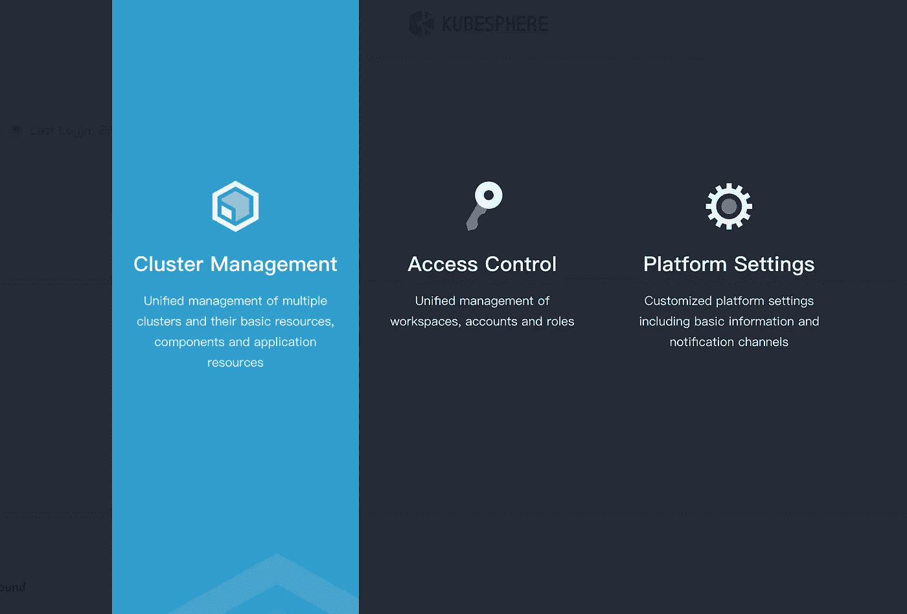

在左侧导航窗格中，点击**平台角色**，您会发现四个可用的内置角色。将角色`users-manager`分配给您创建的第一个用户。

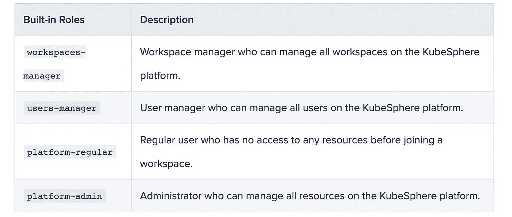

3.在**用户**中，点击**创建**。在显示的对话框中，提供所有必要的信息(标有*)并为**平台角色**选择`users-manager`。

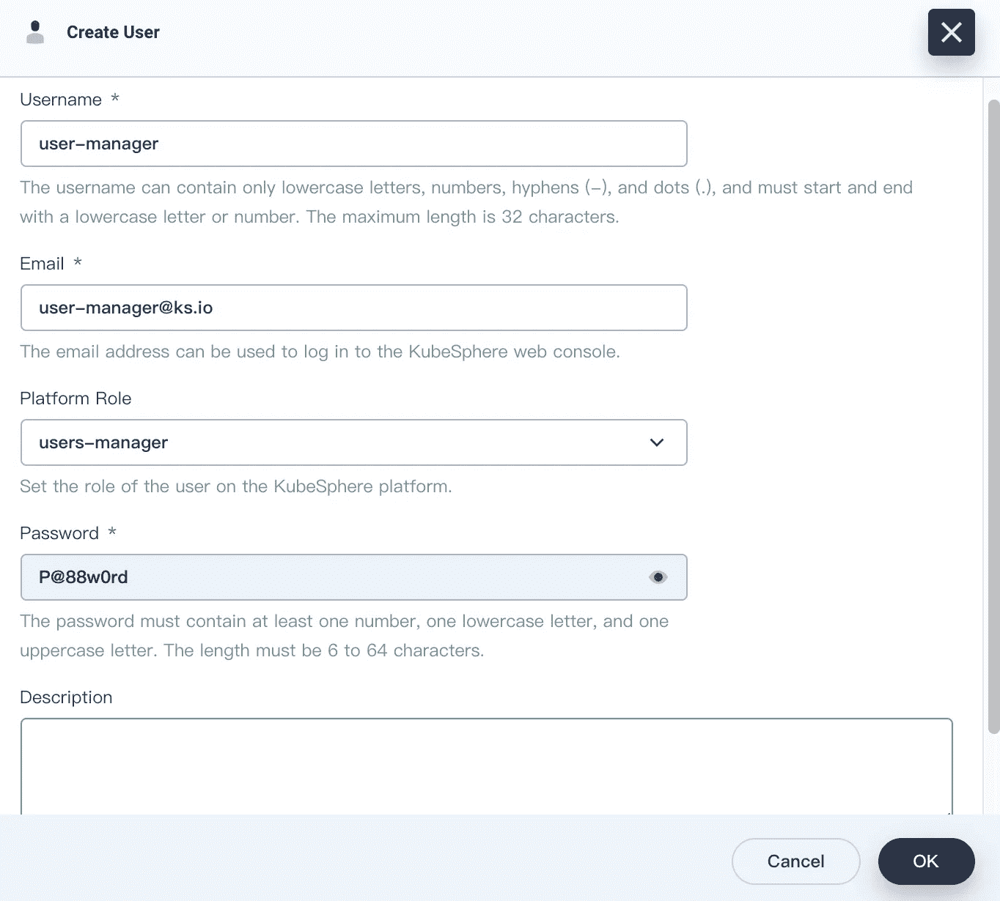

点击**确定**。在**用户**中，您可以在用户列表中找到新创建的用户。

4.从控制台注销，以用户`user-manager`的身份重新登录，创建下表中列出的另外三个用户。

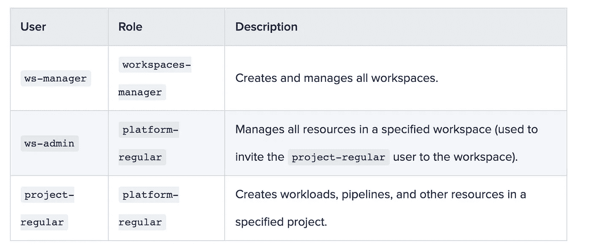

5.在**用户**中，您可以查看刚刚创建的三个用户。

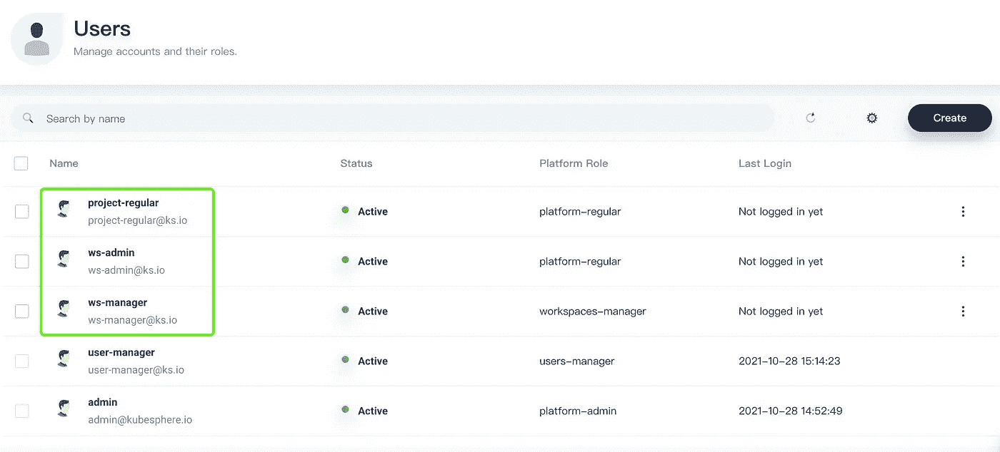

# 创建工作区

在这个部分中，您需要使用在上一步中创建的用户`ws-manager`来创建一个工作区。作为管理项目、工作负载创建和组织成员的基本逻辑单元，工作区支撑着 KubeSphere 的多租户系统。

1.以`ws-manager`的身份登录 KubeSphere，他拥有管理平台上所有工作区的权限。点击左上角的**平台**，选择**门禁**。在**工作区**中，您可以看到只有一个默认工作区`system-workspace`，系统相关的组件和服务在这里运行。不允许您删除此工作区。

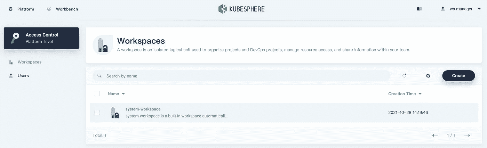

2.点击右侧的**创建**，为新的工作空间设置一个名称(例如`demo-workspace`，并将用户`ws-admin`设置为工作空间管理员。

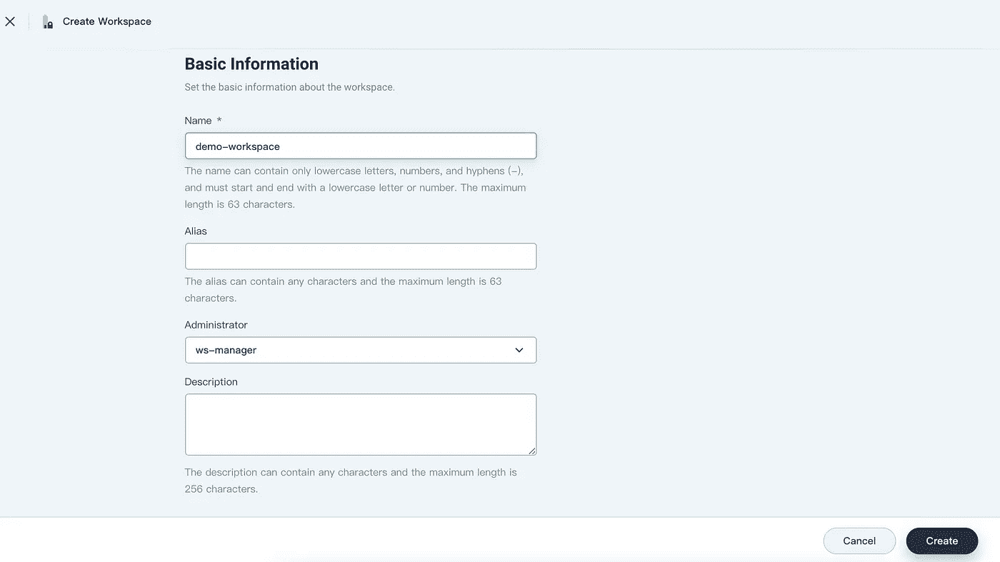

完成后点击**创建**。

3.注销控制台，然后以`ws-admin`的身份重新登录。在**工作区设置**中，选择**工作区成员**，然后点击**邀请**。

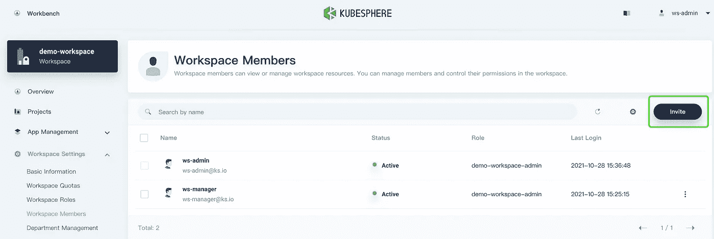

4.邀请`project-regular`进入工作区，为其分配角色`workspace-viewer`，然后点击**确定**。

> 实际的角色名称遵循一个命名约定: <workspace name="">- <role name="">。例如，在工作空间`demo-workspace`中，角色`viewer`的实际角色名称是`demo-workspace-viewer`。</role></workspace>


5.将`project-regular`添加到工作空间后，点击**确定**。在**工作区成员**中，你可以看到列出了两个成员。

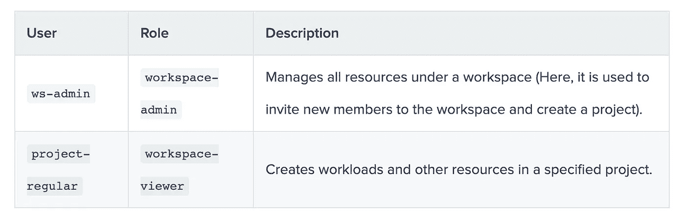

# 创建项目

在本节中，您需要使用之前创建的用户`ws-admin`来创建一个项目。KubeSphere 中的项目与 Kubernetes 中的名称空间相同，为资源提供虚拟隔离。更多信息，请参见[名称空间](https://kubernetes.io/docs/concepts/overview/working-with-objects/namespaces/)。

1.以`ws-admin`的身份登录 KubeSphere web 控制台。在**项目**中，点击**创建**。

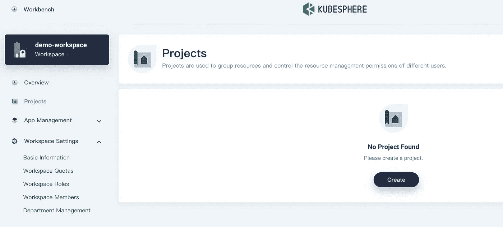

2.输入项目名称(如`exporter`)并点击**确定**。您还可以为项目添加别名和描述。

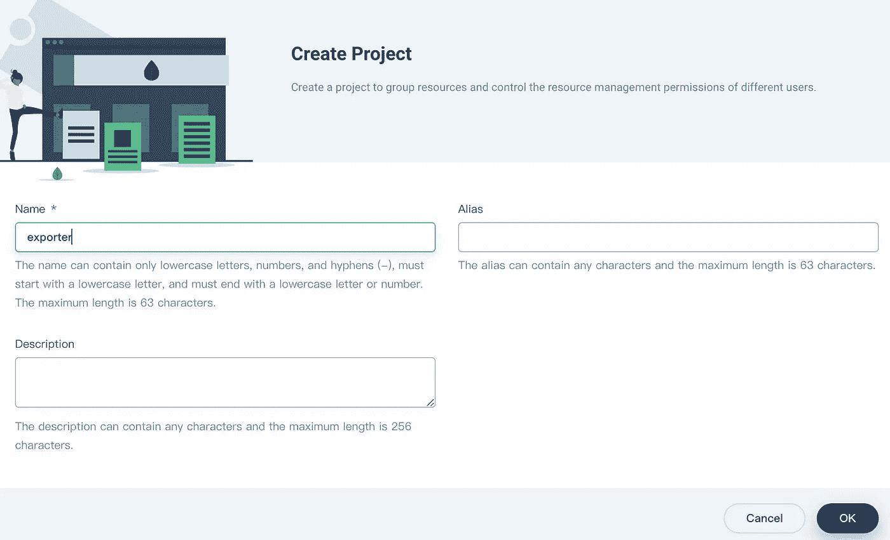

3.在**项目**中，点击项目名称查看其详细信息。

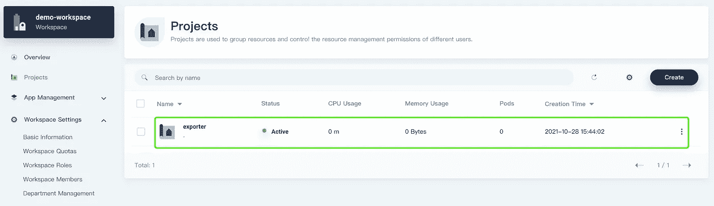

4.在**项目设置**中，选择**项目成员**，点击**邀请**邀请`project-regular`加入项目，将角色`operator`分配给`project regular`。

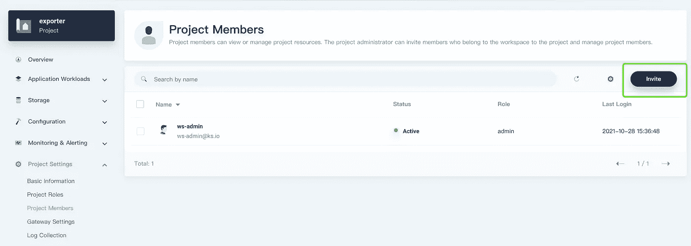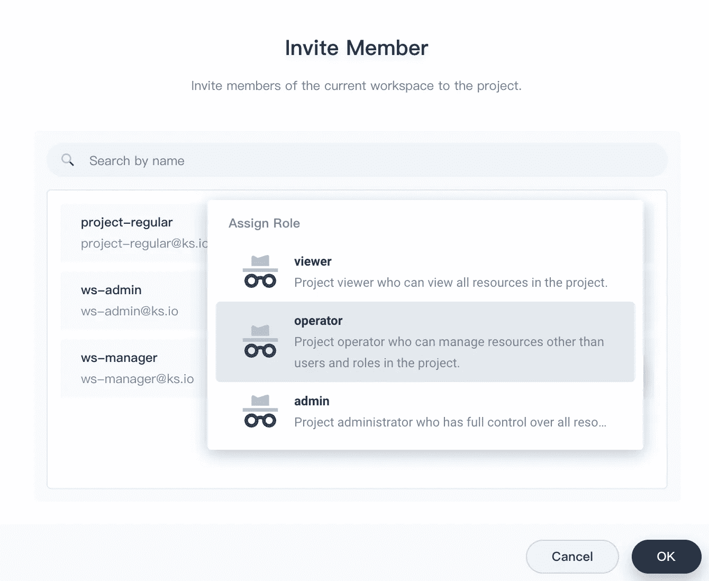

> 角色为`operator`的用户是项目维护人员，他们可以管理项目中除用户和角色之外的资源。

# 添加应用程序存储库

1.以用户`ws-admin`身份登录 KubeSphere 的 web 控制台。在你的工作区，进入**应用管理**下的**应用库**，然后点击**添加**。

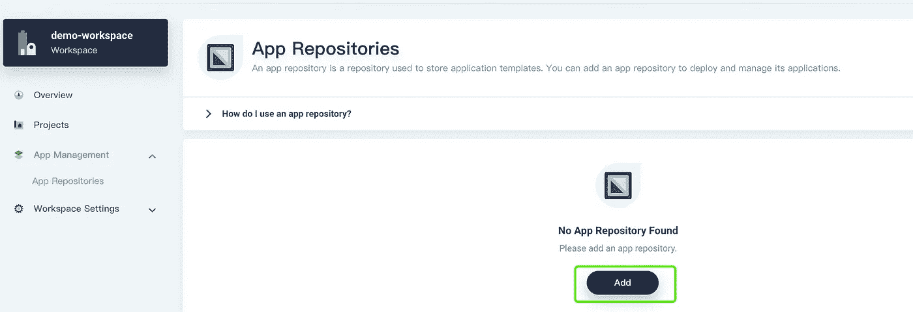

2.在显示的对话框中，指定应用程序存储库名称(例如，`enix`)并添加您的存储库 URL(例如，`https://charts.enix.io`)。点击**验证**验证 URL，然后点击**确定**。

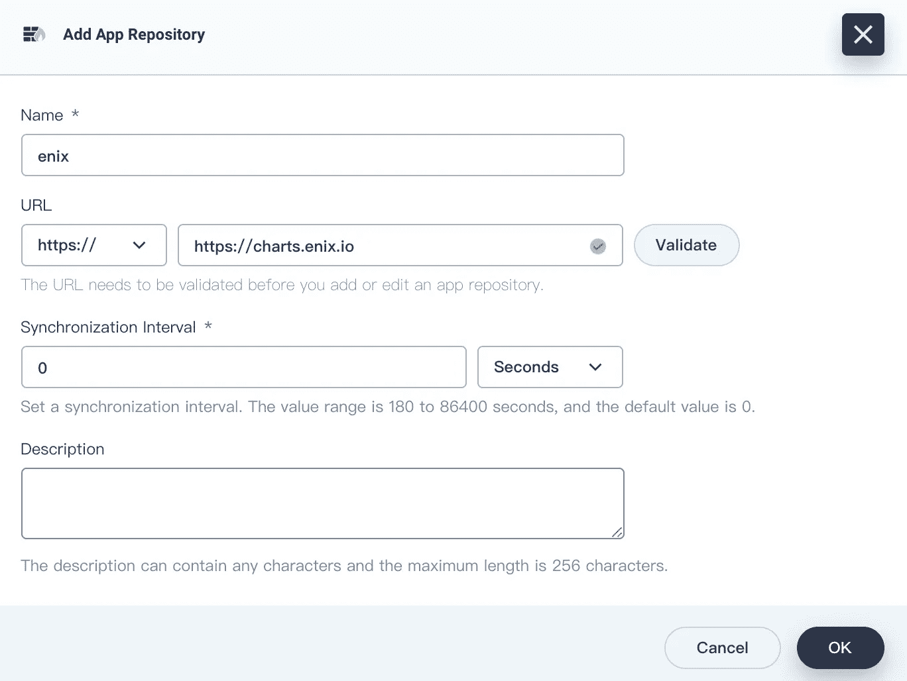

3.在**应用程序库**中，您可以查看创建的应用程序库。


# 部署 x509-证书导出程序

导入 x509-certificate-exporter 的应用程序存储库后，可以使用应用程序模板部署 x509-certificate-exporter。

1.注销 KubeSpere web 控制台，并以用户`project-regular`的身份登录控制台。单击您创建的项目以转到项目页面。进入**应用工作负载**下的**应用**，点击**创建**。


2.在显示的对话框中，从 App 模板中选择**。**

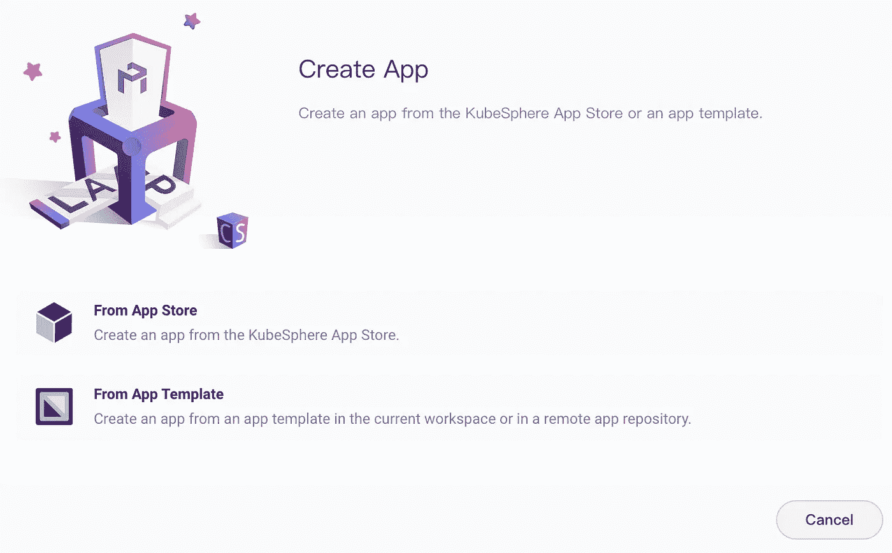

**来自 App Store** :选择内置应用或上传为舵图的应用。

**来自应用模板**:从私有应用库或当前工作区选择一个应用。

3.在下拉列表中，选择您刚刚上传的私有应用库`enix`。

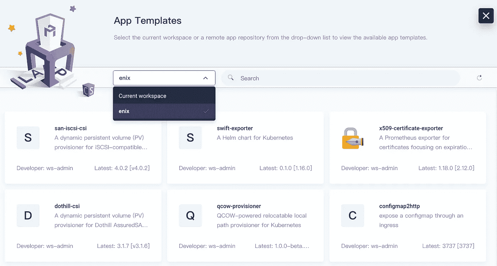

4.选择 x509-证书-导出器进行部署。

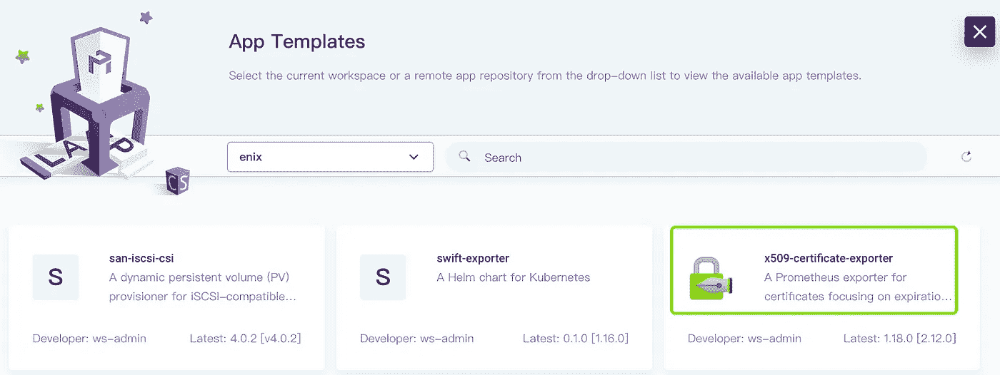

5.在**版本**下拉列表中，选择一个 app 版本，然后点击**部署**。同时，您可以查看应用程序信息和清单。

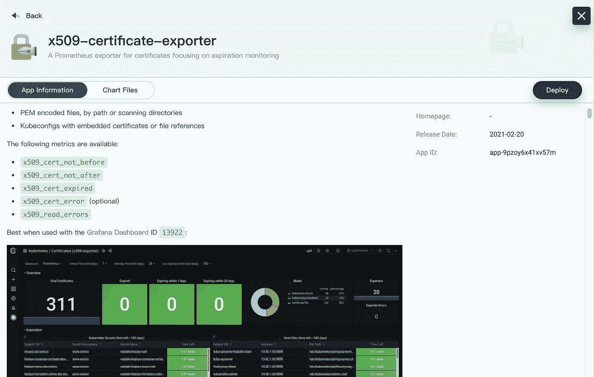

6.设置 app 名称，确认 app 版本和部署位置，点击**下一步**。

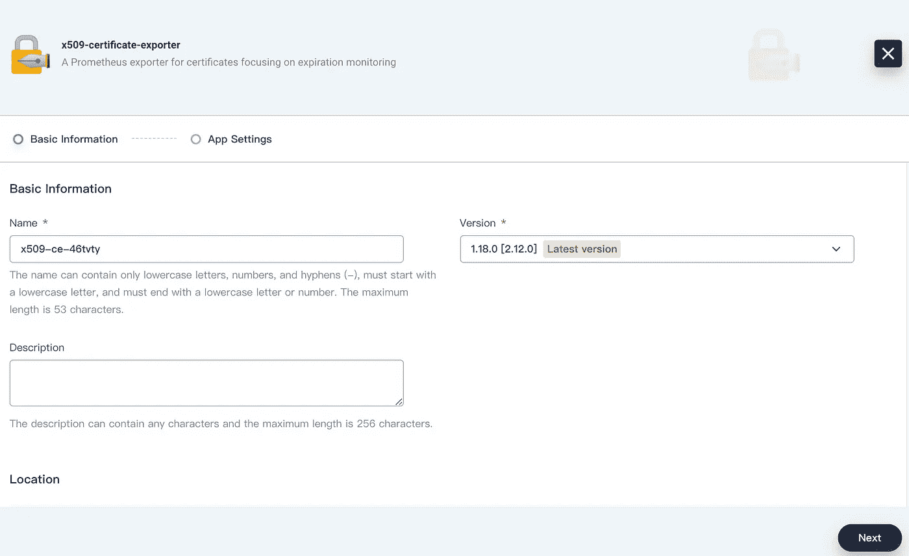

7.在 **App 设置**中，需要手动编辑清单，指定证书文件的路径。

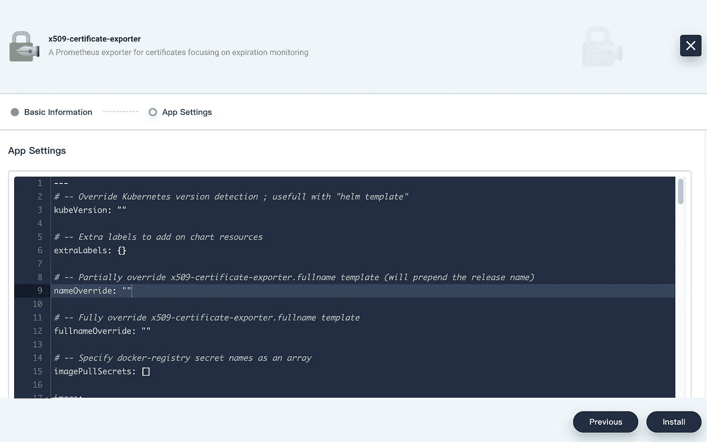

```
daemonSets:
    master:
      nodeSelector:
        node-role.kubernetes.io/master: ''
      tolerations:
        - effect: NoSchedule
          key: node-role.kubernetes.io/master
          operator: Exists
      watchFiles:
        - /var/lib/kubelet/pki/kubelet-client-current.pem
        - /etc/kubernetes/pki/apiserver.crt
        - /etc/kubernetes/pki/apiserver-kubelet-client.crt
        - /etc/kubernetes/pki/ca.crt
        - /etc/kubernetes/pki/front-proxy-ca.crt
        - /etc/kubernetes/pki/front-proxy-client.crt
      watchKubeconfFiles:
        - /etc/kubernetes/admin.conf
        - /etc/kubernetes/controller-manager.conf
        - /etc/kubernetes/scheduler.conf
    nodes:
      tolerations:
        - effect: NoSchedule
          key: node-role.kubernetes.io/ingress
          operator: Exists
      watchFiles:
        - /var/lib/kubelet/pki/kubelet-client-current.pem
        - /etc/kubernetes/pki/ca.crt
```

创建了两个`DaemonSets`，其中主节点在控制器节点上运行，节点在计算节点上运行。

```
$ kubectl -n exporter get ds

NAME                   DESIRED   CURRENT   READY   UP-TO-DATE x509-x509-certificate
-exporter-master        1         1         1        1x509-x509-certificate
-exporter-nodes         3         3         3        3 AVAILABLE      NODE SELECTOR                       AGE

    1          node-role.kubernetes.io/master=     3d14h
    3           <none>                             3d14h
```

以下是参数的定义方式:

*   **watchFiles:** 指定证书文件的路径。
*   **watchKubeconfFiles:** 指定 kubeconfig 文件的路径。

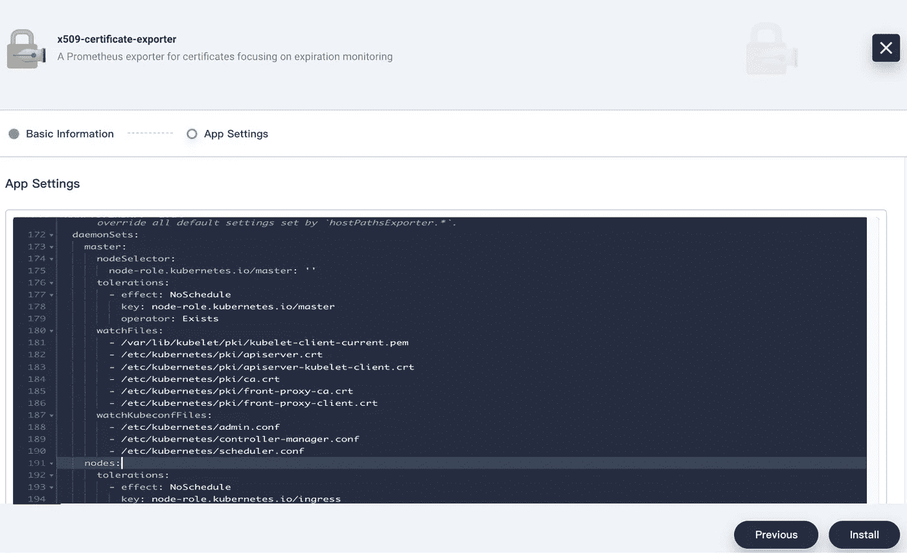

8.点击**安装**，等待应用程序成功创建并运行。


# 集成监控系统

使用应用程序模板部署应用程序后，还将创建一个`ServiceMonitor`和两个 DaemonSets。

```
$ kubectl -n exporter get servicemonitor
NAME                             AGE
x509-x509-certificate-exporter   3d15h
```

打开普罗米修斯的 web UI，可以看到对应的`Targets`已经准备好了。

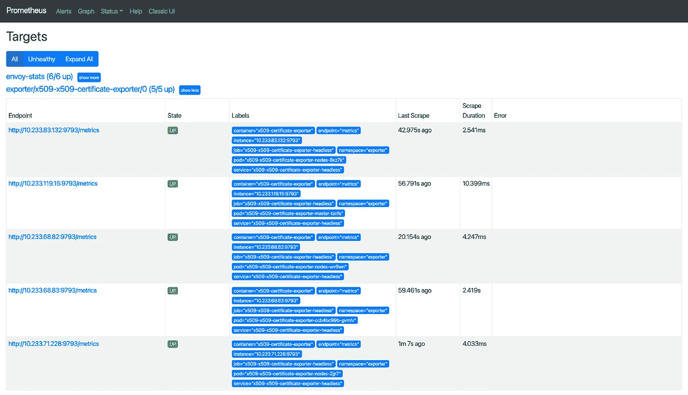

x509-certificate-exporter 官方提供了一个 [Grafana 仪表盘](https://grafana.com/grafana/dashboards/13922)，如下图所示。

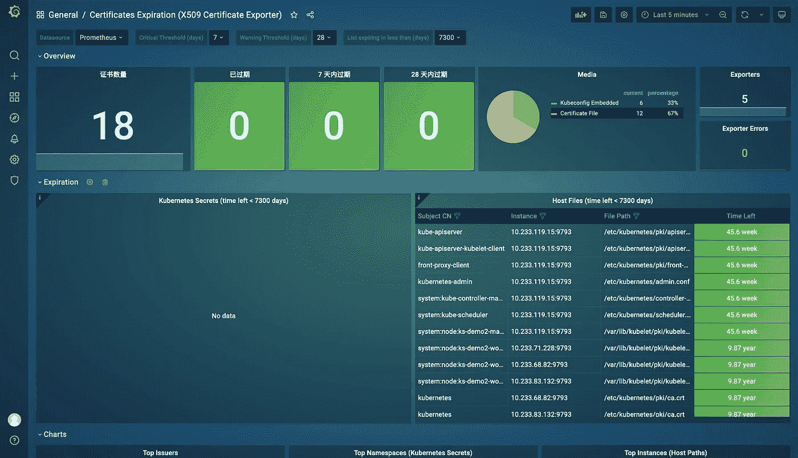

可以看到，所有的指标都非常清晰。一般情况下，我们只需要关注已经过期和即将过期的证书。假设您想知道证书的有效性，使用`(x509_cert_not_after{filepath!=""} - time()) / 3600 / 24`表达式。

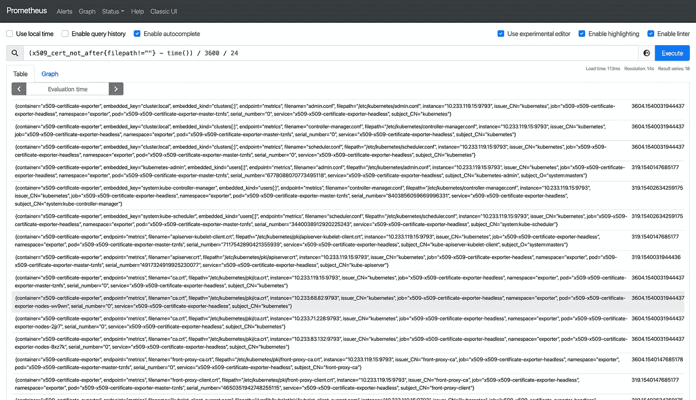

此外，您可以创建警报策略，以便 O&M 人员可以在证书即将过期时收到通知，并及时更新证书。要创建警报策略，请执行以下步骤:

1.  进入**监控&告警**下的**告警策略**，点击**创建**。

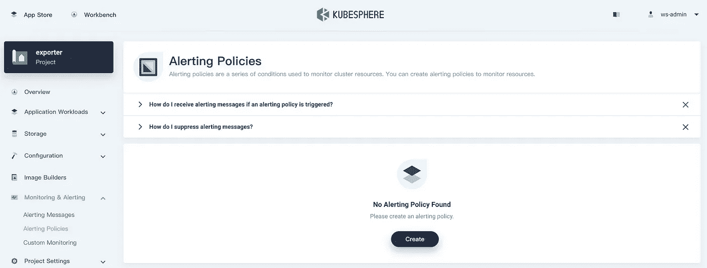

2.输入警报策略的名称，设置严重性，然后单击下一步的**。**

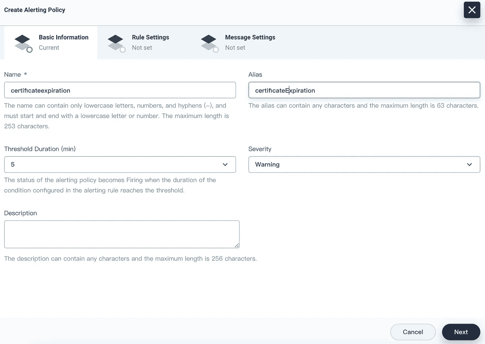

3.点击**自定义规则**页签，输入**规则表达式**的`(x509_cert_not_after{filepath!=""} - time()) / 3600 / 24 < 30`。

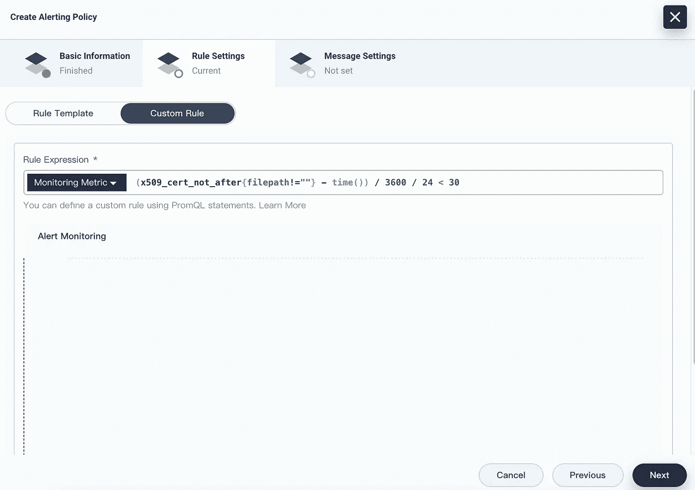

4.点击下一个的**。在**消息设置**页面，填写警报的摘要和详细信息。**

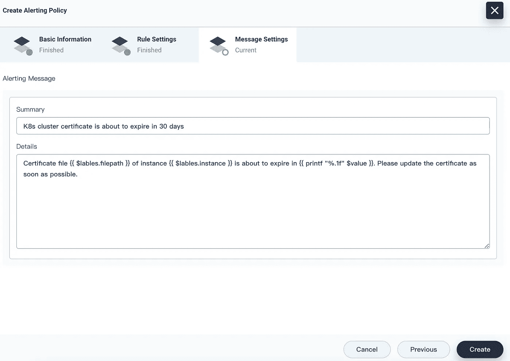

5.点击**创建**，告警策略创建完成。

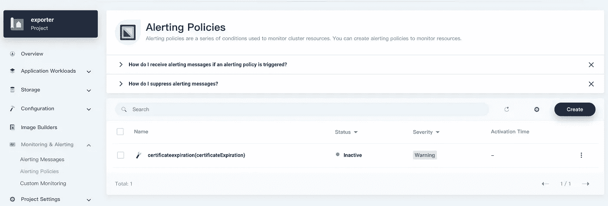

# 摘要

KubeSphere 3.1 支持内置的证书过期警告策略。要查看策略，进入**报警策略**，点击**内置策略**，在搜索框中输入`expir`。

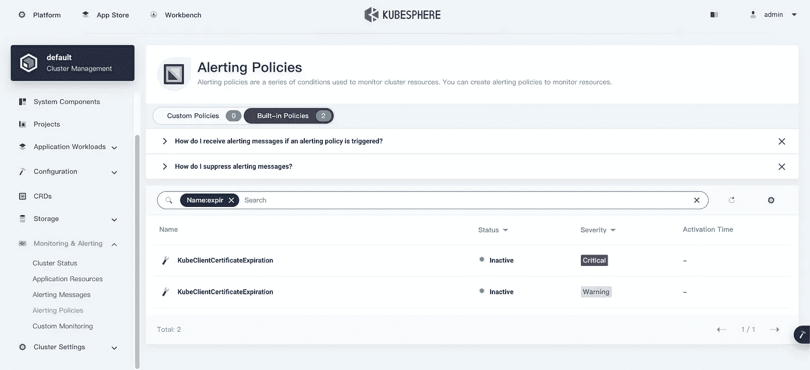

单击警报策略名称以查看其规则表达式。

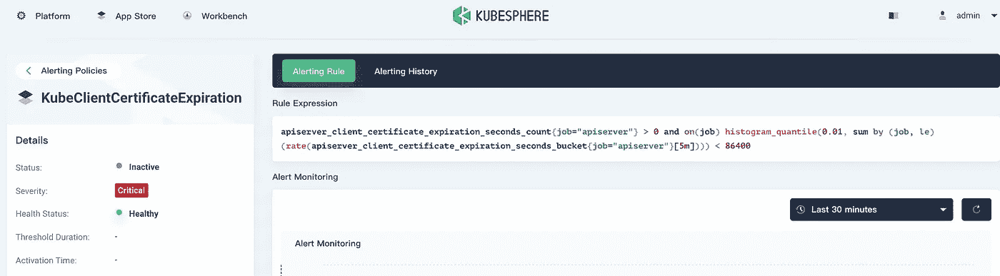

规则表达式中的度量由 API 服务器组件公开，并且不包含集群的所有组件的证书。要监控所有组件的证书，建议您在部署 x509-certificate-exporter 时在 KubeSphere 上创建一个定制的警报策略。相信我，你将从证书过期中解脱出来。

# 关于 KubeSphere

KubeSphere 是一个基于 Kubernetes 的开源容器平台，其核心是应用程序。它提供全栈 It 自动化操作和简化的开发运维工作流。

[KubeSphere](https://kubesphere.io/) 已被全球数千家企业采用，如 **Aqara、新浪、奔来、中国太平、华夏银行、国药控股、微众银行、Geko Cloud、VNG 公司、Radore** 。KubeSphere 为运维提供向导界面和各种企业级功能，包括 Kubernetes 资源管理、[、DevOps (CI/CD)](https://kubesphere.io/devops/) 、应用生命周期管理、服务网格、多租户管理、[监控](https://kubesphere.io/observability/)、日志记录、警报、通知、存储和网络管理以及 GPU 支持。有了 KubeSphere，企业能够快速建立一个强大且功能丰富的容器平台。

欲了解更多信息，请访问 [https://kubesphere.io](https://kubesphere.io/)