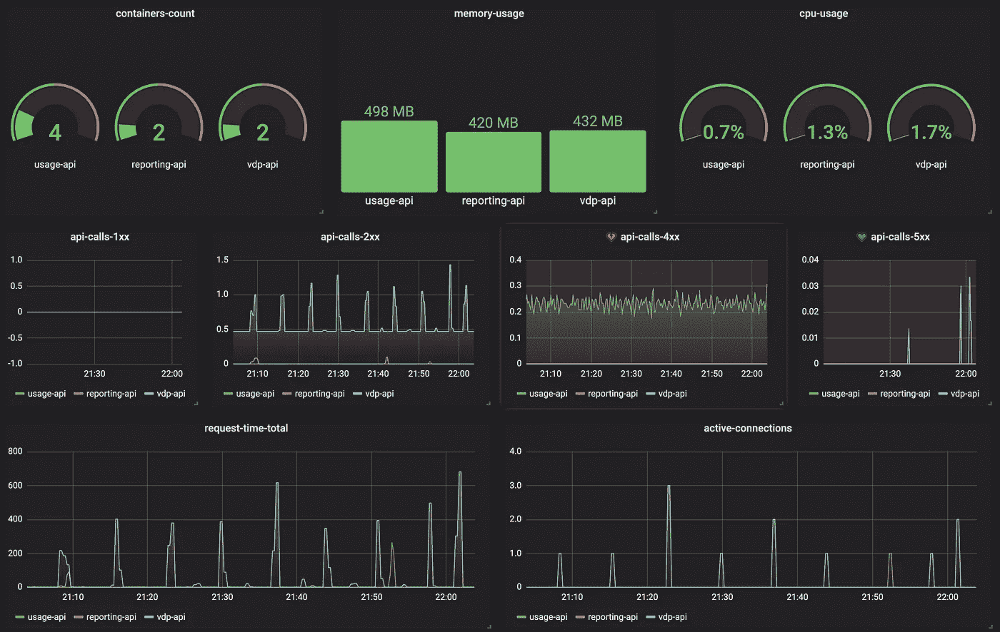
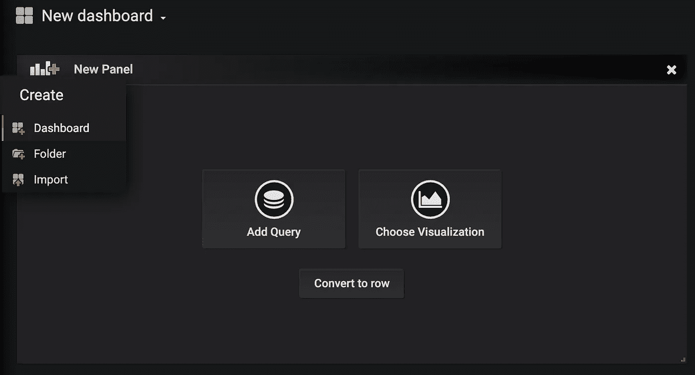
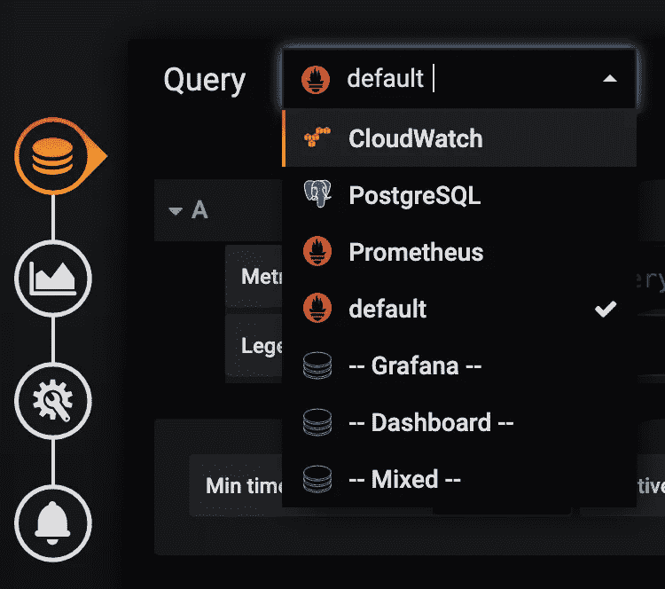
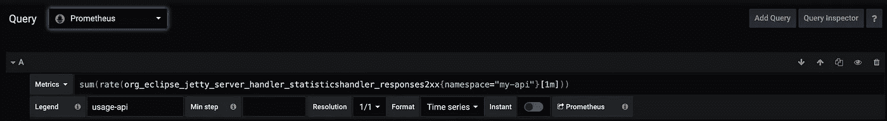
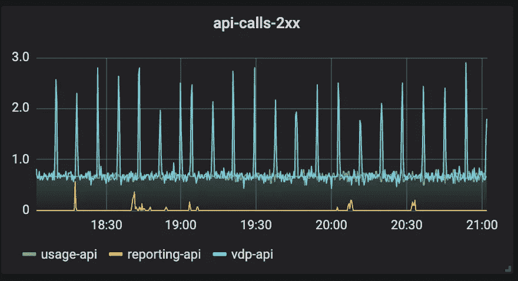

# 使用 Prometheus 和 Grafana 监控 K8s 中的分布式 Jetty 服务器

> 原文：<https://itnext.io/monitoring-distributed-jetty-servers-in-k8s-using-prometheus-and-grafana-7b02fe3506ad?source=collection_archive---------1----------------------->



# 介绍

监控和警报是在生产环境中运行的任何软件系统的强制性部分。为了保持软件系统健康、优化性能和资源利用率，您需要统一的运营视图、实时粒度数据和历史参考。在这里，我将展示如何使用[普罗米修斯](https://prometheus.io/)和[格拉法纳](https://grafana.com/)来构建一个针对运行在 K8s 上的分布式 [Jetty](https://www.eclipse.org/jetty/) 服务器的监控系统。

# 码头

Jetty 是一个免费的开源 Web 服务器和 servlet 容器。尽管 Jetty 的市场份额远不及 Tomcat，但它仍然被业界广泛使用。如果您正在使用 Tomcat，在这里您可以找到监控 Tomcat web 服务器的逐步指南。Jetty 的两个主要卖点是其紧凑性和占地面积小。这两者都使得 Jetty 非常适合受限环境和嵌入到其他产品中。

在 docker 容器中运行 jetty 非常容易。从 [DockerHub](https://hub.docker.com/_/jetty) 中调出最新的官方码头图片。构建并运行以下 Dockerfile 文件。

```
FROM jettyRUN java -jar "$JETTY_HOME/start.jar" --add-to-startd=jmx,stats
```

如果您将 Spring Boot 与嵌入式**Jetty 服务器一起使用，您必须在代码中以编程方式配置 Jetty 的统计数据:**

```
@Bean
public ServletWebServerFactory embeddedServletContainerFactory() {
    final JettyServletWebServerFactory factory = new JettyServletWebServerFactory();
    factory.addServerCustomizers(server -> {
        StatisticsHandler stats = new StatisticsHandler();
        stats.setHandler(server.getHandler());
        server.setHandler(stats);MBeanContainer mbContainer = new MBeanContainer(ManagementFactory.*getPlatformMBeanServer*());
        server.addEventListener(mbContainer);
        server.addBean(mbContainer);
    });
    return factory;
}
```

现在您有了一个 docker 容器，它运行一个 Jetty 服务器，通过使用 JMX 公开它的指标。

# 普罗米修斯特工

JMX 对普罗米修斯[出口者](https://github.com/prometheus/jmx_exporter)是一个可以收集和暴露 JMX 目标 mBeans 的收集器。该导出器旨在作为 Java 代理运行，公开 HTTP 服务器并提供本地 JVM 的指标。将以下代码添加到 docker 文件中:

```
FROM jetty
RUN java -jar "$*JETTY_HOME*/start.jar" --add-to-startd=jmx,statsUSER jetty
COPY jmx-exporter.yaml ${*JETTY_BASE*}/
RUN curl [https://repo1.maven.org/maven2/io/prometheus/jmx/jmx_prometheus_javaagent/0.12.0/jmx_prometheus_javaagent-0.12.0.jar](https://repo1.maven.org/maven2/io/prometheus/jmx/jmx_prometheus_javaagent/0.12.0/jmx_prometheus_javaagent-0.12.0.jar) \
    --output ${*JETTY_BASE*}/jmx_prometheus_javaagent-0.12.0.jarWORKDIR ${*JETTY_BASE*}
CMD java -javaagent:${*JETTY_BASE*}/jmx_prometheus_javaagent-0.12.0.jar=9093:${*JETTY_BASE*}/jmx-exporter.yaml \
         -jar ${*JETTY_HOME*}/start.jar
```

创建 jmx-exporter.yaml 文件:

```
---
startDelaySeconds: 0
ssl: false
lowercaseOutputName: true
lowercaseOutputLabelNames: true
rules:
  - pattern: ".*"
```

建造并运行一个新的码头码头集装箱。现在，您可以运行 curl 命令:

```
curl localhost:8080
```

您将得到来自 Jetty 服务器的响应。之后，您可以运行另一个 curl 命令

```
curl localhost:9093
```

您将看到 20KB 的响应，其中包含一百多个不同的 Jetty 和 JVM 指标。而且是很多。每几秒钟从系统中的每个单元提取数百个不同的指标将占用大量资源，并且难以管理。我坚信监控系统应该简单、可靠、快速。这就是为什么只选择那些有用的指标很重要。挑选最有用指标的最著名方法之一是从[四个黄金信号](http://These have been championed by the Google SRE team and the larger web-scale SRE community as the most fundamental metrics for tracking service health and performance.)开始。谷歌 SRE 团队支持这些作为跟踪服务健康和性能的最基本的指标。

1.  **延迟:**服务一个请求所花费的时间。
2.  **流量:**衡量服务需求的指标。在 Jetty 的例子中，它是每秒的请求数。
3.  **错误:**请求失败的比率。对于 Jetty，我们可以计算 4xx 和 5xx 错误。
4.  **饱和度:**服务有多“满”。这是对内存、I/O 或 CPU 等系统利用率的衡量。服务在接近高饱和度时性能会下降。

让我们回到码头和 JMX 出口商代理，选择正确的指标

1.  **org . eclipse . jetty . server . handler . statistics shandler . request time total**测量请求处理的总时间(以毫秒为单位)。
2.  **org . eclipse . jetty . server . handler . statistics handler . requests—**测量请求的总数
3.  **org . eclipse . jetty . server . handler . statistics shandler . response 4xx**，**org . eclipse . jetty . server . handler . statistics shandler . response 5xx**—测量错误总数
4.  **process _ CPU _ seconds _ total**，**process _ resident _ memory _ bytes**—可以作为系统指标。

编辑 jmx-exporter.yaml 并更新规则，只暴露那些有用的指标。

```
---
startDelaySeconds: 0
ssl: false
lowercaseOutputName: true
lowercaseOutputLabelNames: true
whitelistObjectNames: ["org.eclipse.jetty.server.handler:*"]
rules:
  - pattern: ".*xx"
  - pattern: ".*requests"  
  - pattern: ".*requestTimeTotal"
```

运行并确保您只能看到相关的 Jetty 和所有系统指标。

# K8s 配置

当您在 Kubernetes 中运行 Jetty 容器时，需要公开 JMX 端口来收集度量数据。下面的示例 Jetty 配置文件显示了如何在 K8s 基础设施中部署基本的 Jetty 服务，其中 Prometheus JMX 港被公开和注释。

**deployment.yaml**

```
apiVersion: extensions/v1beta1
kind: Deployment
metadata:
  name: jetty_api
spec:
  replicas: 2
  template:
    metadata:
      labels:
        app: jetty_api_app
        type: java
      annotations:
       prometheus.io/port: '9093'        
       prometheus.io/scrape: 'true'
       prometheus.io/path: '/metrics'
    spec:
      containers:
      - name: <container name>
        image: <docker image>
        ports:
        - containerPort: 8080
        env:
        - name: JAVA_AGENT_PORT
          value: "9093"
        resources:
          requests:
            memory: "4096Mi"
            cpu: "1"
          limits:
            memory: "4096Mi"
            cpu: "1"
```

**service.yaml**

```
apiVersion: v1
kind: Service
metadata:
  name: jetty_api_service
  labels:
    app: jetty_api_service
spec:
  ports:
  - port: 8080
    targetPort: 8080
    name: http
  - port: 9093
    targetPort: 9093
    name: prom
  selector:
    app: jetty_api_service
  type: NodePort
```

pod 上的注释用于控制刮擦过程:

*   `prometheus.io/scrape`:该注释控制报废行为。默认值为 true(刮擦 pod)。
*   `prometheus.io/path`:该注释控制度量路径。默认值为`/metric.`
*   `prometheus.io/port`:从中获取度量的端口。

现在我们已经有了从 Jetty 容器中抓取 JVM 数据所需的所有配置。

# 普罗米修斯

Prometheus 示例配置文件名为 prometheus.yml，如下所示:

```
global:
  scrape_interval:     15s
  evaluation_interval: 15s

rule_files:
  # - "first.rules"
  # - "second.rules"

scrape_configs:
  - job_name: 'prometheus
    scrape_interval: 30s
    kubernetes_sd_configs:
    - role: pod
      namespaces:
        names:
        - staging
    scheme: http
    relabel_configs:
    - source_labels: [__meta_kubernetes_pod_annotation_prometheus_io_scrape]
      action: keep
      regex: true
    - source_labels: [__address__, __meta_kubernetes_pod_annotation_prometheus_io_port]
      action: replace
      regex: ([^:]+)(?::\d+)?;(\d+)
      replacement: $1:$2
      target_label: __address__
    - action: labelmap
      regex: __meta_kubernetes_pod_label_(.+)
    - source_labels: [__meta_kubernetes_namespace]
      action: replace
      target_label: kubernetes_namespace
    - source_labels: [__meta_kubernetes_pod_name]
      action: replace
      target_label: kubernetes_pod_name
```

如您所见，您可以在这里控制 scrape_interval、规则评估间隔，您可以定义将被废弃的名称空间，等等。一旦配置和部署就绪，所有废弃的指标都将被收集并存储在 Prometheus 中。

# 格拉夫纳

[Grafana](http://grafana.org/) 支持查询普罗米修斯。自 Grafana 2.5.0 起，Prometheus 的 Grafana 数据源已包含在内。要在 Grafana 中创建 Prometheus 数据源:

1.  点击侧边栏中的“齿轮”打开配置菜单。
2.  点击“数据源”。
3.  点击“添加数据源”。
4.  选择“普罗米修斯”作为类型。
5.  设置适当的普罗米修斯服务器 URL(例如`[http://localhost:9090/](http://localhost:9090/))` [)](http://localhost:9090/))
6.  根据需要调整其他数据源设置(例如，选择正确的访问方法)。
7.  单击“保存并测试”保存新数据源。

一旦 Prometheus 源就绪，我们就可以为我们的 Jetty 服务创建一个仪表板。

点击“创建按钮”并选择“仪表板”菜单项



现在在数据源组合框中选择“普罗米修斯”



在“查询”字段中输入任何普罗米修斯表达式，同时使用“指标”字段通过自动完成功能查找指标。例如，在这里，我们正在寻找 2xx 码头公制



选择图表类型，你就可以开始了。



同样，我们可以为四个“黄金指标”中的每一个设置面板。

# 摘要

它很小，但却是一个使用 Prometheus 和 Grafana 为 Jetty 服务器构建监控系统的端到端例子。如果您在 K8s 上运行所有应用程序，并且正在寻找可靠的监控基础设施，Prometheus 和 Grafana 是值得考虑的工具。