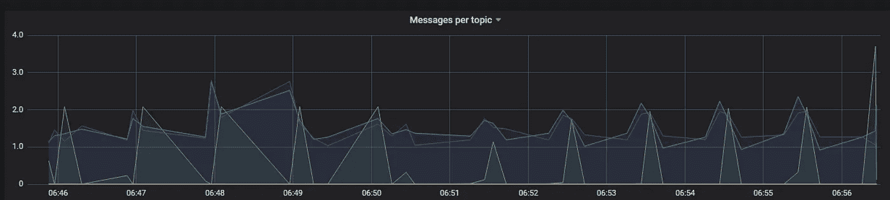
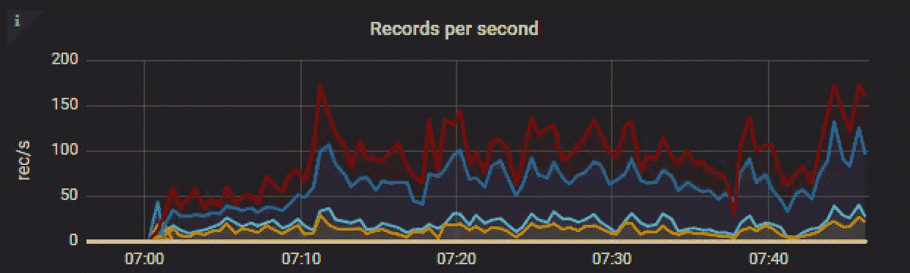
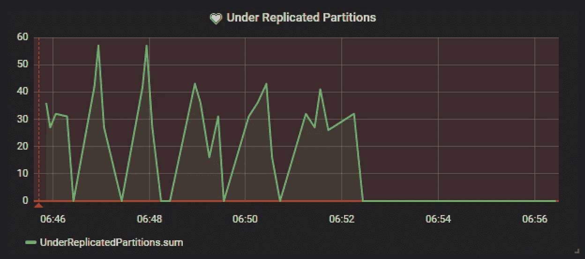
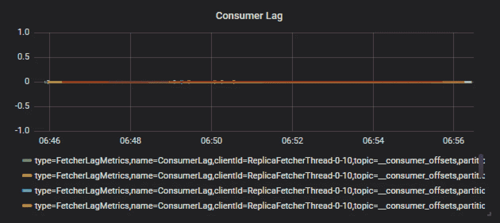
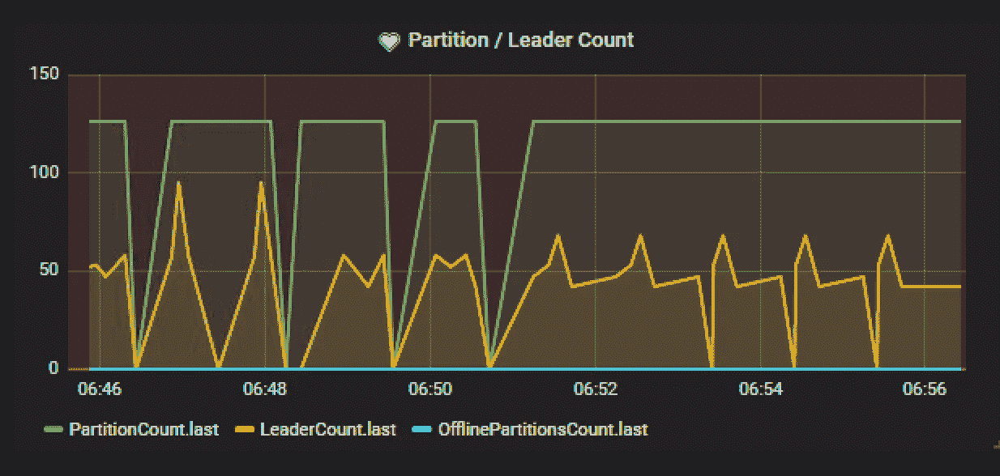
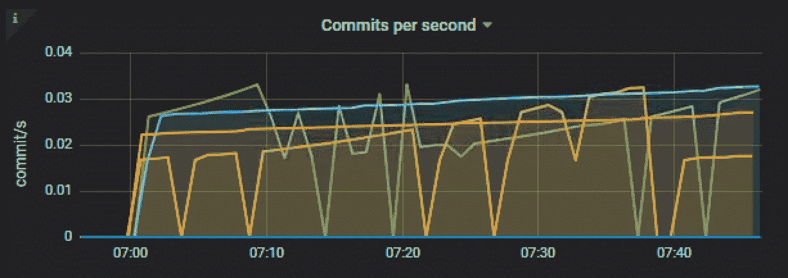

# 在库伯内特斯监视卡夫卡

> 原文：<https://itnext.io/monitoring-kafka-in-kubernetes-7b46c9bf42b6?source=collection_archive---------2----------------------->

## 没有普罗米修斯的《库伯涅茨》中的卡夫卡

## TL；速度三角形定位法(dead reckoning)

如果你不能或者不愿意使用普罗米修斯，这篇文章主要关注于监控你在 Kubernetes 的 Kafka 部署。卡夫卡通过 JMX 揭示了它的尺度。为了能够在您最喜欢的报告后端(例如 InfluxDB 或 Graphite)收集指标，您需要一种使用 JMX 协议查询指标并传输它们的方法。这就是 jmxtrans 派上用场的地方。经过一些小的调整，在 Kafka pods 中把它作为边车运行，让它查询指标并把它们传输到您的报告后端是非常有效的。对于不耐烦的人:所有的[示例代码都可以在这里](https://github.com/jeroenr/kafka-k8s-monitoring)找到。

## 为什么要监视卡夫卡

消息传递越来越成为不同应用之间共享数据的流行选择，使得 Kafka 这样的工具成为你架构的主干。一个运行良好的 Kafka 集群能够处理大量数据，但是 Kafka 集群运行状况不佳或降级可能会导致整个堆栈出现问题。因此，掌握这一问题并提供仪表板以提供必要的见解是至关重要的。

## 度量，度量，度量

Kafka 提供了大量关于性能和资源利用的指标，这些指标(默认情况下)可以通过 JMX 记者获得。我花了一段时间才弄清楚哪些指标是可用的，以及如何访问它们。更糟糕的是，随着卡夫卡的发行，它也发生了几次变化。Confluent 提供了一个[好的(并且大部分是正确的)概述](https://docs.confluent.io/current/kafka/monitoring.html)在最近的 Kafka 版本中可用的度量标准。Kafka 指标可以分为三类:

*   经纪人指标
*   生产者指标
*   消费者指标

有一篇[很好的文章](https://www.datadoghq.com/blog/monitoring-kafka-performance-metrics/)介绍了每个类别中哪些指标很重要。对于我们来说，复制分区不足和消费者延迟是关键指标，还有几个与吞吐量相关的指标。

## 配置 Kafka 部署以公开指标

所以让我们假设以下 Kafka 在 Kubernetes 上的设置。Kafka pods 作为 StatefulSet 的一部分运行，我们有一个无头服务来为我们的经纪人创建 DNS 记录。然后，我们必须配置 Kafka 通过 JMX 报告指标。这是通过配置`JMX_PORT`环境变量来完成的。我们将得到一个类似于下面的 YAML 文件

同样，这里重要的部分是我们将`JMX_PORT`环境值设置为`9010`的值，这意味着我们将在该端口上公开 Kafka 指标。您可以使用 JConsole 之类的工具来验证是否可以连接到这个端口。

## 将 Kafka 指标导出到您的报告后端

很好，我们已经确认 Kafka 的指标已经公开，可以导出到您的报告后端。如果你碰巧使用普罗米修斯，你应该设置[卡夫卡出口](https://github.com/danielqsj/kafka_exporter)或者 [JMX 出口](https://github.com/prometheus/jmx_exporter)然后搞定它。你可以跳过这篇文章的其余部分，因为普罗米修斯将做引入指标的艰苦工作。然而，大多数其他报告后端(例如 InfluxDB、Graphite)是基于推送的，因此您需要自己提取和加载指标。

如果你不想和(自定义)Kafka Metrics Reporters [混在一起，jmxtrans](https://github.com/jmxtrans/jmxtrans/wiki) 可能会让你感兴趣。Jmxtrans 是一个工具，它能够查询多个 JVM 通过 JMX 公开的属性，并使用可配置的输出编写器输出结果。它为许多流行的报告后端提供了输出编写器，例如: [Amazon CloudWatch](https://aws.amazon.com/cloudwatch/) ，InfluxDB，Graphite，Ganglia，StatsD 等。

我现在将展示我们与 InfluxDB 一起使用的设置。以下是 InfluxDB 的 jmxtrans 配置示例:

```
{
  "servers" : [ {
    "port" : "8081",
    "host" : "kafka.my-namespace.svc.cluster.local",
    "queries" : [ {
      "obj" : "java.lang:type=Memory",
      "attr" : [ "HeapMemoryUsage", "NonHeapMemoryUsage" ],
      "resultAlias":"jvmMemory",
      "outputWriters" : [ {
        "@class" : "com.googlecode.jmxtrans.model.output.InfluxDbWriterFactory",
        "url" : "http://127.0.0.1:8086/",
        "username" : "admin",
        "password" : "admin",
        "database" : "jmxDB",
        "tags"     : {"application" : "kafka"}
      } ]
    } ]
  } ]
}
```

如您所见，您为每个服务器指定了一个查询列表，您可以在其中查询属性列表。对于每个查询，您可以指定一个输出编写器列表。我不确定为什么为每个查询重新定义一个输出编写器列表是有用的。对于 Kafka 用例，您最终会得到一个很大的配置文件，其中包含许多重复的内容。

如果我们可以在这里使用某种模板，那就太好了。我的模板看起来会像这样

```
{
 "servers": [{
  "port": "${kafkaJmxPort}",
  "host": "localhost",
  "alias": "${alias}",
  "queries": [
    {{#metrics}} {
   "outputWriters": [{
    "[@class](http://twitter.com/class)": "com.googlecode.jmxtrans.model.output.InfluxDbWriterFactory",
    "url": "${influxUrl}",
    "database": "${influxDatabase}",
    "retentionPolicy": "${retentionPolicy}",
    "createDatabase": false,
    "username": "${influxUser}",
    "password": "${influxPass}"
   }],
   "obj": {{obj}},
   "attr": {{attribute}},
   "resultAlias": {{resultAlias}}
  } {{/metrics}}
  ]
 }]
}
```

[jmxtrans docker image](https://hub.docker.com/r/jmxtrans/jmxtrans/) 支持 JSON 配置文件中的提要，并支持使用 JVM 参数进行变量替换。所以我可以用它来注入像`${influxPass}`这样的秘密。然而，我仍然需要一个不必为每个指标重复输出编写器的解决方案。为了保持务实，我使用`jq`来呈现基于一系列指标的 jmxtrans 配置文件模板。模板需要在启动实际的 jmxtrans 容器之前呈现，所以我使用一个 [Init 容器](https://kubernetes.io/docs/concepts/workloads/pods/init-containers/)来完成这项工作。Init 容器类似于常规容器，但是在其他容器启动之前运行。这非常适合生成配置文件。让我们创建一个 Init 容器来生成 jmxtrans 配置

如您所见，度量列表是从一个`ConfigMap`挂载的，生成的`kafka.json`文件被写入另一个卷挂载。参见下面的`ConfigMap`

注意，在这个`ConfigMap`中，我们还放置了一个简单的引导脚本来注入 JVM 参数，以便由 jmxtrans 本身进行替换。该脚本将作为 docker 容器的入口点。

现在我们只需要将 jmxtrans 容器描述符添加到我们现有的 kafka pod 模板中。我将把它添加为边车，这样查询 JMX 将只发生在 pod 内部。

重要的是，我们挂载包含我们生成的配置文件的文件夹(`jmxtrans-input`)，挂载`boot.sh`脚本，并在第 32 行中使用它作为 docker 入口点。

精彩！一旦我们`kubectl apply`了整个事情，我们就可以将我们的数据源添加到 Grafana，并创建漂亮的卡夫卡图表，如



一段时间内每个主题的消息



一段时间内每秒记录数



随着时间的推移，分区复制不足



消费者滞后一段时间



一段时间内的分区计数与领导者计数



一段时间内每秒提交的次数

## 保持 jmxtrans 的活力

这种设置工作得相当好，但是当在生产中运行这种设置一段时间后，我们遇到了诸如[https://github.com/jmxtrans/jmxtrans/issues/685](https://github.com/jmxtrans/jmxtrans/issues/685)这样的问题。这实际上将 jmxtrans 容器变成了僵尸。容器将继续运行，但不会导出任何指标！通过在容器上配置一个活跃度探测器，我发现了一个相当难看的解决方法，该探测器跟踪到我们的报告后端的传出 tcp 连接。在我们的例子中，这是在端口 8086 上运行的 InfluxDB。

```
livenessProbe:
  exec:
    command: ["/bin/sh", "-c", "exec netstat -n | grep -q :8086"]
```

如果在端口 8086 (InfluxDB)上找不到任何活动连接，那么`grep`命令将会失败，这将最终导致容器重新启动。请注意，这只是重新启动边车，而不是 Kafka 容器，它将影响 Pod 准备就绪！只有当一个 pod 的所有容器都准备好了(并且其他[就绪门条件为真](https://kubernetes.io/docs/concepts/workloads/pods/pod-lifecycle/#pod-readiness-gate))时，该 pod 才被评估为就绪。这将导致您的代理不被 headless 服务列为活动的。我仍然希望找到一个更好的解决方案，我很乐意接受建议！

感谢阅读！所有的[示例代码都可以在我的 github](https://github.com/jeroenr/kafka-k8s-monitoring) 获得。