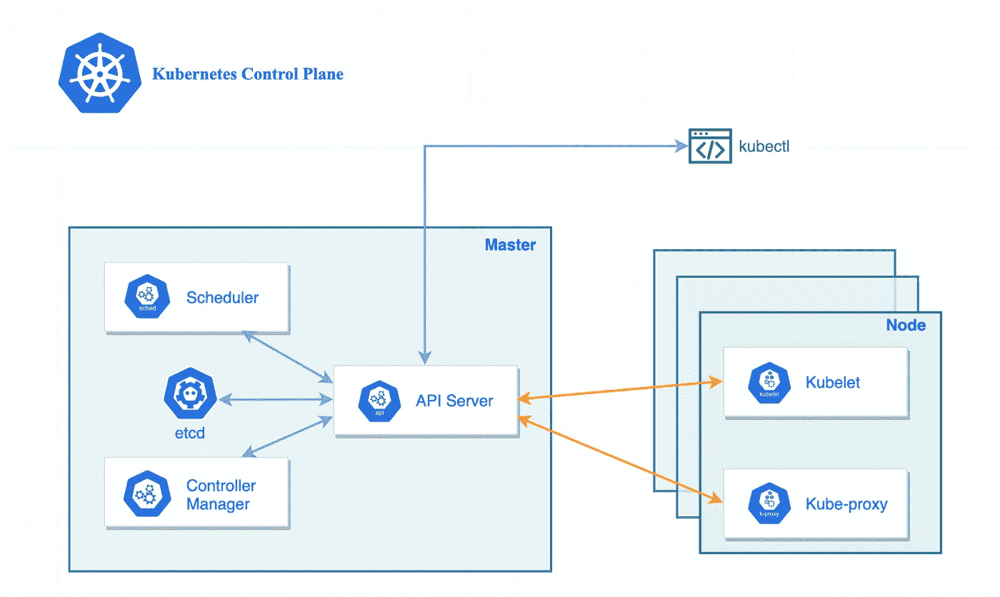
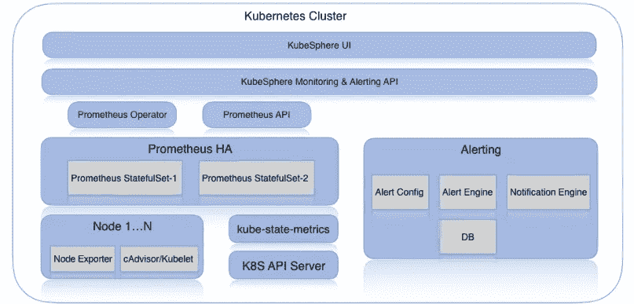
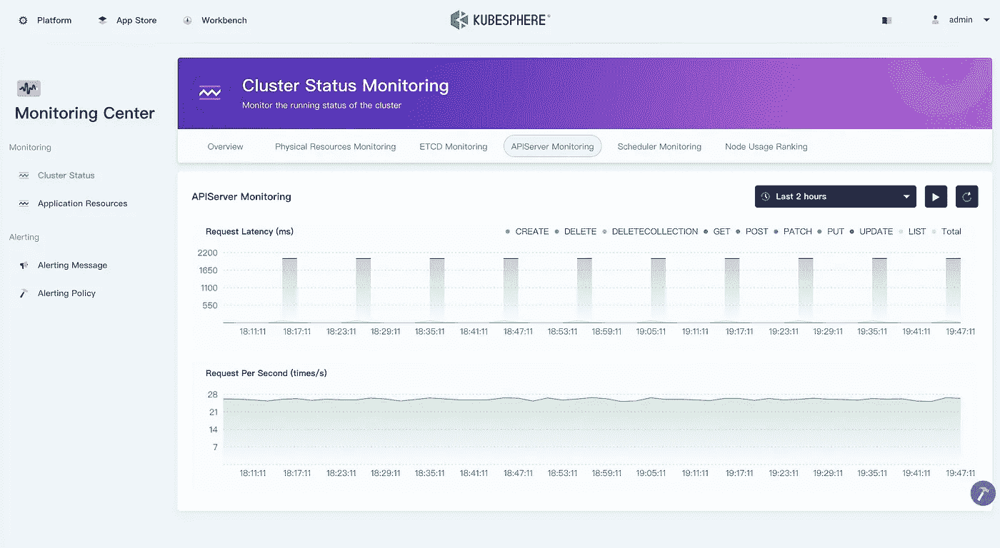
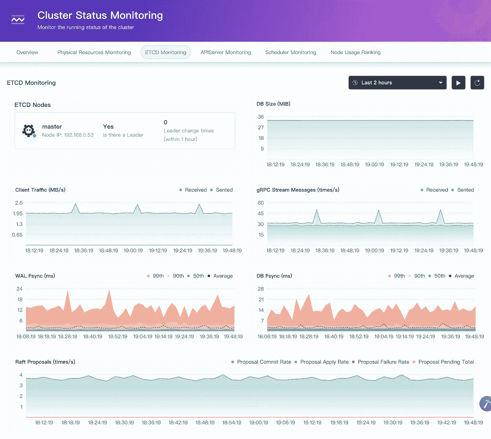
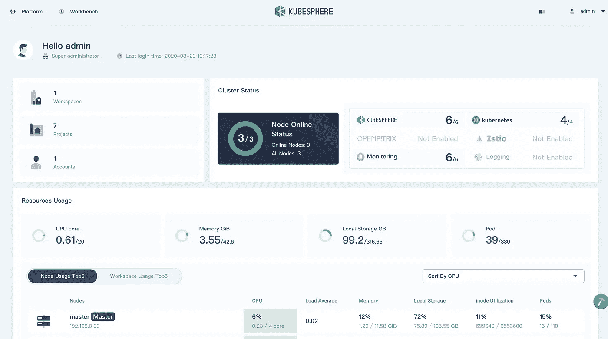
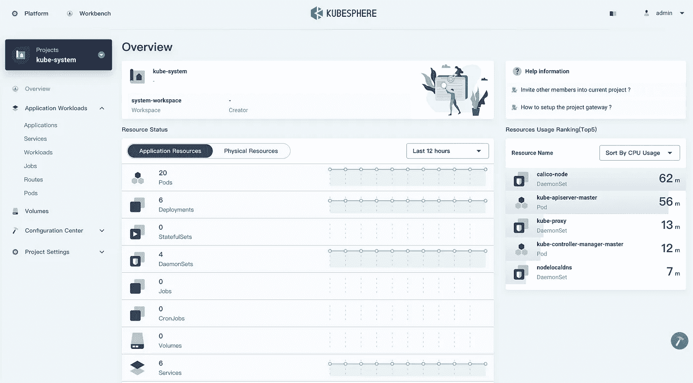

# 使用 KubeSphere 监控 Kubernetes 控制平面

> 原文：<https://itnext.io/monitoring-kubernetes-control-plane-using-kubesphere-7885461f40b1?source=collection_archive---------1----------------------->

# Kubernetes 控制平面简介

在 Kubernetes 集群中，有两个机器角色，包括主节点和工作节点。主节点运行 Kubernetes 控制平面，它负责管理工作节点，做出调度决策，并实施更改以将集群驱动到所需的状态。工作节点，顾名思义，它们运行工作负载并在其上 Pod。



Kubernetes 控制平面

上图显示了在 Kubernetes 控制平面中运行的四个组件，每个组件对于运行一个健康的 Kubernetes 集群都是至关重要的，它们在集群中扮演不同的角色:

*   kube-API server:Kubernetes 控制平面的一个组件，它公开了 Kubernetes API。API 服务器是 Kubernetes 控制平面的前端。
*   **etcd** :一致且高度可用的键值存储，用作 Kubernetes 所有集群数据的后备存储。
*   **kube-scheduler** :监视新创建的没有分配节点的 pod，并选择一个节点让它们运行。
*   **kube-controller-manager** :通过 API server watch 特性监视集群的状态，并进行更改以将集群移向所需状态。

# 为什么要监控控制平面

为了保持 Kubernetes 集群的高可靠性，通过监控控制平面的组件，集群管理员可以更快地诊断集群中发生的调度和协调问题。因此，我们需要收集控制平面的指标来可视化实时数据，并深入挖掘每个控制平面组件的状态和性能。

# 控制平面监控的工具

不可否认，Prometheus 是领先的开源监控解决方案。加上 Grafana dashboard，它们可以成为监控 Kubernetes 控制面板组件的完美组合解决方案。但是，要快速设置目标指标并将其收集到一个统一的监控仪表板中，这两种方法都有点复杂。

幸运的是， [KubeSphere](https://github.com/kubesphere/kubesphere) 利用这些工具，包括 Prometheus、Kube-state-metrics Node-exporter、ServiceMonitor，以及 PrometheusRule 中的预定义规则，**提供从应用到基础设施的现成监控指标**。



KubeSphere 监控架构

# KubeSphere 中的指标

为了有效地监控控制面板组件，每个组件的运行状况和状态的可见性至关重要。您可以安装 KubeSphere 来轻松获得控制平面组件监控的整体洞察力，并显示时序数据。

# API 服务器的关键指标

*   `apiserver_request_by_verb_latencies` (ms):每个动词、资源和子资源的响应延迟分布，以微秒计。
*   `apiserver_request_rate`(次/秒):apiserver 请求的速率



API 服务器监控

# Etcd 的关键指标

*   `has_leader`:领导者是否存在。
*   `etcd_mvcc_db_size` (MiB):底层数据库的总大小，以字节为单位。
*   `client_grpc_sent/received_bytes_total` (MB/s):包括发送和接收到 grpc 客户端的总字节数。
*   `etcd_grpc_server_msg_sent/received_rate`:服务器接收和发送的 gRPC 流消息总数。
*   `etcd_disk_wal_fsync_duration (ms)`:wal 调用 fsync 的延迟分布。
*   `etcd_disk_backend_commit_duration` (ms):描述一下你的磁盘写性能。
*   `Raft Proposals`(次/秒):raft 协议确保建议被正确地应用到集群



Etcd 监控指标

# kube-scheduler 的关键指标

*   `scheduler_schedule_attempts`:根据结果，安排 pod 的尝试次数的差异。不可调度表示无法调度 pod，而错误表示内部调度程序问题。
*   `scheduler_schedule_attempt_rate`:按结果排列的调度单元尝试次数的比率。不可调度表示无法调度 pod，而错误表示内部调度程序问题。
*   `scheduler_e2e_scheduling_latency`:端到端调度延迟，是调度算法延迟和绑定延迟之和。


kube-调度程序监控指标

# 如何安装 KubeSphere

[KubeSphere](https://github.com/kubesphere/kubesphere) 是一个分布式操作系统，提供以 Kubernetes 为内核的云原生栈，提供从应用到基础设施丰富的可观察性。KubeSphere 支持在云托管和本地 Kubernetes 集群上安装，或者在 Linux 机器上安装。本指南仅引导您完成在现有 Kubernetes 集群上的安装。

# 先决条件

*   `Kubernetes version` : `1.15.x, 1.16.x, 1.17.x`
*   `Helm version`>=`2.10.0`<`3.0`，参见[在 Kubernetes](https://devopscube.com/install-configure-helm-kubernetes/) 中安装和配置头盔；KubeSphere 3.0 将支持 Helm 3.0。
*   Kubernetes 群集中的默认存储类已配置；使用`kubectl get sc`进行验证。
*   可用资源 CPU >= 1 个内核，内存> = 2G
*   在 kube-apiserver 中激活了 CSR 签名功能，请参见 [RKE 安装问题](https://github.com/kubesphere/kubesphere/issues/1925#issuecomment-591698309)。

# 在 Kubernetes 上部署 KubeSphere

> *不能上网？参考* [*气隙安装*](https://kubesphere.io/docs/installation/install-on-k8s-airgapped/) *了解如何使用自己的私有注册表安装 KubeSphere。*

使用 kubectl 安装 KubeSphere，假设您的集群可以访问互联网。

*   如果集群中有 1 个内核和 2 GB RAM 可用，请使用以下命令仅触发默认最小安装:

```
kubectl apply -f https://raw.githubusercontent.com/kubesphere/ks-installer/master/kubesphere-minimal.yaml
```

*   如果集群中有 8 个内核和 16 GB RAM，请使用下面的命令安装一个完整的 KubeSphere，即启用所有组件:

```
kubectl apply -f https://raw.githubusercontent.com/kubesphere/ks-installer/master/kubesphere-complete-setup.yaml
```

验证实时日志。当您看到以下输出时，恭喜您！您现在可以在浏览器中访问 KubeSphere 控制台。

```
$ kubectl logs -n kubesphere-system $(kubectl get pod -n kubesphere-system -l app=ks-install -o jsonpath='{.items[0].metadata.name}') -f

#####################################################
###              Welcome to KubeSphere!           ###
#####################################################
Console: http://10.128.0.34:30880
Account: admin
Password: P@88w0rd

NOTE：Please modify the default password after login.
#####################################################
```



KubeSphere 控制台



KubeSphere 项目

# 启用 Etcd 监控

1.  在您的 Kubernetes 集群中为 etcd 创建证书的秘密。

> *注意:根据您所在集群的实际 ETCD 证书路径创建密钥；如果 ETCD 没有配置证书，需要创建一个空的秘密*

*   如果 ETCD 已经配置了证书，请参考以下步骤(以下命令是一个示例，仅用于由`kubeadm`创建的集群):

```
kubectl -n kubesphere-monitoring-system create secret generic kube-etcd-client-certs  \
--from-file=etcd-client-ca.crt=/etc/kubernetes/pki/etcd/ca.crt  \
--from-file=etcd-client.crt=/etc/kubernetes/pki/etcd/healthcheck-client.crt  \
--from-file=etcd-client.key=/etc/kubernetes/pki/etcd/healthcheck-client.key
```

*   如果 ETCD 尚未配置证书。

```
kubectl -n kubesphere-monitoring-system create secret generic kube-etcd-client-certs
```

您可以通过使用以下命令编辑 ks-installer 的配置图来启用可插拔组件:

```
kubectl edit cm ks-installer -n kubesphere-system
```

然后启用 etcd，用您的地址替换 Etcd 地址。

```
etcd: 
  monitoring: true 
  endpointIps: 192.168.0.7,192.168.0.8,192.168.0.9 
  port: 2379 
  tlsEnable: True
```

同上，保存您的更改，并等待片刻。当您看到欢迎日志出来时，这意味着 etcd 监控准备就绪。

# 参考

*   [监控 Kubernetes:监控什么(速成班，第 2 部分)](https://www.sumologic.com/blog/kubernetes-monitoring/)
*   [Kubernetes 组件](https://kubernetes.io/docs/concepts/overview/components/)
*   [Kubernetes 用 Datadog 监控控制平面](https://www.datadoghq.com/blog/kubernetes-control-plane-monitoring/)