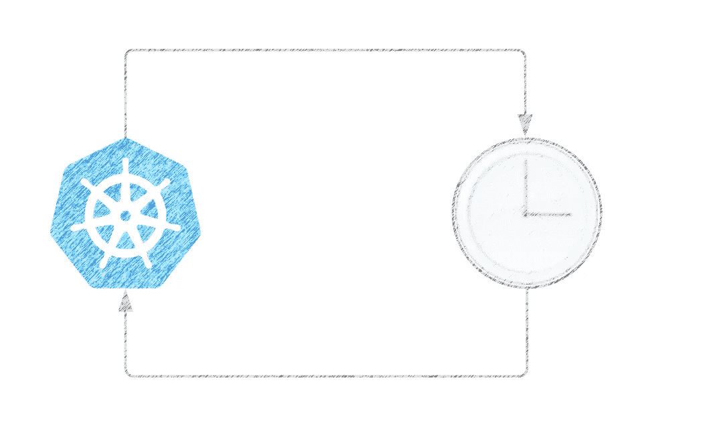

# 监控 Kubernetes 作业

> 原文：<https://itnext.io/monitoring-kubernetes-jobs-8adc241a7b60?source=collection_archive---------2----------------------->



AKubernetes[Job](https://kubernetes.io/docs/concepts/workloads/controllers/job/)是一个表示有限任务的控制器对象。作业与其他控制器对象的不同之处在于，作业在任务运行到完成时管理任务，而不是像部署、复制集和状态集那样管理所需的状态。当达到指定的成功完成次数时，作业就完成了。当您想要创建执行特定任务然后退出的 pod 时，可以使用 Kubernetes 作业。

```
**apiVersion**: batch/v1
**kind**: Job
**metadata**:
  **name**: pi
**spec**:
  **template**:
    **spec**:
      **containers**:
      - **name**: pi
        **image**: perl
        **command**: ["perl",  "-Mbignum=bpi", "-wle", "print bpi(2000)"]
      **restartPolicy**: Never
  **backoffLimit**: 4
```

# Cronjobs:自动化 Kubernetes 作业

一个 [*CronJob*](https://kubernetes.io/docs/concepts/workloads/controllers/cron-jobs/) 按照重复的时间表创建作业。自动化作业在 Linux 或 UNIX 系统上运行起来就像 Cron 任务一样。

CronJobs 对于创建定期和重复的任务很有用，比如运行备份或发送电子邮件。CronJobs 还可以将单个任务安排在特定的时间，例如，如果您希望将一个作业安排在一个低活动期。

CronJob 在其调度的每个执行时间创建一个作业对象。`.spec.successfulJobsHistoryLimit`和`.spec.failedJobsHistoryLimit` 字段指定应该保留多少个已完成和失败的任务。默认情况下，它们分别设置为 3 和 1。

```
**apiVersion**: batch/v1
**kind**: CronJob
**metadata**:
  **name**: hello
**spec**:
  **schedule**: "*/1 * * * *"
  **jobTemplate**:
    **spec**:
      **template**:
        **spec**:
          **containers**:
          - **name**: hello
            **image**: busybox
            **imagePullPolicy**: IfNotPresent
            **command**:
            - /bin/sh
            - -c
            - date; echo Hello from the Kubernetes cluster
          **restartPolicy**: OnFailure
  **successfulJobsHistoryLimit**: 1
  **failedJobsHistoryLimit**: 1
```

根据下面的说明，Kubernetes 将只保留一个失败的作业和一个成功的作业:

```
NAME               COMPLETIONS   DURATION   AGE
hello-4111706356   0/1           2m         10d
hello-4111706356   1/1           5s         5s
```

每次作业运行完成时，旧的成功/失败的作业对象都会被清除。在监控 Kubernetes 作业时，了解 Kubernetes 保留这些作业的历史记录是非常重要的。

CronJobs 有局限性和独特性。例如，在某些情况下，单个 CronJob 可以创建多个作业。所以，乔布斯应该是幂等的。

# 监控 Kubernetes 作业

监控(非并发)Kubernetes 作业不是一件容易的事情，但是可以使用[*kube-state-metrics*](https://github.com/kubernetes/kube-state-metrics)和 [*Prometheus*](https://prometheus.io/) 来实现。

kube-state-metrics 是一个简单的服务，它监听 Kubernetes API 服务器并生成关于对象状态的度量。它并不关注单个 Kubernetes 组件的健康状况，而是关注内部各种对象的健康状况，比如部署、节点、单元以及对我们有利的作业。

在 kube-state-metrics 报告的所有[指标](https://github.com/kubernetes/kube-state-metrics/blob/master/docs/job-metrics.md)中，我们将使用以下指标:

*   **kube_job_owner:** 查找作业和触发它的 CronJob 之间的关系。
*   **kube _ Job _ status _ start _ time:**找出作业被触发的时间。
*   **kube_job_status_failed** :找出哪些作业失败了。
*   **kube _ cron job _ spec _ suspend**:过滤掉暂停的作业。

下面是一个指标示例，其中包含由 CronJob 为在计划中运行的“hello”作业生成的标签:

```
kube_job_owner{**job_name**=”hello-1604875860", **namespace**=”myNamespace”, **owner_is_controller**=”true”, **owner_kind**=”CronJob”, **owner_name**=”hello”} 1kube_job_status_start_time{**job_name**="hello-1604875860", **namespace**="myNamespace"} 1604875874kube_job_status_failed{**job_name**="hello-1604875860", **namespace**="myNamespace", **reason**="BackoffLimitExceeded"} 1kube_cronjob_spec_suspend{**cronjob**="hello",**job**="kube-state-metrics", **namespace**="myNamespace"} 0
```

kube-state-metrics 将报告所有现有对象的度量。如前所述，通常会保留作业的历史记录，以便调试故障(与`.spec.successfulJobsHistoryLimit`和`.spec.failedJobsHistoryLimit`中指定的一样多)。这意味着失败的作业将持续被报告为失败，即使该作业的后续执行已经成功。这里的困难是识别由同一个 CronJob(同一个`owner_name`)触发的一组作业的最后一次运行，并且只在这一次失败时发出警报。

由于`kube_job_status_failed`指标不包含`owner_name`标签，所以第一步是连接这两个指标:

```
max(
  kube_job_status_start_time
  * ON(job_name,namespace) GROUP_RIGHT()
  kube_job_owner{owner_name!=””}
  )
BY (job_name, owner_name, namespace)
```

> 我们使用`max`查询函数，因为根据 Prometheus scrape 配置，指标可能包含类似`pod=”kube-state-metrics-asdfaikhp-9fjk76”`的标签。如果 pod 失效，或者您正在为 HA(高可用性)运行多个 kube-state-metrics pod，则最大查询功能将只根据需要为每个作业返回一个结果。

假设我们的作业历史包含两个作业(一个失败，另一个成功)，结果将如下所示:

```
{**job_name**=”hello-1623578940", **namespace**=”myNamespace”, **owner_name**=”hello”} 1623578959
{**job_name**=”hello-1617667200", **namespace**=”myNamespace”, **owner_name**=”hello”} 1617667204
```

现在我们知道了每个作业的所有者，我们需要找出最后执行的是哪个作业。我们可以通过按`owner_name`标签聚合结果来实现这一点:

```
max(
  kube_job_status_start_time
  * ON(job_name,namespace) GROUP_RIGHT()
  kube_job_owner{owner_name!=""}
) 
BY (owner_name)
```

将这两个查询放在一起:

```
max(
 kube_job_status_start_time
 * ON(job_name,namespace) GROUP_RIGHT()
 kube_job_owner{owner_name!=””}
)
BY (job_name, owner_name, namespace)
== ON(owner_name) GROUP_LEFT()
max(
 kube_job_status_start_time
 * ON(job_name,namespace) GROUP_RIGHT()
 kube_job_owner{owner_name!=””}
)
BY (owner_name)
```

结果将显示每个 CronJob 最后执行的作业，并且只显示最后一个作业:

```
{**job_name**=”hello-1623578940", **namespace**=”myNamespace”, **owner_name**=”hello”} 1623578959
```

为了可读性，我们借此机会将`job_name`和`owner_name`标签分别替换为`job`和`cronjob`:

```
label_replace(
  label_replace(
    max(
      kube_job_status_start_time
      * ON(job_name,namespace) GROUP_RIGHT()
      kube_job_owner{owner_name!=””}
    )
    BY (job_name, owner_name, namespace)
    == ON(owner_name) GROUP_LEFT()
    max(
      kube_job_status_start_time
      * ON(job_name,namespace) GROUP_RIGHT()
      kube_job_owner{owner_name!=””}
    )
    BY (owner_name),
  “job”, “$1”, “job_name”, “(.+)”),
“cronjob”, “$1”, “owner_name”, “(.+)”)
```

我们将使用 *r* [*记录规则:*](https://prometheus.io/docs/prometheus/latest/configuration/recording_rules/#recording-rules) 将这个查询的结果存储在一个新的度量中

```
- record: job:kube_job_status_start_time:max
  expr: |
    label_replace(
      label_replace(
        max(
          kube_job_status_start_time
          * ON(job_name,namespace) GROUP_RIGHT()
          kube_job_owner{owner_name!=””}
        )
        BY (job_name, owner_name, namespace)
        == ON(owner_name) GROUP_LEFT()
        max(
          kube_job_status_start_time
          * ON(job_name,namespace) GROUP_RIGHT()
          kube_job_owner{owner_name!=””}
        )
        BY (owner_name),
      “job”, “$1”, “job_name”, “(.+)”),
    “cronjob”, “$1”, “owner_name”, “(.+)”)
```

现在我们已经有了给定 cronjob 的最近启动的作业，我们想利用`kube_job_status_failed`指标找出哪些作业失败了:

```
- record: job:kube_job_status_failed:sum
  expr: |
    clamp_max(
      job:kube_job_status_start_time:max,1)
      * ON(job) GROUP_LEFT()
      label_replace(
        label_replace(
          (kube_job_status_failed != 0),
          “job”, “$1”, “job_name”, “(.+)”),
        “cronjob”, “$1”, “owner_name”, “(.+)”)
```

clamp_max 将`job:kube_job_status_start_time:max`的结果转换成一组上限为 1 的时间序列，我们可以用它通过乘法来过滤失败的作业。结果是一个新的度量`job:kube_job_status_failed:sum`，它包含一组最近失败的作业。

最后一步是为失败的作业设置警报:

```
- alert: CronJobStatusFailed
  expr: |
    job:kube_job_status_failed:sum
    * ON(cronjob,namespace) GROUP_LEFT()
    (kube_cronjob_spec_suspend == 0)
```

为了避免误报，我们已经从相同的作业中排除了暂停的作业。

## 关于这篇文章

这篇文章很大程度上受到几年前由特里斯坦发表的一篇文章的启发。由于 kube-state-metrics 随着时间的推移改变了一些指标，我们一直在使用略有不同的表达式，随着最近 2.0 版的发布，我们不得不使用一组不同的指标。核心思想是一样的，所以谢谢 Tristan 的分享！

# 结论

虽然 kube-state-metrics 报告的指标非常有用且丰富，但它们并没有使失败作业的警报任务变得容易。我们希望您会发现这很有用，因为我们在首次设置作业监控时就发现了 Tristan 的文章。