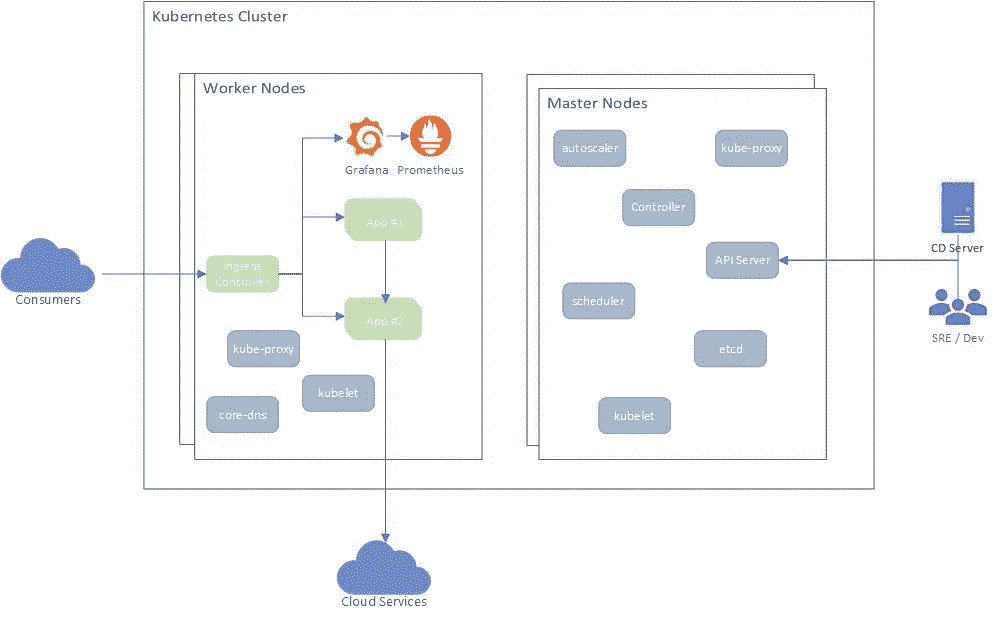
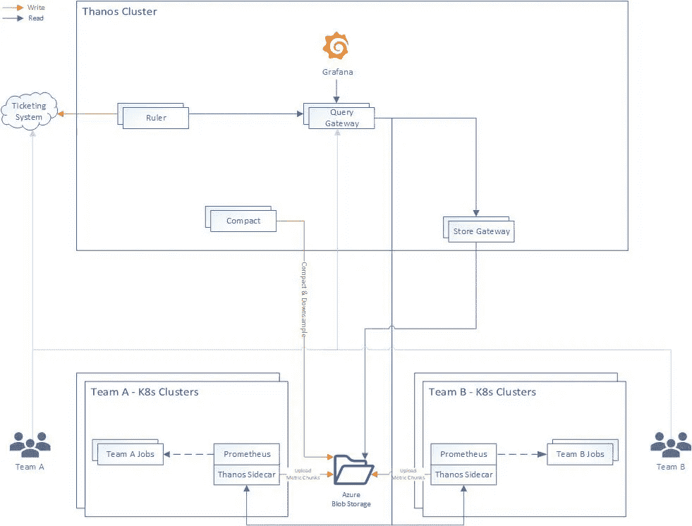
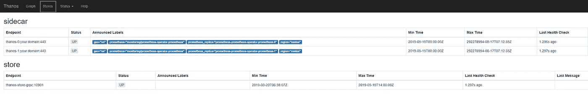

# 使用普罗米修斯和灭霸监控 Kubernetes 的工作负载

> 原文：<https://itnext.io/monitoring-kubernetes-workloads-with-prometheus-and-thanos-4ddb394b32c?source=collection_archive---------1----------------------->

# 介绍

恭喜你！你已经成功地说服了你的工程经理、副总裁 R&D 或首席技术官，使用基于 Kubernetes 的容器将公司的工作负载迁移到微服务上。

你非常高兴，一切都在按计划进行，你创建了你的第一个 *Kubernetes* 集群(所有三个主要的云提供商， *Azure，AWS* 和 *GCP* ，有一个简单的方法来提供一个受管或不受管的 Kubernetes 平台)，开发了你的第一个容器化的应用程序，并将其部署到集群。那很容易，不是吗？:)

一段时间后，您意识到事情变得有点复杂，您有多个应用程序要部署到集群，因此您需要一个*入口控制器*，然后，在投入生产之前，您想要了解您的工作负载是如何执行的，因此您开始寻找一个监控解决方案，幸运的是，您找到了 [*Prometheus*](https://prometheus.io) ，部署它，添加 [*Grafana*](http://grafana.com) ，您就大功告成了！

稍后，你开始疑惑——为什么普罗米修斯只带着一个副本运行？如果容器重启会发生什么？还是只是版本更新？普罗米修斯公司能保存我的数据多长时间？当集群关闭时会发生什么？我是否需要另一个集群用于高可用性和灾难恢复？我将如何与*普罗米修斯*进行集中查看？

嗯，继续看，聪明人早就想通了。

# 典型的 Kubernetes 集群

下图展示了一个基于 Kubernetes 的典型部署



典型的 Kubernetes 集群

部署由三层组成:

1.  底层虚拟机—主节点和工作节点
2.  Kubernetes 基础设施应用
3.  用户应用程序

不同的组件在内部相互通信，通常使用 HTTP(s) (REST 或 gRPC)，其中一些组件向集群外部公开 API(Ingress)，这些 API 主要用于

1.  通过 Kubernetes API 服务器进行集群管理
2.  通过入口控制器暴露的用户应用交互

在某些情况下，应用程序可能会将流量发送到群集外部(出口)以使用其他服务，如 Azure SQL、Azure Blob 或任何第三方服务。

# 监控什么？

监控 Kubernetes 应考虑上述所有三个层面。

**底层虚拟机:**为确保底层虚拟机运行正常，应收集以下指标

*   节点数量
*   每个节点的资源利用率(CPU、内存、磁盘、网络带宽)
*   节点状态(就绪、未就绪等。)
*   每个节点上运行的单元数量

**Kubernetes 基础设施:t** 为了确保 Kubernetes 基础设施的健康，应该收集以下指标

*   Pods 运行状况—实例就绪、状态、重启、年龄
*   部署状态—期望的、当前的、最新的、可用的、年龄
*   状态设置状态
*   CronJobs 执行统计
*   Pod 资源利用率(CPU 和内存)
*   健康检查
*   Kubernetes 事件
*   API 服务器请求
*   Etcd 统计
*   装载的卷统计信息

**用户应用程序:e** 每个应用程序都应该根据其核心功能公开自己的指标，但是，有些指标是大多数应用程序共有的，例如:

*   HTTP 请求(总数、延迟、响应代码等。)
*   传出连接数(如数据库连接)
*   螺纹扣数

收集上述指标，将允许您构建有意义的**警报**和**仪表板**，我们将在下面简要介绍。

# 灭霸

[*灭霸*](https://github.com/improbable-eng/thanos) 是一个开源项目，构建为一组组件，可以组成一个具有**无限存储**容量的**高度可用的**公制系统，可以无缝地添加到现有的*普罗米修斯*部署之上。

*灭霸*利用*普罗米修斯*存储格式在任何对象存储中经济高效地存储历史指标数据，同时保持快速查询延迟。此外，它提供了一个跨越所有 *Prometheus* 安装的**全局查询视图**。

*灭霸*的主要部件有:

*   **边车**:连接到 *Prometheus* ，并通过*查询网关*暴露它以进行实时查询，和/或将其数据上传到云存储以供长期使用
*   **查询网关**:实现*普罗米修斯*API 从底层组件(如*边车*或*商店网关*)聚合数据
*   **商店网关**:公开云存储的内容
*   **压缩器**:对云存储中存储的数据进行压缩和降采样
*   **接收器**:接收来自*普罗米修斯*远程写墙的数据，将其公开和/或上传至云存储
*   **标尺**:针对*灭霸*中的数据评估记录和警报规则，以供展示和/或上传

在本文中，我们将重点关注前三个组件。



灭霸部署图

# 部署灭霸

我们将从将*灭霸 Sidecar* 部署到我们的 *Kubernetes* 集群开始，我们使用相同的集群来运行我们的工作负载和*普罗米修斯*和 *Grafana* 部署。

虽然安装 *Prometheus* 的方法有很多，但我更喜欢使用[*Prometheus-Operator*](https://github.com/coreos/prometheus-operator)，这样可以轻松监控 *Kubernetes* 服务的定义以及 *Prometheus* 实例的部署和管理。

安装 *Prometheus-Operator* 最简单的方法是使用其 [*掌舵图*](https://github.com/helm/charts/tree/master/stable/prometheus-operator) ，该图内置了对高可用性的支持、*灭霸边车*注入和大量预配置的*警报*，用于监控集群虚拟机、 *Kubernetes* 基础设施和您的应用程序。

在我们部署灭霸边车之前，我们需要有一个关于如何连接到云存储细节的 Kubernetes 秘密，对于这个演示，我将使用*微软 Azure* 。

创建一个 blob 存储帐户—

```
az storage account create --name <storage_name> --resource-group <resource_group> --location <location> --sku Standard_LRS --encryption blob
```

然后，为指标创建一个文件夹(又名容器)

```
az storage container create --account-name <storage_name> --name thanos
```

拿着存储钥匙—

```
az storage account keys list -g <resource_group> -n <storage_name>
```

为存储设置创建一个文件(*than OS-storage-config . YAML*)—

创造一个 *Kubernetes 的秘密*——

```
kubectl -n monitoring create secret generic thanos-objstore-config --from-file=thanos.yaml=thanos-storage-config.yaml
```

创建一个值文件(*prometheus-operator-values . YAML*)来覆盖默认的 Prometheus-Operator 设置

然后部署:

```
helm install --namespace monitoring --name prometheus-operator stable/prometheus-operator -f prometheus-operator-values.yaml
```

现在，您应该有一个**高可用的** *普罗米修斯*在您的集群中运行，还有一个*灭霸边车*将您的指标上传到 Azure Blob 存储，并无限保留。

为了允许*灭霸商店网关*访问那些*灭霸边车*，我们将需要通过*入口*来暴露它们，我使用的是 [*Nginx 入口控制器*](https://github.com/kubernetes/ingress-nginx) ，但是您可以使用任何其他支持 gRPC 的*入口控制器*([*Envoy*](https://www.envoyproxy.io/)*可能是最好的选择)。*

*对于*灭霸商店网关*和*灭霸边车*之间的安全通信，我们将使用 mutual-TLS，这意味着客户端将验证服务器，反之亦然。*

*假设你有*。pfx* 文件你可以使用*OpenSSL*——提取它的*私钥、公钥*和 *CA**

```
*# public key
openssl pkcs12 -in cert.pfx -nocerts -nodes | sed -ne '/-BEGIN PRIVATE KEY-/,/-END PRIVATE KEY-/p' > cert.key# private key
openssl pkcs12 -in cert.pfx -clcerts -nokeys | sed -ne '/-BEGIN CERTIFICATE-/,/-END CERTIFICATE-/p' > cert.cer# certificate authority (CA)
openssl pkcs12 -in cert.pfx -cacerts -nokeys -chain | sed -ne '/-BEGIN CERTIFICATE-/,/-END CERTIFICATE-/p' > cacerts.cer*
```

*用这个创造两个库伯内特的秘密*

```
*# a secret to be used for TLS termination
kubectl create secret tls -n monitoring thanos-ingress-secret --key ./cert.key --cert ./cert.cer# a secret to be used for client authenticating using the same CA
kubectl create secret generic -n monitoring thanos-ca-secret --from-file=ca.crt=./cacerts.cer*
```

*确保您有一个解析到您的 *Kubernetes* 集群的域，并创建两个子域用于路由到每个 *Thaos SideCar* :*

```
*thanos-0.your.domain
thanos-1.your.domain*
```

*现在我们可以创建*入口*规则(替换主机值)—*

*现在我们有了一个从集群外部访问*灭霸边车*的**安全**方法！*

***灭霸集群***

*在上面的*灭霸*图中，你可以看到我选择将*灭霸*部署在一个单独的集群中，这是因为我想要一个专用的集群，如果需要的话，可以轻松地重新创建，并允许工程师访问它，而不需要他们访问真正的生产集群。*

*为了部署*灭霸*组件我选择了使用这个 [*掌舵图*](https://github.com/arthur-c/thanos-helm-chart) (尚未正式发布，敬请期待，等我的 [*PR*](https://github.com/arthur-c/thanos-helm-chart/pull/2) 合并)。*

*创建一个 *thanos-values.yaml* 文件来覆盖默认的图表设置—*

*由于*灭霸商店网关*需要从 blob 存储中读取数据，因此我们也在该集群中重新创建了存储机密—*

```
*kubectl -n thanos create secret generic thanos-objstore-config --from-file=thanos.yaml=thanos-storage-config.yaml*
```

*为了部署此图表，我们将使用之前创建的相同证书，并在过程中将它们作为值注入—*

```
*helm install --name thanos --namespace thanos ./thanos -f thanos-values.yaml --set-file query.tlsClient.cert=cert.cer --set-file query.tlsClient.key=cert.key --set-file query.tlsClient.ca=cacerts.cer --set-file store.tlsServer.cert=cert.cer --set-file store.tlsServer.key=cert.key --set-file store.tlsServer.ca=cacerts.cer*
```

*这将安装*灭霸查询网关*和*灭霸存储网关*，将它们配置为使用安全通道。*

***验证***

*为了验证一切工作正常，您可以使用以下命令将端口转发到*灭霸查询网关* HTTP 服务*

```
*kubectl -n thanos port-forward svc/thanos-query-http 8080:10902*
```

*然后在 [http://localhost:8080](http://localhost:8080) 打开你的浏览器，你应该会看到灭霸界面！—*

**

***格拉夫纳***

*要添加仪表板，您可以简单地安装 Grafana 使用其舵图表。*

*用以下内容创建一个 *grafana-values.yaml**

*请注意，我添加了三个默认仪表板，您也可以添加自己的仪表板(最简单的方法是使用 *ConfigMap* )*

*然后部署—*

```
*helm install --name grafana --namespace thanos stable/grafana -f grafana-values.yaml*
```

*再一次，左舷向前—*

```
*kubectl -n thanos port-forward svc/grafana 8080:80*
```

*还有… **中提琴**！您已经完成了基于 ***【普罗米修斯*****长期存储**和跨多个集群的**集中视图**的**高可用性**监控解决方案的部署！*

# *其他选项*

*本文主要关注的是*普罗米修斯*和*灭霸*，但是如果你不需要多集群全局视图，你仍然可以只定义一个持久存储的普罗米修斯。*

*另一个选择是部署 [*Cortex*](https://github.com/cortexproject/cortex) ，这是另一个开源平台，比灭霸稍微复杂一点，并且采用了不同的方法。*