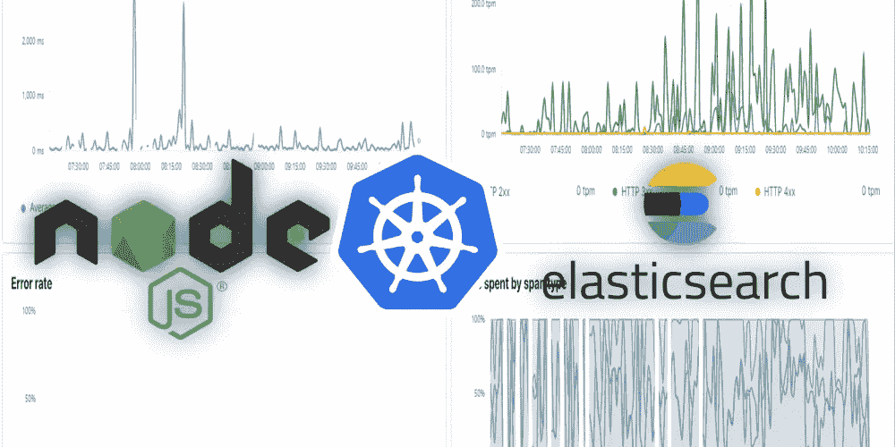

# 使用 elasticsearch 监控/记录 K8S NodeJS 应用程序

> 原文：<https://itnext.io/monitoring-logging-your-k8s-nodejs-applications-using-elasticsearch-cf40dc1eac66?source=collection_archive---------3----------------------->

*关于如何使用 elasticsearch* 设置登录和监控 Kubernetes 上的 NodeJS 应用程序所需的一切的快速指南

我们最近将我们的应用程序堆栈转移到了 Kubernetes。虽然我们立即受益于它的优势，但我们突然缺少 NodeJS 微服务的集中式应用程序级日志。以前，我们的 Express API 完全能够自己提供这些数据。现在，当多个 pod 同时运行时，聚合这些数据变得更加困难。

这引发了对理想工具的网络搜索，以使我们更好地了解性能以及可能发生的任何错误。鉴于我们是一家初创公司([www.bullswap.com](http://www.bullswap.com))，我们更倾向于一种廉价的云无关的开源解决方案，这就是我们最终选择 elasticsearch (Elasticsearch，Kibana，APM Server)的原因。

由于 Kubernetes 和 Elasticsearch 变化如此之快，要获得正确的信息并不容易。这就是为什么我们想分享我们的最终结果如下，所以你不必去同样的麻烦。

**要求**

*   Kubectl 访问最新的 K8S 集群，具有足够的容量来处理至少 3GB 的额外 RAM 使用
*   NodeJS 应用程序

我们在设置什么？

*   弹性搜索集群:[https://www.elastic.co/](https://www.elastic.co/)
*   Kibana:提供弹性搜索数据的可视化
*   APM 服务器:从 APM 代理接收数据，并将其转换成 ElasticSearch 文档
*   将 NodeJS 服务转换成 APM 代理

您看到的所有代码都应该放在 yaml 文件中，并使用`kubectl apply -f {file_name}`来执行

**设置 Elasticsearch**
为了将所有内容与常规名称空间分开，我们首先设置一个新的名称空间。

接下来，我们使用了在本教程[中找到的大量配置来建立一个包含三个 statefulsets 的 elasticsearch 服务。该设置由以下 yaml 文件描述:](https://www.digitalocean.com/community/tutorials/how-to-set-up-an-elasticsearch-fluentd-and-kibana-efk-logging-stack-on-kubernetes)

这应该慢慢开始部署三个新的吊舱。一旦他们都开始迅速看一眼其中一个的日志，以检查一切都很好:)。

**设置 Kibana**
现在是开始使用 Kibana 的时候了。在这里，我们需要建立一个新的服务，由 kibana 映像的一个副本部署组成。

在应用/创建 yaml 文件并允许 pod 准备就绪后，您应该能够测试它是否正常工作。
您可以通过查找 pod 名称并将其转发到本地主机的端口来实现。

`kubectl port-forward kibana-xyz123456789 5601:5601--namespace=kube-logging`

导航到`localhost:5601`应该会显示加载 Kibana 界面。如果 Kibana 通知您没有可用的数据，您可以放心，因为这是完全正常的😊。

当一切看起来正常时，设置一个负载平衡器/入口会很有用，这样您就可以从互联网访问 Kibana。但是，如果您这样做，请确保安全措施到位。

**设置 APM 服务器**
我感谢[这篇文章](https://medium.com/logistimo-engineering-blog/how-did-i-use-apm-in-kubernetes-ecosystem-8f22d52beb03)让我走上了正确的道路。由于它不再是最新的，您可以在下面找到我们的配置。

在应用/创建 yaml 文件并允许 pod 准备就绪后，您应该能够通过查看日志来测试它是否正确连接到 elasticsearch。

**最后一步:发送下面的数据**
应该是第一个加载到 NodeJS 应用程序中的`require`。当将它添加到 express 服务器时，您会立即开始接收关于如何处理事务(http 请求)的日志。您可以找到有用的信息，例如

*   哪些外部服务(如数据库或 API)会导致应用程序延迟。
*   哪些 API 调用很慢
*   错误发生的位置和频率
*   NodeJS CPU 使用率
*   …

向您的服务器发送几个请求，您应该会看到一个服务出现在 Kibana 中。(Observability > APM)
单击它，您应该能够看到事务、吞吐量和延迟的一个很好的概览。如果由于任何原因，这种情况没有发生，我建议你看看:

*   NodeJS 日志(APM 的连接问题将记录在这里)
*   APM 日志(与 elasticsearch 相关的问题将在这里讨论)

在 express 服务器的情况下，你经常会发现很多错误，例如发送 500 个错误。因此，elasticsearch 不会将其视为错误。虽然您能够根据 HTTP 状态代码进行区分，但是在处理不成功的事件时，添加以下代码行是有意义的。这样，它将被视为一个错误。

`apm.captureError(error);`

一定要探索 Elasticsearch/Kibana/APM 服务器的可能性，因为它可以做更多的事情！

我们希望这篇文章对一些人有用。我们的目标是为你节省我们为[https://www.bullswap.com](https://dev.toour%20construction%20equipment%20rental%20platform)计算的时间。

*最初发布于 2021 年 10 月 15 日*[*https://dev . to*](https://dev.to/thijsdieltjens/monitoringlogging-your-k8s-nodejs-applications-30k7)*。*