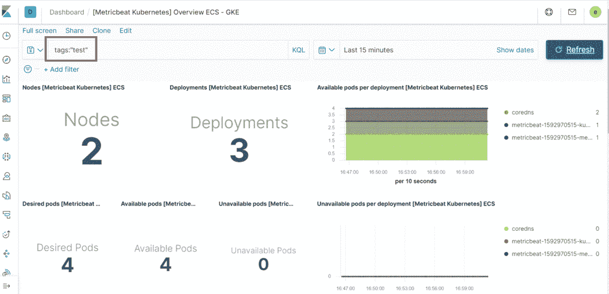
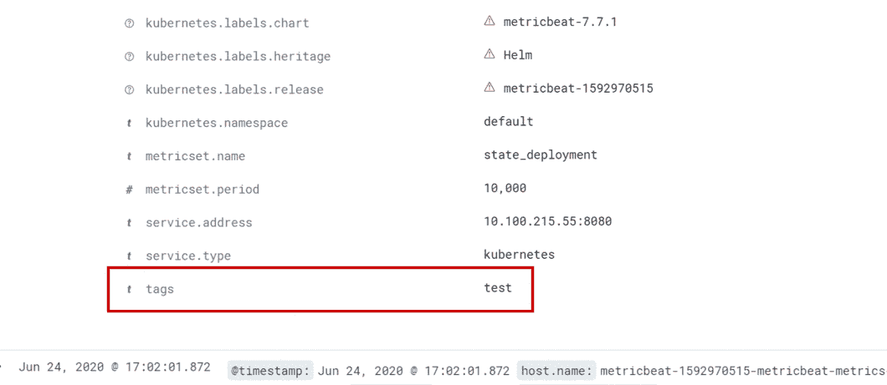

# 使用单个 Kibana 仪表板监控多个 Kubernetes 集群

> 原文：<https://itnext.io/monitoring-multiple-kubernetes-clusters-using-a-single-kibana-dashboard-17c6f7b9df67?source=collection_archive---------6----------------------->

当我们必须管理多个 Kubernetes 环境时，我们可以很容易地使用一个 Kibana 仪表板监控所有集群指标。假设我们有 2K8s 个环境，比如测试和生产，我们将两个环境的所有指标都发送到一个 Kibana 仪表板。会发生什么？

默认情况下，Kibana 不支持通过 Kubernetes 集群名称过滤指标。因此，它将在单个控制面板中显示两种环境数据，而不允许我们按环境进行筛选。这意味着，如果我们在每个 Kubernetes 环境中有 2 个节点，Kibana 显示的节点数是 4，如下所示。


那么，我们如何过滤每个环境的上述信息呢？您可以使用公制节拍标签来达到您的要求。

正如您在这里看到的，我们可以为每个环境使用一个标签，然后使用该标签过滤指标。当我们将一个标签添加到我们的 metric-beat 时，它会在导出到 elastic 之前将该标签添加到每个 metric。

你可以克隆[弹性 helm repo](https://github.com/elastic/helm-charts) 然后打开 helm-charts/metric beat/values . YAML 文件。在 daemonSet 和部署块下添加以下内容。你可以参考我提交给自己的 Github repo 的 sample values.yaml 来获得更多信息。

```
processors:
  - add_tags:
      tags: [test]
```

然后将 metric-beat helm repo 安装到您的 Kubernetes 集群。

注意:如果您已经在您的环境中配置了 metricbeat，请删除它并使用新的更改重新安装 metricbeat helm chart。

```
**helm repo add elastic** [**https://Helm.elastic.co**](https://Helm.elastic.co) **helm install  metricbeat elastic/metricbeat -f values.yaml**
```

现在您可以使用新引入的标记来过滤 Kibana dashboard，以过滤集群信息，如下所示。



如果您转到 Kibana → Discover 选项卡并单击某个指标，您将能够看到，metricbeat 已将该标签添加到它导出的每个指标中。



如果你需要更多关于如何配置 Kibana dashboard 的信息，你可以看看我之前的博客文章。

希望现在你有了在 Kibana dashboard 中过滤公制节拍数据的想法。干杯！！！