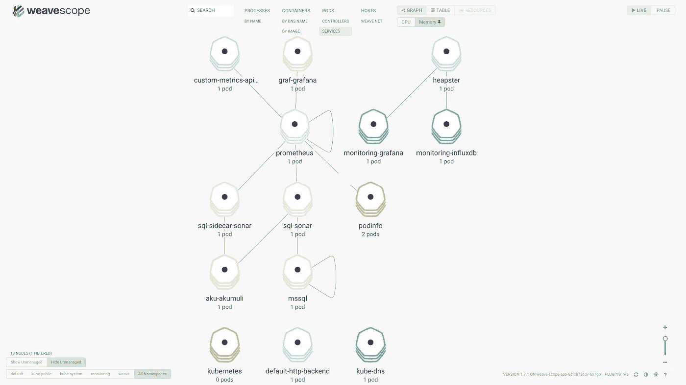

# Kubernetes 上的监控:自定义指标和自动缩放

> 原文：<https://itnext.io/monitoring-on-kubernetes-custom-metrics-c068165f82d3?source=collection_archive---------1----------------------->



[*点击这里在 LinkedIn* 上分享这篇文章](https://www.linkedin.com/cws/share?url=https%3A%2F%2Fitnext.io%2Fmonitoring-on-kubernetes-custom-metrics-c068165f82d3)

在之前的关于指标收集代理的文章之后，下一个合乎逻辑的步骤是写可以收集什么数据以及如何收集。一般来说，遥测有两类:度量快照和事件。度量快照会定期抓取，而事件可能随时发生。

随着 Prometheus 在 Kubernetes 上采用监控，度量收集和可靠性工程正获得更多关注。请记住，Prometheus 是基于拉的系统，非常适合集群监控和 Kubernetes。它支持联合，可用于复杂的多集群拓扑。pull(或 scrape)的替代方法是 push model，其中数据被发送到时序数据库。如产品文档[此处](https://prometheus.io/docs/practices/pushing/)所述，在 Prometheus 中使用推送模式存在缺点并会增加复杂性。

推和拉模式之间的竞争没有赢家，它们各有利弊。然而，重要的是要考虑更广泛的指标收集场景，而不仅仅是在 Kubernetes 上。此外，监视可能没有 Kubernetes 的混合环境需要在 DMZ 内部部署 Prometheus 来访问 scrape 目标。虽然一些企业可能愿意这样做，但其他企业更喜欢将指标推到安全边界之外，而不是时间序列数据库。

对于任何类型的度量，遥测数据收集的一个关键方面是时间分辨率。虽然使用 Prometheus 每隔 5-10 秒从目标收集指标对于某些类型的指标来说可能足够了，但对于其他类型的指标来说可能是不可接受的。给定指标的变化频率是抽样的重要因素。有些人可能对这个[定理](https://en.m.wikipedia.org/wiki/Nyquist–Shannon_sampling_theorem)很熟悉。虽然使用抓取来观察变化对于集群监控来说很好，但是对于描述应用程序性能的所有指标的深入分析来说，这可能还不够。因此，收集具有所需时间分辨率的不同类型指标的能力需要使用混合方法:推和拉。

这一挑战并不新鲜。2015 年，网飞推出了[矢量](https://medium.com/netflix-techblog/introducing-vector-netflixs-on-host-performance-monitoring-tool-c0d3058c3f6f)。Vector 的目的是让可靠性工程师能够分析在主机级别收集的一组指标。

当构建 Sonar monitoring agent 来统一指标收集(主要关注 Windows 容器)时，它支持将收集的指标暴露给 Prometheus scraping(pull)并将它们写入 Akumuli 时序数据库(push)。

在世界语中以“accumulate”命名的 Akumuli 是时间序列数据库，具有最低的资源消耗和摄取大量事件的能力。这使得它成为集群范围的应用程序或主机级指标的良好选择，这些指标需要实现时间解析，而使用定期擦除是不可能的。此外，Akumuli 很简单:它预先分配卷，只保留最新的可用指标，因此永远不会耗尽空间。Akumuli 中的度量结构与普罗米修斯相同:数值、时间戳和标签。

时间序列数据库应该简单快速。因此，实时分析(连续查询等。)是由声纳执行的。Sonar 定期执行的每个查询的结果都可以写入 Akumuli，暴露给 Prometheus 或发送到其他目的地。声纳连续查询的配置可以在运行时改变，而不会影响时间序列数据库。

这在时间序列数据库、指标收集代理和用于收集和分析所收集数据的实时处理作业之间提供了良好的分离。因此，声纳可以作为监测代理和分析引擎与阿库木里时间序列数据库。

将 Akumuli 和 Sonar 结合使用可提供以下功能:

*   收集需要高时间分辨率的指标，包括信号(IoT)、事件甚至不同级别的快照:应用程序、主机。
*   使用推或拉的资源消耗更低。Sonar 支持通过 TCP 或 UDP 向 Akumuli 发送度量。
*   在应用程序或主机级别以高时间分辨率分析指标，以实现早期异常检测和警报。
*   通过缩减采样和将结果暴露到集群级别来减少指标数量:需要时使用 Prometheus。
*   在收集和分析期间灵活配置标签和重新标签指标(缩减采样等。).

换句话说，使用 Akumuli 作为时间序列数据库，同时使用 Sonar 作为监控代理和处理引擎，可以简化指标收集、采样、重新标记以及将收集的时间序列暴露给其他目的地，包括 Prometheus。这开启了许多新的场景，包括 Kubernetes 的场景:

*   在需要低延迟来接收大量高频率事件的环境中，可以收集、合并和缩减采样物联网类型指标。制造业和机器人只是其中的一些例子。
*   在 Kubernetes 上扩展现代化的 Windows 应用程序。现在就可以做到这一点，通过在 Windows 容器上部署 Sonar 代理来公开带有或不带有下采样的自定义指标。因此，可以从性能计数器、WMI、SQL Server、MySQL 收集指标，并扩展到其他来源。
*   支持联合:使用处理引擎允许缩减采样度量，并将它们发送到时序数据库的另一个实例，或者暴露给 Prometheus。这是由您可以随时更改的配置决定的。因此，从一个阿库穆利实例到另一个实例的联盟现在是可能的。
*   易于备份和恢复时间序列数据。与普罗米修斯相比，阿库穆利使用很少的文件作为卷。
*   运行时更改成本低，可灵活选择公制标签，保留系列原始时间戳。与 Prometheus 类似，Sonar 支持为连续查询重新标记原始时间序列数据。
*   在应用程序/主机级别对原始时间序列使用异常检测来预测或确定问题的根本原因。并非所有这些指标都适合暴露给普罗米修斯。

考虑一个简单的例子:订单处理。每个授权付款的订单都需要创建运费。用于运输的后端服务必须按需扩展，以避免在没有大量订单的情况下消耗资源。关于待发货订单的信息存储在数据库中，可用于缩放此 pod。因此，目标是找到根据数据库中的订单数据来扩展 pod 的方法。以下是实现这一点的步骤:

# 先决条件

要在 Kubernetes 上从 Prometheus 向 HPA 公开定制指标，请遵循 GitHub 上的这个[存储库](https://github.com/stefanprodan/k8s-prom-hpa)中描述的说明。在部署 metrics server、自定义指标 API、Prometheus 并运行示例以进行扩展后，以下步骤显示了如何通过缩减采样向 HPA 公开订单处理自定义指标。

## 步骤 1:创建 MySQL 数据库和订单表

使用 Helm 在 Kubernetes 上提供 MySQL 可以使用以下命令完成:

```
helm install stable/mysql --name mysql01  --set mysqlRootPassword=Pass@word1
```

接下来，创建运输数据库和订单表:

```
mysql -u root -p
mysql> source create-tables.mysql 
```

脚本非常简单:

```
CREATE DATABASE IF NOT EXISTS `orders_shipping`;
USE `orders_shipping`;
DROP TABLE IF EXISTS `orders`;
CREATE TABLE orders (
 `id` MEDIUMINT NOT NULL AUTO_INCREMENT,
        `tid` VARCHAR(32) NOT NULL,
  `state` VARCHAR(32) NOT NULL,
 `createdAt` TIMESTAMP DEFAULT CURRENT_TIMESTAMP,
 PRIMARY KEY(`id`),
 UNIQUE KEY(`tid`)
) ENGINE=INNODB AUTO_INCREMENT=1 DEFAULT CHARSET=utf8;USE `orders_shipping`;
INSERT INTO orders(tid,state) VALUES('12345','Pending');
```

此时，可以通过简单的 insert SQL 语句模拟新订单，其中的数据稍后将用于 HPA:

```
INSERT INTO orders(tid,state) VALUES('12345','Pending');
Query OK, 1 row affected (0.05 sec)
```

## 步骤 2:将 Akumuli 时间序列数据库部署到 k8s

除了 Prometheus 之外，本例还将使用 Akumuli 时间序列数据库(参见先决条件)。克隆 GitHub 上的[图表](http://github.com/infragravity/charts)库。假设您创建了本地路径为*~/github . com/infra gravity/charts*的目录，可以使用以下命令部署 Akumuli:

```
helm install ~/github.com/infragravity/charts/stable/akumuli --name=aku --set image.repository=akumuli/akumuli,image.tag=skylake
```

Akumuli 存储卷的卷数及其大小可以在命令行或 values.yml 中设置，包括在此图表中。

## 步骤 3:为 k8s 配置和部署 Sonar 监控代理

首先，让我们选择查询以轮询特定时间间隔内处于待定状态的订单:

```
select count(*) as pending_orders_total from orders_shipping.orders where state='Pending' and timestampdiff(MINUTE,createdAt,NOW())>1;
```

使用该查询，Sonar 代理可以配置为使用 MySQL 输入适配器，如 **orders.config** 文件所示，该文件包含在此 Helm 图表中:

```
<?xml version="1.0"?>
<configuration>
  <configSections>
    <section name="Sonar" type="Infragravity.Sonar.SonarConfigurationSection, Sonar"/>
  </configSections>
  <connectionStrings>
    <add name="akumulidb" providerName="akumuli" connectionString="Data Source = tcp://aku-akumuli:8282;Initial Catalog=main;User Id =; Password =; Application Name = default;Max Pool Size=200;Packet Size=2048;Connection Timeout=100"/>
    <add name="mysqldb" providerName="mysql" connectionString="Server=mysql01-mysql;Database=orders_shipping; User Id=root; Password={$mysql_password};Encrypt=false;" />
  </connectionStrings>
  <Sonar>
    <Runtime scrapeIntervalSeconds="5" skipSSLCheck="true" threads="1"/>
    <InputAdapters>
        <add provider="mysql" type="Samples.Sonar.Adapters.MySql.MySqlAdapterFactory" path="Samples.Sonar.Adapters.MySql.dll" />
    </InputAdapters>
    <Schedules> 
        <add name="m01" query="orders_pending" input="mysqldb" intervalSeconds="10" output="akumulidb" />
    </Schedules>
    <Servers>
    </Servers>   
    <Queries>
        <add name="orders_pending" type="sql"
        filter="SELECT count(*) as total from orders_shipping.orders where state='Pending' and timestampdiff(MINUTE,createdAt,NOW())>1;">
                <Tags>                   
                    <add name="type" value="orders" readonly="true" />
                </Tags>
                <Instances>              
                </Instances>
                <Values>
                </Values>
        </add>                
    </Queries>
  </Sonar>
 </configuration>
```

接下来，使用 Helm chart 部署 Sonar 代理和定制的 MySQL 数据库适配器:

```
helm install ~/github.com/infragravity/charts/stable/sonar --name orders-agent --set image.repo=infragravity/sample-mysql,image.tag=latest,config.name=samples/custom-metrics/orders.config,config.log_level=Debug
```

最后，检查 pod 日志，验证它能够从数据库中查询数据，并将结果发送到 Akumuli 时间序列数据库。

## 步骤 4:为 k8s 配置和部署 Sonar 运行时

现在我们已经在 Akumuli 中收集了数据，下一步是部署连续查询，用于缩减采样并将数据公开给 Prometheus。之后，自定义指标 API 服务将能够访问自动缩放所需的订单指标。为此，使用连续查询配置文件 *orders-cq.config* :

```
<?xml version="1.0"?>
<configuration>
  <configSections>
    <section name="Sonar" type="Infragravity.Sonar.SonarConfigurationSection, Sonar"/>
  </configSections>
  <connectionStrings>
    <add name="input-akumuli-http" providerName="akumuli-http-receive" connectionString="Server=[http://aku-akumuli/api/query](http://aku-akumuli/api/query); Connect Timeout=5;" />
  </connectionStrings>
  <Sonar>
    <Runtime scrapeIntervalSeconds="5" skipSSLCheck="true" threads="1"/>
    <InputAdapters>
        <add provider="akumuli-http-receive" type="Infragravity.Sonar.Adapters.Akumuli.Http.InputAdapterFactory,Infragravity.Sonar.Adapters.Akumuli.Http" />
    </InputAdapters>
    <Schedules> 
        <add name="a01" query="aku-test" input="input-akumuli-http" intervalSeconds="20" />
    </Schedules>
    <Servers>
    </Servers>   
    <Queries>
        <add name="aku-test" type="raw" timestamp="ts"
        filter="{ 'group-aggregate':
                    {
                    'metric': 'orders-pending-total',
                    'step': '20s',
                    'func': ['mean','min','max']
                    },
                    'range': { 'from': 'timeshift(20s)','to': 'timeshift(0s)'},
                    'output': { 'format': 'csv','timestamp': 'raw'  },
                    'limit' : '100',
                    'order-by':'series',
                    'apply':[] }">
            <Tags>                   
               <add name="namespace" value="default" readonly="true" />
               <add name="deployment" value="podinfo" readonly="true" />
            </Tags>
            <Values>
            </Values>
            <Labels>
                <add name="source" regex="type=(.+)" targetLabel="metric" replacement="$2"/>
            </Labels>
        </add>
    </Queries>
  </Sonar>
 </configuration>
```

正如您所看到的，查询使用 Sonar 中的 *timeshift()* 函数从 Akumuli 获取缩减采样的度量值。为连续查询配置的值“ts”允许保存来自 Akumuli 时间序列数据库的时间戳。接下来，它将标签应用到结果时间序列，以便使用部署和名称空间标签将它们与 Kubernetes 中的工件关联起来。在本例中，收集的指标将与默认名称空间中名为“podinfo”的部署相关。在结果被标记后，度量被暴露给 Prometheus，它使用注释发现声纳目标端点。

接下来，部署 Sonar 来运行连续查询:

```
helm install ~/github.com/infragravity/charts/stable/sonar \
 --name orders-cq \
 --set image.repo=infragravity/sonar,image.tag=edge,config.name=samples/custom-metrics/orders-cq.config,config.log_level=Debug
```

部署后，验证自定义指标 API 可以在一分钟或更短时间内从 Prometheus 查询此指标:

```
kubectl get --raw "/apis/custom.metrics.k8s.io/v1beta1/namespaces/default/deployments.extensions/podinfo/akutest_orders_pending_total_mean" | jq .
```

结果应该与下面类似，只显示一个处于待定状态的订单:

```
{
  "kind": "MetricValueList",
  "apiVersion": "custom.metrics.k8s.io/v1beta1",
  "metadata": {
    "selfLink": "/apis/custom.metrics.k8s.io/v1beta1/namespaces/default/deployments.extensions/podinfo/akutest_orders_pending_total_mean"
  },
  "items": [
    {
      "describedObject": {
        "kind": "Deployment",
        "name": "podinfo",
        "apiVersion": "extensions/__internal"
      },
      "metricName": "akutest_orders_pending_total_mean",
      "timestamp": "2018-02-05T18:53:45Z",
      "value": "1"
    }
  ]
}
```

## 步骤 5:为 k8s 上的 HPA 创建自动扩展策略

到目前为止，指标已经公开，我们需要为 autoscaler 创建策略，部署名称为:

```
apiVersion: autoscaling/v2beta1
kind: HorizontalPodAutoscaler
metadata:
  name: orders-shipping
spec:
  scaleTargetRef:
    apiVersion: extensions/v1beta1
    kind: Deployment
    name: podinfo
  minReplicas: 1
  maxReplicas: 4
  metrics:
  - type: Object
    object:
      target:
        kind: Deployment
        name: podinfo
      metricName: akutest_orders_pending_total_mean
      targetValue: 4
```

如您所见，自定义指标可以在 Sonar 连续查询中使用元数据触发扩展部署。接下来，部署策略

```
kubectl create -f ./custom-metrics-hpa.yml
```

大约一分钟后，您将看到 HPA 识别指标:

```
>kubectl get hpa     
NAME              REFERENCE            TARGETS     MINPODS   MAXPODS   REPLICAS   AGE
orders-shipping   Deployment/podinfo   1 / 4       1         2         2          1m
```

## 步骤 5:模拟未决订单和规模

在这一点上，所有需要的是模拟订单，可以通过修改 MySQL 数据库中的订单表来完成。通过再添加 5 个订单，观察在之前步骤中创建的扩展策略的 HPA 状态:

```
kubectl describe hpa
Name:                                                         orders-shipping
Namespace:                                                    default
Labels:                                                       <none>
Annotations:                                                  <none>
CreationTimestamp:                                            Mon, 05 Feb 2018 11:47:27 -0800
Reference:                                                    Deployment/podinfo
Metrics:                                                      ( current / target )
  "akutest_orders_pending_total_mean" on Deployment/podinfo:  6 / 4
Min replicas:                                                 1
Max replicas:                                                 4
Conditions:
  Type            Status  Reason              Message
  ----            ------  ------              -------
  AbleToScale     True    SucceededRescale    the HPA controller was able to update the target scale to 3
  ScalingActive   True    ValidMetricFound    the HPA was able to succesfully calculate a replica count from Deployment metric akutest_orders_pending_total_mean
  ScalingLimited  False   DesiredWithinRange  the desired count is within the acceptable range
Events:
  Type    Reason             Age   From                       Message
  ----    ------             ----  ----                       -------
  Normal  SuccessfulRescale  23s   horizontal-pod-autoscaler  New size: 3; reason: Deployment metric akutest_orders_pending_total_mean above target
```

完成了。

```
kubectl describe hpa
Name:                                                         orders-shipping
Namespace:                                                    default
Labels:                                                       <none>
Annotations:                                                  <none>
CreationTimestamp:                                            Mon, 05 Feb 2018 11:47:27 -0800
Reference:                                                    Deployment/podinfo
Metrics:                                                      ( current / target )
  "akutest_orders_pending_total_mean" on Deployment/podinfo:  6 / 4
Min replicas:                                                 1
Max replicas:                                                 4
Conditions:
  Type            Status  Reason            Message
  ----            ------  ------            -------
  AbleToScale     True    ReadyForNewScale  the last scale time was sufficiently old as to warrant a new scale
  ScalingActive   True    ValidMetricFound  the HPA was able to succesfully calculate a replica count from Deployment metric akutest_orders_pending_total_mean
  ScalingLimited  True    TooManyReplicas   the desired replica count is more than the maximum replica count
Events:
  Type     Reason                        Age                 From                       Message
  ----     ------                        ----                ----                       -------
  Normal   SuccessfulRescale             11m                 horizontal-pod-autoscaler  New size: 3; reason: Deployment metric akutest_orders_pending_total_mean above target
  Normal   SuccessfulRescale             7m                  horizontal-pod-autoscaler  New size: 4; reason: Deployment metric akutest_orders_pending_total_mean above target
```

此时，可以减少订单记录的数量，以便缩小部署规模。

# 摘要

首先，这要归功于 Prometheus 为启用定制指标所做的出色工作，如先决条件中所述)。

通过使用一个 Sonar 部署从 MySQL 数据库收集数据，连续查询下采样并将数据暴露给 Prometheus，上面的示例甚至可以更加简洁。此外，不经常变化的指标不需要下采样，可以由声纳收集并暴露给 Prometheus。

虽然上面的示例使用了拉方法，但是当需要基于订单处理中的事件进行缩放时，您也可以使用推方法。这允许为需要事件和高时间分辨率的许多类型的应用级度量实现对称。我们将在以后的文章中讨论一个使用相同拓扑来演示推送的例子。