# 使用 Prometheus、Grafana 和 InfluxDB 监控安全协同程序和 WebFlux 反应式应用程序—网络摄像头示例

> 原文：<https://itnext.io/monitoring-secure-coroutines-and-webflux-reactive-applications-with-prometheus-grafana-and-b99dafb59a4b?source=collection_archive---------2----------------------->


在过去的几年里，我们已经看到人们对使用安全的应用程序越来越感兴趣，并让它们变得像 T2 一样反应迅速。为此，多年来开发了许多技术，今天最流行的似乎是**Spring*web flux*****和***kot Lin*Coroutines**。正如我将在本文中展示的，这两种技术互为补充，可以在同一个 **JVM 生态系统**中生存。正如你可能已经注意到的，关于哪一个提供最佳性能的讨论已经有很多次了，但是本质上它们都假定了相同的原则，那就是尽可能地避免任何阻碍**的东西。** **WebFlux** 利用**观察器模式**使用 **Flux** 和 **Mono** 来交付**集合**和**单个对象**和**协程**使用**流**和**暂停** **函数**来分别交付完全相同的内容。**

**在这篇文章中，我们将研究密切监视应用程序行为的许多方法之一，并使用 **Prometheus** 作为数据收集器，使用 **InfluxDB** 作为持久性机制，使用 **Grafana** 来可视化我们的数据。本文的[项目](https://github.com/jesperancinha/moving-objects-service-root)位于 [**GitHub**](https://github.com/jesperancinha/moving-objects-service-root) 上。**

**当开发一个应用程序时，假设我们可以直接进入生产环境，因为单元测试( **TDD** — **测试驱动开发**)和集成测试没有检测到任何问题仍然是非常危险的。即使一个有经验的测试人员已经尽了最大努力来测试应用程序，并且已经做了所有必要的业务逻辑检查，我们仍然依赖于人的因素，我们仍然没有考虑系统或网络问题。 **BDD** ( **行为驱动开发**)作为一种防止生产中错误的手段，多次出现在等式中。鉴于 **BDD** 检查运行环境的行为，总是有额外的可靠性元素。用于实现这一点的典型已知框架是黄瓜。**

**在一个案例场景中，仅考虑数字，这给了企业一种我们投入生产有多安全的感觉，就是我们有大约 90%的代码覆盖率，我们覆盖了 IDE(集成开发环境)没有检测到的逻辑，BDD 测试很好，我们有一个高超和超专业的 **DDD** ( **域驱动设计**)专家，他向我们保证所有的架构和边界都符合 **PO** ( **产品所有者的所有期望我们也很自豪有这样一个团队，每个人都熟记所有的软件设计模式**，并在他们的日常开发中使用和思考它们。此外，每个人都知道如何实现和使用**固体** ( **单责任、开-闭、利斯科夫-替换、接口隔离、依赖注入)和酸(原子性、一致性、隔离性、持久性**)原则。**

**一切似乎都很好，我们进入生产，然后我们意识到应用程序并没有真正做它应该做的事情。此外，它似乎显示了各种意想不到的行为。在这些场景中，问题很可能是我们对 **CPU** 、 **GPU** 、内存使用、 **GC(垃圾收集)**、**安全性**没有任何顾虑，这样的例子不胜枚举。我们没有检查应用程序的停机时间，没有检查应用程序的弹性、可用性和健壮性。我们也不知道在并发、多用户以及实际需要多少数据流入和流出我们的应用程序的情况下该怎么办。**

****监控**可以为预防这些情况提供很多帮助。**

# **1.技术要求**

**对于本文来说，如果您对 Spring 和 Spring Boot 有一些经验和了解，将会很有帮助，尽管这不是必需的。我们将检查实现的完整细节，所以如果你不知道一些基础知识，那么不要担心，因为我会尽力保持简单。真正重要的是在您的计算机上安装以下软件:**

*   **Java 17 (任何 java **17** 发行版都可以。我最好的建议是用 [SDK Man](https://sdkman.io/usage) 来实现这个，用 **17 开。****
*   ****最新** [**最新**](https://gradle.org/install/) (至少 7.5 版本才能兼容 Java 17)**
*   **一个好的**IDE**([**IntelliJ**](https://www.jetbrains.com/idea/download/)**或** [**月食**](https://www.eclipse.org/) 为例)**
*   **[**Docker 桌面**](https://www.docker.com/products/docker-desktop) ，但前提是你用的是面向办公的机器，用的是类似 **MAC-OS** 或者 **Windows** 这样的系统。我最好的建议是，如果可能的话，就用一台 12 核的 Linux 机器。**

# **2.文章目标**

**谈到监控，我们通常会做一些假设。这很简单，不需要太多的时间来设置，我们只是想检查系统是否正常。此外，还有一个普遍的假设，那就是我们不应该把它弄得太复杂。的确，在某种程度上，这些都是有道理的。另一方面，如果我们考虑在我们的环境中实现监控实际需要做些什么，那么我们很快就会意识到，要实现监控，有相当多的活动部件。让我们从更高的层面来思考我们需要什么:**

1.  **我们需要度量标准**
2.  **我们希望在我们的系统中有这些指标**
3.  **我们需要获取指标**
4.  **我们需要存储指标**
5.  **我们需要将这些指标可视化**
6.  **我们需要一个警报系统**
7.  **我们的系统不应该在性能方面受到任何损害**

**看一下第 1 点，大多数情况下，我们**确定我们需要指标** s。现在我们需要努力思考 ***“我们需要哪些指标】*** ？我们需要监控**垃圾收集**吗？我们需要**监控资源**吗？我们需要监控**内存使用情况**吗？也许我们需要所有这些指标，或者也许我们已经直接知道我们想要监控什么。事先知道我们想要什么是好的。对于第 2 点和第 3 点，我们需要确保我们已经考虑了使用推或拉机制的**。在本文中，我们将看看**拉动机制**。我们将在普罗米修斯和 InfluxDB 中看到这一点。拉机制的最大优点是，一旦我们的应用程序开始运行，我们就可以通过在特定的可配置时间点**废弃**数据，随时控制我们想要接收的内容。推送机制意味着应用程序不断地通过网络发送指标，即使我们想要缩减我们的指标获取机制。在其他订单中，监控总是会对**应用程序性能**产生一个小的**凹痕**，但是如果我们使用拉动机制，我们可以缩小这个凹痕。重要的是使性能的下降完全可以忽略不计。接下来，在第 4 点，我们需要存储我们的数据。**抓取** **机制**，多次与**短命存储引擎**一起到来。这些引擎之所以如此命名，是因为它们可以通过重新启动来重置，它们只保存在内存中，它们有一个滚动日志，或者仅仅是因为它们没有很好地设计来保存数据。这就是普罗米修斯的故事。虽然它确实有持久化数据的规定，但它仍然是非常基础的，并且在他们自己的话[](https://prometheus.io/docs/prometheus/latest/storage/)****:**中有一些限制******

****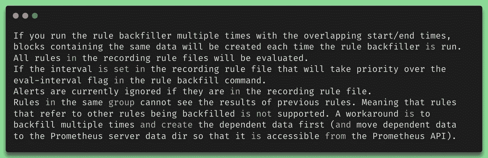****

****普罗米修斯语录****

****出于这些原因，我们需要系统中的另一个元素来确保我们的数据的**寿命** **是由我们而不是系统决定的。在我们的例子中，我们将通过 **InfluxDB** 来实现这一点。一旦我们的数据被存储，我们现在需要一个干净简单的方法来可视化数据。这是第五点。在许多系统中，可视化软件还允许我们配置第 6 点的需求。警报系统通常与我们正在使用的可视化界面密切相关。这就是我们将看到 Grafana** 行动的地方。就第 7 点而言，这本身就是一种谬误。性能总会有很小的下降**,正如我们上面讨论的那样，这应该是可以忽略的。我们也可以说，如果这种减少是不可察觉的，那是因为它不存在。这是一个公平的观点，完全有道理，但思考这个问题很重要。错误配置的监控解决方案会导致**延迟问题**和**使应用程序无响应**或者甚至导致**系统关闭**。******

# ****3.领域****

****我们的服务是真实系统的模拟。理想情况下，我们会监视博物馆里的物品。我们可以监控经过河流的船只的位置，检查机场的天气，音乐会上人们的富裕程度，等等。如果我们有一台相机，我们可以想象成千上万的情况下，我们可以用它们做什么。在这个[项目](https://github.com/jesperancinha/moving-objects-service-root)中，我们会让它变得非常简单。我们将在木地板上监视蔬菜！这样，除了我们项目的目标之外，其他什么都不重要。****

********

****半路上的一个南瓜****

****一个服务将提供两个资源端点。一个端点将为您提供某个相机在给定时间拍摄的图像。另一个端点提供我们正在拍摄的对象的信息。对于我们的应用程序，我们对分离这些信息不感兴趣。相反，我们希望以聚合的方式访问这些信息。我们也不希望前端做所有的硬聚合工作。这个处理应该留给一个新的服务来完成，这个新的服务将包装这个“原始数据”服务并提供所需的聚合信息。一旦我们有了这项服务，我们希望能够用前端应用程序来可视化我们的数据。****

****所以现在我们知道我们至少需要三种服务。一个用于原始数据，一个用于聚合数据，另一个用于向用户提供 GUI(图形用户界面)。因此，我们还需要能够监控这些服务。这意味着我们将需要至少三个不同的度量提供者作为这三个服务的助手。****

****我们为 3 家指标提供商提供 3 项服务，因此我们需要一台刮刀来可视化这些数据。一旦我们有了 scrapper，我们还希望能够可视化这些数据，我们还希望能够存储这些数据。所以这意味着我们将需要另外 3 个服务。一个 scrapper、一个 visualizer 和一个持久性服务。下面是这种工作方式的粗略示意图:****

****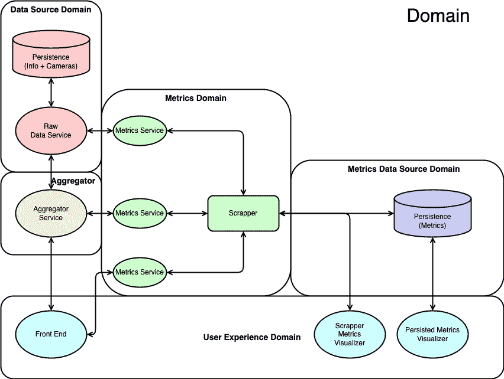****

****[移动物体项目](https://github.com/jesperancinha/moving-objects-service-root)的 DDD 设计****

# ****4.履行****

****L et 开始制作我们的[应用](https://gitlab.com/jesperancinha/moving-objects-service-root)！我们要看的案例是一个监视物体运动的系统。****

> ****在本文的**上一个** **版本**中，摄像机由**[**RapidAPI**](https://rapidapi.com/)的两个**其余**接口提供。一个提供了机场列表，另一个提供了机场周围的公共摄像头。这些是 [**机场搜索器**](https://rapidapi.com/cometari/api/airportsfinder) **API** 和 [**网络摄像头旅游**](https://rapidapi.com/webcams.travel/api/webcams-travel) **API** 。然而，由于这些应用程序是外部的，我无法控制它们。我也无法控制模型中的任何变化，或者应用程序是否会因为这样或那样的原因变成私有的、订阅的、试用的或任何其他形式的非公开访问。在某个时间点，这篇文章的[**原示例**](https://gitlab.com/jesperancinha/moving-objects-service-root/-/tree/rapid-api-eol) 实际上变成了**不可用、** **不可编译**，当然**也不可能制作演示**了。******

******这意味着，现在，我们有了一个**在**位置网格**上监视移动物体**的例子，而不是监视机场周围的**位置。我简单地给这些**蔬菜**拍了几张照片，来创造一个**运动的想法**。********

****为了让事情变得更有趣，我创建了两个 rest 应用程序:****

*   ****`**moving-objects-jwt-service**` —安全应用，**支持 JWT** ，提供两个独立的端点。一个传送物体/蔬菜**信息**，另一个传送二维网格中的**摄像机位置**。该应用程序在端口 **8081** 打开。这个应用已经用[](https://spring.io/projects/spring-boot)**和 **Kotlin Webflow 协同程序**实现了。它使用一个**r2dbc**连接来对抗端口 **5432** 上的 **PostgreSQL** 数据库。******
*   ******`**moving-objects-rest-service**` —这个服务于**前端**应用，面向用户。我们可以选择用 **OAuth2** **Okta** 认证能力来启动它。它将进行身份验证，以便与 JWT 服务进行通信。它在端口 **8082** 上运行。这个应用已经用 [Spring Boot](https://spring.io/projects/spring-boot) 和 [WebFlux](https://docs.spring.io/spring-framework/docs/5.0.0.BUILD-SNAPSHOT/spring-framework-reference/html/web-reactive.html) 实现了。******

******我还创建了一个**图形用户界面**。在这种情况下，我使用[](https://angular.io/)**和**【UX】**(**用户** **经验**)设计实现我使用 [**有角度的材料**](https://material.angular.io/) 。********

******创建这两个 rest 服务的原因是因为我发现这是一种很好的展示监控活动的方式。我们让一个服务依赖于另一个，边缘服务的目标是聚合两个信息源。因此，我们可以分析更多不同的数据行为案例。出于同样的原因，我也实现了 [**OAUTH2**](https://oauth.net/2/) 。换句话说，我希望一个服务有不同于另一个服务的行为。我们将在本文的结尾看到这一点。******

# ******5.应用程序设置******

******在这一节中，我们将了解应用概述、所有内容的设置以及容器化的环境。******

******让我们从应用概述开始。******

******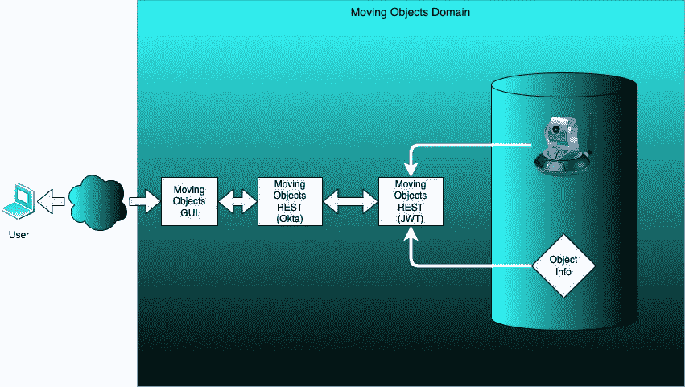******

******系统概述草图******

******在这个简化的概述中，我们可以看到，在我们获得任何数据之前，我们要经历 3 个服务。我们有一个 **angular 服务**运行在 **NGINX** 上，提供前端，一个 rest 服务器提供 **okta 认证**以提供对**聚合**数据的访问，最后，一个服务使用 **JWT** 提供**原始数据**以安全地访问它。******

******让我们仔细看看容器化的环境是什么样的。在我们之前的需求列举中，我们看到我们至少需要 4 样东西。我们需要三个应用程序环境、一个数据资源、一个永久的持久化机制和一个用于监控数据的可视化环境。在我们的案例中，这些是:******

*   ******[**JRE 17**](https://www.oracle.com/java/technologies/downloads/)**—**我们将在两个服务中使用这个运行时。正如我们之前看到的，一个在数据源域中运行，另一个在聚合器域中运行。在每个环境中，我们不仅要运行应用程序，还要运行指标服务，作为 spring-boot 应用程序的辅助工具。Spring boot 可以打包像 Prometheus 提供的外部库，并在它的执行器端点中使用它们。******
*   ******[**NGINX**](https://www.nginx.com/)**—**有了 NGINX，我们可以将我们的前端部署为一个静态可交付产品。它在 UX 领域运行。******
*   ******[**节点**](https://nodejs.org/en/)**——**节点 JS 使我们能够运行 Prometheus 服务，为 Prometheus scrapper 提供指标。它在度量领域中运行。运行时不必与运行它的机器共享同一个域。有了 Node，我们可以启动一个服务，不一定要获得 NGINX 的指标，而是它运行的机器。******
*   ******[**普罗米修斯**](https://prometheus.io/)**——**这就是格斗家。在这种情况下，scrapper 只是一个以固定时间间隔运行的进程，一个从目标机器检索重要指标的报废进程。它在度量领域中运行。******
*   ******[**influx db**](https://docs.influxdata.com/)**——**这是我们的坚持机制。InfluxDB 也有能力配置废料。它们的运行方式和普罗米修斯一样，但是我们可以存储数据。它包括自己的指标可视化应用程序。它既在度量领域也在 UX 领域运行******
*   ******[](https://grafana.com/)****——**这是我们的可视化工具。我们可以可视化所有被普罗米修斯抛弃的需要的度量。它运行，当然在 UX 领域。********

******我们可以让所有东西分别在我们的本地机器上运行，但是我们也可以通过使用 [**Docker**](https://hub.docker.com/) 映像和[**Docker****compose**](https://docs.docker.com/compose/)来加快开发过程。除了速度之外，另一大优势是我们可以在单个 **docker 机器**中用一个命令运行整个环境。******

******让我们来看看我们系统的更详细版本:******

******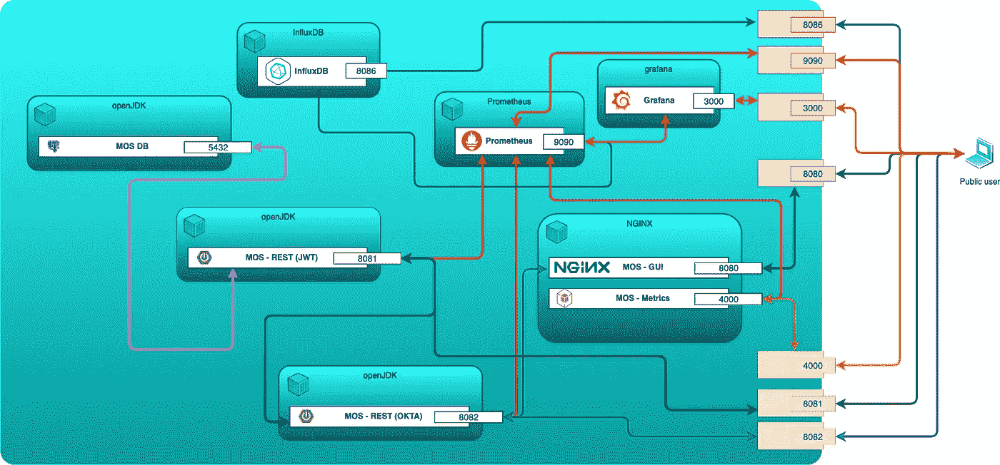******

********使用 Docker 进行本地主机配置********

******如图所示，我们所有的移动部件都装在**本地主机**上的一台机器中。使用 **Docker** 时无需额外配置。从图中可以注意到，应该属于公共域的端口只有 **3000、9090、**和 **8080** 。在本地环境中，我们将公开所有端口。在本文的后面，我们将看到这个[项目](https://github.com/jesperancinha/moving-objects-service-root)的安全版本是如何工作的。为此，我们还需要端口 **8082** 。所有其他端口都在 **docker** 域**内**。每个容器通过我们给它们起的名字来识别彼此。我们将在文章的后面看到如何将这个系统翻译成 docker-compose。******

# ******6.数据模型******

******我们的数据模型非常简单。我们只有两张桌子。一个包含对象信息，另一个包含移动对象信息:******

```
******create schema if not exists mos;

drop table if exists mos.moving_object;
drop table if exists mos.info_object;

create table if not exists mos.moving_object(
    id UUID,
    code VARCHAR ( 50 ) NOT NULL,
    folder VARCHAR ( 255 ) UNIQUE NOT NULL,
    uri VARCHAR(255 ) UNIQUE NOT NULL,
    x INT,
    y INT,
    PRIMARY KEY (id)
);

create table if not exists mos.info_object(
    id UUID,
    "name" VARCHAR(50) UNIQUE NOT NULL,
    "size" INT,
    color VARCHAR ( 255 ) NOT NULL,
    code VARCHAR ( 50 ) NOT NULL,
    x INT,
    y INT,
    PRIMARY KEY (id)
);******
```

******两个**表**共享一个代码。这些代码将数据统一在一起。然而，这个数据 t 不是一起提供给前端的。相反，我们单独提供这些数据。表`**moving_object**` **，**可以解释为位置，在此处具有某个`**code**` 的对象正在被拍摄。`**uri**`是提供正在拍摄的最新**快照**的相机的`**location**`。参数`**folder**` 是保存图像的实际位置。这个最新的**快照**将通过一个流端点传送到客户端。显然，`**x**`和`**y**`是物体的坐标。表格`**info_object**`仅仅包含了被拍摄物体的额外信息。对于这个[项目](https://github.com/jesperancinha/moving-objects-service-root)的一个对象，有关于其**名称**、**大小**、**颜色、**和**位置**的特殊信息。该位置在这里也用坐标 **x** 和 **y** 表示。这样做的原因是为了区分相机的位置和物体的位置。话虽如此，我们也可以说我们拍摄的物体的坐标并不那么重要。******

******[项目的开始](https://github.com/jesperancinha/moving-objects-service-root)将在数据库中加载以下数据:******

```
******truncate mos.mos.moving_object;

insert into mos.mos.moving_object (id,  code, folder, uri,x,y)
values (gen_random_uuid(), 'GAR', 'garlic', '/aggregator/webcams/camera/GAR',1,2);
insert into mos.mos.moving_object (id,  code, folder, uri,x,y)
values (gen_random_uuid(), 'LAU', 'laurel', '/aggregator/webcams/camera/LAU',2,2);
insert into mos.mos.moving_object (id,  code, folder, uri,x,y)
values (gen_random_uuid(), 'LEM', 'lemon', '/aggregator/webcams/camera/LEM',3,4);
insert into mos.mos.moving_object (id,  code, folder, uri,x,y)
values (gen_random_uuid(), 'ONI', 'onion', '/aggregator/webcams/camera/ONI',7,2);
insert into mos.mos.moving_object (id,  code, folder, uri,x,y)
values (gen_random_uuid(), 'PUM', 'pumpkin', '/aggregator/webcams/camera/PUM',8,1);
insert into mos.mos.moving_object (id,  code, folder, uri,x,y)
values (gen_random_uuid(), 'RED', 'red-onion', '/aggregator/webcams/camera/RED',3,6);
insert into mos.mos.moving_object (id,  code, folder, uri,x,y)
values (gen_random_uuid(), 'SNA', 'snail', '/aggregator/webcams/camera/SNA',1,7);
insert into mos.mos.moving_object (id,  code, folder, uri,x,y)
values (gen_random_uuid(), 'TOM', 'tomato', '/aggregator/webcams/camera/TOM',0,1);

insert into mos.mos.info_object(id, "name", size, color, code,x,y)
values (gen_random_uuid(), 'Garlic', 2, 'white', 'GAR', 1, 2);
insert into mos.mos.info_object(id, "name", size, color, code,x,y)
values (gen_random_uuid(), 'Laurel', 4, 'green', 'LAU', 2, 2);
insert into mos.mos.info_object(id, "name", size, color, code,x,y)
values (gen_random_uuid(), 'Lemon', 2, 'lemon', 'LEM', 3, 4);
insert into mos.mos.info_object(id, "name", size, color, code,x,y)
values (gen_random_uuid(), 'Onion', 4, 'gold', 'ONI', 7, 2);
insert into mos.mos.info_object(id, "name", size, color, code,x,y)
values (gen_random_uuid(), 'Pumpkin', 10, 'orange', 'PUM', 8, 1);
insert into mos.mos.info_object(id, "name", size, color, code,x,y)
values (gen_random_uuid(), 'Red Onion', 5, 'purple', 'RED', 3, 6);
insert into mos.mos.info_object(id, "name", size, color, code,x,y)
values (gen_random_uuid(), 'Snail', 1, 'brown', 'SNA', 1, 7);
insert into mos.mos.info_object(id, "name", size, color, code,x,y)
values (gen_random_uuid(), 'Tomato', 2, 'red','TOM', 0, 1);******
```

# ******7.密码******

******如果你已经在 [GitHub](https://github.com/jesperancinha/moving-objects-service-root) 上瞥过 [**代码**](https://gitlab.com/jesperancinha/moving-objects-service-root) ，你可能已经看到每个模块的代码库相当小，但是所有代码的连接可能有点复杂难以理解。这一部分在这里，以便我们可以一起看到代码是如何构建的，以及我们想要实现什么。也许最好的办法是，首先看看`**moving-objects-jwt-service**` 中的数据域:******

******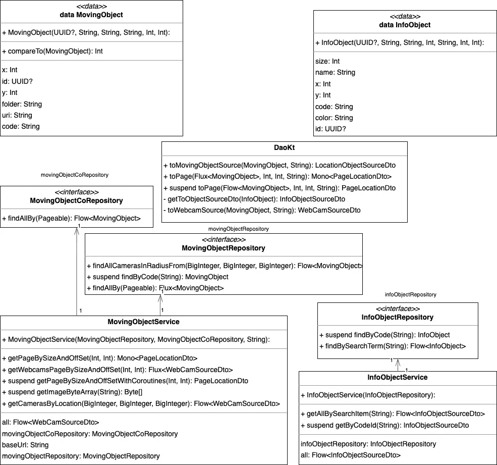******

********Dao UML for********

******在这个 **UML** 图中并没有太多的特别之处。本质上我们只有两种不同的类型，我们称它们为**移动对象**和**信息对象**。摄像机在一个 **x** ， **y** 网格中以与物体相同的方式获得一个位置。我们认为**移动物体**就是**摄像机**正在拍摄的。我们可以也将会互换使用这些术语来指代同一事物。 **InfoObject** 只是关于对象的一些信息。在这种情况下，它只是对象的大小、颜色和最新位置。在这个[项目](https://github.com/jesperancinha/moving-objects-service-root)中，最新位置从不改变。虽然 **JWT** 服务大部分是使用协程数据**流**实现的，但是我想在同一个[项目](https://github.com/jesperancinha/moving-objects-service-root)中使用 **WebFlux** 来展示两者可以以同样的方式协同工作。尽管它们的反应式实现不同，但它们可以协同工作，我们可以利用它们提供的不同特性。在我的例子中，我真的想利用***collectsorted list***函数从一个类型为 ***MovingObject*** 的对象列表中创建一个反应性的 ***Mono*** 。许多人喜欢使用***JpaSpecificationExecutor***来一口气获得一整页。不幸的是，如果我们这样做，那么我们得到的是一个非反应性的页面。这可能最终并不重要，因为实际上一个**页面**只是返回给客户端的一条记录。然而，我希望这个应用程序服务无论如何都是完全反应式的。因此，我没有返回一个**页面，而是返回了一个 **Mono <页面>** ，它使得应用程序的使用可能是完全反应式的。********

****既然我们已经看了模型，现在让我们看看控制器部分:****

****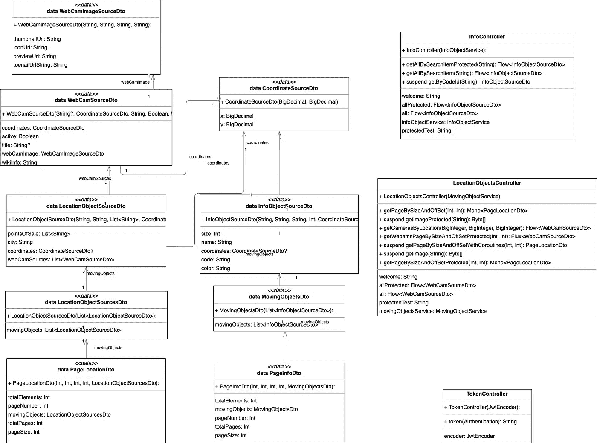****

******REST UML for** `**moving-objects-jwt-service**`****

****我们以非常特殊的方式将数据转换成 dto，但从未将物体信息与相机联系起来。在我们的例子中，我们将一个位置与包含在其特定半径内的所有摄像机相关联。这将为我们提供特定搜索的所有相机的完整列表，但不是与它们的大小和颜色相关的对象信息。这是针对一个端点。对于另一个端点，我们可以获得对象的信息。有了这个，我们就能知道物体的位置、颜色和大小。这个 rest 服务不提供相机和对象信息的聚合。****

****这项服务也需要通过安全访问。对于这个[项目](https://github.com/jesperancinha/moving-objects-service-root)，我们让它变得非常简单，当我们运行它时，我们会得到一个警告，我们正在使用一个在`application.properties`中明文配置的用户/密码组合。通常，安全服务提供安全的方式要复杂得多。让我们快速看一下代码:****

```
****@Bean
fun securityFilterChain(http: ServerHttpSecurity): SecurityWebFilterChain =
    http
        .logout { logout ->
            logout
                .requiresLogout(ServerWebExchangeMatchers.pathMatchers(HttpMethod.GET, "/logoff"))
        }
        .authorizeExchange { authorize ->
            authorize
                .pathMatchers("/webjars/**")
                .permitAll()
                .pathMatchers("/info/jwt/open/**")
                .permitAll()
                .pathMatchers("/webcams/jwt/open/**")
                .permitAll()
                .pathMatchers("/v3/**")
                .permitAll()
                .pathMatchers("/actuator/**")
                .permitAll()
                .anyExchange()
                .authenticated()
        }
        .csrf().disable()
        .httpBasic(Customizer.withDefaults())
        .oauth2ResourceServer { oAuth2ResourceServerSpec -> oAuth2ResourceServerSpec.jwt() }
        .build()****
```

****我们在这里所做的是首先允许所有匹配模式公开。这些模式涉及应用程序的 3 个重要方面:Swagger、Actuator 和测试端点。 **Swagger** 允许我们通过一个 GUI 与应用程序交互，这个 GUI 允许我们执行请求，而不需要使用`**curl**`或任何其他命令行指令，如`**wget**`。**致动器**端点对我们的[项目](https://github.com/jesperancinha/moving-objects-service-root)至关重要，因为它提供了包括普罗米修斯理解和使用的指标在内的指标。 **CSRF** 在我们的应用中必须禁用。Spring 文档非常清楚为什么大多数情况下都是这样:****

> ****[如果您仅创建非浏览器客户端使用的服务，您可能需要禁用 CSRF 防护。](https://docs.spring.io/spring-security/site/docs/5.0.x/reference/html/csrf.html)****

****我们的令牌的身份验证将通过一个特定的端点来请求，我们将在后面看到。现在，我只是想让你明白，通过我们的配置，我们可以使用**用户名/密码**组合或 **JWT** 令牌来访问我们的任何端点。然而， **JWT** 令牌将仅通过令牌端点给出。不过，我们用***OAuthResourceServerSpec***来保护我们的应用程序。这允许我们配置几种类型的安全设置，但是为了本文的目的，我们只创建标准的 **JWT** 支持。****

****反应式编程还意味着反应式安全性，因为安全性是与我们对服务的任何请求固有地绑定在一起的。其原理与非反应式应用完全相同。我们首先配置我们的***AuthenticationManager***:****

****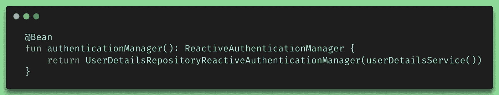****

****被动身份验证管理器****

****然后，我们需要为 JWT 令牌本身以及我们用来获取应用程序的初始 JWT 请求的密码配置编码器和解码器:****

****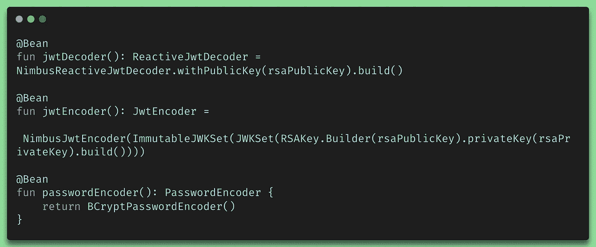****

******JWT 休息服务的编解码器******

****一旦我们有了代码，我们现在就可以配置我们的用户详细信息服务:****

****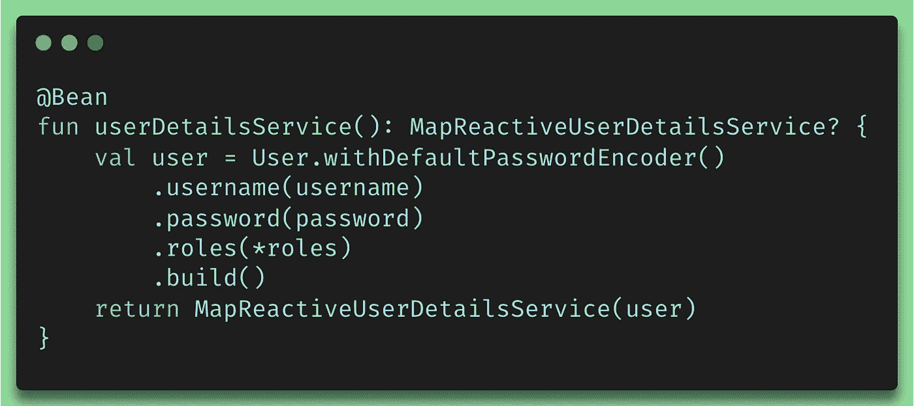****

******用户详细信息服务******

****我们已经可以看到，这个 UserDetailsService 与它的 **Servlet** 对应物有所不同(我们也用街头语言 MVC 做了这些)。不同之处在于，这种服务是以一种被动的方式实现的。我们在这里使用 Netty 而不是 Tomcat 作为嵌入式服务。这意味着 **Netty** 以一种被动的方式工作，这意味着我们可以以一种被动的方式实现对服务的调用。这反过来又提高了我们机器的能力，因为它将能够同时处理更多的请求，即使涉及到安全性。在我们的例子中，我们的服务由用户名/密码保护。提醒自己此时可以更好地实现安全性总是好的。我们非常不安全的 **admin/admin** 组合足以满足这个练习的目的。****

****现在让我们来看看我们将面向前端的**服务**。在这个服务的全功能版本中，我们将使用 **Okta** 来执行 **OAuth** 认证。对于端到端测试， **Okta** 将被禁用，但是我们将检查整个应用程序。我们的应用程序叫做`**moving-objects-rest-service**` 。与前一个应用程序的第一次接触显然是从数据层开始的:****

****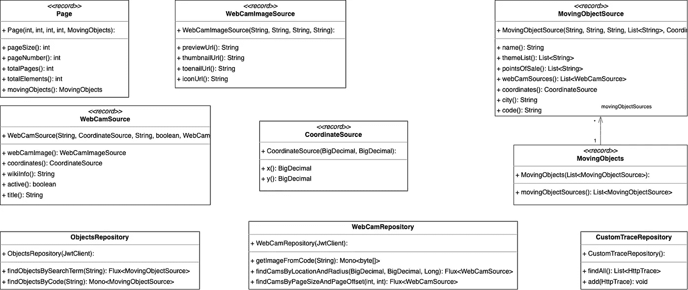****

****[**道层的秋田项目**](https://github.com/jesperancinha/moving-objects-service-root)****

****仔细观察这些类型，我们可以看到它们与在 [**JWT** **项目**中创建的 Dto 有多么直接的关系。](https://github.com/jesperancinha/moving-objects-service-root)****

****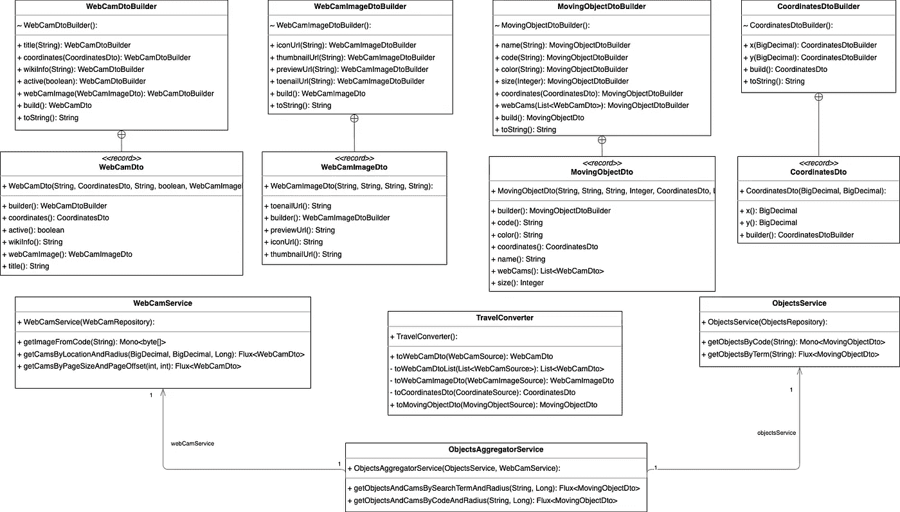****

****[**秋田项目服务层**](https://github.com/jesperancinha/moving-objects-service-root)****

****在上面的服务层中，我们看到每个端点都有专用的服务，在它旁边，我们使用了一个***objectaggregaterservice***。该服务将创建我们感兴趣的有效负载。聚合遵循了一些与**反应式编程**相关的有趣实现。让我们来看看几种方法:****

****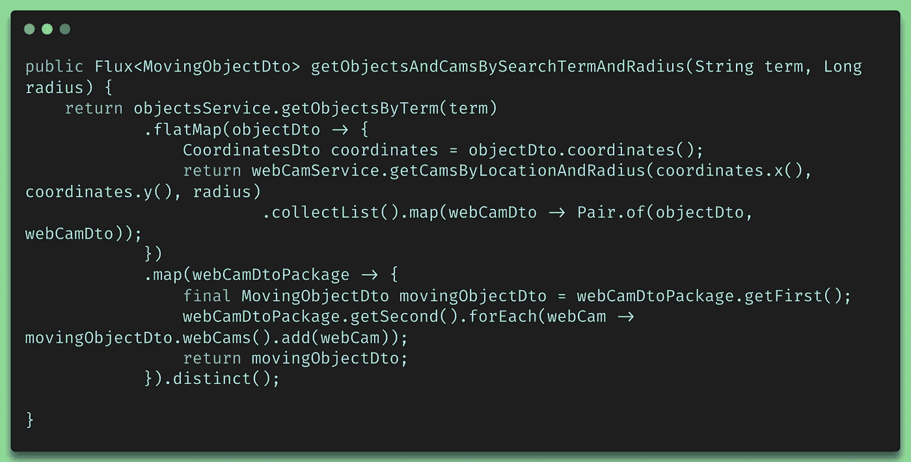****

******创建移动对象到******

****在本例中，我们使用的是纯粹的 **Spring** **WebFlux** 。我们首先通过搜索词来搜索对象信息。第二步，我们通过半径搜索与之相关的位置。因此，换句话说，我们将检索我们通过**搜索词**搜索的**对象**的特定半径内包含的所有摄像机。我们必须永远不要忘记，当使用**协程** **流**或 **WebFlux** 时，我们不是在进行命令式编程，也不是在进行 **OOP** (面向对象编程)。我们正在使用**功能编程**，实现**可观察模式、**并使用**反应原则**。这意味着代码不会立即执行，而是在 **Netty** 空闲时执行。在这一点上，提醒我们自己，通过在我们的依赖项中只使用 Spring WebFlux 库，我们在默认情况下不再使用 Tomcat，这可能是很好的。我们在这一点上使用 Netty。我想在这里发表声明的原因是，我们经常看到人们将 Tomcat 与 Spring Boot 互换使用。然而，SpringBoot 不一定是由 **Tomcat** 运行的。可以用**逆流**和**突堤**运行，在**无功服务的情况下，**可以用 **Netty** 运行。在高级类型的服务实现中进行这种区分是很重要的。****

****我们现在可以快速看一下控制器层的样子:****

****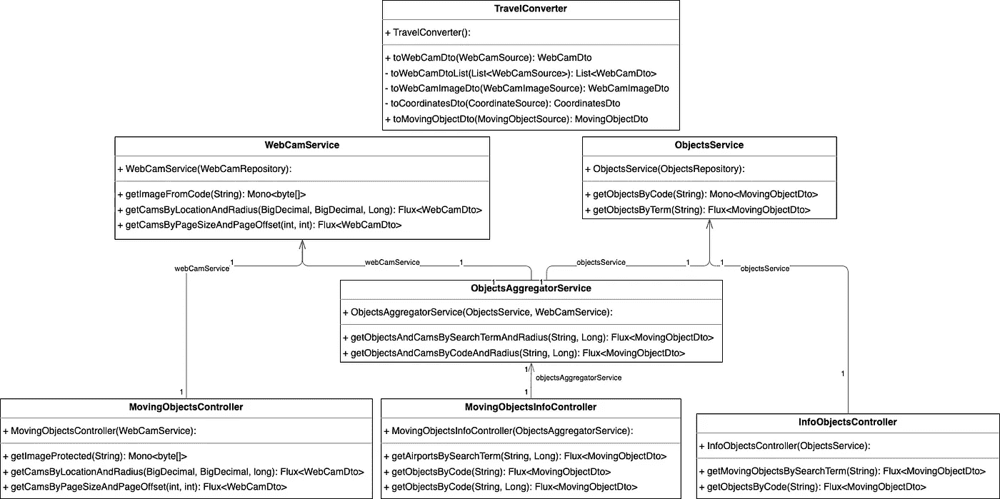****

******Okta 服务的控制器层******

****这一层允许我们使用具有以下形式的有效载荷:****

****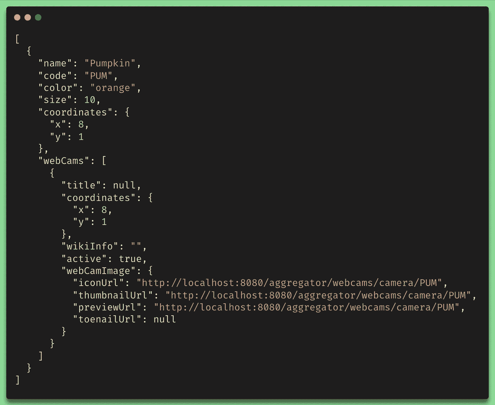****

******为前端应用服务的有效载荷示例******

****正如我们所看到的，我们提供了对象的细节，也提供了相机的细节。因此，我们以一种反应式的方式将两个端点聚合成一个，由 **Netty** 管理。****

****最后，我们可以看看可选安全性是如何用 okta 实现的。我们唯一需要做的就是首先添加 okta 库和一些额外有用的库:****

****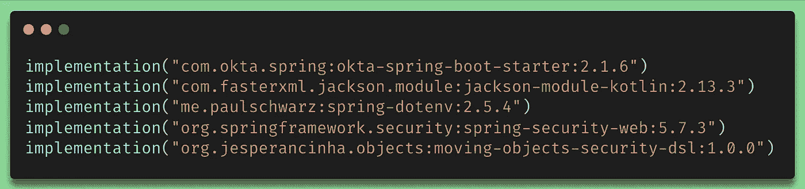****

******用于提供安全的依赖关系******

****实际相关的依赖项当然是 **okta-spring-boot-starter** 库。其他的很重要，因为它们提供支持。它们本身是不必要的。然而，它们对于[项目](https://gitlab.com/jesperancinha/moving-objects-service-root)的当前[版本](https://gitlab.com/jesperancinha/moving-objects-service-root)及其库版本是必要的。最后一个库，`**moving-objects-security-dsl**`，是我创建的一个非常小的库，只允许 **Okta** 安全配置在库存在时发生。试图通过 spring profiles 禁用 okta 被认为是一件奇怪的事情，而且对这个[项目](https://gitlab.com/jesperancinha/moving-objects-service-root)做这样的事情没有帮助。所以这个库只包含一个类:****

****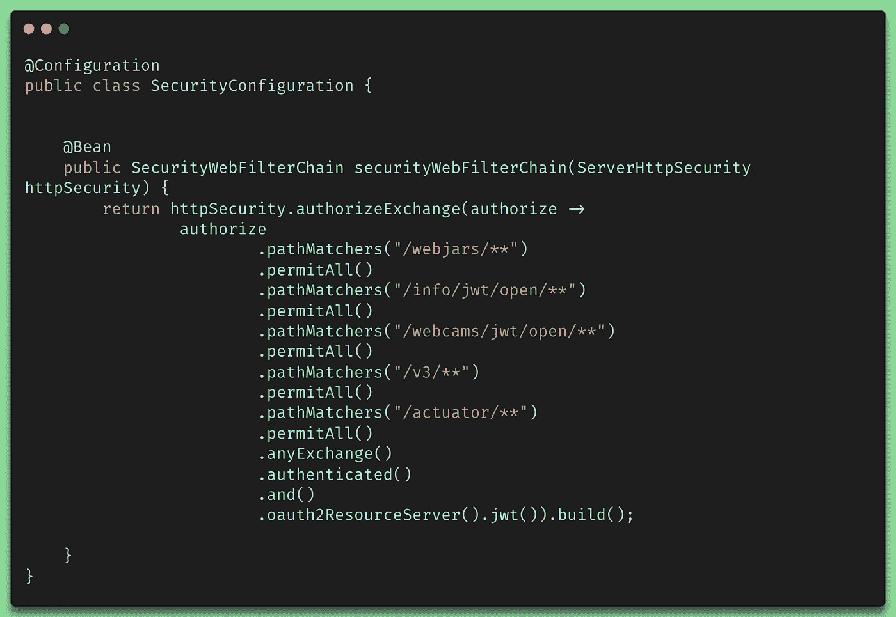****

******安全端点配置******

****还可以制作一个配置文件为 **prod** 的 **Bean** 和另一个配置文件为 **test** 的 Bean，然后让 **test** bean 成为一个完全开放的网站，类似于`***pathMatchers(“/**”).permitAll()***`。然而，这样做仍然意味着 **okta** **初始化**无论如何，以及某种程度的**不可预测性**我发现对于这个[项目](https://gitlab.com/jesperancinha/moving-objects-service-root)的目的来说是不合理的，并且由于 **Gradle** 在以我们想要的方式配置程序集方面是惊人的，因此我创建了一个参数可配置的构建，使用:****

****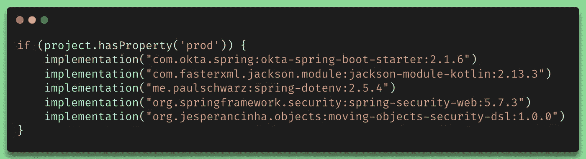****

******带梯度的可配置构建******

****SpringBoot 中的配置非常简单:****

********

******Okta 配置******

****有了这个，如果我们想运行应用程序的安全版本，我们可以用下面的命令行创建我们的构建:****

```
******gradle -Pprod clean build******
```

****最后，模块`**moving-objects-gui**`为我们提供了一个图形用户界面，在这里我们可以可视化我们的应用程序。我们不会详细讨论它，但重要的是要理解我们将把它部署在 **NGINX，**中，并且我们还想监控那台机器。****

# ****8.监控端点****

****在的前几个步骤中，我们已经了解了架构是如何设计的，也了解了我们的领域。我们还看了一下代码，深入了解了**实现**的一些有趣的方面。我们应该对**系统**此刻正在做什么以及所有的**运动部件**是如何工作的有一个非常清楚的了解。我们现在将逐步了解监控系统的所有要素。在本文的这一部分，记住这个系统可以在本地机器上运行是很重要的。所有移动部件都是**[**docker-compose**](https://docs.docker.com/compose/)设置的一部分。******

******在这篇文章中，我想做一个易于理解和修改的例子，这就是为什么每个组件都有自己的自定义图像。******

******同样，让我们记住，我展示的例子发生在我们成功运行 **docker-compose** 之后。在本文的后面，我们将讨论细节。现在，让我们记住我们可以运行两个版本的系统。对于安全版本，我们可以运行:******

```
********make dcup-full-action-secure********
```

******或者，如果我们想在没有 okta 的情况下运行它，我们可以运行:******

```
********make dcup-full-action********
```

******现在，让我们看看如何在不同的容器中配置指标。对于我们的例子，我们有 3 个具有重要指标配置需求的容器。他们是`**moving-objects-jwt-service**`、`**moving-objects-rest-service**`和`**moving-objects-gui**`、**、T22。对于前两个服务，我们需要为 **Spring Boot** 配置**普罗米修斯**:********

****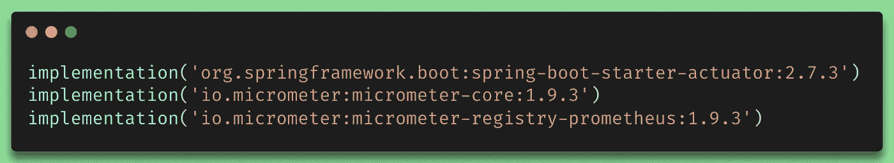****

******千分尺依赖性******

****这是在 [**普罗米修斯格式**](https://www.timescale.com/blog/four-types-prometheus-metrics-to-collect/) 中写入和显示所有指标所需的千分尺相关性。为了激活它，我们还需要激活 **Spring Boot 的致动器**。尽管如此，这仍然不会打开**端点**。这些实际上只是允许生成**端点**的库。****

****为了打开我们的[项目](https://gitlab.com/jesperancinha/moving-objects-service-root)中的**端点**，我们需要为此显式配置 **Spring Boot** :****

****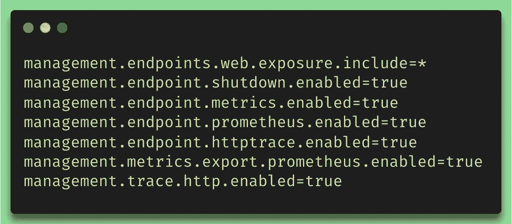****

******启用包括普罗米修斯在内的指标******

****两个 rest 服务包含相同的配置。需要**致动器**是因为它提供了重要的**度量**，这些度量来自 **Spring Boot** 中的框，并且已经可以被普罗米修斯 ***间接*** 读取。来自`**io.micrometer**`内核和`**prometheus**`库的千分尺属性使用与 **Prometheus** 相同的**格式**提供度量。这使得在 **Prometheus** 流程中从指标端点读取数据更加容易。****

****有了这些简单的配置行，我们就可以**创建** **端点**，并且**激活**其他跟踪机制。所有这些管理点都是 **Spring Boot 致动器**的一部分。然而，**普罗米修斯执行机构**的端点只有在 **Spring Boot 执行机构**存在的情况下**才会自动配置**。这就是同时需要测微计库和致动器库的原因。****

****普罗米修斯有自己的刮刀。他们将针对 Spring Boot 应用程序运行流程，并定期收集所有这些指标。我们也可以制定自己的指标，并通过**致动器**使其可用。有许多不同的方法可以做到这一点，其中一个例子就是使用 trace。在我们的指标中，我们可以找到这个端点:****

*   ****[http://localhost:8080/objects/actuator/metrics/http . server . requests](http://localhost:8080/objects/actuator/metrics/http.server.requests)****

****观察结果我们发现:****

****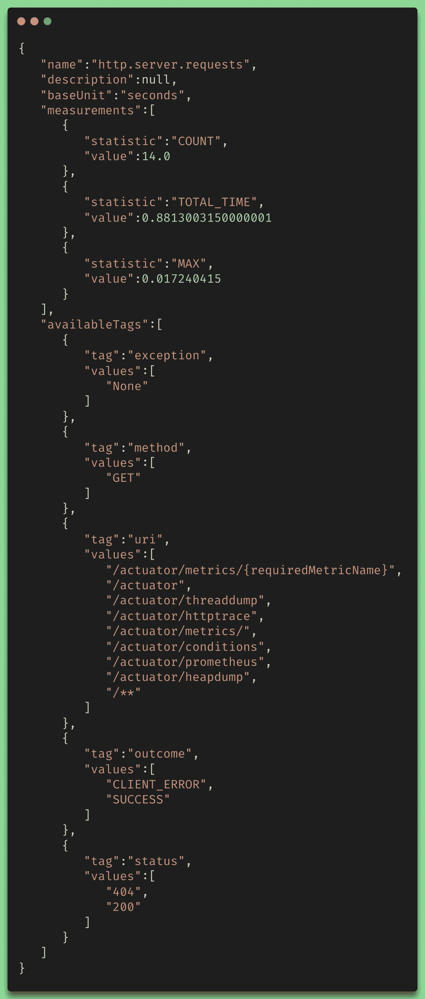****

******未更改跟踪请求的有效负载******

****这里我们有 **COUNT** ， **TOTAL_TIME，**和 **MAX** 。本质上，这些是对应用程序发出的请求数**，它们响应的总时间**，以及从请求得到响应的最大时间****。这些都是重要的指标。有了这些指标，我们可以知道有多少人在关注我们的 web 应用程序。对于收视率，这是一个非常方便的指标。我们想要监控我们的应用程序的性能。使用**总时间**可以是一个选项。有了**普罗米修斯**，我们有了比这更好的选择，但是因为我们有了**计数**和**总时间**，我们实际上可以得到某个端点的**平均响应时间**。如图所示，我们还可以读取端点响应的最长时间**。当注意到如果一个**端点超过**一个**特定时间**来响应，那么该端点可能有延迟问题时，这可能是重要的。因此，必须采取某种措施来改善它。**************

****在这些指标中，我们没有的是端点回复所需的**最短时间**。我们只是没有这方面的数据。在任何时候，我们都没有记录每个请求的时间。另一种方法是实现我们自己的`***HttpTraceRepository***`:****

********

******customtracepository******

****这创建了一个 HTTP 跟踪的实现，这是由 HTTP 跟踪标志启用的，正如我们之前看到的:`**management.trace.http.enabled=true**`。我们已经注意到，这个实现还带有一个存储库。简单来说，我只是创建了一个 **FIFO(先进先出)队列**。换句话说，当时我只是将 **10 个元素**保存在**库**中。这段代码只负责记录`**GET**` 的请求。我们可以改变这一点，对其他请求执行其他或相同的操作。****

****这里的重点是，我们可以**以我们喜欢的方式**改变指标**并**重新编程其中一些指标**以将**定制的**数据直接报告到 **Prometheus** 或任何其他**监控**获取工具中。**痕迹**将以格式后的[为例:](http://localhost:8080/aggregator/actuator/httptrace)******

****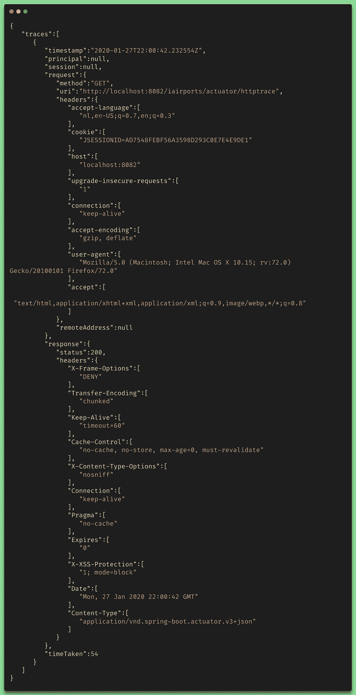****

******更新跟踪指标请求******

****如果我们查看这个请求的最后一个元素，我们会发现 **timeTaken** 。这是每个`**GET**`请求的响应时间。在这种情况下，我们的**最小值**可以是这个数组中最小值`**timeTaken**`的实现。重要的是要注意，在这种情况下，我们测量的是**毫秒**。为什么需要的时间最少？也许我们的目的是找到性能的峰值，而不是内存使用或 CPU 的峰值。也许，如果我们知道我们的请求什么时候更快，我们就可以识别出我们潜在的更好的代码或系统。在端点[**http://localhost:8080/aggregator/actuator/http trace**](http://localhost:8080/aggregator/actuator/httptrace)**上的这个[项目](https://gitlab.com/jesperancinha/moving-objects-service-root)中可以访问这个端点。******

****我们刚刚经历了 **Spring Boot** 后端支持**普罗米修斯**的要点。****

****让我们看看 **NodeJS** 如何为**普罗米修斯**提供相同的端点。在我们的例子中，我们在 **Angular** 中有一个完全开发的应用程序。我们可以使用 **NGINX** 直接部署它。然而，在这种情况下， **NGINX** 本身必须进行配置，以便为 Prometheus 提供端点。然而， **NodeJS** 通过库`[**prometheus-api-metrics**](https://www.npmjs.com/package/prometheus-api-metrics)`和`[**prom-client**](https://www.npmjs.com/package/prom-client)`提供了一个非常有趣的解决方案。****

****代码中有一个 **server.ts** 的例子，但是我们在这里只关注代码中的两个关键行:****

****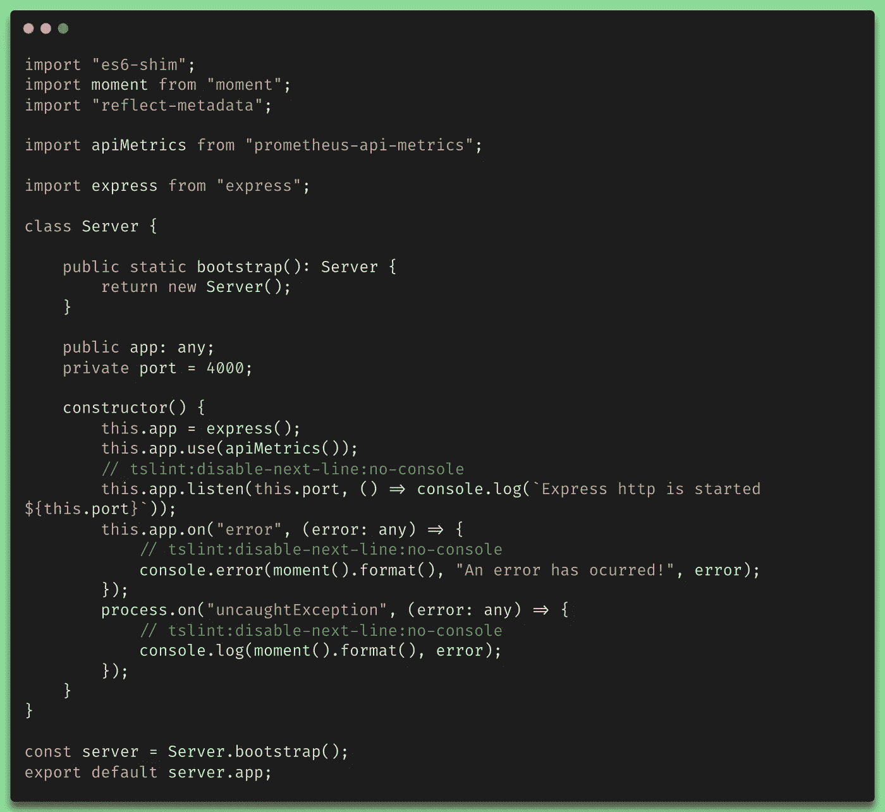****

******server.ts 度量供应商******

****我们感兴趣的台词，或者我应该只说我们关心的**一林** e 是:`**this.app.use(apiMetrics());**`****

****整个 **server.ts** 是一个运行在 [**express**](https://www.npmjs.com/package/express-serve-static-core) 上的简单 **NodeJS** 服务的实现。****

****我们的 **Prometheus** 指标的端点可以在我们的端点运行示例中看到:****

*   ****[http://localhost:8080/objects/actuator/Prometheus](http://localhost:8080/objects/actuator/prometheus)—**JWT 服务******
*   ****[http://localhost:8080/aggregator/actuator/Prometheus](http://localhost:8080/aggregator/actuator/prometheus])—**Okta 服务******
*   ****[http://localhost:8080/metrics](http://localhost:8080/metrics)—**NGINX 服务******

****度量格式如下所示:****

****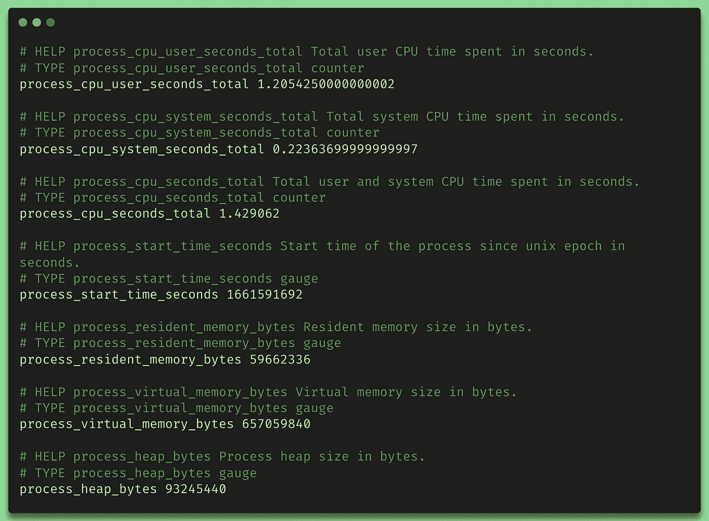****

******Prometheus enabled 披露的指标示例******

# ****10.设置普罗米修斯****

****为了让 Prometheus 运行起来，我们最终需要将我们讨论的所有内容配置到一个`**prometheus.yml**`文件中。我们的文件如下所示:****

****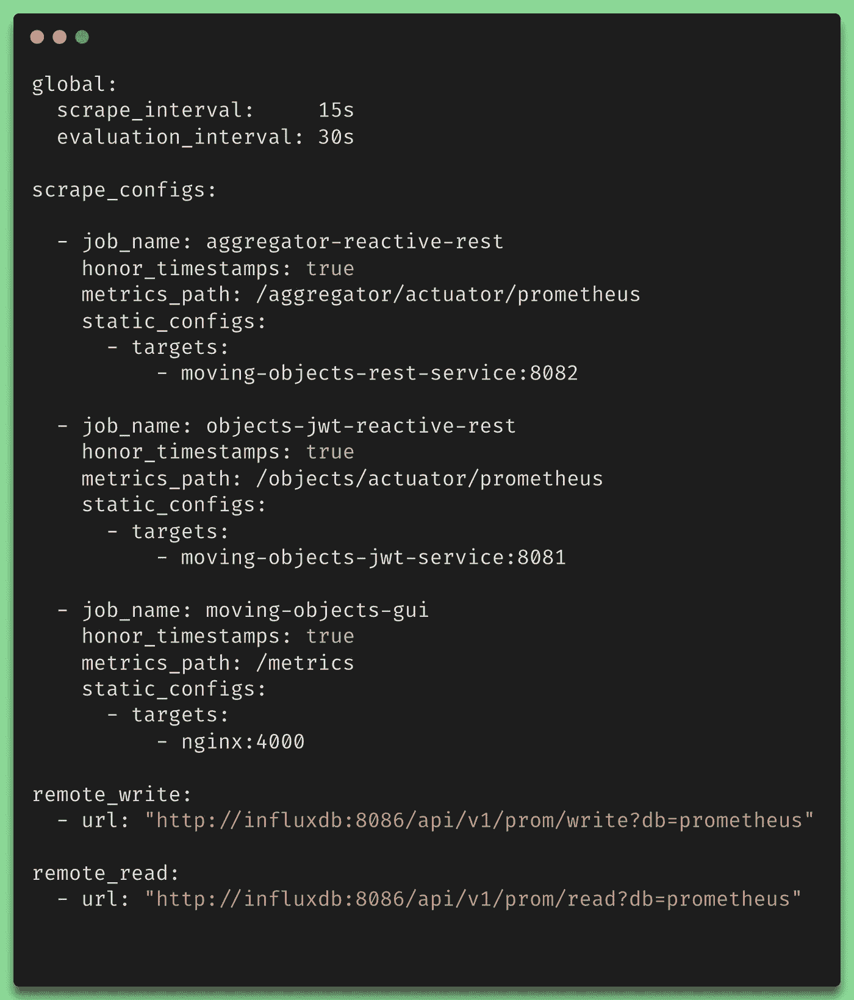****

******完整的普罗米修斯配置文件******

****注意，在最后，配置指向我们的 **InfluxDB** 。我们会将**报废间隔**设置为 15 秒，并且我们会评估**在过去 30 秒内的每次报废**。然而，这两条线不再可用。InfluxDB 已经成长为自己的 scrapper 框架，开启了**的辩论，普罗米修斯**仍然是一个必要的东西。然而，在这里，我们只是看看如何配置我们的监控应用程序。重要的是，我们看到我们可以用属性 **static_configs** 以 YAML 的方式配置我们的路由。在这三个版本中，我们配置了三个不同的作业来收集我们需要的数据。在这种情况下，废弃意味着数据可以被任何外部可视化工具访问，比如我们将在后面看到的 **Grafana** 框架。****

****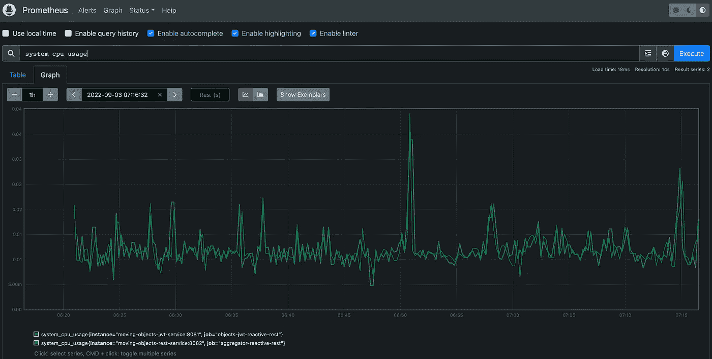****

******普罗米修斯仪表盘******

# ****11.设置 InfluxDB****

****O 使用任何架构的最大障碍之一是持久层。Prometheus 没有提供易于配置的持久存储系统。鉴于普罗米修斯**主要用作废品，并且正如我们之前所见，将它从短暂的数据存储系统转变为持久的数据存储系统并不容易，这是对普罗米修斯**的期望。这就是为什么我们有 [**InfluxDB**](https://www.influxdata.com/) 这样的数据库。这是一个专门设计用于存储指标的存储系统。目前，它提供了更多的功能，并且有自己的数据收集器，其工作方式与普罗米修斯非常相似。让我们看看如何连接到它。****

******InfluxDB** 不再需要连接到 **Prometheus** 来存储指标。以前我们会配置 **Prometheus** 通过作业的方式将数据推送到 **InfluxDB** 。如今，我们只需要指标端点。然后 **InfluxDB** 可以收集这些指标，甚至可以提供可视化图形和仪表板，就像 **Grafana** 所做的那样。我们可以让它运行，并在我们的系统中使用它。要检查它是否真正启动并运行，我们只需运行以下命令:****

```
******influx ping******
```

****为此，我们需要安装`[**influx client**](https://docs.influxdata.com/influxdb/v1.7/tools/shell/)`。****

****在本地启动演示时， **Cypress** 将运行当前的 **InfluxDB** 安装，并创建**铲斗和刮刀**。这些将被配置为在不同端点的不同存储桶中存储数据。 **InfluxDB** 自带**普罗米修斯**指标端点。从 **GUI** 配置 **InfluxDB** 非常容易，我认为展示这些**桶**和**刮削器**如何配置是不相关的。然而，在运行成功完成后，想象我们得到了什么是很重要的。这是我们配置存储桶后得到的结果。当我们运行 **Cypress** 时，它创建的第一件事就是为我们的清除程序保存数据的桶:****

********

****流入 DB 的铲斗配置****

****创建铲斗后，我们现在可以创建**刮刀**:****

****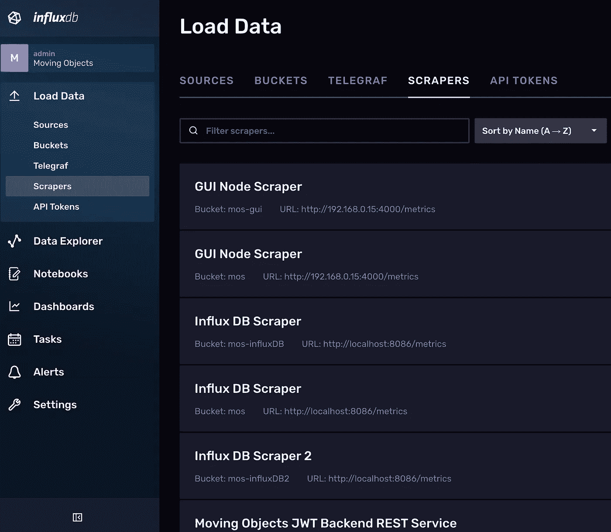****

******涌入的废品 DB******

****最后，我们可以创建一个**应用程序令牌**:****

****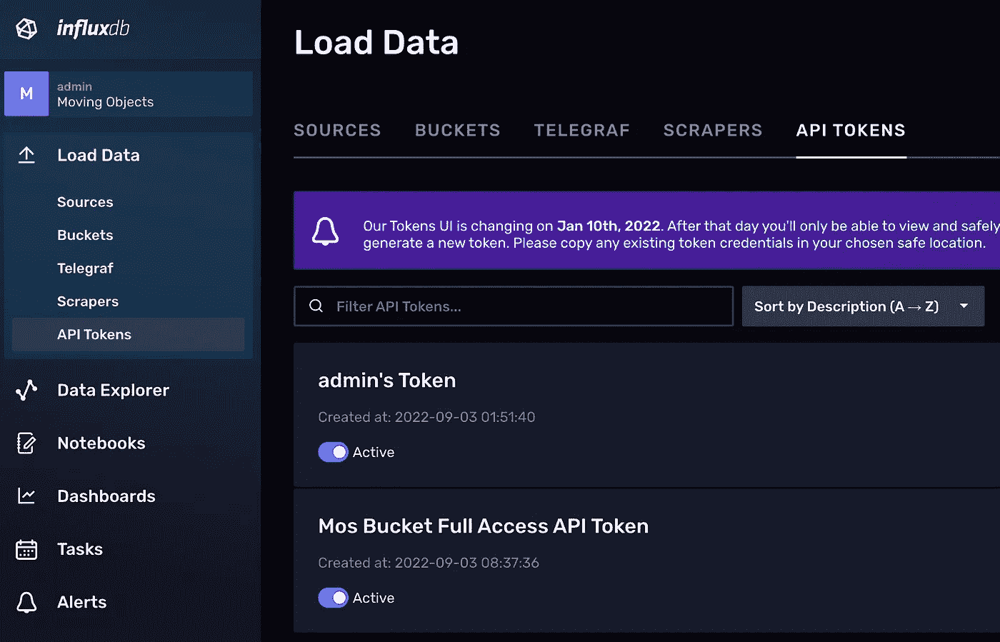****

******流入数据库中的应用令牌******

****这个应用程序令牌对于 **InfluxDB** 中一些非常有趣的东西是需要的，这使得它成为一个更加独立的平台。正如我们从上面看到的， **InfluxDB** 允许从我们的应用程序中主动抓取指标。这一切都很好，但我们可能想反过来。如果我们想被动地在 **InfluxDB** 中接收数据，那么我们需要一个外部工具来做这件事。Prometheus 仍然有那个功能，但是，由于安全需求，实现它相当麻烦。然而，InfluxDB 允许外部引擎很容易地与其连接，包括由 **Prometheus 提供的引擎。**他们都这个概念 **Telegraf** 。Telegraf 本质上是一种工具，它加载这些引擎，并开始主动从**普罗米修斯**有效载荷收集数据，然后**将**数据推送到 **InfluxDB。**除了 **Telegraf** 之外，我们不需要下载或安装任何其他东西。为此，我们可以编辑 **telegraf.conf** 文件。对于我们的[项目](https://gitlab.com/jesperancinha/moving-objects-service-root)，看起来是这样的:****

****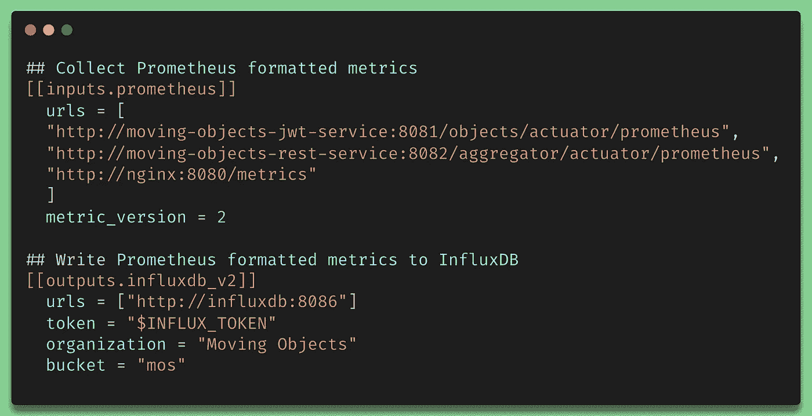****

******InfluxDB** 的 Telegraf 配置文件****

****现在最重要的事情是稍微关注一下这个文件的不言自明的参数。本质上，我们需要**URL**来让 **telegraf** 知道从哪里获取我们的指标，并且我们需要指定这些指标的目的地。对于目的地，我们需要提供带有**URL**的 **InfluxDB** 的位置、我们之前生成的**令牌**、组织**和桶**。了解我们在 **InfluxDB** 中的位置的唯一标识符是**组织**和**桶**是很重要的。这些是强制性的。在这些参数的顶部，我们用**输入. prometheus** 指定指标源端点的类型，用**输出. influxdb_v2** 指定目标类型。****

****当运行演示时，构建将开始，然后 cypress 将运行并在 **/docker-files/telegraf** 创建**令牌**，最后它将在 **docker-compose** 的同一个网络中启动 **telegraf** 容器。换句话说，这一切都将自动完成，这样我们就可以专注于如何进行设置。****

****如果我们成功地获得了演示，并且脚本 **make start-demo** 正在运行，那么我们将能够创建如下图表:****

****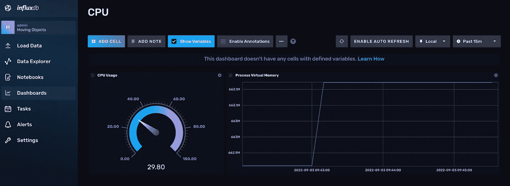****

******influx db 的仪表板可视化******

****如果你注意到数据没有进来，可能是因为 **telegraf** 还没有开始。我们可以通过运行以下命令再次启动 **telegraf** :****

```
******make start-telegraf-container******
```

# ****12.设置 Grafana****

****rafana 的配置方式与普罗米修斯不同。这里我们不需要任何代码。 **Grafana** 纯粹是基于它与 **Prometheus** 的合同。在继续之前，让我们回顾一下到目前为止我们所知道:****

*   ****2 个 Spring Boot **应用**和 1 个 NodeJS 应用****
*   ****持久性**指标数据库流入数据库******
*   ******Metrics scraper 和管理用普罗米修斯******

****我们将使用 **Prometheus** 和 **Grafana** 仅从 Prometheus 生成图形。关于如何用 Grafana 构建图形的详细讨论是一个独立的主题，并转移了本文的重点。重要的是要理解我们如何让我们的 **Grafana** 配置也**持久**。我们希望保持图形配置的持久性，这样我们就可以在任何 Grafana 环境中使用它们。****

****当我们第一次看到 Grafana 时，我们立即意识到我们必须创建一个数据源。通过这个操作，我们还创建了一个**仪表板提供者**。仪表板提供商保存在位于格拉夫纳`**/etc/grafana/provisioning/dashboards/**` 的 YAML 文件中。让我们看看 **dashboard.yml** 上的例子:****

****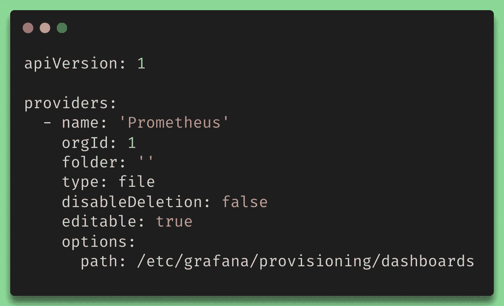****

******Grafana 缓冲板配置******

****通过这种配置，我们告诉**Grafana****Prometheus**是其第一个仪表板提供商的名称。同时，我们让 Grafana 知道我们将加载位于`**/etc/grafana/provisioning/dashboards**`的所有仪表板。尽管我们已经为我们的仪表板建立了一个数据提供者，但是我们仍然需要真正的端点用于 **Prometheus** 。这是在我们的 **datasource.yml** 文件中完成的:****

****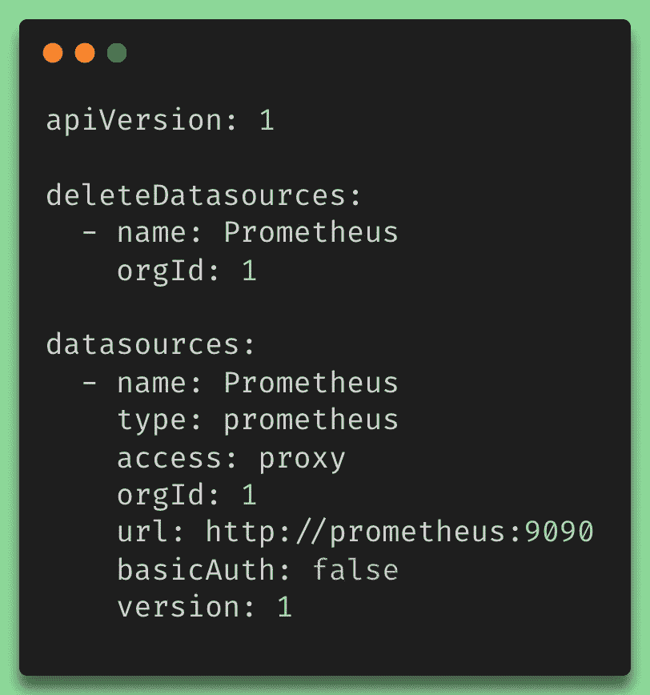****

****普罗米修斯 **datasource.yml******

****在定义了数据源和仪表板数据提供者之后，我们最终需要将所有的仪表板放在`**/etc/grafana/provisioning/dashboards**`中。Grafana 提供了以 **JSON** 格式保存这些仪表板的方法。它们不需要被 **Grafana** 引用。只要它们还在那个文件夹中，我们就会看到 **Grafana** 会读取它们。****

****仪表板本身是相当大的文件，它们可以在文件夹`**/docker-files/grafana**`的[项目](https://gitlab.com/jesperancinha/moving-objects-service-root)中找到。这两个 **JSON** 文件分别是 **NGINX** 机器的安装文件( **node-grafana.json** )和 **JVM 的** ( **jvm-grafana.json** )。****

****Grafana 似乎与 **Firefox** 有一些兼容性问题。我不认为它们是关键的，它们是我在 **UX(用户体验)**方面永远无法复制的东西。然而，它们确实存在，cypress 测试能够检测到其中的许多错误，这就是为什么，如果我们看一下 **commands.ts** ，我们将看到一些针对某些抛出错误的异常规则:****

****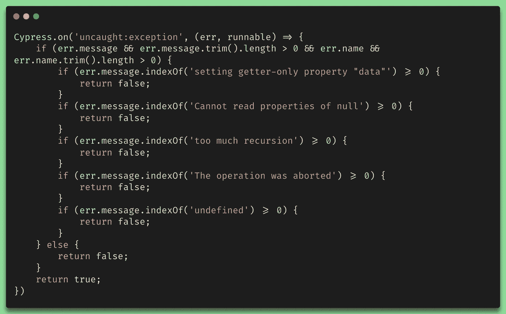****

****Cypress 运行期间针对 Firefox 浏览器生成的异常****

****运行 Grafana 后，我们应该会得到如下图形:****

****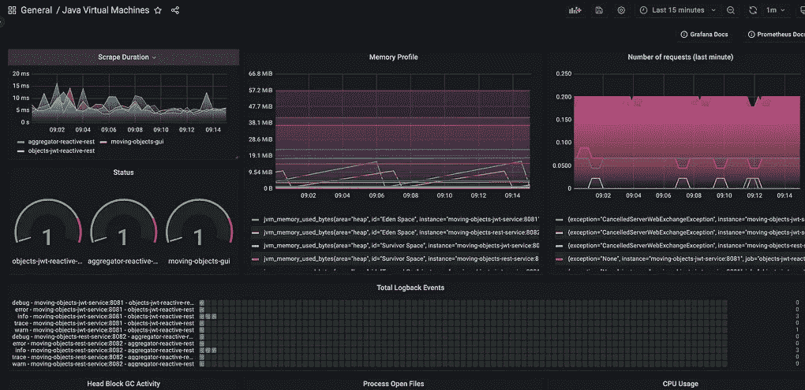********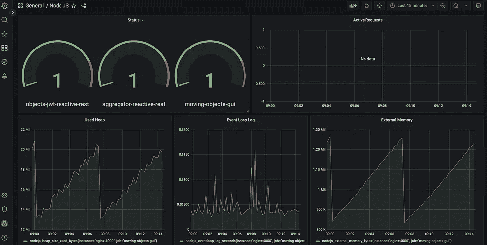****

******Grafana 的 Dasboards 示例******

# ****13.Docker composer 编排****

****位于[项目](https://gitlab.com/jesperancinha/moving-objects-service-root)根目录下的 **docker-compose** 文件包含启动应用程序的主设置。这就是我们如何实现我们的 **docker-compose** 编排，如我们的第一张图所示。****

****我之前提到了几种在本地启动这个应用程序的方法。我们可以试着一次完成。可用于此目的的脚本是开始演示 **:******

```
******make start-demo******
```

****如果成功，我们将启动应用程序的不安全版本。我们希望启动安全应用程序，然后可以运行:****

```
******make start-demo-secure******
```

****这是我们页面在 **8080** 港口的样子:****

****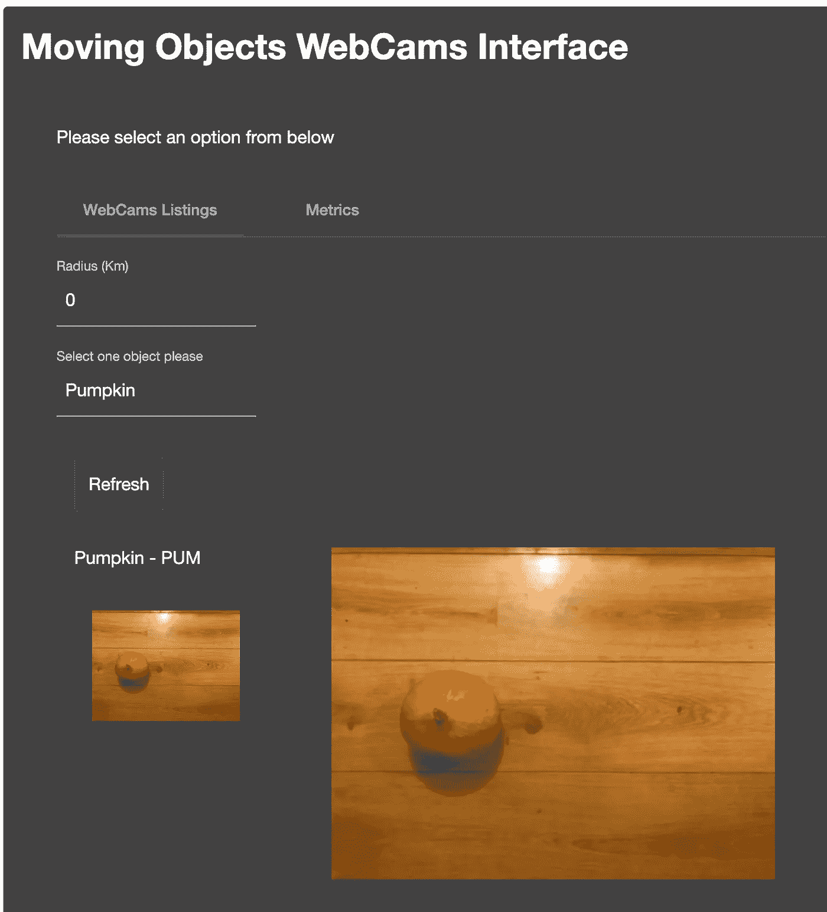****

******移动物体应用******

# ****14.结论****

****我们终于到了本文的结尾。它很长，但我希望能够传达我发现的对这种**监控**架构有启发的要点。我不想让它变得太复杂，但我也想让它成为一篇有趣的文章，有一些惊喜。****

****在本文中，我们已经看到了如何设置一个非常基本的配置 **Prometheus、Grafana 和 InfluxDB** 应用于 **Spring Boot 和 NodeJS** 应用程序。****

****我们已经看到了关于**仪表盘**外观和感觉的示例图片。****

****回顾所有三种类型的仪表板和三种不同的品牌，我们可以立即得出这样的想法:这些本质上只是不同的监控工具，它们都可以基于简单的 **Prometheus** 指标端点。我们还可以看到，我们可以制定自己的指标，并且可以在代码中对这些指标进行编程。使用这些机制时，做出一个决定可能是压倒性的。例如， **Grafana** ，似乎是一个可视化数据的伟大工具，尽管我们已经在本文中看到了如何将其与 **Prometheus** 服务集成，我们也可以将其与 **InfluxDB** 集成。但是现在我们可能会有点吃惊，因为 **InfluxDB** 本身也有**仪表盘**，那么我们为什么还需要 **Grafana** 呢？也许 **Grafana** 中有你在 **InfluxDB 中找不到的功能。**或者也许，以同样的方式， **Telegraf** 可以降低 **InfluxDB 的 CPU 使用率，**Grafana 也可以。事实上， **Grafana** 可以认为只是一个可视化框架， **Prometheus** 所有度量的来源， **InfluxDB** 持久性数据库，以及 **Telegraf，**我们需要的 scrapper。如果我们这样做，那么我们会得到一个完全解耦的系统，其中每个部分都有自己的职责。因此，我们尽量减少性能问题和**指标**对**应用**的影响。****

****因此，在安全性方面，使用 **JWT** 和**奥克塔**作为认证/授权机制，我们可以看到，为了能够进行监控，我们可以开放端点。但是我们应该吗？我们也许不应该让它们**开着**，但是它们经常开着。通常情况下，它们对内部网络保持开放，但对外部世界保持私有。这意味着，即使是拥有完全访问权限的人也无法访问这些端点。实现这一点的技术超出了本文的范围，但是像 **NGINX、Kong、**和其他网关这样的解决方案可以提供功能，它们通常提供与**云**提供商的集成。****

****我已经把这个应用程序的所有源代码放到了 [**GitHub**](https://github.com/jesperancinha/moving-objects-service-root) 上****

****我希望你能像我喜欢写这篇文章一样喜欢它。****

****我很想听听你的想法，所以请在下面留下你的评论。****

****提前感谢您的帮助，感谢您的阅读！****

****保重，保持兴趣，保持逻辑，保持安全！****

# ****6.参考****

 ****[## 千分尺应用监控

### 编辑描述

千分尺 io](https://micrometer.io/docs/registry/prometheus)**** ****[](https://dzone.com/articles/how-to-configure-an-oauth2-authentication-with-spr) [## 如何用 Spring Security 配置 OAuth2 身份验证(第 1 部分)——DZone Security

### 正如你可能在我之前的博客文章中注意到的，我是 Spring + Java 和 Spring + Kotlin 的忠实粉丝。因此…

dzone.com](https://dzone.com/articles/how-to-configure-an-oauth2-authentication-with-spr) [](https://grafana.com/docs/grafana/latest/installation/docker/) [## 运行 Grafana Docker 图像

### 运行 Grafana Docker 镜像您可以使用官方 Docker 容器安装和运行 Grafana。官方的 Grafana…

grafana.com](https://grafana.com/docs/grafana/latest/installation/docker/) [](https://prometheus.io/) [## 普罗米修斯——监测系统和时间序列数据库

### 利用领先的开源监控解决方案增强您的指标和警报能力。普罗米修斯作者 2014–2020 |…

普罗米修斯](https://prometheus.io/) [](https://rapidapi.com/) [## API 市场—免费公共和开放 Rest APIs | RapidAPI

### 在 RapidAPI 的 API Marketplace(全球最大的 API 目录)上浏览、测试和连接 1000 个公共 Rest APIs

rapidapi.com](https://rapidapi.com/) [](https://docs.influxdata.com/influxdb/v1.7/query_language/data_exploration/) [## 使用 InfluxQL | InfluxData 文档的数据探索

### InfluxQL 是一种类似 SQL 的查询语言，用于与 InfluxDB 中的数据进行交互。以下部分详细介绍了 InfluxQL 的…

docs.influxdata.com](https://docs.influxdata.com/influxdb/v1.7/query_language/data_exploration/)****