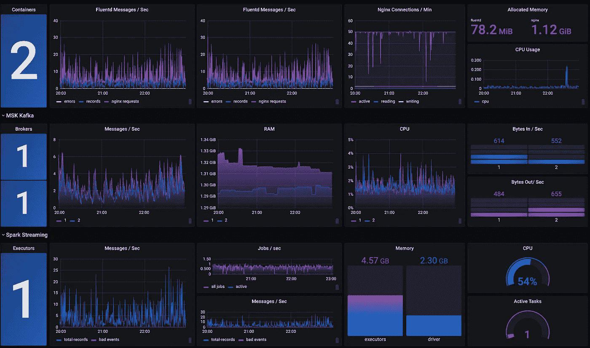
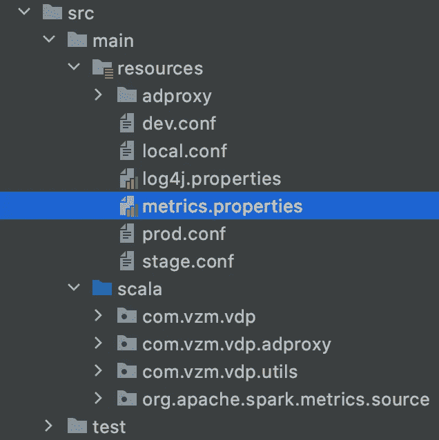
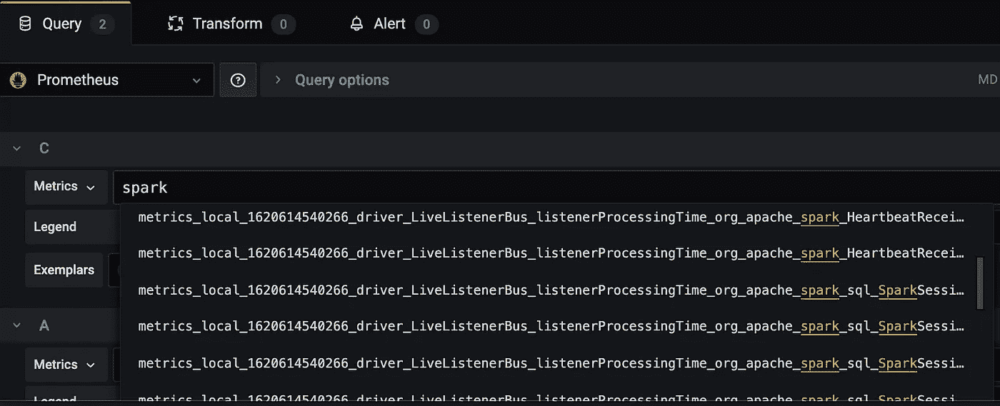
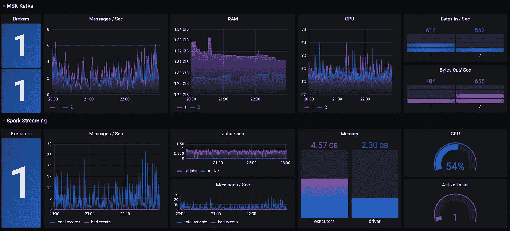

# 用普罗米修斯和格拉夫纳监测 K8s 上的火花流

> 原文：<https://itnext.io/monitoring-spark-streaming-on-k8s-with-prometheus-and-grafana-e6d8720c4a02?source=collection_archive---------2----------------------->

# 介绍

成本效益和可移植性是将 Apache Spark 工作负载从托管服务(如 [AWS EMR](https://aws.amazon.com/emr/) 、 [Azure Databricks](https://azure.microsoft.com/en-us/services/databricks/#:~:text=Azure%20Databricks%20provides%20the%20latest,scale%20and%20availability%20of%20Azure.) 或 [HDInsight](https://docs.microsoft.com/en-us/azure/hdinsight/hdinsight-overview#:~:text=Azure%20HDInsight%20is%20a%20managed,Storm%2C%20R%2C%20and%20more.) 迁移到 [Kubernetes](https://kubernetes.io/) 的主要原因。您可以在下面的[文章](/migrating-apache-spark-workloads-from-aws-emr-to-kubernetes-463742b49fda)中了解更多关于从 AWS EMR 到 K8s 的迁移过程。然而，离开托管服务也有潜在的隐患。最大的问题可能是失去监控和警报能力。例如，AWS EMR 以 CloudWatch、Ganglia、CloudTrail 和 YARN history server 的形式提供了非常丰富的内置监控工具箱。在本文中，我们将探索一种通过使用 Prometheus 和 Grafana 在 K8s 上实现 Apache Spark 监控功能的简单方法

# 目标

在生产中大规模运行 Apache Spark 工作负载是一项非常复杂的任务。有很多事情可能会出错:遗嘱执行人可能会失败。外部数据源的延迟可能会增加，由于输入数据性质的变化或代码的更改等原因，性能可能会下降。为了解决所有这些潜在问题，有必要主动实时监控重要指标。Apache Spark 中需要监控的一些重要指标是:

1.  资源利用率:核心数量、CPU 时间、使用的内存、分配的最大内存、使用的磁盘。
2.  Spark 任务:活动/失败/已完成任务的数量，任务最大/平均/最小持续时间
3.  火花洗牌:总洗牌读/写字节
4.  Spark 调度程序:活动/已完成/失败的作业数
5.  火花流:接收器数量、运行/失败/完成的批次数量、接收/处理的记录数量、平均记录处理时间
6.  自定义指标:任何应用程序的特定指标都应该与系统指标一起被监控。

# 解决办法

Prometheus 是与 Kubernetes 一起使用的最受欢迎的监控工具之一。它是开源的、去中心化的、社区驱动的，并且是云计算原生计算基金会的成员。Prometheus 将其所有数据存储为时间序列。这些数据可以通过 [PromQL](https://prometheus.io/docs/prometheus/latest/querying/basics/\) 查询，并在 [Grafana](https://grafana.com/) 或内置浏览器中可视化。Apache Spark 3.0 增加了一种简单的方法来支持 Prometheus 的一般用例。

## **步骤 1:准备水槽**

在 Spark 2x 中，您可以使用内置 JmxSink 和 JmxExporter 的组合。从 [Spark 3.0](https://spark.apache.org/releases/spark-release-3-0-0.html) 开始，引入了一个新的 sink——PrometheusServlet。PrometheusServlet 相对于 JmxSink & JmxExporter 的优势是显而易见的:消除对外部 JAR 的依赖，重用 Spark 中已经用于监控的现有端口，利用 Kubernetes 中的 Prometheus 服务发现。

为了启用新的接收器，在您的项目中创建 **metrics.properties** 文件

将以下配置添加到 **metrics.properties:**

**metrics.properties**

## 步骤 2:部署应用程序

在 K8s 上部署 Spark 时，您将 Spark 应用程序打包在 Docker 映像中。例如，提供的 Dockerfile 是一个多阶段映像:第一个阶段用于通过使用 [SBT 工具](https://www.scala-sbt.org/)编译和构建 Spark (scala)应用程序，第二个阶段作为 Spark 基础层，最后一个阶段用于最终的可部署映像。在第 94 行，(最终图像阶段)我们将 **metrics.properties** 复制到 opt/spark/conf/文件夹。

## 步骤 3:自定义指标

在生命周期的某个时刻，几乎所有应用程序都需要能够报告自定义指标，如某些方法的延迟、关于内部状态的关键统计数据、应用程序健康检查等。因此，我们需要能够检测代码，然后向 Prometheus 公开自定义指标。这可以通过使用 [Dropwizard Metrics](https://metrics.dropwizard.io/4.1.2/) java 库来完成。例如，您可以看到自定义度量类的以下实现:

自定义指标实施

从代码的任何地方，只需调用您的定制指标并更新计数器、直方图、计量器或计时器。所有自定义指标将通过使用 HTTP 协议自动公开。

部署 spark 应用程序后，您可以导航到 K8s 集群中的驱动程序窗格，并确保所有 Spark 和定制指标都被正确地公开。例如，您可以使用 curl 命令来完成。

卷曲输出

Apache Spark Streaming 需要额外的配置:Spark . SQL . Streaming . metrics enabled .当**Spark . SQL . Streaming . metrics enabled**设置为 true 时，会看到以下额外的指标:延迟、处理速率、状态行、事件时间水印等。

## 步骤 4:创建 Grafana 仪表板

一旦部署了 spark 应用程序并且配置了 Prometheus，您就可以使用 Grafana 仪表板了。在 Grafana 上创建一个新的仪表板，选择 Prometheus 数据源，然后输入您的查询。

格拉夫纳

当您搜索特定指标时，请记住 PrometheusServlet 遵循 Spark 2.x 命名约定以保持一致性，而不是使用 Prometheus 标准。选择您选择的任何指标，并将其放在 Grafana 仪表板上。

卡夫卡&火花流

此外，您可以使用 Prometheus [Alertmanager](https://prometheus.io/docs/alerting/latest/alertmanager/) 来定义重要指标的警报。例如，在失败的作业、长时间运行的任务、大规模洗牌、延迟与批处理间隔(流)等 Spark 指标上定义警报是一个好主意。

# 摘要

如果您正在运行大量的 Apache Spark 工作负载，并且您关心成本效率和可移植性，那么您可能正在考虑或者已经在使用 Kubernetes。阿帕奇 Spark 3 向 K8s 方向又迈进了一大步。由于 Prometheus Monitoring 的本机支持，K8s 上的 Apache Spark 监控和警报非常简单，它可以与我们过去在 AWS EMR 等托管服务上使用的相媲美。