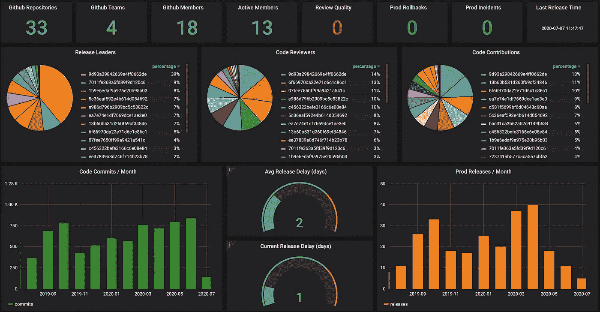
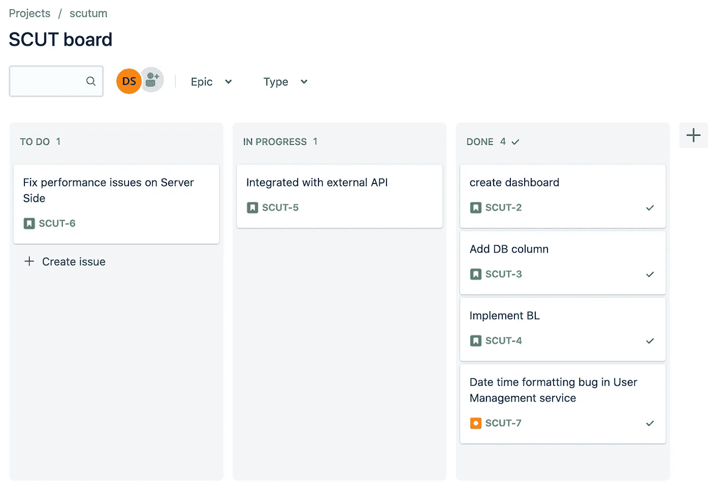
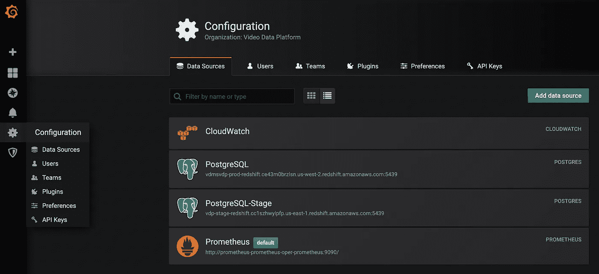
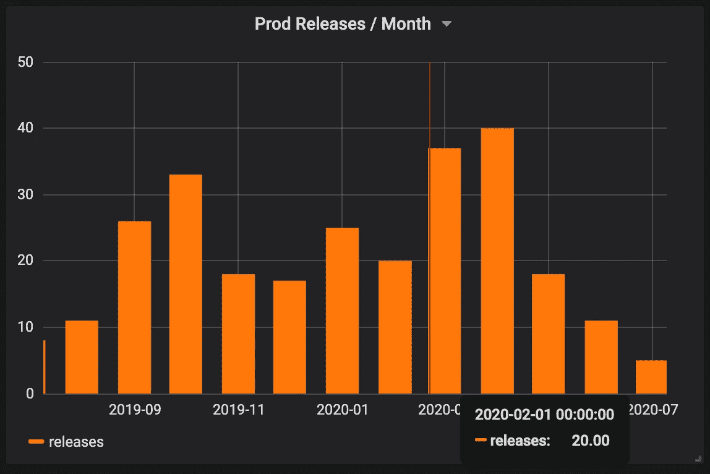

# 使用 Github、吉拉和 Grafana 监控软件团队的表现

> 原文：<https://itnext.io/monitoring-the-performance-of-software-teams-using-github-jira-and-grafana-42035b18eae6?source=collection_archive---------0----------------------->



# 介绍

COVID19 对世界产生了巨大的影响。我们生活的每一个方面都经历了巨大的变化，就像世界上许多其他软件开发团队一样，我们的团队完全是远程进行的。我不知道我们的办公室什么时候开放，可能办公室再也不会是什么东西了，这就是为什么最好为长期远程工作做好准备。网上有很多关于过渡到完全远程工作的好文章，我最喜欢的是 GitLab 的[“远程宣言”](https://about.gitlab.com/company/culture/all-remote/guide/)。此外，如果你有点喜欢我们，并且你正试图建立一个数据驱动的团队，你可能需要一些好的指标来监控你的团队的表现。在这里，我将展示一种收集和分析这些指标的简单方法。此外，我将分享一些关于远程工作如何影响我们团队绩效的想法

# 开发团队绩效指标

选择正确的指标进行监控是一项相当艰巨的任务。比如，如何衡量研究任务？协作和知识共享呢？有很多未知。我们并不试图衡量和监控一切。我们所做的是测量软件开发的核心方面。我们希望通过保持较低的产品发布率来尽可能快地开发特性，换句话说，我们希望通过使用以下 KPI 来监控开发速度和质量。

>**交付周期**:团队从一个想法或功能需求到交付软件需要多长时间

周期时间(Cycle Time):对软件系统进行变更并将变更交付到产品中需要多长时间。

>**部署数量**:在一段时间内，一个软件开发被部署到产品中的次数，通常是一个 sprint。

>**变更失败百分比:**失败的生产变更的百分比，包括热修复、回滚、向前修复等..

>**事件数量:每个时间段在生产中发现的 bug 数量。**

>**变更等待时间:**批准变更需要多长时间

>**评审质量:**每次代码变更的评论数量。

# 收集绩效指标

指标收集方法取决于公司或团队使用的技术堆栈。我们在 [AWS](https://aws.amazon.com/) 上运行，使用 [Github](https://github.com/) 作为我们的版本控制，使用[吉拉](https://www.atlassian.com/software/jira)进行项目管理和问题跟踪。所以我们将使用 AWS Lambda 从 Github 和吉拉 API 收集所有需要的信息。所有收集的数据都将存储在 RDS for PostgreSQL 中，然后由 [Grafana](https://grafana.com/) 使用。

>**提前期**由[吉拉用户故事](https://www.atlassian.com/agile/project-management/user-stories)的吉拉开/关时间反映

>**周期时间**由 Github [分支创建时间和主](https://github.com/geodynamics/specfem3d/wiki/Merging-Development-Branches-into-Master)分支合并时间之间的间隔反映

>**部署数量:**取决于实现，但通常由 [Github 发布和标签](https://docs.github.com/en/github/administering-a-repository/managing-releases-in-a-repository)实现。我们的做法略有不同，我们只是改变了存储库的 taginfo.json 文件。

>**变更失败率:**由 Github [回滚](https://docs.github.com/en/desktop/contributing-to-projects/reverting-a-commit)和[补丁](https://gist.github.com/wildlyinaccurate/daec7910958330a64754)的数量反映

>**事件数量:**吉拉“缺陷”问题数量

>**变更等待时间:**Github 中最后一次提交与 PR 审批之间的时间间隔。

>**评审质量:**Github 上的评论数量[拉取请求](https://docs.github.com/en/github/collaborating-with-issues-and-pull-requests/commenting-on-a-pull-request)。

# 刮吉拉

考虑吉拉的以下问题:



我们有一个缺陷问题(bug)和五个用户故事(计划工作的单元)。通过废弃这些信息，我们可以获得两个 KPIs 交付时间和事故数量。所以，我们从安装[吉拉 Python 包](https://pypi.org/project/jira/)开始

```
$ pip install jira
```

吉拉的客户端可以通过使用以下任何一种[身份验证](https://jira.readthedocs.io/en/master/examples.html#authentication)方法进行初始化——基本、Oauth、Kerberos、Cookie，代码如下所示:

[创建一个吉拉客户端](https://gist.github.com/dimastatz/5b86271cbeb8ff18958e8e32c0816c6d)

现在我们可以走了。正如我提到的，我们将使用吉拉的信息，以获得交货时间。我们只需搜索所有状态为“完成”的吉拉用户案例，就可以做到这一点:

[提前期](https://gist.github.com/dimastatz/351a1784eaaa4f18e320c4b7103d6bc2)

结果集中的每一行都具有以下格式:问题名称、问题摘要、问题类型、问题创建日期、问题关闭日期。例如，它可能看起来像这样

```
['SCUT-4', 'Implement BL', 'Story', '2020-07-06T14:25:38.919+0300', '2020-07-06T14:31:37.053+0300']
['SCUT-3', 'Add DB column', 'Story', '2020-07-06T14:24:53.961+0300', '2020-07-06T14:25:21.316+0300']
['SCUT-2', 'create dashboard', 'Story', '2020-07-06T13:21:49.546+0300', '2020-07-06T13:56:42.994+0300']
```

issue_close_date 和 issue_create_date 之间的间隔是**提前期**。为了获得事件的数量，我们将只搜索所有的缺陷问题

[事件](https://gist.github.com/dimastatz/7237a28dca24a77c94e94da120f910c7)

所以我们实现了吉拉抓取逻辑。现在，我们可以将代码打包到 AWS Lambda 中，每天调用一次，以持续收集所需的吉拉信息。

# 抓取 Github

从 Github 获取数据也很容易。首先，我们必须安装 [pygithub](https://pygithub.readthedocs.io/en/latest/index.html)

```
$ pip install [pygithub](https://pygithub.readthedocs.io/en/latest/index.html)
```

然后我们创建一个 API 访问[令牌](https://docs.github.com/en/github/authenticating-to-github/creating-a-personal-access-token)，并通过使用下面代码片段中的 create_github 函数初始化 Github 客户端。

[*创建 Github 客户端*](https://gist.github.com/dimastatz/9b029bf0ebb7796daa86738b3f78680e)

下一步是收集反映其余 KPI 的 Github 数据。在这里，重要的是要提到数据收集与团队如何使用 Github 紧密相关。所以对于其他团队来说，逻辑可以不同。毕竟，我们希望以如下方式构建数据:

> pr_author，评论数，提交数，pr_last_update_time，pr_create_time，first_comment_create_time，is_prod_bump，添加数，更改数，删除数

它可以通过运行以下代码来收集:

[*获取 Github 数据*](https://gist.github.com/dimastatz/9fc3253102f8050ce5b85645d3a28e4d)

代码非常简单，一旦 get_all_data 被调用，它将获取给定组织的所有存储库，对于每个 repo，它将获取包含所有必需数据的所有 pull 请求。

# 推送至 PostgreSQL

我们将所有收集的数据存储在 PostgreSQL 中。Postgre 本身并无新意。我们使用 [psycopg](https://www.psycopg.org/) Python 包来访问我们的 PostgreSQL。代码很简单，首先，我们创建一个客户机，然后对所有收集的数据运行插入查询。

[将数据插入 Postgres](https://gist.github.com/dimastatz/89cd4f4cf0e5a40be8e01ac863300be3)

# 格拉夫纳

Grafana 是多平台开源分析和可视化 web 应用程序。当连接到支持的数据源时，它提供 web 图表、图形和警报。作为使用最广泛的数据库之一，Postgres 在 Grafana 支持的数据源列表中，我们可以创建仪表板并分析开发团队的表现。因此，我们通过单击 add new data sources 在 Grafana 中创建新的 PostgreSQL 数据源。



[添加 Grafana 数据源](https://grafana.com/docs/grafana/latest/features/datasources/add-a-data-source/)

一旦添加了数据源，我们就可以查询任何表，分析数据并可视化分析。在下面附加的屏幕截图上，您可以看到带有性能分析的控制面板。


开发团队分析

总的来说，我们的团队做得很好。

>**周期时间:**开发周期短，团队每两天发布一次产品。当按代码贡献者分解开发时，我们可以看到团队相当平衡。它有 6 个贡献相同数量代码的顶级贡献者。另一方面，我们可以看到团队的 Github 上有 18 个成员。但是其中只有 13 个是活跃的(贡献代码、评审、部署到产品)。这个问题可以解释为 Github 管理不善，例如，Github 仍然包含离开团队的用户，或者这是一个真正的性能问题，应该由团队经理来解决。

>**部署数量:**该团队每月执行 8 到 40 次生产部署。40 有点高，可能可以用多次尝试修复某个东西来解释。但是每天部署一次(每月 22 次)是一个非常好的数字。当按照发布领导(实际执行产品部署的人)进行分解时，我们可以看到团队有一些改进的空间。显然，一个团队成员执行大约 40%的生产部署。当然，最好让更多的人参与进来，在所有工程师之间平均分配这项任务。

>**变更失败率:**这个团队大概有 0 次回滚。这是一个非常好的结果。通常，这意味着所有的更改都经过了仔细的测试。

>**事件数量:**我们通过吉拉缺陷问题的数量来衡量事件的数量。这里我们可以看到大约 0 个缺陷。看起来团队成员不会为每个事件都开吉拉罚单。如果是这样的话，或许最好再增加一个事件指标。例如，测量生产警报的数量可能是一个好主意。

>**变更等待时间:**应该用 PR 创建和 PR 合并时间的间隔来衡量。我们未能从 Github 中获取该号码。但是我们知道生产部署会延迟 2 天。所以我们可以把这个数字作为换机等待时间。

**>评审质量:**团队在这方面有很多工作要做。公关评论很少。

>**提前期:**与团队无关。该团队是一个大组织的一部分，有一个季度 PI 规划，其中所有任务都根据业务和技术需求进行规划。

>**额外收获:**大量研究表明，远程员工的工作效率更高，现在我们有了一个独特的机会，可以通过使用我们的绩效监控工具来验证远程工作效率。首先，我们可以检查每月代码提交的数量。


代码提交次数

图表被垂直的红线分成两部分，左边是在办公室工作的部分，右边是在家工作的部分。第二个图表显示了产品发布的数量



显然，远程工作对团队产生了积极的影响。在生产事故数量保持不变的情况下，开发速度和发布数量都得到了提高。

# 最后的想法

这不是远程工作好坏的问题，而是你如何让它工作的问题。毫无疑问，管理远程工程团队需要一种数据驱动的方法，并有效地使用来自源代码库、项目管理工具和沟通渠道的数据。在本文中，您看到了通过废弃 Github 和吉拉就可以获得所有的基本指标。如果你需要更高级的工具，你可以看看 LinearB 或 GitPrime。