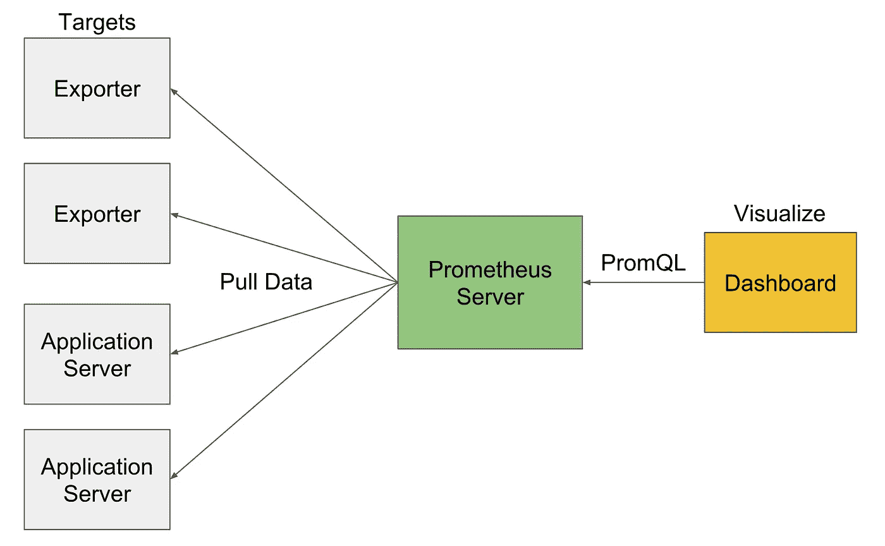
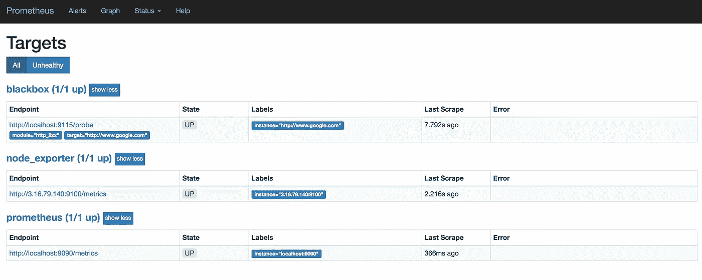
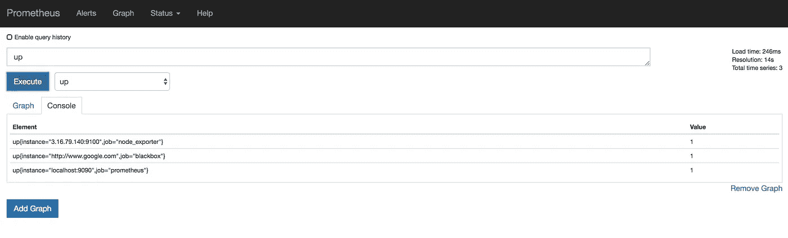
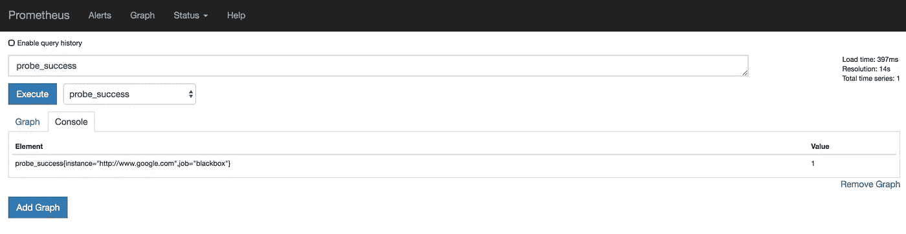

# 使用 Ansible 通过 Prometheus 进行监控

> 原文：<https://itnext.io/monitoring-with-prometheus-using-ansible-812bf710ef43?source=collection_archive---------0----------------------->


由[克里斯·利维拉尼](https://unsplash.com/@chrisliverani?utm_source=medium&utm_medium=referral)在 [Unsplash](https://unsplash.com?utm_source=medium&utm_medium=referral) 上“打开平板显示器”

你最糟糕的噩梦是什么？对我来说，就是当我们的客户访问社交媒体，告诉我们我们的服务中断了，而我们却不知道。为了防止这种情况，我们需要在部署过程中设置监控。希望你们都这样做。监控有助于了解何时出现问题。它有助于调试和了解问题。如果某段时间内 CPU 或内存使用率上升，它会发出通知。我们希望持续监控我们的实例和服务，以发现行为、CPU 使用、内存使用、磁盘空间、网络使用等方面的任何异常。监控使我们能够识别长期趋势、分析性能并看到可视化效果。

监控包括收集、处理、聚合和显示有关系统的数据，以及基于该数据的警报。这有助于查询错误率、请求持续时间、等待时间等。当我们得到警报时，我们知道什么正在破坏，这表明症状，然后查看进一步的数据有助于找到原因，最终有助于解决问题。

让我们看看如何解决监控问题:

1.  对一些错误发出警报，或者查看错误图表以了解哪里出错了。
2.  查看图表以确定错误时间范围。
3.  调试日志文件以查明该时间段内的错误日志。
4.  修复错误并确保之后一切正常。

让我们总结一下为什么需要进行监控:

1.  出现问题时保持警惕。
2.  帮助调查和诊断问题。
3.  使用仪表板帮助可视化系统行为。
4.  有助于分析长期趋势。
5.  有助于跨多个时间段比较系统行为。
6.  帮助进行回顾性分析。

# **普罗米修斯**

Prometheus 是一款基于拉式机制的开源监控工具，可帮助抓取数据、查询数据、使用数据创建仪表板，并根据警报规则提供警报。它支持 Prom 查询语言来搜索指标。

普罗米修斯有一个名为普罗米修斯服务器的主要中央组件。它帮助监控被称为目标的服务器。它可以是单个目标，也可以是针对不同指标(如 CPU 使用率、内存使用率等)进行监控的多个目标。Prometheus server 在一段时间间隔内抓取目标，以收集指标并将它们存储在时序数据库中。我们可以对这些数据进行 PromQL 查询，以获得特定目标的指标。默认情况下，Prometheus 会获取关于自己实例的指标。我们可以为不同的第三方系统使用导出器，它们将第三方工具的度量转换为普罗米修斯度量格式。Prometheus 提供了自己的可视化仪表板。Prometheus 还有一个警报管理器组件，可以通过电子邮件、slack 或其他警报工具发送警报。我们可以定义 Prometheus 服务器读取的规则，并在定义的条件触发时发出警报。



我们已经谈过出口商，他们提供许多不同组件的信息，如基础设施、数据库、网络服务器等。有很多可用的导出器，两个导出器的例子是[节点导出器](https://github.com/prometheus/node_exporter)和[黑盒导出器](https://github.com/prometheus/blackbox_exporter)。节点导出器产生关于基础设施的指标，包括 CPU、内存、磁盘、网络统计等等。Blackbox exporter 通过探测不同协议(如 HTTP、HTTPS)上的不同端点来获得可用性、响应时间等指标。在这篇文章中，我们将设置 node_exporter 和 blackbox_exporter 来使用 Prometheus 服务器。

让我们首先使用 [Ansible](https://www.ansible.com/) 设置普罗米修斯。首先，我们需要创建“prometheus”用户和组，这有助于隔离 Prometheus 服务器的所有权并提供安全性。该用户不能登录实例，只能在实例内部使用。为了更好地控制，我们在变量文件中定义了所有参数。

```
- name: Creating prometheus user group
  group: name="{{groupId}}"
  become: true- name: Creating prometheus user
  user:
    name: "{{userId}}"
    group: "{{groupId}}"
    system: yes
    shell: "/sbin/nologin"
    comment: "{{userId}} nologin User"
    createhome: "no"
    state: present
```

下一步是下载和安装 prometheus 的所有权给 Prometheus 用户。安装后，清理安装过程所需的所有临时文件。

```
- name: Install prometheus
  unarchive:
    src: "[https://github.com/prometheus/prometheus/releases/download/v{{](https://github.com/prometheus/prometheus/releases/download/v{{) version }}/prometheus-{{ version }}.linux-amd64.tar.gz"
    dest: /tmp/
    remote_src: yes- name: Copy prometheus file to bin
  copy:
    src: "/tmp/prometheus-{{ version }}.linux-amd64/prometheus"
    dest: "/usr/local/bin/prometheus"
    owner: "{{userId}}"
    group: "{{groupId}}"
    remote_src: yes
    mode: 0755- name: Delete prometheus tmp folder
  file:
    path: '/tmp/prometheus-{{ version }}.linux-amd64'
    state: absent
```

接下来，我们将复制 Prometheus 服务器使用的 Prometheus 配置文件。

```
- name: config file
  template:
    src: prometheus.conf.j2
    dest: /etc/prometheus/prometheus.conf
```

一旦我们为运行 Prometheus 做好了一切准备，我们将复制 systemctl init 文件，这样在每次重新启动时，我们就可以确定 Prometheus 正在运行。

```
- name: Copy systemd init file
  template:
    src: init.service.j2
    dest: /etc/systemd/system/prometheus.service
  notify: systemd_reload- name: Start prometheus service
  service:
    name: prometheus
    state: started
    enabled: yes
```

下一步是启动服务器，这样它就可以根据配置文件开始工作。然后，我们通过在端口 9090 点击一个 HTTP 调用并确认我们得到了 200 个响应来检查它是否在工作。

```
- name: Check if prometheus is accessible
  uri:
    url: [http://localhost:9090](http://localhost:9090)
    method: GET
    status_code: 200
```

有了所有这些，我们就有了我们的 Prometheus 服务器，并从它自己的实例中收集数据。

我们希望从其他实例中收集与基础设施相关的指标，为此我们需要在其他实例中设置 **node_exporter** 。Prometheus server 使用 node_exporter 从这些实例中收集数据，并使用其仪表板向我们显示详细信息。步骤将类似于我们使用 Ansible 对 Prometheus 所做的。

我们将创建名为“node_exporter”的用户和组，这有助于隔离 node_exporter 的所有权并提供安全性。

```
- name: Creating node_exporter user group
  group: name="{{groupId}}"
  become: true- name: Creating node_exporter user
  user:
    name: "{{userId}}"
    group: "{{groupId}}"
    system: yes
    shell: "/sbin/nologin"
    comment: "{{userId}} nologin User"
    createhome: "no"
    state: present
```

下一步是下载并安装 node_exporter，方法是将其二进制文件放在路径“/usr/local/bin”中。一旦设置完成，我们删除所有多余的文件。

```
- name: Install prometheus node exporter
  unarchive:
    src: "[https://github.com/prometheus/node_exporter/releases/download/v{{](https://github.com/prometheus/node_exporter/releases/download/v{{) version }}/node_exporter-{{ version }}.linux-amd64.tar.gz"
    dest: /tmp/
    remote_src: yes- name: Copy prometheus node exporter file to bin
  copy:
    src: "/tmp/node_exporter-{{ version }}.linux-amd64/node_exporter"
    dest: "/usr/local/bin/node_exporter"
    owner: "{{userId}}"
    group: "{{groupId}}"
    remote_src: yes
    mode: 0755- name: Delete node exporter tmp folder
  file:
    path: '/tmp/node_exporter-{{ version }}.linux-amd64'
    state: absent
```

每次重新启动时，将 systemctl init 文件复制到 start node_exporter，并启动 node_exporter 服务，以便它可以开始收集数据。

```
- name: Copy systemd init file
  template:
    src: init.service.j2
    dest: /etc/systemd/system/node_exporter.service- name: Start node_exporter service
  service:
    name: node_exporter
    state: started
    enabled: yes
```

一旦一切都完成了，我们将验证它是否按预期工作。

```
- name: Check if node exporter emits metrics
  uri:
    url: [http://127.0.0.1:9100/metrics](http://127.0.0.1:9100/metrics)
    method: GET
    status_code: 200
```

一旦我们运行了 node_exporter，让我们开始运行 **blackbox_exporter** ，通过使用 HTTP 之类的协议探测端点来对不同的服务进行黑盒监控。黑盒导出器通过“/probe”API 获取模块和目标 URL 参数。模块在黑盒配置文件中进行配置，默认配置包括 http_2xx 模块，该模块执行 http 探测并成功获得 2xx 响应。

正如我们已经对 Prometheus 和 node_exporter 所做的那样，我们将以同样的方式创建用户和组。

```
- name: Creating blackbox_exporter user group
  group: name="{{groupId}}"
  become: true- name: Creating blackbox_exporter user
  user:
    name: "{{userId}}"
    group: "{{groupId}}"
    system: yes
    shell: "/sbin/nologin"
    comment: "{{userId}} nologin User"
    createhome: "no"
    state: present
```

下一步是下载并安装 blackbox_exporter，把它的二进制文件放到路径“/usr/local/bin”中。一旦设置完成，我们删除所有多余的文件。

```
- name: Copy prometheus blackbox exporter file to bin
  copy:
    src: "/tmp/blackbox_exporter-{{ version }}.linux-amd64/blackbox_exporter"
    dest: "/usr/local/bin/blackbox_exporter"
    owner: "{{userId}}"
    group: "{{groupId}}"
    remote_src: yes
    mode: 0755- name: Delete blackbox exporter tmp folder
  file:
    path: '/tmp/blackbox_exporter-{{ version }}.linux-amd64'
    state: absent
```

然后将 blackbox 配置文件和 systemctl init 文件复制到各自的目标位置。启动黑盒导出器，以便它可以开始接受请求。

```
- name: Copy blackbox exporter config file
  template:
    src: blackbox.yml.j2
    dest: /data/blackbox_exporter/blackbox.yml
    owner: "{{userId}}"
    group: "{{groupId}}"- name: Copy systemd init file
  template:
    src: init.service.j2
    dest: /etc/systemd/system/blackbox_exporter.service
  notify: systemd_reload- name: Start blackbox_exporter service
  service:
    name: blackbox_exporter
    state: started
    enabled: yes
```

最后，我们验证 blackbox_exporter 工作正常。

```
- name: Check if blackbox_exporter is accessible
  uri:
    url: [http://localhost:9115](http://localhost:9115)
    method: GET
    status_code: 200
```

我们将为通过 blackbox.yml 配置文件配置的探测器使用 HTTP 模块。

```
modules:
  http_2xx:
    prober: http
    timeout: 5s
    http:
      preferred_ip_protocol: "ipv4"
      valid_http_versions: ["HTTP/1.1", "HTTP/2"]
      valid_status_codes: []
      method: GET
```

此时，我们在一个实例上运行 Prometheus server，在同一个实例上运行 blackbox_exporter，在另一个实例上运行 node_exporter。我们需要更新 Prometheus 服务器的配置(在我们的示例中，在 http://www.google.com 上运行 probe ),并重启服务器，以便它可以开始获取数据。

```
**prometheus.conf template file**
global:
  scrape_interval: 15sscrape_configs:
  - job_name: 'prometheus'
    scrape_interval: 5s
    static_configs:
      - targets: ['localhost:9090']
  - job_name: 'node_exporter'
    scrape_interval: 5s
    static_configs:
      - targets:
      
      
        - '{{ host }}:9100'
      
      
  - job_name: 'blackbox'
    metrics_path: /probe
    params:
      module: [http_2xx]
    static_configs:
      - targets:
        - http://www.google.com
    relabel_configs:
      - source_labels: [__address__]
        target_label: __param_target
      - source_labels: [__param_target]
        target_label: instance
      - target_label: __address__
        replacement: localhost:9115
```

接下来，我们转到 Prometheus dashboard，确认一切正常运行。



使用普罗米修斯监控所有目标



使用 node_exporter 查询所有节点的运行状态



使用 blacbox_exporter 探测 http://www.google.com

完整的代码可以在这个 git 资源库中找到:[https://github.com/MiteshSharma/PrometheusWithAnsible](https://github.com/MiteshSharma/PrometheusWithAnsible)

***PS:如果你喜欢这篇文章，请用掌声支持它*** 👏 ***。欢呼***