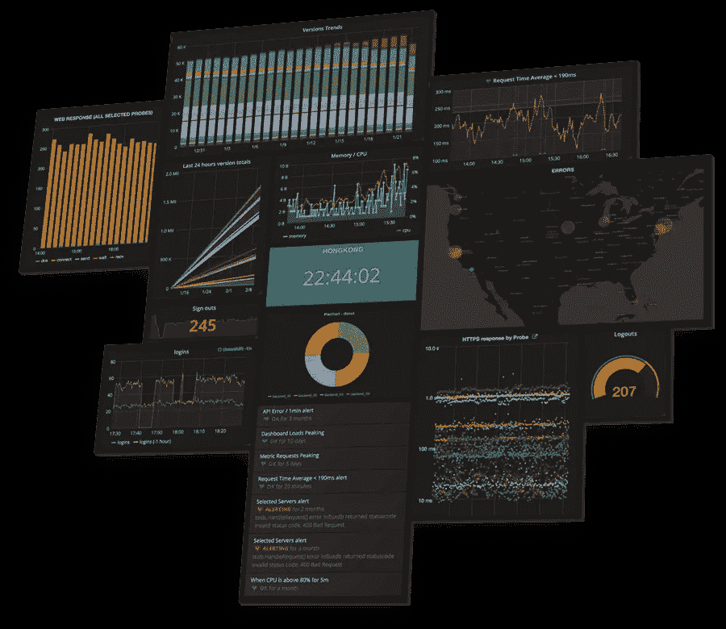
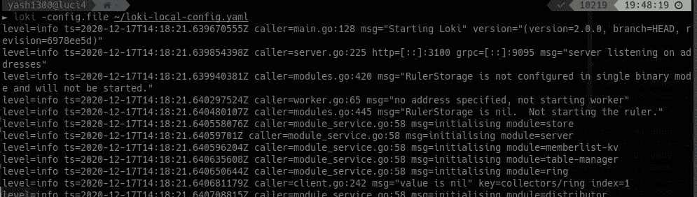
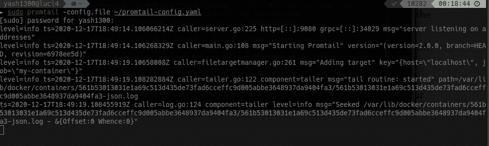
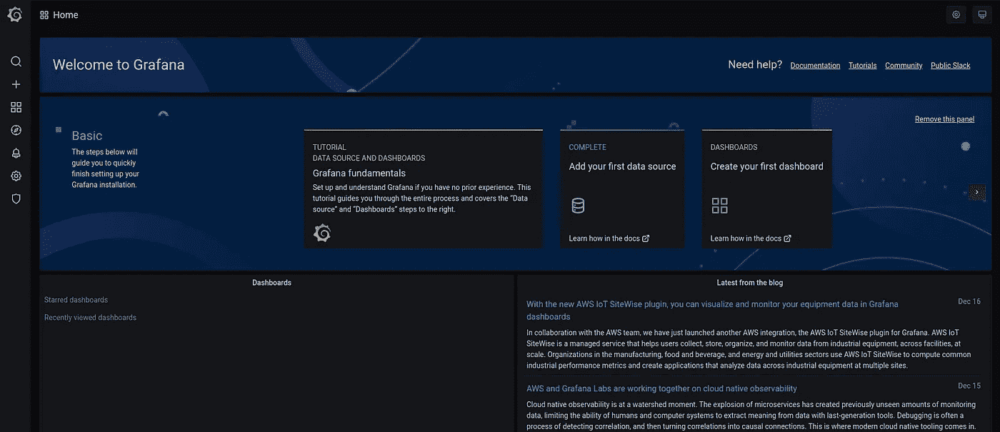
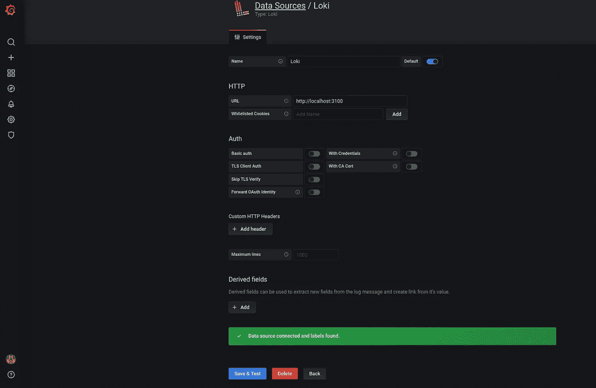
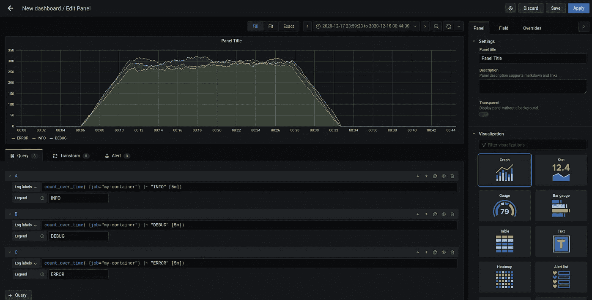
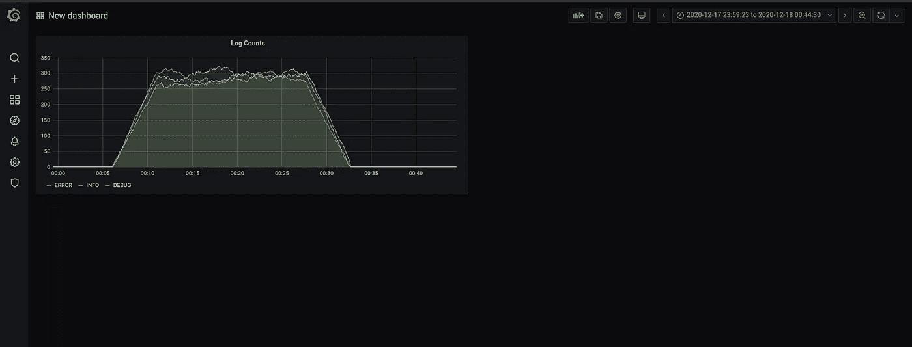
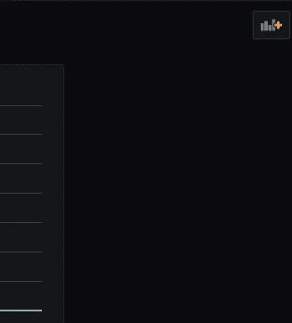
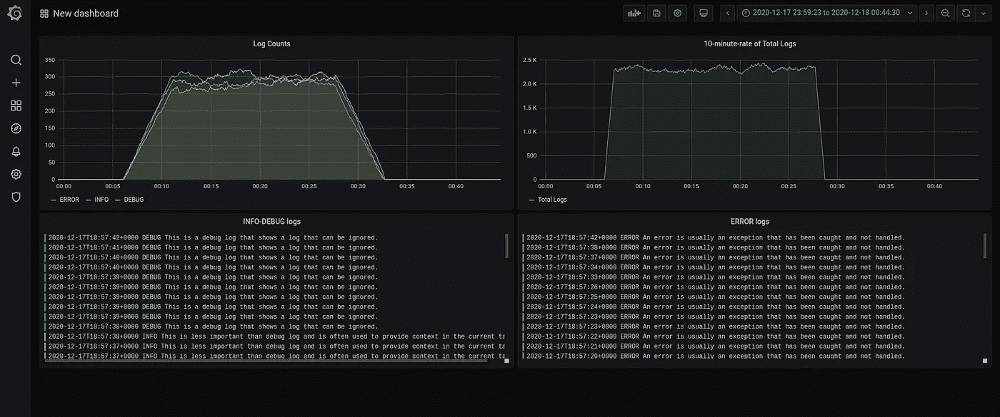

# 以 Loki 的方式监控 docker 容器的日志

> 原文：<https://itnext.io/monitoring-your-docker-containers-logs-the-loki-way-e9fdbae6bafd?source=collection_archive---------1----------------------->

大家好。最近，我的一个朋友偶然发现了一个任务，可以方便地监控 docker 容器的日志。

当然，现在可以使用`docker logs`命令来跟踪任何容器的日志，但不能监控它们。我所说的监控是指，比如说，在你的日志的帮助下，在折线图或任何其他类型的可视化上，可视化你的容器中每小时发生的 stderr 的数量。

因此，在这篇博客中，我将带你轻松完成上述任务。



[https://grafana.com/img/home_panel_collage1.png](https://grafana.com/img/home_panel_collage1.png)

# 让我们首先深入研究这个问题

我们的容器把它的日志放在某个地方，比如，在某种`.log`文件中。我们所需要的是一个工具，它可以收集和聚合这些日志，并查询这些日志，以发现诸如 4xx 的数量或“err”日志的数量等信息。

另一个工具是把这些数字用图表显示出来。

## 我们在哪里可以找到我们容器的日志？

每个容器的日志都存储在其内部的某个地方，因为任何容器基本上都是一个在它的主机上运行的进程，所以在主机中一定有某个地方必须存储容器的日志。

嗯，那个地方是——`/var/lib/docker/<container-id>/<container-id>-json.log`

其中，`<container-id>`是您想要其日志的容器的 ID。

因此，我们想要跟踪的所有 STDOUT/STDERR 日志都可以在这里找到。

# 让我们探索一下我们将要使用的工具

## 洛基

这是 Grafana 实验室开发的一个奇妙的日志聚合器。如果你知道普罗米修斯，那么就把洛基想象成普罗米修斯，但只是为了日志(而不是度量)。


[https://grafana.com/docs/loki/latest/logo_and_name.png](https://grafana.com/docs/loki/latest/logo_and_name.png)

您可以在 Loki 上查询大量各种各样的日志，而且性能非常好，因为它并不索引提供给它的日志流的全部内容，而是通过 promtail 提供给它的一堆标签来索引日志。说到这个…

## Promtail

它是一个代理(Grafana 的另一个代理),将读取日志文件的内容，并将这些日志发送到 Loki 实例。此外，使用 promtail，您可以进一步向不同种类的日志添加标签。

例如，如果你让 promtail 读取十个`*.log`文件，那么，你可以让 promtail 用一些标识符/标签来标记它们，这样，将来当你监视和查询它们时，你和 Loki 端的 performant 都会很方便，因为日志会在那些标签上被索引。

如果你感到困惑，没关系。我将带你经历这整件事，让你有一个更清楚的想法。

## 格拉夫纳

它是一个可视化不同种类数据存储中的数据的工具。你也可以在 Prometheus、Cloudwatch、InfluxDB 和 Loki(以及许多其他来源)中可视化和监控数据。

我们将创建一个图形/图表/面板(无论你怎么称呼它们)的仪表板来“监控”我们的 docker 容器的日志。


[https://stitch-microverse . S3 . Amazon AWS . com/uploads/domains/grafana-logo . png](https://stitch-microverse.s3.amazonaws.com/uploads/domains/grafana-logo.png)

> 给那些可能会想“为什么这家伙要用 promtail”的人提个醒？他可以通过使用 loki 的 docker 驱动程序客户端简单地完成这项任务。谢谢你的关心:是的，我非常清楚使用 loki 的 docker 驱动程序。尽管如此，我在这里还是选择了使用 promtail 的更长的路线，因为通过这篇文章，我还打算向读者传达如何设置和配置 promtail 以及用它来发布日志:D
> 
> 不过，如果你想深入研究 loki docker 驱动程序的兔子洞，一定要看看这个
> 
> 休息，我期待着写一篇关于实现我们的任务使用 loki-docker-driver too :D

# 装置

## 洛基

## Promtail

## 格拉夫纳

# 设置东西

## 洛基

创建名为`loki-config.yaml`的 loki 配置文件

不要担心，你不需要了解这个 YAML。这些只是 Loki 的一些内部配置，由 Grafana 人员提供。

现在，运行洛基

```
loki -config.file loki-config.yaml
```



最小化这个终端，打开另一个终端来处理其他东西，比如 promtail。

## Promtail

我们必须首先编写一个配置文件，该文件将告诉我们的 promtail 进程有关要读取哪个日志文件、要将哪些标签附加到日志上、这些日志应该被扔向哪个 loki 服务器等等的细节。

在我们的例子中，我有一个容器

```
► docker container ps
CONTAINER ID        IMAGE                          
561b53013031        chentex/random-logger:latest
```

使用这个容器 ID，我们可以找到它的日志在主机上的确切位置。

那就是

`/var/lib/docker/containers/561b53013031*/561b53013031*.log`

> **为什么通配符(*)与容器 id 一起出现？**
> 
> 上面的容器 ID 不是完整的容器 ID。它被截断以适合显示器。但是我们不需要完整的容器 id。所以，通过写`561b53013031*`，我们告诉我们的计算机找到以`561b53013031*`开始的容器

现在，根据以上信息，我们将为我们的 YAML 编写配置(promtail-config.yaml)

现在，用 sudo 运行 promtail(因为它试图抓取的日志文件需要 sudo 权限才能访问)

```
sudo promtail -config.file promtail-config.yaml
```



## 格拉夫纳

*   通过输入以下命令启动 grafana

```
sudo systemctl start grafana-server 
```

*   这将在 [http://localhost:3000](http://localhost:3000) 启动 grafana
*   转到该地址，使用用户名“admin”和密码“admin”登录
*   你会看到这个



*   现在，将光标移至左侧的导航抽屉，悬停在*齿轮图标(倒数第二个)*上，然后单击数据源。
*   点击“添加数据源”并搜索 Loki 并点击它。
*   将打开一个表单，只需输入名称“loki”(或其他名称)和 URL“http://localhost:3100”(因为这是我们的 Loki 服务器运行的地址)
*   然后，点击“保存并测试”。应该是这样的



就这样了。我希望你还和我在一起

别担心，95%的工作已经完成了

# 最后，有趣的部分——可视化

我们将创建一个包含多个图表的仪表板，

*   表示该容器的“信息”和“调试”日志计数趋势的折线图。
*   表示该容器的日志总数的 5 分钟速率趋势的折线图。
*   和其他一些东西:P

在上面的截图中，转到左边抽屉的“+”图标，点击“仪表板”

现在，点击“添加新面板”按钮。这将打开设计一个面板的控制台。

*面板基本上是一个图形或图表*

## 第一个面板—日志计数可视化

我们将让这个面板显示一个折线图，表示我们的容器的“INFO”、“DEBUG”和“ERROR”级别日志的趋势。

这里有一个查询，用于查找我们容器的“信息”级日志。添加到面板窗口下的查询字段。

```
count_over_time( {job="my-container"} |~ "INFO" [5m])
```

> 记住我们的 promtail 配置。我们用`job: my-container`和另一个标签`host: localhost`标记所有的集装箱日志。因此，`{job="my-container"}`告诉 loki 只查询与上述标签对应的日志，这对应于我们容器的所有日志。
> 
> `|~ “INFO”`意味着从上述所有日志中，只过滤那些包含“INFO”一词的日志行。
> 
> 最后，`count_over_time`和`[5m]`告诉 loki 在任意时刻的最后 5 分钟获取以上“信息”级别日志的计数。因此，如果我在晚上 10:00 执行这个查询，它将返回从晚上 9:55 到晚上 10:00(最后 5 分钟)的“INFO”级别日志的计数。

单击“*添加查询*”按钮，类似地，粘贴以下查询以获取“调试”级别日志的 5 分钟计数。

```
count_over_time( {job="my-container"} |~ "DEBUG" [5m])
```

单击“*添加查询*”按钮，类似地，粘贴以下查询以获取“调试”级别日志的 5 分钟计数。

```
count_over_time( {job="my-container"} |~ "ERROR" [5m])
```

看起来就是这样



编辑面板标题(如果您愿意),并点击右上角的“应用”。



仪表板，应用上述面板后

## 第二个面板—总日志的 10 分钟速率

该面板将显示由容器生成的日志总数的 10 分钟比率。



点击此按钮(右上角)在同一个仪表板中创建一个新面板，然后点击“添加新面板”

使用以下查询获取 10 分钟内的日志总数。

```
rate( {job="my-container"} [1m] )*10*60
```

> 这里，`{job="my-container"}`正在获取容器的所有日志。
> 
> `rate`和`[1m]`正在获取过去 1 分钟内“每秒”接收的日志数量。例如，从晚上 9:59 到晚上 10:00(从晚上 10:00 开始的最后一分钟)，添加了 120 个日志条目。因此，`rate`和`[1m]`会给出每秒的速率= 120/60 = 2
> 
> 最后，`10*60`用于将上述“每秒”速率转换为“10 分钟速率”(10 分钟= 10*60 秒)

编辑面板标题并应用它。

您甚至可以创建一个日志面板，在面板窗口上显示日志(文本日志)。

例如，以下查询将跟踪“错误”日志

```
{job="my-container"} |~ "ERROR"
```

## 仪表板最终看起来怎么样



# 我想就这样吧

如果你能到达这里，非常感谢。

我希望您喜欢这篇文章，并理解如何使用 Loki/Promtail/Grafana 监控容器的日志。此外，正如我提到的，我期待着写一篇文章，通过使用 loki-docker-driver 客户端更方便地完成上述任务。所以，敬请关注:)

如果您有任何疑问或其他问题，请在下面的评论中提出，或者我们也可以联系:

推特—[https://twitter.com/yashkukreja98](https://twitter.com/yashkukreja98)

LinkedIn—[https://www.linkedin.com/in/yashvardhan-kukreja](https://www.linkedin.com/in/yashvardhan-kukreja)

再见！