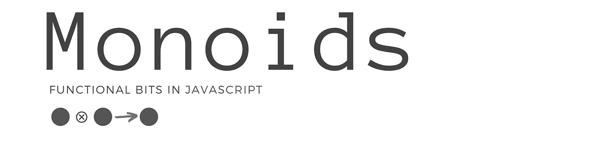
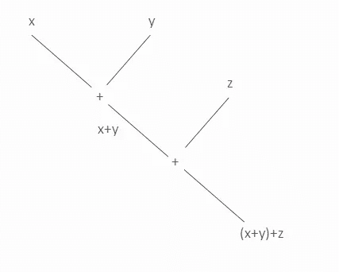

# Javascript 中的幺半群

> 原文：<https://itnext.io/monoids-in-javascript-6ee1eab7a18f?source=collection_archive---------2----------------------->



或者，范畴理论的基本概念是幺半群的概念

—工作数学家的类别

> 维基百科说一个**幺半群**是一个[代数结构](https://en.wikipedia.org/wiki/Algebraic_structure)，带有一个单一的[结合](https://en.wikipedia.org/wiki/Associative)二元运算和一个[单位元](https://en.wikipedia.org/wiki/Identity_element)。任何具有这两个元素的结构都是幺半群。

假设 s 是一个[结构](https://en.wikipedia.org/wiki/Set_(mathematics))而⊗是某个[二元运算](https://en.wikipedia.org/wiki/Binary_operation) S ⊗ S → S，那么 s 与⊗是一个**幺半群**如果它满足以下两个公理:

```
1\. **Associativity**:   (a ⊗ b) ⊗ c = a ⊗ (b ⊗ c) holds.2\. **Identity element**: There exists an element e such that for all **a** e ⊗ **a** = a ⊗ e = **a** 
```

让我们以整数为例，我们可以把加法看作是两个整数之间的二元运算。



添加的是[联想](https://en.wikipedia.org/wiki/Associative)。这意味着加法的顺序并不重要。

```
(x+(y+z)) = ((x+y) +z)
```

并且 0 是用于加法的单位元素，因为:

```
x + 0 = x
```

由于这些**原因，对(+，0)形成整数上的幺半群**。然而，我们可以在整数上形成不同的其他幺半群。

例如，**乘法*也可以看作是一个幺半群，它有各自的单位元 1。这样，对(*，1)** 是整数上的另一个幺半群。

**JavaScript 中的字符串有一个默认的幺半群**，由串联和空字符串(concat，'' )组成。

> 我们将通过定义简单的对象文字在代码中使用幺半群，
> 
> 1.一个返回名为**空**的标识元素
> 
> 2.一个表示二进制操作，称为 **concat** 。

```
var Sum = { **empty**: () => 0, **concat**: (x, y) => x + y }var Product = { **empty**: () => 1, **concat**: (x, y) => x * y }
```

我们会这样使用它:

```
Product.concat(Product.empty(), 5);
```

这个定义允许我们以一种直接的方式将它与列表的 **reduce** 函数一起使用

**或者**，如果我们想要有[闭包](https://en.wikipedia.org/wiki/Closure_(mathematics))[意味着 concat 和 empty 的返回类型与初始对象的类型相同]，我们可以为每个幺半群定义一个新类。

返回类型为 Sum，允许[流畅链接](https://en.wikipedia.org/wiki/Fluent_interface)。您可以运行下面的 jsFiddle:

# 折叠幺半群

幺半群具有这种非常理想的性质，如果我们继续应用这种二元运算，我们总是可以将计算减少到同一类型的单个元素:

```
(M⊗…(M (⊗(M ⊗ M))) → M
```

这叫折叠。我们已经从 js 数组类型中知道折叠为**减少**。然而，在后面的章节中，我们将把 fold 推广为我们称之为可遍历的数据结构。回到折叠，让我们试着导出 reduce。

假设我们有一些 2，4，5，6 的整数序列，我们想把它们相加，这是一个初级问题:

```
var array  = [2,4,5,6 ]var accumulation = **0;** for (let i = 0; i < array.length; i++) { const element = array[i]; accumulation =  accumulation **+** element}
```

我在那里强调了幺半群的元素。所以，我们来抽象一下。如果我们用任何其他幺半群替换(0，+)这应该是可行的，那么为什么不抽象和重用。

现在我们可以对所有的幺半群使用这个函数

```
var sum = fold([2, 4, 5, 6],
       { empty: () => 0, concat: (a, b) => a + b })var product = fold([2, 4, 5, 6], 
      { empty: () => 1, concat: (a, b) => a * b })var max = fold([2, 4, 5, 6], 
     { empty: () => -Infinity, concat: (a, b) => Math.max(a, b) })
```

**你可能会认出这其实就是** [**array.reduce**](https://developer.mozilla.org/en-US/docs/Web/JavaScript/Reference/Global_Objects/Array/reduce) 。reduce 只不过是 for 循环的抽象。