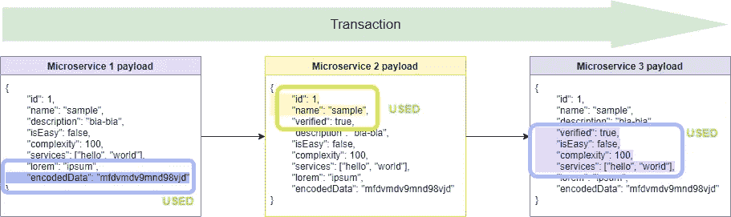

# 整体服务与微服务。

> 原文：<https://itnext.io/monolith-vs-microservices-a2754bfdf3d1?source=collection_archive---------0----------------------->

测试微服务的难度有多大？

与任何技术一样，我看到了微服务的优势和劣势，这在很大程度上取决于正确的架构和使用方法。

monolith——作为单一系统的软件，可以在单一服务器上部署和运行。负责不同业务逻辑的所有模块都放在一个程序中，在一个进程中运行。

微服务允许您执行与整体服务相同的工作。但是微服务根据“一个模块-一个任务-一个容器”的原则将模块分发到单独的虚拟机-容器中，并使用虚拟网络将它们链接起来。

从测试的角度看微服务架构:

1.  微服务整体很难测试。例如，在 90%的情况下，如果不首先创建与之相关的所有服务的模拟，就无法运行单个微服务来测试其 web 服务。如果你的开发团队没有时间做模拟，你可以忘记集成测试。单片通常更容易——你可以很容易地在本地部署你的系统并测试它。
2.  在微服务架构中，很难管理数据。每个微服务可以有自己独立的数据库，与其他微服务的数据库无关。
    从自治的角度来看，这是正确的，“但是”:如果我们正在测试的系统中的实体(对象)是由各个微服务的更小的实体组成的，那么数据库就无法保证它们的完整性。对于每个微服务中的数据连接，您需要创建一个单独的机制。该机制用于存储其他服务的实体 id。问题是一个微服务的数据可以被擦除，只有在测试阶段(或者生产阶段)才能发现错误。而且在数据的创建/替换过程中，你需要记住一些对象的 id，以便保存到其他微服务的数据库中。
3.  微服务很难做到事务性。

**事务—** 一组顺序的数据库操作，是处理数据的逻辑单元。一个事务可以作为一个整体成功地执行，尊重数据的完整性，并且独立于并行运行的其他事务，或者它根本不能执行，然后它不应该产生任何影响。

微服务中的事务测试遵循以下场景。第一个服务进行数据更改，并将它们传递给第二个服务。第二个服务对其数据进行更改，并将其传递给第三个服务，然后发生错误。不仅仅是一个错误，而是一个未处理的空指针异常。

测试未通过，前两个微服务的数据与其他微服务不匹配，您需要手动清理它们。此外，为了确保不同微服务之间的事务性，开发人员需要编写更多的代码，更多的 web 服务进行反馈(这需要更多的时间进行测试)。最糟糕的是，从整个系统的角度来看，错误发生在哪个微服务中可能并不明显，您需要获取所有相关服务的日志和数据并进行检查。

在 monoliths 中，事务性通常在数据库级别得到保证。

4.微服务在大多数情况下是建立在不同的通道和协议上进行交互的。当你开始开发一个新系统时，每个开发人员都梦想有一个简单而通用的界面。

“让我们所有的微服务仅通过 REST 进行交互”然而，在开发过程中，每次都会出现以下情况:

*   这个微服务只通过 SOAP 通讯，我们什么都不会，我们会用 SOAP。
*   要实现这个功能，你需要同时和异步地把信息传递给几个微服务，我们就用 JMS。
*   我们有一个遗留系统，它只通过自己的基于 TCP 的协议工作。
*   我们需要保证数据同步，所以我们的服务会将数据写入一个单独的数据库，另一个服务会读取它。

每个新的通信信道都使测试变得复杂，并且通常需要安装特殊的软件才能工作。

5.很难对微服务系统进行自动化 UI 测试。事实上，开发自动化脚本很容易。当我们试图将自动测试添加到 CI / CD 时出现问题。

当系统包含 2 个以上的微服务时，困难就开始了:

在哪里执行回归测试？在 Jenkins 中，你需要创建大量的模拟。
但是如果在试运行期间开始部署另一个微服务呢？
将所有构建放入队列中？
如果队列变大了呢？

每个问题都会引发许多其他问题。因此，最有效的权衡是在一个单独的环境中运行测试，只针对自动化脚本(控制数据)，并手动调整到该单独环境的部署。

此外，编写小型测试集并在本地运行它们来帮助手动测试要高效得多。

整块石头很简单:

新版本。
自动化脚本。

6.微服务需要更多的端点和服务之间的数据。Monolith 可以包含许多为执行程序的业务功能而设计的 web 服务。但是微服务会有更多，因为，除了同样的服务来执行业务功能，我们增加了更多的技术服务来连接微服务。每个人都需要测试。

每个 web 服务必须同时传输更多的数据，因为第一个微服务会将数据传输到第二个微服务，第二个微服务使用两个条件字段进行计算(例如，只检查 ID)，而所有剩余的数据会传递到下一个对它们有用的服务。

数据越多，测试中出错的可能性就越大。因此，没有必要检查所有可能的参数组合——这里只需要将测试集中在风险最大和优先级最高的场景上。

7.在微服务中，更难找到错误的根本原因。测试仪的基本说明要求，在发现缺陷的情况下，有必要使用所有先决条件、步骤和预期结果来重现它。然而，每个测试人员都知道，在复杂系统的情况下要想成功修复，最好是找到缺陷的根本原因，添加日志和数据，以免得到无法重现的结果。在微服务中，如果一个用户操作引起连锁反应，涉及许多系统，这可能会成为一个真正的问题。

发生错误是因为微服务代码中的错误还是因为另一个服务传递给他错误的数据？或者可能代码根本没有错误，只是操作超时结束，问题出在基础设施？更糟糕的是，如果缺陷发生在产品中，测试人员无法访问的数据库和日志。

8.微服务需要大量的资源。我记得我在 Tomcat 上有许多小的测试服务器，有几千兆字节的内存，我可以自己部署产品的新版本并开始测试。甚至重新部署以前的版本来确定错误出现的确切时间。目前，微服务系统的测试环境需要 64 GB 或更多。当系统中存在资源限制时，它会导致缺陷和无法及时添加另一个包含测试的容器。每个微服务容器——它自己的虚拟机——都使用资源。在 monolith 的情况下(如果需要，也可以打包到 Docker 中)，我们只有一个服务器或虚拟机。

总而言之，这篇文章中有很多批评，可能会给人一种我是技术的强烈反对者的印象，但事实并非如此:

微服务被设计成小而独立的。如果在测试过程中出现了问题，而团队不想在测试中提供帮助，您应该永远记住。测试是团队的责任。

自动化 UI 测试对于微服务系统来说是很困难的。如果你只是拿着 Selenium 写自动化脚本，UI 测试总是很难。您应该尝试引入在单独的环境中部署应用程序并运行自动化脚本的实践。

在微服务中，很难找到错误的根本原因。这是可以理解的痛苦。现在有很多工具可以简化生活。Zipkin，日志可以通过 ELK 查看，是的，测试人员需要足够熟练才能进入容器并查看哪里出了问题。

下面我将给出一些有用的提示，这些提示将极大地方便您测试微服务时的生活:

*   有必要请求尽可能多的权限来使用环境——用于获取日志和连接到容器的控制台实用程序可以极大地简化生活。
*   有必要要求将容器(日志、文件)的所有关键信息存储在永久存储(数据库、FTP、共享文件夹)中。
*   你应该熟悉 Docker。
*   不要预先创建大量的测试数据——它们会很快失去相关性。
*   不仅从需求方面，而且从架构方面不断地检查开发的系统——这将更容易理解什么和哪里可能出错。
*   一定要测试负载，以识别瓶颈和时间缺陷。