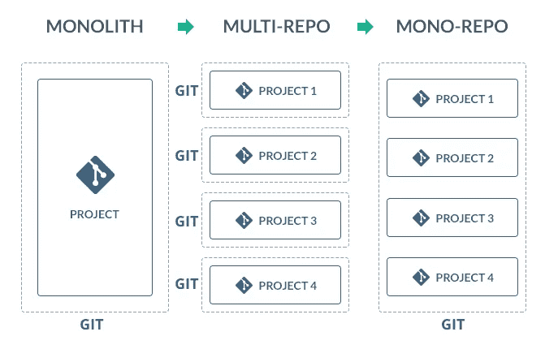
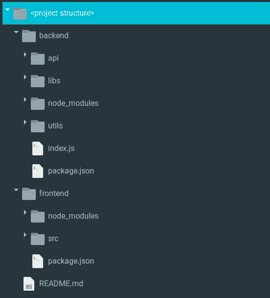
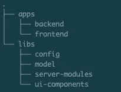
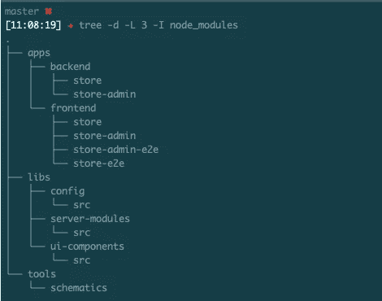

# 角单孔疼痛

> 原文：<https://itnext.io/monorepo-pains-9064db3b9882?source=collection_archive---------0----------------------->

# 以及如何克服它们



图片借用自[https://code fresh . io/continuous-integration/using-code fresh-with-mono-repos/](https://codefresh.io/continuous-integration/using-codefresh-with-mono-repos/)(我找到的最能形象解释 monorepos 的一个)

几个月前，我们的 CTO 休假回来，告诉我们他协助了 [NG Conf 2019](https://www.ng-conf.org/) 。一次伟大的经历使他得出这样的结论:

> *“我们应该像谷歌一样发展，使用单一回购”*

(奇怪的是这很像 [NWRL.io](https://nrwl.io/) 的广告语)。

一开始，作为一个资深开发者，这并没有太大的意义。我们公司运行几个项目，每个项目都有自己的 git 库，每个项目都有自己的文件夹结构、依赖项和部署工具链。当然，过了一段时间，在阅读了大量文章后，我仍然没有发现将我们所有的逻辑都改为 *monorepo* 有太多的意义，但它最终确实有意义。

# 顺便问一下，什么是 monorepo？

我借用 [Codefresh](https://codefresh.io) 的图应该够清晰了。

一个典型的旧式项目通常是单一的，一个巨大的项目，某种程度上解决了组织的需求。可悲的是，monolyth 通常缺乏良好的开发实践，是高度耦合的，并且几乎不可能扩展。

过度简化现实，当组织承认其自身的缺陷时，它通常会试图转移到更好的方法；这是将它能从 monolyth 中分离出来的东西分离出来，并致力于几个较小的项目，以某种方式解决较小的需求。耦合更少，但是集成每个新层需要大量的工作。这是一个明显的进步，但是对于来自单一宇宙的组织来说，集成无疑是一个灾难。

如果组织中的每个项目或大多数项目在它们之间共享某些组件(前端组件或后端库)，并且在查看源代码后，您发现所有项目之间有太多重复的模块、组件或逻辑，并且许多项目与同一级别的其他项目交互，那么 *monorepo* 是有意义的。

monorepo 是一个单一版本控制的存储库，它包含许多独立的项目，就像它们是一个单独的项目一样。这个想法是统一共享代码，避免重复逻辑，促进团队协作和其他相关的魔术。

看起来不错，对吧？整个组织的双赢局面。
Ehmmmm…，好，好，大概[没那么好](https://medium.com/@mattklein123/monorepos-please-dont-e9a279be011b)，但是好。正如该条所述:

> 坦率的现实是，在规模上，一个组织在代码共享、协作、紧密耦合等方面做得如何。是工程文化和领导力的直接结果，与使用 monorepo 还是 polyrepo 无关。

采用单一回购策略不会没有痛苦。

# 如何采用单一回购策略？

有一些工具可以简化这个过程。 [Hackernoon](https://hackernoon.com/4-ways-to-go-monorepo-in-2019-ea5d19fc1f08) 列举几个:

*   [钻头](https://bit.dev/)
*   [蕾娜](https://lerna.js.org/)
*   [Git 子模块](https://git-scm.com/book/en/v2/Git-Tools-Submodules)

正如大多数情况下，可能符合你自己用例的解决方案是高度自以为是的，所以我的建议是*“你自己选毒”*。monorepos 没有灵丹妙药，所以我会告诉你我们的情况。

# 我们是如何采用单一回购策略的？

首先我必须说我们没有使用 Hackernoon 的任何建议。我们公司以 NX.dev 关于 [Monorepos 和自动化](https://nx.dev/angular/fundamentals/monorepos-automation)的文章为起点。

我们的大多数项目都是带有 NodeJS 后端的 Angular 前端项目，其结构如下:



一个 ***前端*** 文件夹，有自己的 *package.json* ，一个 ***后端*** 文件夹(前端的后端 api)，也有自己的 *package.json* 和一个 ***toolchain*** 文件夹(不在镜像中)，有一些部署脚本，通常每个环境一个脚本。

所以我们的第一个目标是把这个结构转换成一个 *monorepo* 结构，NX.dev 建议的 *monorepo* 结构。这将导致一个单独的 ***package.json*** 和一个单独的 ***node_module*** 文件夹。

所以痛苦开始了…

# 单报告疼痛

## 痛苦 0。拥抱你的 monorepo 工具

无论您选择什么工具来迁移项目，都会发生这种情况。您必须了解您选择的 cli 工具、所有选项(或者希望是大部分选项)、所有参数。正如我之前提到的我们选择了 [Nrwl.io](https://medium.com/u/2817fb68583?source=post_page-----9064db3b9882--------------------------------) 的 nx 工具作为我们的毒药。

学习每一个命令变体其实并不困难，你可以在创建自己的 *monorepo* 项目结构时轻松地学习它们，在我们的例子中，通过遵循[入门指南](https://nx.dev/angular/getting-started/getting-started)和 Nx 教程。

一步一步的命令行:

```
# Create your monorepo
npm init nx-workspace monorepo-project# Go to your new project folder
cd monorepo-project# Install the schematics for each sub-projects
npm install --save @nrwl/angular
npm install --save @nrwl/express
npm install --save @nrwl/node# Create the container folders for every sub-project to be included
# more on this later
```

## 痛苦 1。在您的单一回购中包含单一回购项目

您的组织可能来自单一回购宇宙和您的所有项目，无论它们是否共享任何代码、组件或配置，都存在于单一回购中。在我们的例子中，我们使用(仍然使用，因为有一个应用程序不适合 *monorepo* )私有位桶回购，克隆每个位桶类似于:

> git 克隆[git@bitbucket.org](mailto:git@bitbucket.org):your _ organization/your _ single _ repo _ project . git

将上面的代码行修改为 *monorepo* 也可以工作，它将克隆整个巨型项目，其中包含所有子项目。请记住，这将在未来发生，每次您需要在代码中提取最后的更改时，您将提取整个 *monorepo* 。

要做的第一件事是准备你的*单一回购*项目结构，以便它包括所有打算由*单一回购*吸收的单一回购:

```
# Create the container folders for every sub-project to be included
ng g [@nrwl/angular](http://twitter.com/nrwl/angular):application frontend/store
ng g [@nrwl/angular](http://twitter.com/nrwl/angular):application frontend/store-admin
ng g [@nrwl/express](http://twitter.com/nrwl/express):application store --frontendProject=frontend-store
ng g [@nrwl/express](http://twitter.com/nrwl/express):application store-admin --frontendProject=frontend-store-admin
ng g [@nrwl/angular](http://twitter.com/nrwl/angular):lib ui-components
ng g [@nrwl/node](http://twitter.com/nrwl/node):lib server-modules
ng g [@nrwl/node](http://twitter.com/nrwl/node):lib config
```

在上面的示例中，我们生成了以下结构:

*   前端:
    -商店
    -商店-管理
*   后端:
    -商店
    -商店-管理
*   库:
    -ui-组件
    -服务器-模块
    -配置

其中 store 和 store-admin 是不同的项目，存在于它们自己的单一回购协议下，并且它们中的每一个都有自己特定的后端。起初，你可能会发现这两个项目有很多共同点。也许是一些 UI 组件，也许是一些配置；因此， *monorepo* 背后的想法之一是最小化(或减少)重复代码。

到目前为止，我们只有项目占位符，但是项目的真正代码还没有包括在内。因此，我们需要在 *monorepo* 中包含我们的单一回购代码。

我是这样做的:

```
# Pull latest changes in the develoment branch
git pull# Create a local feature for including the single repo on the monorepo
git flow feature start singlerepo-store# Add the remote for the store frontend
git remote add store-front git@bitbucket:user/store-frontend
# Fetch the code from the recently added remote
git fetch store-front
# Create a new branch from this remote using the develop branch
git branch store-front-src store-front/develop
# Now you are on the store-front-src branch, you can edit
# code, create new folders, move files, etc. Be sure to commit any
# changes but DO NOT PUSH THEM. We want to keep them local.
# Do as many changes required to match the folder structure of 
# the monorepo. Remember to delete all non-used files.# Return to the feature branch
git checkout feature/singlerepo-store
# Merge the code with the adjusted code from the single repo branch
git merge --strategy-option=theirs --allow-unrelated-histories store-front-src
# Make final adjustments to your code, check if everything works. 
# If you have new dependencies from the single repo, include them 
# on the package.json and do an npm install# Once everything works finish the feature
git flow feature finish singlerepo-store
```

你必须为每个包含在 *monorepo* 中的子项目重复这些步骤。
**重要的**:不要只是照抄&粘贴剧本的台词，试着去理解自己在做什么，为什么要做。将 repo URL、项目名称和分支名称更改为您自己的名称。理解，然后让它发挥作用。

## 痛苦 2。保存代码历史

在大多数情况下，来自单一回购领域意味着在采用 *monorepo* 之前已经有了很多发展，因此每次提交都有很多历史。在与 git 脚本斗争了一段时间后，我了解到 [git 跟踪内容而不是文件](http://thisbythem.com/blog/preserving-history-when-renaming-files-in-git/)，但我也认为文件重命名或甚至 git mv 执行都不符合干净地保存代码历史的需要。

所以我来到了一个[旧脚本(2014)](https://gist.github.com/emiller/6769886) ，它使用 git filter-branch 移动文件，同时保留它们的历史。做什么广告，但是…它很慢。该脚本接受给定的每个参数，并重写整个历史，因此如果您有许多提交，并重命名许多文件，将需要几个小时才能完成。此外，对于许多文件，我的建议是将它们分成块，并在处理完每个文件后提交/推送新的更改。当一个巨大的进程因为一些奇怪的提交而失败时，我用头撞了很多次键盘。

一个有效的策略是首先使用 *git mv* 重命名文件，例如，我们必须从*重命名我们所有的后端文件。js* 至*。ts* 之后，我们不得不调整代码，使其具有严格的类型，但是将 js 重命名为 ts ( *Javascript* 到 *Typescript* )是一个起点。

为此，我们使用了以下命令行:

```
find project-folder -name '*.js' | awk -F '.js'  '{ print $1 }' | xargs -i echo "git mv '{}.js' '{}.ts' && git add -A '{}.ts'"
```

这将搜索所有。 *js* 文件放在*上。/project-folder* ，剥离*。js* out，并生成一个新的命令行，如下所示:

```
git mv 'project-folder/src/index.js' 'project-folder/src/index.ts' && git add -A 'project-folder/src/index.ts'
```

请注意引号，这样就不会有文件名包含空格或其他麻烦的特殊字符的问题。执行这个命令可能需要一段时间，但没有 *git-mv-with-history.sh* 脚本那么长。

重命名文件后，您可以应用[脚本](https://gist.github.com/emiller/6769886)来重写文件夹历史。脚本的注释在用法上非常清楚:

```
# Given this example repository structure:
#
#   src/makefile
#   src/test.cpp
#   src/test.h
#   src/help.txt
#   README.txt
#
# The command:
#
#   git-rewrite-history README.txt=README.md  \     <-- rename to markdpown
#                       src/help.txt=docs/    \     <-- move help.txt into docs
#                       src/makefile=src/Makefile   <-- capitalize makefile
#
#  Would restructure and retain history, resulting in the new structure:
#
#    docs/help.txt
#    src/Makefile
#    src/test.cpp
#    src/test.h
#    README.md
```

我建议在进行最后的步骤，将单一回购项目包括在 *monorepo* 中之前，使用关于这个问题的说明调整项目的结构。看看哪些适合您自己的用例。

## 痛苦 3。迁移到 Angular 8(正面)和 Typescript(背面)

我们公司有几个项目运行在 Angular 6 上，其他项目运行在 Angular 7 上。每个后端项目都是使用普通的旧节点开发的。JS Javascript 文件。NX.dev 工具前端使用 Angular 8，后端使用 Typescript。

迁移到 Angular 8 是一个相当容易的任务，Angular 团队提供了一个迁移的原理图，以及一些[相当清晰的说明](https://update.angular.io/#7.0:8.0)，并且两者几乎都处理好了一切。只需运行:

```
ng update @angular/core --from 7 --to 8 --migrate-only
```

你必须仔细检查:

*   路由定义，不再使用 *loadChildren:'。/page/page . module # page module '*通过字符串但使用动态导入
*   每个 *@ContentChild* 和 *@ViewChild* 上的额外参数 *{ static: true|false }* 。您的里程数可能会有所不同，但是静态的:false 通常适用于大多数情况。
*   任何中断的依赖关系。

迁移到 Typescript 可能是一次全新的冒险。在我们的例子中，我们必须通过 ES5-ES6 代码迁移，然后应用一些类型脚本魔法。请注意，在迁移阶段，您的所有团队都必须参与进来，并且您将每分钟都收到关于*“某些东西不工作”*的报告。Typescript 很棒，就像 Javascript、严格类型化语言和 OOP 原则之间的完美结合，但是要注意，过去在普通的旧 Javascript 上工作的东西在从 Typescript 转换过来后可能就不工作了。

来自 Github 上 Typescript 3.5 线程的 [*Google 反馈:*](https://github.com/microsoft/TypeScript/issues/33272)

> 我们相信大多数这些改变都是有意的，旨在改进类型检查，但我们也相信 TypeScript 团队理解**类型检查总是在安全性和人机工程学之间进行权衡。**

痛苦 4。分离可重用代码

monorepo 背后的主要决策之一是重用代码/避免重复代码。当在*单一回购*中包含单一回购项目时，一个巨大的任务是找到重复的代码。但不仅仅是可以在库上重构的重复代码，还有共享的 UI 组件，共享的配置，可以以某种方式重写或抽象的类似方法。

这将需要运行并检查每个子项目的所有代码，然后将一些代码重构为公共或共享模块，然后重复 gain，直到您的团队感觉完成为止。除非你这么说，否则这没有终点，这个想法是以一种智能的方式重构代码，而不会破坏团队对每个项目的理解。

在我们的例子中，每个后端都有一些我们正在使用的 ORM 的模型定义，这是我和 [Sequelize](https://sequelize.org/) 之间的爱恨关系。每个子项目共享相同的数据库配置，以及一些安全策略配置和一些外部库配置。所以大部分的工作是将所有的模型定义连接成一个单独的模型库，为所有的子项目所共用，合并所有的配置文件和重构每个子项目的库导入。

我们最终得到了如下的项目结构:



我们所有的前端项目都在*应用/前端*文件夹中，我们所有的后端项目都在*应用/后端。*

## 如何运行 monorepo 子项目？

使用 *NX.dev* 工具创建 *monorepo* 时，会要求您在 *angular-cli* 或 *nx-cli* 之间进行选择。由于我们的项目是带有 NodeJS + Express.js 后端的基于 Angular 的前端，我们使用的是 *angular-cli* 。

另外，NX 提供了几个 *npm run* 脚本来运行每个项目和做其他事情。在幕后，每个脚本都使用带有一些额外参数的 *ng* 命令，每个 *ng* 命令都引用 *angular.json* 文件中的某个部分。

例如，如果我的项目是 *frontend/store、frontend/store-admin、backend/store、backend/store-admin* 和一些共享库:

*   ***【NPM 启动前端-存储- -o*** :运行存储前端项目。额外的双破折号 o 将-o 参数传递给底层的 ng 命令，以便打开浏览器。您需要传递的任何额外参数都需要前面的双破折号。
*   ***npm 启动后端-商店*** :运行商店后端项目。请注意，由于我们的项目位于 *apps/frontend* 和 *apps/backend* 文件夹下，因此 *npm start* 命令的项目名称需要在 frontend 或 backend 后面加一个破折号(取决于您想要运行的项目)。
*   ***NPM run build back end-store-admin--configuration = local-dev:***使用 *local-dev* 环境配置构建商店管理后端项目。当指定不同的环境时，您可以配置构建，以便它根据环境替换一些文件。该项目构建在*dist/apps/back end/store-admin*文件夹中。

假设您已经配置了一个名为 *local-dev* 的额外环境，它指向一个本地数据库，而不是实际的开发数据库。要使用此环境运行商店后端，您必须执行以下命令:

*export NODE _ ENV = local-dev&&NPM run build back end-store-admin--configuration = local-dev&&NODE dist/apps/back end/store-admin/main . js*

这个命令将 *NODE_ENV* 变量设置为 *local-dev* (有一点可能你不需要它，除非你有任何依赖于系统环境变量的配置)；使用本地开发设置构建存储管理后端；最后执行编译好的 *main.js* 文件运行后端。

如果记住所有命令参数对你来说很难，你可以在 *package.json* 文件的*脚本*部分添加一个新的*脚本*。相信我，无论如何你最终都会知道这些参数的。

## 痛苦 5。调整相关性

重构代码是一回事，许多导入将不得不改变，以便它们可以使用新的共享库和模块。必须添加一些代码行，删除一些代码行，到处都要修改。而当你觉得一切都准备好运行的时候， ***一切都会惨败*** (大部分时候)。

那个漂亮的组件库，那些额外的 ngPipes，那个 NodeJS 库，所有那些奇迹:

*   没有为角度≥8°的兼容性做好准备；信不信由你，它仍然发生
*   不能作为 ES6 模块导入
*   由于缺少@types，无法在 Typescript 中使用

因此，你必须去每个项目回购(希望他们有)，阅读报告的兼容性问题，更新版本(并打破你自己开发的功能)，应用变通办法。最坏的情况是不得不移除冲突的包，找到可用的替代包，重构更多的代码。

如果你幸运的话，开发团队没有使用一个没有声誉的用户开发的库，而是使用一个背后有巨大社区的用户开发的库，那么调整依赖关系就不会那么痛苦了。不管怎样，这仍然是一种痛苦。

## 痛苦 6。部署工具链

在单个回购宇宙中，部署工具链是"*简单的*":

*   听取项目主分支上的更改
*   简单的构建(没有额外的参数)
*   [蓝绿部署策略](https://docs.cloudfoundry.org/devguide/deploy-apps/blue-green.html)(针对云代工厂或类似的持续交付云服务)。

在 monorepo 上，事情不再那么简单了。

*   有一个巨大的项目，包括所有其他子项目。如果每个子项目都没有特定的分支，那么当主分支上有新的提交时，您必须禁用自动部署。这是对**疼痛*7*疼痛**的解释。
*   编译需要特定的项目参数。好吧，这没那么糟糕，只是在构建指令中增加了几行。
*   蓝绿色部署保持不变。

到目前为止还好吗？没有。问题在于单一回购协议本身。因为所有项目都包含在子项目中，所以它们的依赖项也必须包含在子项目中。如果您有许多不同的项目，预计会有许多库，所以部署规模会在没有必要的情况下增加，只是因为 *npm install* 命令不知道哪个项目需要哪些库。巨大的 *node_modules* 文件夹可能会导致部署失败。

***我们所做的*** :在服务器部署阶段，我们定制了 *package.json* 文件，这是一个节点脚本的结果，该脚本使用一个包黑名单来构建文件，因此它不包含任何不需要的包。我们特别小心地排除了大型软件包，如 *jest* 、 *cypress* 、 *webpack bundle analyzer、*和大多数 *angular* 依赖项。我们的前端项目在编译阶段失败的几率比我们的后端项目在部署阶段失败的几率要小，顺便说一下，IBM 部署可能会因为那天风刮得很大而失败…

我们还对我们的部署工具链做了一些小小的调整，主要是编写脚本来简化未来的部署:

*   构建脚本 ow 包含一个清理行，因此它会删除最终部署中不需要的所有内容。它还指定了必须构建什么项目。其余的几乎和原始的一样，但是构建阶段在克隆项目之后被包含进来。自动部署被禁用，现在每当我们需要一个新的部署，我们必须手动运行任务(也不是那么可怕)。
*   部署阶段在运行之前进行一些初始检查，这样它就不会在第一次运行时失败，因为第一次运行时没有项目要备份。该脚本将项目、子域名称和应用程序名称作为参数，因此很容易调整每个子项目的设置。只有在少数情况下需要额外的定制。

不那么痛苦，但无论如何是一种痛苦。它需要检查每个项目的部署工具链，测试它，并设置它。这里还是没有魔法。

## 痛苦 7。部署单个 monorepo 子项目

*单一回购*在一个未详细说明的定义中，是指依赖于一个单一回购协议的许多回购协议，或作为一个单一项目的许多项目，它们共享一些共同的组件、配置、模块等。这些项目中的许多都有不同的开发节奏，并且可能比同一个 *monorepo* 中的其他项目遭受更快的变化。

据我们所知，Nx tool 没有提供一种方式来包含新的应用程序或库，这些应用程序或库存在于其他回购上(就像它们是单一回购应用程序一样)，作为 [git 子模块](https://git-scm.com/book/en/v2/Git-Tools-Submodules)。所以每个新应用程序都存在于同一个巨大的 *monorepo* 上。除非你的项目使用一个非标准的分支模型(*注意后面的*)，其中每个 *monorepo* 都有它自己的*“主分支”，*每个来自主分支或发布分支的部署将会拖拽可能还没有发布的变更。

举个例子，假设你的 *monorepo* 有如下结构:



为此做了一个样本项目

*   前端:
    -商店
    -商店-管理
*   后端:
    -商店
    -商店-管理
*   库:
    -ui-组件
    -服务器-模块
    -配置

假设您的部署链监听任何主分支提交，并在某个云提供商上运行部署管道。

自从第一个版本以来，商店管理的前端几乎没有变化，但是商店总是在改进，所以代码变化很大，并且还有许多版本在进行中。如果您的 monorepo 依赖于单个 repo，因为它是一个非常大的项目，每次 store 项目需要部署时，store-admin 也会被部署，即使它没有任何更改。

此外，如果在将项目合并到主*分支*之前，有任何项目的变更必须被审查和批准(然后触发每一个自动部署)，这些变更将被包括在内，除非团队对每一个必须被有效包括的提交进行精选。

挑选是一项单调乏味的任务，所以在部署一些项目时，寻找一种方法来避免它是一个健康的决定，在这些项目中，不是所有的变更都必须包含在兄弟项目中(然而，这是在审查之前)。

关于这一点的一些想法:

*   ***特征基础提交*** 。每个新功能都作为一个功能分支，在 reviewal 上发布和合并。如果你的工作流使用特性(如 [git flow](https://danielkummer.github.io/git-flow-cheatsheet/) )，应该不会太难。
*   ***主控分部分项工程*** 。这种方法更容易，因为*"它只需要"*为每个必须部署的项目创建一个新的主分支。如果它包含了还没有被评审的变更，这没有关系，因为这些代码不会被包含在最终的编译中。我所看到的问题是，除非您的团队能够看到所有已评审的提交，否则保留主分支(真正的主分支，而不是每个项目的新主分支)将需要一些额外的工作。

但是等等，创建主分支或特性分支不是一样的吗，你是在 repo 中创建新分支吗？的确，这将完全取决于您自己的工作流程。

***关于非标准分支模型的注意事项*** :每个组织都有自己的开发工作流程。

*   一个经典的方法是使用 [git flow](https://danielkummer.github.io/git-flow-cheatsheet/) : *master，develop，release，feature，fix* 建议的分支模型(顺便说一下，我喜欢这个)。
*   另一个是有几个开发分支，每个团队成员一个，没有特性、修复或发布分支，只有开发、主和阶段(有点像发布分支)。我不喜欢这个特别的，因为如果团队成长，你的项目将会有太多的分支。从长远来看，这是不可用的。

尝试找到两个世界中最好的一个，并为每个子项目添加一个主分支。是的，分支模型增加了复杂性，但是你会以某种方式*解决*你的 *monorepo* 部署困难。

# monorepos 是邪恶的吗？

很高兴你问了:)
不，他们并不邪恶，但至少在他们开始被收养的阶段，他们是皮塔饼。在我看来，将所有相关的项目作为一个单一的回购(一个 *monorepo* )并不是一个坏主意，但是组织必须为这种变化做好准备，评估如果没有一个 *monorepo* 是否不能解决这个特殊的需求，或者甚至改变开发工作流程。

而且有可能我会发现更多的痛苦。