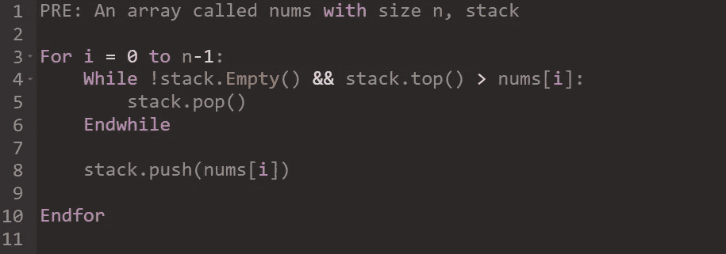
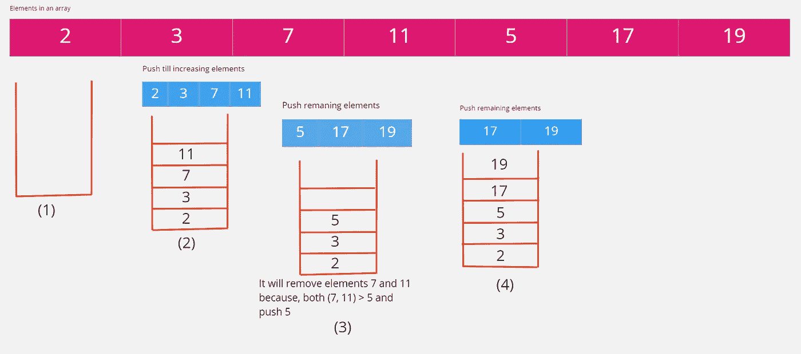
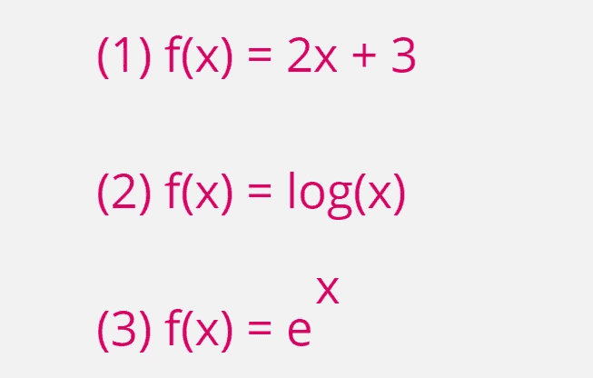
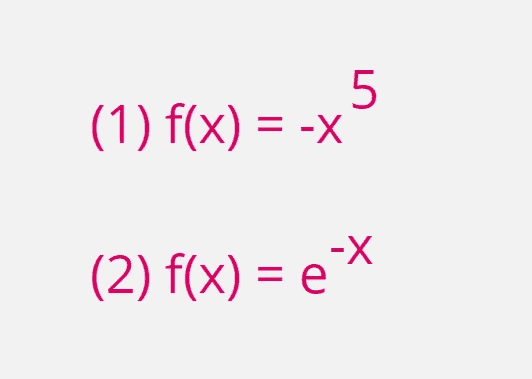

# 单调堆栈—识别模式

> 原文：<https://itnext.io/monotonic-stack-identify-pattern-3da2d491a61e?source=collection_archive---------0----------------------->

# 介绍

单调堆栈是其元素单调递增或递减的堆栈。它包含了典型堆栈所具有的所有特性，并且其元素都是单调递减或递增的。

以下是单调堆栈的特征:

*   这是数组情况下的一系列查询
*   最小值/最大值元素
*   当一个元素从单调堆栈中弹出时，它将不再被使用。

单调堆栈问题主要是**上一个/下一个更小/更大的**问题。当一个新的项目被推入堆栈时，它在弹出元素的同时保持单调性。

单调堆栈如下所示:


图 1:单调堆栈

单调堆栈的基本伪代码:



图 2:单调堆栈

单调堆栈的概念:

> 继续**推动**堆栈中的元素，直到它位于小于堆栈顶部的元素上，当它达到这样的数目时，它继续弹出堆栈，直到它或者是**空**或者是它的**顶部**小于它的当前元素。因此，堆栈中的所有元素都是从下到上递增的。



图 3:单调递增堆栈

**代码示例**

将下面的数组转换成单调堆栈:

```
nums = [2, 3, 7, 11, 5, 17, 19]
```

解决方案:

```
def monotonicStack(nums):
    n = len(nums)
    stack = []

    for i in range(n):
        while len(stack) > 0 and stack[-1] >= nums[i]:
            stack.pop()

        stack.append(nums[i])

    return stackif __name__ == '__main__':
    result = monotonicStack(nums)
    print(result)
```

作为单调堆栈输出:

```
[2, 3, 5, 17, 19]
```

# 函数的单调性

如果一个函数在其整个定义域内递增或递减，则称之为单调函数。

单调函数的真实示例:

*   生物的年龄是随时间单调递增的函数。而人生剩下的时间是时间上的单调递减函数。

单调递增函数:

如果 x1 < x2 and f(x1) < f(x2) then function is called as increasing function.



Figure 3: Monotonically increasing functions

Monotonically decreasing functions:

If x1 < x2 and f(x1) > f(x2)那么函数被称为递减函数。



图 4:单调递减函数

# 单调堆栈相关问题及解决方案

下面是与单调堆栈相关的问题列表。

## 下一个更大的元素

获取每个数组元素的下一个更大的元素。

示例:

```
**Input:** nums = [2, 7, 3, 5, 4, 6, 8]
**Output:** [7, 8, 5, 6, 6, 8, -1]
```

**解决方案:**

```
def getNextGreaterElements(nums):
    n = len(nums)
    stack = []
    result = [-1] * n

    for i in range(n):
        while len(stack) > 0 and nums[stack[-1]] < nums[i]:
            result[stack[-1]] = nums[i]
            stack.pop()

        stack.append(i)

    return result

getNextGreaterElements(nums)
```

## 下一个更大的元素 I

数组中某个元素`x`的**下一个更大的元素**是同一数组中`x`右边**的**第一个更大的元素**。**

给你两个**不同的 0 索引**整数数组`nums1`和`nums2`，其中`nums1`是`nums2`的子集。

对于每个`0 <= i < nums1.length`，找到索引`j`使得`nums1[i] == nums2[j]`，并确定`nums2`中`nums2[j]`的下一个更大元素的**。如果没有下一个更大的元素，那么这个查询的答案是`-1`。**

返回长度为 `nums1.length` *的*数组* `ans` *，使得* `ans[i]` *是如上所述的* ***下一个更大的元素*** *。**

```
**Input:** nums1 = [4,1,2], nums2 = [1,3,4,2]
**Output:** [-1,3,-1]**Explanation:** The next greater element for each value of nums1 is as follows:
- 4 is underlined in nums2 = [1,3,4,2]. There is no next greater element, so the answer is -1.
- 1 is underlined in nums2 = [1,3,4,2]. The next greater element is 3.
- 2 is underlined in nums2 = [1,3,4,2]. There is no next greater element, so the answer is -1.
```

**解决方案**

```
class Solution(object):
    def nextGreaterElement(self, nums1, nums2):
        """
        :type nums1: List[int]
        :type nums2: List[int]
        :rtype: List[int]
        """
        stack = []
        d = {}

        for i in range(len(nums2)):
            d[nums2[i]] = -1

        for i in range(len(nums2)):
            while len(stack) > 0 and nums2[i] > stack[-1]:
                item = stack.pop()
                d[item] = nums2[i]

            stack.append(nums2[i])

        for i in range(len(nums1)):
            nums1[i] = d[nums1[i]]

        return nums1
```

## 下一个更大的元素 II

给定一个循环整数数组`nums`(即`nums[nums.length - 1]`的下一个元素是`nums[0]`)，为 `nums`中的每个元素返回****下一个更大的数字*** *。**

*数字`x`的**下一个更大的数字**是数组中下一个遍历顺序的第一个更大的数字，这意味着您可以循环搜索以找到它的下一个更大的数字。如果不存在，返回`-1`这个数。*

```
***Input:** nums = [1,2,1]
**Output:** [2,-1,2]**Explanation**: The first 1's next greater number is 2; 
The number 2 can't find next greater number. 
The second 1's next greater number needs to search circularly, which is also 2.*
```

***解决方案***

```
*class Solution(object):
    def nextGreaterElements(self, nums):
        """
        :type nums: List[int]
        :rtype: List[int]
        """
        n = len(nums)
        stack = []
        result = [-1] * n

        for i in range(2*n-1):
            index = i % n

            while stack and stack[-1][1] < nums[index]:
                resIndex, _ = stack.pop()
                result[resIndex] = nums[index]

            stack.append([index, nums[index]])

        return result*
```

## *使数组非递减的步骤*

*给你一个 **0 索引的**整数数组`nums`。在一个步骤中，**移除**所有元件`nums[i]`，其中`nums[i - 1] > nums[i]`用于所有`0 < i < nums.length`。*

*返回*执行的步数，直到* `nums` *变成* ***非递减*** *数组*。*

```
***Input:** nums = [5,3,4,4,7,3,6,11,8,5,11]
**Output:** 3**Explanation:** The following are the steps performed:
- Step 1: [5,**3**,4,4,7,**3**,6,11,**8**,**5**,11] becomes [5,4,4,7,6,11,11]
- Step 2: [5,**4**,4,7,**6**,11,11] becomes [5,4,7,11,11]
- Step 3: [5,**4**,7,11,11] becomes [5,7,11,11]
[5,7,11,11] is a non-decreasing array. Therefore, we return 3.*
```

***解决方案***

```
*class Solution(object):
    def totalSteps(self, nums):
        """
        :type nums: List[int]
        :rtype: int
        """
        n = len(nums)
        dp = [0] * n
        res = 0
        stack = []

        for i in range(n-1, -1, -1):
            while stack and nums[i] > nums[stack[-1]]:
                dp[i] = max(dp[i] + 1, dp[stack.pop()])
                res = max(res, dp[i])
            stack.append(i)

        return res*
```

## *收集雨水*

*给定代表高程图的非负整数`n`，其中每个条形的宽度为`1`，计算雨后它可以收集多少水。*

```
***Input:** height = [0,1,0,2,1,0,1,3,2,1,2,1]
**Output:** 6
**Explanation:** The above elevation map (black section) is represented by array [0,1,0,2,1,0,1,3,2,1,2,1]. In this case, 6 units of rain water (blue section) are being trapped.*
```

***解决方案***

```
*class Solution(object):
    def trap(self, height):
        """
        :type height: List[int]
        :rtype: int
        """
        stack = []
        total = 0

        for i in range(len(height)):
            while len(stack) > 0 and height[stack[-1]] < height[i]:
                poppedIdx = stack.pop()

                if len(stack) == 0:
                    break

                heightVal = min(height[stack[-1]], height[i]) - height[poppedIdx]
                length = i - stack[-1] - 1
                total += heightVal * length

            stack.append(i)

        return total*
```

## *直方图中最大的矩形*

*给定一个整数数组`heights`表示直方图的条形高度，其中每个条形的宽度为`1`，返回*直方图中最大矩形的面积*。*

```
***Input:** heights = [2,1,5,6,2,3]
**Output:** 10
**Explanation:** The above is a histogram where width of each bar is 1.
The largest rectangle is shown in the red area, which has an area = 10 units.*
```

***解决方案***

```
*class Solution(object):
    def largestRectangleArea(self, heights):
        """
        :type heights: List[int]
        :rtype: int
        """
        maxArea = 0
        stack = []
        start = 0

        for i, h in enumerate(heights):
            start = i

            while stack and stack[-1][1] > h:
                index, height = stack.pop()
                maxArea = max(maxArea, height * (i - index))
                start = index

            stack.append((start, h))

        for i, h in stack:
            maxArea = max(maxArea, h * (len(heights) -i))

        return maxArea*
```

## *删除重复的字母*

*给定一个字符串`s`，去掉重复的字母，使每个字母出现一次，并且只出现一次。你必须确保你的结果是所有可能结果中按字典顺序最小的。*

```
***Input:** s = "bcabc"
**Output:** "abc"*
```

***解决方案***

```
*class Solution(object):
    def removeDuplicateLetters(self, s):
        """
        :type s: str
        :rtype: str
        """
        d = {char: indx for indx, char in enumerate(s)}

        res = []

        for indx, char in enumerate(s):
            if char not in res:

                while res and indx < d[res[-1]] and char < res[-1]:
                    res.pop()

                res.append(char)

        return "".join(res)*
```

## *删除 K 位数字*

*给定代表非负整数`num`和整数`k`的字符串 num，返回从 `num`中移除 `k` *位后的最小可能整数*。***

```
***Input:** num = "1432219", k = 3
**Output:** "1219"
**Explanation:** Remove the three digits 4, 3, and 2 to form the new number 1219 which is the smallest.*
```

***解决方案***

```
*class Solution(object):
    def removeKdigits(self, num, k):
        """
        :type num: str
        :type k: int
        :rtype: str
        """
        num=list(num)
        stack,i=[num[0]],1

        while i<len(num):
            while stack and k>0 and num[i]<stack[-1]:
                stack.pop()
                k-=1

            stack.append(num[i])
            i+=1

        while k>0:
            stack.pop()
            k-=1
        stack="".join(stack)
        return stack.lstrip("0") if stack!="" and int(stack)!=0 else "0"*
```

## *132 模式*

*给定一个`n`整数`nums`的数组，一个 **132 模式**是三个整数`nums[i]`、`nums[j]`和`nums[k]`的子序列，使得`i < j < k`和`nums[i] < nums[k] < nums[j]`。*

*返回`true` *如果* `nums` *中有***，否则返回* `false` *。***

```
****Input:** nums = [1,2,3,4]
**Output:** false
**Explanation:** There is no 132 pattern in the sequence.**
```

****解决方案****

```
**class Solution(object):
    def find132pattern(self, nums):
        """
        :type nums: List[int]
        :rtype: bool
        """
        if len(nums) < 3:
            return False

        right = float("-inf")
        stack = []

        for i in range(len(nums)-1, -1, -1):
            if nums[i] < right:
                return True
            else:
                while stack and stack[-1] < nums[i]:
                    right = stack.pop()

            stack.append(nums[i])

        return False**
```

## **每日气温**

**给定一个整数数组`temperatures`代表每天的温度，返回一个数组*`answer`*，这样* `answer[i]` *就是在* `ith` *天之后你必须等待的天数，以获得更温暖的温度*。如果没有未来的某一天这是可能的，保留`answer[i] == 0`代替。***

```
****Input:** temperatures = [73,74,75,71,69,72,76,73]
**Output:** [1,1,4,2,1,1,0,0]**
```

****解决方案****

```
**class Solution(object):
    def dailyTemperatures(self, temperatures):
        """
        :type temperatures: List[int]
        :rtype: List[int]
        """
        # Monotonic Stack
        n = len(temperatures)
        stack = []
        result = [0] * n

        for i in range(n-1, -1, -1):
            while stack and temperatures[i] >= stack[-1][0]:
                stack.pop(-1)

            if len(stack) == 0:
                result[i] = 0
            else:
                result[i] = stack[-1][1] - i

            stack.append((temperatures[i], i))

        return result**
```

## **在线股票跨度**

**设计一个算法，收集一些股票的每日报价，并返回该股票当天价格的跨度。**

**股票今天价格的**跨度**定义为股票价格小于或等于今天价格的最大连续天数(从今天开始向后)。**

*   **例如，如果一只股票在接下来的`7`天的价格是`[100,80,60,70,60,75,85]`，那么这只股票的跨度就是`[1,1,1,2,1,4,6]`。**

**实现`StockSpanner`类:**

*   **`StockSpanner()`初始化类的对象。**
*   **假定今天的价格为`price`，则`int next(int price)`返回股票价格的**跨度**。**

```
****Input**
["StockSpanner", "next", "next", "next", "next", "next", "next", "next"]
[[], [100], [80], [60], [70], [60], [75], [85]]
**Output**
[null, 1, 1, 1, 2, 1, 4, 6]**
```

****解决方案****

```
**class StockSpanner(object):def __init__(self):
        self.stack = []def next(self, price):
        """
        :type price: int
        :rtype: int
        """
        span = 1

        if len(self.stack) == 0:
            self.stack.append([price, span])
            return 1

        while self.stack and self.stack[-1][0] <= price:
            span += self.stack[-1][1]
            self.stack.pop()

        self.stack.append([price, span])

        return span# Your StockSpanner object will be instantiated and called as such:
# obj = StockSpanner()
# param_1 = obj.next(price)**
```

## **子阵列最小值之和**

**给定一个整数数组 arr，求`min(b)`的和，其中`b`覆盖`arr`的每个(相邻)子数组。由于答案可能较大，返回答案**模**。**

```
****Input:** arr = [3,1,2,4]
**Output:** 17
**Explanation:** 
Subarrays are [3], [1], [2], [4], [3,1], [1,2], [2,4], [3,1,2], [1,2,4], [3,1,2,4]. 
Minimums are 3, 1, 2, 4, 1, 1, 2, 1, 1, 1.
Sum is 17.**
```

****解决方案****

```
**class Solution(object):
    def sumSubarrayMins(self, arr):
        """
        :type arr: List[int]
        :rtype: int
        """
        su = 0
        n = len(arr)
        arr.append(0)
        stack = [-1]

        for i, num in enumerate(arr):
            while stack and arr[stack[-1]] > num: # (i)
                idx = stack.pop()
                su += arr[idx] * (i - idx) * (idx - stack[-1])

            stack.append(i)

        return su % (10**9 + 7)**
```

## **不同字符的最小子序列**

**给定一个字符串`s`，返回 `s` *的字典序最小的子序列*，该子序列包含* `s` *的所有不同字符*。***

```
***Input:** s = "bcabc"
**Output:** "abc"*
```

***解决方案***

```
*class Solution(object):
    def smallestSubsequence(self, s):
        """
        :type s: str
        :rtype: str
        """
        stack = []
        d = {}

        for i in range(len(s)):
            d[s[i]] = i

        for i in range(len(s)):
            if s[i] not in stack:
                while stack and i < d[stack[-1]] and ord(s[i]) < ord(stack[-1]):
                    stack.pop()

                stack.append(s[i])

        return (''.join(stack))*
```

## *商店中有特别折扣的最终价格*

*给定数组`prices`，其中`prices[i]`是商店中`ith`商品的价格。商店中的物品有特别折扣，如果您购买了`ith`物品，那么您将获得相当于`prices[j]`的折扣，其中`j`是**最小**指数，如`j > i`和`prices[j] <= prices[i]`，否则您将得不到任何折扣。*

**返回一个数组，其中* `*ith*` *元素是考虑到特殊折扣，你将为商店的* `*ith*` *商品支付的最终价格。**

```
***Input:** prices = [8,4,6,2,3]
**Output:** [4,2,4,2,3]
**Explanation:** 
For item 0 with price[0]=8 you will receive a discount equivalent to prices[1]=4, therefore, the final price you will pay is 8 - 4 = 4\. 
For item 1 with price[1]=4 you will receive a discount equivalent to prices[3]=2, therefore, the final price you will pay is 4 - 2 = 2\. 
For item 2 with price[2]=6 you will receive a discount equivalent to prices[3]=2, therefore, the final price you will pay is 6 - 2 = 4\. 
For items 3 and 4 you will not receive any discount at all.*
```

***解决方案***

```
*class Solution(object):
    def finalPrices(self, prices):
        """
        :type prices: List[int]
        :rtype: List[int]
        """
        stack = []
        l = len(prices)

        for i in range(0, l):
            while stack and prices[stack[-1]] >= prices[i]:
                p = stack.pop()
                prices[p] -= prices[i]

            stack.append(i)

        return prices*
```

## *使数组非递减的步骤*

*给你一个 **0 索引的**整数数组`nums`。一步，**移除**所有元件`nums[i]`其中`nums[i - 1] > nums[i]`为所有`0 < i < nums.length`。*

*返回*执行的步数，直到* `nums` *变成* ***非递减*** *数组*。*

```
***Input:** nums = [5,3,4,4,7,3,6,11,8,5,11]
**Output:** 3
**Explanation:** The following are the steps performed:
- Step 1: [5,**3**,4,4,7,**3**,6,11,**8**,**5**,11] becomes [5,4,4,7,6,11,11]
- Step 2: [5,**4**,4,7,**6**,11,11] becomes [5,4,7,11,11]
- Step 3: [5,**4**,7,11,11] becomes [5,7,11,11]
[5,7,11,11] is a non-decreasing array. Therefore, we return 3.*
```

***解决方案***

```
*class Solution(object):
    def totalSteps(self, nums):
        """
        :type nums: List[int]
        :rtype: int
        """
        n = len(nums)
        dp = [0] * n
        res = 0
        stack = []

        for i in range(n-1, -1, -1):
            while stack and nums[i] > nums[stack[-1]]:
                dp[i] = max(dp[i] + 1, dp[stack.pop()])
                res = max(res, dp[i])
            stack.append(i)

        return res*
```

## *要排序的最大块*

*给定一个长度为`n`的整数数组`arr`，它表示范围`[0, n - 1]`中整数的排列。*

*我们将`arr`分成一定数量的**块**(即分区)，并单独对每个块进行排序。将它们连接起来后，结果应该等于排序后的数组。*

*返回我们可以对数组进行排序的最大块数。*

```
***Input:** arr = [4,3,2,1,0]
**Output:** 1
**Explanation:**
Splitting into two or more chunks will not return the required result.
For example, splitting into [4, 3], [2, 1, 0] will result in [3, 4, 0, 1, 2], which isn't sorted.*
```

***解决方案***

```
*class Solution(object):
    def maxChunksToSorted(self, arr):
        """
        :type arr: List[int]
        :rtype: int
        """
        stack=[]
        stack.append(arr[0])
        top=1
        largest=0

        for i in range(1,len(arr)): #scan left to right from 1 to l-1
            if(arr[i]>stack[top-1]): # if element on top of stack < arr[i] push element in stack and increment top of stack as well 
                stack.append(arr[i])
                top+=1else:
                while((top)>0 and arr[i]<stack[top-1]): #if top of stack > arr[i], run loop till stack >arr[i]
                    if(stack[top-1]>largest): #keeping track of largest element we pop so we can replace pop elements with single largest element
                        largest=stack[top-1]
                    stack.pop() #poping element from stack while stack[top-1]>arr[i] and top>0
                    top-=1
                stack.append(largest) #pushing largest element in stack
                top+=1
        return len(stack)*
```

# *时间复杂度*

*单调的基于堆栈的解决方案的时间复杂度是 **O(n)** ，因为 while 循环只是一个接一个地弹出堆栈元素，并且由于每个元素都被推入一次，所以推入堆栈的元素不能超过 n 个。因此嵌套的 while 循环也不会执行超过 n 次。内部循环在覆盖 n 个元素之前不会被视为嵌套循环。*

# *结论*

*单调堆栈是一种特殊形式的堆栈，其中所有项目都按升序或降序排序*