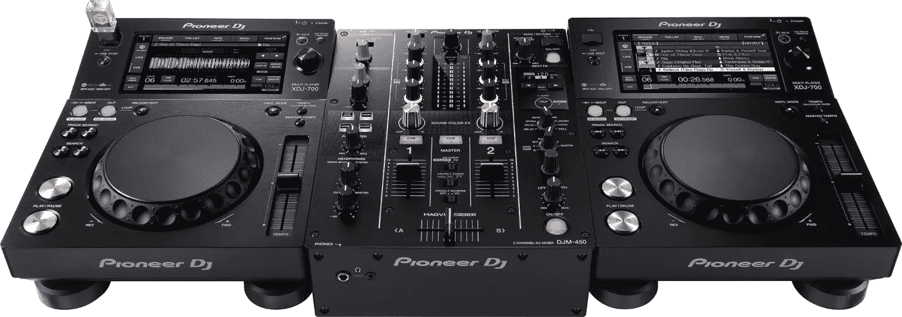
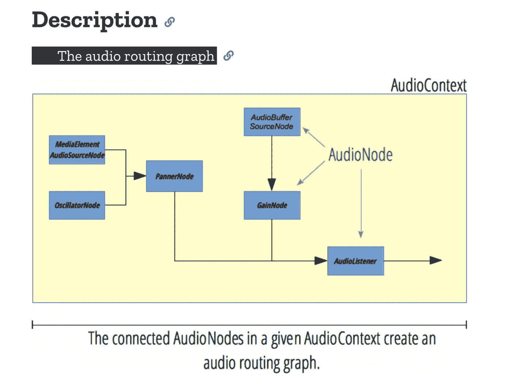
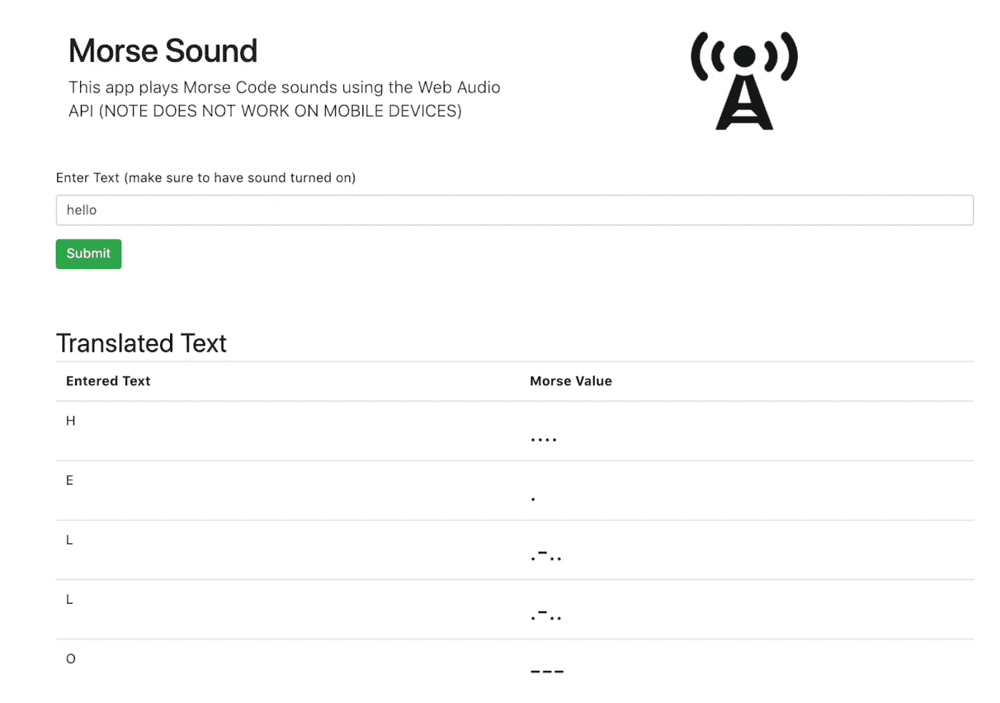
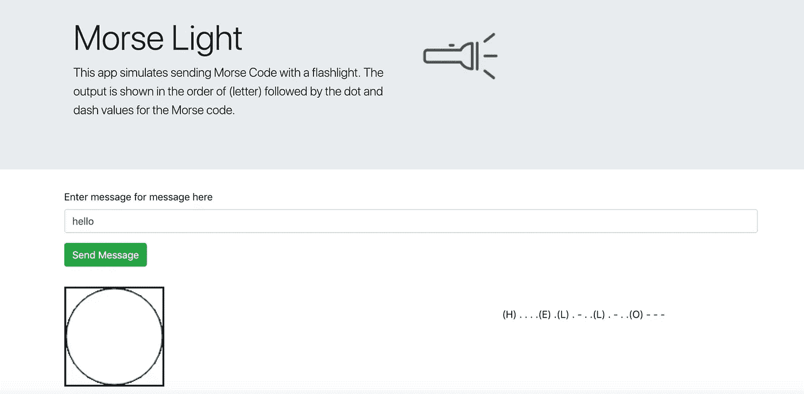

# 莫尔斯电码和网络音频 API

> 原文：<https://itnext.io/morse-code-and-the-web-audio-apis-594fea0ddb2b?source=collection_archive---------1----------------------->

在计算机科学领域，莫尔斯电码是那些仍然很酷的老式技术之一。我们都看过关于第二次世界大战的电影，在电影中，政府使用莫尔斯电码发送电报，远距离传送信息。我们可能也看过海军电影，当船只遇到麻烦时，指挥官会发出著名的“SOS”。这项技术在开发时是开创性的，今天仍然适用。

因为我对这个感兴趣，所以我想如果可以的话，用一个程序来创建莫尔斯电码会很酷。我在谷歌上搜索了一会儿，发现一些人使用[网络音频 API](https://developer.mozilla.org/en-US/docs/Web/API/Web_Audio_API) 用 Javascript 生成莫尔斯电码。然后，我用 Javascript 定时器和 Web Audio API 阅读(和编码)了随后的时间，尝试了通过光(颜色)和声音发送消息的不同方法。

最终，因为这些东西很酷，我决定写一篇关于它的文章。

这篇文章的其余部分将介绍一些用 Javascript 创建莫尔斯电码的酷方法。我将使用**网络音频 API** 和 Javascript 的 **setTimeout** 函数来演练实现。

# 莫尔斯电码的一些历史

莫尔斯电码(发音像“Morsel”中的“Morse”，而不是我妻子向我描述的名字中的“Morris”)可以被定义为一种由“点”和“破折号”组成的编码语言，对应于一个预设的字符表。这些字符包括字母表(a-z)以及数字(0-9)和一些标点符号。组成莫尔斯电码的“点”和“划”可以通过任何可以产生不同信号的东西来传输。这使它变得非常强大，因为只要发送者和接收者都理解莫尔斯电码，就可以用手电筒或收音机远距离发送信息。随着[电报](https://en.wikipedia.org/wiki/Electrical_telegraph)的发明，这变得更加强大，因为早在 20 世纪初，信息就可以远距离传输。

《唐顿庄园》的粉丝们无疑会记得剧中交换的各种电报([点击此处获取图片来源](https://www.telegraph.co.uk/film/the-lady-in-the-van/why-we-love-maggie-smith/))

100 多年来，莫尔斯电码也在美国军方(以及其他国家)广泛使用。一些著名的战争电影展示了它们，包括*《猎杀红色十月》*和*《模仿游戏》*。

我推荐查看[莫尔斯电码维基百科页面](https://en.wikipedia.org/wiki/Morse_code)和[电讯维基百科页面](https://en.wikipedia.org/wiki/Electrical_telegraph)来了解更多。

# 网络音频的历史

网络音频穿越历史([点击此处获取来源](https://www.davrous.com/2015/11/05/creating-fun-immersive-audio-experiences-with-web-audio/))

现在你已经有了一些莫尔斯电码的背景知识，让我们来谈谈如何使用 Javascript 来传输它的颜色和声音。

随着浏览器的发展，声音一直是一个挑战。最初的网络浏览器对带有特定元素的声音的支持非常少。当 [flash media](https://en.wikipedia.org/wiki/Adobe_Flash_Player) 被开发出来的时候，它提供了一个跨浏览器的解决方案，但是仍然需要用户安装软件。Flash 媒体插件也不够理想。

在 HTML5 中， **< audio >** 元素修复了很多问题，但如果你想从 web 应用程序中生成自己的声音，它有很大的局限性。 **< audio >** 元素没有像 DJ 那样给你对声音和操作的精细控制。

随着 **Web Audio API** 的出现，所有之前的挑战都迎刃而解，因为它提供了一个框架来完成(几乎)你能想到的任何类型的声音工作。

# 网络音频 API 简介

在下一节中，我将尝试展示 Web 音频 API 的高级视图。我建议查看这里的[页面](https://developer.mozilla.org/en-US/docs/Web/API/Web_Audio_API)了解更多信息。你也可以在这里查看网络音频 API 的 W3C 历史。

好的，让我们从头开始…

网络音频 API 实际上只是一种创建声音系统的虚拟方式。这可以被视为类似于 DJ 在创建“混音”时使用的方法。

[(点击此处获取图片来源)](https://www.google.com/url?sa=i&source=images&cd=&cad=rja&uact=8&ved=2ahUKEwj2zJL2kfnfAhVtUd8KHVvtBxgQjRx6BAgBEAU&url=http%3A%2F%2Fwww.agiprodj.com%2Fpioneer-djm-450-2-channel-dj-mixer-with-audio-interface-rekordbox.html&psig=AOvVaw39EEwhBETEUxNyoTUcA5yn&ust=1547963046242801)

Web Audio API 实际上是一组“节点”,它们是虚拟网络的不同部分。创建此网络是为了模拟声音并将源(录制的声音或生成的声音)连接到目的地(扬声器)。下面是我从这里的 [MDN 页面复制的一个很棒的整体图](https://developer.mozilla.org/en-US/docs/Web/API/AudioNode):

用网络音频 API 创建的整个音频网络被称为**音频图**。Web Audio API 将这个音频图称为 **AudioContext** ，它基本上是音频可以在当前浏览器会话中运行的地方。每个浏览器都有一个 **AudioContext** ，你需要知道如何引用它才能使用网络音频 API。

除了声音之外，您还可以使用 Web Audio API 的[分析器节点](https://developer.mozilla.org/en-US/docs/Web/API/AnalyserNode)创建声音的可视化效果。

如果所有这些看起来有点难以理解，我推荐你看下面的视频，它将带你了解一些基本知识。

# 莫尔斯声音

既然你已经有了网络音频和莫尔斯电码的介绍，让我们开始编码吧！在学习莫尔斯电码的过程中，我创建了一个应用程序，它使用网络音频 API 来生成“点”和“破折号”的声音，这种声音通常会在电报或无线电传输中听到。为了创建这个应用程序，我参考了[这里的博客文章](https://blog.theincredibleholk.org/blog/2014/06/23/generating-morse-code-with-javascript/)和[这里的相关要点](https://gist.github.com/eholk/0115691987090973cefe)，以便更好地理解如何将所有这些联系起来。该应用程序是用 Angular 构建的，托管在 Firebase 上。

你可以在这里玩一个[运行版的 app](https://morse-sound-6ae99.firebaseapp.com)。你也可以在这里查看 GitHub 上该应用的[源代码。](https://github.com/andrewevans0102/morse-sound)

由于应用程序遵循 Angular 的基本结构，我不打算进行标准的“ng new”和应用程序设置。我将演示主要组件如何与 Web APIs 一起工作。请在我上面提供的 GitHub 链接查看源代码，看看这个应用是如何创建的。

该应用程序本身只是接收文本，以莫尔斯电码的形式播放文本，并输出翻译后的结果，如下图所示。

因此，让我们演练设置这一点…

首先，我应该注意到 Web Audio API 现在被大多数现代浏览器所支持，但是对于特定的浏览器实现可能会有一些小的不同。我在这里介绍的代码是为 Google Chrome 开发的。

作为一项安全措施，Chrome 不会在没有手势发生的情况下播放音频。这是有意义的，因为你不想让应用程序未经你的同意就能进入你的电脑音频。因此，为了做到这一点，我的应用程序的主 webform 创建了带有 **onSubmit** 的**音频上下文**，它被绑定到接收输入的主表单。代码如下:

这里的 **createContext** 方法创建了我们一直在谈论的音频图。首先，我们创建一个**音频上下文**、**振荡器**和**增益节点**的实例，如下所示:

接下来，我们将 gain 节点的值设置为“0”，以模拟它处于关闭状态(使它不播放声音)。然后我们设置**振荡器**的频率(音高)，将**振荡器**连接到**增益节点**，并将**增益节点**连接到扬声器(音频目的地)，如下所示:

最后，我们设置声音播放的速率并启动振荡器节点。这一点很重要，因为它成为我们设置的网络“调度”声音的值。

生成的音频图看起来应该有点像下图:

在这里的图中，所有的节点都存在于一个**音频上下文**中。这里列出的三个节点只是音频图的一部分。**振荡器**连接到**增益**上，增益产生输出并发送到扬声器(音频目的地)。

有了音频图形设置，我们接下来需要开始创建声音。这里我们将通过模拟打开和关闭**增益节点**来“安排”声音。我们通过在特定的时间间隔将增益值设置为“0”或“1”来做到这一点。把这想象成打开和关闭扬声器的音量。我们通过以下方式做到这一点:

**generateMorse** 方法通过**audio context . current time**属性使用 **AudioContext 的**时间。AudioContext 有一个内部时钟，一旦创建，它就会持续计数。我们将使用**audio context . setvalueattime**方法来使用该时钟“调度”音频声音。这就是时间作为参数传递给 **generateMorse** 方法的原因。

数组 **MORSE** 只是一组键值对，将输入的字符与 MORSE 代码值相关联。

还要注意使用**点**值来安排时间。这决定了程序播放“点”和“划”的频率(步调)。

使用 **generateMorse** 方法，循环的**遍历传递给它的短语，然后调用 **createSound** 方法。这个方法就是所有神奇的地方。**

该方法调用增益节点 **setValueAtTime** 方法，该方法“安排”声音在创建的音频图中播放。**返回值**很重要，因为它强制 Javascript 事件循环使用声音生成作为堆栈上的操作。如果你不包含返回符**那么 Javascript 作用域将错过时机，你将听不到任何声音。**

综上所述，最终产品如下所示:

检查应用程序的运行版本，或者做一个 **git 克隆**并自己玩代码。

# 莫尔斯灯

除了我上面创建的声音应用程序，我还创建了第二个角度应用程序，它可以用光生成莫尔斯码。从技术上来说，该应用程序只是使用了一个 HTML canvas 元素，并用**黄色**和**白色**重新绘制了一个圆，以模拟手电筒打开**打开**和关闭**关闭**。此外，当莫尔斯电码灯显示时，相应的“莫尔斯信”翻译及时输出到所画灯的右侧。

你可以在这里玩一个[运行版的 app](https://morse-light-6d365.firebaseapp.com)。你也可以在这里查看 GitHub 上 app 的[源代码。](https://www.github.com/andrewevans0102/morse-light)

这是应用程序运行的截图:

就像使用 sound 应用程序一样，我不打算介绍使用 Angular CLI 创建初始结构的基础知识。我在这里只关注主要的应用程序逻辑，并建议您查看 GitHub 中的项目，以了解实际项目是如何构建的。

对于基本的灯光演示，我使用了 **async/await** 和 Javascript 事件循环来模拟灯光的“开”和“关”。该应用程序基本上接受一个短语作为输入，然后定时调用一个返回**承诺**的方法。由于我使用了 **async/await** ，主 Javascript 事件循环被迫等待，直到 **Promise** 在规定的时间内完成。如果你不熟悉 **async/await** ，我推荐你在这里看看我的帖子[。](https://rhythmandbinary.com/post/Optimizing_Angular_with_Async_Await)

该应用程序使用**传输**方法和**手电筒**方法完成大部分工作。

首先，**传输**方法是由主输入表单中的“提交”按钮调用的。这个方法使用我最初解释的 **async/await** 调用来控制“开”和“关”灯序列的定时。

正如你在这段代码中看到的，**异步**方法调用**手电筒**。这个调用有一个 **await** ，它阻塞了主事件循环，迫使程序在改变灯的颜色之前等待。根据传入的颜色值，对**手电筒**的调用也控制颜色。所以**黄色**模拟灯**亮**白色**模拟灯**灭**。如果你把这个和一串莫尔斯电码以点号的形式传进来。**和**破折号="-"** ，然后你可以遍历该行并模拟相应的**开**和**关**值。

**手电筒**方法只是在指定的时间内给**画布**元素着色。真正神奇的是 **async/await** 阻塞主线程，在画布的绘制/重绘改变灯光颜色之前强制等待。

将所有这些放在一起，莫尔斯灯光组件看起来如下:

# 包扎

就个人而言，所有这些都是学习莫尔斯电码的有趣方式。我希望我创建的链接和应用程序能帮助你理解一些关于网络音频的基础知识，以及 Javascript 中的事件计时。

*原载于 2019 年 1 月 19 日*[https://rhythmandbinary.com](https://rhythmandbinary.com/post/Morse_Code)*。*