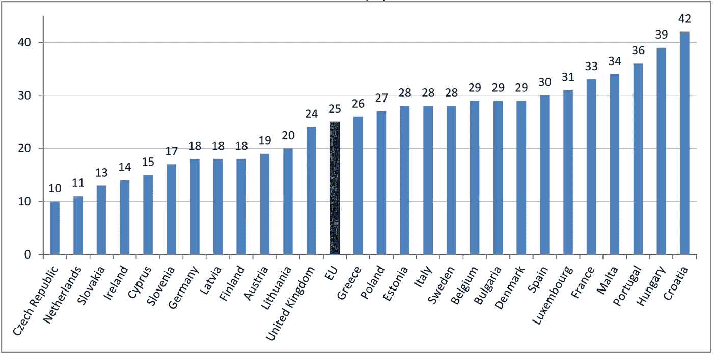

# 网络安全领域最具创新性的荷兰公司

> 原文：<https://itnext.io/most-innovative-dutch-companies-in-cybersecurity-5f99a74d8cf?source=collection_archive---------2----------------------->

10 月是[欧洲网络安全月(ECSM)](https://cybersecuritymonth.eu/) ，这是一项欧洲宣传活动，旨在提高对网络安全威胁的认识，促进公民的网络安全，并提供最新的安全信息。本文简要概述了荷兰在打击网络犯罪方面的立场及其最具创新性的网络安全公司。

## **打击网络犯罪**

荷兰因网络犯罪而臭名昭著[；该国的网络犯罪在欧洲国家中排名第一，在世界上排名第四。根据欧盟统计局的数据，尽管这是欧盟互联网用户第二安全的国家。](https://www.linkit.nl/knowledge-base/118/The_Netherlands_remains_first_in_cybercrime_in_Europe)

根据欧盟统计局改编的下图显示了 2015 年欧盟成员国中遭遇安全相关问题的互联网用户比例(%)

荷兰是高度重视公共和私营部门网络安全的国家之一。根据 [BSA](http://www.bsa.org/) (软件联盟)[欧盟网络安全仪表板](http://cybersecurity.bsa.org/assets/PDFs/country_reports/cs_netherlands.pdf)的说法，荷兰“拥有一个复杂而成熟的网络安全法律和政策框架，其中包括[国家网络安全战略(NCSS) 2](https://www.enisa.europa.eu/topics/national-cyber-security-strategies/ncss-map/NCSS2Engelseversie.pdf) 。这是 2013 年通过的第二个此类战略，因为该国的网络安全框架每两年更新一次。”

荷兰还有一个国家网络安全中心(NCSC)，，它是网络安全的中央信息枢纽和专业知识中心。NCSC 是网络安全部的一个部门，是国家安全和反恐协调员的一部分，积极参与应对威胁和事件，并与网络安全平台合作。NCSC 每年发布《荷兰网络安全评估》( CSAN ),旨在提供对网络安全领域的发展、利益、威胁和复原力的深入了解。([网络安全评估荷兰— CSBN 2016](https://www.ncsc.nl/actueel/Cybersecuritybeeld+Nederland/cybersecuritybeeld-nederland-2016.html) —荷兰语)。

这份报告警告网络犯罪威胁对荷兰数字安全的威胁越来越大，强调了四个主要趋势:

1.  职业罪犯已经演变成实施长期高质量操作的高级玩家来咬安全专家
2.  外国情报机构的数字经济间谍活动使荷兰的竞争力面临压力
3.  勒索软件很常见，甚至更加复杂和先进
4.  广告网络还没有能力对付恶意广告

值得注意的是，尽管做出了所有这些努力，最新的一项名为“[荷兰网络安全意识和技能(2016)](https://www.ncsc.nl/actueel/nieuwsberichten/nederlanders-niet-voorbereid-op-cybercrime.html) ”的研究指出，荷兰民众没有足够的网络犯罪知识以及如何防范网络威胁。为了提高公众意识，今年[在线预警](https://www.alertonline.nl/en/home)活动的主题是网络安全技能。

## **创新的荷兰网络安全公司**

根据最新的民意调查“[财富 500 强公司面临的最大挑战](http://fortune.com/2016/06/03/challenges-facing-fortune-500/)”，网络安全被认为是这些公司面临的挑战之一。58%的首席执行官提到网络安全是他们面临的最大挑战之一。

因此，近年来网络安全行业的增长加速也就不足为奇了。据 It 研究分析师和公司在网络安全风险投资公司发布的[网络安全市场报告](http://cybersecurityventures.com/cybersecurity-market-report/)中引用的数据，预计该行业将从 2015 年的 750 亿美元增长到 2020 年的 1700 亿美元以上。

网络安全风险投资公司每个季度都会公布[网络安全 500 强](http://cybersecurityventures.com/cybersecurity-500/)，这是一个提供网络安全解决方案和服务的领先公司的全球汇总。2016 年第三季度，三家荷兰公司被点名。总部位于荷兰的这些公司如下:

## [**AVG 技术**](http://www.avg.com/ww-en/homepage)

***反病毒和网络安全软件***

AVG Technologies 成立于 1991 年，总部位于阿姆斯特丹，为消费者和企业提供广泛的保护、性能和隐私解决方案。截至 2015 年 3 月，AVG 拥有超过 2 亿的活跃用户，其中包括超过 1 亿的移动用户。

AVG 的消费产品包括移动设备和台式机(Windows、Mac 和 Android)的互联网安全、性能优化以及个人隐私和身份保护。AVG 业务组合专注于基于云的安全和管理平台，以及旨在保护小型企业的产品和服务。业务产品包括简化和保护业务的 IT 管理、控制和报告、集成安全性和移动设备管理。

最初成立于捷克布尔诺的 AVG[于 2016 年 9 月被捷克杀毒软件制造商](https://press.avast.com/avast-closes-acquisition-of-avg-technologies) [Avast software](https://www.avast.com/index) 收购。自 2016 年 10 月 3 日起，Avast 和 AVG 作为一家公司运营。这种结合为这些公司提供了世界上最大的威胁检测网络，该网络拥有超过 4 亿个端点，这些端点充当提供恶意软件信息的传感器。

## [**BWise**](http://www.bwise.com/)

***IT 治理、风险与合规***

BWise 成立于 1994 年，是一家纳斯达克公司，提供企业治理、风险管理和法规遵从性(GRC)软件。

BWise GRC 平台为公司提供风险管理、内部控制、内部审计、合规和政策管理、信息安全和可持续发展绩效管理的软件解决方案。BWise 解决方案支持组织了解、跟踪、衡量和管理关键组织风险。

b 面向 GRC 的 Wise 解决方案被数百家国际客户用于各种行业，帮助客户增强企业责任感；提高财务、战略和运营效率，并最大限度地提高绩效。BWise 使组织能够遵守反腐败法规、萨班斯-奥克斯利法案、欧洲公司治理准则、ISAE3402/SAS-70、PCI-DSS、Solvency II、Basel II 和 III、Dodd-Frank、ISO 标准等法规。

BWise [总部位于荷兰罗斯马伦，其](http://www.bwise.com/newsitems/ni003031)[于 2012 年被纳斯达克](http://ir.nasdaq.com/releasedetail.cfm?releaseid=670069)收购，在其 2016 年 Q1 报告《Forrester Wave:治理、风险和合规性平台》中，BWise【】被 Forrester 定位为“GRC 平台的领导者”。此外，在 Gartner 2015 年 12 月发布的 BWise 运营风险管理解决方案魔力象限中，纳斯达克[被选为](http://www.bwise.com/newsitems/ni003030)的“领导者”象限。

[**不拘一格智商**](https://www.eclecticiq.com/)

***威胁情报分析***

EclecticIQ(前身为 Intelworks)成立于 2014 年，是一家应用网络情报技术提供商，帮助企业安全计划和政府整理和分析网络威胁情报。相应地，使分析师能够重新控制他们的威胁现实并减少暴露。

他们开创性的威胁情报平台(TIP)， [EclecticIQ 平台](https://www.eclecticiq.com/platform)，实现了安全信息交换的可操作性，支持协作分析师工作流，并确保及时整合网络威胁情报检测、预防和响应能力。截至 2016 年 9 月 14 日，EclecticIQ 已加入 [HPE 安全技术联盟计划(TAP)](http://www8.hp.com/us/en/software-solutions/security-alliance-partner-program/) 。

EclecticIQ 总部位于阿姆斯特丹。他们的任务是“恢复对抗网络对手的平衡”。