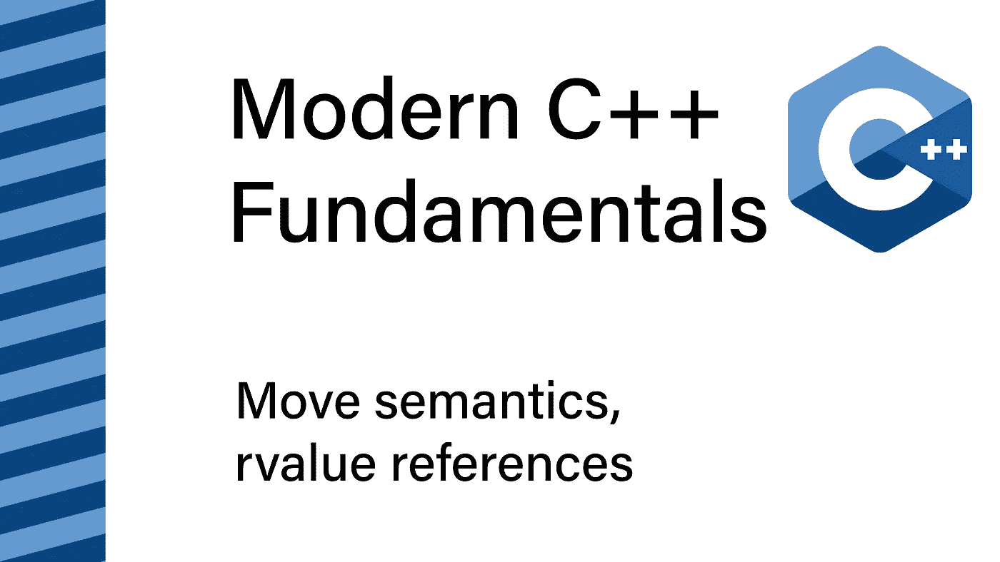

# 移动语义和右值引用:现代 C++基础

> 原文：<https://itnext.io/move-semantics-and-rvalue-references-modern-c-fundamentals-cbbe38760c05?source=collection_archive---------0----------------------->

欢迎来到现代 C++基础系列，在这里我们一次深入一个主题。今天，我们将讨论 C++11 中引入的移动语义、值类别和*右值*引用。

不幸的是，这是我们必须从一点前期理论开始的话题之一。值得注意的是，我们需要讨论价值类别。

# 价值类别

*   *glvalues:* 有标识的表达式；也就是说，可以确定两个表达式是否引用同一个底层实体
*   *右值:*可以“移出”的表达式

这两个类别结合在一起:

*   *左值:*有标识，不能移动
*   *xvalues:* 有一个标识，可以从
*   *prvalues:* 没有标识，可以从
*   没有身份且不能“移出”的未使用的表达式类别

## lvalue 与 prvalue

为了演示，我们将对比*左值*和*pr 值*:

变量名 *x* 和 *y* 为*左值。*值得注意的是，变量、函数、模板参数对象或数据成员的任何名称都是一个左值。

变量 *x* 和 *y* 是不同的实体，实际上我们可以使用断言来验证这个事实(第 2 行)。整数常量是 *prvalues* ，两个常量的含义相同，但是讨论它们是一个还是多个实体没有意义。

重要的是，表达式有多复杂并不重要。只要保持同一性，表达式就是一个*左值*。所以在这里，内联 lambda 调用是一个*左值*表达式。我们还可以验证调用结果和名称 *x* 是指带有断言的同一个实体。然而，lambda 本身没有身份；所以是一个 *prvalue* 。

*左值*和*pr 值*的另一个典型例子是导致引用(对于*左值*)或非引用(对于*pr 值*)的函数调用和运算符表达式。

## x 值

所以，剩下要讨论的一个类别是 *xvalues* ，其中是指定为过期的*GL values*(*x values*=过期值)。

这里我们使用 *std::move* cast(第 5 行)手动指定 *name* 为过期。结果是，对同一个实体的唯一有效操作(通常)是覆盖它的状态(第 7 行)。

由于特定的行为可以通过重载移动构造和移动赋值操作符来控制，所以有些类提供了额外的保证:

过期的 *unique_ptr* 保证是 *nullptr* 。

## 可以“移出”

最后，我们再来谈谈*右值*以及它对*“从”*的意义。

在 C++11 之前，当我们想从一个已存在的值中表现出一个新值时，我们唯一的选择就是复制构造。但是，考虑到当我们有一个 *xvalue* 时，源值的内容注定要过期。

在许多情况下，制作副本将是低效的，因为我们可以从源值中提取内容。类似地， *prvalues* 也可以被分解，因为它们不存在于当前表达式之后。

在这个例子中，我们利用 move-construction(第 2 行)和 move-assignment(第 3、4 行)来快速交换两个字符串(通常只需要重新分配三个 64 位值，不需要分配内存)。

## 何时移动-铸造

最后，让我们讨论一下什么时候应该在代码中使用 *std::move* 强制转换。幸运的是，这个很简单:

***向函数调用(或运算符表达式)传递左值时使用 std::move cast，不再需要底层实体的状态。***

当与遗留的(或设计不良的)界面交互时，严格遵循这条规则可能会降低性能。然而，这是一个很好的基线。在其他上下文中使用 *std::move* 强制转换，特别是在 *prvalues* 或返回表达式中，会阻止编译器优化，应该避免。

## 值类型汇总

需要记住的要点:

*   ***左值*表达式具有同一性**
    值得注意的是，名称表达式是*左值，*以及任何导致引用命名实体的复合表达式也是*左值*
*   ***prvalues* 没有标识**
    所有文字都是 *prvalues* (字符串文字除外，它们是*左值*)，表示临时值的表达式也是如此
*   ***x 值*是将*左值*表达式标记为过期**的结果
*   **当不再需要底层变量的内容时，对*左值*表达式使用移动转换**

# 右值引用

为了编写能够利用移动语义的代码，我们需要讨论硬币的另一面:*右值*引用。

首先，让我们来看看在使用 C++11 之前的引用和常量引用重载方法时，调用是如何被解析的:

如您所见， *prvalues* 绑定到常量引用(第 9 行)，可修改的 *lvalues* 绑定到引用(第 12 行)， *xvalues* 绑定到常量引用(第 13 行)，不可修改的 *lvalues* 绑定到常量引用(第 16 行)。

如果我们添加第三个接受右值引用的重载，情况将会改变:

**规则是:**

*   ***右值* ( *prvalues* 和 *xvalues* )** 将绑定到常量引用或*右值*引用，但优先选择*右值*引用
*   **可修改的*左值***
*   **不可修改的*左值*** 将只绑定到常量引用

下面的例子可能会让你感到困惑:

当我们用 *x、*调用 *accepts_int* 时，它解析为引用调用，尽管 *x* 属于引用 int 的类型*右值*。要理解为什么我们需要回到本文的第一部分。请记住，任何带有标识和名称的表达式都是一个左值。因此，这里的 *x* 是一个*左值，*它将绑定到一个引用。

当我们写 *int & & x = 10* 时，我们取一个 *prvalue* (常量 10)，给它一个名字和一个生存期。正因为如此，对函数没有区别*int x = 10；*和*int&x = 10；。*值得注意的是，两者都是可变的整数变量，它们的生存期超过了函数调用。

# 利用移动语义

到目前为止，我们已经讨论了合成的例子，但是现在是时候讨论移动语义的典型用例了，为你的类实现移动语义。

假设您的类正在实现自定义资源管理。在这种情况下，您可以通过在典型的复制构造函数、复制赋值函数和析构函数之上实现移动构造函数和移动赋值函数来利用移动语义。

下面是一个带有移动语义的简单堆栈实现的示例:

我们是利用 C++14 *std::exchange* ，缩短了 *x = other.x 的两步过程；other.x =值；*成单一语句。当您对比复制构造函数(第 5 行)和移动构造函数(第 25 行)以及复制赋值(第 12 行)和移动赋值(第 29 行)时，您可以看到制作副本和分解另一个实例的内容之间的区别。

如果您的类没有实现自定义资源管理，您可能能够坚持零规则:

只要不声明任何自定义的复制或移动构造函数，复制或移动赋值或析构函数，所有这些都将由编译器提供。这里需要注意的是，默认实现将进行简单的分段复制/移动，这仅适用于不实现手动资源管理的类型。

移动语义还释放了实现只移动类型的潜力。唯一资源句柄需要只移动类型，例如 *unique_ptr* 。

声明移动构造函数或移动赋值(即使是默认的)会禁用默认的复制构造函数和复制赋值。声明 move 构造函数也删除了默认的默认构造函数(因此，我们在第 2 行重新默认了它)。

## 这种类型

最后，在 C++11 之前，我们可以根据实例是常量还是可变的来重载方法。在 C++11 中，我们可以进一步重载实例是否是一个*右值*:

# 感谢您的阅读

如果您喜欢这篇文章，您可能也会喜欢:

 [## 114 种标准 C++算法。介绍

### 欢迎来到关于 C++标准算法的新系列。标准算法提供了安全和优化的构建模块…

itnext.io](/the-114-standard-c-algorithms-introduction-2a75a2df4300)  [## 节省你的理智和时间——不要拘泥于形式。

### 作为一名软件工程师，你能做的最有影响力的事情之一就是自动化重复的活动。一个领域，在…

itnext.io](/save-your-sanity-and-time-beyond-clang-format-2b929b9120b8) 

我还在 T4 的 YouTube 上发布视频。你有问题吗？在 Twitter 或 LinkedIn 上联系我。