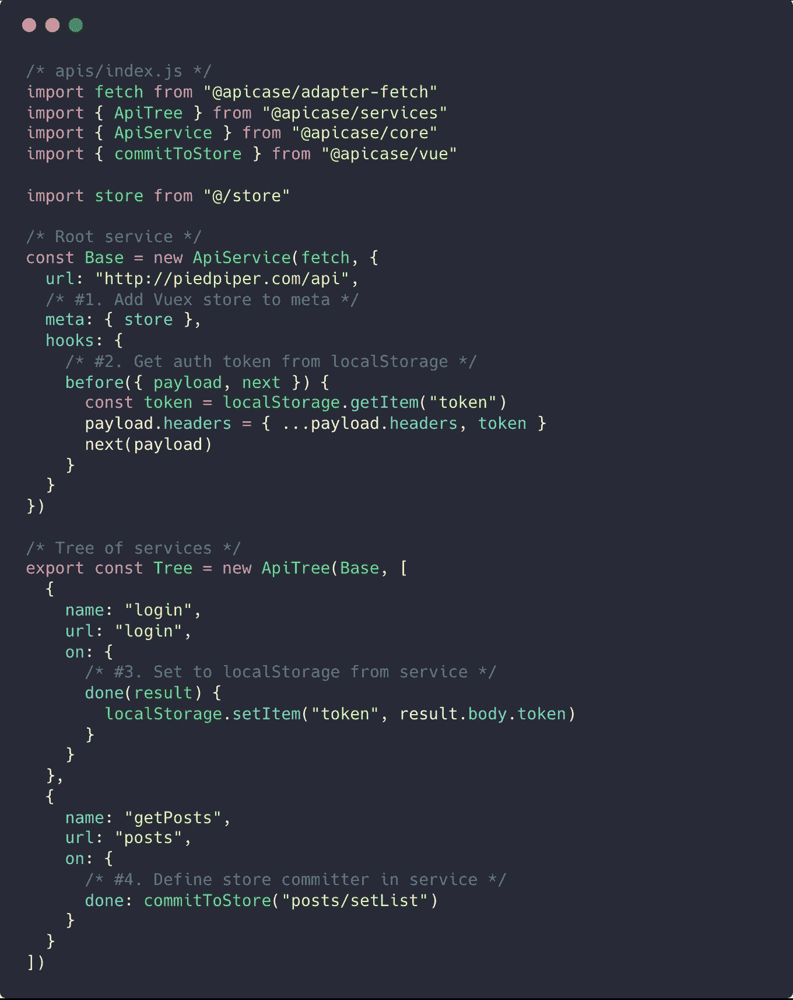
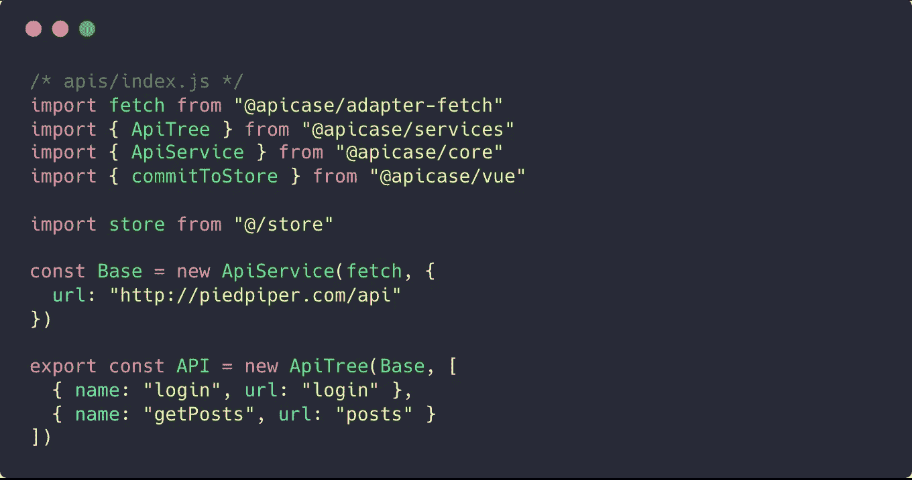
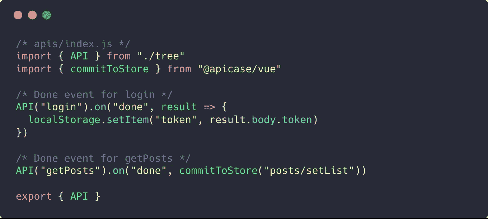
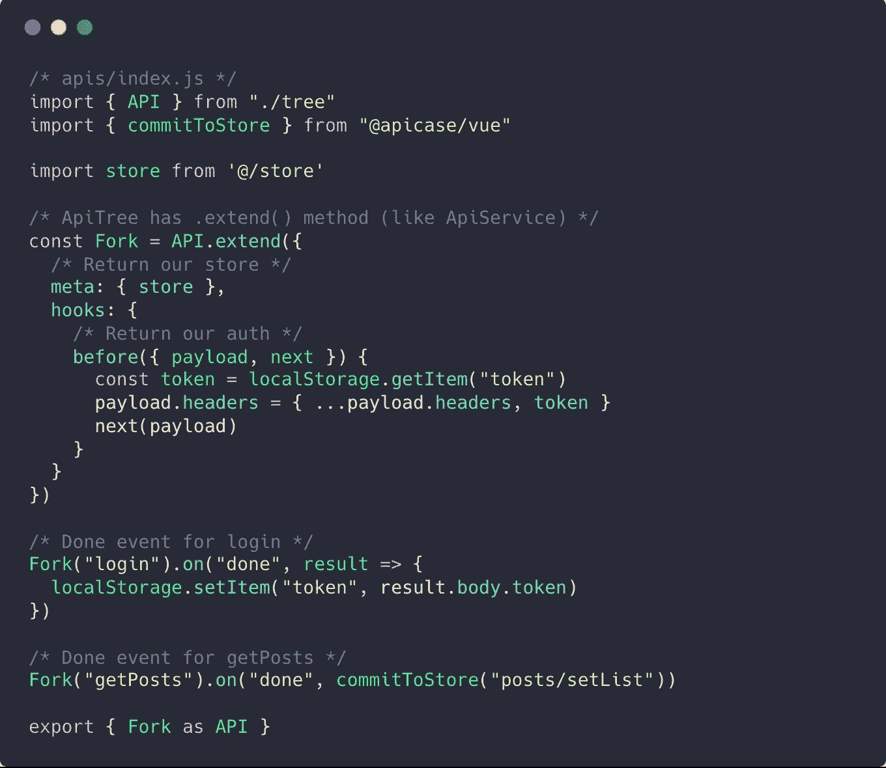
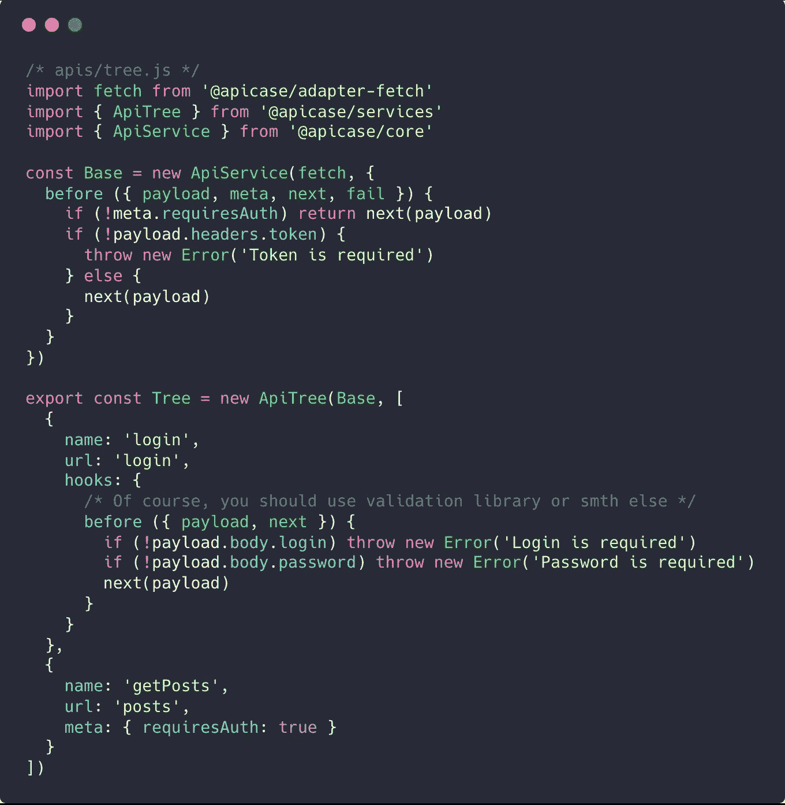

# 将您的 API 移到应用程序之外

> 原文：<https://itnext.io/move-your-api-outside-your-application-b07ba6809412?source=collection_archive---------0----------------------->

## 修复我之前帖子的错误

当您将所有应用程序逻辑移动到 API 层时

到目前为止，我发表了一篇关于编写 API 请求的最常见错误的文章，并展示了 Apicase 的一些特性。你可以在这里阅读。

 [## 编写 API 请求最常见的错误

### 大家好！今天我将再次谈论 API 请求组织，并且我将提出一点建议

itnext.io](/the-most-common-mistake-of-writing-api-requests-4eda46dce03d) 

在此之后，我得到了一个公平的评论。正如我在最后所说的，在服务内部处理 API 请求*会使你的 API 层不灵活，并且与应用程序不可分割。
不好，**但是……**我们能修好！所以，我不会占用你太多时间。*

# *我们拥有的*

*假设我们有这样的 API 层:*

**

*为什么不好？*

> *我们不能在另一个应用中使用这个 API 层，因为它太依赖 app 结构了。正如 Roma Sabirov 和 reddit 的一些人所说——API 不应该知道你的应用程序。*

***#1 和#4。**将商店直接连接到 API 层使得无法在另一个应用程序中使用
**#2 和#3** 。从侧面获取数据并对其进行设置也可能会导致问题。如果我们的另一个应用程序也使用`token`并且它不同于 API 要求的令牌，该怎么办？*

*我一直讨厌不可重用的代码，所以我会讨厌我以前的帖子**但是……**一点也不。因为我们可以走另一条路。*

# *我们如何修复它？*

*我们只需要从我们的 API 层中移除所有的边绑定。
清晰的 API 树将会是这样的:*

**

*漂亮干净，比我想要的还要干净*

*–*但是我们为什么需要一个案例呢？我们可以将原始 json 放入 fetch 中。我们将在哪里处理我们的 API？回到商店，划掉你所有的建议？**

***不**你仍然可以在 API 层处理你的 API，但是在其他地方会有所不同。
我们将导入我们的 API 并远程添加监听器*:**

****

**现在我们需要返回我们的商店绑定和授权，所以我们可以这样做:**

****

> **现在我们可以将我们的`apis/tree.js`移到应用程序之外，例如，移到`@myorg/api`包中，并在我们所有的应用程序中使用它。**

# **我们可以改进什么？**

**在我们的`apis/tree.js`中，我们可以添加一些不依赖于 API 的特定于 API 的检查。例如，我们可以添加有效负载验证:**

****

**而且，最重要的是你不需要在你的应用程序代码中写 API。只有业务逻辑和使用 API，就像它只是一个有一些方法的库。**

# **待办事项**

*   **基于模式、文档或 smth 的 API 自动生成(例如 swagger)**
*   **添加定义服务的*转换器*回调的机会，以减少请求代码**
*   **写一些(内置？)测试/验证工具**

**如果你还没有尝试过 apcase——是时候修正它了！**

** [## API case/核心

### core - 2 KB 库，以一种智能的方式组织您的 API

github.com](https://github.com/apicase/core) 

祝你好运；)**