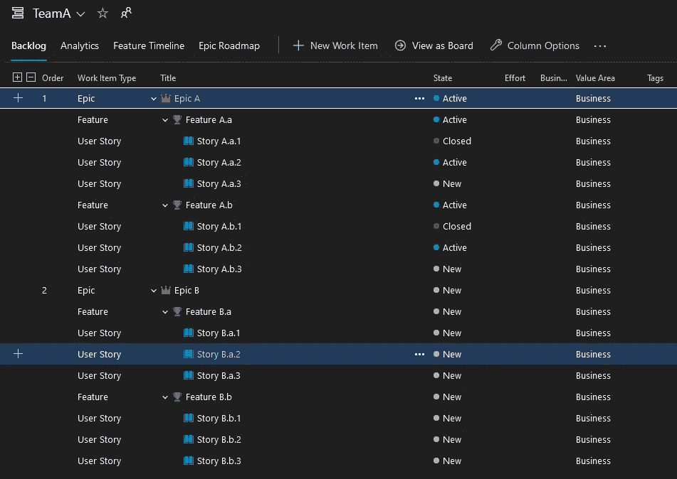
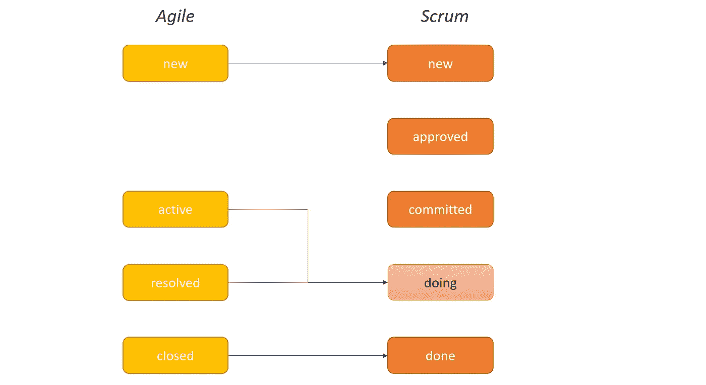
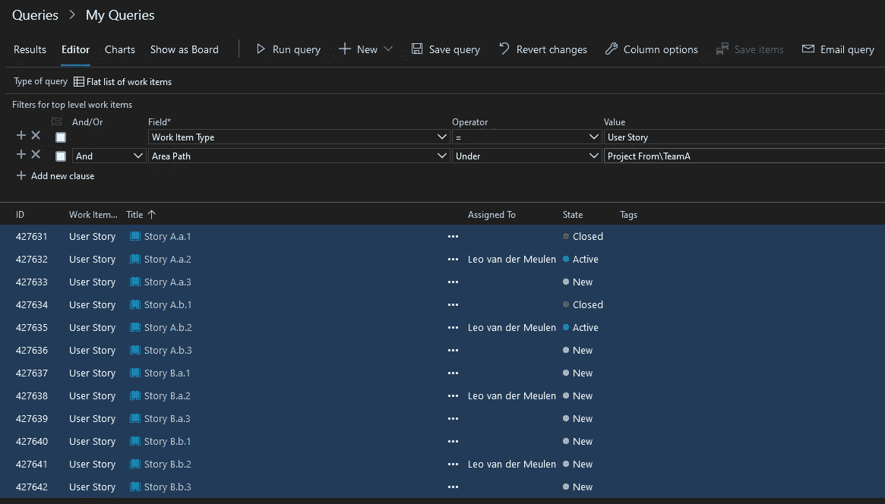
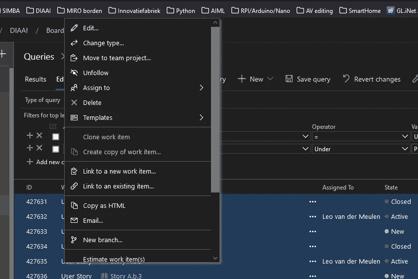
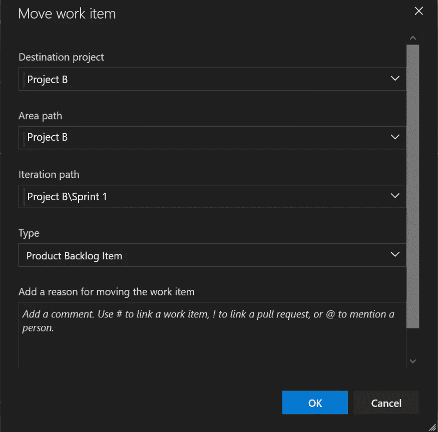
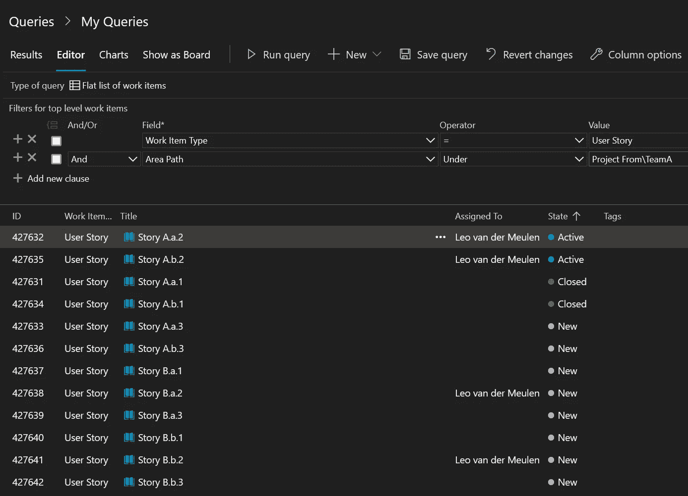
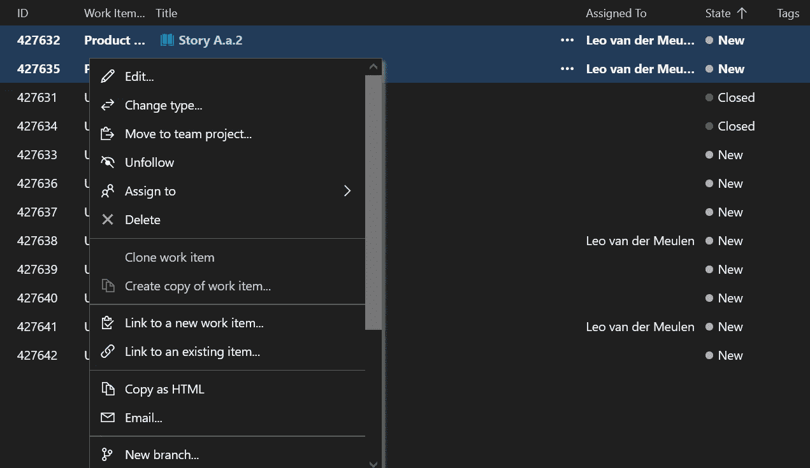
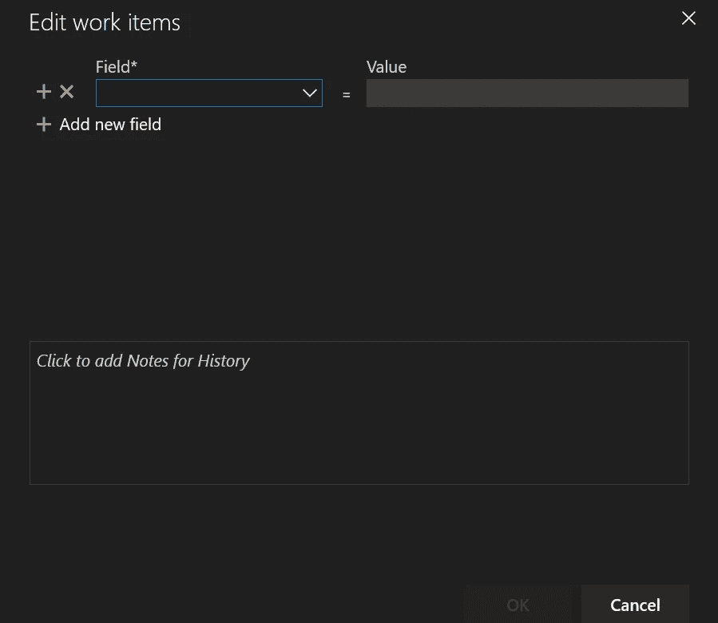
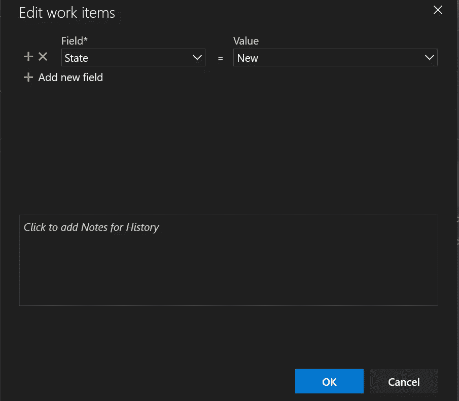

# 将您的产品积压转移到 Azure DevOps 中的另一个团队

> 原文：<https://itnext.io/move-your-product-backlog-to-another-team-in-azure-devops-e7b605f1a793?source=collection_archive---------4----------------------->

如何高效地将项目待办事项转移或迁移到另一个 DevOps 团队和位置。


米歇尔·巴洛格在 [Unsplash](https://unsplash.com?utm_source=medium&utm_medium=referral) 上的照片

“我以前就是这样的！”这是我在 Azure DevOps 中转移产品积压时想到的第一件事。这感觉像是重新发明轮子，因为我不记得上次是怎么做的了。这是我几年才做一次的任务，所以随着时间的推移，细节会越来越多。这次我将记录这个过程，希望它能帮助你们中一些面临同样挑战的人。

我们是通过复制每个项目的内容来迁移产品积压，还是通过一个接一个地迁移它们，或者是否有更快更快的方法来这样做？！

## Azure DevOps 项目环境

在 Azure DevOps 中，一切都从 T4 项目 T5 开始。*项目*是顶级项目，团队和产品被添加到这个*项目*中。在一个*项目中*有几个团队在开发他们的产品。在“团队”下的“项目设置”中添加一个*团队*。*项目*级别也决定了所有团队使用的*流程*。Azure DevOps 内置了四个流程:*基础*、*敏捷*、 *Scrum* 和 *CMMI* 。使用最多的流程是 *Scrum* 和*敏捷*。更多信息参见[选择工艺](https://learn.microsoft.com/en-us/azure/devops/boards/work-items/guidance/choose-process?view=azure-devops&tabs=agile-process)流程。

*Scrum* 和*敏捷*过程的一个主要区别是主要待办事项的定义。在*敏捷*中，这有类型*用户故事*，在 *Scrum* 中，这种类型是*产品待办事项*。可以根据*项目、*调整流程，例如向待办事项的推进方案添加新状态。这将影响我们以后的迁移，也可能影响您的迁移。

一个*团队*负责一个或多个产品。*区域路径*用于按照团队、产品和特性对待办事项进行分组。迭代路径用于将待定项分组为冲刺和里程碑。

## 迁移概述

迁移一个 backlog 包括迁移*项目*、*过程*、*迭代路径*和*区域路径。*

```
FROM:
Project: Project From (Agile process)
    |- Team: TeamA
         |- Area Path: From_Product A
         |- Iterations: TeamA_Sprint_1, TeamA_Sprint_2, ...

TO:
Project: Project B (Scrum process)
    |- Team: Team
         |- Area Path: Product
         |- Iterations: Sprint_1, Sprint_2, ...
```

确保你的出发地和目的地的所有细节都是清楚的，并且是手写的。

我们将要迁移的 backlog 如下:



迁移产品概述(作者提供的 Azure Boards 截图)

我们有两个史诗，每个有两个功能，每个有 3 个用户故事。史诗 A 正在开发中，*史诗 B* 尚未开始。

需要进行以下转换:

*   区域—将区域从“来自团队的项目”更改为“来自团队的项目”
*   迭代——从“来自\TeamA_Sprint_XX 的项目”更改为“来自\Team_Sprint_XX 的项目”
*   项目类型:将“用户故事”更改为“产品积压项目”
*   状态:根据新的促销方案更新

敏捷过程和 Scrum 过程的推广方案是不同的，自从我们在 Scrum 过程中添加了状态*做*之后，差别就更大了。下面的概述显示了每个进程的状态，箭头指示了迁移路径:



过程对比(图片由作者提供)

## 实际行动

我们将分三步完成待办事项列表:*用户故事*，然后*特性*，最后*史诗*。只要这三个步骤都完成了，实际的顺序就无关紧要了。否则，积压被分成两个团队。

我们将从用户故事的迁移开始。首先，我们创建一个查询来列出所有在 *TeamA:* 的 backlog 中的用户故事



列出所有用户故事的查询(作者截图来自 Azure DevOps boards)

该查询选择属于区域路径“Project From\Team A”的“User story”类型的所有项目。运行查询(“运行查询”)后，将列出从新建到关闭的所有文章。

通过点击第一个故事选择所有用户故事，并按下<shift>-按钮，点击最后一个故事。现在，上下文菜单(右键单击)将显示选项“移动到团队项目...”**[请在执行此步骤之前继续阅读！】**</shift>



上下文菜单(作者截图来自 Azure DevOps boards)

在下面的弹出窗口中，选择正确的*项目*、*区域*、*迭代*和*项目类型*。



移动项目(作者截图来自 Azure DevOps boards)

选择“确定”后，这些项目将被移动到 Azure Devops 中的正确位置。唯一的问题是所有项目都获得了状态' *New* '。这是一个问题。显然，当改变项目类型时，所有状态都会丢失。对于少数几个项目，您可能记得正确的状态，但是对于大量项目，这是不可能的。这是一个主要的学习点，在逐项迁移之后。

那怎么办呢？！运行查询后，将显示一个项目列表。可以按列对该列表进行排序。选择“状态”列作为订单，所有项目按状态分组(对应于原始促销方案)。



按州选择的项目(作者截图来自 Azure DevOps boards)

现在，您可以如上所述按照状态迁移所有项目**。选择所有状态为“活动”的项目，并将它们移动到正确的*迭代*和*区域*。它们将以新的类型和状态 *New 显示在查询结果中。*您可以选择它们(按下< shift >键，首先选择最后一个)，打开上下文菜单并选择“编辑”。**



上下文菜单(作者截图来自 Azure DevOps boards)

这将显示一个空的编辑弹出窗口:



编辑屏幕(截图来自 Azure DevOps boards 的作者)

此屏幕允许您将所有选定项目的字段更改为特定值。选择“状态”作为字段，并为当前项目集选择正确的*值*。根据之前给出的映射，对于*新的*项，这将是*新的*，对于*活动的*项，这将是*正在做的*等。



编辑屏幕(截图来自 Azure DevOps boards 的作者)

按下*确定*，所有更改将应用于所选项目。当您返回到查询结果时，您可以按下< CTRL-s >来保存所做的所有更改。

对具有特定状态的所有项目组重复这些步骤。所有的*用户故事*都被移植到新的团队中。

如果在旧环境中已经进行了 sprint(迭代),并且需要转移这些信息，那么迁移应该在每次 sprint 中进行。修改查询，只返回单个 sprint 的项目，然后执行剩余的过程。确保在弹出窗口中选择正确的迭代路径。

现在对每种待办事项类型重复所有这些步骤:

```
 1\. for each sprint/iteration:
 2\.     for each item type in ['Epic', 'Feature', 'User story', 'Tasks']:
 4\.         determine mapping of old states to new states
 4\.         create query selecting all items of type for specific iteration
 5\.         sort query results on state
 6\.         for each state in query results:
 7\.             select all items of state
 8\.             migrate items using 'move to team project...'
 9\.             edit state to change to correct state for new item type
10\.             save changes made
```

恭喜您，您已将项目项移动到另一个 Azure Devops 团队。不幸的是，在这些过程中有一些陷阱。指出这些是为了让你的过渡过程更顺利。

这个过程节省了我几个小时。这个过程允许您在 15 分钟内迁移一个产品待办事项，而不需要通过复制(CTRL-c — CTRL-v)或者一次迁移一个来迁移项目，这与待办事项列表中的项目数量无关。

如果目标团队的促销方案在每个待办事项列表中没有变化，那么跳过第一步，编写一个查询来一次选择所有类型的所有项目，就可以更快地完成。如果两个位置具有相同的过程定义，并因此具有相同的待办事项类型，这也将适用。

## 最后的话

这个文档开始是作为我个人使用的过程描述，但是我希望它也能帮助你的日常工作。快速完成无聊的事情，开始创造价值！

我希望你喜欢这篇文章。要获得更多灵感，请查看我的其他文章:

*   [查找与 TF-IDF 和 Python 相关的文章](https://medium.com/towards-data-science/finding-related-articles-with-tf-idf-and-python-d6e1cd10f735)
*   [用 Python 对文本进行总结—续](https://medium.com/towards-data-science/summarize-a-text-with-python-continued-bbbbb5d37adb)
*   [太阳能电池板发电分析](https://towardsdatascience.com/solar-panel-power-generation-analysis-7011cc078900)
*   [对 CSV 文件中的列执行功能](https://towardsdev.com/perform-a-function-on-columns-in-a-csv-file-a889ef02ca03)
*   从你的活动跟踪器的日志中创建一个热图
*   [使用 Python 实现并行 web 请求](https://towardsdatascience.com/parallel-web-requests-in-python-4d30cc7b8989)

如果你喜欢这个故事，请点击关注按钮！