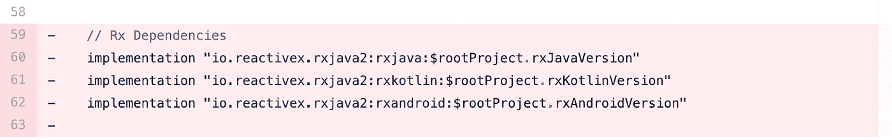

# 从 RxJava 迁移到协程

> 原文：<https://itnext.io/moving-from-rxjava-to-coroutines-4e1c34419111?source=collection_archive---------3----------------------->


看到如下的拉取请求会让我对我将会看到的可怕的事情感到恐惧。那是去年的事了，因为协程现在可以帮助我们编写干净、健壮和可伸缩的代码，就像 RxJava 一样。



在这篇文章中，我将讲述我从 RxJava 迁移到协程的步骤，这是我最近发表在 Github [NewsSync](https://github.com/dimkonomis/NewsSync) 上的一个宠物项目。

# **App**

首先，我将简单介绍一下这个应用程序是如何设计的。

数据层由负责从数据源获取和映射数据的存储库组成。源由翻新服务和存储从网络获取的数据的房间数据库组成。两个源总是返回类似于`Flowable`(为了监听数据库变化)或`Completable`的可观察值。

用例持有业务逻辑，因为它们负责与存储库通信，线程化并将适当的响应返回给表示层。

最后，表示层由视图模型组成，这些视图模型从用例中请求数据，并通过 ReactiveStreams 将其映射到 LiveData [State](https://github.com/dimkonomis/NewsSync/blob/master/app/src/main/java/com/dk/newssync/presentation/common/State.kt) 变量。

# **从数据源开始**

我最初的想法是从应用程序的底层、数据层和数据源开始应用更改。

希望从版本 2.1.0 开始，Room 支持开箱即用的协程(你可以在这里阅读更多关于它的信息)，为了改进，我们可以使用由 Jake Wharton 创建的[协程适配器](https://github.com/JakeWharton/retrofit2-kotlin-coroutines-adapter)，它可以应用于 Room。所以我可以走了。

# **暂停功能**

在阅读协程的时候，我意识到真正神奇的事情发生在挂起函数上。

挂起函数是可以挂起协程的执行，而不阻塞它们正在其上运行的线程的函数，并且当协程完成时，继续函数的其余部分。

我所做的是改变存储库的功能，从正常到暂停。

```
**fun** appendStories(q: String?): Flowable<List<Story>>**suspend fun** appendStories(q: String?): List<Story>
```

现在我们可以运行异步任务，比如网络和数据库请求，并从调用中返回实际的响应。

所以不是从我们的网络请求中返回一个可流动的

```
**override fun** appendStories(q: String?): Flowable<List<Story>> {
    **return networkSource**.searchArticles(q)      
        .doOnNext **{ data -> 
            localSource**.insertStories(**data**.*articles*).subscribe()
        **}** }
```

我们可以获得实际的响应，立即将其存储在我们的数据库中并返回。

```
**override suspend fun** appendStories(q: String?): List<Story> {
    **val** data = **networkSource**.searchArticles(q).await()
    **localSource**.insertStories(**data.articles**)
    return data.articles
}
```

这里的`await()`所做的是等待返回`[Deferred](https://kotlin.github.io/kotlinx.coroutines/kotlinx-coroutines-core/kotlinx.coroutines/-deferred/)`的调用完成，而不阻塞线程。当调用完成时，它返回调用的值，并继续函数的其余部分。

# **错误处理**

上面代码的问题是，如果其中一个源代码抛出异常，那么应用程序就会崩溃。在 RxJava 中，我们可以使用 OnError 回调来处理可能的异常，但在这里是不可能的。对此，一个可能的解决方案是将我们的每个调用包装在一个 try-catch 块中，但这将使我们的代码变得难看，而且几乎不可读。

为了解决这个问题，我们可以在一个名为 Result 的密封类中传播我们的调用响应，它有一个成功和一个错误状态。

```
**sealed class** Result<**out** T> {

    **data class** Success<**out** T>(**val data**: T) : Result<T>()
    **data class** Error(**val exception**: Exception) : Result<Nothing>()

    **companion object** {
        **fun** <T> success(data: T): Result<T> =
            Success(data)

        **fun** error(exception: Exception) : Result<Nothing> =
            Error(exception)
    }
}
```

为此，我使用了高阶函数，这些函数将一个挂起或`[Deferred](https://kotlin.github.io/kotlinx.coroutines/kotlinx-coroutines-core/kotlinx.coroutines/-deferred/)`函数作为参数，并返回一个结果类

```
**suspend fun** <T> requestAwait(
    call: () -> Deferred<T>
): Result<T>  {
    **return try** {
        **val** result = call().await()
        Result.success(result)
    } **catch** (exception: Exception) {
        Timber.e(exception)
        Result.error(exception)
    }
}

**suspend fun** <T> request(
    call: **suspend** () -> T
): Result<T>  {
    **return try** {
        Result.success(call())
    } **catch** (exception: Exception) {
        Timber.e(exception)
        Result.error(exception)
    }
}
```

所以存储库的挂起函数最终看起来像这样

```
**override suspend fun** appendStories(q: String?): Result<List<Story>> {
    **val** response = requestAwait **{ networkSource**.searchArticles(q) **}
    return when** (response) {
        **is** Result.Success -> {
            **val** articles = response.**data**.**articles** request **{ localSource**.insertStories(articles) **}** Result.success(articles)
        }
        **is** Result.Error -> response
    }
}
```

# **穿线**

RxJava 的一个关键特性是使用 subscribeOn 和 observeOn 操作符来指定要运行的线程是多么容易。

缺省情况下，协程使用一个名为 default 的调度程序，它由 JVM 上的一个共享线程池提供支持。协程允许我们更改调度程序，其中一种方法是使用`withContext`函数。

`withContext`是一个函数，它允许我们改变运行协程代码的上下文，从而使用不同的线程。

所以代替这个

```
**fun** requestStories(q: String?): Flowable<List<Story>> {
    **return** storiesRepository.searchStories(q)
        .subscribeOn(Schedulers.io())
        .observeOn(AndroidSchedulers.mainThread())
}
```

用例的代码现在看起来如下

```
**suspend fun** requestStories(q: String?): Result<List<Story>> {
    **return** *withContext*(Dispatchers.**Main**) **{
        return**@withContext **storiesRepository**.searchStories(q)
    **}** }
```

其中`Dispatchers.Main`是协程将运行的主线程。我在这里使用`suspend`的原因也是因为一个挂起函数，也就是 searchStories，只能从协程或另一个挂起函数中调用。

# 移动到表示层

离开 RxJava 的最后一步是将其从视图模型中移除。视图模型从用例中请求数据，这些数据被映射到一个密封的类状态，然后通过 ReactiveStreams 转换成 LiveData，如下图所示

```
**val** stories: LiveData<State<List<Story>>> **by** *lazy* **{
    searchUseCase**.requestStories(**q**)
        .*toState*()
        .toLiveData()
**}**
```

因为我想删除 RxJava，所以不需要 ReactiveStreams 和到 LiveData 的转换。因此，我决定使用一个常规的 postValue 来更新 LiveData 变量，以便尽可能地保持简单。

```
**private val _stories** = MutableLiveData<State<List<Story>>>()

**val stories**: LiveData<State<List<Story>>>
    **get**() = **_stories****fun** getStories() = *viewModelScope*.*launch* **{
    _stories**.postValue(State.loading())
    **_stories**.postValue(**searchUseCase**.requestStories(**q**).*toState*())
**}**
```

`viewModelScope`是与 ViewModel 的生命周期相关联的`[CoroutineScope](https://kotlin.github.io/kotlinx.coroutines/kotlinx-coroutines-core/kotlinx.coroutines/-coroutine-scope/)`，当 ViewModel 被清除时，它将被取消。我在这里使用它的原因是，正如我之前提到的，`suspend`函数只能从协程或另一个挂起函数中调用。因此，`viewModelScope`启动一个协程，以便调用挂起函数。

如果你感兴趣，你可以在这里找到库的协同程序版本，你可以在这里看到将应用从 RxJava 迁移到协同程序的提交:

[](https://github.com/dimkonomis/NewsSync/commit/0b83173273d878fb9316d595f048d954cc43fe3d) [## 从 RxJava 迁移到协程 dimkonomis/NewsSync@0b83173

### 使用 RxJava 和架构组件的 MVVM 模式示例应用程序

github.com](https://github.com/dimkonomis/NewsSync/commit/0b83173273d878fb9316d595f048d954cc43fe3d) 

# 测试

在下一部分中，我们将看到必要的变更，以便在迁移之后，项目的单元测试能够再次通过。