# 多云和多集群声明式 Kubernetes 集群创建和集群 API 管理(CAPI-v1 alpha 3)

> 原文：<https://itnext.io/multi-cloud-and-multi-cluster-declarative-kubernetes-cluster-creation-and-management-with-cluster-6df8efdc2a89?source=collection_archive---------0----------------------->

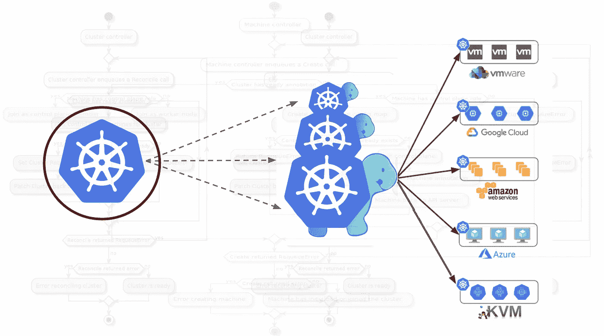

用于集群创建、配置和管理的声明式、Kubernetes 风格的 API

集群 API (CAPI)是一个 Kubernetes 项目，它为集群创建带来了声明式的、Kubernetes 风格的 API。CAPI 通过使用自定义资源定义来扩展 Kubernetes API 服务器公开的 API，允许用户创建新的资源，如集群(代表一个 Kubernetes 集群)和机器(代表组成集群的节点的机器)。然后，每个资源的控制器负责对这些资源的变化做出反应，以启动集群。API 的设计方式使得不同的基础设施提供者可以与它集成，以提供他们特定于环境的逻辑。

用户与称为“管理集群”的 Kubernetes 集群通信，该集群包含集群 API 机制和其他支持组件。用户可以请求创建整个集群，并通过创建与他们想要使用的云提供商相关联的集群资源对象来管理其生命周期，所创建的集群被称为“工作负载集群”。管理集群也是一个或多个基础设施提供商(如 AWS、CGP、Azure、vSphere、Openstack 等)的地方。)和 bootstrap provider(截至目前 Kubeadm 得到官方支持，用户可以使用 operator framework 实现自己定制的 Bootstrap provider)运行。创建的所有云提供商对象的信息都保存在管理集群中。

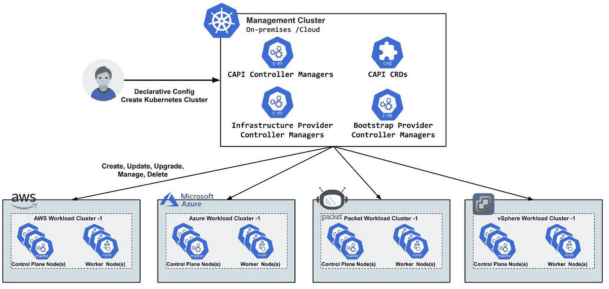

CAPI —管理集群和工作负载集群

该项目维护多个[基础设施提供商](https://github.com/kubernetes-sigs?q=cluster-api-provider&type=&language=)，以便在众多云提供商上使用 CAPI。用户可以通过使用 Kubebuilder(操作者构建框架)创建控制器和协调来实现定制的提供者。群集控制器和机器控制器一起构成提供者控制器管理器。机器规范由集群 API 组件——机器控制器使用。该控制器调用负责创建/更新/删除机器的机器执行器。执行器(协调逻辑)是特定于供应商的。

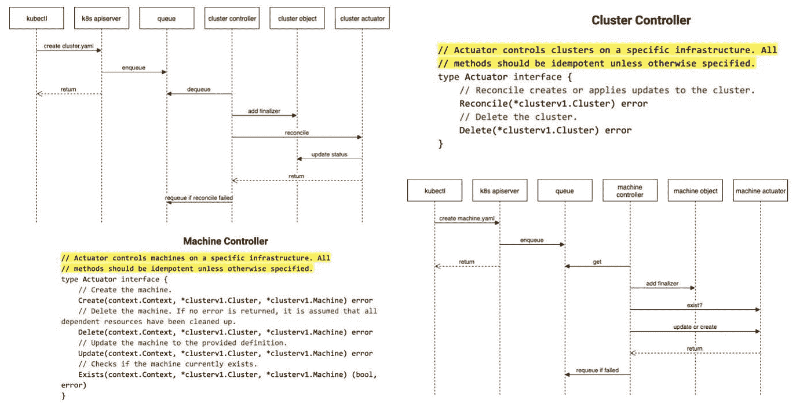

CAPi——集群控制器和机器控制器

一旦机器和其他组件由提供者创建，引导提供者用于引导(安装 k8s)Kubernetes 控制平面节点和工作者节点。到目前为止，Kubeadm 是官方支持和维护的引导提供者。

基本集群 API 是用于所有提供者的框架。它独立维护。集群 API 提供者为集群 API 框架实现不同基础设施的操作细节。借助 provider，集群 API 从不同第三方基础设施供应商的操作细节中抽象出集群及其机器的整体管理功能。

# 架构和组件

CAPI——建筑

Kubernetes 通过对象和控制器管理不同的资源。控制器通常管理资源以使其对象的实际状态与规范提供的期望状态相匹配。

集群 API 由一组共享的控制器组成，以提供一致的用户体验。为了支持多个云环境，这些控制器中的一些(例如，集群、机器)调用提供商特定的致动器来实现控制器的预期行为。其他控制器(例如 MachineSet)是通用的，通过与其他集群 API(和 Kubernetes)资源交互来操作。提供者实现者的任务是实现执行器方法，以便共享控制器在必须协调状态和更新状态时可以调用这些方法。当执行器函数返回一个错误时，如果它是 RequeueAfterError，那么在给定的 RequeueAfter 时间过去后，对象将被重新排队以进行进一步处理。

CAPI 由多个控制器组成，核心组件如下:

# 串

集群提供了一种定义通用 Kubernetes 集群配置的方法，如 pod 网络 CIDR 和服务网络 CIDR，以及共享集群基础设施的特定于提供商的管理。集群包含基础设施提供商创建 Kubernetes 集群所需的详细信息(例如，用于 pod、服务的 CIDR 块)。

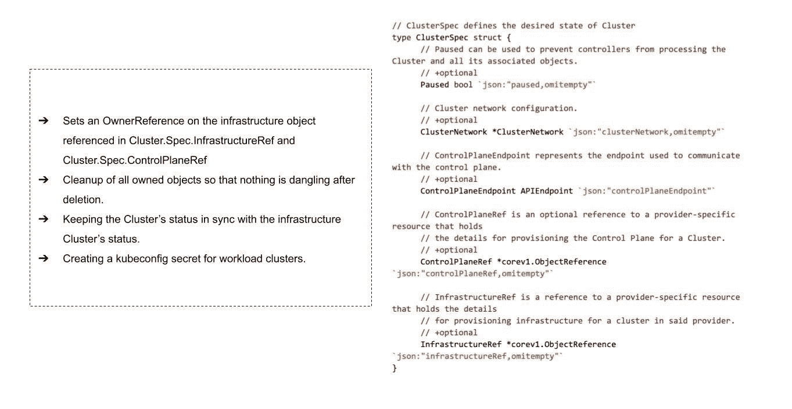

CAPI —集群

# 机器

机器负责描述单个 Kubernetes 节点。在公共配置级别只公开了最少的配置(主要是 Kubernetes 版本信息)，额外的配置通过嵌入式 ProviderSpec 公开。

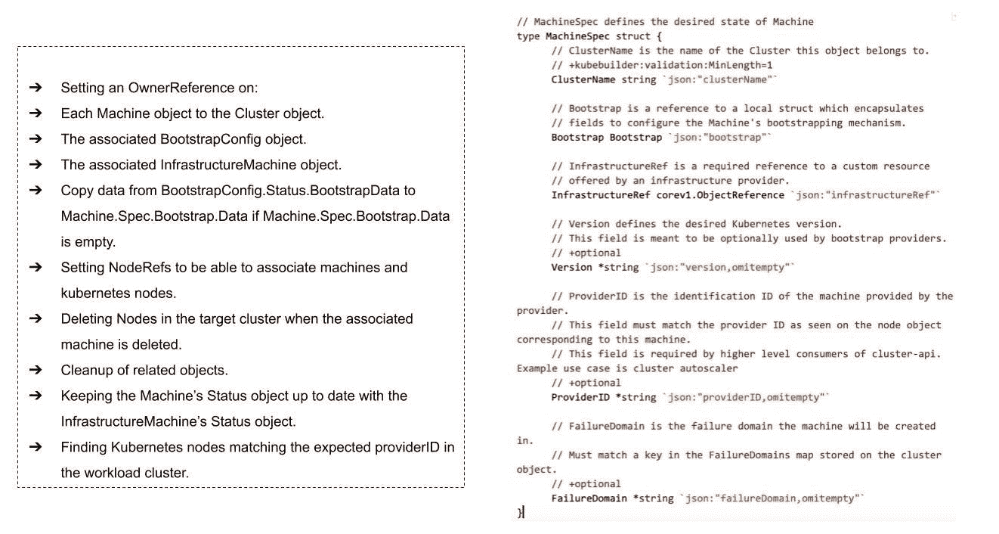

CAPI —机器

# 机器部署

MachineDeployments 允许对机器组(节点组)的配置更改进行托管部署和展示，非常类似于传统 k8s 部署的工作方式。这允许以协调的方式对节点配置进行更新，甚至对集群中的工作节点进行版本升级。它还允许回滚到以前的配置。值得注意的是，MachineDeployment 不应该用于管理构成给定托管集群的 Kubernetes 控制平面的机器，因为它们不能保证在 machine deployment 更新或扩展时控制平面保持健康。

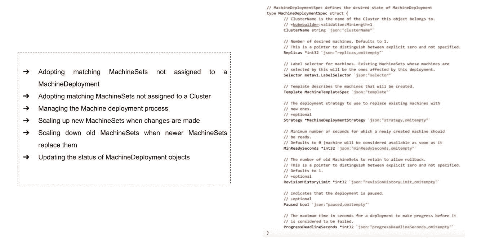

CAPI —机器部署

# 机器健康检查

MachineHealthCheck 负责修复不正常的机器。

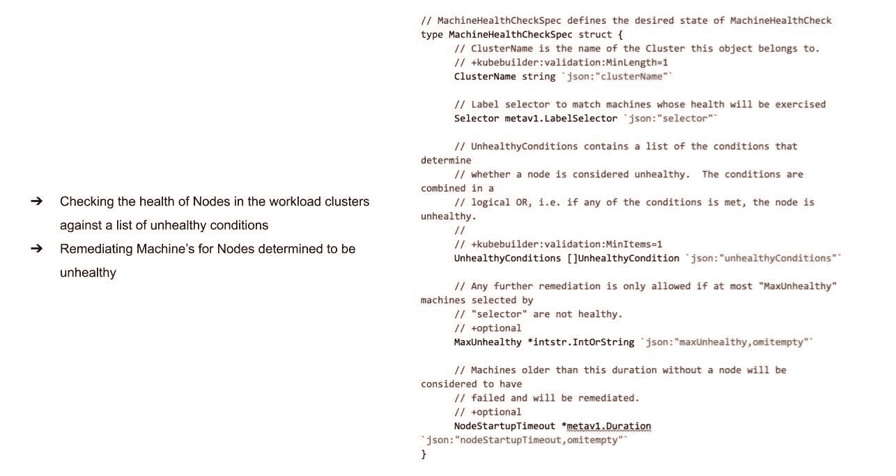

CAPI —健康检查

以上所有控制器都接受用户使用 CRD(自定义资源定义)的声明性配置。集群 API v1alpha3 版本增加了许多重要功能，如声明式控制平面管理(基于 Kubeadm 的控制平面(KCP)提供声明式 API 来部署、管理和扩展 Kubernetes 控制平面，包括 etcd)、跨域控制放置(控制器节点的多 az/故障域放置)、实验性机器池(如自动扩展组)、使用机器健康检查自动替换不健康的节点等。和少数附加组件，如群集资源集。

除了上述核心组件之外，基础架构提供者特定控制器、引导提供者控制器、用于验证的 webhook 控制器、集群 API 使用 cert-manager 来管理其 web hook 所需的证书，这些证书作为部署 CAPI 的一部分部署在单独的名称空间中。

[clusterctl](https://cluster-api.sigs.k8s.io/clusterctl/overview.html) CLI 工具处理管理集群上的集群 API 的生命周期，并自动获取定义 CAPI 组件、提供商组件的 YAML 文件并进行安装。使用 clusterctl，用户可以根据安装的基础架构提供程序和引导提供程序，搭建创建集群所需的配置模板(clusterctl config cluster 命令返回用于创建工作负载集群的 YAML 模板)。此外，它编码了一组管理提供商的最佳实践，帮助用户避免错误配置或管理第 2 天的操作，如升级。

以下是安装 CAPI 时在管理群集上创建的不同组件:

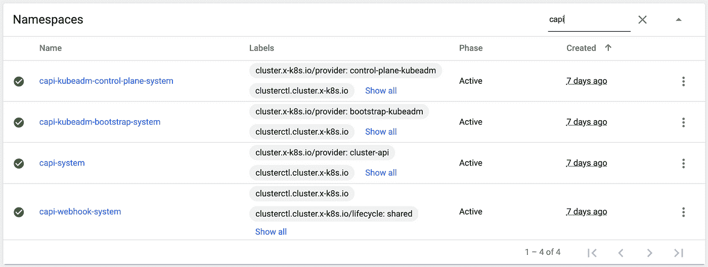

CAPI —名称空间

各个组件的控制器管理器被部署在相关联的命名空间中:

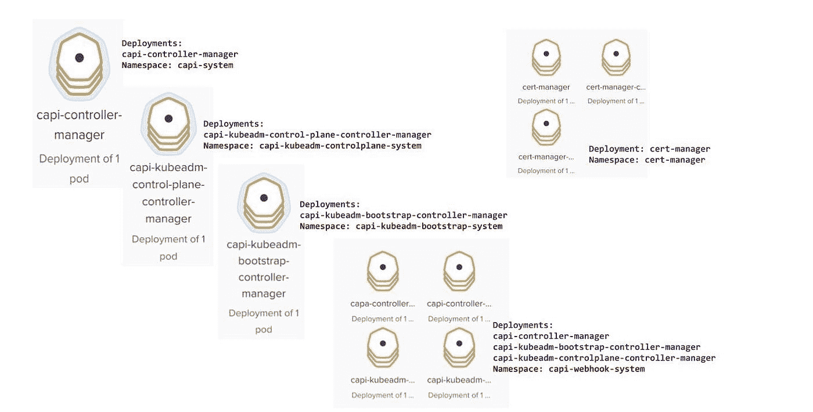

CAPI —组件

以下是应用于管理集群的一组 CRD，包括核心 CAPI CRD 和引导提供商 CRD。

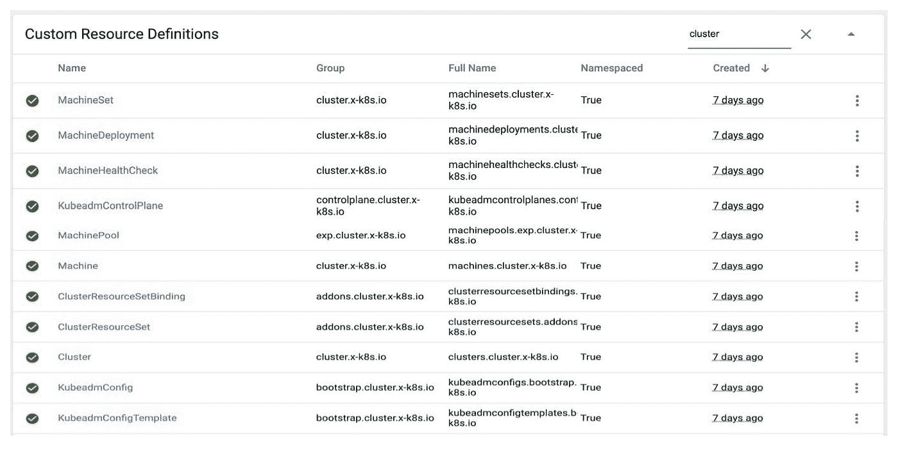

CAPI —自定义资源定义

capi-controller-manager 部署在“capi-system”命名空间中，监视对象:集群、机器、机器部署、机器健康检查、机器集和机器池(实验)。

capi-系统-capi-控制器-管理器

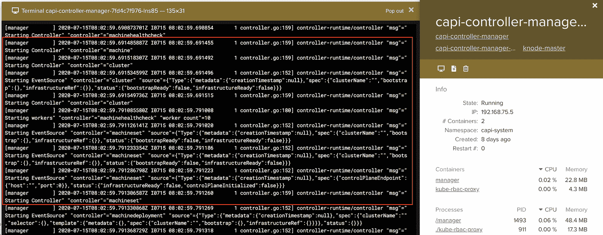

capi-系统-capi-控制器-管理器

kubeadm-bootstrap-controller-manager 部署在“capi-kubeadm-bootstrap-system”命名空间中，并监视对象 KubeadmConfig 和 KubeadmConfigTemplates。

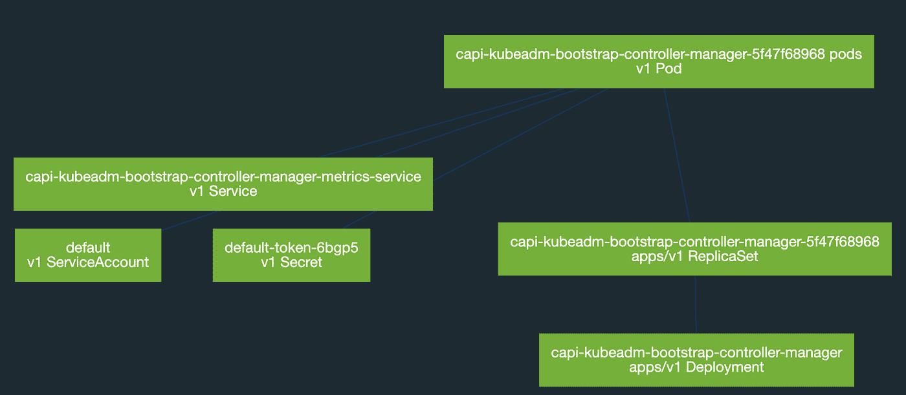

capi-kube ADM-bootstrap-system-capi-kube ADM-bot strap-controller-manager

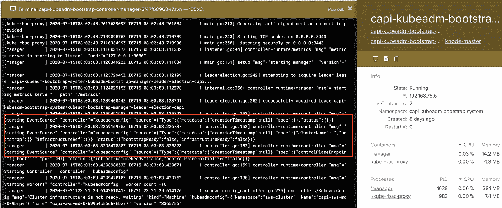

capi-kube ADM-bootstrap-system-capi-kube ADM-bot strap-controller-manager

kubeadm-control-plane-controller-manager 部署在“capi-kube ADM-control-plane-system”命名空间中，监视集群中的 kube ADM 控制平面资源。

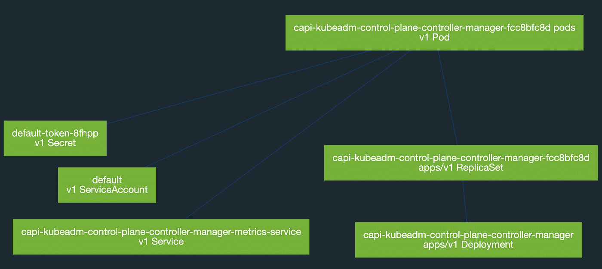

capi-kube ADM-控制平面-系统-capi-kube ADM-控制平面-控制器-管理器

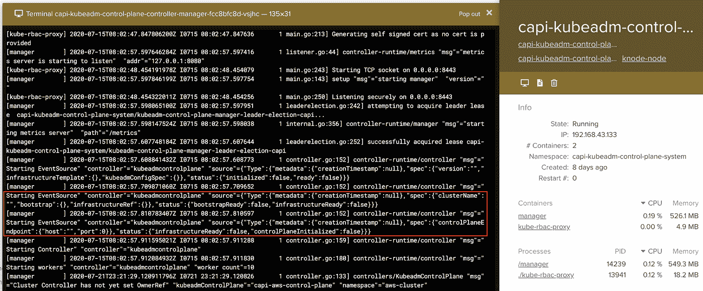

capi-kube ADM-控制平面-系统-capi-kube ADM-控制平面-控制器-管理器

# 使用 CAPI 和 CAPA 在 AWS 上部署集群(AWS 的集群 API 提供程序)

一旦建立了管理集群，用户就可以通过管理集群使用 CAPI 来实例化一个或多个工作负载集群。所有受支持的提供程序都使用“clusterctl”提供引导，该模板返回用于部署提供程序特定的控制器和其他支持对象的 YAML 模板。用户可以使用 CLI 在支持 CAPI 的集群上安装提供程序(单个集群可以包含多个集群，因为每个提供程序都有不同的集群和机器规格)(例如:*cluster CTL init—infra structure AWS*—这会将所有 CAP 组件部署到集群)。

[CAPA](https://github.com/kubernetes-sigs/cluster-api-provider-aws) 是 AWS 的集群 api 提供者，使用户能够使用 AWS 作为平台，通过 CAPI 创建 Kubernetes 集群，machine spec 在这里创建 EC2 实例和所有其他对象，如 VPC、子网、路由表等。也会被创造出来。用户可以参考 [CRD](https://github.com/kubernetes-sigs/cluster-api-provider-aws/tree/master/config/crd/bases) 规范来定制云提供商的大部分具体配置。

先决条件包括 IAM 实体，允许引导和管理集群在 AWS 上创建资源。诸如 regions、ssh-key、machine-type 等其他变量可以作为环境变量提供，这些变量将替换使用 clusterctl 创建的配置。管理员帐户凭证存储在一个秘密的。

capa-controller-manager 部署在“capa-system”命名空间中，监视对象:AWSCluster、AWSMachine、AWSMachineDeployments，当在管理集群上创建这些对象时，它们将被转换为 AWS EC2 实例。控制器协调并确保所有相关对象都已创建。

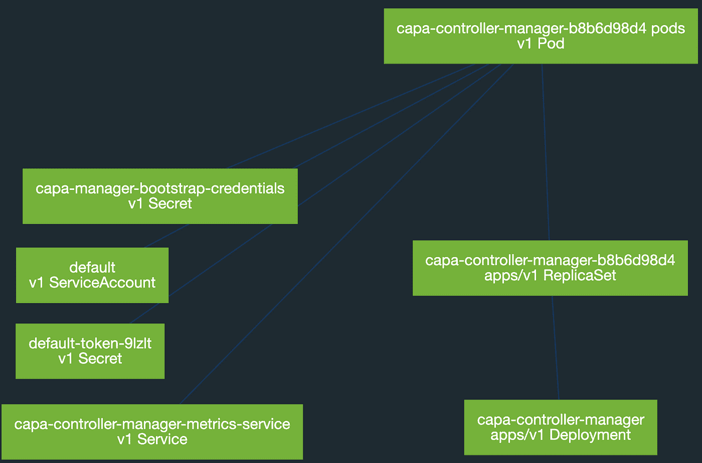

capa-系统—capa-控制者-管理者

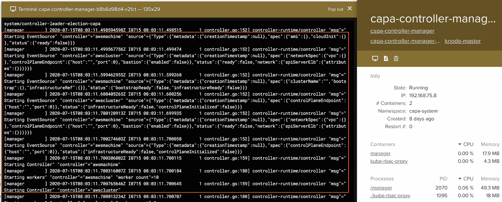

capa-系统—capa-控制者-管理者

以下拓扑中的管理集群是部署了 CAPI 的本地集群，clusterctl 用于安装 CAPA 组件。用户可以使用 clusterctl 创建具有预定义的群集 API 对象列表的基本配置模板；集群、机器、机器部署等。这是特定提供者所必需的。单个管理集群可以容纳多个提供者，并且在多提供者集群的情况下可以使用' *—基础架构*'标志。所有对象都可以在一个名称空间中确定范围，这在管理集群大规模管理工作负载集群时非常方便。

AWS 的集群 API 提供程序

以下是提供商特定的 CRD。以这样或那样的方式，其中一些映射到 CAPI 的核心组件，如集群和机器。

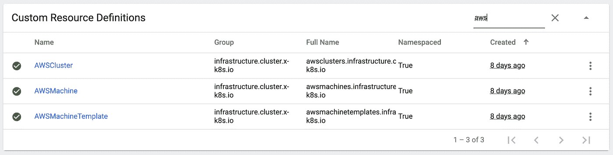

CAPA —自定义资源定义

下面的清单用于在 AWS 上创建集群和相关的机器。所有对象的范围都在“aws-cluster”命名空间下。

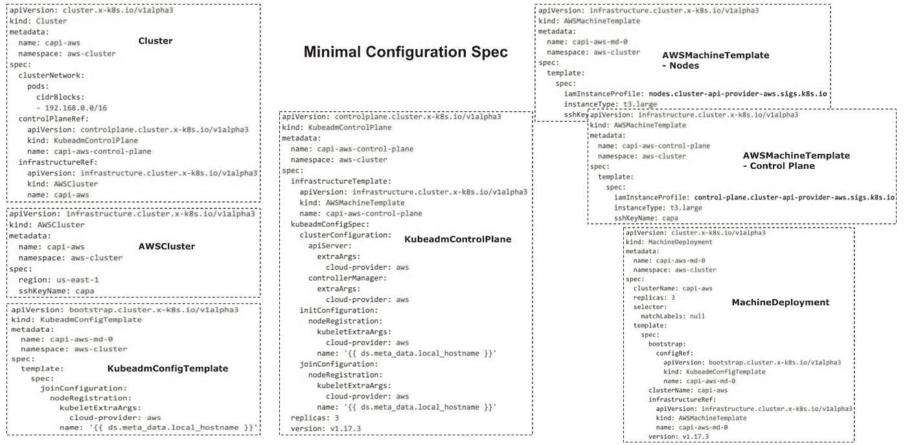

CAPA —配置规格

对象引用其他对象(例如 cluster 包含对 KubeadmContolPlane 和 AWSCluster 的引用)，下面显示了一个示例映射:

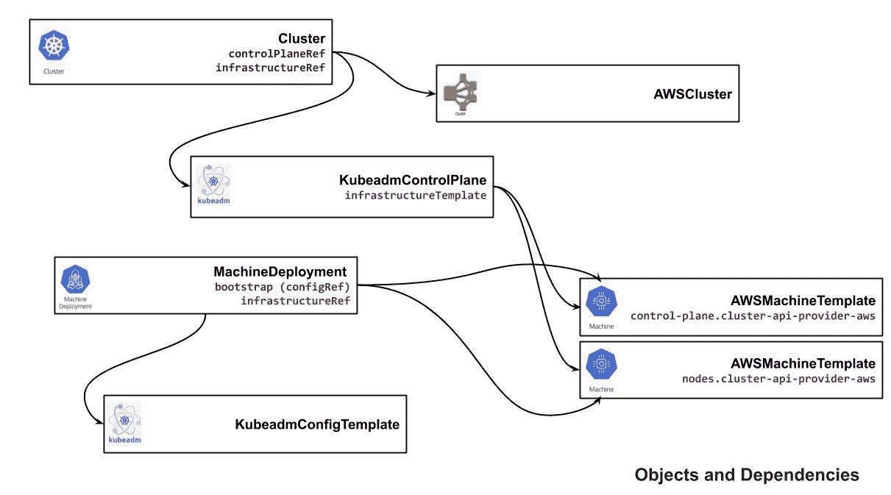

CAPA —物件

CAPA 控制器管理器创建对象:

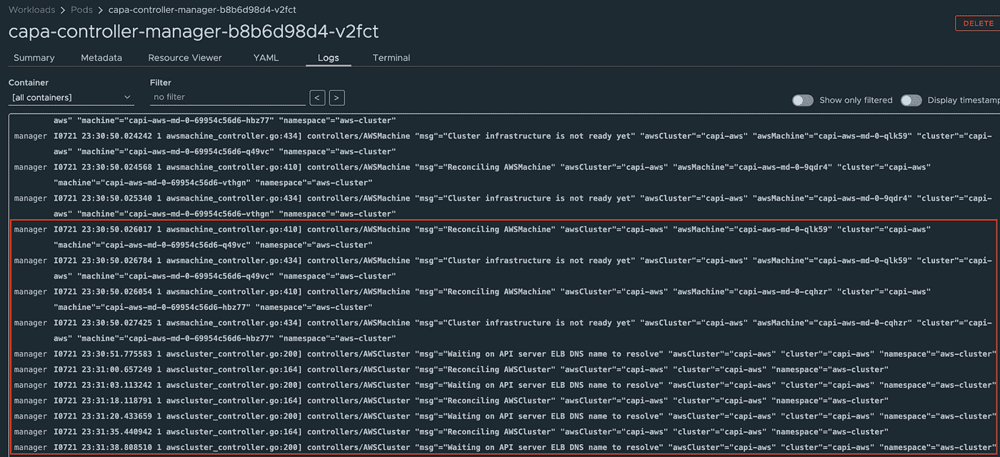

CAPA —主计长兼经理

CAPA 控制器管理器正在创建计算机(ec2 实例):

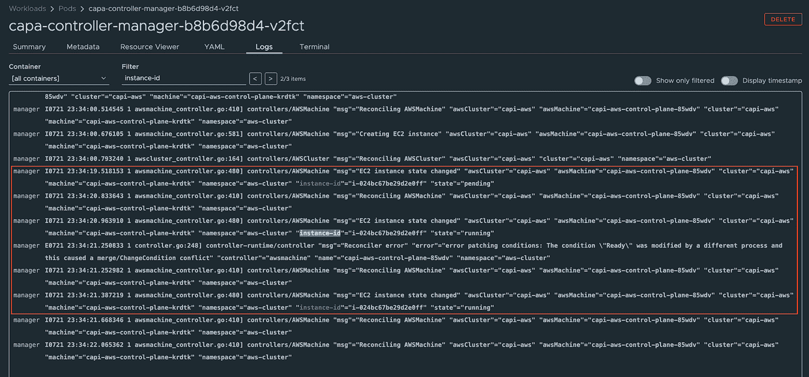

CAPA —主计长兼经理

CAPA 使用户能够使用现有的 VPC，或者默认情况下，它创建一个带有私有和公共子网的 VPC。在多分区设置中，用户可以在 AWSCluster 中提供一个地图，提供每个分区的子网信息。

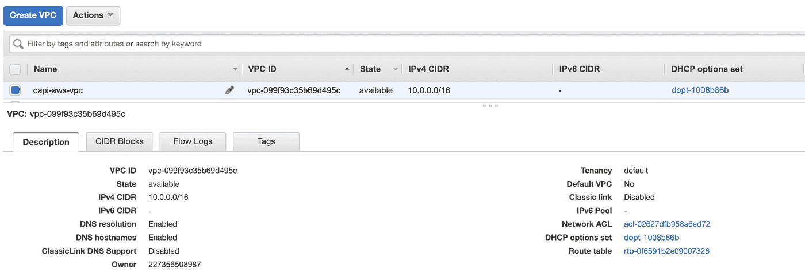

CAPA — VPC

子网:

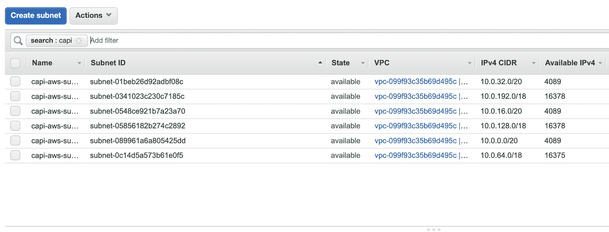

CAPA —子网

路由表:

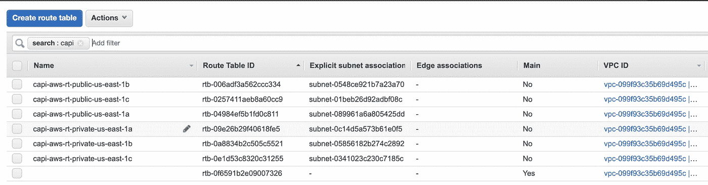

CAPA —路由表

安全组:

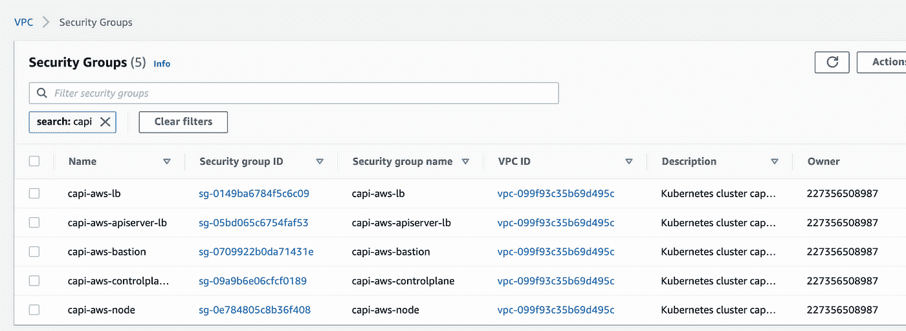

CAPA —安全团体

连接到三个控制器的弹性 IP:

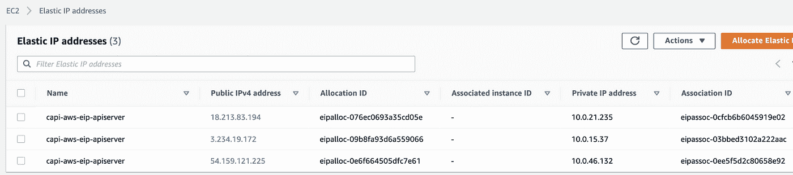

CAPA——控制器的 EIP

基于 v1alpha3 Kubeadm 控制平面(KCP)的 HA 控制平面提供了一个声明式 API 来部署和扩展 Kubernetes 控制平面，包括 Kubernetes 部署副本扩展中的 etcd。这种方法消除了删除 etcd 成员时的手动干预。在缩减规模的同时，KCP 自动化了部署、扩展和升级。如下所示，所有机器都是基于配置规范创建的。

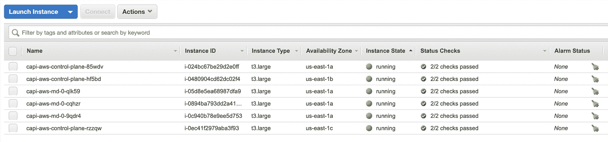

CAPA-库伯内特斯星团

通过使用单独的 AWSMachineTemplates 并在 KubeadmControlPlane 规范中引用相同的模板，可以单独控制和配置控制平面。

CAPA——控制平面机器

跨故障域(可用性区域)放置的主节点:

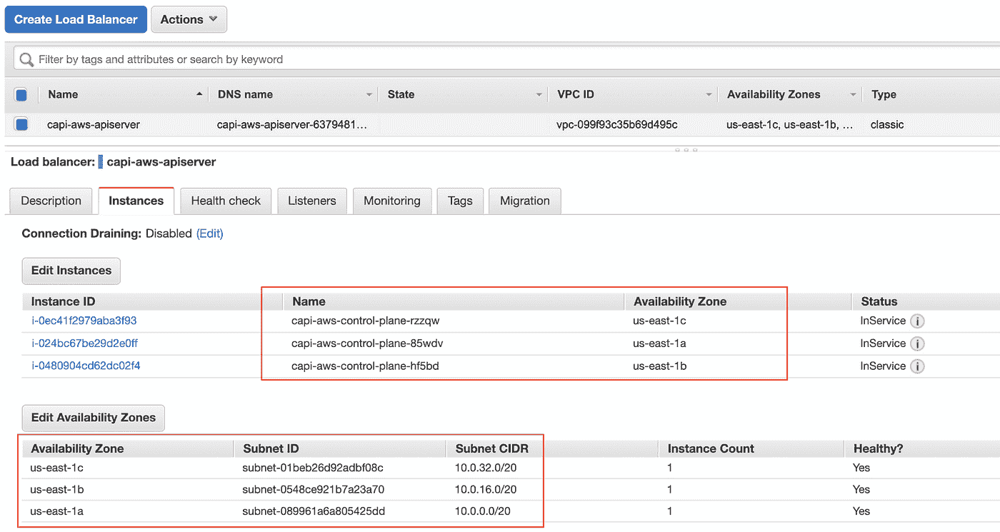

CAPA —控制平面机器—十字路口

通过拥有单独的 AWSMachineTemplate 并在 MachineDeployment 规范中引用相同的模板，可以单独控制和配置工作节点。MachineDeployment 在一系列机器集(机器上不变的抽象)上编排部署。

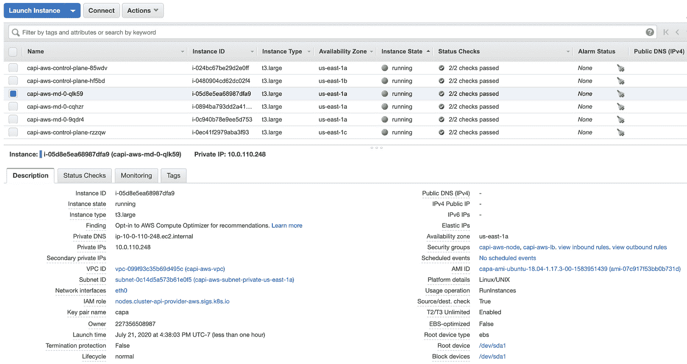

CAPA —节点机器

一旦所有的机器都启动了所需的网络，capi-kube ADM-控制平面控制器就启动主节点。

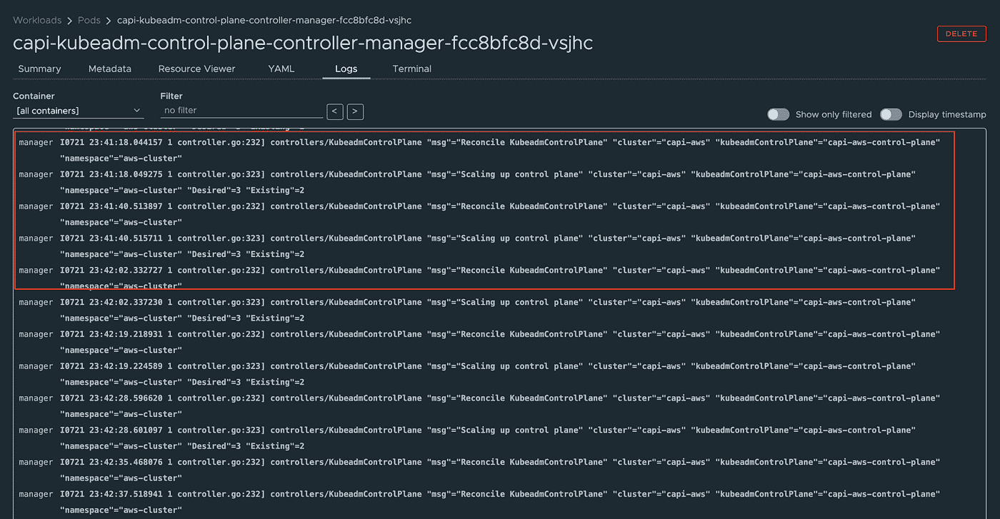

CAPA-kube ADM 控制面板引导程序

capi-kube ADM-bootstrap-controller-manager 负责将节点加入自举主节点。有功能请求和路线图里程碑，以支持云提供商特定的托管 Kubernetes 服务控制平面(EKS、AKS、GKE 等)。)可以通过 CAPI 管理，用户可以通过 CAPI 管理托管的 Kubernetes 服务。

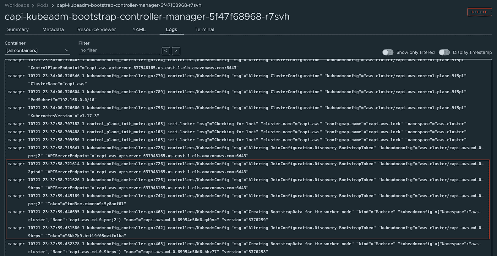

CAPA-kube ADM 节点自举

所有机密信息以及 kubeconfig 都存储为机密信息，可以使用'*cluster CTL move<cluster _ name>*'将其移动到工作负载集群。网络解决方案是一个类似于传统 Kubeadm 引导程序的附加程序。

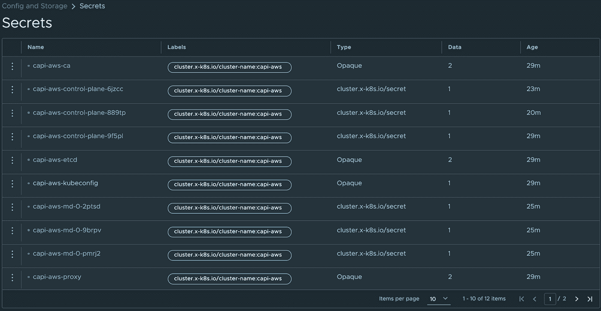

CAPA——秘密和 Kubeconfig

所有状态信息都保存在管理集群中，集群规范状态字段存储信息(资源 id、名称等。).由基础设施提供商创建的所有资源都被标记，这些资源在关联中使用，并且在删除集群时确保没有创建的资源被留下。

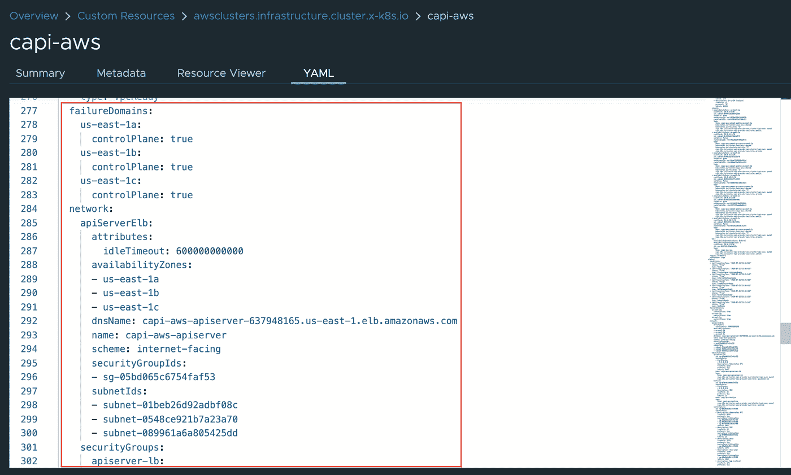

CAPA —规格状态

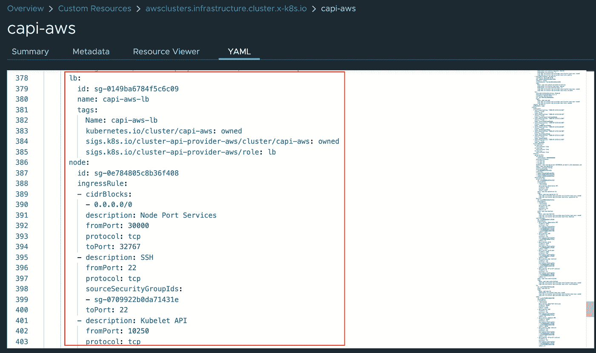

CAPA —规格状态

# 使用 CAPZ(Azure 集群 API 提供者)的 CAPI 在 Azure 上进行集群部署—从单个管理集群进行多云部署

单个管理集群可用于托管多个基础设施提供商。CAPZ 部署在“capz-system”命名空间中。用户可以使用名称空间范围来根据基础设施提供商(或任何标准)轻松分离集群，例如在下面的场景中，所有基于 azure 集群的配置都部署在“azure-cluster”名称空间上。

部署 capz 控制器管理器，并监视 Azure 特定对象(AzureCluster、AzureMachine 等)。)在集群中。

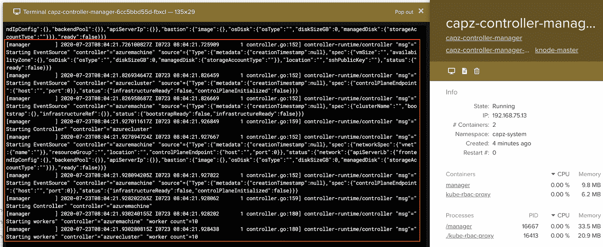

CAPZ —控制器管理器

引导凭证秘密包含所需的服务主体以及允许创建资源的相关角色(类似于 ARM)。

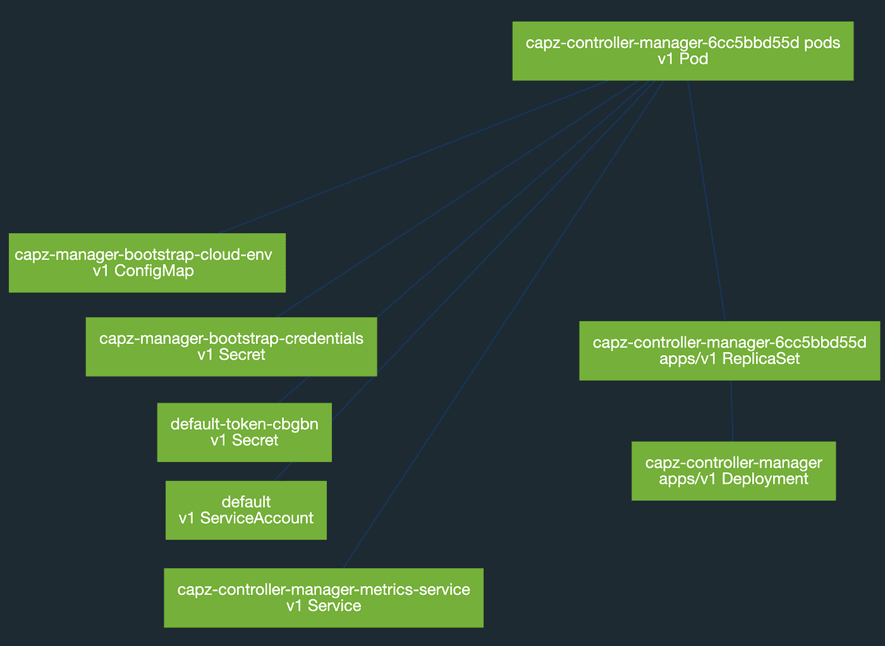

CAPZ —控制器管理器

群集中特定于 Azure 提供商的 CRD:

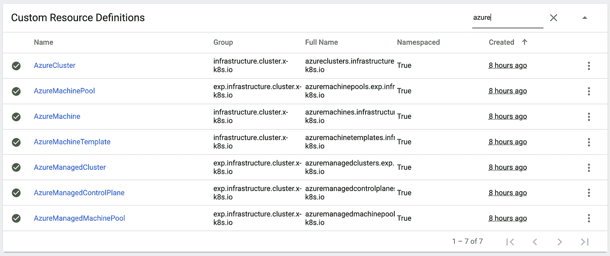

CAPZ —自定义资源定义

管理集群上的 CAPZ 在 Azure 上创建所需的基础架构:

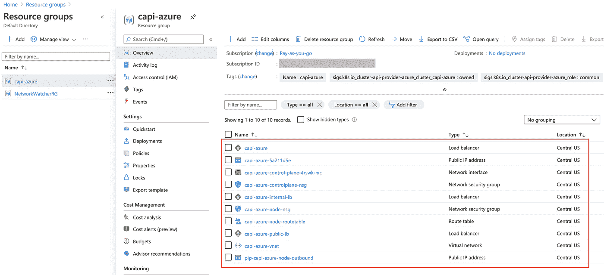

CAPZ-Kubernetes 星团

Azure 上的虚拟机由 CAPZ 在管理集群上创建，一旦基础架构创建完成，KCP 和 KBP 将引导一个成熟的 HA Kubernetes 集群。

CAPZ —机器

有了上述配置，用户可以跨多个云提供商管理多个集群。下面是一个示例，列出了命名空间范围内的管理集群上的集群、机器和控制平面:

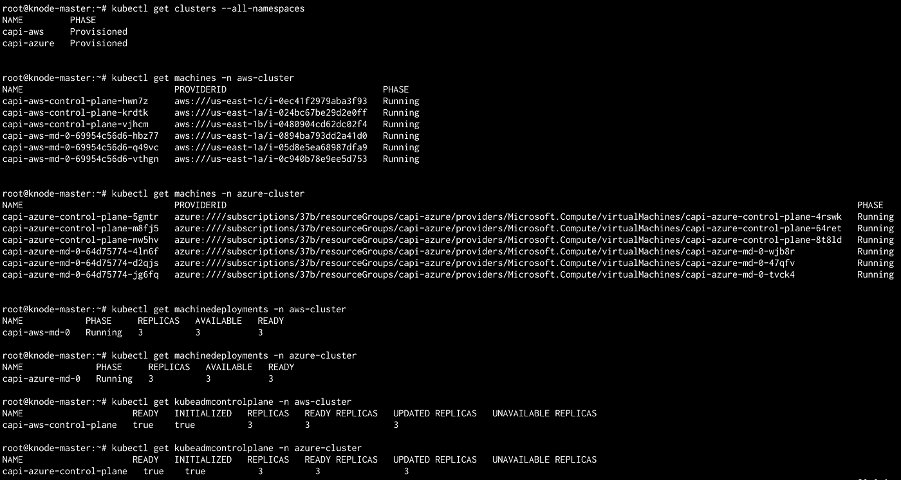

CAPI —多基础设施提供商

# 第二天运营—零停机升级和扩展

Kubernetes 集群级第二天操作包括版本升级、机器映像升级、补丁等。ZDT 是一个重要的方面，它对于实时环境始终可用至关重要。CAPA 使用的策略是用户无需遵循蓝/绿方法(拥有两个完全相同的集群)。

所有升级方案(控制平面和节点——Kubernetes 版本升级、控制平面和节点映像升级/更改、规格更改)都遵循滚动更新策略，这与 Kubernetes 部署非常相似，在 Kubernetes 部署中，通过增量更新实例来实现零停机。到目前为止，唯一支持的模式是 RollingUpdate。

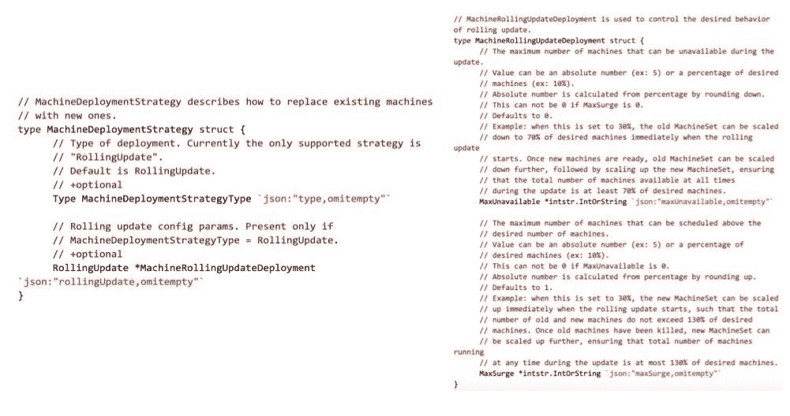

CAPI —升级战略

kubeadm-bootstrap 提供商使用“kubeadm upgrade”实用程序来执行与 Kubernetes 相关的升级，而基础设施提供商支持云提供商端的滚动更新。Clusterctl 也可用于使用相同的 kubeadm CLI 表示法(clusterctl upgrade plan/apply)执行升级。

Kubeadm 升级实用程序—步骤顺序:

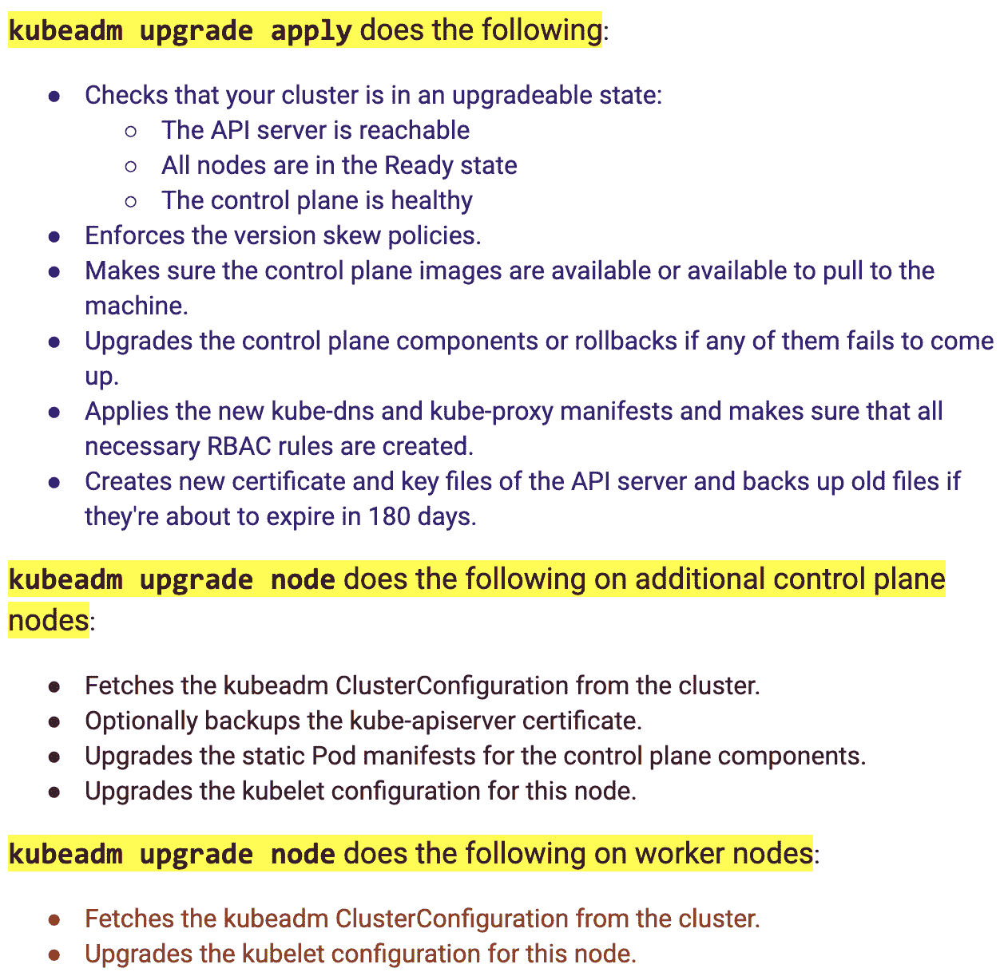

Kubeadm —升级

# 零停机升级

要升级 Kubernetes 控制平面版本，用户可以修改 *KubeadmControlPlane 资源的规范。版本*字段。这将触发控制平面的滚动升级。

例如，在上面创建的 AWS 工作负载集群中，有三个版本为 1.17.3 的控制器副本:

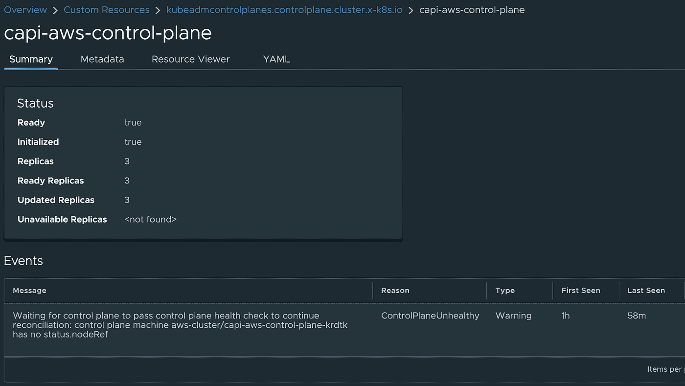

CAPI —控制平面升级

将 KubeadmControlPlane 规范中的版本 1.17.3 修改为 1.17.5:

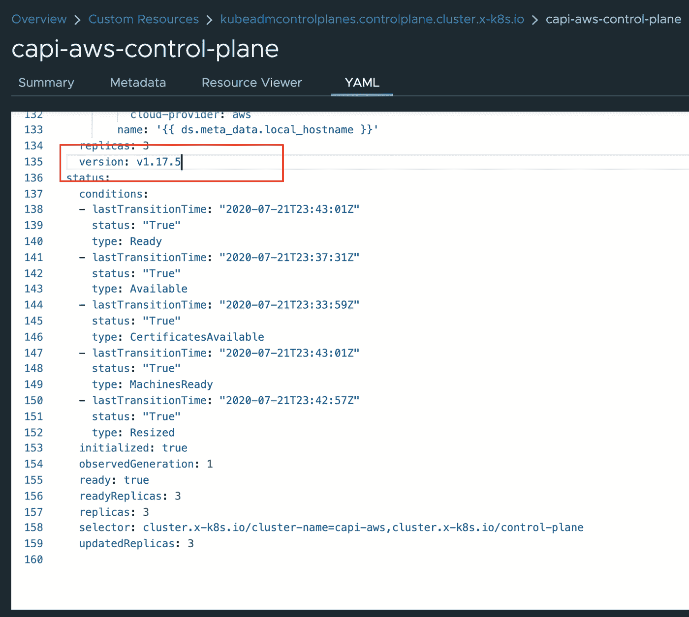

CAPI —控制平面升级

控制平面节点的滚动升级:

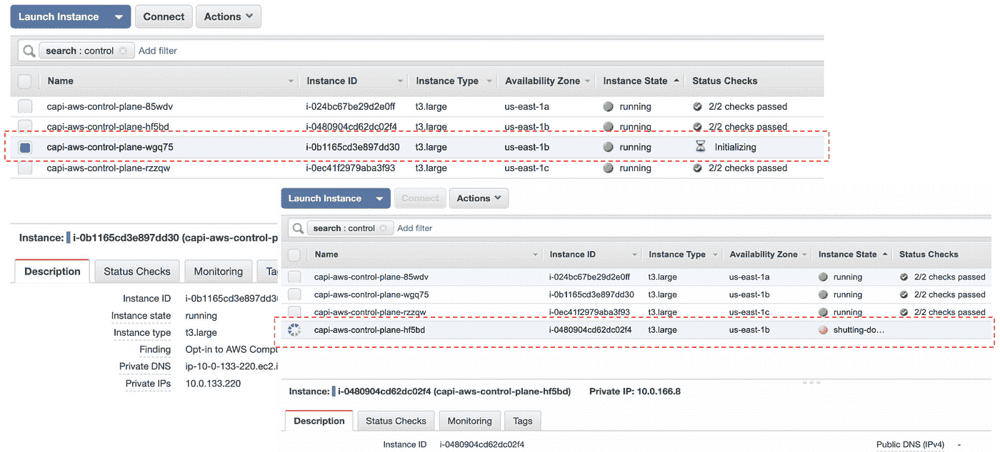

CAPI —控制平面升级—滚动更新

类似地，工作负载机器被分组到一个或多个机器部署下，机器部署将透明地管理机器集和机器，以允许无缝扩展体验。对 MachineDeployments 规范的修改将开始工作负载计算机的滚动更新。作为升级的一部分，所有节点都被封锁并排空。

节点的滚动升级:

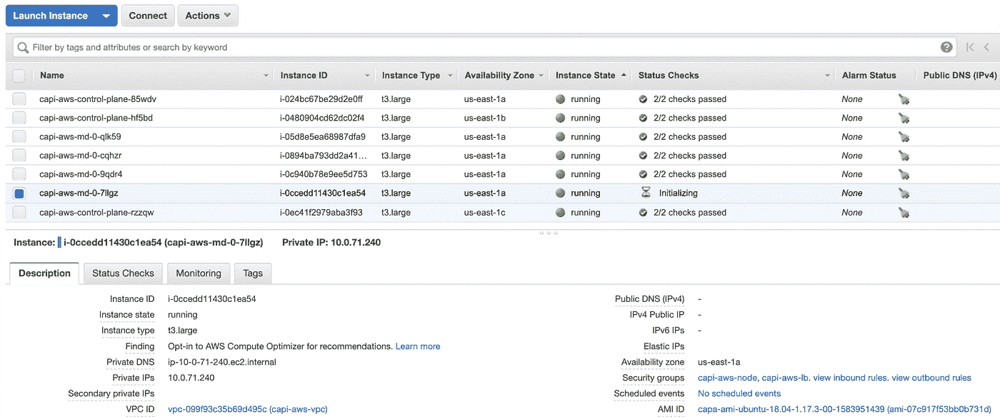

CAPI —节点升级—滚动更新

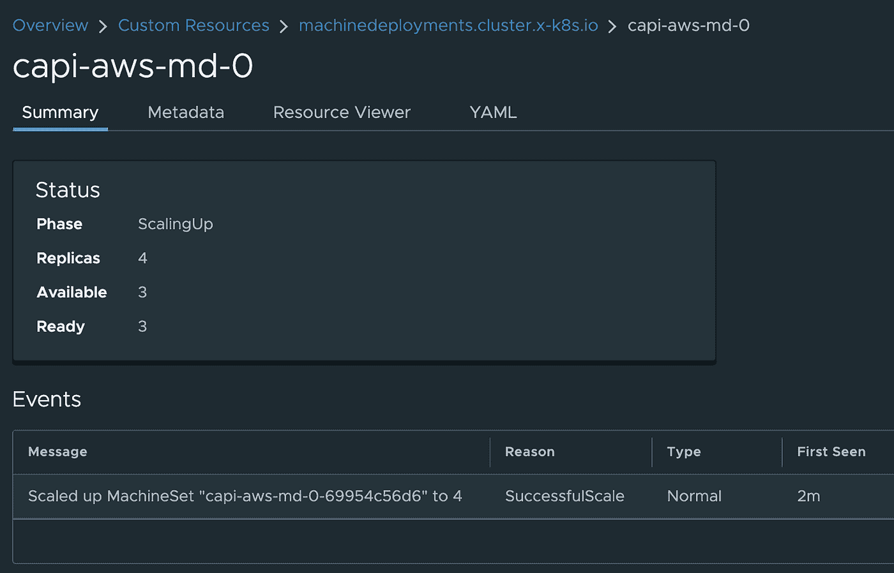

CAPI —节点升级—机器部署

滚动升级— Kubernetes 版本:

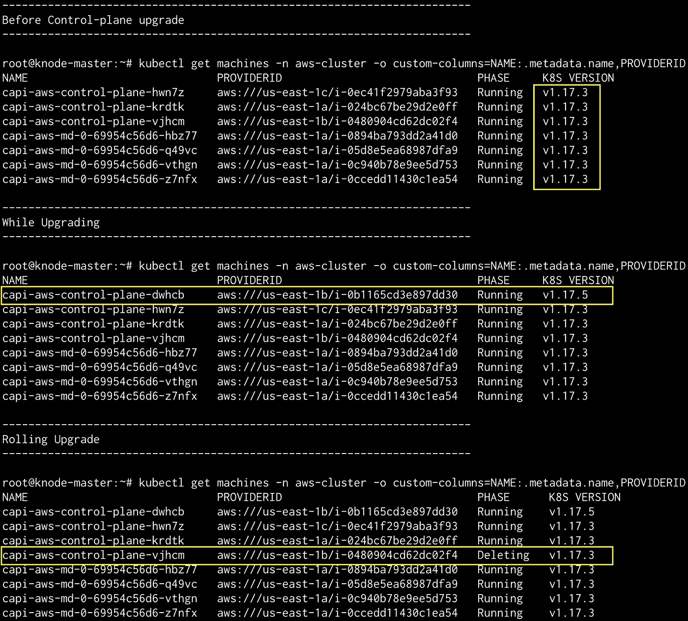

CAPI-Kubernetes 版本升级

# 缩放节点

缩放工作与 Kubernetes 部署规范工作*中的 *replica_count* 相同。*在 v1alpha3 中，试验性地增加了“machinepool ”,它作为自动扩展组在云提供商端实施，即使没有 it，用户也可以更改 KubeadmControlPlane(扩展主节点)或 MachineDeployment(扩展节点)中的“*副本*”字段，以无缝扩展集群中的实例数量。

例如，将 MachineDeployment 规范中的现有“副本:3”更改为“副本:4”将开始滚动群集中的新节点:

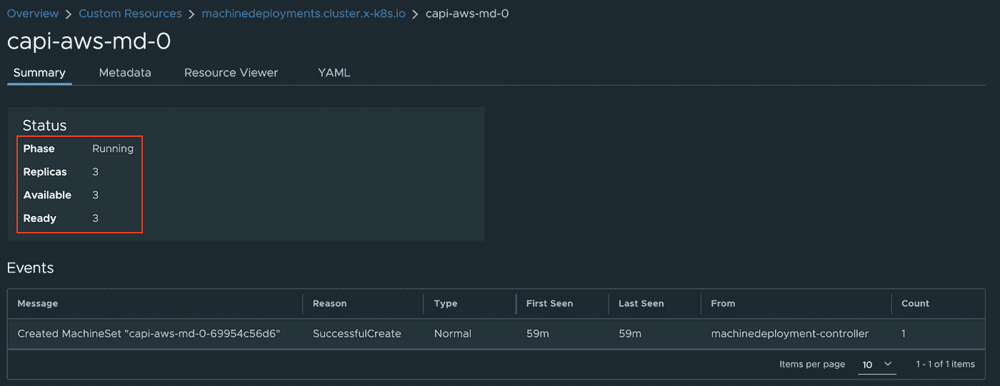

CAPI—节点缩放

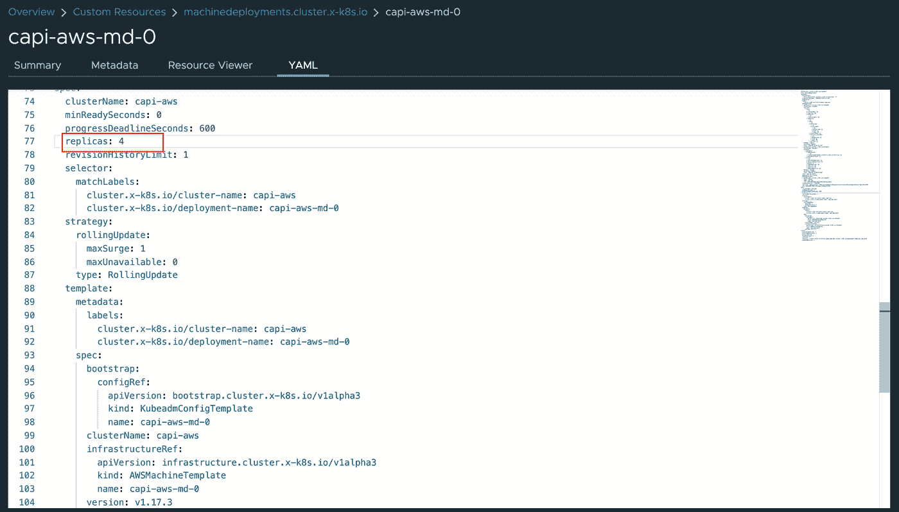

CAPI —节点扩展—机器部署


CAPI —节点缩放


CAPI —节点缩放

# 更改基础图像

实例基础映像更改也遵循相同的滚动更新策略，其中将安装具有已更改映像的较新机器，并使用 cordon and drain 替换旧实例。

例如，在 AWS 场景中，可以修改机器规范中的“ami (Amazon 机器映像)”字段，以更改主节点和节点上的基本映像。


CAPI —改变机器的基本形象

这将触发具有上面指定的较新映像的节点的滚动更新:


CAPI —改变机器的基本形象

# 用户数据/脚本

KubeadmConfigTemplate 和 KubeadmControlPlane 使用户能够分两个阶段执行命令:“preKubeadmCommands”和“postKubeadmCommands”。这使得用户能够使用声明性规范提供云初始化类型的指令。例如，通过将 VM 镜像与所需的清单打包，并使用“postKubeadmCommands”调用它们，这可以用于自动部署任何附加组件。


CAPI —命令

其目的是让集群 API 用户有一个统一的平台来管理 Kubernetes 集群及其跨多个云提供商的相关基础设施需求，希望也能在本地实现。用户无需管理具有不同云特定构造的复杂管道，就可以使用 CAPI 以简单的声明方式跨多个提供商提供和管理 Kubernetes 集群的整个生命周期，以一种或另一种方式提供零接触提供体验，并允许用户使用中央集群实体管理所有空间分布的 Kubernetes 集群。

集群 API 的采用应该提供跨不同基础设施的可移植性(具有特定于每个云提供商的一些配置细节)。对于用户来说，这意味着相对一致和可靠的用户体验，无论云提供商或内部环境如何。