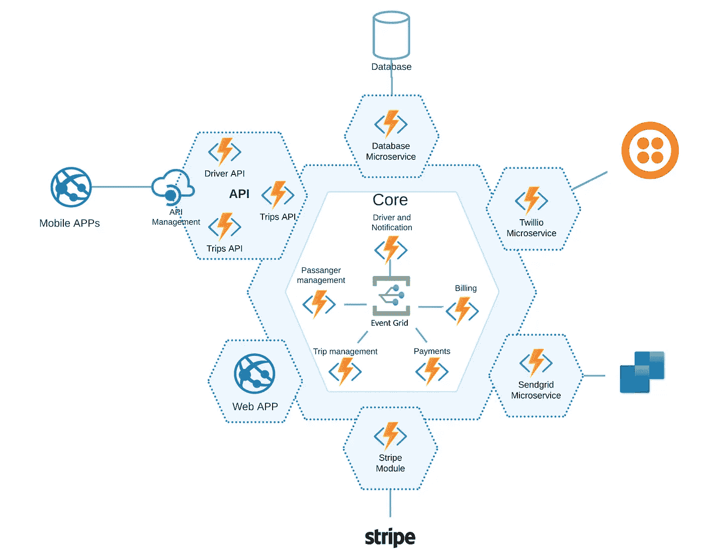
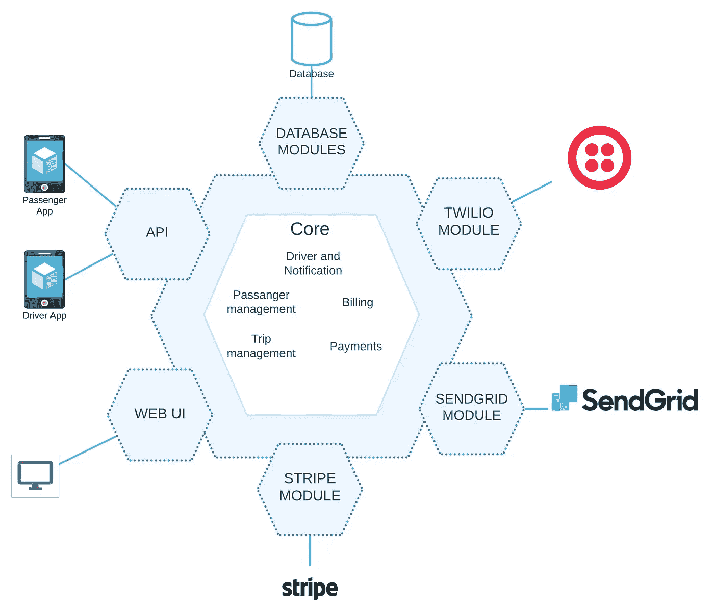
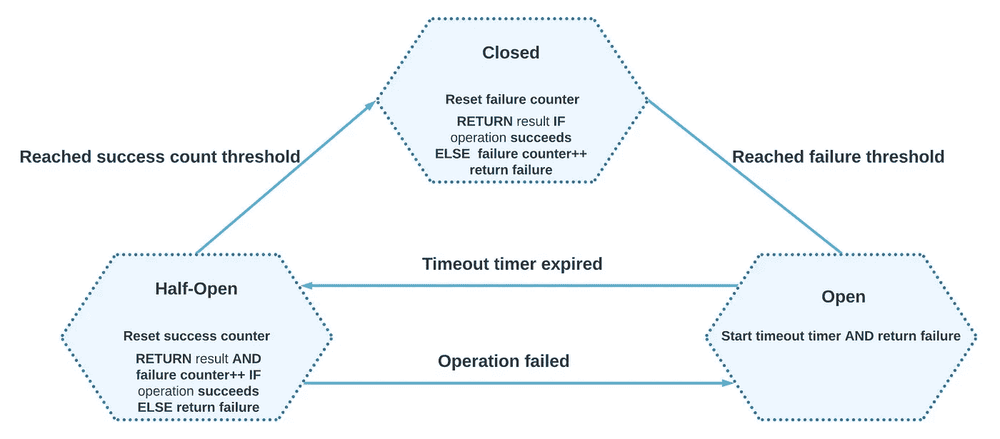
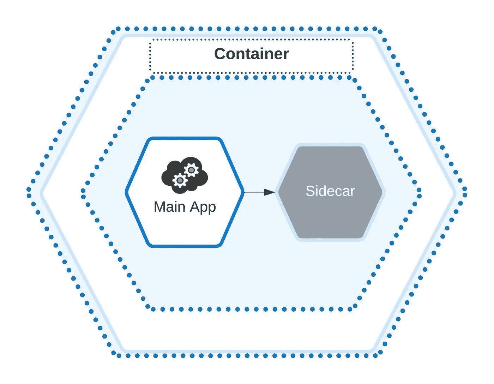

# 使用微服务架构的多云策略

> 原文：<https://itnext.io/multi-cloud-strategies-using-microservices-architecture-8320aa708c37?source=collection_archive---------1----------------------->

# 遵循这份在 Azure、AWS 和 Google Cloud 中构建微服务的完整指南，构建高可用性、可伸缩性和高性能的应用。

2005 年，Peter Rodgers 博士在 web Services Edge 会议的一次演讲中谈到了微 Web 服务，当时第一代微 Web 服务是基于[面向服务的架构](https://www.redhat.com/en/topics/cloud-native-apps/what-is-service-oriented-architecture) (SOA)。SOA 是作为任务执行的“自包含”软件模块，这允许服务基于 SOAP(简单对象访问协议)进行通信。SOAP 的主要思想是，“尽可能做最简单的事情。”

如今，在架构呼叫期间，没有任何选项可以避免谈论微服务，尤其是如果您想要设计云或多云、模块化、可扩展和多用户应用程序。在本文中，我将解释微服务以及如何基于多云场景设计应用程序。我将带您了解微服务设计模式，并将这些信息包装到一个架构示例中。

> *这是 DZone 2022 微服务和容器化趋势报告中的一篇文章。更多:* [*阅读报道*](https://dzone.com/trendreports/microservices-and-containerization)

# 微服务和多云环境

在我们进入微服务架构、模式以及如何构建支持多云部署的基于微服务的应用之前，让我们先定义一下术语。微服务是一种架构模式，它允许应用程序由松散耦合的模块组成。然而，微服务设计应遵循以下规则:

*   每个模块或微服务都有自己的数据，因此应该有独立的数据库。
*   每个微服务都应该由自己的团队开发。这并不意味着基于微服务的应用不能由一个团队开发，然而，每个微服务有一个团队显示了微服务可以多么独立。
*   微服务应该有独立的部署流程。
*   微服务应该能够更好地控制资源和计算能力，以便您可以根据服务需求独立扩展每项服务。
*   微服务可以用不同的语言编写，但是要用像 [REST](https://dzone.com/refcardz/rest-foundations-restful) 这样的单一协议进行通信。

多云(即混合云)意味着有两种不同的方法来通过多个云提供商传播应用程序。例如，我们可以在 AWS 中构建核心应用程序，还有一些部分可以部署到 Azure 和 Google Cloud。另一个多云的例子是，为一个云设计的应用程序只需稍加修改就可以迁移到另一个云。

# 微服务与整体服务

在开始举例之前，我们先来看一下微服务和整体架构的优缺点:

## 优点:微型服务

*   **可扩展性** —由于我们拥有所有独立的服务，我们可以独立扩展每项服务。
*   **隔离** —当一个服务停止时，一个大型项目可能不会受到影响。
*   **灵活性** —你可以使用不同的语言和技术，因为所有的服务都是独立的。我们可以将整个项目分成微服务，每个微服务将由单独的团队开发和支持。
*   **DevOps 独立** —所有微服务独立；因此，我们可以为每个微服务实现独立的部署流程。

## 缺点:

*   **复杂性** —对于大型企业级公司和平台来说，微服务架构是一个不错的选择。以网飞为例。在那里，你可以将域和子域划分给不同的服务和团队。然而，对于小型公司来说，分离可能会增加多余的复杂性。此外，将小项目分成微服务也是不可能的。
*   **测试** —测试微服务应用可能是一项艰巨的任务，因为您可能需要运行其他服务。
*   **调试** —调试微服务可能是一项痛苦的任务；它可能包括运行几个微服务。此外，我们需要不断地调查日志。这个问题可以通过集成监控平台来部分解决。

当我开始设计一个解决方案时，我总是将单片架构作为起点。使用这种方法，我们可以实现以下目标:

*   在设计和实现期间，我们已经可以看到我们的应用程序是否可以迁移到微服务。
*   我们可以通过一步一步的方法确定可以迁移到微服务的整体应用。

## 赞成:整体

*   **简单性** —单片架构相对简单，可用作基础架构或微服务的第一步。
*   **简单的开发运维** —开发运维流程可以很简单，因为我们可能需要自动化一个简单的应用。

## 缺点:

*   **供应商锁定** —对于整体架构，我们可能会被一家供应商/云提供商锁定。整体架构中的所有模块彼此紧密相连。很难将它们分散到不同的供应商。
*   **不灵活的开发运维** —一个企业级整体应用的开发运维流程可能会花费大量时间，因为我们需要等待所有模块构建完成并经过测试。
*   **坚持使用一种编程语言/技术**——整体架构不太灵活——你需要坚持使用一种技术/编程语言。否则，你必须重写整个应用程序来改变核心技术。

在图 1 中，你可以看到一个典型的旅行系统模块化整体架构的例子。它允许乘客找到司机，预订，并加入旅行。

*图 1:旅游预订应用*

该系统由几个模块组成:

*   用户界面/前端
*   应用程序接口
*   SQL 适配器
*   处理支付的条带适配器
*   发送网格来管理电子邮件
*   Twillio 适配器，能够通过电话进行通信(通话、短信、视频)

这种整体架构可以迁移到微服务架构。每个服务都可以独立运行，并且可以将状态保存在自己的数据库中。

上面解释的解决方案非常简单，可以转化为微服务，没有很多问题。然而，当涉及到企业级别时，这种迁移要复杂得多，就像在网飞这样的大公司中看到的那样。

# 用于构建微服务架构的云组件和服务

在本节中，我们将了解一些可用于构建微服务架构的云服务，以便我们知道在微服务架构设计和实施期间选择什么服务或云组件。

# 集装箱发动机

容器引擎对于构建微服务至关重要，因为它们允许在不同的云提供商中分离、编排和管理微服务。Docker 是一个广泛使用的容器引擎，它允许人们将每个微服务包装到一个容器中，并将其放入基于云的容器编排系统，如 Kubernetes (AKS，EKS)或直接启动应用程序。Containerd 与 Docker 相同，但具有轻量级和更安全的架构。

# 管弦乐演奏家

Kubernetes 是一个流行的开源系统，用于编排、自动化部署和扩展容器应用。它包含并自动化了部署。 [Azure](https://docs.microsoft.com/en-us/azure/aks/) 、 [AWS](https://aws.amazon.com/eks/) 和 [Google Cloud](https://cloud.google.com/kubernetes-engine) 拥有自己的托管编排服务，这些服务已经包括负载平衡、自动扩展、工作负载管理、监控和一个[服务网格](https://docs.microsoft.com/de-de/azure/aks/open-service-mesh-about)。

[Azure Service Fabric](https://docs.microsoft.com/en-us/azure/service-fabric/service-fabric-overview) 是一个编排微服务的分布式平台。几年来，我们的主要目标是为。基于 NET Core/Framework 和 Windows 的微服务；我们可以在[选择服务流程图](https://docs.microsoft.com/en-us/azure/architecture/guide/technology-choices/images/compute-choices.png)中看到。微软声称 Service Fabric 也支持其他语言和平台，比如 Linux。

# 消息总线

[队列](https://en.wikipedia.org/wiki/Queue_%28abstract_data_type%29)是一种基于 FIFO(先进先出)原则的服务。所有的消息总线系统都基于这个服务。例如，Azure 有包含简单业务逻辑的[队列存储](https://docs.microsoft.com/en-us/azure/storage/queues/storage-queues-introduction)。如果您有一个需要集中消息存储的简单体系结构，您可以依赖队列。AWS 和 Google Cloud 也分别有[简单队列服务](https://aws.amazon.com/sqs/)和 [GC Pub/Sub](https://cloud.google.com/tasks/docs/comp-pub-sub) 。这些允许您在微服务和软件组件之间发送、存储和接收消息。

[服务总线/消息总线](https://www.enterpriseintegrationpatterns.com/MessageBus.html)基于与队列相同的方法。然而，消息总线有更多的特性——它包含死信队列、预定交付、消息延迟、事务、重复检测和许多其他特性。例如， [Azure Service Bus](https://docs.microsoft.com/en-us/azure/service-bus-messaging/service-bus-messaging-overview) 和 [AWS Managed Kafka service](https://aws.amazon.com/msk/) 是企业级应用程序的高可用性消息代理，可以处理成千上万的消息。

# 无服务器

无服务器允许我们纯粹通过事件驱动的方法来构建微服务架构。它是一个按需提供的云服务单元，旨在直接在云中构建微服务，而无需考虑应该使用什么容器引擎、orchestrator 或云服务。AWS 和 Azure 分别有 [Lambda](https://docs.aws.amazon.com/whitepapers/latest/serverless-multi-tier-architectures-api-gateway-lambda/microservices-with-lambda.html) 和 [Azure 函数](https://docs.microsoft.com/en-us/azure/azure-functions/)。[谷歌云功能](https://cloud.google.com/blog/products/serverless/serverless-from-the-ground-up-building-a-simple-microservice-with-cloud-functions-part-1)遵循同样的原理。

# 基本微服务设计模式

现在我们了解了微服务架构，可以开始使用微服务开发应用程序了。我们也了解使用微服务的好处，以及如何重构应用程序来支持这种架构。构建应用程序的最佳起点是了解微服务设计模式。

# 领域微服务

微服务领域模型([领域驱动设计](https://martinfowler.com/bliki/DomainDrivenDesign.html)的一部分)不仅仅是一个模式——它是一组设计和界定微服务的原则。应使用以下规则设计微服务域:

*   单个微服务应该是独立的业务功能。因此，整个服务应该局限于单个业务概念。
*   业务逻辑应该封装在基于 REST 的 API 中。

# 反腐败层

遗留系统可能有不可维护的代码和总体不佳的设计，但是我们仍然依赖来自这个模块的数据。反腐败层提供了新微服务架构和传统架构之间的外观或桥梁。因此，它允许我们远离操纵遗留代码，专注于特性开发。

*图 2:防腐层*

# 断路器

断路器提供了阻止级联失效并自动恢复到正常状态的机制。假设我们有服务 A 和服务 B，它们依赖于来自服务 C 的数据。我们在服务 C 中引入了一个影响服务 A 和 B 的错误。在一个设计良好的微服务架构中，每个服务都应该相互独立。

然而，从整体到微服务的重构过程中可能会出现依赖性。在这种情况下，您需要实现一个断路器来预测级联故障。断路器充当状态机。他们监控大量最近的故障，并决定下一步做什么。它们可以允许运行(**关闭**状态)或返回异常(**打开**或**半开**状态)。

*图 3:断路器状态*

# 服务网格

服务网格实现微服务架构的通信层。它确保服务请求的交付，提供负载平衡，加密数据(使用 TLS)，并提供其他服务的发现。服务网格还:

*   提供断路器逻辑
*   提供管理流量控制、网络弹性、安全性和身份验证的流程
*   有一个代理，它使用 sidecar 模式与微服务集成

它不仅允许您管理服务，还允许您收集遥测数据并将其发送到控制平面。我们实现了一个服务网格，如 [Istio](https://istio.io/) ，这是 Kubernetes 中最流行的管理微服务的服务网格框架。

*图 4:服务网格算法*

# 边车

Sidecar 是与主服务一起部署的实用程序。边车有助于:

*   收集日志
*   管理配置
*   控制与服务的连接

*图 5:边车*

# 微服务在行动

为了展示微服务的威力，我们将把我们的单片旅行应用程序(见图 1)迁移到微服务架构。

我们将使用无服务器方法和 Azure 云。

*   **API 网关** —使用 API 管理来公开后端服务的端点，以便客户端应用程序可以安全地使用它们。
*   **入口点** —客户端应用程序将使用的面向公众的 API，由响应 HTTP 请求的 Azure 函数提供支持。
*   **异步队列** —消息服务处理服务间的相互通信，并在不同的服务间传递信息和数据，由 Azure Event Grid 表示。
*   **后端服务** —直接与数据层和解决方案的其他组件一起操作的服务，与其他服务隔离，并且在需要时可以轻松替换。

*图 6:旅游预订微服务*

# 结论

构建高可用性、可伸缩性和高性能的应用程序具有挑战性。微服务架构让我们不仅可以构建独立的服务，还可以创建几个团队来支持每项服务，并引入 DevOps 方法。微服务和所有流行的云提供商允许我们构建多云微服务架构。这样可以省钱，因为有些服务有不同的定价策略。但是一定要选择最适合特定微服务领域的服务。例如，我们可以将 [AKS 与集成服务网格](https://www.boriszaikin.com/ms-ignite-2021-top-5-valuable-azure-services-quick-start)一起使用，或者使用基于 [AWS Lambdas](https://github.com/skarlekar/faces) 的无服务器方法。多重云允许我们应用云原生开发运维来独立交付服务。

> *这是来自 DZone 2022*[*微服务和容器化趋势报告*](https://dzone.com/trendreports/microservices-and-containerization) *t.* 的一篇文章