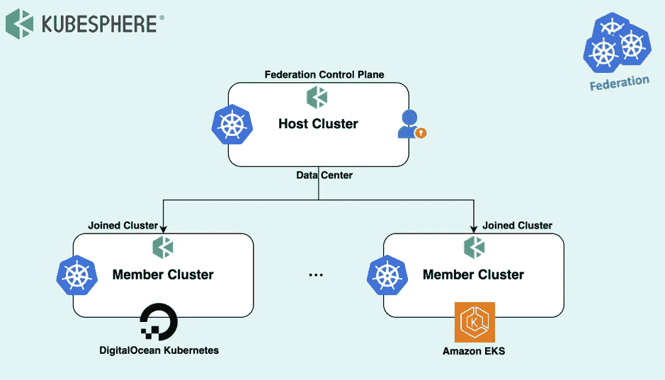
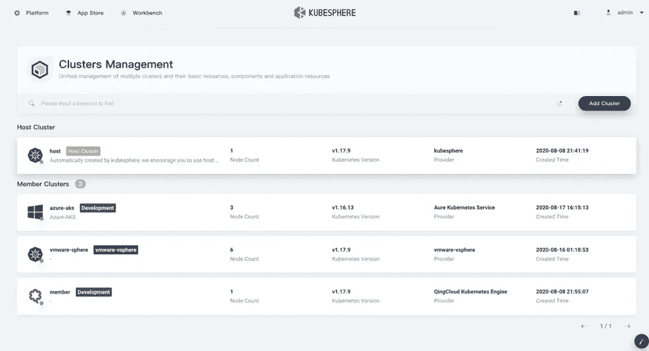
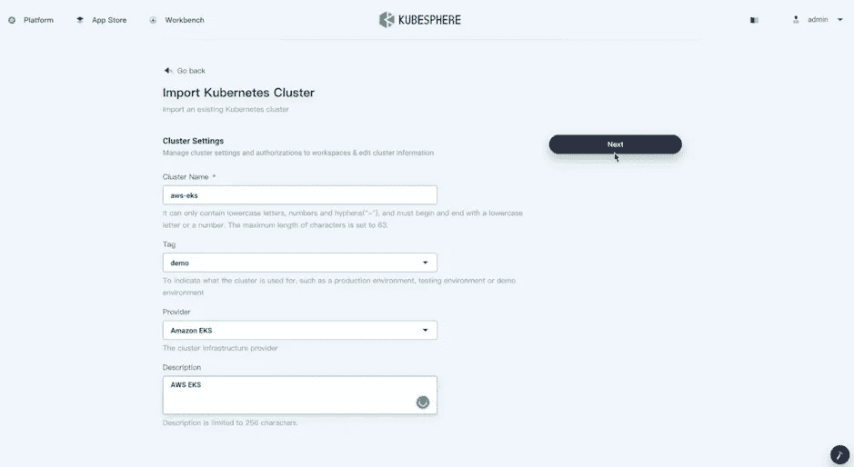
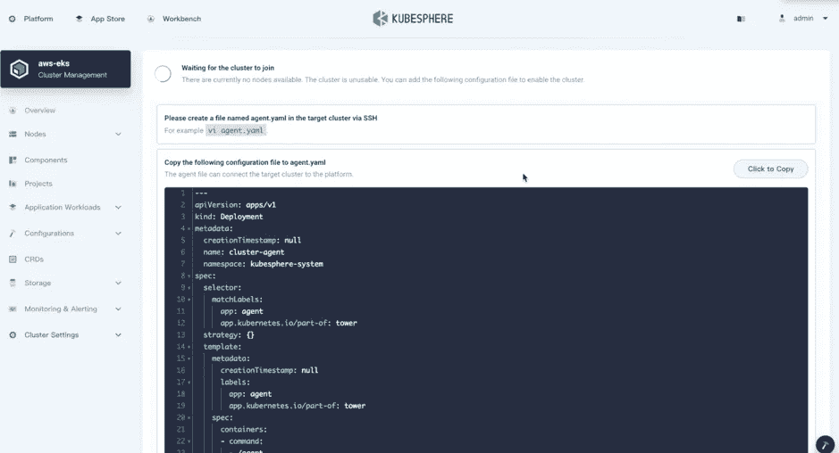
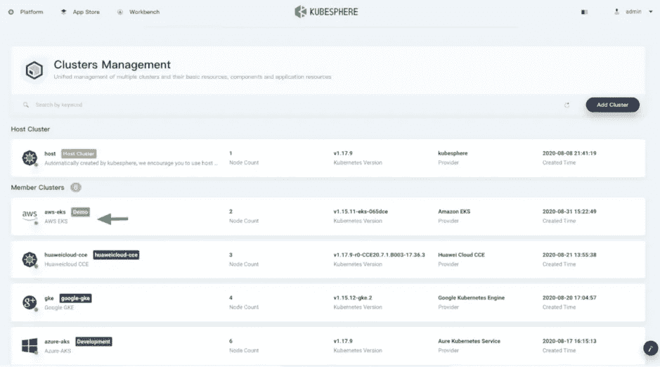
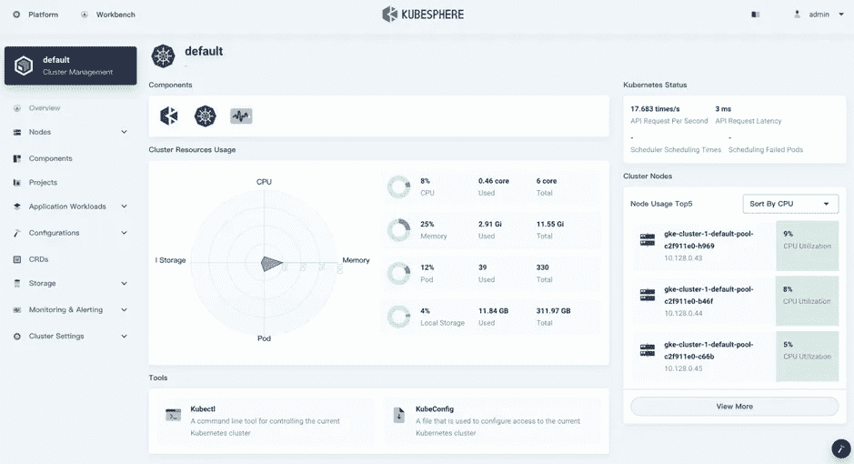

# 多集群 Kubernetes:使用 KubeSphere 管理数字海洋 Kubernetes 和亚马逊 EKS

> 原文：<https://itnext.io/multi-cluster-kubernetes-managing-digital-ocean-kubernetes-and-amazon-eks-with-kubesphere-6ba3f9cfe676?source=collection_archive---------2----------------------->

KubeSphere 是一个开源的分布式操作系统，用于管理云原生应用。使用 [Kubernetes](https://kubernetes.io/) 作为其内核，KubeSphere 为无缝集成第三方应用程序提供了一个即插即用的架构，以促进其生态系统。 [KubeSphere 可以在任何地方运行](https://kubesphere.io/docs/introduction/what-is-kubesphere/#run-kubesphere-everywhere)，因为它是高度可插拔的，不需要侵入 Kubernetes。

KubeSphere 旨在解决多集群和多云管理挑战，并实施后续用户场景，为用户提供一个统一的控制平面，以将应用程序及其副本分发到从公共云到内部环境的多个集群。

# KubeSphere 的 Kubernetes 集群联盟

基于 Kubernetes 集群联盟(简称为 [Kubefed](https://github.com/kubernetes-sigs/kubefed) )，KubeSphere 实现了多集群管理，允许集群管理员轻松管理跨云提供商的多个 Kubernetes 集群。

在本教程中，我们将在数据中心安装一个主机集群，充当成员集群的控制面板。然后我们使用两个流行的托管 Kubernetes 服务， [DigitalOcean Kubernetes](https://www.digitalocean.com/products/kubernetes/) 和[亚马逊 EKS](https://docs.aws.amazon.com/eks/latest/userguide/what-is-eks.html) ，并将它们导入到主机集群中。



# 准备主机集群

在开始之前，您需要安装一个 KubeSphere 集群，请参见 Kubernetes 上的 quickstarts [All-in-one](https://kubesphere.io/docs/quick-start/all-in-one-on-linux/) 或[minimal KubeSphere](https://kubesphere.io/docs/quick-start/minimal-kubesphere-on-k8s/)了解详细信息。在本教程中，我们选择在数据中心安装 KubeSphere。

在 KubeSphere 集群准备就绪之后，您可以通过使用 kubectl 编辑集群配置来将 clusterRole 的值设置为 host:

```
kubectl edit cc ks-installer -n kubesphere-system
```

向下滚动并将 clusterRole 的值设置为 host，然后单击 Update(如果使用 web 控制台)使其生效:

```
multicluster:clusterRole: host
```

保存它，您需要等待一段时间，以便更改生效。安装完主机集群后，kubesphere-system 中将创建一个名为 [tower](https://github.com/kubesphere/tower) 的代理服务，其类型为 LoadBalancer。

如果集群有可用的 LoadBalancer 插件，您可以看到 EXTERNAL-IP 的相应地址，KubeSphere 会自动获取该地址。这意味着您可以跳过设置代理的步骤。执行以下命令来检查服务。

```
kubectl -n kubesphere-system get svcThe output may look as follows:
```


# 准备两个成员集群

开始之前，您需要在亚马逊 EKS 和数字海洋 Kubernetes 上安装一个最小的 KubeSphere，详情请参见[在亚马逊 EKS 上部署 kubes phere](https://kubesphere.io/docs/installing-on-kubernetes/hosted-kubernetes/install-kubesphere-on-eks/)和[在数字海洋 Kubernetes 上部署 kubes phere](https://kubesphere.io/docs/installing-on-kubernetes/hosted-kubernetes/install-kubesphere-on-do/)。

为了管理主机集群中的成员集群，您需要使它们之间的 **jwtSecret** 相同。因此，您需要首先通过以下命令从主机集群获取它。

```
kubectl -n kubesphere-system get cm kubesphere-config -o yaml | grep -v “apiVersion” | grep jwtSecret
```

输出可能如下所示:

```
jwtSecret: “gfIwilcc0WjNGKJ5DLeksf2JKfcLgTZU”
```

如果您已经在亚马逊 EKS 和数字海洋 Kubernetes 上安装了 KubeSphere，您可以通过编辑集群配置将 **clusterRole** 的值设置为 member。请注意，此步骤应分别在两个成员的集群中执行:

```
kubectl edit cc ks-installer -n kubesphere-system
```

输入对应的 **jwtSecret** 如上图所示:

```
authentication:jwtSecret: gfIwilcc0WjNGKJ5DLeksf2JKfcLgTZU
```

向下滚动并将 **clusterRole** 的值设置为 member，然后单击 Update(如果使用 web 控制台)使其生效:

```
multicluster:clusterRole: member
```

# 将成员集群导入控制平面

确保您已经为亚马逊 EKS 和数字海洋 Kubernetes 安装了双成员集群。然后，您就可以将这两个成员集群启动到主机集群中了。在本教程中，我们仅以将亚马逊 EKS 导入主机集群为例，导入数字海洋 Kubernetes 的步骤如下。

打开主机集群仪表板并点击**添加集群。**



输入要导入的集群的基本信息，点击**下一步**。



在连接方法中，选择群集连接代理，然后单击导入。它将在控制台中显示由主机集群生成的代理部署。

根据指令在成员集群中创建一个 **agent.yaml** 文件，然后将代理部署复制粘贴到该文件中。在节点上执行**ku bectl create-f agent . YAML**，等待代理启动并运行。请确保成员群集可以访问代理地址。



当集群代理启动并运行时，您可以在主机集群中看到导入的集群。



从成员集群列表进入亚马逊 EKS 集群，您将能够看到该集群的概览仪表板，包括集群监控指标和日志记录。



恭喜你！现在亚马逊 EKS 已经由 KubeSphere 导入并管理，您现在应该能够将数字海洋 Kubernetes 导入其中。在两个成员的集群准备就绪后，在一个多云环境中分发云原生应用将变得非常容易，尽情享受吧！

# 关于 KubeSphere

KubeSphere 是一个基于 Kubernetes 的开源容器平台，其核心是应用程序。它提供全栈 It 自动化操作和简化的开发运维工作流。

[KubeSphere](https://kubesphere.io/) 已被全球数千家企业采用，如 **Aqara、新浪、奔来、中国太平、华夏银行、国药控股、微众银行、Geko Cloud、VNG 公司、Radore** 。KubeSphere 为运维提供向导界面和各种企业级功能，包括 Kubernetes 资源管理、[、DevOps (CI/CD)](https://kubesphere.io/devops/) 、应用生命周期管理、服务网格、多租户管理、[监控](https://kubesphere.io/observability/)、日志记录、警报、通知、存储和网络管理以及 GPU 支持。有了 KubeSphere，企业能够快速建立一个强大且功能丰富的容器平台。

欲了解更多信息，请访问 [https://kubesphere.io](https://kubesphere.io/)