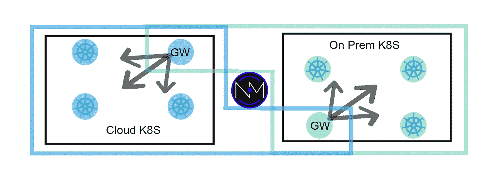
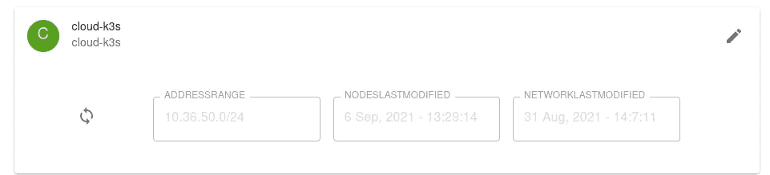
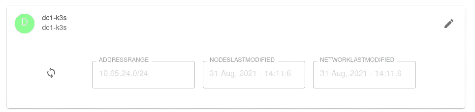
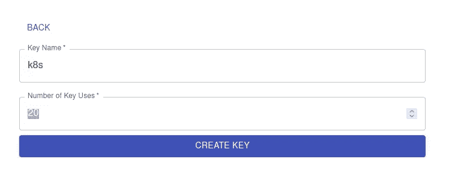
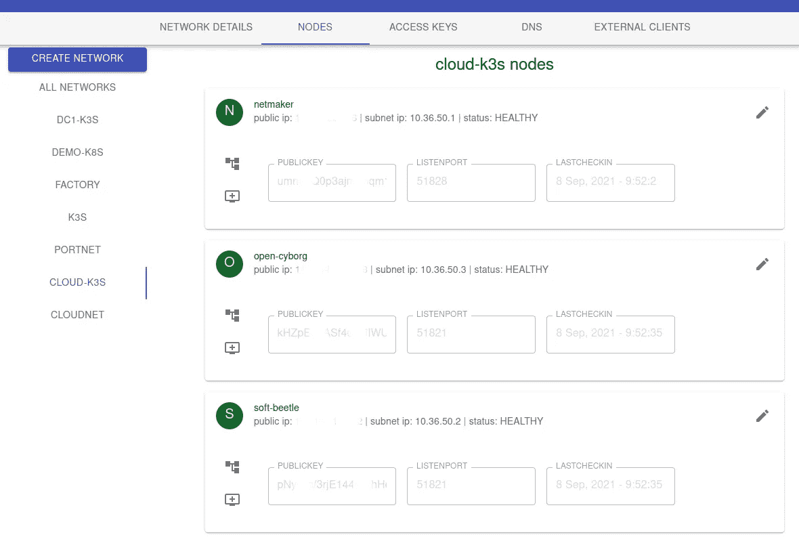
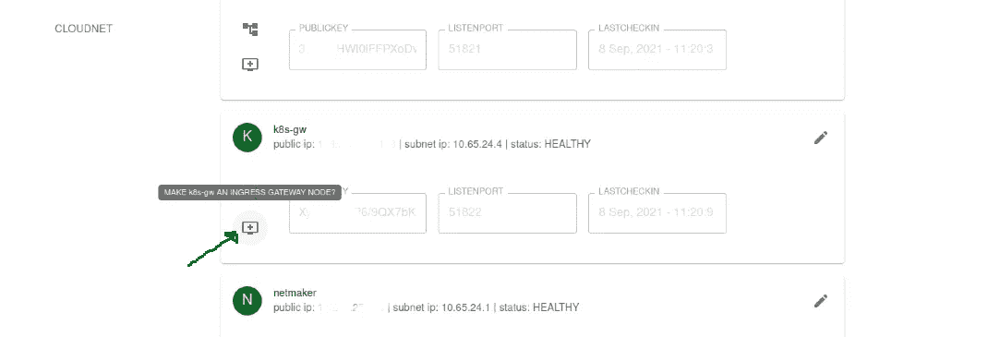

# 多集群 Kubernetes 与 Netmaker 联网

> 原文：<https://itnext.io/multi-cluster-kubernetes-networking-with-netmaker-bfa4e22eb2fb?source=collection_archive---------1----------------------->



我们已经在之前的教程中讨论过多云 Kubernetes(见[这里](/how-to-deploy-a-cross-cloud-kubernetes-cluster-with-built-in-disaster-recovery-bbce27fcc9d7)和[这里](/how-to-deploy-a-single-kubernetes-cluster-across-multiple-clouds-using-k3s-and-wireguard-a5ae176a6e81))。在这些帖子中，我们将讨论如何建立跨越多个云的**单个**集群。这种模式带来了许多潜在的用例、效率和资源节约。

然而，通常这不是一个选项。通常，组织需要在不同的环境中运行不同的集群，并在事后连接它们。

在这些场景中，我们如何连接集群？如果您希望跨云或环境在不同的 Kubernetes 集群中实现 pods 和服务之间的直接联网，该怎么办？

在本教程中，我们将向您展示如何使用 [Netmaker](https://github.com/gravitl/netmaker) 来实现这一点。有几个其他工具也有类似的最终目标，那么为什么选择 Netmaker 呢？

1.  **使用内核 WireGuard 实现更快的联网:**内核 WireGuard 是迄今为止最快的 VPN 隧道技术[。如果您担心跨集群网络的速度，您会希望使用内核 WireGuard。](https://www.the-digital-life.com/wireguard-vs-openvpn-and-ipsec-which-one-is-the-best/)
2.  **更细粒度的控制:** Netmaker 允许您将 DaemonSets 部署到集群的一个子集，以限制访问。
3.  **不仅仅是 Kubernetes:** 除了连接集群网络，Netmaker 还可以安全地集成集群外的资源，例如:外部 SQL 服务器、数据存储和遗留应用程序。组织还可以让开发人员从他们的工作站直接访问 pod 和服务网络。因此，虽然多集群网络可能是主要目标，但为这些不同的场景提供一个通用平台可能更实际，并且可以增强平台所有者的能力。点击这里了解更多关于 Netmaker 的一般使用案例。

那么，如何使用 Netmaker 连接两个(或更多)Kubernetes 集群呢？

我们开始吧。

# 先决条件

Netmaker: 我们将在其他教程以及我们的[快速入门指南](https://netmaker.readthedocs.io/en/v0.7.2/quick-start.html)中介绍如何部署 Netmaker。这里，我们假设您已经有了一个 Netmaker 服务器并正在运行。如果没有，请花些时间浏览一下快速入门指南。

**Kubernetes 集群:**在我们的教程中，我们将使用两个 k3s 集群，一个在 DigitalOcean，一个在 prem。**这些集群不得有重叠的 pod 和 CIDR 服务网络。这暂时是一个硬限制(计划将来允许重叠 CIDR)。此外，您必须能够在您的 k8s 节点上安装软件包，即 WireGuard，正如我们将在下一步中所做的。**

# **安装电线护罩**

任何参与多群集服务的节点都必须安装 WireGuard。WireGuard 现在是 Linux 内核的一部分，应该很容易安装在大多数操作系统上。

在我们的节点上，我们运行的是 Ubuntu 20.04，所以我们只需运行**在每个节点上安装 wireguard wireguard-tools** 。查看操作系统的[安装文档](https://www.wireguard.com/install/)。

如果使用云提供商发行版，如 IKS 或 DOKS，有办法在节点上安装 WireGuard，但它需要一些特殊的操作。

*如果您没有直接访问云提供商节点的 root 权限，您可以尝试部署和执行到这个*[****root shell pod****](https://github.com/gravitl/netmak8s/blob/main/ubuntu.yaml)****，*** *中，它挂载整个根文件系统，模拟节点级别的 SSH 会话。这应该允许您安装 WireGuard，即使您无法直接访问云提供商的操作系统。**

# *建立网络*

*在您的 netmaker 实例中，您将为每个集群创建一个网络，给它一个合理的名称，如 aws-k8s 或 dc-1-k8s。每个集群应该有一个单独的子网。子网应该足够大，能够包含所有群集节点。通常像 10.100.11.0/24 这样的 a /24 就可以了。*

*对于我们的教程，我们有两个集群，一个在 Ubuntu VPS 上的 DigitalOcean 中，另一个在 prem 上的 Ubuntu VM 上。我们创建了两个网络:*

***云-k3s: 10.36.50.0/24***

**

***dc1-k3s: 10.65.24.0/24***

**

*重要的是，这些范围不能与任一集群上的 pod 或服务网络重叠。*

*现在，为每个网络生成并存储一个访问令牌:*

**

*访问令牌是中间值，是一个大的 base 64 编码的密钥，看起来像这样:*

*eym 5 tlmdvywxsy 2 xvdwrzlmnvbjjb 3 jlzg 5 zywrkcii 6 ije 0 mi 45m 4 ynteumzyilcjhcgljb 25 uijoiyxbpl M5 tmxvdwyxsy 2 xvdwrzlmnvbsisimfwaxbvcnqioii 4 MDG xiiwiz 3 jwy 2 nvb…*

*现在，我们来看看库伯内特斯。*

# ***部署网络客户端守护进程***

*在每个集群上，您将部署一个 DaemonSet，它将您的节点添加到上面定义的专用网络中。此外，您将在每个集群上部署一个**出口网关**。*

*对每个集群执行以下步骤**，**，使用运行命令的集群各自的**网络名称**和**访问令牌**。*

```
*wget [https://raw.githubusercontent.com/gravitl/netmak8s/main/netclient-daemonset.yaml](https://raw.githubusercontent.com/gravitl/netmak8s/main/netclient-daemonset.yaml)sed -i 's/XXXX/<your token>/g' netclient-daemonset.yamlsed -i 's/YYYY/<your network name>/g' netclient-daemonset.yamlkubectl apply -f netclient-daemonset.yaml*
```

*几分钟后，pod 应该会启动并运行。要测试网络，请尝试执行其中一个 pod，并通过专用地址 ing 一个节点:*

```
*root@master1:~# kubectl get pods
NAME                     READY   STATUS    RESTARTS   AGE
netclient-hkznw          1/1     Running   0          9m13s
netclient-p5dqg          1/1     Running   0          9m13s
netclient-gv4zf          1/1     Running   0          4m54s**root@master1:~# kubectl exec -it netclient-hkznw -- /bin/bash**root@datacenter1:~# wg show
interface: nm-dc1-k3s
  public key: ZuXfeakfja3aa3tA#TatAF#FAM=
  private key: (hidden)
  listening port: 51821peer: 3ORn8HAFWfaWFaweFAfawfafwfaPbSKox9xm/qtFDo=
  endpoint: 192.168.88.152:51821
  allowed ips: 10.65.24.3/32
  latest handshake: 12 seconds ago
  transfer: 1.64 KiB received, 548 B sent
  persistent keepalive: every 20 secondspeer: E/Cg60pAFWafwAWFafAWfAJoEA=
  endpoint: 150.100.200.36:51829
  allowed ips: 10.65.24.1/32
  latest handshake: 1 minute, 29 seconds ago
  transfer: 492 B received, 1.90 KiB sent
  persistent keepalive: every 20 secondsroot@datacenter1:~# ping 192.168.88.152
PING 192.168.88.152 (192.168.88.152) 56(84) bytes of data.
64 bytes from 192.168.88.152: icmp_seq=1 ttl=64 time=0.349 ms
64 bytes from 192.168.88.152: icmp_seq=2 ttl=64 time=0.385 ms
64 bytes from 192.168.88.152: icmp_seq=3 ttl=64 time=0.381 ms*
```

*如果 pings 通了，恭喜你！您的专用网络已启动并运行。您的节点现在有了一个安全的通信通道。在 UI 中，每个网络看起来应该是这样的(随意将节点名称更改为与您的实际集群节点名称相匹配的名称)。*

**

## *网络客户端连接故障排除*

*如果在群集上启动网络时遇到问题，要重新添加 netclient，首先需要在每个节点上运行“netclient leave”。要做到这一点，您可以使用 kubectl 运行以下代码:*

```
*kubectl exec -it netclient-XXX -- /bin/bash -c './netclient leave -n <network name>'*
```

*然后使用新配置重新应用 daemonset 或 gateway yaml。*

*如果您在单个机器上遇到问题，您可以简单地运行上面的“exec”命令，从网络中删除该节点，然后删除 pod 再试一次。*

*常见问题包括无法访问 Netmaker 服务器、访问密钥过期或不正确，以及与 netclient 映像的**基本操作系统不兼容。**最后一个可能是许多基本 kubernetes 操作系统的情况。netclient 映像是使用 debian:buster 构建的。*

*但是，netclient Dockerfile 文件包含在 repo 中。您可以更改第二个“FROM”语句以使用与您的节点兼容的基本操作系统，并为您的用例重新构建映像:[https://github . com/gravitl/net maker/blob/master/docker file-net client](https://github.com/gravitl/netmaker/blob/master/Dockerfile-netclient)*

*现在进入下一步，我们将把我们的群集连接在一起。*

# *部署网关节点*

*在每个集群上，单个节点将充当“出口网关”来访问本地 pod 和服务网络。该节点将成为**其他**集群上网络的一部分。*

*因此，在我们的示例中，数字海洋集群将在数据中心网络(dc1-k3s)中有一个网关，我们的数据中心集群将在数字海洋网络(cloud-k3s)中有一个网关。*

**

*为了实现这一点，我们将重复上述过程，但这一次使用 netclient-gateway.yaml 文件，该文件将在部署中部署单个 netclient，并使用标签选择器将它绑定到一个节点。*

```
*wget [https://raw.githubusercontent.com/gravitl/netmak8s/main/netclient-gateway.yaml](https://raw.githubusercontent.com/gravitl/netmak8s/main/netclient-gateway.yaml)*
```

*在每个集群上选择将充当网关的节点，并将其标记为 gateway=true*

```
***kubectl label node <node name> gateway=true***
```

*现在，再次使用相同的访问令牌和网络名称值，但这一次是相反的。在“本地”群集上，为“云群集”添加值，反之亦然。*

```
*sed -i 's/XXXX/<other token>/g' netclient-gateway.yamlsed -i 's/YYYY/<other network name>/g' netclient-gateway.yamlkubectl apply -f netclient-gateway.yaml*
```

*和以前一样，您可能希望进入 pod，运行“wg show ”,并确保您能够 ping 通专用网络中的其他地址。*

```
***kubectl exec -it netclient-gateway-XXXX -- /bin/bash***
```

*现在，虽然这个 pod 已经被部署为出口网关，但是它仍然没有被定义为出口网关。*

*回到您的 Netmaker 仪表板，在两个网络中的每一个上，单击按钮使这个新节点成为出口网关(它将具有名称“k8s-gw”)。*

**

*添加 **other cluster 的** pod 和服务网络的范围，并指定机器的默认接口。*

*要确定这一点，您可以运行“kubectl get po -A”和“kubectl get svc -A”。这应该足以告诉您正在处理的子网(通常是前两位数字，后面是. 0.0/16)。*

*在一个节点上，运行“ip a”，要使用的接口通常是第二个列出的接口。*

*例如，我的本地 k8s 集群的服务 CIDR 为 10.43.0.0/16，pod CIDR 为 10.42.0.0/16。这些节点的默认接口为 eno1。*

*因此，在 **cloud-k3s** 网关(云集群)上，我按如下方式设置网关，以便接入本地集群网络:*

**

*反之，我的云 k8s 集群的 pod CIDR 为 10.44.0.0/16，服务 CIDR 为 10.45.0.0/16，默认接口为 eth0。因此，我用这些值在我的 **dc1-k3s** 网络(本地集群)上设置网关。*

*一旦部署完毕，网关将在一分钟内投入使用。作为快速测试，我在本地集群中部署了一个 Nginx 服务。*

```
*root@master1:~# kubectl get svc
ngnix-service   ClusterIP   10.43.45.229        80/TCP*
```

*这个服务现在应该可以从云集群中的任何 pod 访问到。作为测试，我在我的云集群上执行了一个 pod，并尝试使用服务 IP:*

```
*root@k3s-1:~# kubectl exec -it mypod -- /bin/bash
bash-5.0$ curl 10.43.45.229
<!DOCTYPE html>
<html>
<head>
<title>Welcome to nginx!</title>
<style>
    body {
        width: 35em;
        margin: 0 auto;
        font-family: Tahoma, Verdana, Arial, sans-serif;
    }
</style>
</head>
<body>
<h1>Welcome to nginx!</h1>
<p>If you see this page, the nginx web server is successfully installed and
working. Further configuration is required.</p><p>For online documentation and support please refer to
<a href="[http://nginx.org/](http://nginx.org/)">nginx.org</a>.<br/>
Commercial support is available at
<a href="[http://nginx.com/](http://nginx.com/)">nginx.com</a>.</p><p><em>Thank you for using nginx.</em></p>
</body>
</html>*
```

*如您所见，服务网络现在是可达的。在这一点上，网络连接，我们可以称之为退出。然而，我们可能需要一个额外的特性:**服务发现**。*

# *部署服务导出器*

*服务导出器将通过以下约定使 DNS 名称在集群之间可用:service.namespace.networkname。netmaker 网络名称是 cloud-k3s，所以我们的服务将是 nodejs.webapp.cloud-k3s。*

*然后，为了使其他集群中的所有 pod 都可以使用它，我们只需在每个集群上的 CoreDNS configmap 中添加一个条目。*

*首先，获取模板*

```
*wget [https://raw.githubusercontent.com/gravitl/netmak8s/main/servicex-deploy.yaml](https://raw.githubusercontent.com/gravitl/netmak8s/main/servicex-deploy.yaml)*
```

***网络名称:**我们一直在使用的网络，例如 dc1-k3s 和 cloud-k3s*

***Netmaker Secret key:** 在您的 Netmaker 服务器的 docker compose 中，查找 MASTER_KEY 下的值。*

***Netmaker API URL:** 这将与您的 UI url 相同，但将“仪表板”替换为“API”，例如“https://api.netmaker.url.com”(应包括 http(s)模式)。*

*现在，将此信息添加到模板中(您将为每个集群执行一次，将<net name="">替换为该特定集群的网络名称:</net>*

```
*sed -i 's/XXXX/<net name>/g' servicex-deploy.yaml
sed -i 's/YYYY/<secret key>/g' servicex-deploy.yaml
sed -i 's/ZZZZ/<api url>/g' servicex-deploy.yaml*
```

*然后，您就可以部署服务了。该模板假设您正在部署到**默认名称空间中。**如果没有，请修改模板中的服务帐户角色绑定，以引用适当的名称空间。*

```
*kubectl apply -f servicex-deploy.yaml*
```

*检查 servicex pod 的日志。您应该会看到正在导出的服务列表。*

```
*root@master1:~# kubectl logs servicex-785dd5699b-78q5w
2021/09/08 18:48:01 pushing {10.43.0.1 kubernetes.default dc1-k3s}
2021/09/08 18:48:01 pushing {10.43.0.10 kube-dns.kube-system dc1-k3s}
2021/09/08 18:48:01 pushing {10.43.137.90 metrics-server.kube-system dc1-k3s}
2021/09/08 18:48:01 pushing {10.43.102.255 traefik.kube-system dc1-k3s}
2021/09/08 18:48:01 pushing {10.43.45.229 ngnix-service.default dc1-k3s}*
```

*您应该可以在 Netmaker 的 DNS 中看到您的所有服务。服务导出器只需在 Netmaker 中为每个 Kubernetes 服务创建定制的 DNS 条目。它将每分钟运行一次(默认情况下)，收集任何新的或修改过的服务，并将它们推送到 DNS。*

**

*一旦这两个集群都完成了，我们还有**最后一步:**将集群 A 中服务的 DNS 添加到集群 B，反之亦然。为此，我们需要在每个集群上的 CoreDNS 中添加一个条目。为此，您需要知道您的 Netmaker 服务器公共 IP。*

```
*kubectl edit cm coredns -n kube-system*
```

*您将输入以下代码片段，用另一个集群上运行的网络名称替换`*<other cluster net name>*` 。例如，如果修改 cloud-k3s CoreDNS configmap，您将输入 dc1-k3s。*

```
**<other cluster net name>:53 {
        errors
        cache 30
        forward . <netmaker public IP>
    }**
```

*修改该文件后，删除 CoreDNS pod。当它恢复时，DNS 应该立即可用。*

```
*kubectl get po -n kube-system
kubectl delete po -n kube-system coredns-XXXX*
```

*为了进行测试，我们将尝试像以前一样从云集群访问相同的“本地”nginx 服务。这一次，我们将使用 DNS 名称，而不是服务 IP 地址:*

```
*kubectl exec -it servicex-6d6fc57669-ksgvl -- /bin/bashbash-5.0$ nslookup ngnix-service.default.dc1-k3s
Server:  10.45.0.10
Address: 10.45.0.10:53Name: ngnix-service.default.dc1-k3s
Address: 10.43.45.229bash-5.0$ curl ngnix-service.default.dc1-k3s
<!DOCTYPE html>
<html>
<head>
<title>Welcome to nginx!</title>
<style>
    body {
        width: 35em;
        margin: 0 auto;
        font-family: Tahoma, Verdana, Arial, sans-serif;
    }
</style>
</head>
<body>
<h1>Welcome to nginx!</h1>
<p>If you see this page, the nginx web server is successfully installed and
working. Further configuration is required.</p><p>For online documentation and support please refer to
<a href="[http://nginx.org/](http://nginx.org/)">nginx.org</a>.<br/>
Commercial support is available at
<a href="[http://nginx.com/](http://nginx.com/)">nginx.com</a>.</p><p><em>Thank you for using nginx.</em></p>
</body>
</html>*
```

*服务名现在跨集群可用，IP 是可解析的，返回 Nginx 网页。*

# *结论*

*我们采用了两个断开连接的集群，一个公共集群和一个私有集群，并使它们的 pods 和服务可以通过 IP 和 DNS 相互访问。通过使用内核 WireGuard，我们能够以最快的速度连接这些网络。*

*只要 X 个集群的 pod/服务网络不重叠，就可以完成相同的过程，这是一个提醒:这是一个不断发展的项目，当前的限制包括:*

1.  *需要跨集群的唯一 CIDR*
2.  *需要在集群上安装内核 WireGuard*

*这些都是我们打算在不久的将来消除的限制，所以如果这是您的安装中的一个硬停止，请确保检查未来的版本。*