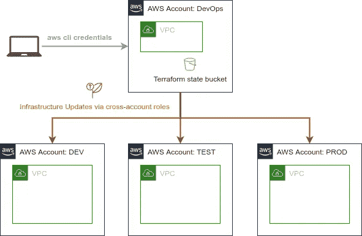

# 使用 Terraform 在 AWS 上提供多环境基础设施

> 原文：<https://itnext.io/multi-environment-infrastructure-provisioning-on-aws-using-terraform-1ee8d377c560?source=collection_archive---------1----------------------->

## 如何使用跨客户角色和 Terraform 工作区在不同的 AWS 客户上调配多个环境

## 介绍

云基础设施的工程设计通常涉及代表不同应用环境的同一基础设施的多种变化/配置的设置。

虽然生产环境满足了对容错、可伸缩性和高可用性的最复杂的期望，但是开发环境通常为开发人员提供了一个精简且经济的平台，以便在冲刺阶段快速部署和测试他们的开发工件。

映射到 AWS 帐户结构，将这些应用程序环境完全分离到不同的 AWS 帐户中是合理的。访问和授权可以分开定义，成本分析更容易，部署高度隔离，这些是该方法最重要的论据。

在本文中，我将展示一种方法，使用 AWS IAM 跨帐户角色和 Terraform 的一个称为“Terraform workspaces”的特性，在不同的 AWS 帐户上提供同一基础设施的多个不同配置。

## 地形状态

在介绍 Terraform 工作空间的概念之前，我们需要了解什么是 Terraform 状态。

> Terraform state 是一个将 Terraform 配置映射到真实世界的数据库。它的主要目的是将远程系统中的对象和配置中声明的资源实例之间的绑定存储在“状态文件”中。

为什么我们需要这样的地图？Terraform 使用状态文件**来确定对您的基础设施** **进行的更改，使其与您的配置**相匹配。在任何操作之前，Terraform 都会进行刷新，以更新真实基础架构的状态。它在状态文件中跟踪您的真实基础设施，这是您的环境的真实来源。

存储状态文件的位置取决于所谓的*“状态后端”*，其中可以是 AWS S3 桶、PostgreSQL 数据库或默认激活的最简单的*“本地”*后端。当使用本地后端时，状态被简单地存储在 terraform 配置文件根目录中的一个名为`terraform.tfstate`的文件中，这个根目录是 terraform 根模块的目录。

## Terraform 工作空间

现在，我们知道了什么是 Terraform 状态，为什么我们需要它以及它位于哪里，我们准备好利用 Terraform 工作空间了。

> Terraform 工作空间是一种 Terraform 功能，允许多个状态与单个配置相关联。

最初，一个状态后端只有一个工作区，称为`default`-工作区→只有一个 Terraform 状态与该配置相关联。

为了创建不同的工作空间，表示应用程序环境的状态，我们可以使用 Terraform 命令`terraform workspace new <env>`，其中`env`代表环境名称，例如“dev”:

```
terraform workspace new dev
terraform workspace new test
terraform workspace new prod
```

每当创建一个新的工作空间时，您会自动切换到该工作空间——这可以通过`terraform workspace list`来验证，它会打印出所有可用工作空间的列表，并选择带有星号的当前工作空间:

```
 default
  dev
* prod
  test
```

那么，我们如何在 HCL 配置中使用当前工作空间的信息呢？例如，要创建的 EC2 实例的数量可以根据信息而变化，具体取决于环境:

```
resource "aws_instance" "example" {
  count = "${terraform.workspace == "prod" ? 2: 1}"

  # ... other arguments
}
```

另一个流行的用例是使用工作空间名称作为命名或标记行为的一部分:

```
resource "aws_instance" "example" {
  tags = {
    Name = "web - ${terraform.workspace}"
  } # ... other arguments
}
```

## AWS 帐户结构

关于 Terraform 已经说得够多了，让我们继续讨论 AWS 帐户结构。



建议通过中央 DevOps 帐户部署基础架构，并管理该帐户中所有环境的状态。这可以通过以下状态配置来实现:

```
terraform {
  backend "s3" {
    bucket               = "tf-state-<example>"
    key                  = "terraform.tfstate"
    workspace_key_prefix = "demo"
    region               = "eu-central-1"
  }
}
```

最后一个难题是如何使用 Terraform 工作区部署到各种 AWS 帐户。

1.  首先，让我们在每个环境的地形变量文件中定义一个变量`aws_accountnumber`(例如在`variables.general.tf`

```
variable "aws_accountnumber" {
  type        = string
  description = "aws account number"
}
```

2.使用不同的变量文件(如`envs/dev.tfvars`、`envs/test.tfvars`、`envs/prod.tfvars`)为每个环境设置该变量的值:

```
aws_accountnumber = "<your-account-number>"
```

3.根据当前活动的`aws_accountnumber`配置`aws` —提供者承担一个角色，例如:

```
provider "aws" {
  region = var.aws_region
  assume_role {
    role_arn = arn:aws:iam::${var.aws_accountnumber}:role/provision"
  }
}
```

## AWS 跨帐户角色

上述方法的先决条件是在环境帐户中存在适当的交叉帐户角色`provision`。在 DevOps 帐户中，您需要允许您的主要用户承担环境帐户中的角色。`iam-group-with-assumable-roles-policy`([https://registry . terra form . io/modules/terra form-AWS-modules/iam/AWS/latest/submodules/iam-group-with-assubable-roles-policy](https://registry.terraform.io/modules/terraform-aws-modules/iam/aws/latest/submodules/iam-group-with-assumable-roles-policy))可以用于此。在环境帐户中，您需要设置一个可承担的角色，名为`provision`。Terraform 模块`iam_assumable-role`([https://registry . terra form . io/modules/terra form-AWS-modules/iam/AWS/latest/sub modules/iam-assumbable-role](https://registry.terraform.io/modules/terraform-aws-modules/iam/aws/latest/submodules/iam-assumable-role))适合实现这个。不要忘记给这个可承担的角色足够的权限来部署所有的基础设施变更。

通过订阅获得新的 Terraform 指南通知，敬请关注！[https://medium.com/subscribe/@klaus.dobbler](https://medium.com/subscribe/@klaus.dobbler)

## 参考和链接:

[](https://www.terraform.io/docs/language/state/index.html) [## 哈希公司的国家地形

### Terraform 必须存储有关托管基础设施和配置的状态。Terraform 使用此状态来映射…

www.terraform.io](https://www.terraform.io/docs/language/state/index.html) [](https://www.terraform.io/docs/language/settings/backends/configuration.html#default-backend) [## 哈希公司的后端配置-配置语言- Terraform

### 每个 Terraform 配置都可以指定一个后端，它精确地定义了在哪里以及如何执行操作，在哪里…

www.terraform.io](https://www.terraform.io/docs/language/settings/backends/configuration.html#default-backend) [](https://www.terraform.io/docs/language/state/workspaces.html) [## 状态:哈希公司的工作空间-地形

### 每个 Terraform 配置都有一个相关的后端，它定义了如何执行操作以及在哪里持久化…

www.terraform.io](https://www.terraform.io/docs/language/state/workspaces.html) [](https://docs.aws.amazon.com/IAM/latest/UserGuide/tutorial_cross-account-with-roles.html) [## IAM 教程:使用 IAM 角色跨 AWS 帐户委派访问权限

### 本教程将教您如何使用角色来委派对不同 AWS 帐户中的资源的访问，您…

docs.aws.amazon.com](https://docs.aws.amazon.com/IAM/latest/UserGuide/tutorial_cross-account-with-roles.html)