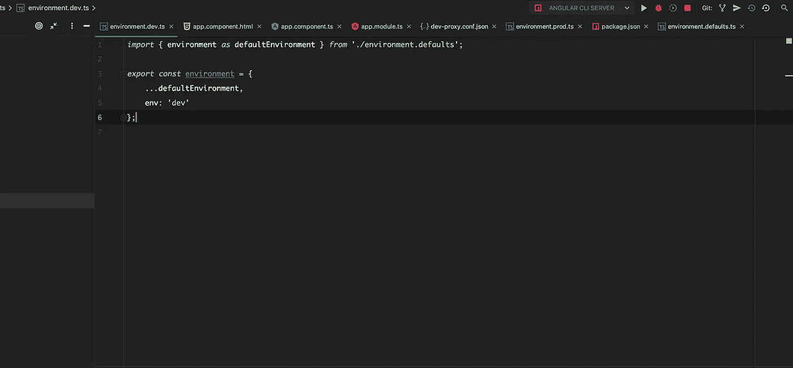

# Angular 应用程序的多环境设置

> 原文：<https://itnext.io/multi-environment-setup-for-your-angular-app-a211d72f1ff1?source=collection_archive---------1----------------------->



作为 Angular 开发人员，我们的工具中最受欢迎的新增功能之一当然是 Angular CLI。CLI 允许我们引导 Angular 应用程序，并在其整个生命周期中对其进行管理。

我喜欢使用的最好的特性之一是为我的项目设置多个环境。大多数应用程序可能至少使用两种环境:生产和开发。更大的应用程序很可能会运行几个环境，比如 *QA* 、 *RC* 、 *pre-prod* 等等。

## 配置

Angular CLI 启动一个新项目，在文件夹`environments` : `environments.ts`和`environments.prod.ts.`中有两个文件。

*   environment.prod.ts 是在使用生产配置构建应用程序时，CLI 为我们注入的配置文件
*   *environment.ts* 是我们在应用程序中引用的配置文件，CLI 将在构建时负责获取正确的配置

这些文件看起来像什么？它们只是一个导出为“环境”的简单常量对象，最初看起来像这样:

```
// environment.ts
*export const* environment = {
  production: *false* };----------------------------// environment.prod.ts
*export const* environment = {
  production: *true* };
```

> ⚠️你可能已经猜到了，这些值是在构建时注入到客户端的。所以请注意，不要将敏感值传递给这个对象。

CLI 允许我们定义多个自定义配置，这些配置将与我们的基础架构环境保持一致。因此，例如，我们可以定义另外两个环境— *dev* 和 *qa* 。

让我们继续在同一个文件夹中创建另外两个文件，我们将分别命名为 *environment.dev.ts* 和 *environment.qa.ts.*

为了正确地设置环境，我们还需要通过将这些添加到配置文件 *angular.json.* 来让 Angular 知道我们将通过扩展*配置*对象来做到这一点:

```
... // angular.json
configurations": {
    "production" {...} // leave as it is, "qa": {
        "fileReplacements": [
            {
                "replace": "src/environments/environment.ts",
                "with": "src/environments/environment.qa.ts"
            }
        ]
    },
    "dev": {
        "fileReplacements": [
            {
                "replace": "src/environments/environment.ts",
                "with": "src/environments/environment.dev.ts"
            }
        ]
    }
}
```

最后，我们更新*服务*对象:

```
"serve": {
    "builder": "@angular-devkit/build-angular:dev-server",
    "options": {
        "browserTarget": "<appname>:build"
    },
    "configurations": {
        "production": ... // leave as it is
        "dev": {
            "browserTarget": "<appname>:build:dev"
        },
        "qa": {
            "browserTarget": "<appname>:build:qa"
        }
    }
},
```

## 默认值

在处理多种环境时，一些环境通常具有相同的值。我通常会为所有环境设置默认值，为此我会创建一个名为*environment . defaults . ts*的文件，并在其中添加我希望环境默认设置的值:

```
// environment.defaults.ts
export const environmment = {
   production: false,
   log: true,
   flags: {
      useNewHeader: true
   }
}
```

所有其他环境(除了 e*n 环境. ts* 之外)将需要与对象*默认环境:*合并

```
// environment.dev.ts
import { environment as defaultEnvironment } from './environment.defaults.ts';export const environment = {
    ...defaultEnvironment,
}// environment.qa.ts
import { environment as defaultEnvironment } from './environment.defaults.ts';export const environment = {
    ...defaultEnvironment,
    production: true
}
```

显然，我不希望日志记录或一个未经测试的组件出现在产品中！因此，我们覆盖了生产环境配置:

```
// environment.prod.ts
import { environment as defaultEnvironment } from './environment.defaults.ts';export const environment = {
    ...defaultEnvironment, production: true,
    log: false,
    flags: {
      useNewHeader: false
   }
}
```

> 💡由于这是一种简单的合并对象的方法，您可能希望使用一种更好的方法来合并深度嵌套的对象，这样您就不必重复相同的值。

## 为每个环境添加 Npm 脚本

既然我们已经定义了我们的自定义环境，现在是时候设置一个 NPM 脚本来为我们的应用程序提供自定义环境了。

我们感兴趣的参数是`-c`(或`—-configuration`)。

让我们用两个参数来扩展我们的 npm 脚本:

*   `-c`这将用来定义使用的环境
*   `—-port`这将用于为每个环境分配不同的端口，因此我们可以并行运行它们

```
// package.json{
... // more stuff
"scripts": {
   "start:dev": "ng serve -c=dev --port=4201"
   "start:qa": "ng serve -c=qa --port=4202"
   ...
   }
}
```

要启动其中一个环境，只需运行它的相关命令:

```
npm run start:dev
npm run start:qa --aot // will run qa configuration using AOT mode
```

## 使用别名导入🤓

由于环境文件位于根文件夹中，使用相对路径导入它会变得很麻烦。我建议使用感谢 Typescript 创建一个别名路径。

为此，在根文件夹中找到并打开 *tsconfig.json* ，并向对象 *compilerOptions* 添加以下对象:

```
"paths": {
    "@environment": ["./src/environments/environment.ts"]
}
```

现在，我们将通过简单地引用“@environment”作为路径来导入环境对象:

```
*import* { Component } *from* '@angular/core';
*import* { environment } *from* '@environment'; // nice!

@Component({
    selector: 'app-root',
    templateUrl: './app.component.html',
})
*export class* AppComponent {
    environment = environment;
}
```

> 💡您的 IDE 可能会将“@environment”标记为未找到，这可能是因为 IDE 没有对该文件进行索引。如果你使用的是 Webstorm，只需重启并使缓存失效

## 对每个环境使用代理

最后但同样重要的是，我们需要考虑我们的远程环境将在不同的地址运行，这意味着我们要为每个环境定义正确的地址。CLI 帮助我们在构建时传递正确的代理配置。

我的建议是在根目录下创建一个名为`proxy`的文件夹，然后添加名为`<env>-proxy.conf.json`的文件，如下所示:

```
{
  "/api": {
    "target": "http://my.dev.env.com",
    "secure": false,
    "pathRewrite": {
      "^/api": ""
    }
  }
}
```

在前一个文件中，我们告诉 Angular 将前缀为`api`的调用重定向到配置中指定的目标。

现在，我们继续将正确的代理配置添加到之前创建的配置中。

```
package.json{
... // more stuff
"scripts": {
   "start:dev": "ng serve -c=dev --port=4201 --proxy-config=proxy/dev-proxy.conf.json"
   "start:qa": "ng serve -c=qa --port=4202 --proxy-config=proxy/qa-proxy.conf.json"
   ...
   }
}
```

> 💡您也可以通过在 angular.json 文件中更改它来实现同样的目的，但这取决于您自己。

我发现这个解决方案特别重要，因为许多代码库仍然使用代码逻辑引用端点路径，在我看来，这并不安全和干净。

# 外卖⭐

*   使用 Angular CLI 设置多环境非常简单和强大，您可以根据需要添加任意数量的环境
*   在构建时添加配置对象是强大的，但是不要添加敏感信息
*   向我们的环境中添加代理有助于我们避免代码中的逻辑，这也增加了安全性和简单性

这篇文章最初发表在 [Frontend Consulting 的博客](https://frontend.consulting/multi-environment-setup-for-your-angular-app)