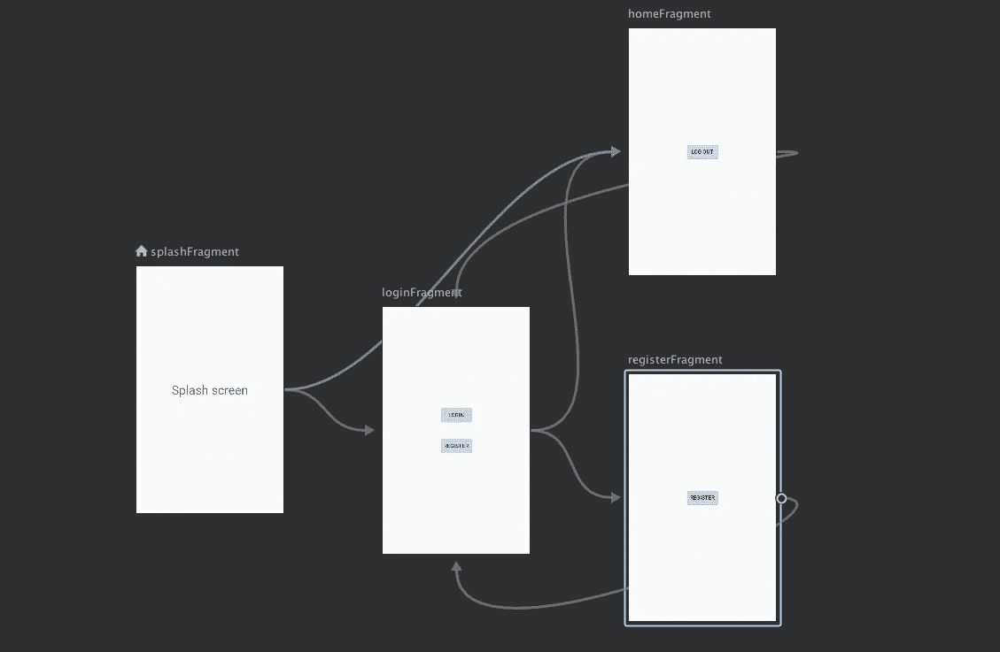
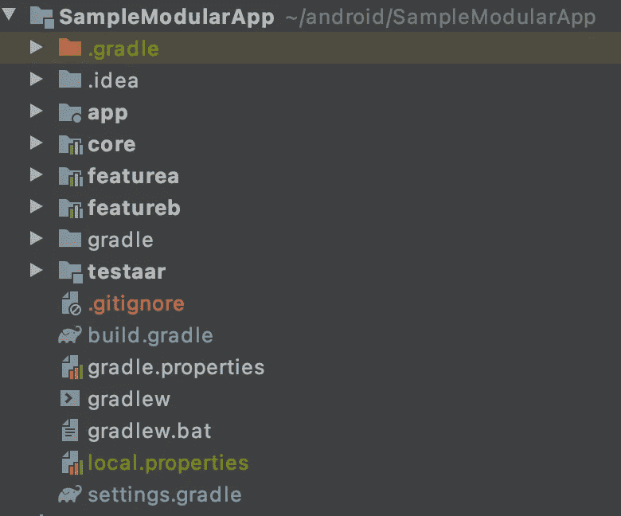
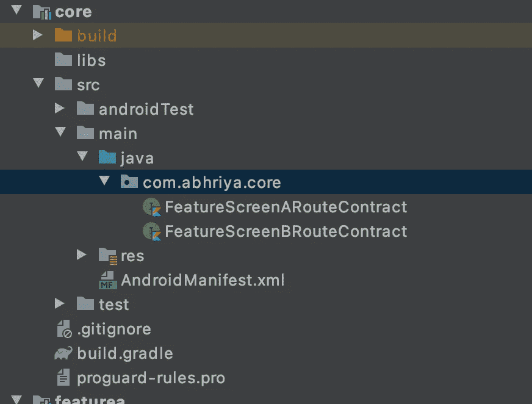

# Android 中的多模块导航

> 原文：<https://itnext.io/multi-module-navigation-in-android-63cb9924ffbd?source=collection_archive---------2----------------------->

将你的应用程序移植到一个基于特性的多模块架构中，并且想知道导航依赖是否会导致循环依赖？
让我们看看如何缓解所有问题，并提出一个干净的实施方案！

假设我们已经掌握了以下基本知识

*   **安卓导航组件**
*   **使用句柄进行依赖注入**

好，我们开始吧！

# 项目结构

我们的项目结构如下所示:

我们的应用程序将包括几个模块，即

*   应用
*   核心
*   特性 A(读作特性 A)
*   特性 B(读作特性 B)

**应用模块**是所有与应用基本功能相关的东西，如`MainActivity`和`HomeFragment`所在的地方。

**核心模块**是一个公共模块，它包含所有可以在不同模块间共享的东西，比如不同的`utility`类。

**特征 A 模块**是与我们的特征 A 相关的所有东西所在的地方。

**FeatureB 模块**是与我们的 FeatureB 相关的所有东西驻留的地方。

现在，我们对应用程序中的模块及其内容有了相当多的了解。

在我们的导航堆栈中，它看起来像这样:

**app →featureA →featureB**

和

**app →featureB →featureA**

因此，在这里我们可以看到，我们可以从功能 a 到功能 b，反之亦然，而不会遇到任何循环依赖错误。它看起来像这样:

*   我们首先降落在 HomeFragment 上，我们可以选择前往 FeatureA 或 FeatureB。
*   如果我们单击功能 a，我们可以选择转到功能 b。
*   如果我们单击功能 b，我们可以选择转到功能 a。
*   点击后退按钮，我们会回到上一个片段。

为了实现这一点，我们将使用导航到特定功能的方法来定义接口，这些方法的实现将在每个功能模块中，并使用 Hilt 为依赖注入提供。

所以让我们来实现它:

## **第一步:**

在核心模块中，我们为每个功能模块定义了一个接口，即

*   FeatureScreenARouteContract
*   FeatureScreenBRouteContract

FeatureScreenARouteContract 看起来像

在这里，我们创建了一个名为`show`的方法，它接受作为参数之一传递的数据和一个能够放大新屏幕的`NavController`。

类似地，FeatureScreenBRouteContract 看起来会像

## **第二步:**

在特性 A 模块中，我们将通过获取`dataToPass`并在膨胀适当的屏幕时传递它来提供`FeatureScreenARouteContract`的实现

你可能想知道`nav_graph_a`长什么样

最后，我们需要使用 hilt 提供我们的`FeatureARouteContractImpl`,这样我们就可以在应用程序的任何地方使用它。以下是如何做到这一点:

现在，通过在应用程序的任何地方调用我们的`FeatureScreenARouteContract`，Feaute A 就可以在应用程序的任何地方使用了。

## 类似地，对于 featureB 模块，实现如下:

现在 featureB 也准备好在任何地方注射了！

## 最后一步:

要从 app 模块中的`homeFragment`调用我们的任何模块，我们可以简单地注入我们的路由契约并为它们调用`show`方法

要从 featureA 打开 featureB，我们可以

要从 featureB 打开 featureA，我们可以

瞧啊。现在我们可以从任何其他模块导航到任何模块，而不会遇到循环依赖！

**对于这个项目的完整实现，**您可以在

 [## abhriyaroy/模块化导航主题

### 在 GitHub 上创建一个帐户，为 abhriyaroy/模块化导航主题开发做出贡献。

github.com](https://github.com/abhriyaroy/Modular-Navigation-Theming) 

**要检查一个更广泛的用例**在使用共享元素转换时实现这一点，请检查 [StockR](https://github.com/abhriyaroy/StockR)

 [## abhriyaroy/StockR

### 一个股票推荐应用程序，帮助你的钱增值💸StockR 旨在帮助您管理您的财务，把你的…

github.com](https://github.com/abhriyaroy/StockR) 

当你在做这件事的时候，请在 github[上留下⭐️来表达你的爱。](https://github.com/abhriyaroy/StockR)

如果我能够向您提供一些有用的信息，请不要忘记点击👏按钮。