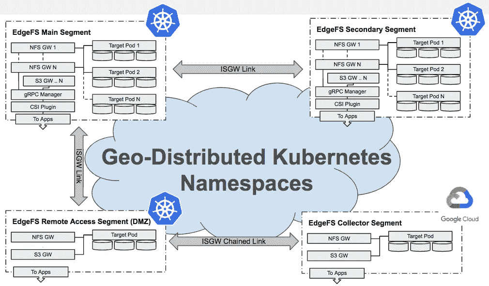

# Kubernetes 的多段分布式存储

> 原文：<https://itnext.io/multi-segment-distributed-storage-for-kubernetes-aa9163dad735?source=collection_archive---------2----------------------->

与参与 [Calit2](http://www.calit2.net/newsroom/article.php?id=2910) 项目的一组研究人员合作，帮助我们确定了一个有趣的 EdgeFS 用例，该用例在单个 Kubernetes 集群内和跨大洲的高吞吐量高延迟网络后端上进行延伸。

长距离高吞吐量数据传输的挑战是一个老问题，科学界，如 [Cenic](https://cenic.org/) ，已经解决了这个问题。然而，在研究人员之间共享数据，即使是通过专用的 DMZ，也是一项超级复杂的任务，数据管理是一项真正的痛苦。

跨地理位置的延迟很高，即使使用光纤主干也是如此，因此扩展单个存储命名空间不会很有效。

数据集是分布式的，有些数据集可能非常大。数据拷贝会分散数据，带来安全控制挑战和内容一致性不确定性。好消息是，在大多数情况下，并不是所有数据集都需要一次性访问。

因此，我们认为 EdgeFS 在这里可以有所帮助。

什么是 EdgeFS？这是 [CNCF Rook 项目的新存储提供商。](https://rook.io/docs/rook/master/edgefs-storage.html)虽然它是一个横向扩展存储集群，但它仍然可以在所谓的“solo”模式下运行，这是一种单节点 Docker 容器，能够随着部署的增长而横向扩展，只需连接更多节点和/或地理上分散的集群段即可。

Kubernetes 的好处是，通过提供内置的名称空间隔离，可以很容易地在同一个 Kubernetes 集群中实现分段。下图显示了 EdgeFS 段如何在地理上分布，从而在这样的集群中提供全局存储命名空间:



每个 EdgeFS 段可以在作为专用名称空间的同一个 Kubernets 集群内运行，也可以跨 Kubernets 集群运行。

段间网关链路(ISGW)可用于多种使用情形:

*   以主-主、主-从方式双向连接两个段；
*   连接双向星形拓扑中的段，其中中心段将重新分布订阅的数据集；
*   以双向环形拓扑连接分段，其中任何分段的修改将扩展到相邻分段，并最终扩展到所有链接的分段；
*   支持远程访问完全复制的数据集；
*   启用对仅元数据复制数据集的远程访问，数据块按需获取(数据块被缓存，对象可以被转换为持久的)；
*   启用远程收集段，本地数据将在一段短时间后被删除，同时保留在目标位置。

当配置为在同一个 Kubernetes 集群中运行时，每个 EdgeFS 段将使用自己的 Kubernetes 名称空间，这是本文关注的用例。

# 我们开始吧！

使用 Rook EdgeFS 操作器，我们可以在同一个 Kubernetes 集群安装中配置 2 个以上的段。当 Kubernetes 节点跨越多个区域，并且跨区域延迟可能很高，或者链路可能暂时离线时，这可能很有用。

可以建立 EdgeFS ISGW 链接，以确保每个存储桶的所有数据段保持一致的同步。

每个细分市场必须有自己的区域子名称空间，对于区域租户及其用户是本地的。例如，在`efscli`中可以看到同一个全局名称空间的两个同步段，如下所示:

```
# efscli cluster list
SanFrancisco
NewYork

# efscli tenant list SanFrancisco
Biology
MedicalSupply

# efscli tenant list NewYork
Marketing
Finance
```

# 配置段

确保每个段都按照自己的 Kubernetes 名称空间进行配置。为此，复制 cluster.yaml CRD 文件，并修改以下所有内容:

*   命名空间名称
*   PodSecurityPolicy 元数据名称
*   集群角色元数据名称
*   ClusterRoleBinding system-psp 和 cluster-psp 元数据名称和 roleRef
*   命名空间元数据

创建新的集群 CRD，并观察它将在自己的名称空间中创建。注意过滤节点和设备选择器。节点的设备不能在命名空间之间共享。

最终结果可能是这样的:

```
# kubectl get svc -n rook-edgefs-sanfrancisco
NAME
rook-edgefs-mgr
rook-edgefs-restapi
rook-edgefs-target
rook-edgefs-ui
# kubectl get svc -n rook-edgefs-newyork
NAME
rook-edgefs-mgr
rook-edgefs-restapi
rook-edgefs-target
rook-edgefs-ui 
```

其中每个集群段都有自己的管理端点，并且由同一个 Rook Operator 实例控制。

# 配置服务

在新段的所有 EdgeFS 目标启动并运行后，验证 EdgeFS UI 可以访问，并且可以创建服务 CRD。在创建服务时，它会自动获取 Kubernetes 操作名称空间，并将其提供给 CRD 的元数据。

类似地，如果您喜欢通过 CLI 操作集群段，您可以使用 neadm 管理命令:`neadm service enable|disable NAME`，这将使用相同的 REST API 调用创建/删除 CRD，类似于 GUI。

最后，另一种方法是按照 [Rook 文档网站](https://rook.github.io/docs/rook/master/edgefs-storage.html)上的说明手动准备 CRD YAML 文件，并指定目标 Kubernetes 名称空间。

# 配置 CSI 置备程序

在撰写本文时，CSI 拓扑感知仍处于测试状态，因此 EdgeFS CSI 驱动程序还不支持它: [CSI 拓扑感知](https://kubernetes-csi.github.io/docs/topology.html)。

但是，在最新版本的 EdgeFS CSI provisioner 中，已经完成了启用多分段使用的工作，下面是实现方法。

*   编辑配置密码文件并添加:

```
k8sEdgefsNamespaces: [“rook-edgefs-sanfrancisco”, “rook-edgefs-newyork”] 
```

*   对于动态调配的卷，在存储类 YAML 文件中，添加段的名称和段的 EdgeFS 服务名称:

```
...
parameters:
  segment: rook-edgefs-sanfrancisco
  service: nfs01
...
```

*   计划新 Pod 时，请确保卷中指定了段的命名空间和 EdgeFS 服务名称:

```
...
volumeHandle: sanfrancisco:nfs01@cluster/tenant/bucket
...
```

通过以上设置，EdgeFS CSI provisioner 的单个实例可以处理拓扑感知 PV/PVC 编排，因此创建 NFS 或 CSI 的请求可以重定向到指定区域。

# 摘要

虽然我的一般建议是使用联合 Kubernetes 集群，但我不得不承认单集群平面网络有其优势，如管理简化、轻量级名称空间隔离以及不需要额外的联合复制复杂性。

有了 EdgeFS，跨区域数据访问可以通过 Rook Operator 和 CSI Provisioner 轻松设置并与 Kubernetes 紧密集成。

一旦设置完成，Kubernetes PVs 就可以跨数据段浮动，而不需要额外的数据管理复杂性。只需在不同的段中重新调度 Pod，重新指向同步的存储桶并立即访问数据集。

即使数据更改尚未完全同步，EdgeFS 也能保证本地同步读取的一致性。通过利用仅元数据同步功能，可以以极快的速度分发一致的数据集，然后可以按需获取数据块。

今天就试试吧！

在 [EdgeFS](http://edgefs.io) 和 [Rook](http://rook.io/docs/rook/master/edgefs-storage.html) 社区关注我们！