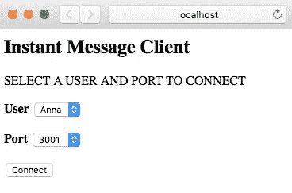
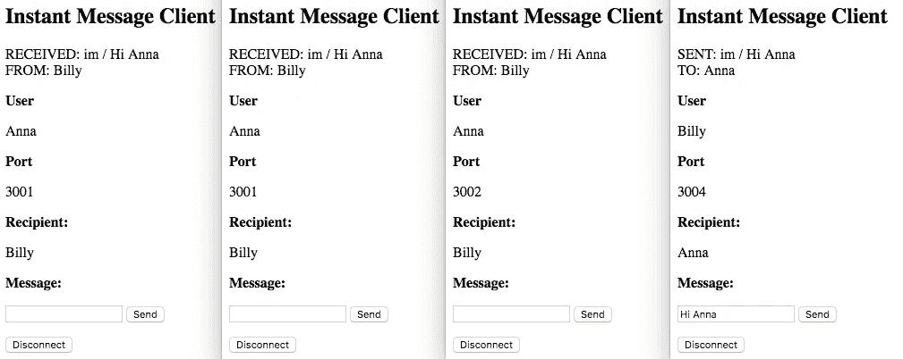
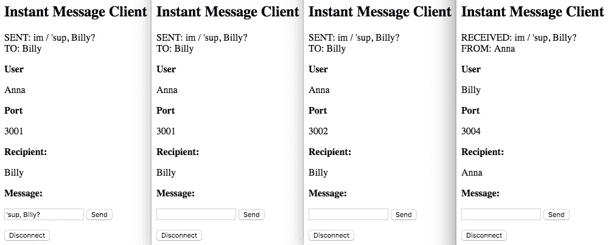
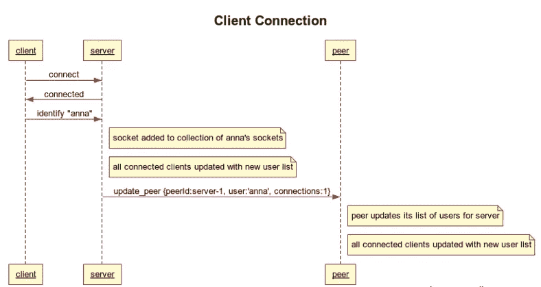
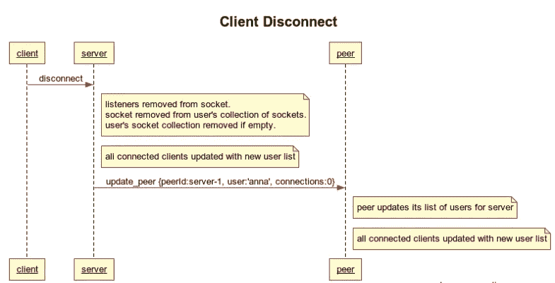
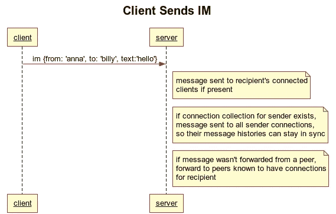
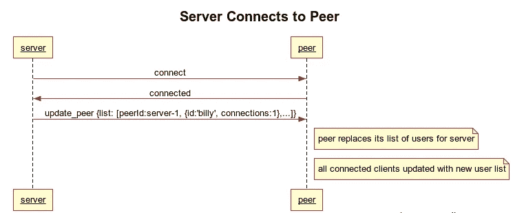
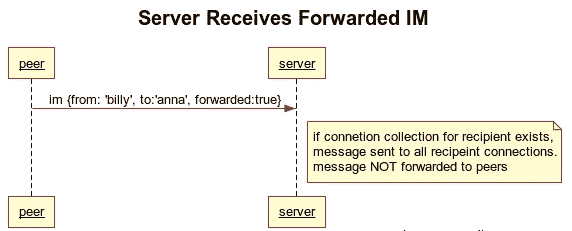

# 无数据库节点中的多服务器聊天

> 原文：<https://itnext.io/multi-server-chat-in-node-without-a-database-51bb66e41999?source=collection_archive---------3----------------------->


普里西拉·杜·普里兹在 [Unsplash](https://unsplash.com/search/photos/texting?utm_source=unsplash&utm_medium=referral&utm_content=creditCopyText) 上的照片

几年前，我为一个客户提供咨询，这个客户有一个基于节点的即时消息功能，起初运行得很好。但是用户数量增长了，然后就没有了。

尽管他们运行了许多负载平衡的服务器实例，但他们发现用于跟踪连接用户的 Redis 数据库是一个很大的瓶颈。无论他们运行多少实例，他们都必须与数据库对话。

现在可以说，Redis 支持复制，并且就在前一年增加了集群支持，所以这个问题可能已经解决了。但是团队领导想知道是否有办法完全消除数据库。我还能怎么回应呢？

*“接受挑战！”*

我创建了一个小的概念证明，我要求并得到了团队领导的许可，在 Github 上分享并在以后写博客。好了，现在是*晚了，我想我应该花时间整理一下，写一篇关于它的帖子，希望它能帮助那里的人。*

# 设计假设

*   客户端应该能够连接到任何正在运行的实例，并与任何其他实例上的用户聊天，就像他们连接到同一个实例一样。
*   将用户连接到给定实例的机制并不重要。客户端可以从已知列表中随机选择一个实例，或者由负载平衡器分配一个实例。
*   给定的用户可以与多个客户端连接，因此当消息发送给他们时，该用户的所有客户端都应该接收到该消息，并且该用户发送的所有消息也需要到达他们的其他客户端，以便消息历史可以反映完整的讨论。

你会问，解决方案是什么？

# 网状拓扑

有了这个服务器，可以在不同的 IP/端口组合上启动任意数量的实例，它们将立即建立并维护彼此之间的连接。

在服务器实例连接到一个对等点后，它会发送一个用户列表以及每个用户当前打开的连接数。随后，当用户连接和断开连接时，服务器实例会向所有对等方更新该用户的连接状态。

因为每个服务器实例总是知道哪些用户连接到它的每个对等点，所以不需要数据库。由于每个连接只存储一个用户名和连接数，100k 个用户名平均长度为 9 个字符的用户和一个连接占用的内存不到 1MB。客户端负责积累自己的消息历史。

## 将邮件发送给收件人

当一个服务器实例收到一个它不认识的收件人的消息时，它会将该消息转发给任何已知与该用户有连接的对等方。

## 保持发送者的客户端同步

发件人的消息还必须发送到他们在所有服务器上的所有连接，以便他们的消息历史能够反映完整的讨论。

## 使用用户列表更新客户端

每当用户连接到服务器实例(或从服务器实例断开连接)时，所有连接到网格的用户都将被发送一个排序的、唯一的当前连接用户列表。

## 服务器配置

JSON 配置文件包含所有实例的条目，因此它们可以监听正确的端口并连接到它们的对等体。为简单起见，服务器实例被配置为在本地计算机的不同端口上启动，但是实例可以在任何端口/ IP 地址组合上运行:

```
{
  "id": "server-1",
  "ip": "127.0.0.1",
  "port": 3001
},
```

# 服务器行为

## 对等连接

当服务器实例启动时，它开始监听分配给它的端口，然后尝试连接到它的对等方。如果在启动时无法联系到对等方，实例将继续重试，直到它变得可用。如果连接的对等体在运行时断开连接，其他实例将尝试重新连接，直到它再次出现。

```
Loading config from: config.json
Config loaded.
My id: server-1
Listening for connections on port:3001
Attempting to connect to peers...
Attempt connection to peer: server-2 at: [http://127.0.0.1:3002](http://127.0.0.1:3002)
Attempt connection to peer: server-3 at: [http://127.0.0.1:3003](http://127.0.0.1:3003)
Attempt connection to peer: server-4 at: [http://127.0.0.1:3004](http://127.0.0.1:3004)
Outbound connection to peer: server-2
Outbound connection to peer: server-3
Outbound connection to peer: server-4
```

当服务器实例在连接时收到来自对等方的更新时，它是连接到该对等方的所有用户的列表。然后，它使用新的聚合用户列表更新其所有连接的客户端。

```
Received update from peer: server-3
Replacing user list for peer: server-3
Updating clients with new user list...
```

当服务器实例从对等方接收到有关单个用户连接状态的更新时，它会修改其内部用户列表。然后，它使用新的聚合用户列表更新其所有连接的客户端。

```
Received update from peer: server-1
Replacing user Anna in list for peer: server-1
Updating clients with new user list...

Received update from peer: server-3
Adding user Billy to list for peer: server-3
Updating clients with new user list...

Received update from peer: server-2
Removing user Anna from list for peer: server-2
Updating clients with new user list...
```

## 客户端连接

当客户机连接到一个实例时，它发送用户名，服务器挂起该连接，将它与该用户相关联。请记住，一个用户可以连接多次，因此会为每个用户保留一个连接集合。此外，当用户连接时，服务器实例用该用户的连接状态更新其所有对等方，然后用新的聚合用户列表更新其所有连接的客户端。

```
User: Anna connected 1 time.
Updating peers with connection count for user: Anna...
Updating clients with new user list...
User: Anna connected 2 times.
Updating peers with connection count for user: Anna...
Updating clients with new user list...
```

当客户端向不在它们所连接的同一服务器实例上的用户发送消息时，该消息将被转发给已知与该用户有连接的任何对等方。

```
User: Billy connected 1 times.
Received IM from Billy to Anna: Hi Anna
Recipient Anna not on this server
Forwarding to peer: server-1 ...
Forwarding to peer: server-2 ...
```

当服务器实例收到来自具有一个或多个连接的用户的对等方的转发消息时，它会将该消息发送给该用户的所有连接客户端。它不会转发已转发的消息。

```
Received forwarded IM from Billy to Anna: Hi Anna
Recipient Anna has 2 connection(s) to this server, sending...
```

## 客户行为

基本客户端有一个下拉列表，其中有两个预定义的用户(Anna 和 Billy)，另一个下拉列表有四个可能连接的端口，以及一个“连接”按钮。

以下特性超出了这个简单客户端的范围，但是已经添加到一个更复杂的基于 React 的客户端中。

*   客户端消息历史记录。收到的传入和传出信息会显示在显示屏的顶部。
*   客户端连接的用户列表。这个客户端只是在收到用户列表时将其记录到控制台。



**未连接的客户端**

选择用户和端口，然后单击“连接”。您的邮件收件人将是您没有选择的用户。启动另一个浏览器，以另一个用户的身份登录，选择相同或不同的端口。来回发消息。

## 具有多个连接的用户在所有客户端接收即时消息



## 拥有多个连接的用户发送即时消息，并在所有客户端收到通知，因此消息历史记录可以保持同步



## 密码

服务器的代码不到 300 行，简单客户机不到 200 行，所以不难理解。关键是理解上述策略。

库依赖限于 Socket.io(这很好，因为如果客户端浏览器不支持 websockets，它提供了 XHR 长期轮询作为后备)和 Express(用于服务简单客户端)。

看看 Github 上的项目，并随时给我你的反馈。关于设置项目在本地运行的所有信息都在自述文件中。

*   服务器和基本的 HTML / JS 客户端:【https://github.com/cliffhall/node-multi-server-chat 
*   具有消息历史和连接用户列表的基于 React 的客户端:[https://github.com/cliffhall/react-chat-client](https://github.com/cliffhall/react-chat-client)

*最初发表于* [*崖堂*](http://cliffordhall.com/2018/07/multi-server-chat-node-without-database/) *。*