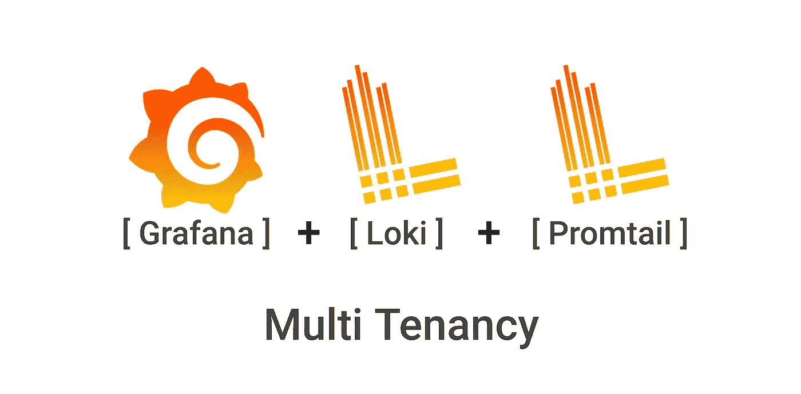
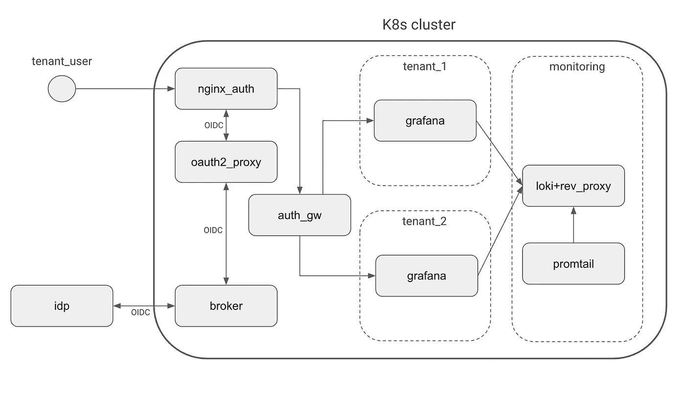
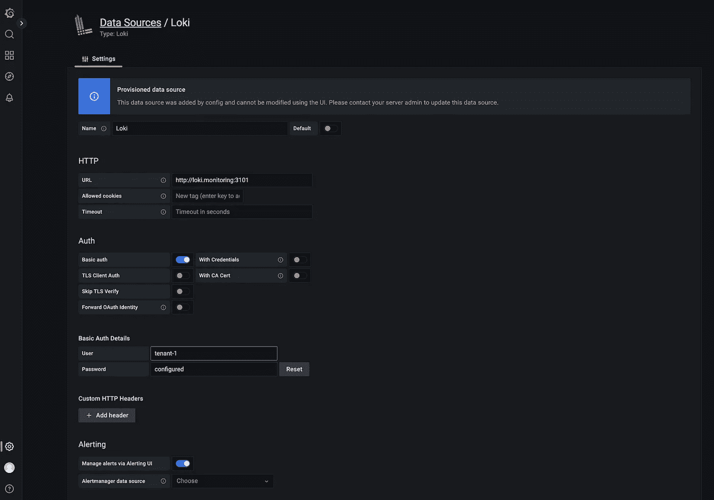

# 解除了 Loki、Promtail 和 Grafana 的多租户功能

> 原文：<https://itnext.io/multi-tenancy-with-loki-promtail-and-grafana-demystified-e93a2a314473?source=collection_archive---------0----------------------->



了解如何使用 Loki、Grafana 和 Promtail 创建企业级多租户日志记录设置。

上周，我们在 [otomi](https://github.com/redkubes/otomi-core) 中遇到了 Loki 多租户功能的问题。虽然 otomi-core 代码的结构非常好，但是还需要一些研究。在我的研究中，我注意到缺少描述如何设置 Loki 多租户的好文章。在本文中，我将解释如何使用 otomi-core 作为参考架构来实现 Loki、Promtail 和 Grfana 的多租户。

但是回答你的第一个问题:“你解决问题了吗？”。是的，我做到了。在调试了几天之后，我首先认为我们必须从头开始，但是最终(当多个解决方案粘在一起工作时，通常会出现这种情况)这个问题是由 Grafana 图表中关于如何在`additionalDataSources`中配置密码的变化引起的。稍后将详细介绍。

让我从描述设置的高级架构开始。

# 体系结构

下图显示了设置的架构。



洛基多租户架构

工作原理:

1.  用户使用 Oauth2 登录(使用身份代理或提供商)。只有属于某个租户组的用户才可以访问该租户的 Grafana 实例。规范化的 JWT 令牌被传递给 Grafana。
2.  每个租户名称空间运行自己的 Grafana，但是用户不能自己在 Grafana 中创建/更新数据源。数据源由平台管理员定义，不能更改。Loki 的数据源指向一个反向代理，在同一个 Pod 中作为 Loki 旁边的边车运行。
3.  反向代理使用包含租户的用户/密码组合和租户名称的密码。当认证成功时，租户名称将被用在 *X-Scope-OrgID* 头中，并被传递给 Loki。
4.  Loki 配置有`auth_enabled=true`
5.  Promtail 配置了一个默认的`tenant_id=admins`,一个代码片段用于配置管道阶段，用租户的名字“标记”属于特定租户的所有日志。

看起来很简单，对吗？让我们再深入一点。使用 oauth2/Istio/nginx/Keycloak 的入口设置超出了这里的范围。

# Promtail

我不打算讨论所有可能的 Promtail 配置选项，而只关注多租户设置的相关配置。

1.  在 Promtail 图表值中配置`clients`部分。yaml:

```
config:
  clients:
    - url: [http://loki.monitoring:3100/loki/api/v1/push](http://loki.monitoring:3100/loki/api/v1/push)
      tenant_id: admins
```

请注意，我们没有提供用户名和密码。Promtail 连接到 Loki 服务时没有经过身份验证。Promtail 和 Loki 运行在一个只有管理员才能访问的隔离(监控)命名空间中。

2.添加一个代码片段来配置`pipelineStages`:

```
snippets:
  pipelineStages:
    - cri: {}
    - json:
      expressions:
      namespace:
    - labels:
      namespace:
    - match:
      selector: '{namespace="tenant-1"}'
      stages:
        - tenant:
          value: tenant-1
    - match:
      selector: '{namespace="tenant-2"}'
      stages:
        - tenant:
          value: tenant-2
    - output:
      source: message
```

管道(来源可以在这里找到)被用来转换一个日志行、它的标签和它的时间戳。管道由一组阶段组成。有 4 种类型的阶段:

1.  解析阶段解析当前日志行并从中提取数据。然后，提取的数据可供其他阶段使用。
2.  转换阶段转换从先前阶段提取的数据。
3.  行动阶段从前面的阶段中提取数据，并对其进行处理。
4.  过滤阶段根据某些条件选择性地应用阶段的子集或删除条目。

简而言之:所有与租户的名称空间名称匹配的日志都被标记为由租户“拥有”。如果租户名称与发送给 Loki 的 HTTP 头中的 *X-Scope-OrgID* 匹配，Loki 将只返回该租户的日志。

# 洛基

要在多租户模式下使用 Loki，您需要做两件事:

1.  使用 auth_enabled 配置 Loki:

```
config:
  auth_enabled: true
```

2.添加一个反向代理来处理认证，并为 Loki 添加`X-Scope-OrgID` HTTP 头。我偶然发现了一个简便的解决方案，并把它分了出来:[https://github.com/redkubes/loki-multi-tenant-proxy](https://github.com/redkubes/loki-multi-tenant-proxy)但是你也可以自己创建一个。反向代理作为侧车容器添加到 Loki Pod 中。

```
extraContainers:
  - name: reverse-proxy
    image: k8spin/loki-multi-tenant-proxy:v1.0.0
    args:
      - "run"
      - "--port=3101"
      - "--loki-server=http://localhost:3100"
      - "--auth-config=/etc/reverse-proxy-conf/authn.yaml"
    ports:
      - name: http
        containerPort: 3101
        protocol: TCP
    resources:
      limits:
        cpu: 250m
        memory: 200Mi
      requests:
        cpu: 50m
        memory: 40Mi
    volumeMounts:
      - name: reverse-proxy-auth-config
        mountPath: /etc/reverse-proxy-confextraVolumes:
  - name: reverse-proxy-auth-config
    secret:
      secretName: reverse-proxy-auth-configextraPorts:
  - port: 3101
    protocol: TCP
    name: http
    targetPort: http
```

3.创建一个包含 authn.yaml 文件的密码，该文件包含所有租户的用户名、密码和租户名称。这个秘密将被安装到反向代理上。

```
apiVersion: v1
kind: Secret
metadata:
  name: mysecret
type: Opaque
stringData:
  authn.yaml: |
    - username: admin
      password: password
      orgid: admins
    - username: tentant-1
      password: password
      orgid: tenant-1
    - username: tenant-2
      password: password
      orgid: tenant-2
```

# 格拉夫纳

要使租户能够查询其日志，请向租户的 Grafana 实例添加额外的数据源:

```
additionalDataSources:
  - name: Loki
    editable: false
    type: loki
    access: proxy
    url: [http://loki.monitoring:3101](http://loki.monitoring:3101)
    basicAuth: true
    basicAuthUser: tenant-1
    secureJsonData:
      basicAuthPassword: password
```

请注意，需要为每个租户的 Grafana 实例完成这项工作！点击阅读更多关于配置数据源[的信息。](https://grafana.com/docs/grafana/latest/administration/provisioning/#datasources)

现在，这就是导致我的问题的原因:`basicAuthPassword`的用法在一个最新的 Grafana 版本中已经改变，并且只作为`secureJsonData`属性被支持。一个在升级过程中自动检查值变化的工具会很好；-)

在 loki 中，用户将看到他们可以使用(但不能编辑)的预配数据源:



# 包扎

请注意，我在这里描述的设置仍然依赖于良好的身份验证和授权机制，以确保只有租户用户能够访问租户自己的 Grafana。完成后，用户只能访问他们所属租户的日志。如果你想了解如何使用 oauth2、Istio、Nginx 入口控制器和 Keycloak 建立一个高级的多租户入口架构，请查看 otomi-core repo

在弄清楚如何做之后，为 Loki 创建多租户设置似乎并不复杂。但是要记住，这里的精髓不在于如何设置，而在于如何操作。如果您每天都有多个租户需要加入，那么您可能会在这上面花费大量时间。

在 Otomi 中，你只需点击两下就可以创建一个新的租户:点击创建团队，提供一个名字，然后点击提交。然后，Otomi 将为租户创建一个名称空间，在其中安装 Grafana，创建租户密码(使用 sop 加密)，将租户添加到身份验证代理，将带有租户信息的 Loki 数据源添加到 Grafana，并将租户添加到 Promtail 管道阶段。一切都是完全自动化的，所有租户的配置都存储在 Git 中。

希望你喜欢我们在[大友](https://github.com/redkubes/otomi-core)项目上的努力，并通过主演来支持我们。谢谢！

如果有任何问题，可以在 L[ink din](https://www.linkedin.com/in/srodenhuis/)或 [Twitter](https://twitter.com/SanderRodenhuis) 上联系我。