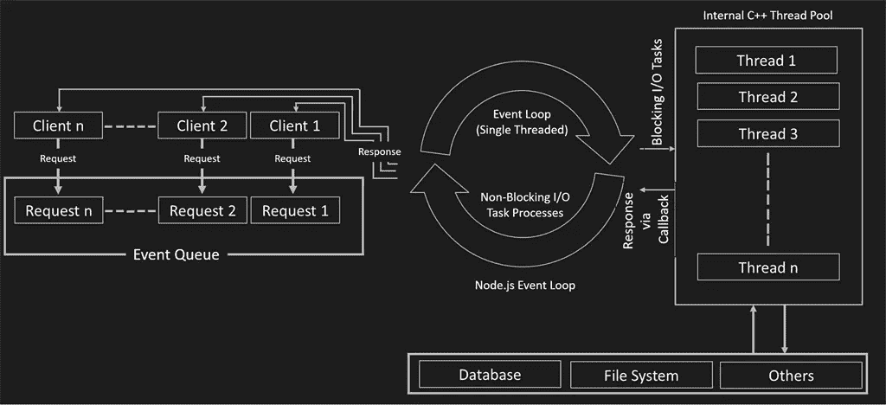

# Node.js 中的多线程和多进程

> 原文：<https://itnext.io/multi-threading-and-multi-process-in-node-js-ffa5bb5cde98?source=collection_archive---------0----------------------->



来自 c-sharpcorner.com

Node.js 是一种单线程语言，它在后台使用多线程来执行异步代码。

Node.js 是非阻塞的，这意味着所有的函数(回调)都被委托给事件循环，它们由不同的线程执行。这由 Node.js 运行时处理。

*   Node.js 确实支持分叉多个进程(在不同的内核上执行)。
*   知道主进程和分叉进程之间不共享状态是很重要的。
*   我们可以通过函数 send 将消息传递给分叉的流程(这是不同的脚本)并从分叉的流程控制流程。

# 为什么以及何时我们需要派生另一个过程？

*   分支多个进程对于释放内存和卸载单个进程至关重要。
*   **为了提高速度，当我们需要将任务委派(并行运行)给另一个进程时。**

让我们看看这个例子:

我们有 REST 端点，它需要调用体内长时间运行的函数:

server.js

```
const { fork } = require('child_process');app.get('/endpoint', (request, response) => { // fork another process
   **const process = fork('./send_mail.js');**
   const mails = request.body.emails; // send list of e-mails to forked process
   **process.send({ mails });** // listen for messages from forked process
   **process.on('message', (message) => {**
     log.info(`Number of mails sent ${message.counter}`);
   **});** return response.json({ status: true, sent: true });
});
```

send_mail.js

```
async function sendMultipleMails(mails) { let sendMails = 0; // logic for
   // sending multiple mails return sendMails;
}// receive message from master process **process.on('message', async (message) => {** const numberOfMailsSend = await sendMultipleMails(message.mails); 

  // send response to master process
  **process.send({ counter: numberOfMailsSend });**
**});** 
```

在这个简单的例子中，我们展示了如何将数据发送到分叉的流程，以及如何将数据发送回来。