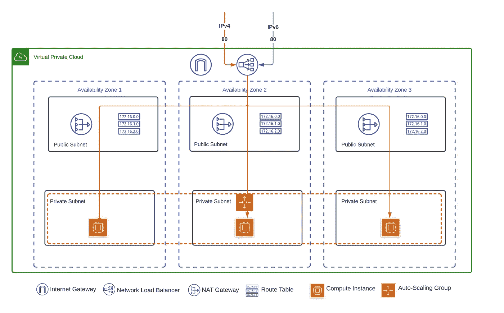
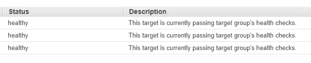
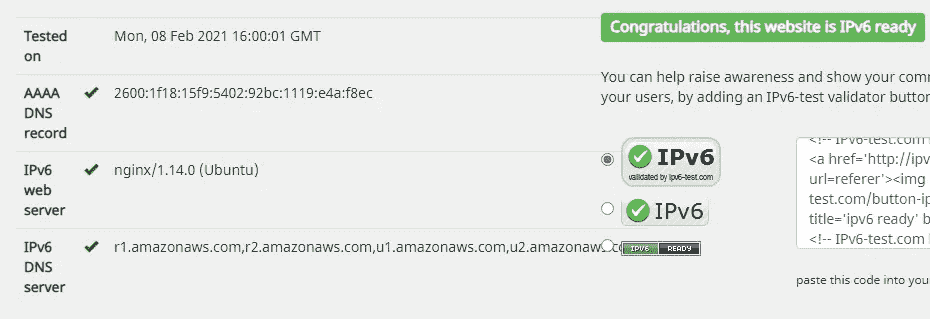

# 采用 Terraform 的多云 IPv6—AWS

> 原文：<https://itnext.io/multicloud-ipv6-with-terraform-aws-221a07f2b5a2?source=collection_archive---------3----------------------->

在这篇文章中，我继续分享我在 AWS、Azure 和 GCP 使用 Terraform 构建 IPv6 可伸缩、弹性 NGNIX 部署的工作。

该版本适用于 AWS 请点击查看 Azure 中的部署。完整的源代码可以在 [GitHub](https://github.com/fvanrooyen/MulticloudIPv6) 中找到

**部署概述**

此部署的要求如下:

1.  客户需要通过 IPv4 和 IPv6 实现这种部署
2.  单区域多 AZ 部署
3.  使用本地 L4 负载平衡器
4.  将 NGINX 用于代理/L7
5.  NGINX 实例需要自动伸缩

**AWS 部署**

AWS 在各种基础设施组件中支持 IPv6 方面取得了巨大进步。他们所做的工作概括了转向 IPv6 寻址的真正本质。IPv6 为我们提供了广阔的地址空间；这意味着没有 NAT 复杂性或私有地址重叠；相反，所有设备都有唯一的公共地址。尽管 AWS 还没有完成完全支持 IPv6 的工作，但像出口专用互联网网关这样的组件显示了建立在坚实原则上的基础。

快速概述我们将要创建的内容:

上面是一个三区域部署，每个区域使用一个公共和私有子网。您可能会注意到，从 IPv6 流的角度来看，流量在负载平衡器处停止。原因是我们将用于此部署的网络负载平衡器不会将 IPv6 流量转发到下游主机；相反，它会终止连接并将流量转换到 IPv4 网络。这种实现显然并不理想，但正如我提到的，AWS 仍在努力让他们的所有服务完全支持 IPv6，NLB 似乎就是这种情况。

**AWS IPv6 联网**

第一项任务是创建 VPC:

对于要启用 IPv6 的 VPC，会为其分配一个 IPv6 CIDR 块。该功能通过将`assign_generated_ipv6_cidr_block`参数设置为真来实现。此时，AWS 将从亚马逊的全球单播地址(GUA)中分配一个/56 IPv6 CIDR 块，并将其附加到 VPC。您不能自己选择此范围。gua，也称为*可聚合全球单播地址*，在 IPv6 互联网中可全球路由和到达。它们相当于公共 IPv4 地址。

下一步是设置公共和私有子网:

为了确保此环境的安全，需要实施公共和私有子网。由于 AWS 将子网固定到一个可用性分区，因此我们将为每个分区创建两个，总共六个子网。专用子网确保自动扩展组实例只能通过负载平衡器进行访问。对于公共子网，通过使用`ipv6_cidr_block = cidrsubnet(aws_vpc.ipv6_vpc.ipv6_cidr_block, 8, 1)`从 VPC 块中为 IPv6 分配一个 IPv6 CIDR 块来启用 IPv6。`cidrsubnet(prefix, newbits, netnum)`计算给定 IP 网络地址前缀内的子网地址；在这种情况下，我们将从 VPC 数据块为每个子网创建一个 IPv6 /64。对于私有子网，不需要为 IPv6 做任何事情，因为它们只是 IPv4 子网。

创建 VPC 和子网后，就该设置 Internet 网关和路由表了。

创建路由表时，需要 IPv6 条目`ipv6_cidr_block = “::/0”`

为了使专用子网能够与 Internet 通信，需要创建三个 NAT 网关。NAT 网关只是 IPv4 的一项要求。

上面的代码部分创建了三个 NAT 网关，每个 AZ 一个，在每个私有子网中创建了三个路由表，将默认路由设置为该区域的 NAT 网关，最后将其与适当的子网相关联。

**关于出口专用的互联网网关**

值得一提的是，如果专用子网确实有一个与之相关联的 IPv6 地址块，那么就需要一个仅出口的互联网网关来将流量路由到互联网。仅出口 internet 网关被定义为:“一个水平扩展、冗余且高度可用的 VPC 组件，它允许通过 IPv6 从 VPC 中的实例向 internet 进行出站通信，并阻止 internet 启动与您的实例的 IPv6 连接。”因此，该组件有助于确保包含公共 IPv6 地址的专用子网的安全性。

**安全**

安全组被创建并应用于自动缩放组中的实例

由于安全组将应用于专用子网组件，因此不需要输入 IPv6 条目。看着这个 SG，可能会觉得奇怪的是“允许所有 80”语句。这种奇怪与 NLB 没有任何安全组织的事实有关。相反，您可以通过将安全组直接附加到 EC2 实例来控制访问。

**负载平衡器**

我在这个部署中使用了 NLB，因为它满足了 POC 的要求。如前所述，NLB 不会转发 IPv6 流量。NLB 的目标群体还不支持 IPv6，我希望这一功能很快就能实现。

创建基础 LB 需要将 `ip_address_type`设置为`“dualstack”`以支持 IPv6 端点并创建必要的 A 和 AAAA DNS 记录。因为我想让这个 NLB 跨越多个 AZ，所以我使用了`enable_cross_zone_load_balancing = true`

从现在开始，一切都是通过创建一个监听器、目标组和健康检查来建立标准的 IPv4。

本质上，这是 IPv6 特定植入的终点，剩下的只是在自动扩展组的私有子网中设置实例。完整实现请查看 [GitHub](https://github.com/fvanrooyen/MulticloudIPv6) 中的部署。

**验证**

对于这个简单的例子，我首先检查目标群体部分，以确保该站点可用:

检查 IPv6 连接稍微复杂一点，这取决于您的提供商等。为了简单起见，我使用了[https://ipv6-test.com/validate.php](https://ipv6-test.com/validate.php)

[1]: AWS。仅出口互联网网关*[https://docs . AWS . Amazon . com/VPC/latest/user guide/egress-only-internet-gateway . html](https://docs.aws.amazon.com/vpc/latest/userguide/egress-only-internet-gateway.html)*