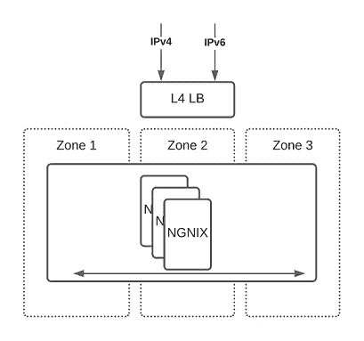
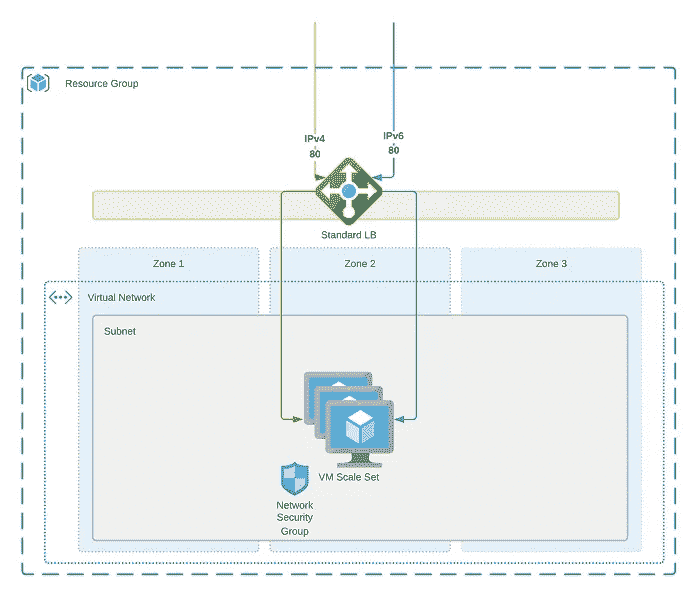
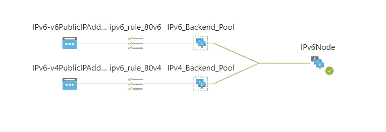
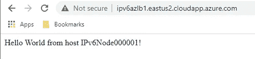
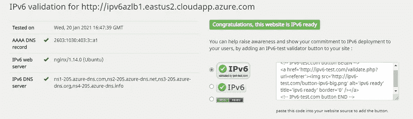

# 采用 terra form-Azure 的多云 IPv6

> 原文：<https://itnext.io/multicloud-ipv6-with-terraform-azure-231f9ffe35d0?source=collection_archive---------1----------------------->

我最近有机会在一个 POC 上工作，在那里我必须使用 Terraform 测试 IPv6 功能 AWS 和 Azure。在这个旅程的早期，我很快意识到完成这个任务的文档很少来自云提供商和 HashiCorp。此外，云与云之间还有许多细微的差别，除了不得不去研究、测试和从错误中学习之外，这些差别并不为人所知。因此，我发布了我的工作，为这个过程提供一些文档和指导。这个版本是给 Azure 的，AWS 和 GCP 正在路上。GitHub 中的完整源代码

**部署概述**

该部署的目标是使用 Terraform 在 AWS 和 Azure 中实现 IPv4/IPv6 可伸缩、弹性 NGNIX 部署。

此部署的要求如下:

1.  客户需要通过 IPv4 和 IPv6 实现这种部署
2.  单区域多 AZ 部署
3.  使用本地 L4 负载平衡器
4.  将 NGINX 用于代理/L7
5.  NGINX 实例需要自动伸缩

**Azure 部署**

Azure 支持在所有基础设施组件(VNET、子网、LB、VM 等)上进行完整的双栈部署。)这使得 IPv6 部署实质上是 Terraform 中 IPv4 部署的副本。通过 IPv6 传输数据的费用与 IPv4 相同。快速概述我们将要创建的内容:

需要注意的一点是，我假设有三个区域可用，因为这是项目的一个要求。并非所有 Azure 地区都符合这一要求，请查看 Azure[geographics](https://azure.microsoft.com/en-us/global-infrastructure/geographies/)页面，了解有关该主题的更多信息。

**Azure IPv6 网络**

除了设置资源组和订阅之外，首先要做的是创建 vnet:

创建虚拟网络时唯一真正不同的细节是`address_space`的分配，它包括我们想要使用的 IPv4 和 IPv6 数据块，我们可以更好地查看变量文件:

关于空间分配的重要注意事项，对于 IPv4 块，我们使用 RFC 1918 空间“10.0.0.0/16 ”,对于 IPv6 块，我们使用 ULA(唯一本地地址)或 RFC 1884 空间“fd00:db8:deca:daed::/64”ULA 地址空间定义为“地址范围 *fc00::/7 中的 IPv6 地址”。*它在 IPv6 中的用途类似于 IPv4 专用网络寻址。唯一的本地地址可以在单个站点或组织内自由使用，无需集中注册，也可以跨有限数量的站点或组织使用。它们只能在这种专用网络的范围内进行路由，而不能在全球 IPv6 互联网中进行路由。使用 ULA 空间时要认识到，在希望通过对等在虚拟网络之间进行路由的组织内，可能会发生重叠，因此需要 IPv6 地址管理策略。

下一步是定义将要使用的子网。与 AWS 不同，Azure 中的子网没有固定到特定的区域，而是跨区域延伸，考虑到这一点，我们将只定义一个子网，以最大限度地利用 VM 规模集。

变量文件再次显示了 IPv6 的附加内容:

接下来，我们来看看将要创建的 NSG(网络安全组):

此 NSG 将适用于 IPv4 和 IPv6，并将允许所有入站流量通过 TCP 访问端口 80。我们现在将定义负载平衡器要使用的前端公共 IP:

需要指定`ip_version`以确定 Azure 要分配的地址类型，并且`domain_name_label`用于组成 FQDN 并在 Microsoft Azure DNS 系统中创建 A 和 AAAA DNS 记录。

现在我们来看看负载平衡器的创建过程，首先创建一个标准负载平衡器，并将两个公共 IP 作为前端地址连接起来:

完成后，负载平衡器设置的其余部分就可以完成了，这包括添加后端地址池、创建运行状况探测，以及最终为 IPv4 和 IPv6 创建负载平衡规则:

这是一个相当大的代码块，但是展示了 Azure 中的双栈 IPv6 实现是如何简单地从 IPv4 复制、粘贴和替换到 IPv6 的。

**Azure IPv6 计算**

此时，是时候通过创建区域平衡的 Linux 虚拟机规模集来定义计算了:

通过使用`zones`参数为 Scaleset 定义区域，我还将`zone_balance`参数设置为“真”

值得看一下网络接口部分，其中连接了 NSG，使用`version`参数定义了 IPv4 和 IPv6 的 IP 配置，并将其连接到 IPv4 和 IPv6 负载平衡器池。请注意，需要将其中一个配置设置为主配置。

Terraform 脚本部分到此结束，剩下的就是做一些测试了。

**验证**

对于这个简单的例子，我首先检查 Azure Load Balancer Insights 部分，以确保所有部分都在工作:

此时，可以使用任何连通性测试来检查 IPv4:

检查 IPv6 连接稍微复杂一点，这取决于您的提供商等。为了简单起见，我只使用 https://ipv6-test.com/validate.php 的

[1]:维基百科。*唯一本地地址*[https://en . Wikipedia . org/wiki/Unique _ local _ address # cite _ note-RFC 1884-2](https://en.wikipedia.org/wiki/Unique_local_address#cite_note-rfc1884-2)