# 多集群调度器和 Argo(工作流和 CD):深入探讨

> 原文：<https://itnext.io/multicluster-scheduler-argo-workflows-across-kubernetes-clusters-ea98016499ca?source=collection_archive---------0----------------------->

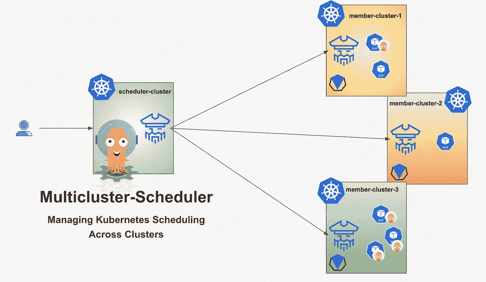

多集群调度—跨 Kubernetes 集群的智能调度

合著者:[阿德里安·特罗伊劳](https://medium.com/u/a6d36eaaf61e?source=post_page-----ea98016499ca--------------------------------)

无论环境如何，在多个不同的 Kubernetes 集群上进行部署和管理的能力是支持多集群和多云平台的关键特性。联合将多集群管理的概念向前推进了一步，引入了通过主机集群中的单个 API 管理主配置的功能，并将该配置的全部或部分应用于作为联合成员的任何集群。

有多种方法可以在集群之间实现联合。例如， [Kubefed v2](https://github.com/kubernetes-sigs/kubefed) 和 [Shipper](https://github.com/bookingcom/shipper) 通过使用自定义资源定义向集群公开新资源来实现集群联合。另一方面，Multicluster-scheduler 以基本单元 pod 为目标，不需要任何其他特定于联邦的配置。Multicluster-scheduler 使用 virtual-kubelet 提供者(virtual kubelet 提供了一个可插拔的提供者接口，开发人员可以实现该接口来定义典型 kubelet 的操作)来调度远程集群上的 pods。

[海军部的多集群调度程序](https://github.com/admiraltyio/multicluster-scheduler)将自身注入标准 Kubernetes 生命周期(变异的 pod 许可 webhooks)并拦截所有创建带有特定注释的 pod 的调用，以创建一个额外的 pod 以及一个在虚拟 kubelet 上调度的名为 proxy pod(占位符 pod，它不做太多事情)的原始 pod。原始 Pod 经过另一轮调度，其中在询问整个拓扑之后做出放置决定。

Multicluster-scheduler 可以跨 Kubernetes 集群运行 Argo 工作流，而无需任何额外的平台更改。用户可以将窗格委派到资源可用的地方，或者由用户指定。并行工作流可以更快地运行，而不必横向扩展集群，并且它简化了多区域和多云 ETL 流程。这种集成可以很容易地与 Argo 耦合，因为 Argo 前端不需要任何更改。

# 多集群调度程序

[Multicluster-scheduler](https://github.com/admiraltyio/multicluster-scheduler) 是一个 Kubernetes 控制器系统，可以智能地跨集群调度工作负载。使用 virtual-kubelet provider 的 Multicluster-scheduler 将选出的 pods 转变为在一个 [virtual-kubelet](https://virtual-kubelet.io/) (一个 [Kubernetes kubelet](https://kubernetes.io/docs/reference/generated/kubelet/) 的实现，它伪装成一个将 Kubernetes 集群连接到其他 API 的 kubelet)上调度的代理 pods，并在远程集群(实际运行的容器)中创建代理 pods。

反馈循环更新代理窗格的状态和注释，以反映代理窗格的状态和注释。目标群集中的代理负责创建委派窗格。代理 pod 与原始 pod 具有相同的规格。代理 pod 是基于拓扑分布的，它们可以跨集群分布，如果代理部署在主集群上，则它可以将代理 pod 与代理一起保存。

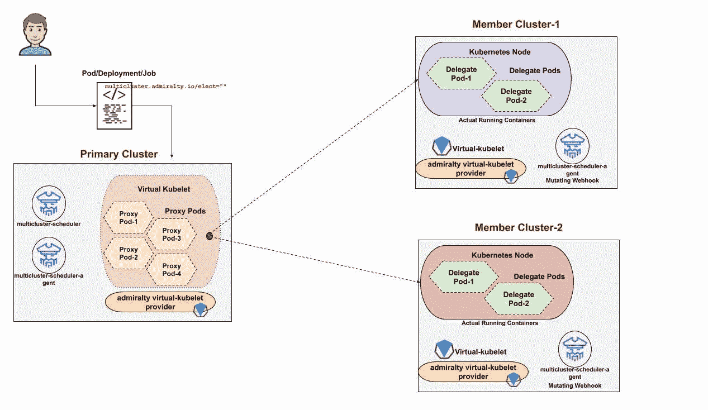

多集群调度器— Kubernetes

当工作负载用“*multicluster.admiralty.io/elect*注释时，多集群调度器使用[变异 pod 准入 webhooks](https://kubernetes.io/docs/reference/access-authn-authz/extensible-admission-controllers/) 来拦截调用并创建一个虚拟 pod。实际 pod 被变异为在虚拟 kubelet 节点上调度的'*代理 pod*'([提供者实现](https://godoc.org/admiralty.io/multicluster-scheduler))并在成员集群中创建相应的“代理 pod”。代理窗格是不请求内存或 cpu 的虚拟窗格，反映了代理窗格(实际功能容器)的状态和注释。

代理 pod 将源 pod 配置存储在一个注释中。当委托窗格被注释时，相同的注释被反馈给代理窗格。

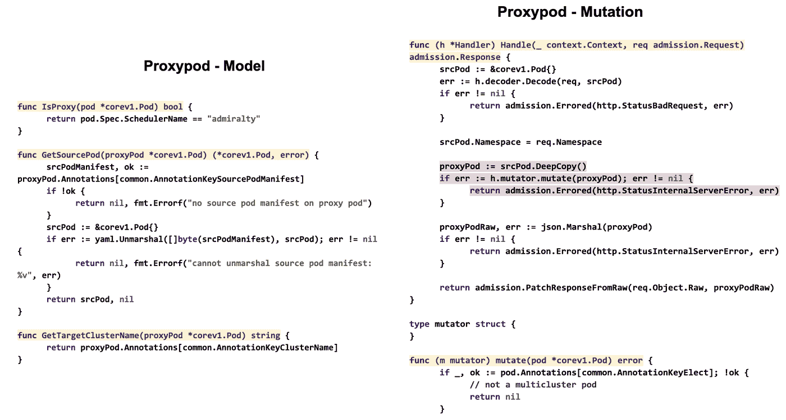

邻近脚模型和突变

# 试用

创建了不同区域的三个 Kubernetes 集群。其中一个集群' *cluster-atlanta* '是主调度器集群(包含多集群调度器)，而' *cluster-seattle* '、' *cluster-dallas* '是成员集群(包含多集群调度器代理)。由于一些或所有的代表 pods 被安排在不同的集群上，因此服务需要将流量路由到它们。

Cilum 集群网格和全局服务可以跨集群执行全局路由。以代理 pod 为目标的服务被重新路由到其代理，跨集群复制，multicluster-scheduler 将使用'*io.cilium/global-service=true'*注释服务，并跨集群复制服务，集群将在 Cilium 集群网格中实现负载平衡。

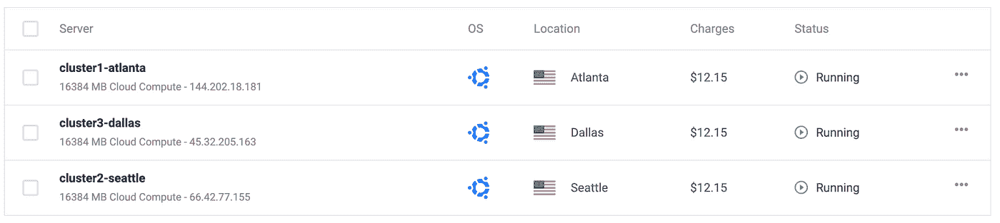

多集群/多区域拓扑

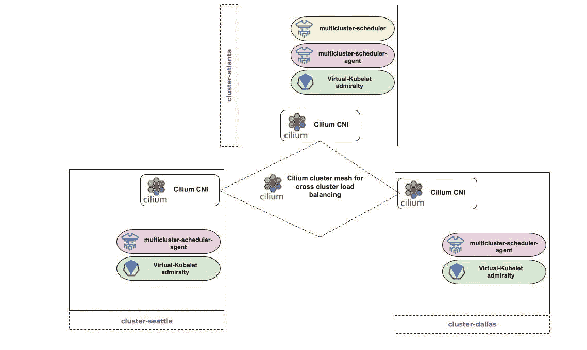

具有纤毛簇网格的多簇拓扑

主调度程序集群包含多集群调度程序，代理也可以与调度程序一起部署在同一个集群上。在上面的拓扑中，‘*集群——Atlanta*’充当主集群:

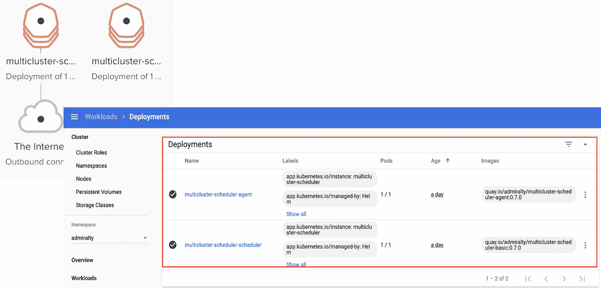

集群上的多集群调度程序和代理-atlanta

当 multicluster-scheduler 与实际的 Kubernetes 节点一起部署在集群上时，会创建一个虚拟的 kubelet 节点。

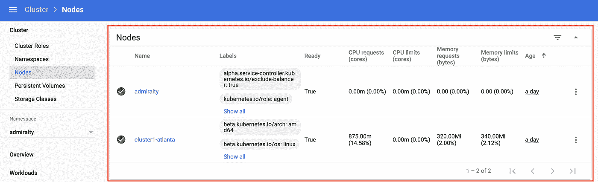

由多集群调度程序创建的虚拟 Kubelet 节点

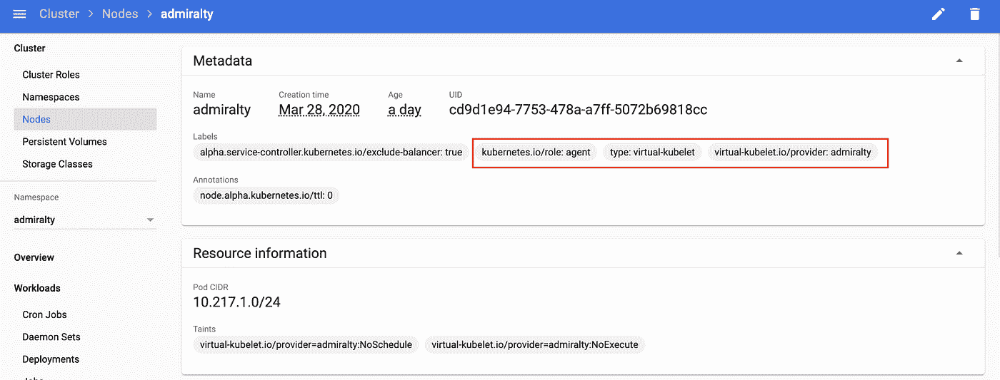

由多集群调度程序创建的虚拟 Kubelet 节点

如上图所示，cluster-atlanta 包含一个名为 admiralty 的虚拟 kubelet 节点。

主集群上的 multicluster-scheduler 应该能够与成员集群的 Kubernetes API 服务器对话。服务帐户令牌作为 kubeconfig 文件从成员集群中提取，并作为机密保存在调度程序的集群中。

海军部的[多集群服务账户](https://github.com/admiraltyio/multicluster-service-account)，多集群工具包的一部分，使用户能够调用其他集群的 Kubernetes APIs，并将远程服务账户令牌导入本地机密，并自动将它们挂载到注释窗格中。

作为主群集的 cluster-atlanta 包含 cluster-dallas 和 cluster-seattle 的服务帐户，如下所示:

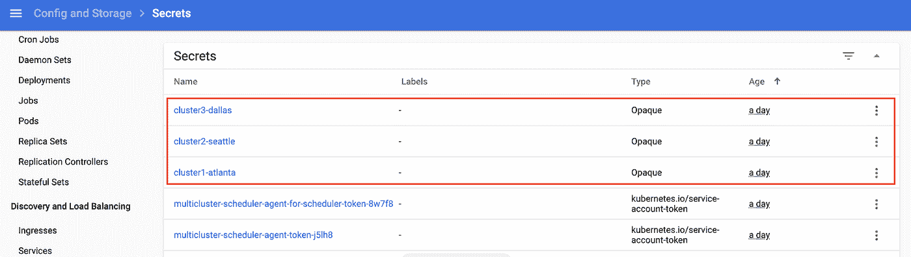

使用 MCSA 导出为机密的成员集群的服务帐户

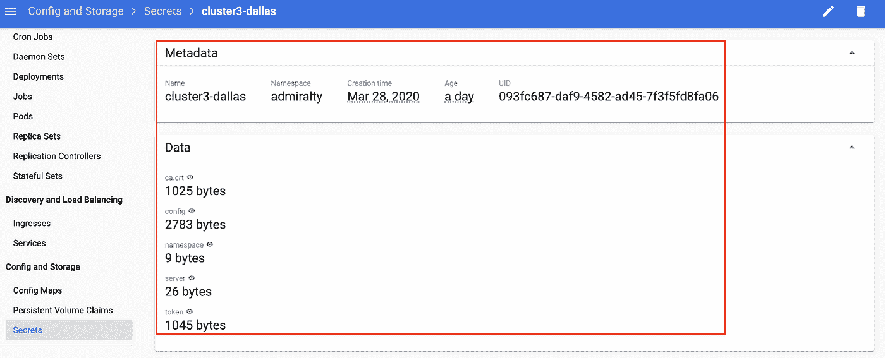

作为 Kubernetes 秘密的成员集群的服务帐户

装载到多集群调度程序部署的配置映射保存如下所示的机密信息:

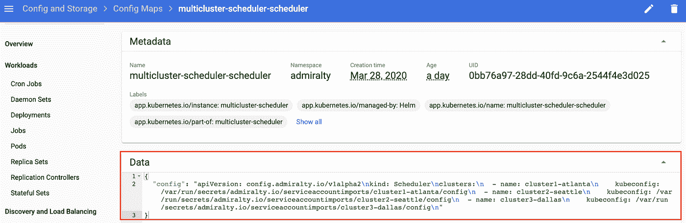

具有服务帐户信息的计划程序配置映射

除了服务帐户之外，所有成员集群都使用邀请加入主集群。邀请在以被邀请的集群命名的用户之间创建(集群)角色绑定，例如 admiralty:cluster-seattle 和 multi cluster-scheduler-agent-for-cluster 集群角色。调度程序模拟在代表被邀请的集群创建/更新/删除代表 pod 和服务时创建的用户。

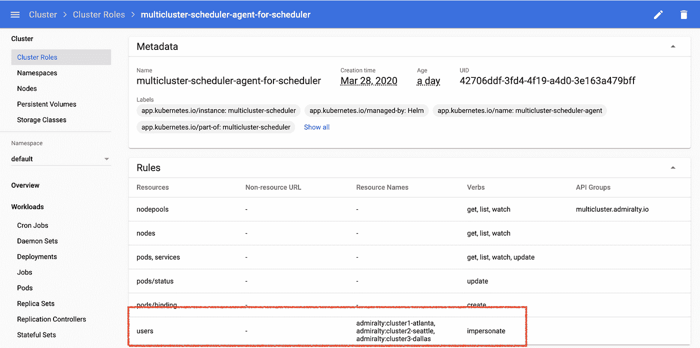

为所有集群用户创建的集群角色

在三个集群上部署了 multicluster-scheduler 和代理后，创建了一个 nginx 部署，其中包含五个副本和注释:在一个成员集群“cluster-seattle”上的“*multicluster.admiralty.io/elect*”:

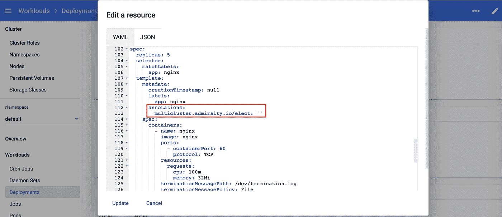

启用多集群调度的 Pod 注释

此配置在 virtual-kubelet 节点上调度的 cluster2-seattle 上启动五个代理 pod:

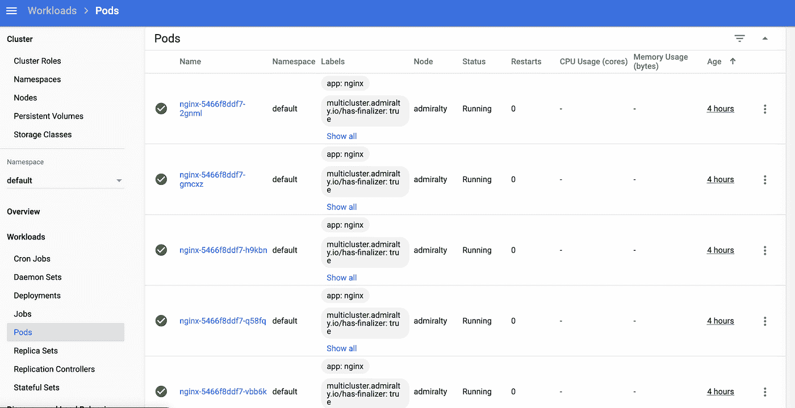

虚拟 Kubelet 节点上调度的代理 pod

如下面的代理 pod 配置所示，每个代理 pod 都将引用在其他成员群集中运行的代理 pod 清单，因为代理 pod 反映了代理 pod(实际运行的容器)的规范。下面，pod 规范包含指定 delegate-pod 集群和 sourcepod 清单的注释:

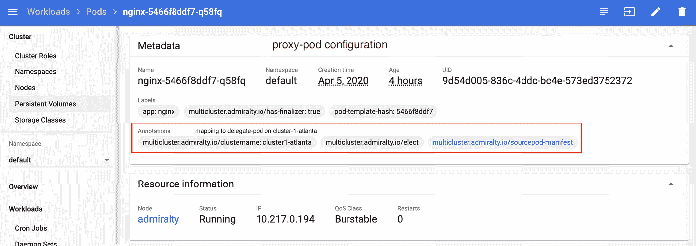

代理窗格->代理窗格引用

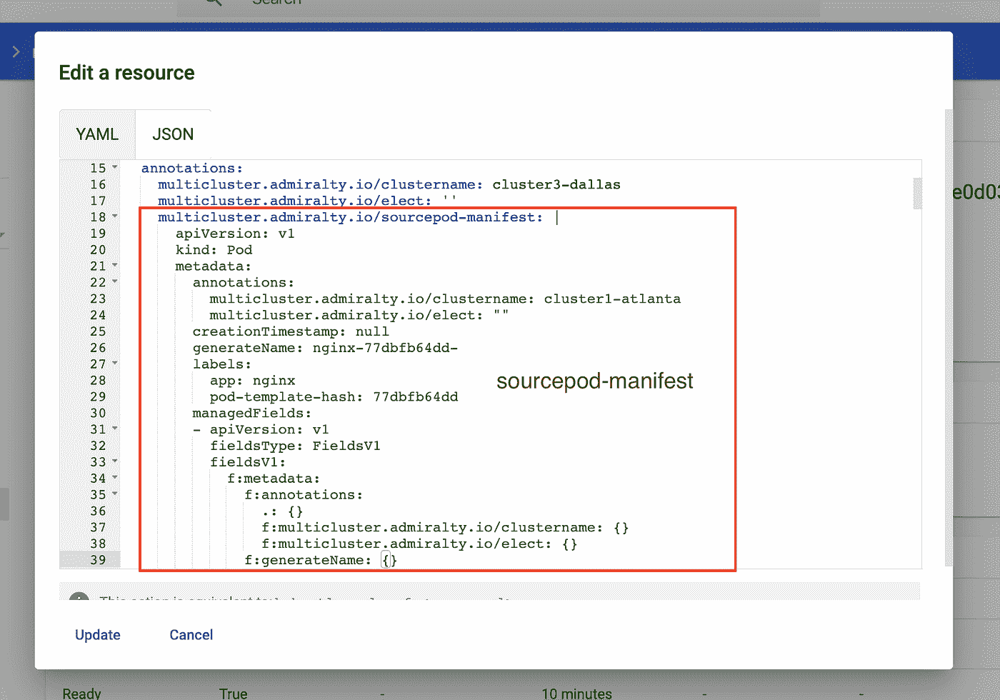

将 sourcepod-manifest 作为注释的代理 pod

三个委派单元(nginx 副本)安排在亚特兰大群集上，另外两个安排在达拉斯群集上:

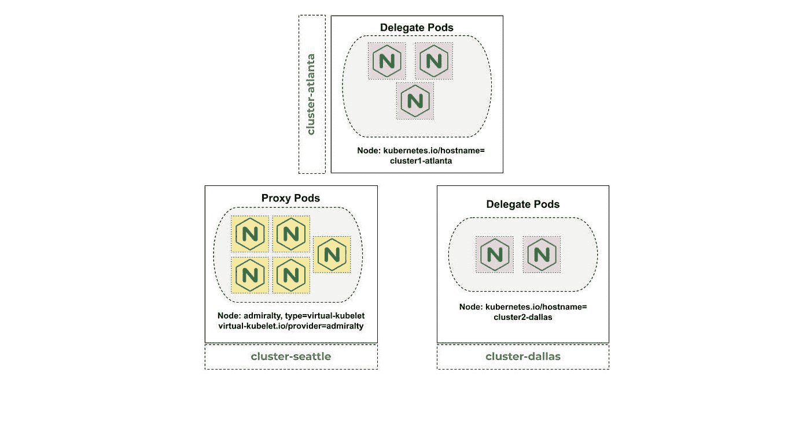

在 cluster-seattle 上创建的代理 pod 以及 cluster-atlanta 和 cluster-dallas 上相应的代理 pod

如上所示，成员集群 atalanta 和 dallas 上的 delegate pods 是在 Kubernetes 节点上调度的，因为这些是实际的运行/功能容器。每个 delegate-pod 配置都包含到 parent-uid(代理 pod uid)和控制器引用的映射，如下所示。

在 Kubernetes 节点“cluster1-atlanta”上安排了“cluster-atlanta”上的三个复制副本(委派窗格)(所有三个集群都是具有一个节点的 AIO Kubernetes 集群)。

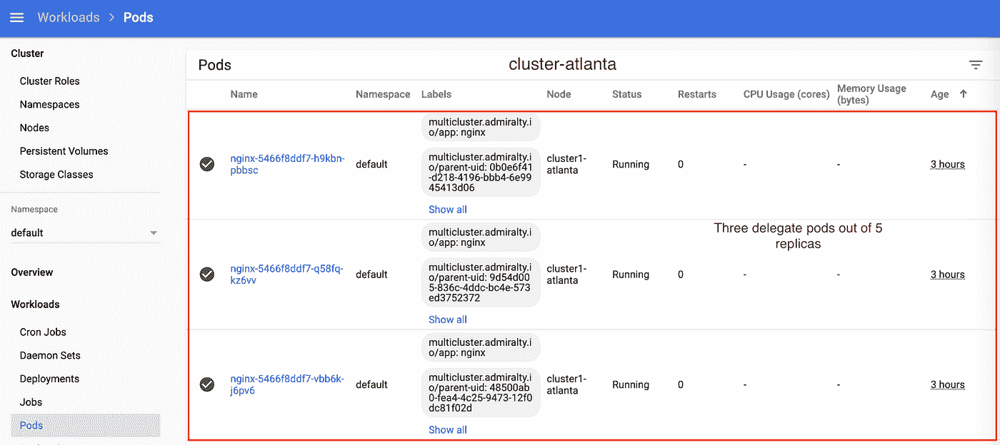

在 cluster-atlanta 上创建的委派窗格(因为它包括调度程序和代理)

如下所示，cluster-atlanta 上的所有代理窗格都包含一个标签，该标签引用 cluster-seattle 上运行的父窗格(代理窗格)。

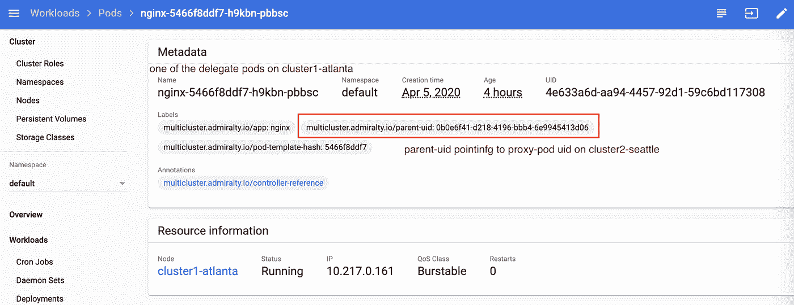

委托窗格->代理窗格父-uid 映射

注释“multi cluster . admiralty . io/controller-reference”包括映射信息(代表 pod — ->代理 pod)。

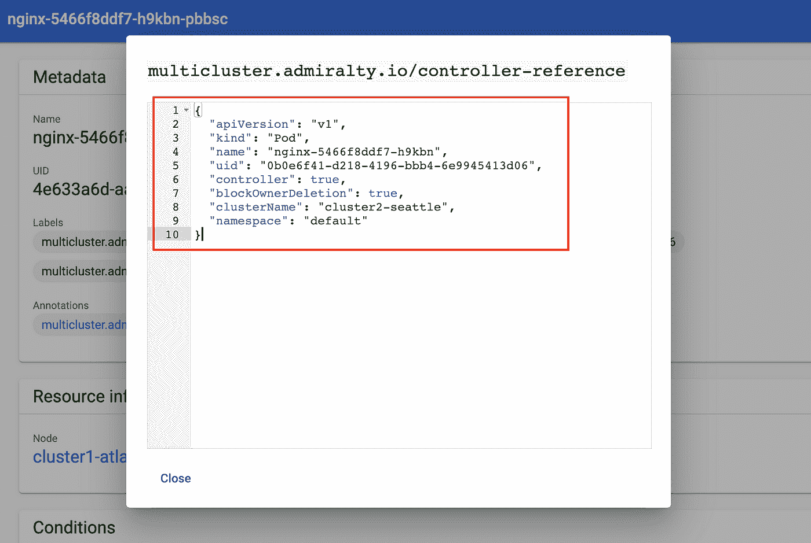

代理 pod 控制器-引用映射到代理 pod

如上所示，运行在 cluster-atlanta 上的代理 pod nginx-5466*包含运行在 cluster-seattle 上的代理 pod nginx-5466*的父 uid。

代理 pod 控制器-引用映射到代理 pod

# 强制放置—特定于群集的调度

Multicluster-scheduler 便于用户指定目标集群，而不是让调度程序来决定。可以使用*' multi cluster . admiralty . io/cluster name '*注释来执行放置。

部署 Nginx 部署时，clustername 注释映射到 clustername: cluster3-dallas，作为 cluster2-seattle 中的目标集群:

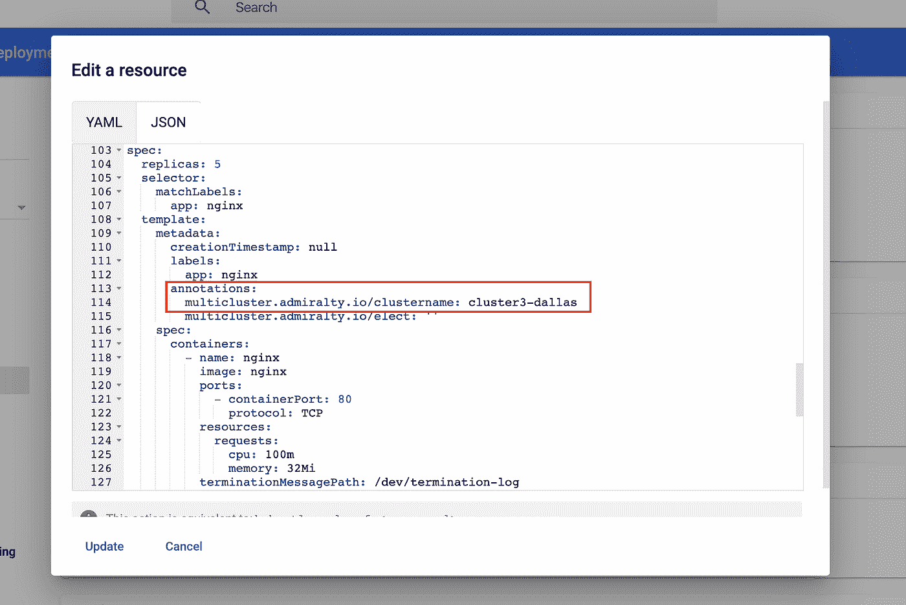

在 pod 注释中使用 clustername 强制放置

该配置在 cluster3-dallas 上创建了所有五个代理 pod(运行容器),并且在 cluster2-seattle 上创建了所有五个代理 pod。

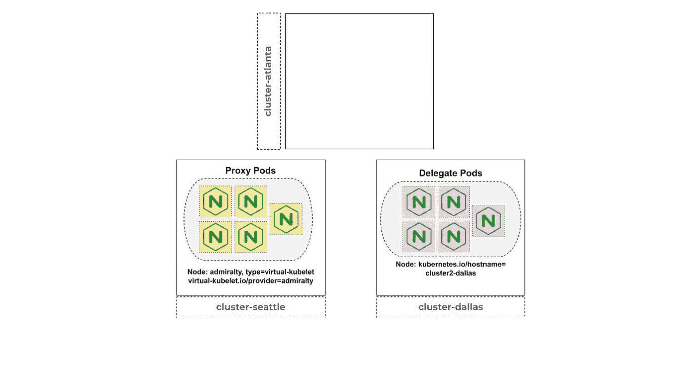

强制放置-在集群上创建所有代理窗格-dallas

集群 2 上的代理 pods 西雅图:

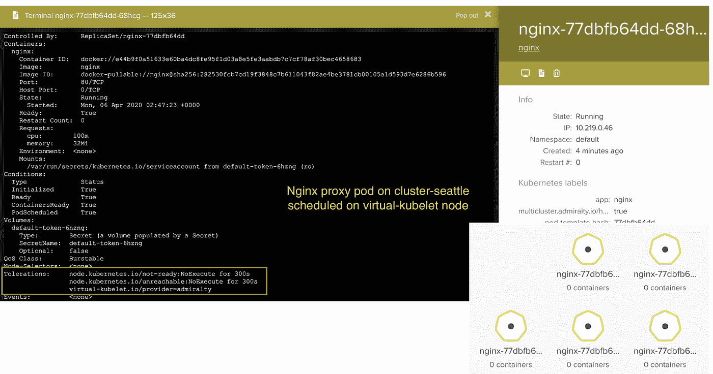

集群上的代理 pods 西雅图

集群 3 上的代表舱-达拉斯:

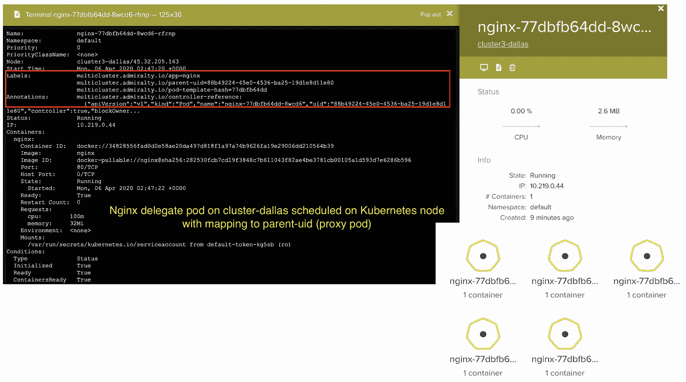

集群上的代表窗格-达拉斯

# 跨集群的 Argo 工作流

Argo 向 Kubernetes 添加了一个名为工作流的新对象。说得好听一点，工作流是“步骤”的[有向无环图](https://en.wikipedia.org/wiki/Directed_acyclic_graph)。Multicluster-scheduler 允许用户在工作流配置中配置 pod 注释，以指示 pod 应该在哪个集群中运行，同样，使用单个 pod 模板注释。在许多情况下，当与 Argo 结合使用时，多集群调度程序可以发挥重要作用，其中一些情况如下:

1.  在异构集群/环境中从中央 Argo 集群部署和管理工作流，而无需在远程集群中使用 Argo。
2.  大型并行工作流可以在多个群集上运行，保持并行性，其中每个步骤都可以利用单个群集的资源来更快地执行，而不是使用单个群集的资源来执行工作流的所有步骤。
3.  需要特殊资源能力(如用于机器学习训练管道的 GPU)的工作流的特定步骤可以针对具有资源的成员集群。
4.  工作流可以在多个容量较低的较小集群上运行，从而消除了在单个集群中拥有高成本实例的需求。
5.  用户可以选择特定的环境，在该环境中，工作流合并来自多个云或区域的数据。要么更有效，要么需要在离数据源更近的地方运行一些步骤。
6.  必须在多个边缘位置上运行的边缘工作流可以从中央集群进行管理，而不必在资源节约的环境(边缘站点)中安装其他组件
7.  如果集群耗尽了资源，那么向外扩展会容易得多。

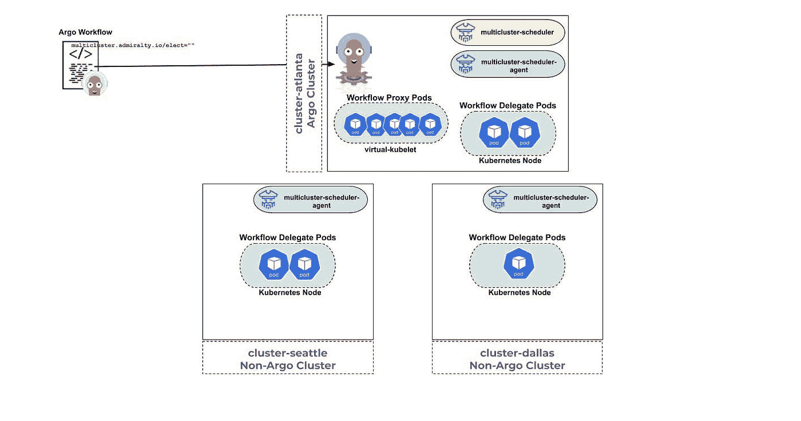

使用多集群调度程序跨 Kubernetes 集群的 Argo 工作流

在上面的拓扑中，cluster-atlanta 部署了 argo 工作流控制器，其他两个集群是非 Argo 集群，部署了多集群调度程序代理。

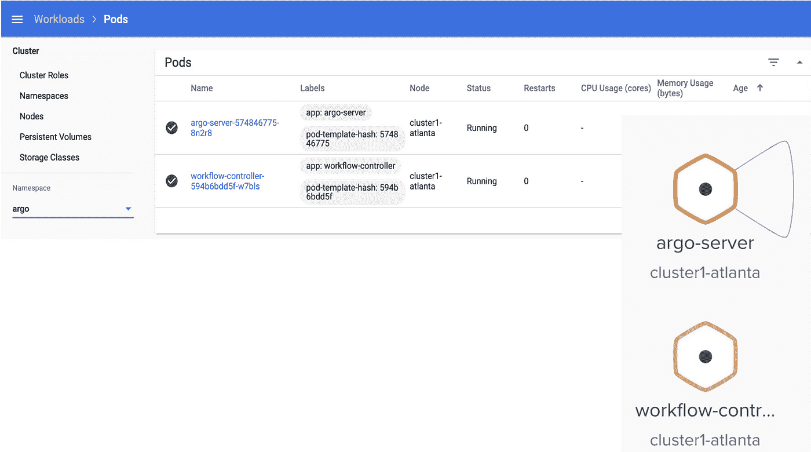

部署在群集上的 Argo 服务器-亚特兰大

# 跨集群运行示例并行嵌套 DAG

以下示例在外部 DAG 上运行并行工作流，并限制同时运行的其子 DAG 的数量。A 的并行度为 2，三个 DAG 中只有两个(b2，b3，b4)会在 b1 完成后开始运行，左边的 DAG 会在其中一个完成后运行。

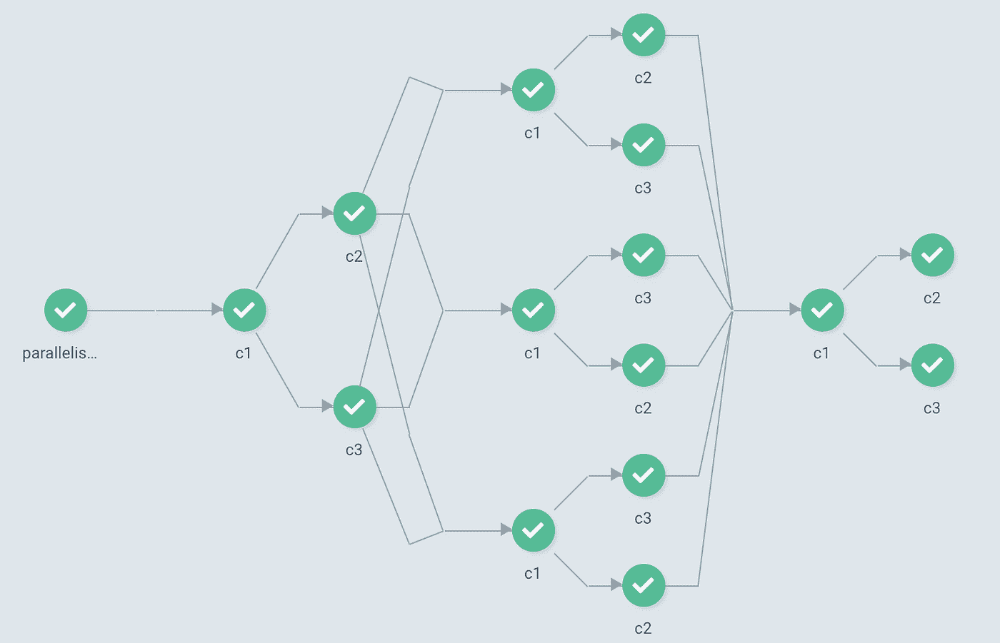

示例 Argo DAG 工作流-跨集群运行

工作流模板配置有注释:“multi cluster . admiralty . io/elect”以启用多集群调度:

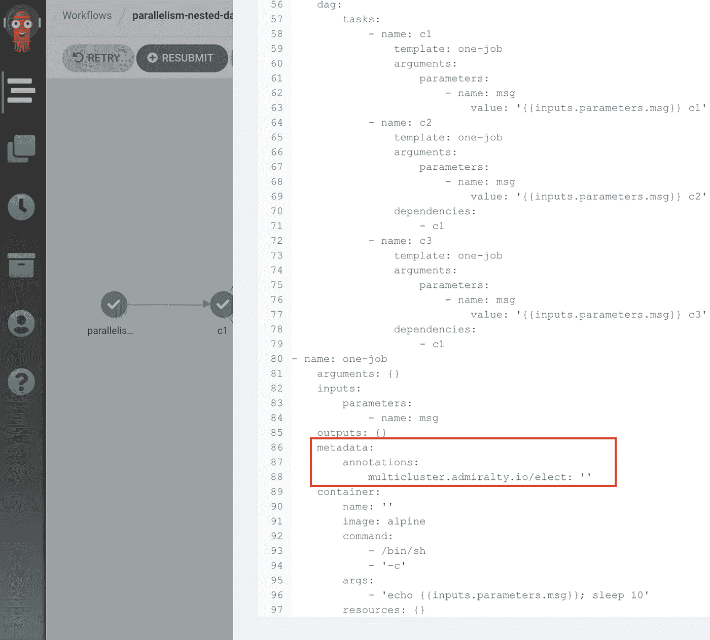

带有多集群计划窗格注释的工作流清单

工作流需要 14 个 pod 才能完成，工作流从开始到完成如下所示:

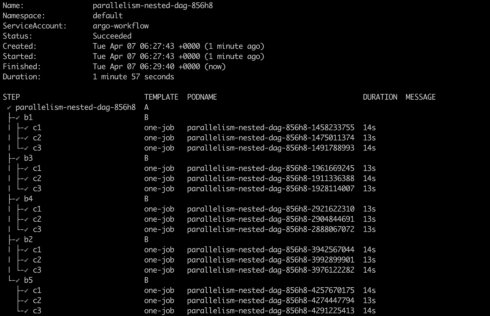

示例 DAG —工作流执行—在多个集群上运行

工作流程由 Argo 集群提交:亚特兰大集群。所有代理窗格都是在 cluster-atlanta 上创建的，此外还有四个工作流委派窗格(执行工作流的实际运行容器):

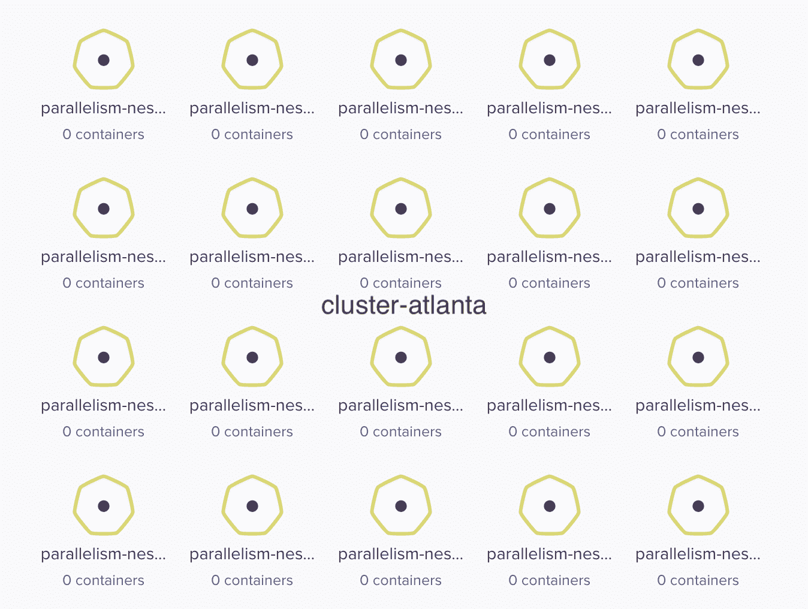

在群集-atlanta 上创建的代理工作流窗格

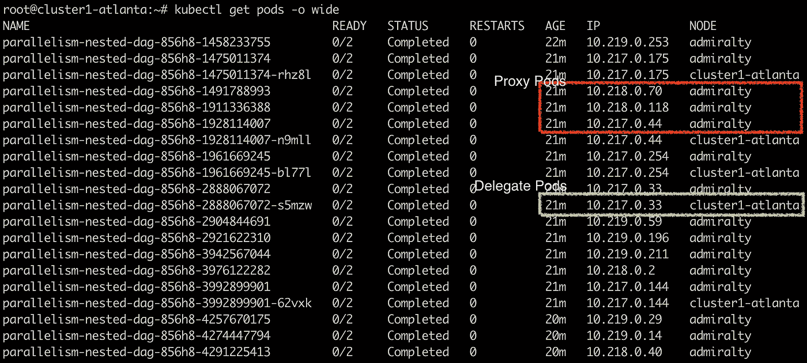

虚拟 Kubelet 上安排的代理工作流窗格和实际 Kubernetes 节点上的委托窗格

如上所示，所有工作流代理窗格都在 virtual-kubelet:admiralty 上安排，而工作流代表窗格则在实际的 Kubernetes 节点上安排。代理窗格执行工作流，如下所示:

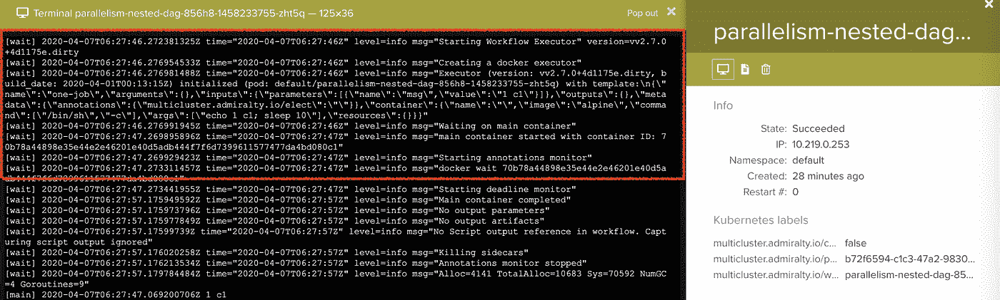

执行工作流的委派窗格

在 cluster-seattle 上安排了四个工作流委派单元，在 cluster-dallas 上安排了另外六个工作流委派单元:

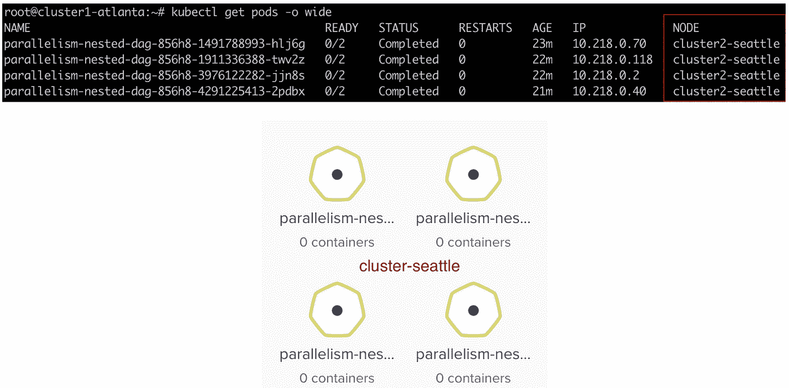

群集上的代理工作流窗格-西雅图

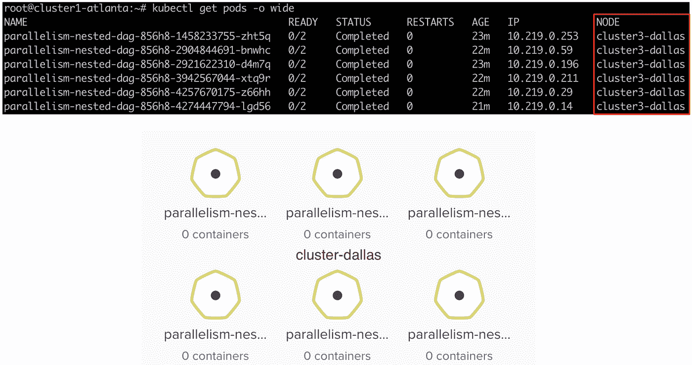

集群上的代理工作流窗格-dallas

# 在目标群集中运行特定的工作流步骤

使用*' multi cluster . admiralty . io/cluster name '*标注工作流中的特定步骤可以在成员集群上运行。以特定集群为目标使用户能够从安装了 Argo 的中央集群在远程站点/边缘站点上运行和操作工作流。

具有简单 DAG 工作流的示例场景，其中步骤 A 和 C 可以在 cluster-atlanta 中运行，但是步骤 B 必须在 cluster-dallas 中运行；步骤 C 依赖于步骤 A 和 b。工作流模板提供了 multicluster.admiralty.io/clustername pod 模板注释以实施放置。

目标集群上的多步 DAG 工作流示例

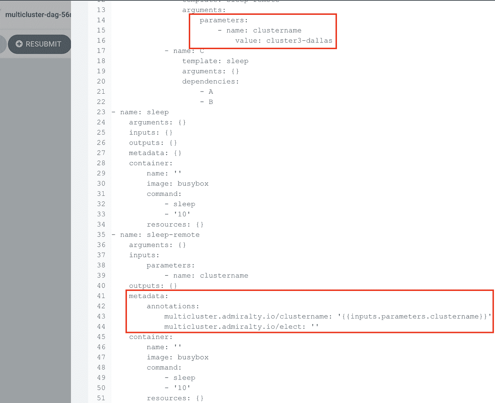

使用 pod 注释(clustername)在特定集群上强制放置特定步骤

如下所示，工作流需要三个窗格来执行:

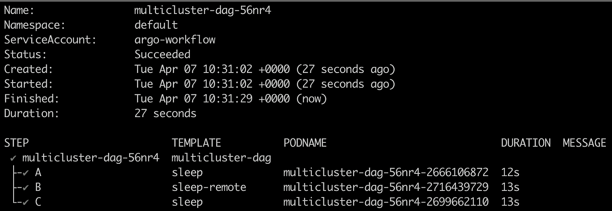

示例 DAG —工作流执行—在特定集群上运行特定步骤

工作流程由 Argo 集群提交:亚特兰大集群。在 cluster-atlanta 的 Kubernetes 节点上创建了两个执行步骤 A 和 C 的工作流委托窗格，并为 cluster-dallas 上执行步骤 b 的委托窗格创建了一个代理窗格

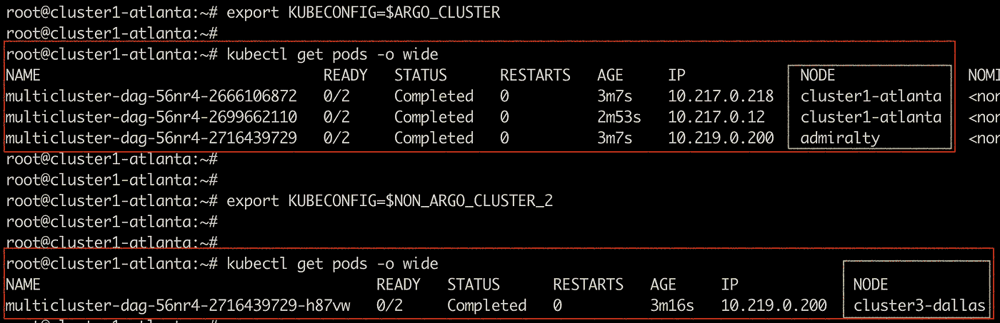

达拉斯群集上的代理工作流窗格和亚特兰大群集上的代理窗格

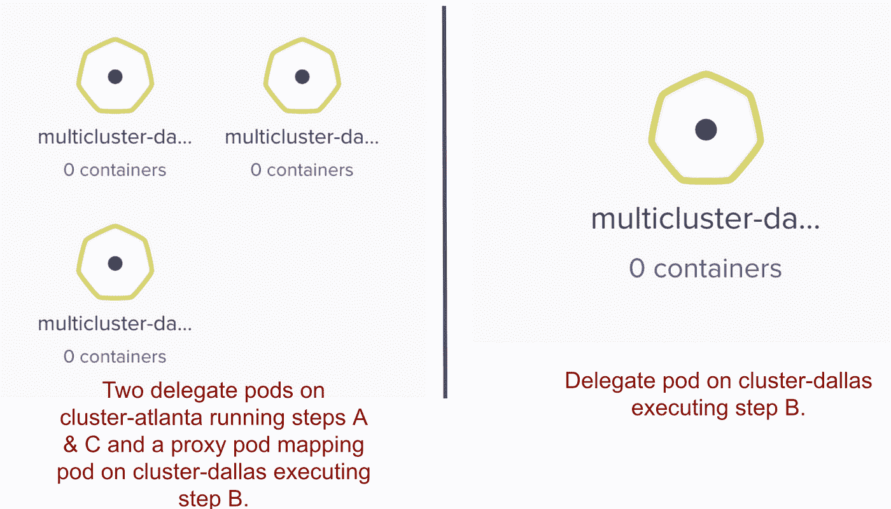

达拉斯群集上的代理工作流窗格和亚特兰大群集上的代理窗格

# Argo CD —使用多集群调度程序在远程集群上停止

[Argo CD](https://github.com/argoproj/argo-cd) 是 GitOps 处理部署的方式，这意味着 git 存储库是事实的单一来源，配置的 Kubernetes 集群镜像来自这些存储库的一切。这属于 Argo 项目，以及 Argo 工作流和 Argo 事件。

工作流提供了一种部署作业的方法，而对于传统的应用程序部署和连续交付，Argo CD 提供了一个接口。在传统设置中，用户可以在提交部署时使用上下文，或者 Argo CD 允许配置多个集群及其端点以针对特定集群，而使用 multicluster-scheduler，集群信息可以被烘焙到 Git 中的部署清单中。

Argo CD 和 multicluster-scheduler 可以有效地满足边缘用例的需求，用户可以使用 GitOps 在中央集群的边缘站点上部署应用程序。

在 cluster-dallas 上从 cluster-atlanta 部署示例留言簿应用程序(Argo CD 部署的集群)

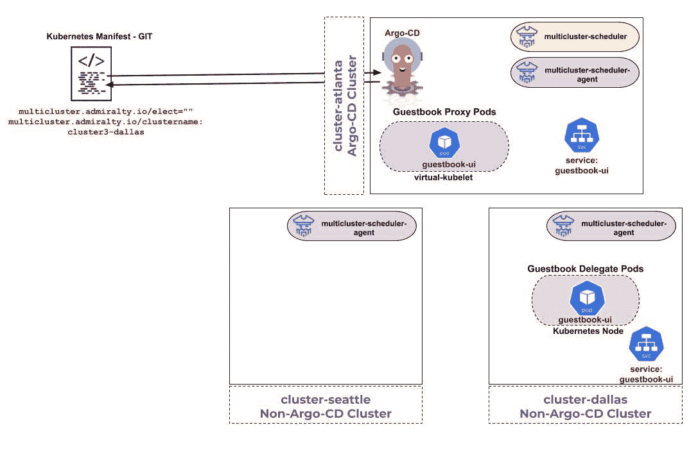

Argo CD —使用多集群调度程序部署到目标集群

Argo CD 和相关组件仅安装在 cluster-atlanta 上:

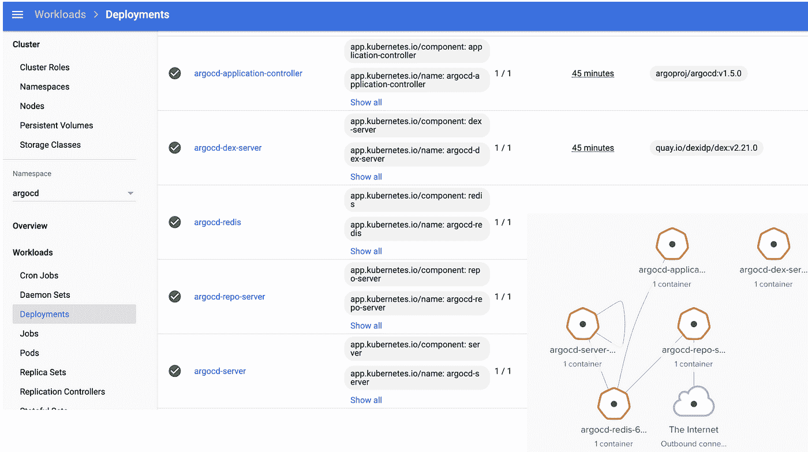

安装在群集上的 Argo CD 组件-亚特兰大

Git 上的部署清单是用 clustername 注释配置的，目标是 cluster-dallas 上的部署:

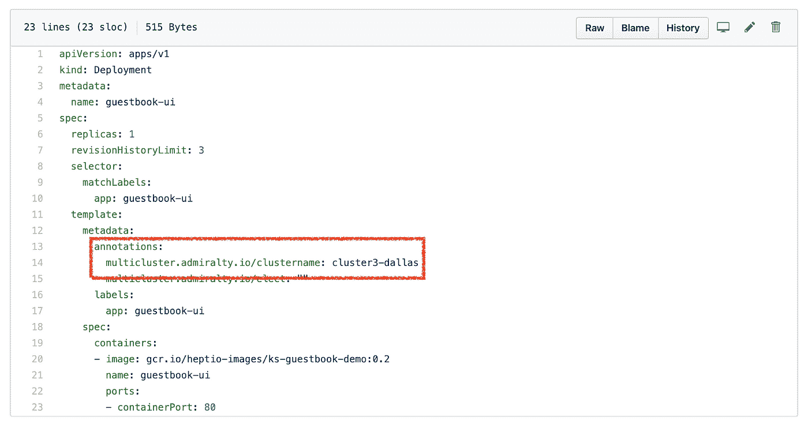

Git 来源:在集群-dallas 上部署强制放置的部署

包含 Git 信息的 Argo CD 部署清单:

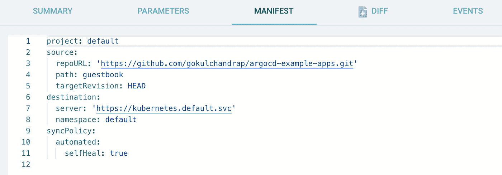

Argo CD —使用 Git 源部署配置

从群集上的 Argo CD 部署留言簿应用程序-atlanta:

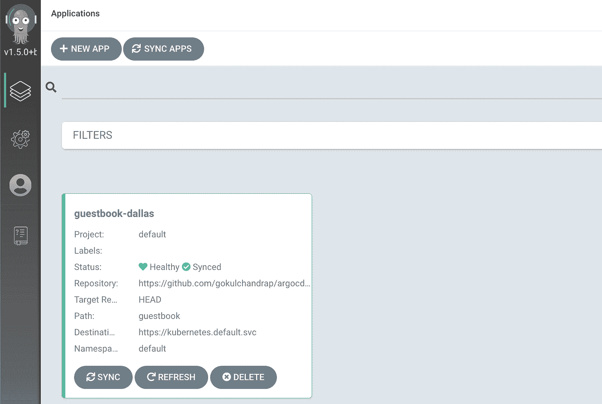

Argo CD 留言簿示例部署

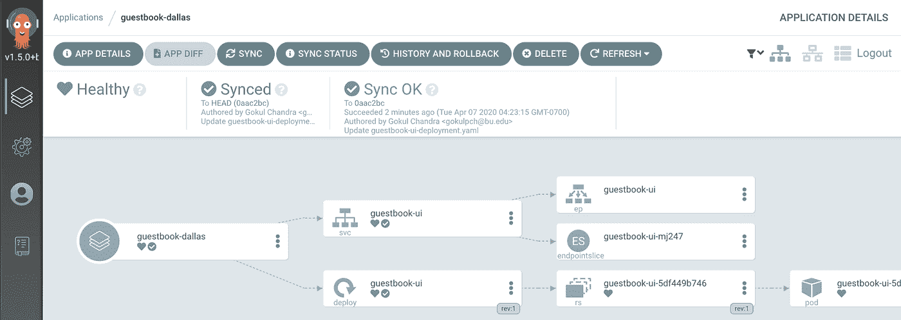

Argo CD 留言簿示例部署

在 virtual-kube let:admiralty on cluster-Atlanta 上创建一个代理 pod，其中源 pod 清单作为注释:

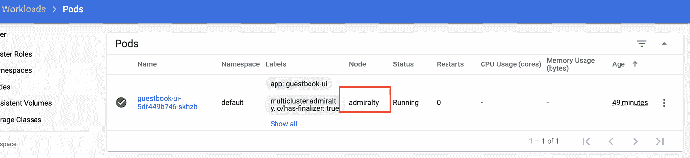

在群集-atlanta 上创建的留言簿代理窗格

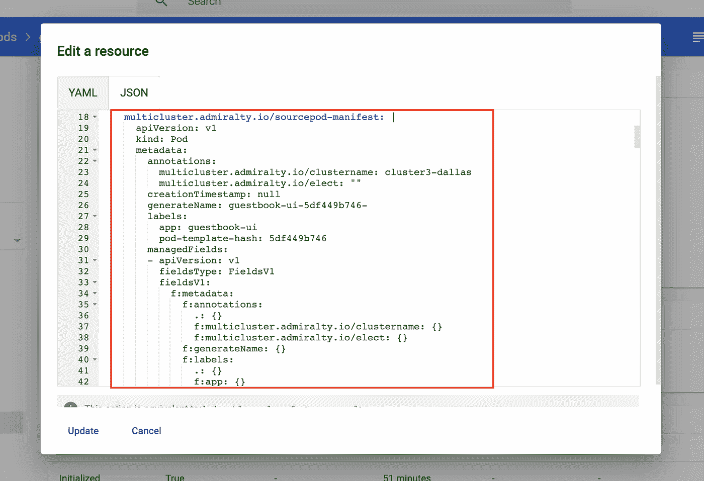

在 cluster-atlanta 上创建的留言簿代理 pod，注释中包含 sourcepod-manifest

实际运行的应用程序容器(delegate pod)基于上面提供的配置部署在 cluster-dallas 上，controller-reference 将 parent-uid 映射到 cluster-atlanta 上运行的代理 pod:

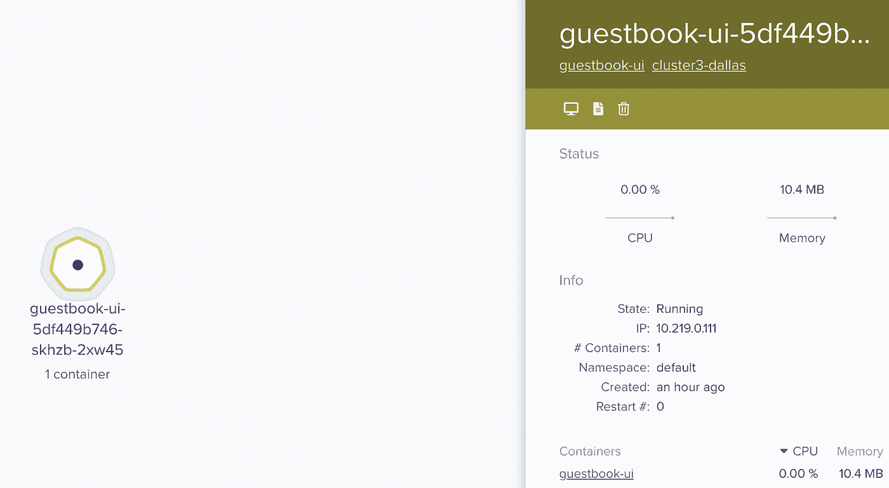

在群集-达拉斯上创建的留言簿代表窗格

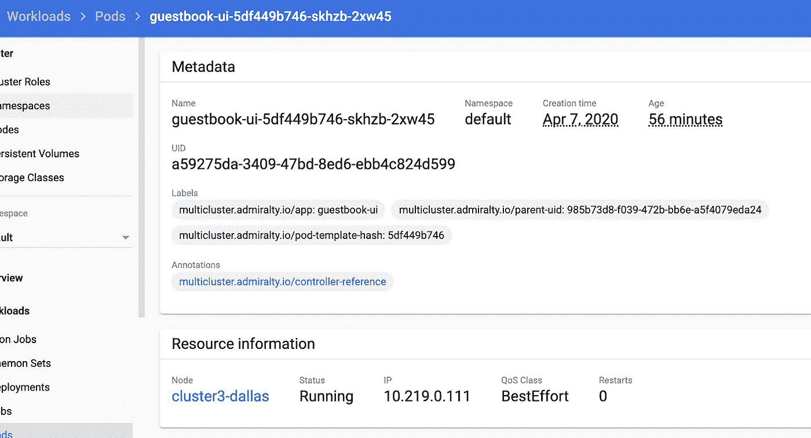

在群集-达拉斯上创建的留言簿代表窗格

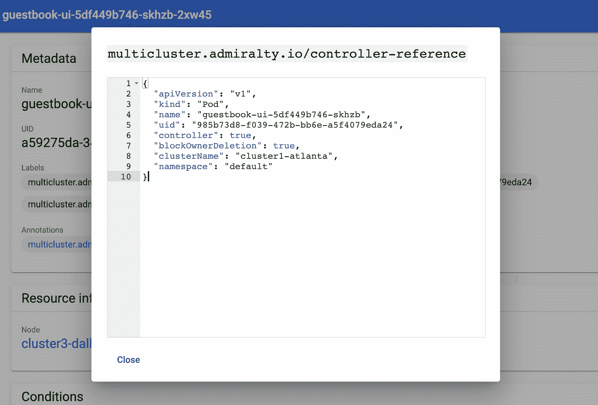

在 cluster-dallas 上创建的留言簿代理 pod，其控制器引用 cluster-atlanta 上的代理 pod

留言簿用户界面服务在集群中复制，目标代理服务被重新路由到代理，并标注有“*io.cilium/global-service=true'.*

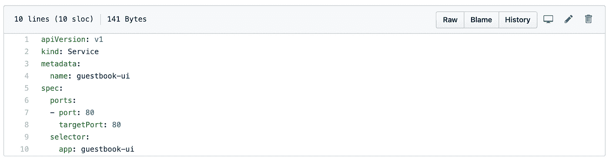

留言簿-ui 服务— Git 源

没有任何端点的群集 atlanta 上的服务 guestbook-ui(因为群集有一个代理 pod)，带有值 guestbook-dallas 的实例标签(群集 dallas 上的 delegate pod)以及启用 Cilium 全局服务负载平衡的注释:

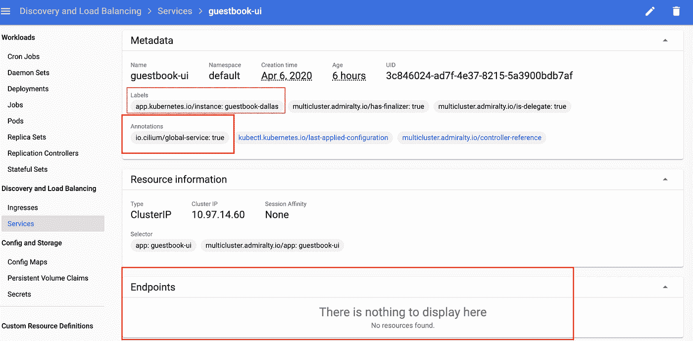

集群上的留言簿-ui 服务-atlanta，无端点和 Cilium global-服务标签自动添加

cluster-dallas 上的服务留言簿-ui，带有端点(delegate pod)、映射本地运行容器的实例标签和启用 Cilium 全局服务负载平衡的注释:

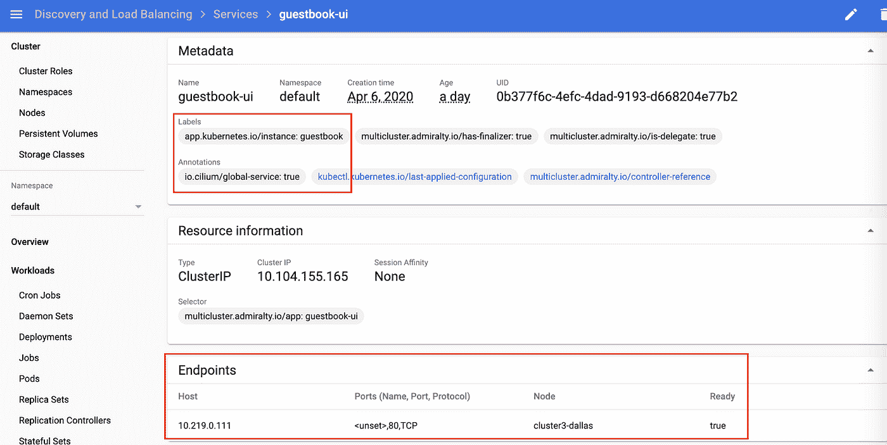

带有端点和 Cilium global 的集群上的留言簿-ui 服务-自动添加服务标签

由于在集群之间启用了 Cilium 集群网状网络，因此集群和子网之间的 pod 间连接已启用，并且使用上述配置，如果从 cluster-atlanta 调用服务，则请求会到达目标代理 pod，然后这些代理 pod 会被重新路由到 cluster-dallas 上的代理 pod:

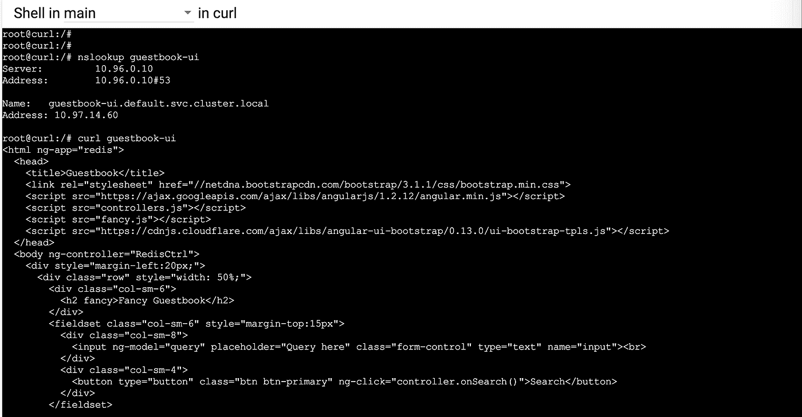

可从 cluster-atlanta 访问的留言簿用户界面服务—对代理 pod 的呼叫被路由到代理人

在多集群和多云环境中运行 Kubernetes，以实现 Kubernetes 的高级功能——如应用程序可移植性、多区域部署、高可用性等。–并避免供应商锁定情形，正受到企业的广泛关注。

跨集群的智能调度在运行这些完全不同的环境中起着关键作用，multicluster-scheduler 提供了一种更简单的方法来在 Kubernetes 本机方法中实现这一点，而不必处理特定的联邦配置和跨多个集群的部署。Argo 可以无缝地利用 multicluster-scheduler，在配置跨不同 Kubernetes 集群调度 workflow pods 的位置时进行粒度控制，而无需更改传统的 Argo 实现。