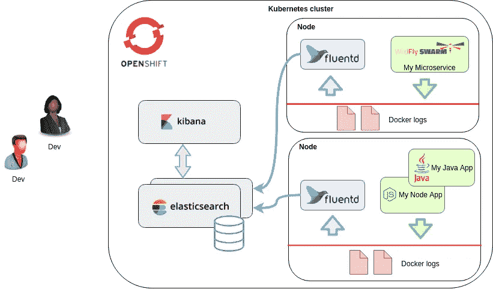
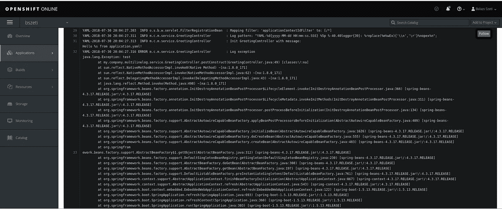
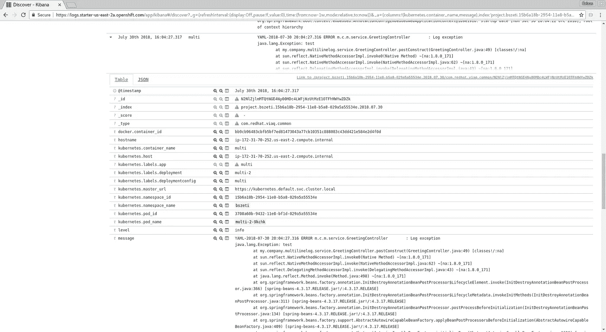

# OpenShift EFK 堆栈中的多行日志

> 原文：<https://itnext.io/multiline-logs-in-openshift-efk-stack-7a7bda4ed055?source=collection_archive---------2----------------------->

在容器中运行应用程序有很多优点，比如水平伸缩和有效的资源管理。开发[云原生](https://www.cncf.io/)应用需要不同的思维模式，熟悉新框架总是需要一个学习曲线。许多传统上由应用服务器提供的特性——部署管理、配置、指标、安全性、日志、监控、[服务查找](https://developers.redhat.com/books/introducing-istio-service-mesh-microservices/)—现在属于容器运行时环境。这很好，因为容器不是特定于语言的，应用程序可以专注于核心业务逻辑。另一方面，云原生应用程序是动态的，本质上是分布式的，这使得日志记录和跟踪等特定任务变得更加复杂。

[Kubernetes](https://kubernetes.io/) 可能是目前最知名的容器运行时。 [Red Hat OpenShift](https://www.openshift.com/) 是一个基于 Kubernetes 的企业级容器应用平台。为了解决从容器中收集和搜索日志的问题，可以使用 EFK (Elasticsearch，Fluentd，Kibana)栈[部署日志聚合](https://docs.openshift.com/container-platform/3.9/install_config/aggregate_logging.html)。理解和调优整个日志记录解决方案可能很复杂，需要深入了解每个组件，但一般目的是从容器的标准输出中收集日志行并编制索引，并用 Kubernetes 元数据标记它们。Docker 日志由每个节点上的 Fluentd 进程收集，并转发给 Elasticsearch 进行存储，Kibana 提供了一个 UI 用于查找。



一旦在集群上成功启动了第一个容器，您可能会注意到的一个问题是，标准输出中的每一行都被作为一个单独的日志事件来处理。只要您构建自己的日志行就可以了，但是在某些情况下(例如，请求负载、Java 堆栈跟踪),您的应用程序最终会丢弃多行日志。如果它们被一行一行地分开，浏览或搜索它们是令人厌倦的，所以让我们试着找到一个解决方案。

问题从码头工人层面开始。无论 Docker 进程的标准输出最终出现在[日志](https://docs.docker.com/config/containers/logging/journald/)还是 [json](https://docs.docker.com/config/containers/logging/json-file/) 日志中，它们都是逐行处理的。在这一层对多条线进行分组的特征请求是一个[死胡同](https://github.com/moby/moby/issues/22920#issuecomment-264036710)。在 [fluentd](https://github.com/fluent-plugins-nursery/fluent-plugin-concat) 中通过一个 regexp 收集多行也许是可能的，但是目前似乎还没有通用的解决方案。虽然我希望有一天社区会提出一个可接受的方法，但是围绕这个主题的大多数讨论得出的结论是“你必须在你的应用程序中处理这个问题”。

在这里，我们尝试了两种解决方法，它们或多或少地处理了这个问题，并且对应用程序的影响很小:

*   '将行尾转换成 CR '\r '
*   使用结构化的 json 日志

> 撰写本帖时使用的软件版本:
> -open shift v 3.9
> -Kubernetes v 1.9
> -Fluentd v 0 . 12 . 42
> -elastic search v 2 . 4 . 4
> -Kibana v 4 . 6 . 4
> -Spring Boot v 1 . 5 . 13
> -log back v 1 . 1 . 11
> -log stash-log back-encoder v 5.1

# 行尾 Hack

传统上，不同的操作系统使用不同的[换行符](https://en.wikipedia.org/wiki/Newline)。现在最常见的是 Unix 风格的 LF *(\n)* 和 Windows 的 CRLF*(\ r \ n)*但是 CR *(\r)* 过去也经常使用。现代软件栈试图通过自动识别和转换不同的风格来减轻处理不同行尾的痛苦。

令人惊讶的是，对于 Openshift EFK 日志堆栈，使用 CR 作为属于同一个日志事件的行的换行符，并在日志事件之间使用常规 LF，这是一个简单的方法。当我们谈论容器时，我们谈论带有 LF *(\n)* 行尾的 Linux 环境。因此，我们需要修改应用程序的日志输出，将一个日志消息中的所有 LF 字符转换为 CR，这可能很困难，也可能不困难，具体取决于所使用的软件栈。

我主要是构建 Java 微服务，所以我尝试了一个使用 Logback 的 Spring Boot 应用程序(同样适用于 Log4j)。这个日志框架有一个 [*替换*](https://logback.qos.ch/manual/layouts.html#replace) 特性，可以用字符串替换正则表达式。这样的日志模式可以在 *application.yml* 中定义如下:

```
logging:
  pattern:
    console: %d %5p %logger: %replace(%m%wEx){'\\n','\r'}%nopex%n
```

基本上是用 CR (\r)代替 LF (\n)，但是表达式需要一些解释。*替换*转换应用于消息`%m`和 java 异常堆栈跟踪(如果有的话)。`%wEx`是 [Spring Boot 特有的](https://docs.spring.io/spring-boot/docs/1.5.13.RELEASE/api/org/springframework/boot/logging/logback/WhitespaceThrowableProxyConverter.html)，但像`%n%ex`周围有一些空格的除外。这里应用了 Java 字符串转义，因此第一个参数是两个字符' \'+'n '的 regexp，而第二个是一个带有一个 CR 字符的字符串(参见下面的 *logback.xml* )。`%nopex`表示我们处理模式中的异常，否则默认情况下 Logback 会再次追加它。

可以使用 CR 的 unicode 值在回溯配置 XML 中设置类似的模式:

> 注意:由于模式布局中的特殊 CR 字符，不容易通过 OpenShift ConfigMap 或容器环境变量(可能是 b64 编码的)来设置它。通常，日志模式是在应用程序打包的属性文件中设置的，所以这不是一个问题。

[这个示例应用程序](https://github.com/bszeti/multiline-log)使用换行符记录一条消息(第 31 行),并在消息开始时抛出一个异常(第 32 行)。默认情况下，所有行都作为单独的日志事件处理。使用上面的日志模式，日志在 OpenShift 控制台上的 pod 页面上是可读的(尽管日志事件被分成 2K 长的段):



同样，在 Kibana 中，日志行属于预期的一个日志事件:



日志事件的 json 视图显示了编码为' \r '的换行符，但是换行符在屏幕上的消息字段中看起来很好。

如果我们试图用 OpenShift `oc`客户端访问 pod 日志，CR 字符会引起问题，但是可以使用一个简单的脚本(perl 或其他)将 CR 转换回 LF:

```
oc logs -f multiline-log-9-sflkm | perl -pe 's/\R/\n/g'
```

# 结构化 json 日志

尽管上面解释的换行符转换在实践中有所帮助，但它确实感觉像是偶然发生的事情。作为一个“合适的解决方案”,我们应该使用结构化日志。在这种情况下，我们的应用程序需要将每个日志事件包装在带有特定字段名的 json 消息中，其中换行符被 json 编码为' \n '。

例如，我们的两行初始化日志事件在标准输出中看起来像这样:

```
{"[@timestamp](http://twitter.com/timestamp)":"2018-07-30T17:15:01.127-04:00", "[@version](http://twitter.com/version)":"1", "message":"**Init GreetingController with message:\nHello %s from application.yaml**!", "logger_name":"my.company.multilinelog.service.GreetingController", "thread_name":"main","level":"INFO","level_value":20000}
```

OpenShift [Fluentd image](https://github.com/openshift/origin-aggregated-logging/tree/v3.9.0/fluentd) 带有预配置的插件，这些插件解析这些 json 日志并将它们合并到转发给 Elasticsearch 的消息中。这不仅有利于多行日志，还保证了日志事件的其他字段(例如时间戳、严重性)在 Elasticsearch 中看起来不错。

对于具有 Logback 或 Log4j 的 Java 应用程序，请看一下[这个详细的 pos](https://developers.redhat.com/blog/2018/01/22/openshift-structured-application-logs/) t。要启用结构化日志，我们必须将[*log stash-Logback-encoder*](https://github.com/logstash/logstash-logback-encoder)*添加到类路径(参见 [pom.xml](https://github.com/bszeti/multiline-log/blob/master/pom.xml) )中，并使用 *LogstashEncoder* ，如本 [*logback.xml*](https://github.com/bszeti/multiline-log/blob/master/src/main/resources/logback-logstash.xml) 所示:*

*使用这种配置，这些日志在 Kibana 中看起来很棒，但是作为一个代价，它们很难在 OpenShift web 控制台上或使用`oc`客户端读取，因为它们是 json 消息。*

*如果你知道如何在其他开发栈和语言中启用结构化日志，请在评论中添加它们或者写一篇关于它的帖子…*

# *摘要*

*尽管“能够处理多行日志”听起来像是一个简单的请求，但是用当前可用的工具集找到一个通用的解决方案是很复杂的。*

*结构化日志记录可能是正确的方法，但是很难想象所有的软件开发栈都同意一个受支持的结构，并且不仅仅是在标准输出上“转储文本”。即使您使用支持这种模式的框架，它也只对生产环境有益。*

*在开发或测试环境中，pod 标准输出的可读性可能比搜索功能更重要。“line ending hack”是一个折中的解决方案，如果您没有现成的结构化 json 日志解决方案，它可能更容易实现。*